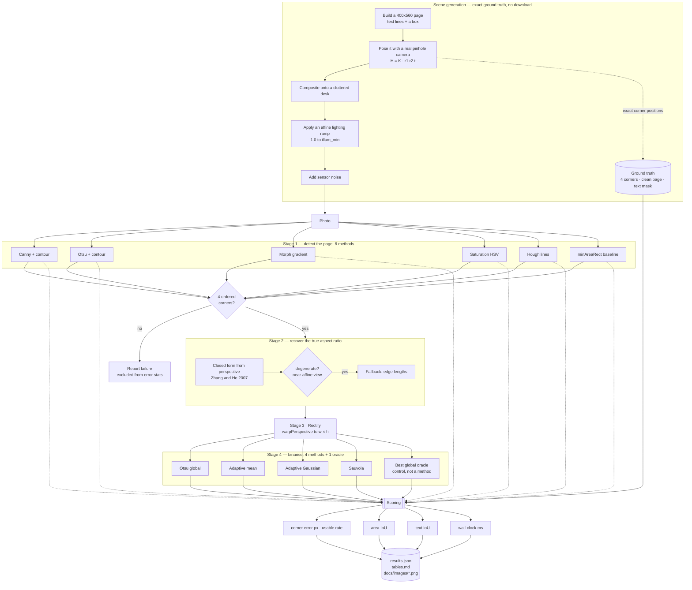

# PROJECT · 01 Document Scanner — complete workflow

This document explains the whole project end to end: the question, the data, the
algorithms, how every number is produced, and why each design decision was made.
For the results themselves see [README.md](README.md).

---

## 1 · The question

> A page is photographed at an angle, on a cluttered desk, under uneven light.
> Every tutorial solves this with "Canny, biggest contour, warp".
> **How many pixels wrong is that, and does anything beat it?**

The point is not to build a scanner — that is a solved problem. The point is to
replace six confident opinions with six measured numbers, and to check that the
usual *explanations* for why methods fail are actually true.

---

## 2 · Complete workflow



---

## 3 · Why synthetic data

A downloaded benchmark gives you *someone else's* ground truth, usually
hand-annotated and approximate. Generating the scene gives you a **perfect** one:
the corner positions are not estimated, they are the numbers that were used to
draw the page.

That makes "how many pixels wrong" a real question with a real answer, and it is
why this project needs no dataset, no download and no network connection.

### The camera model matters

The scene is **not** a page warped between four arbitrary corners. It is:

```
H = K · [ r₁  r₂  t ]        K = [[f, 0, W/2], [0, f, H/2], [0, 0, 1]]
```

a genuine pinhole projection of a planar rectangle, with a random pose resampled
until all four corners land inside the frame.

This is not pedantry. A homography built from four hand-picked corners is not
necessarily the image of *any* rectangle under *any* camera. When the scene was
built that way, the closed-form aspect recovery — an exact method — returned
**32% error**, because there was no consistent camera for it to find. With a real
camera model the same code returns **0.07%**. Every geometric result in this
project depends on that distinction.

### What the generator controls

| Knob | Meaning | Default |
|---|---|---|
| `seed` | camera pose, desk clutter, noise | 0 |
| `illum_min` | brightness at the darkest frame corner; 1.0 = flat light | 0.62 |
| `focal_ratio` | focal length as a fraction of image width | 0.9 |
| `size` | frame size, `(width, height)` — **cv2 order, not numpy's** | (900, 700) |

---

## 4 · Stage 1 — the six detectors

| # | Method | Idea | Why it is in the comparison |
|---|---|---|---|
| 1 | **Canny + contour** | blur → Canny → dilate → largest convex 4-gon | the method every tutorial uses; the one to beat |
| 2 | **Otsu + contour** | the page is brighter than the desk | the simplest thing that could work |
| 3 | **Morph gradient** | dilate − erode, then Otsu | responds to any intensity step, needs no threshold pair |
| 4 | **Saturation (HSV)** | paper is bright and *unsaturated*; the desk is brown | S is `(max−min)/max`, invariant to shading — the hypothesis |
| 5 | **Hough lines** | fit 4 straight edges, intersect them | a page boundary *is* four lines; every edge pixel votes |
| 6 | **minAreaRect** | fit a rotated rectangle to the bright blob | deliberate baseline, included to be beaten |

Two details that decide whether any of them work:

* **The dilation after Canny is load-bearing.** Canny leaves single-pixel gaps
  where the page edge crosses a shadow. `findContours` walks straight through the
  gap and returns the whole image as "the page".
* **`approxPolyDP` epsilon is swept, not fixed.** Too small and sensor noise
  leaves six vertices; too large and a corner is cut off. A single hard-coded
  epsilon is the usual reason a scanner "works sometimes". Seven values are tried
  in order and the first convex 4-gon of plausible area wins.

Corners are then put in canonical **TL, TR, BR, BL** order using the sum/difference
trick. This is not cosmetic: an unordered quad produces a homography that mirrors
or rotates the page, and the corner error then reports a huge number for a
detection that was actually correct.

---

## 5 · Stage 2 — recovering the aspect ratio

The naive approach measures the quad's edge lengths in the image. But the image
is a *projection*: the far edge of the page is foreshortened, so a portrait page
photographed from a low angle measures out nearly square. Mean error **8.01%**,
worst **22.68%**.

A rectangle seen in perspective carries enough information to recover both the
focal length and the true aspect ratio, assuming the principal point is at the
image centre:

```
k₂ = (m₁ × m₄ · m₃) / (m₂ × m₄ · m₃)      n₂ = k₂m₂ − m₁
k₃ = (m₁ × m₄ · m₂) / (m₃ × m₄ · m₂)      n₃ = k₃m₃ − m₁

f²  = −1/(n₂z·n₃z) · [ (n₂x − n₂z·u₀)(n₃x − n₃z·u₀) + (n₂y − n₂z·v₀)(n₃y − n₃z·v₀) ]

w/h = sqrt( n₂ᵀ A⁻ᵀA⁻¹ n₂  /  n₃ᵀ A⁻ᵀA⁻¹ n₃ )
```

Mean error **0.07%**. Two degenerate cases are detected and reported rather than
papered over:

* **the quad is a parallelogram** — the view is effectively affine, the vanishing
  points are at infinity and `f` is unrecoverable;
* **`f² ≤ 0`** — the quad cannot be the image of any rectangle under this model.

In both cases the code falls back to the edge-length estimate and says so.

---

## 6 · Stage 4 — binarisation, and the oracle

Four real methods, plus one control:

| Method | Threshold chosen | Cost |
|---|---|---|
| Otsu (global) | one value, maximising between-class variance | 0.15 ms |
| Adaptive mean | local window mean − C | 0.28 ms |
| Adaptive Gaussian | local Gaussian-weighted mean − C | 0.91 ms |
| Sauvola | local mean scaled by local standard deviation | 12.03 ms |
| **Best global (oracle)** | **exhaustive search over all 255 values** | control only |

**Why the oracle exists.** When Otsu fails on a shadowed page, there are two very
different explanations:

1. ink and paper genuinely overlap, so *no* global threshold can separate them; or
2. a global threshold would work fine, but Otsu picks the wrong one.

Without a control, every failure looks like (1) — which is what the textbooks say.
The oracle distinguishes them, and the answer is **(2)**: at page ratio 0.39 the
oracle scores 0.9638 and Otsu scores 0.4296.

The mechanism: the lighting gradient splits the *paper* into a bright half and a
dark half. That split has larger between-class variance than the real
paper-versus-ink split, so Otsu — which maximises exactly that quantity — cuts
between bright paper and dark paper, flooding the shadowed half solid black.

### The theoretical limit

Paper reflects 245, ink 45. A perfect global cut exists as long as the darkest
paper is still brighter than the brightest ink:

```
245 · r > 45      ⟹      r > 45/245 = 0.184
```

The sweep never goes below 0.366, so a perfect global threshold existed at
**every point measured**. That line is drawn on the figure.

---

## 7 · How scoring avoids flattering anyone

| Trap | How it is avoided |
|---|---|
| Averaging a failure in as "error = 0" would reward giving up | failures are excluded from the error stats and reported as a separate rate |
| Averaging a failure as a large penalty makes the number arbitrary | same fix — rates and errors are kept apart |
| "Found something" is not "found the right thing" | **usable rate** = all four corners within 10 px, reported next to success rate |
| A mean hides catastrophic tails | median and p90 are reported alongside the mean — this is what exposed Hough lines |
| Bad detection would be blamed on the binariser | the binarisation study rectifies with the **true** corners, isolating the stage |
| One cold run is not a timing | `shared/bench.py` discards warm-up runs and reports the median |
| A method with a hand-tuned magic number beats one without | thresholds are derived from the data (Otsu) wherever possible |

---

## 8 · Reproducing everything

```bash
python run.py --scenes 30          # ~3 minutes, CPU only
```

Writes:

```
results/results.json      every number, plus library versions and a UTC timestamp
results/tables.md         the markdown tables pasted into the README
docs/images/detectors.png            six detections vs ground truth
docs/images/binarisers.png           four binarisations at moderate light
docs/images/binarisers_hard.png      the same page in deep shadow, with the oracle
docs/images/illumination_sweep.png   the cliff
docs/images/corner_error.png         mean corner error per detector
docs/images/pipeline.png             the four end-to-end stages
```

`results.json` records the Python, OpenCV, scikit-image and numpy versions used,
because a number without the version that produced it cannot be reproduced or
challenged.

---

## 9 · What this project would need to be production-ready

* real photos, with lens distortion, JPEG artefacts and specular highlights
* a curved-page model (a homography cannot represent a book spine)
* a real OCR engine scored by character error rate, rather than text IoU
* rejection logic — knowing *when* the detector is wrong matters more than
  average accuracy, as the Hough result shows
* a confidence interval on the crossover ratio, which needs far more than 30 scenes
