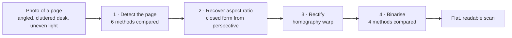
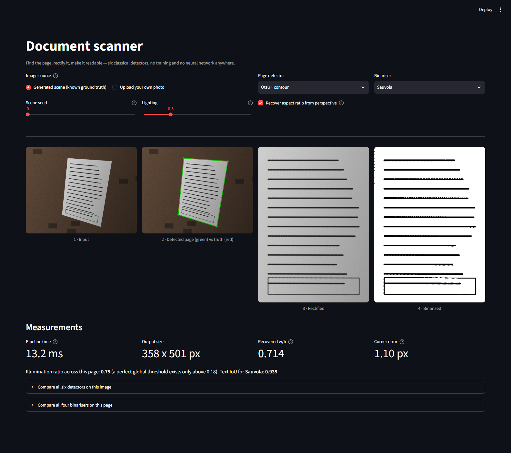
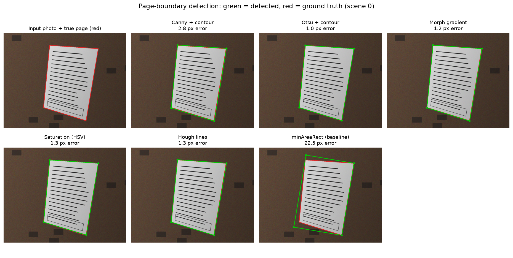
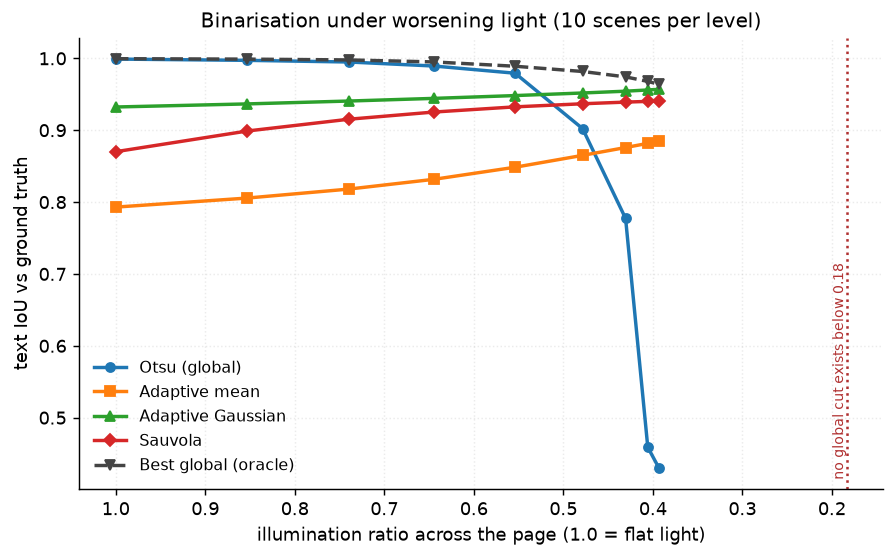
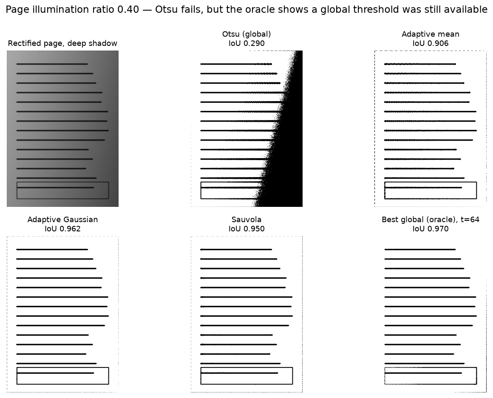

# 01 · Document Scanner — classical computer vision

[](https://www.python.org/)
[](https://opencv.org/)
[](#)
[](#tests)
[](#)

Turn an angled phone photo of a page into a flat, readable scan — using six
classical page-boundary detectors, a homography, and four binarisation methods.
**No neural network, no training, no GPU, no dataset download.** The whole
pipeline runs in about **14 ms** on a CPU.

> **The finding, in one sentence.** Otsu thresholding does not fail under uneven
> lighting because ink and paper become inseparable — at an illumination ratio of
> 0.39 the *best* global threshold still scores **0.964** IoU while Otsu scores
> **0.430**. A global threshold was available; Otsu's criterion simply picked the
> wrong one.

**Jump to:** [What it does](#what-it-does) · [Screenshot](#screenshot) ·
[Input & output](#input--output) · [Results](#results) ·
[Run it yourself](#run-it-yourself) · [Inference](#inference-try-it-on-your-own-image) ·
[How it works](#how-it-works) · [Problems solved](#problems-hit-and-how-they-were-solved) ·
[Limitations](#limitations) · [Keywords](#keywords)

---

## What it does



Each stage is **scored against exact ground truth**, not judged by eye:

| Stage | Metric | Ground truth comes from |
|---|---|---|
| Detect | mean corner error in px, % usable | the scene generator placed the corners |
| Aspect | % error on width/height | the page is built 400 × 560 |
| Rectify | area IoU of the recovered quad | the true page polygon |
| Binarise | IoU of recovered text | the clean page before degradation |
| All | wall-clock ms, median of runs | `shared/bench.py` |

---

## Screenshot

The interactive app. Upload a photo or generate a scene, switch detector and
binariser, and read the error in pixels live:



---

## Input & output

**Input** — either of:

* a **generated scene** (no download): a 400 × 560 page, textured with text
  lines, posed in front of a real pinhole camera on a cluttered desk under a
  lighting gradient. Its four true corner positions are known exactly.
* **your own photo** of any page, uploaded through the UI.

**Output** — four images plus numbers:

| # | Output | What it is |
|---|---|---|
| 1 | Input | the photo as given |
| 2 | Detection overlay | detected quad (green) vs ground truth (red) |
| 3 | Rectified page | the flattened page at its recovered aspect ratio |
| 4 | Binarised page | black text on white paper |

plus **pipeline time (ms)**, **output size**, **recovered width/height ratio**,
and — for generated scenes — **corner error in pixels** and **text IoU**.

---

## Results

All numbers below were produced by `run.py` on 30 generated scenes and are
written to [`results/results.json`](results/results.json) and
[`results/tables.md`](results/tables.md). Nothing here is hand-typed.

### Page-boundary detection (30 scenes)

| Method | Found a quad | Usable (≤10 px) | Mean corner err (px) | Median (px) | p90 (px) | Area IoU | Time (ms) |
|---|---:|---:|---:|---:|---:|---:|---:|
| Canny + contour | 100% | 100% | 2.703 | 2.701 | 2.844 | 0.982 | 2.019 |
| **Otsu + contour** | 100% | **100%** | **1.112** | 1.055 | 1.361 | **0.9931** | **1.55** |
| Morph gradient | 100% | 100% | 1.302 | 1.268 | 1.499 | 0.9915 | 1.808 |
| **Saturation (HSV)** | 100% | **100%** | **1.02** | 0.993 | 1.422 | 0.9932 | 2.321 |
| Hough lines | 100% | 63% | 46.644 | 1.622 | 159.837 | 0.8142 | 6.993 |
| minAreaRect (baseline) | 100% | 17% | 19.486 | 21.79 | 27.029 | 0.8996 | 1.393 |



**Three things worth noting.**

1. **The tutorial method is not the best one.** Canny + contour — what almost
   every "build a document scanner" article uses — lands at 2.70 px. Plain Otsu
   on brightness gets **1.11 px** and is **24% faster**. Saturation does best at
   **1.02 px**, which makes physical sense: HSV saturation is `(max−min)/max`, so
   multiplying a pixel by a shading factor leaves it unchanged. It is the one
   channel the lighting gradient cannot touch.
2. **Hough lines shows why a mean is a bad summary.** Its *median* error is
   1.62 px — better than Canny. Its *mean* is 46.6 px and its p90 is 159.8 px,
   because in 37% of scenes it locks onto a desk edge instead of the page. It
   found a quadrilateral **100%** of the time and was right only **63%** of the
   time. A detector that fails loudly is safer than one that fails confidently.
3. **The rectangle baseline quantifies the perspective.** `minAreaRect` fits a
   rotated rectangle to a shape that is genuinely a general quadrilateral. It is
   usable in only **17%** of scenes and is off by **19.5 px** — that gap is a
   measure of how much perspective distortion is actually present.

### Binarisation, and where Otsu breaks

At a moderate illumination ratio, **Otsu wins** — 0.9977 text IoU against
Sauvola's 0.9067, at **80× the speed** (0.15 ms vs 12.03 ms):

| Method | Text IoU (mean) | Text IoU (median) | Time (ms) |
|---|---:|---:|---:|
| **Otsu (global)** | **0.9977** | 0.9989 | **0.15** |
| Adaptive mean | 0.8111 | 0.8126 | 0.283 |
| Adaptive Gaussian | 0.9408 | 0.9428 | 0.911 |
| Sauvola | 0.9067 | 0.9059 | 12.032 |

So "always use an adaptive threshold for documents" is wrong advice under normal
light. The question is *when* it becomes right. Sweeping the illumination ratio
across the page answers it:



| Page illum. ratio | Otsu (global) | Adaptive mean | Adaptive Gaussian | Sauvola | Best global (oracle) |
|---|---:|---:|---:|---:|---:|
| 1 | 0.999 | 0.793 | 0.9323 | 0.8701 | 0.9995 |
| 0.853 | 0.9972 | 0.8056 | 0.9366 | 0.8989 | 0.9989 |
| 0.7395 | 0.9949 | 0.8181 | 0.9406 | 0.9153 | 0.9978 |
| 0.6444 | 0.9893 | 0.8317 | 0.9443 | 0.9253 | 0.995 |
| 0.5539 | 0.9793 | 0.8485 | 0.9482 | 0.9325 | 0.989 |
| 0.4785 | 0.9022 | 0.865 | 0.9518 | 0.9368 | 0.9817 |
| **0.4305** | **0.7772** | 0.8759 | 0.9543 | 0.9391 | 0.9742 |
| 0.4057 | 0.4588 | 0.8817 | 0.956 | 0.9401 | 0.9679 |
| **0.3931** | **0.4296** | 0.8847 | 0.9569 | 0.9404 | **0.9638** |

Otsu holds ≥0.98 down to a ratio of 0.55, then falls off a cliff — **0.4296 at
ratio 0.39**, a drop of 0.57 IoU over a narrow band. The crossover where it drops
more than 0.05 below Sauvola is **page ratio 0.4305**.

### The part that contradicts the textbook explanation

The standard account is that uneven lighting makes ink and paper overlap, so no
global threshold can separate them. That is testable, and it is **false at these
ratios**. Paper reflects 245 and ink 45, so a perfect global cut exists while the
page ratio stays above **45/245 = 0.184**. Every point in the sweep is above it.

The dashed **oracle** line — the best global threshold found by exhaustive search
over all 255 values — confirms it directly: at ratio 0.39 the oracle scores
**0.9638** where Otsu scores **0.4296**.



Otsu floods the shadowed half of the page solid black. The oracle, at `t = 64`,
returns a clean page. **The separation was available; Otsu's between-class
variance criterion chose the wrong cut**, because the shading creates a spurious
bimodality between the lit and shadowed halves of the *paper* that is stronger
than the real one between paper and ink.

### Aspect-ratio recovery

| Method | True w/h | Recovered w/h | Mean error | Worst error |
|---|---:|---:|---:|---:|
| Edge lengths (tutorial method) | 0.7143 | 0.738 | 8.01% | 22.68% |
| **Perspective (closed form)** | 0.7143 | **0.7138** | **0.07%** | **0.07%** |

Measuring the quad's edge lengths in the image measures the *projection*, not the
page — a portrait page photographed from a low angle comes out nearly square.
Recovering the focal length and aspect ratio in closed form from the four corners
(Zhang & He, 2007) is exact to **0.07%**, a **114× reduction in error**, and it
costs microseconds.

---

## Run it yourself

```bash
# clone
git clone https://github.com/hammas159/classical-computer-vision.git
cd classical-computer-vision/projects/01_document_scanner

# install (~60 MB, no model weights, no dataset)
python -m venv .venv && .venv/Scripts/activate      # Windows
# python3 -m venv .venv && source .venv/bin/activate  # macOS / Linux
pip install "opencv-python-headless<5" scikit-image matplotlib numpy scipy streamlit pytest

# reproduce every number and figure in this README
python run.py --scenes 30

# launch the interactive app
streamlit run ui/app.py
```

`run.py` writes `results/results.json`, `results/tables.md` and every figure in
`docs/images/`. It takes about three minutes on a laptop CPU.

---

## Inference: try it on your own image

```bash
streamlit run ui/app.py
```

Then choose **“Upload your own photo”** and drop in any photo of a page.

You can also call the pipeline directly:

```python
from shared.io import imread, imwrite
import document_scanner as ds

photo = imread("my_page.jpg")                    # RGB uint8
corners, rectified, binary = ds.scan(
    photo,
    detector="Otsu + contour",                   # or any key of ds.DETECTORS
    binariser="Sauvola",                         # or any key of ds.BINARISERS
)

if corners is None:
    print("no page found — try a different detector")
else:
    imwrite("scanned.png", binary)
    print("recovered w/h:", ds.aspect_from_perspective(corners, photo.shape))
```

**On an uploaded photo the corner error cannot be reported** — there is no ground
truth for a real photo. The app says so rather than inventing a number. Use a
generated scene to see the pipeline scored.

---

## How it works

Full walkthrough with the workflow diagram: **[PROJECT.md](PROJECT.md)**.

| File | What is in it |
|---|---|
| [`src/document_scanner.py`](src/document_scanner.py) | the six detectors, four binarisers, aspect recovery, scoring |
| [`run.py`](run.py) | the experiment: writes every number and figure |
| [`ui/app.py`](ui/app.py) | the Streamlit app |
| [`tests/`](tests/) | 22 tests, including the central finding as a regression test |
| `../../shared/` | ground-truth generators, metrics, figures, timing harness |

---

## Problems hit, and how they were solved

Every item here cost real debugging time and changed the result.

### 1 · OpenCV 5 has no Haar cascades — and the planning docs assumed it did

The first install pulled `opencv-python-headless==5.0.0.93`, where `cv2/data/`
contains only `__init__.py`. The bundled cascade XMLs are gone. Project 02 loads
one at runtime, so this would have broken silently later.

**Fixed** by pinning `opencv-python-headless<5` in `pyproject.toml`, with a
comment saying why so nobody "helpfully" unpins it. OpenCV 4.14 ships 17 cascades.

### 2 · The scene generator was not a physically possible camera view

The closed-form aspect recovery returned **32% error** — absurd for an exact
method. The bug was not in the algorithm. The scene warped the page using
`getPerspectiveTransform` between four *hand-picked* corners, and such a
homography is not necessarily the image of a rectangle under **any** pinhole
camera. The method had nothing real to recover.

**Fixed** by building the scene as `H = K · [r₁ r₂ t]` from a real intrinsic
matrix and a real pose. Error fell from **32% → 0.07%**. This is the single most
important fix in the project: without it every geometric result would have been
quietly meaningless.

### 3 · "Otsu fails under uneven light" turned out to be the wrong explanation

The first sweep looked like a clean confirmation of the textbook claim. Adding an
**oracle** — the best global threshold by exhaustive search — showed the claim was
wrong: the oracle scored 0.964 where Otsu scored 0.430. Without that control, a
plausible and widely repeated explanation would have been published as a finding.

### 4 · The saturation detector was being judged unfairly

Its first version used `s < 60`, a magic number, and it scored **104 px** error
while every other method used a data-derived threshold. Replacing the constant
with Otsu on the saturation channel moved it to **1.02 px — the best of the six**.
A comparison is only fair if every method is tuned equally carefully, or equally
carelessly.

### 5 · "Success rate" rewarded confident failure

Hough lines returned a quadrilateral in 100% of scenes, so by "success rate" it
looked perfect. It was *correct* in 63%. Added a separate **usable rate** (all
four corners within 10 px), which is the number that reflects whether you would
ship it.

### 6 · A `(width, height)` / `(rows, cols)` transposition

`document_scene` declared `size=(900, 700)` and unpacked it as `H, W`, so page
corners were generated outside the frame. cv2 uses `(x, y)`, numpy uses
`[row, col]`, and neither complains. **Caught by a test** asserting the corners
lie inside the image, not by looking at pictures.

### 7 · The Windows console cannot print `≤`

`print()` of the results table raised `UnicodeEncodeError: 'charmap' codec` on
cp1252. Fixed once for all projects in `shared/report.py::init_console()`, which
reconfigures stdout to UTF-8. Files were always written with an explicit
`encoding="utf-8"` and were never affected.

### 8 · Headless screenshots captured a skeleton loader

`chrome --screenshot` fires at the load event, but Streamlit renders over a
websocket afterwards, so every capture was an empty grey placeholder.
`--virtual-time-budget` does not help — it fast-forwards timers, not a real
network round trip. Written properly in
[`tools/screenshot.py`](../../tools/screenshot.py), driving the DevTools Protocol
and waiting for the render. The very first working capture revealed a
`ValueError: 0.62 is not in iterable` crash in the UI, from a `select_slider`
default that was not one of its options.

---

## Limitations

* **The scenes are synthetic.** The camera model, lighting ramp and desk clutter
  are all generated. That buys exact ground truth, which is the whole point, but
  a real phone photo adds rolling shutter, JPEG artefacts, motion blur,
  non-linear lens distortion and specular highlights — none of which are here.
* **The page is perfectly flat.** A real page curls. A homography cannot model a
  curved surface, so every method here would degrade on a book spine.
* **The lighting model is a linear ramp**, not a cast shadow with a penumbra.
* **The aspect recovery assumes the principal point is the image centre.** True
  for most cameras, false for a cropped or digitally-stabilised image.
* **Text is horizontal lines, not glyphs.** Text IoU measures whether the ink was
  recovered, not whether an OCR engine could read it. Chaining a real OCR engine
  and reporting character error rate would be a stronger end-to-end metric.
* **The oracle is not a method.** It needs the ground truth it is scored against.
  It is a control, included to explain *why* Otsu fails, and nothing more.
* **`n = 30` scenes.** Enough to separate 1.0 px from 2.7 px; not enough for a
  confidence interval on the crossover ratio.

---

## Tests

```bash
cd classical-computer-vision
python -m pytest projects/01_document_scanner -q
```

22 tests. They cover the geometry (corner ordering is canonical under any input
permutation, a known warp is recoverable), the detectors (every method returns
four ordered corners or an honest `None`, none crash on a blank image), the
scoring (a detector that never detects scores 0% usable, not 100%), and the
central finding itself — that the oracle beats Otsu at the hardest illumination
is asserted as a **regression test**, so a future change that quietly breaks the
result will fail the build.

---

## Keywords

Classical computer vision · document scanner Python · OpenCV document scanning ·
perspective correction OpenCV · four point transform · homography rectification ·
page boundary detection · document binarization · Otsu thresholding failure ·
Sauvola thresholding · Niblack adaptive threshold · uneven illumination document ·
edge detection Canny · Hough line transform · contour approximation approxPolyDP ·
aspect ratio recovery from perspective · Zhang whiteboard scanning ·
camera intrinsic matrix homography · image rectification without deep learning ·
CPU only computer vision · no training computer vision · scanned document
preprocessing · OCR preprocessing pipeline · corner detection accuracy ·
IoU segmentation metric · synthetic ground truth computer vision · Python OpenCV
tutorial alternative · Streamlit computer vision demo

---

## References

* Zhang, Z. & He, L.-W. (2007). *Whiteboard Scanning and Image Enhancement*.
  Digital Signal Processing 17(2), 414–432 — the closed-form focal length and
  aspect-ratio recovery used in `aspect_from_perspective`.
* Otsu, N. (1979). *A Threshold Selection Method from Gray-Level Histograms*.
  IEEE Trans. SMC 9(1), 62–66.
* Sauvola, J. & Pietikäinen, M. (2000). *Adaptive Document Image Binarization*.
  Pattern Recognition 33(2), 225–236.
* Canny, J. (1986). *A Computational Approach to Edge Detection*. IEEE TPAMI
  8(6), 679–698.

---

**Part of [classical-computer-vision](../../README.md)** — measured comparisons of
classical CV algorithms, no deep learning anywhere.
