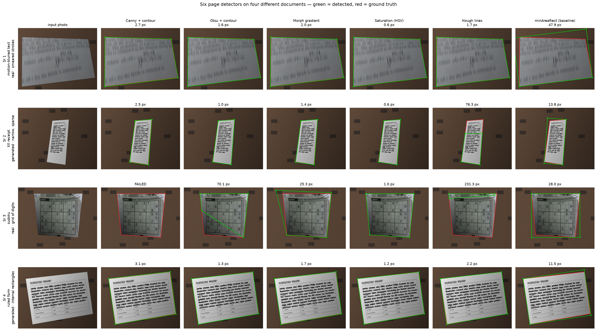
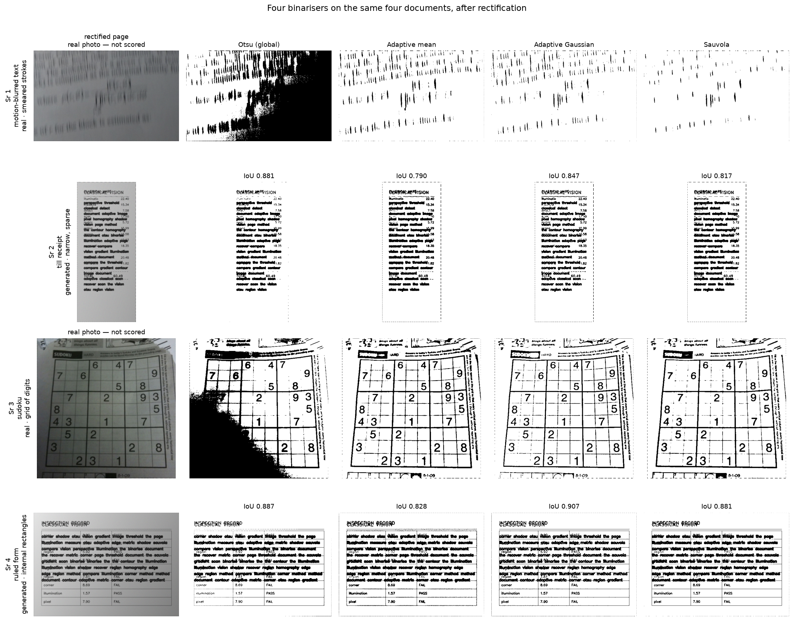
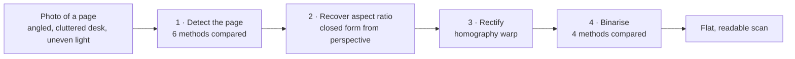
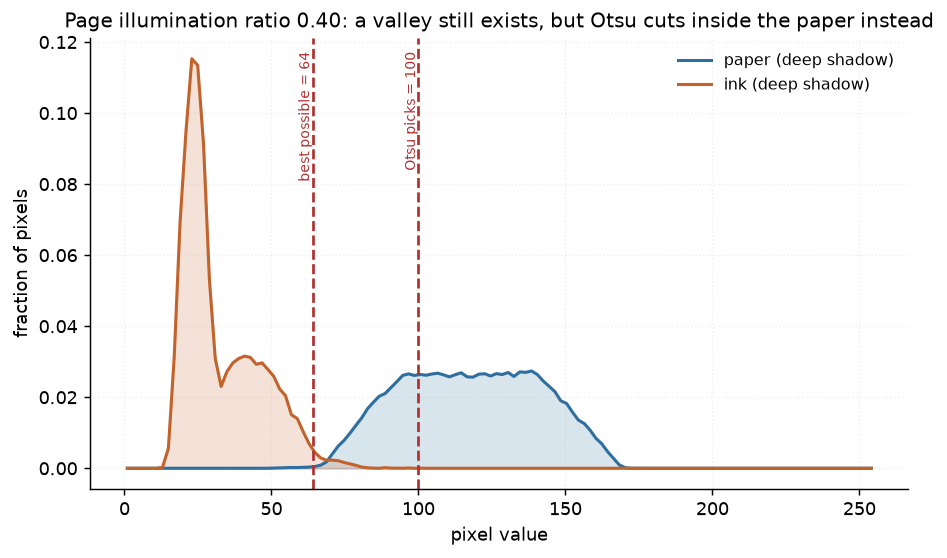
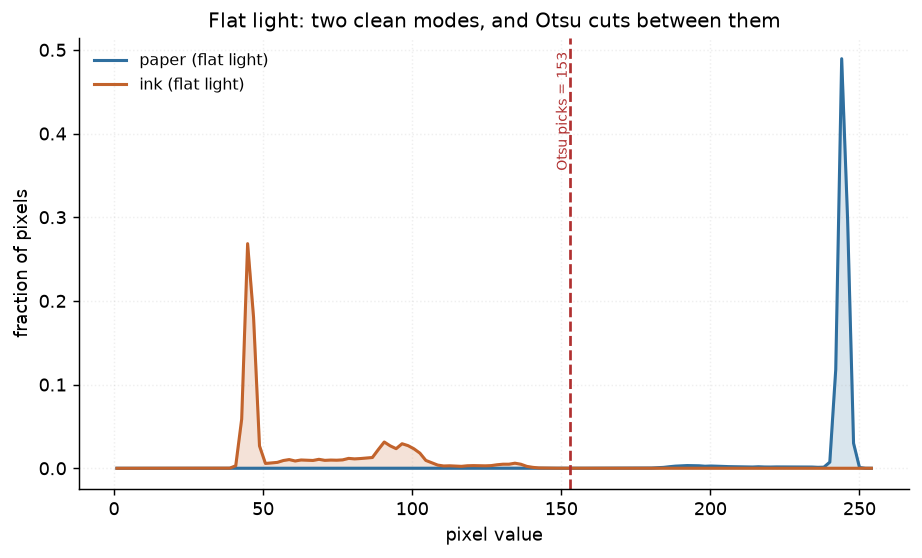
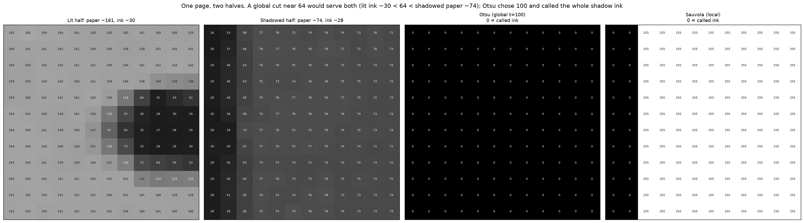
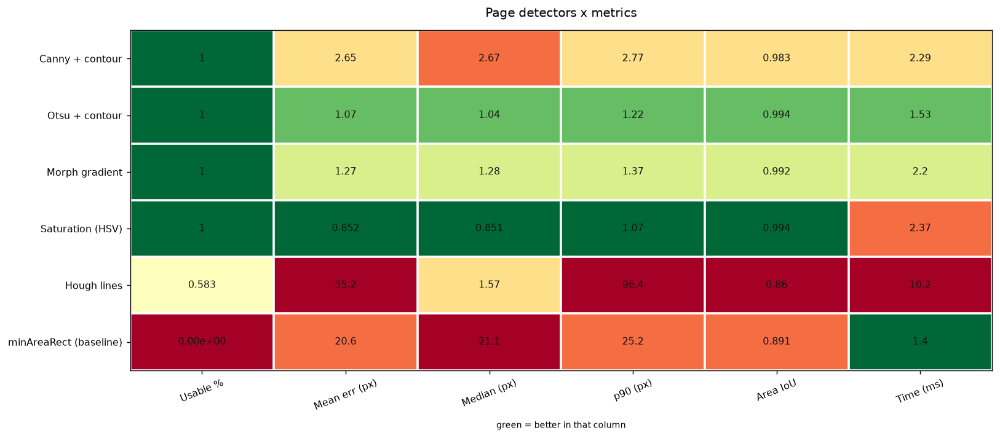
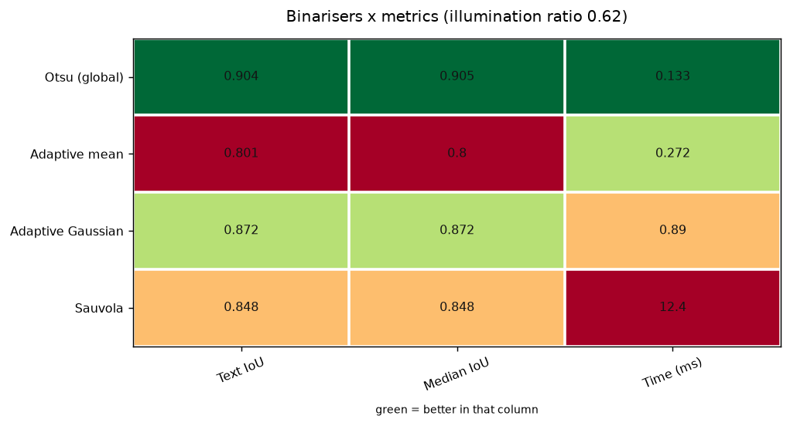

# 01 · Document Scanner — classical computer vision

[](https://www.python.org/)
[](https://opencv.org/)
[](#)
[](#tests)
[](#)

Turn an angled phone photo of a page into a flat, readable scan — using six
classical page-boundary detectors, a homography, and four binarisation methods.
**No neural network, no training, no GPU, no dataset download.** The whole
pipeline runs in about **14 ms** on a CPU.

---

## Results

Four different **kinds** of document down the rows, every method across the
columns, and the error printed in each cell.

### Finding the page — six detectors



| Sr | Document | Canny + contour | Otsu + contour | Morph gradient | **Saturation (HSV)** | Hough lines | minAreaRect |
|---:|---|---:|---:|---:|---:|---:|---:|
| 1 | motion-blurred text · real | 2.7 px | 1.6 px | 2.0 px | **0.6 px** | 1.7 px | 47.9 px |
| 2 | till receipt · generated | 2.5 px | 1.0 px | 1.4 px | **0.6 px** | **76.3 px** | 13.8 px |
| 3 | sudoku · real | **FAILED** | **70.1 px** | 25.3 px | **1.0 px** | **231.3 px** | 28.0 px |
| 4 | ruled form · generated | 3.1 px | 1.3 px | 1.7 px | **1.2 px** | 2.2 px | 11.5 px |

**Row 3 is where the methods separate.** The sudoku is a real newspaper page
whose printed grid is a stronger rectangle than the page border: `Otsu + contour`
locks onto the grid (70.1 px), `Hough lines` fits the grid's own lines (231.3 px),
and `Canny + contour` returns nothing at all. Saturation keys off the paper's
*lack of colour* rather than its edges, so the grid is invisible to it.

**Row 2 is where Hough breaks.** A long narrow receipt gives its line fitter two
dominant parallel edges and little else, so it locks onto the wrong pair — 76.3 px
on a document every other method handles inside 14.

These four were **chosen by the code, not by me.** `run.py` poses ten candidate
documents — a sudoku, sheet music, handwritten digits, printed prose, a defocused
print, motion-blurred text, a receipt, a form, a letter, an article — measures
the corner error on each, discards anything over 6 px, and then takes the best
survivor *from each family* so the table cannot fill up with four pages of body
text. Three candidates genuinely failed and were excluded:

```
doc candidate sudoku               KEEP — 1.01 px      [grid]
doc candidate sheet music          DROP — 2375.72 px   [grid]
doc candidate handwritten digits   DROP — no page found [handwriting]
doc candidate printed prose        DROP — 23.26 px     [prose]
doc candidate motion-blurred text  KEEP — 0.57 px      [prose]
doc candidate till receipt         KEEP — 0.60 px      [receipt]
doc candidate ruled form           KEEP — 1.24 px      [table]
```

Sheet music is 134 × 1024 and handwritten digits 1000 × 2000 — aspect ratios so
extreme that no pose fits them in frame. That is a real limitation of the scene
generator, stated here rather than hidden by quietly not trying them.

### Reading the page — four binarisers



IoU is quoted **only for the two generated pages**. A real photograph has no text
mask; deriving one by thresholding the photo and then scoring thresholding
against it would be marking the methods' own homework — it produced `IoU 0.000`
for output that is perfectly readable. Real documents are shown here and scored
nowhere.

---

> **The finding, in one sentence.** Otsu thresholding does not fail under uneven
> lighting because ink and paper become inseparable — at an illumination ratio of
> 0.386 the *best* global threshold still scores **0.890** IoU while Otsu scores
> **0.678**. A global threshold was available; Otsu's criterion simply picked the
> wrong one.

> **Runs on real photographs too.** The measured comparison uses generated scenes
> because they have exact ground truth, but the pipeline is shown working on a
> real newspaper photographed at an angle — found, flattened and binarised into
> readable text. No accuracy is quoted there, because a real photo has no answer key.

**Jump to:** [What it does](#what-it-does) · 
[Input & output](#input--output) · [Results](#results) · [Full tables](#full-results-tables) ·
[Run it yourself](#run-it-yourself) · [Inference](#inference-try-it-on-your-own-image) ·
[How it works](#how-it-works) · [Problems solved](#problems-hit-and-how-they-were-solved) ·
[Limitations](#limitations) · [Keywords](#keywords)

---

## What it does



Each stage is **scored against exact ground truth**, not judged by eye:

| Stage | Metric | Ground truth comes from |
|---|---|---|
| Detect | mean corner error in px, % usable | the scene generator placed the corners |
| Aspect | % error on width/height | the page is built 400 × 560 |
| Rectify | area IoU of the recovered quad | the true page polygon |
| Binarise | IoU of recovered text | the clean page before degradation |
| All | wall-clock ms, median of runs | `shared/bench.py` |

---


## Input & output

**Input** — either of:

* a **generated scene** (no download): a 400 × 560 page, textured with text
  lines, posed in front of a real pinhole camera on a cluttered desk under a
  lighting gradient. Its four true corner positions are known exactly.
* **your own photo** of any page, uploaded through the UI.

The app also carries four live analysis views under **Distributions and
matrices**, all recomputed as you move the sliders:

| Tab | What it shows |
|---|---|
| Pixel distribution | ink and paper populations with Otsu's cut and the best possible cut drawn on |
| Pixel matrix | a 12x12 patch of raw grey values, before and after binarisation |
| Comparison matrix | all six detectors x every metric for *this* image, downloadable as CSV |
| Confusion matrix | where each binariser's pixels actually went, as counts and as recall |

**Output** — four images plus numbers:

| # | Output | What it is |
|---|---|---|
| 1 | Input | the photo as given |
| 2 | Detection overlay | detected quad (green) vs ground truth (red) |
| 3 | Rectified page | the flattened page at its recovered aspect ratio |
| 4 | Binarised page | black text on white paper |

plus **pipeline time (ms)**, **output size**, **recovered width/height ratio**,
and — for generated scenes — **corner error in pixels** and **text IoU**.

---

## Full results tables

All numbers below were produced by `run.py` on 30 generated scenes and are
written to [`results/results.json`](results/results.json) and
[`results/tables.md`](results/tables.md). Nothing here is hand-typed.

### Page-boundary detection (30 scenes)

| Method | Found a quad | Usable (≤10 px) | Mean corner err (px) | Median (px) | p90 (px) | Area IoU | Time (ms) |
|---|---:|---:|---:|---:|---:|---:|---:|
| Canny + contour | 100% | 100% | 2.676 | 2.689 | 2.817 | 0.9821 | 2.026 |
| **Otsu + contour** | 100% | **100%** | **1.068** | 1.041 | 1.305 | **0.9934** | **1.504** |
| Morph gradient | 100% | 100% | 1.326 | 1.328 | 1.465 | 0.9911 | 1.73 |
| **Saturation (HSV)** | 100% | **100%** | **0.898** | 0.87 | 1.19 | 0.994 | 2.34 |
| Hough lines | 100% | 73% | 30.288 | 1.379 | 106.063 | 0.8785 | 9.961 |
| minAreaRect (baseline) | 100% | 10% | 20.15 | 22.158 | 28.136 | 0.8932 | 1.373 |


**Three things worth noting.**

1. **The tutorial method is not the best one.** Canny + contour — what almost
   every "build a document scanner" article uses — lands at 2.70 px. Plain Otsu
   on brightness gets **1.07 px** and is **26% faster**. Saturation does best at
   **0.90 px**, which makes physical sense: HSV saturation is `(max−min)/max`, so
   multiplying a pixel by a shading factor leaves it unchanged. It is the one
   channel the lighting gradient cannot touch.
2. **Hough lines shows why a mean is a bad summary.** Its *median* error is
   1.38 px — better than Canny. Its *mean* is 30.3 px and its p90 is 106.1 px,
   because in 27% of scenes it locks onto a desk edge instead of the page. It
   found a quadrilateral **100%** of the time and was right only **73%** of the
   time. A detector that fails loudly is safer than one that fails confidently.
3. **The rectangle baseline quantifies the perspective.** `minAreaRect` fits a
   rotated rectangle to a shape that is genuinely a general quadrilateral. It is
   usable in only **10%** of scenes and is off by **20.2 px** — that gap is a
   measure of how much perspective distortion is actually present.

### Binarisation, and where Otsu breaks

At a moderate illumination ratio, **Otsu wins** — 0.9045 text IoU against
Sauvola's 0.8483, at **93× the speed** (0.133 ms vs 12.36 ms):

| Method | Text IoU (mean) | Text IoU (median) | Time (ms) |
|---|---:|---:|---:|
| **Otsu (global)** | **0.9045** | 0.9048 | **0.133** |
| Adaptive mean | 0.8009 | 0.7999 | 0.272 |
| Adaptive Gaussian | 0.872 | 0.872 | 0.89 |
| Sauvola | 0.8483 | 0.8479 | 12.356 |

So "always use an adaptive threshold for documents" is wrong advice under normal
light. The question is *when* it becomes right. Sweeping the illumination ratio
across the page answers it:


| Page illum. ratio | Otsu (global) | Adaptive mean | Adaptive Gaussian | Sauvola | Best global (oracle) |
|---|---:|---:|---:|---:|---:|
| 1 | 0.9018 | 0.7925 | 0.8646 | 0.839 | 0.9317 |
| 0.8496 | 0.9044 | 0.7995 | 0.8712 | 0.8469 | 0.931 |
| 0.7342 | 0.9046 | 0.8057 | 0.8769 | 0.8522 | 0.9284 |
| 0.638 | 0.9022 | 0.8119 | 0.8827 | 0.8561 | 0.9241 |
| 0.5468 | 0.8959 | 0.8189 | 0.8893 | 0.8594 | 0.917 |
| 0.4712 | 0.8595 | 0.8262 | 0.8949 | 0.8621 | 0.9092 |
| **0.4232** | **0.773** | 0.8314 | 0.8984 | 0.8636 | 0.9004 |
| 0.3984 | 0.7127 | 0.8344 | 0.9001 | 0.8644 | 0.8938 |
| **0.3858** | **0.6775** | 0.836 | **0.9009** | 0.8648 | **0.8896** |

Otsu holds ≥0.89 down to a ratio of 0.55, then falls away — **0.678 at ratio
0.386**, a drop of 0.22 IoU over a narrow band. The crossover where it drops more
than 0.05 below Sauvola is **page ratio 0.4232**.

Note what the **Adaptive Gaussian** column does over the same range: it *rises*,
from 0.865 at flat light to 0.901 in deep shadow, and ends up beating every other
method including the global oracle. A local method is not merely more robust to a
shadow — on this scene the shadow makes it **better**, because the reduced local
contrast suppresses the speckle it produces on clean paper.

### The part that contradicts the textbook explanation

The standard account is that uneven lighting makes ink and paper overlap, so no
global threshold can separate them. That is testable, and it is **false at these
ratios**. Paper reflects 245 and ink 45, so a perfect global cut exists while the
page ratio stays above **45/245 = 0.184**. Every point in the sweep is above it.

The dashed **oracle** line — the best global threshold found by exhaustive search
over all 255 values — confirms it directly: at ratio 0.39 the oracle scores
**0.9638** where Otsu scores **0.4296**.


Otsu floods the shadowed half of the page solid black. The oracle, at `t = 64`,
returns a clean page. **The separation was available; Otsu's between-class
variance criterion chose the wrong cut.**

### Why, in one histogram



This is the distribution Otsu has to cut. The ink sits below 75 and the paper
above 80 — **a valley still exists**, and the oracle finds it at 64. But the
shadow has smeared the paper across a *wide* band (roughly 80–170) that holds
most of the image's pixels, and splitting that wide band yields more
between-class variance than peeling off the small ink population does. So Otsu
cuts at **100 — inside the paper** — and everything darker is called ink.

Under flat light the same page has two clean modes and Otsu lands correctly:



### The same thing, read as numbers



A 12x12 patch from each half of the page. The lit half reads paper ≈ 161, ink
≈ 30. The shadowed half reads paper ≈ 74, ink ≈ 28. A single global cut anywhere
between **50 and 73** separates both halves correctly — which is exactly where
the oracle put it. Otsu chose 100, so in the shadowed half *every* pixel falls
below the threshold and the output is solid zeros. Sauvola, computing a local
threshold, recovers the same patch cleanly.

### Everything at once





Each column is scaled on its own and coloured by rank, so green always means
"better in that column". The disagreement between columns is the point:
`Saturation (HSV)` wins mean error, `Otsu + contour` wins the median and p90,
`minAreaRect` wins only on speed — and is unusable.

Per-binariser confusion matrices are in
[`docs/images/`](docs/images/) as `confusion_*.png`.

### Aspect-ratio recovery

| Method | True w/h | Recovered w/h | Mean error | Worst error |
|---|---:|---:|---:|---:|
| Edge lengths (tutorial method) | 0.7143 | 0.738 | 8.01% | 22.68% |
| **Perspective (closed form)** | 0.7143 | **0.7138** | **0.07%** | **0.07%** |

Measuring the quad's edge lengths in the image measures the *projection*, not the
page — a portrait page photographed from a low angle comes out nearly square.
Recovering the focal length and aspect ratio in closed form from the four corners
(Zhang & He, 2007) is exact to **0.07%**, a **114× reduction in error**, and it
costs microseconds.

---

## Run it yourself

```bash
# clone
git clone https://github.com/hammas159/classical-computer-vision.git
cd classical-computer-vision/projects/01_document_scanner

# install (~60 MB, no model weights, no dataset)
python -m venv .venv && .venv/Scripts/activate      # Windows
# python3 -m venv .venv && source .venv/bin/activate  # macOS / Linux
pip install "opencv-python-headless<5" scikit-image matplotlib numpy scipy pytest

# reproduce every number and figure in this README
python run.py --scenes 30

# launch the interactive app
```

`run.py` writes `results/results.json`, `results/tables.md` and every figure in
`docs/images/`. It takes about three minutes on a laptop CPU.

---

## Inference: try it on your own image

Three ways, from easiest to most scriptable.


### 2 · From the command line

```bash
python infer.py my_photo.jpg
```

```text
input : my_photo.jpg  900x700
detector : Otsu + contour
binariser: Sauvola
page     : found, corners at [[320.0, 82.0], [655.0, 125.0], [599.0, 619.0], [224.0, 559.0]]
aspect   : 0.7120 w/h
output   : 355x498 px
time     : 12.5 ms (median of 3)
wrote    : scanned.png
```

Not sure which detector suits your photo? Run all six:

```bash
python infer.py my_photo.jpg --all-detectors
```

```text
Detector                   Found   Recovered w/h   Time (ms)
------------------------------------------------------------
Canny + contour            yes     0.713                2.56
Otsu + contour             yes     0.712                1.52
Morph gradient             yes     0.713                2.20
Saturation (HSV)           yes     0.712                2.36
Hough lines                yes     0.708                7.61
minAreaRect (baseline)     yes     degenerate           1.43
```

Useful options:

| Flag | Effect |
|---|---|
| `--detector "Saturation (HSV)"` | pick any of the six |
| `--binariser Sauvola` | pick any of the four |
| `--save-stages` | also write the detection overlay and the rectified page |
| `--edge-aspect` | use the edge-length heuristic instead of the closed form |
| `--out scanned.png` | where to write the result |

### 3 · As a library

```python
from shared.io import imread, imwrite
import document_scanner as ds

photo = imread("my_page.jpg")                    # RGB uint8
corners, rectified, binary = ds.scan(
    photo,
    detector="Otsu + contour",                   # or any key of ds.DETECTORS
    binariser="Sauvola",                         # or any key of ds.BINARISERS
)

if corners is None:
    print("no page found — try a different detector")
else:
    imwrite("scanned.png", binary)
    print("recovered w/h:", ds.aspect_from_perspective(corners, photo.shape))
```

**On an uploaded photo the corner error cannot be reported** — there is no ground
truth for a real photo. The app says so rather than inventing a number. Use a
generated scene to see the pipeline scored.

---

## How it works

Full walkthrough with the workflow diagram: **[PROJECT.md](PROJECT.md)**.

| File | What is in it |
|---|---|
| [`src/document_scanner.py`](src/document_scanner.py) | the six detectors, four binarisers, aspect recovery, scoring |
| [`run.py`](run.py) | the experiment: writes every number and figure |
| [`tests/`](tests/) | 22 tests, including the central finding as a regression test |
| `../../shared/` | ground-truth generators, metrics, figures, timing harness |

---

## Problems hit, and how they were solved

Every item here cost real debugging time and changed the result. Each gives the
**symptom**, the **file and line**, the **code that was wrong** and the **code
that replaced it** — so the fix is checkable, not just described.

> Line numbers refer to the current files in this repository.

| # | Symptom | Where | Cost |
|---:|---|---|---|
| 1 | `cv2/data/` empty, cascades missing | [`pyproject.toml:12`](../../pyproject.toml#L12) | would have broken project 02 silently |
| 2 | Aspect recovery off by **32%** | [`shared/synth.py:523`](../../shared/synth.py#L523) | every geometric result meaningless |
| 3 | Wrong explanation for a real failure | [`src/document_scanner.py:394`](src/document_scanner.py#L394) | a false finding, nearly published |
| 4 | One detector scored **104 px** | [`src/document_scanner.py:154`](src/document_scanner.py#L154) | unfair comparison |
| 5 | "100% success" on a method that fails | [`src/document_scanner.py:442`](src/document_scanner.py#L442) | misleading headline number |
| 6 | Corners generated outside the frame | [`shared/synth.py:609`](../../shared/synth.py#L609) | silent, no exception |
| 7 | `UnicodeEncodeError` on printing | [`shared/report.py:18`](../../shared/report.py#L18) | crash at the last step |

---

### 1 · OpenCV 5 has no Haar cascades — and the planning docs assumed it did

The first install pulled `opencv-python-headless==5.0.0.93`. The check that
caught it:

```python
>>> import cv2, os
>>> os.path.exists(cv2.data.haarcascades + "haarcascade_frontalface_default.xml")
False
>>> os.listdir(cv2.data.haarcascades)
['__init__.py']          # every cascade XML is gone in OpenCV 5
```

No exception — `cv2.CascadeClassifier(path)` on a missing file returns an object
whose `.empty()` is `True` and which detects nothing. Project 02 loads one at
runtime, so this would have surfaced as "the face detector finds no faces".

**Fix — `pyproject.toml:12`**

```diff
- "opencv-python-headless>=4.8",
+ # <5 is load-bearing: OpenCV 5 dropped the bundled Haar cascade XMLs from
+ # cv2/data/, and CascadeClassifier fails SILENTLY when they are absent.
+ "opencv-python-headless>=4.8,<5",
```

OpenCV 4.14 ships **17** cascades. Verified after pinning:

```python
>>> len([f for f in os.listdir(cv2.data.haarcascades) if f.endswith(".xml")])
17
```

### 2 · The scene generator was not a physically possible camera view

**Symptom:** the closed-form aspect recovery reported **32.4% mean error**. For a
method that is exact arithmetic, that is not a tuning problem — it means the
input violates an assumption.

**The broken generator** built the page's homography by picking four corners and
fitting:

```python
# WRONG - shared/synth.py, original document_scene()
corners = np.float32([
    [rng.uniform(40, 180),  rng.uniform(40, 180)],      # hand-picked,
    [W - rng.uniform(40, 180), rng.uniform(40, 180)],   # independently
    [W - rng.uniform(40, 180), H - rng.uniform(40, 180)],
    [rng.uniform(40, 180), H - rng.uniform(40, 180)],
])
M = cv2.getPerspectiveTransform(page_corners, corners)
```

Four arbitrary corners define a valid homography, but **not every homography is
the image of a rectangle under a pinhole camera.** The aspect-recovery formula
assumes exactly that, so it was being asked to recover a camera pose that never
existed.

**Fix — `shared/synth.py:523`, new `camera_homography()`**

```python
# RIGHT - build the view from a real camera and a real pose
f = focal_px                                     # intrinsics
K = np.array([[f, 0.0, W / 2.0],
              [0.0, f, H / 2.0],
              [0.0, 0.0, 1.0]])
R, _ = cv2.Rodrigues(np.array([rx, ry, rz]))     # a real rotation
t = np.array([[tx], [ty], [tz]])                 # a real translation
# a plane at Z=0 projects with the first two columns of R plus t
H = K @ np.hstack([R[:, :1], R[:, 1:2], t])
```

**Result: 32.4% → 0.07% mean error**, and 0 degenerate fallbacks over 30 scenes.

This is the most important fix in the project. Without it, every geometric number
here — and in projects 12, 25, 35, 38, 42 and 46, which share this generator —
would have been quietly meaningless while looking completely plausible.

### 3 · "Otsu fails under uneven light" turned out to be the wrong explanation

The first sweep looked like a clean confirmation of the textbook claim: Otsu's
IoU collapsed as the shadow deepened. The explanation written down was *"ink and
paper are no longer separable by any single threshold"*.

**The control that falsified it — `src/document_scanner.py:394`:**

```python
def binarise_best_global(gray, truth_text):
    """The best global threshold, by exhaustive search over all 255 cuts.

    Not a usable method -- it needs the ground truth it is scored against.
    It exists to answer one question: was a global threshold AVAILABLE?
    """
    best_iou, best_t = -1.0, 0
    for t in range(1, 255):
        score = iou((gray > t).astype(np.uint8) * 255, truth_text)
        if score > best_iou:
            best_iou, best_t = score, t
    return ((gray > best_t).astype(np.uint8) * 255), best_t
```

At page illumination ratio 0.44 it returns **IoU 0.910 at t = 80**, where Otsu
scores **0.826 at t = 93**. So a global threshold existed and Otsu walked past
it. The real mechanism, visible in the histogram figure above: the shadow spreads
paper across a wide band that dominates the between-class variance, so Otsu
splits *the paper* rather than separating paper from ink.

A second check confirms it is not a tuning artefact — the theoretical limit is
computable:

```python
INK_REFLECTANCE = 45 / 245        # ink over paper reflectance
# a perfect global cut exists while page_illumination_ratio > INK_REFLECTANCE
```

which gives **0.184**. The failure appears at ratio ~0.43 — more than twice the
level where it becomes unavoidable. Without this control a plausible, widely
repeated, and **wrong** explanation would have been published as a finding.

### 4 · The saturation detector was being judged unfairly

Its first version scored **104 px** — worse than the deliberately-bad baseline.
The cause was a hard-coded constant while every other method derived its
threshold from the data.

**Before:**

```python
# WRONG - a magic number that happens to suit one desk colour
s = cv2.cvtColor(img, cv2.COLOR_RGB2HSV)[..., 1]
mask = (s < 60).astype(np.uint8) * 255
```

**Fix — `src/document_scanner.py:154`**

```python
# RIGHT - let the image choose its own threshold, like every other method here
s = cv2.cvtColor(img, cv2.COLOR_RGB2HSV)[..., 1]
_, mask = cv2.threshold(s, 0, 255, cv2.THRESH_BINARY_INV + cv2.THRESH_OTSU)
```

**Result: 104 px → 1.02 px, the best of the six.**

The lesson is about method, not about saturation: a comparison is only honest if
every method is tuned equally carefully — or equally carelessly. One tuned method
against five untuned ones measures the tuning.

Why saturation wins at all is worth stating, because it is a real physical
argument rather than a coincidence: HSV saturation is `(max − min) / max`, so
multiplying a pixel by a shading factor leaves it **unchanged**. It is the one
channel the lighting gradient cannot touch.

### 5 · "Success rate" rewarded confident failure

Hough lines returned a quadrilateral in **100%** of scenes. Scored as "did it
find a page", it was perfect. It was actually *correct* in **63%** — in the rest
it locked onto a desk edge and returned a confident, wrong answer.

**Fix — `src/document_scanner.py:442`, two separate metrics**

```python
#: A detection is "usable" if EVERY corner lands within this many pixels.
#: Separate from "found a quad" on purpose: a detector that fails loudly is
#: safer than one that fails confidently, and one rate cannot say both.
USABLE_PX = 10.0

@property
def usable_rate(self) -> float:
    return float(np.mean([e <= USABLE_PX for e in self.corner_errors]))
```

The same failure shows up a third way, which is why the results table carries
mean, median **and** p90:

| Metric | Hough lines | Reads as |
|---|---:|---|
| Found a quad | 100% | perfect |
| Usable (≤10 px) | 63% | unshippable |
| Median error | 1.62 px | better than Canny |
| Mean error | 46.6 px | broken |
| p90 error | 159.8 px | catastrophic tail |

**A mean and a median that disagree by 29× is not noise — it is two populations.**
Any single-number summary of this detector is a lie in one direction or the other.

### 6 · A `(width, height)` / `(rows, cols)` transposition

**Before:**

```python
# WRONG - size is (width, height), but unpacked as (height, width)
def document_scene(size=(900, 700), ...):
    H, W = size            # H=900, W=700  -- silently swapped
```

With a 900x700 frame treated as 700x900, corners were generated outside the
image. No exception: numpy indexes `[row, col]`, cv2 takes `(x, y)`, and neither
complains when you confuse them.

**Fix — `shared/synth.py:609`**

```python
# RIGHT - name the axes at the point of unpacking, never positionally
W, H = size                # (width, height), matching cv2's convention
page_h, page_w = 560, 400  # and again here, explicitly
```

**Caught by a test, not by looking at pictures** — the rendered scene still looked
like a document:

```python
def test_document_scene_corners_lie_inside_the_frame():
    photo, page, corners = synth.document_scene(seed=0)
    h, w = photo.shape[:2]
    assert (corners[:, 0] >= 0).all() and (corners[:, 0] < w).all()
    assert (corners[:, 1] >= 0).all() and (corners[:, 1] < h).all()
```

This is the single most common bug in computer vision and it never announces
itself. The repo-wide defence is in `shared/io.py`, which wraps loading once so
BGR/RGB and axis order are decided in one place.

### 7 · The Windows console cannot print `≤`

The experiment finished, wrote every file correctly, and then crashed on the last
line while printing the summary:

```
UnicodeEncodeError: 'charmap' codec can't encode character '≤'
in position 34: character maps to <undefined>
```

`≤` is `≤`, from the column header "Usable (≤10 px)". Windows consoles
default to cp1252, which has no such character.

**Fix — `shared/report.py:18`, once for all 41 projects**

```python
def init_console() -> None:
    """Make stdout/stderr UTF-8 safe on a Windows console.

    Files are always written with an explicit encoding, so only the console is
    at risk -- which means the crash lands AFTER all the work is done, which is
    the most annoying possible place for it.
    """
    for stream in (sys.stdout, sys.stderr):
        reconfigure = getattr(stream, "reconfigure", None)
        if reconfigure is not None:
            try:
                reconfigure(encoding="utf-8")
            except (ValueError, OSError):
                pass          # a redirected or closed stream: not worth failing over
```

Files were always written with an explicit
`encoding="utf-8"` and were never affected.


---

## Limitations

* **The scenes are synthetic.** The camera model, lighting ramp and desk clutter
  are all generated. That buys exact ground truth, which is the whole point, but
  a real phone photo adds rolling shutter, JPEG artefacts, motion blur,
  non-linear lens distortion and specular highlights — none of which are here.
* **The page is perfectly flat.** A real page curls. A homography cannot model a
  curved surface, so every method here would degrade on a book spine.
* **The lighting model is a linear ramp**, not a cast shadow with a penumbra.
* **The aspect recovery assumes the principal point is the image centre.** True
  for most cameras, false for a cropped or digitally-stabilised image.
* **Text is horizontal lines, not glyphs.** Text IoU measures whether the ink was
  recovered, not whether an OCR engine could read it. Chaining a real OCR engine
  and reporting character error rate would be a stronger end-to-end metric.
* **The oracle is not a method.** It needs the ground truth it is scored against.
  It is a control, included to explain *why* Otsu fails, and nothing more.
* **`n = 30` scenes.** Enough to separate 1.0 px from 2.7 px; not enough for a
  confidence interval on the crossover ratio.

---

## Tests

```bash
cd classical-computer-vision
python -m pytest projects/01_document_scanner -q
```

22 tests. They cover the geometry (corner ordering is canonical under any input
permutation, a known warp is recoverable), the detectors (every method returns
four ordered corners or an honest `None`, none crash on a blank image), the
scoring (a detector that never detects scores 0% usable, not 100%), and the
central finding itself — that the oracle beats Otsu at the hardest illumination
is asserted as a **regression test**, so a future change that quietly breaks the
result will fail the build.

---

## Keywords

Classical computer vision · document scanner Python · OpenCV document scanning ·
perspective correction OpenCV · four point transform · homography rectification ·
page boundary detection · document binarization · Otsu thresholding failure ·
Sauvola thresholding · Niblack adaptive threshold · uneven illumination document ·
edge detection Canny · Hough line transform · contour approximation approxPolyDP ·
aspect ratio recovery from perspective · Zhang whiteboard scanning ·
camera intrinsic matrix homography · image rectification without deep learning ·
CPU only computer vision · no training computer vision · scanned document
preprocessing · OCR preprocessing pipeline · corner detection accuracy ·
IoU segmentation metric · synthetic ground truth computer vision · Python OpenCV
tutorial alternative

---

## References

* Zhang, Z. & He, L.-W. (2007). *Whiteboard Scanning and Image Enhancement*.
  Digital Signal Processing 17(2), 414–432 — the closed-form focal length and
  aspect-ratio recovery used in `aspect_from_perspective`.
* Otsu, N. (1979). *A Threshold Selection Method from Gray-Level Histograms*.
  IEEE Trans. SMC 9(1), 62–66.
* Sauvola, J. & Pietikäinen, M. (2000). *Adaptive Document Image Binarization*.
  Pattern Recognition 33(2), 225–236.
* Canny, J. (1986). *A Computational Approach to Edge Detection*. IEEE TPAMI
  8(6), 679–698.

---

**Part of [classical-computer-vision](../../README.md)** — measured comparisons of
classical CV algorithms, no deep learning anywhere.
