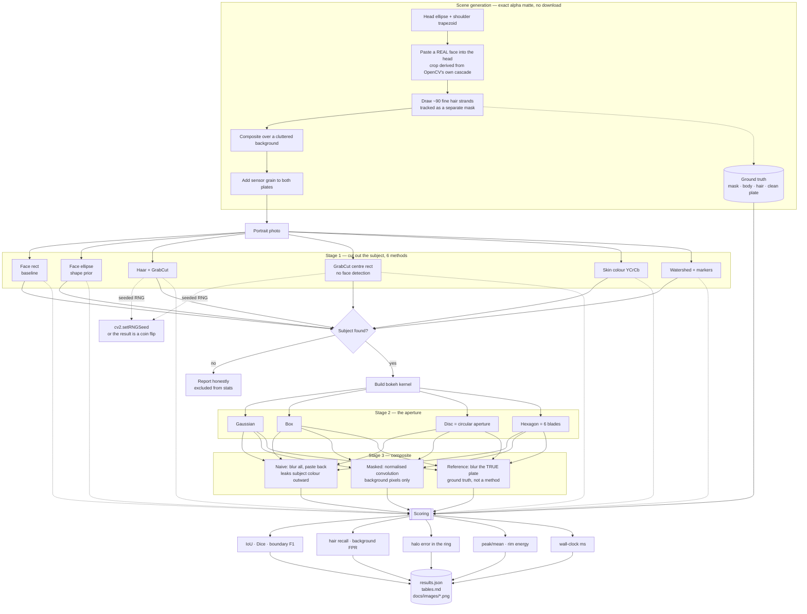

# PROJECT · 02 Portrait Mode — complete workflow

End-to-end explanation of the project: the question, the data, the algorithms,
how every number is produced, and why each decision was made. Results themselves
are in [README.md](README.md).

---

## 1 · The question

> A phone's portrait mode uses a depth sensor or a trained segmentation network.
> With **neither**, how good a portrait can classical methods produce, and
> *where exactly* does the result break?

"Portrait mode" is really three problems stacked, and each is measured on its own
terms so a failure can be attributed to the right stage.

---

## 2 · Complete workflow



---

## 3 · Why the scene is built this way

Portrait matting needs an **alpha matte** as ground truth. Hand-annotating one is
approximate and slow; compositing a known subject onto a known background makes it
exact.

Three deliberate choices:

| Choice | Why |
|---|---|
| A **real face** pasted into the head | a Haar cascade must have something genuine to detect, or three of the six methods could not run at all |
| The face crop **derived from the cascade**, not hard-coded | hard-coded pixel coordinates silently included the astronaut's white helmet, which changed what every colour-based method saw |
| Hair tracked as a **separate mask** | hair is 2.5% of the subject; without a separate score, losing all of it is invisible in IoU |
| The clean background kept | the reference composite (blurring the true plate) is the only way to measure halo exactly |
| The **same grain** on both plates | otherwise the halo measurement would partly be measuring different noise |

---

## 4 · Stage 1 — the six matting methods

| # | Method | Uses the image? | Why it is here |
|---|---|:--:|---|
| 1 | Face rect | no | baseline — a filled box, cannot follow a silhouette |
| 2 | Face ellipse prior | no | a *shape prior* only: how far does anatomy alone get you? |
| 3 | Haar + GrabCut | yes | the method the plan prescribes |
| 4 | GrabCut, centre rect | yes | isolates how much of GrabCut's score comes from the graph cut versus merely being told where the subject is |
| 5 | Skin colour (YCrCb) | yes | chroma-only rule, invariant to brightness — but can only ever find skin |
| 6 | Watershed + markers | yes | over-segments badly without seeds; the face box supplies them |

Methods 1 and 2 are the controls that make the comparison meaningful. **The
ellipse prior never looks at the image and still wins on IoU** — which is the
project's central result and would be invisible without it in the table.

### Implementation details that decide the outcome

* **GrabCut runs 5 iterations, not 1.** It alternates between fitting colour
  mixtures and re-cutting the graph; after one pass it has barely left the
  initialising rectangle and looks broken.
* **GrabCut needs a margin of guaranteed background.** A rectangle touching the
  frame edge gives it no negative examples to build a background model from.
* **GrabCut gets a BGR image.** It assumes OpenCV channel order internally.
* **Skin detection works in YCrCb, not RGB.** Separating luma from chroma makes
  the rule robust to brightness, which is the whole reason to leave RGB.
* **Histogram/skin results take the largest connected component**, or scattered
  background pixels survive the morphology and wreck the mask.

---

## 5 · Why three different metrics, and what each hides

| Metric | Sees | Blind to |
|---|---|---|
| IoU | bulk area overlap | thin structures — hair is 2.5% of pixels |
| Dice | same, kinder to small regions | same |
| Body recall | did it get the torso | boundary quality entirely |
| Hair recall | did it get the strands | precision — a full-frame mask scores 1.0 |
| **Background FPR** | spill into the background | whether the subject was found at all |
| Boundary F1 | silhouette accuracy | interior errors |
| ms | cost | everything else |

The pairs matter. **Hair recall alone is gameable**; hair recall *next to*
background FPR is not. The face rectangle's 0.97 hair recall against its 0.344 FPR
tells the whole story in one row.

---

## 6 · The GrabCut determinism problem

This started as a failing test and ended up being the most useful thing in the
project.

```
Same image. 24 RNG seeds. IoU from 0.15 to 0.90.
```

**Mechanism.** GrabCut models foreground and background as Gaussian mixtures and
initialises them with k-means. k-means picks its starting centres using OpenCV's
**global** RNG (`cv2::theRNG()`). Different starting centres converge to different
colour models, which produce different graph cuts.

**Two facts, easily conflated:**

| | Behaviour |
|---|---|
| Same seed, repeated | **Identical output**, every time, at any thread count |
| Different seeds | Up to **0.75 IoU apart** on a hard scene |

So GrabCut is *reproducible* and still not *stable*. Pinning the seed makes a
result repeatable without making it representative.

**The instability is scene-dependent**, which is the useful part:

| Scene | Subject vs background colour | Spread |
|---|---|---:|
| `brick` | far apart | 0.0019 |
| `grass` | far apart | 0.0273 |
| `rocket` | moderate | 0.0574 |
| `coffee` | browns close to skin tones | **0.7524** |

When the colour models are well separated, initialisation does not matter. When
they overlap, initialisation decides everything. That is a statement about when
to trust GrabCut, which a single number could never provide.

---

## 7 · Stage 2 — what a bokeh kernel actually has to do

A lens does not "blur". It maps every point of light to the shape of its aperture.
An out-of-focus highlight is therefore a **flat disc with a hard rim**, not a soft
bump — this is why photographers talk about "bokeh balls".

Two numbers characterise it, both computed from the kernel alone:

* **peak / mean** over the non-zero support — a perfect disc is exactly 1.0
  (flat); a Gaussian is 2.94 (peaked).
* **rim energy** — the fraction of total energy in the outer quarter of the
  support radius. Disc 0.434, Gaussian 0.202.

Both are properties of the aperture, not of any image, so they are exact and need
no test photo.

---

## 8 · Stage 3 — the halo, and normalised convolution

The naive composite is:

```
out = blur(whole image);  out[subject] = image[subject]
```

The bug is in the first term. At a background pixel one kernel-radius outside the
subject, the kernel overlaps subject pixels, so subject colour is averaged into
the background. Pasting the sharp subject back does not undo it — the smear is
*outside* the subject, exactly where nothing is pasted.

The fix is a **normalised convolution**:

```
num = blur(image · keep)        keep = 1 on background, 0 on subject
den = blur(keep)
out = num / den                 then paste the subject back
```

Dividing by the blurred indicator re-weights each output pixel so it is the
average of *background pixels only*, correctly normalised regardless of how much
of the kernel fell on the subject. Nothing from the subject can leak outward.

Measured against the reference (blurring the true clean plate): **9.48 → 1.576**
in the halo ring, for 29 ms.

---

## 9 · Reproducing everything

```bash
python run.py --scenes 12        # a few minutes, CPU only
```

Writes:

```
results/results.json      every number, library versions, the GrabCut seed used
results/tables.md         the markdown tables in the README
docs/images/mattes.png             six mattes side by side
docs/images/matte_errors.png       green correct / red missed / orange spilled
docs/images/hair_recall.png        the column IoU cannot see
docs/images/bokeh_kernels.png      a point of light through four apertures
docs/images/compositing.png        the halo, amplified 8x
docs/images/pipeline.png           end to end
```

---

## 10 · What this would need to be production-ready

* **Real alpha matting.** Every method here produces a binary mask; hair needs
  fractional alpha (closed-form matting, KNN matting, or a trimap-based method).
* **A depth cue.** Portrait mode is fundamentally a depth problem being solved
  here with a segmentation proxy. Two frames, or a dual camera, changes the game.
* **Depth-varying blur.** One kernel for the whole background is not what a lens
  does; blur should grow with distance.
* **Profile and multi-person handling**, which the frontal cascade cannot do.
* **A perceptual study.** peak/mean and rim energy describe the kernel, not
  whether anyone prefers the photograph.
