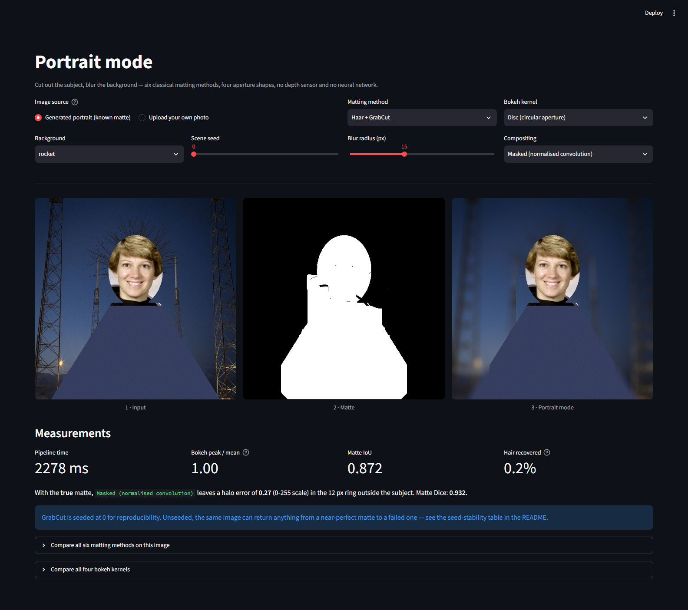

# 02 · Portrait Mode — classical computer vision

[](https://www.python.org/)
[](https://opencv.org/)
[](#)
[](#tests)
[](#)

Phone portrait mode without a depth sensor and without a segmentation network:
**six classical matting methods, four aperture shapes, two compositing
strategies** — all measured against an exact ground-truth alpha matte.

> **The finding, in one sentence.** Ranking the six methods by IoU crowns a
> method that recovers **6.2%** of the subject's hair; ranking the same six by
> boundary F1 crowns one that recovers **52.9%**. The metric, not the algorithm,
> decides the winner — and hair is only 2.5% of the pixels, so whole-image IoU
> cannot see it.

> **The measurement bug worth knowing about.** OpenCV's `grabCut` is **not
> deterministic**. On one unchanged image, 24 different RNG seeds produced IoU
> anywhere from **0.15 to 0.90**. Any single unseeded GrabCut number is a draw
> from a distribution, not a measurement.

**Jump to:** [What it does](#what-it-does) · [Screenshot](#screenshot) ·
[Input & output](#input--output) · [Results](#results) ·
[Run it yourself](#run-it-yourself) · [Inference](#inference-try-it-on-your-own-image) ·
[How it works](#how-it-works) · [Problems solved](#problems-hit-and-how-they-were-solved) ·
[Limitations](#limitations) · [Keywords](#keywords)

---

## What it does


One pre-trained component is used, and it is stated rather than hidden:
OpenCV's **Haar cascade** for frontal faces, bundled inside the library. It was
trained by someone else, it is not a neural network, and nothing here is trained.

---

## Screenshot



---

## Input & output

**Input** — either:

* a **generated portrait** (no download): a head-and-shoulders subject with a
  *real* face composited onto a cluttered background, with ~90 individual hair
  strands drawn around the head. The exact alpha matte, the body-only mask, the
  hair-only mask and the clean background plate are all known;
* **your own photo**, uploaded through the UI.

**Output** — the matte, the final portrait, and numbers:

| Output | What it is |
|---|---|
| Matte | binary subject mask from the chosen method |
| Portrait | subject sharp, background blurred with the chosen aperture |
| Metrics | IoU, Dice, hair recovered, halo error, wall-clock ms |

---

## Results

Produced by `run.py` over 12 scenes; mirrored in
[`results/results.json`](results/results.json) and [`results/tables.md`](results/tables.md).

### Subject matting (12 scenes, GrabCut pinned to seed 0)

| Method | Subject found | IoU | Dice | Body recall | Hair recall | Background FPR | Boundary F1 | Time (ms) |
|---|---:|---:|---:|---:|---:|---:|---:|---:|
| Face rect (baseline) | 100% | 0.5654 | 0.7224 | 0.9422 | 0.97 | 0.3441 | 0.0236 | 34.56 |
| **Face ellipse prior** | 100% | **0.928** | **0.9627** | 0.9664 | 0.0624 | **0.0091** | 0.1659 | **39.2** |
| Haar + GrabCut | 100% | 0.8721 | 0.929 | 0.9343 | 0.4823 | 0.0368 | 0.5849 | 1092 |
| **GrabCut (centre rect)** | 100% | 0.7985 | 0.8716 | 0.8683 | **0.5285** | 0.0454 | **0.6362** | 1156 |
| Skin colour (YCrCb) | 100% | 0.1735 | 0.2914 | 0.2227 | 0.947 | 0.3288 | 0.25 | **3.0** |
| Watershed + markers | 100% | 0.7155 | 0.833 | 0.7876 | 0.2362 | 0.0452 | 0.3728 | 49.5 |


**Read the table across, not down.** Three different methods "win" depending on
which column you look at:

* **IoU says the ellipse prior** (0.928) — a hand-drawn shape that never looks at
  the image. It recovers **6.2%** of the hair and has a boundary F1 of 0.166.
* **Boundary F1 says GrabCut** (0.636) — the method that actually follows the
  silhouette, at **52.9%** hair recovery, but a *lower* IoU of 0.799.
* **Hair recall alone says the face rectangle** (0.97) — which is a cheat. It
  "recovers" the hair by covering the whole region, and pays for it with a
  background false-positive rate of **0.344**, nearly forty times the ellipse's.

That last row is why the FPR column exists. Recall on its own is gameable by
predicting everything.


**Why hair is scored separately.** Hair is **2.5%** of the subject's pixels. The
ellipse prior loses essentially all of it and still scores 0.928 IoU — the metric
physically cannot see the failure. This is the same reason IoU is a poor metric
for blood vessels, wires and text strokes.


### GrabCut is not deterministic

The same image, segmented 24 times with 24 different RNG seeds:

| Scene | Seeds | IoU mean | IoU std | Worst | Best | Spread |
|---|---:|---:|---:|---:|---:|---:|
| **0 (coffee)** | 24 | 0.6634 | 0.1162 | **0.1515** | **0.9039** | **0.7524** |
| 1 (rocket) | 24 | 0.8905 | 0.0177 | 0.8491 | 0.9064 | 0.0574 |
| 2 (grass) | 24 | 0.9148 | 0.0054 | 0.8926 | 0.92 | 0.0273 |
| 3 (brick) | 24 | 0.941 | 0.0008 | 0.9402 | 0.9421 | 0.0019 |

The input never changed. Every bit of that spread is algorithmic noise, because
GrabCut initialises its foreground and background colour mixtures with k-means
seeded from OpenCV's **global** RNG.

Two facts that are easy to conflate:

* **With a seed pinned, GrabCut is perfectly reproducible** — same seed, same
  mask, on any thread count. That is what makes the table above trustworthy.
* **Across seeds it is not stable at all** on hard scenes. On `coffee`, whose
  background browns are close to the subject's skin tones, the initialisation
  decides the entire result: 0.15 or 0.90, effectively a coin flip. On `brick`,
  where subject and background are far apart in colour, the spread is 0.0019.

**The instability is a property of the scene, not of the algorithm alone.** A
paper reporting one GrabCut number without a seed or a spread is reporting luck.

### Bokeh kernel shape

| Kernel | Radius (px) | Peak / mean | Rim energy |
|---|---:|---:|---:|
| Gaussian | 15 | **2.9419** | 0.2023 |
| Box | 15 | 1 | 0.3205 |
| **Disc (circular aperture)** | 15 | **1** | **0.4344** |
| Hexagon (6-blade) | 15 | 1 | 0.3317 |


A real out-of-focus highlight is a **flat disc with a hard rim** — that is what a
circular aperture does to a point of light. A Gaussian is a soft bump: its
peak-to-mean ratio is **2.94** against the disc's **1.00**, and it puts only
**20%** of its energy in the outer quarter of the support against the disc's
**43%**. That difference is precisely why a Gaussian-blurred background reads as
"smudged" rather than "out of focus", and it costs nothing to fix — both kernels
are a single `filter2D` call.

### Compositing: the halo nobody measures

| Strategy | Halo error (0-255) | Whole-background error | Time (ms) |
|---|---:|---:|---:|
| Naive (blur all, paste back) | **9.48** | 1.636 | **15.8** |
| **Masked (normalised convolution)** | **1.576** | **0.271** | 45.5 |


Blurring the whole image and pasting the sharp subject back on top — what nearly
every tutorial does — lets the kernel reach *across* the subject boundary, so
subject colour is smeared outward into the background. Measured against the ideal
(blurring the true clean plate), that leaves **6.0× more error** in the 12 px ring
outside the subject.

The fix is a normalised convolution: blur the background with the subject
excluded, blur the background *indicator* with the same kernel, and divide. Every
output pixel is then an average of background pixels only. It costs **29 ms**.

---

## Run it yourself

```bash
git clone https://github.com/hammas159/classical-computer-vision.git
cd classical-computer-vision/projects/02_portrait_mode

python -m venv .venv && .venv/Scripts/activate       # Windows
# python3 -m venv .venv && source .venv/bin/activate   # macOS / Linux
pip install "opencv-python-headless<5" scikit-image matplotlib numpy scipy streamlit pytest

python run.py --scenes 12     # reproduces every number and figure
streamlit run ui/app.py       # interactive demo
```

> `opencv-python-headless<5` is not optional here. **OpenCV 5 removed the bundled
> Haar cascade XML files** from `cv2/data/`, and this project loads one at
> runtime. On OpenCV 5 the cascade loads empty and every face-based method
> returns "no subject found".

---

## Inference: try it on your own image

```bash
streamlit run ui/app.py
```

Choose **“Upload your own photo”** and drop in a portrait. Or call it directly:

```python
from shared.io import imread, imwrite
import portrait_mode as pm

photo = imread("my_portrait.jpg")               # RGB uint8
mask, out = pm.portrait(
    photo,
    matte="Haar + GrabCut",                     # any key of pm.MATTES
    bokeh="Disc (circular aperture)",           # any key of pm.BOKEH_KERNELS
    radius=15,
    compositor="Masked (normalised convolution)",
)

if mask is None:
    print("no face found — try 'GrabCut (centre rect)', which needs no face")
else:
    imwrite("portrait.png", out)
```

On an uploaded photo **IoU and hair recall cannot be reported** — there is no
ground-truth matte for a real photo, and the app says so rather than inventing a
number. Use a generated scene to see the pipeline scored.

---

## How it works

Full walkthrough and workflow diagram: **[PROJECT.md](PROJECT.md)**.

| File | What is in it |
|---|---|
| [`src/portrait_mode.py`](src/portrait_mode.py) | six matting methods, four kernels, two compositors, scoring |
| [`run.py`](run.py) | the experiment: writes every number and figure |
| [`ui/app.py`](ui/app.py) | the Streamlit app |
| [`tests/`](tests/) | 23 tests, including the GrabCut instability as a regression test |

---

## Problems hit, and how they were solved

### 1 · GrabCut silently returned a different answer every run

The first table reported **IoU 0.87** for Haar + GrabCut. Re-running produced
0.66, then 0.90, then 0.68. GrabCut seeds its colour mixtures from OpenCV's
global RNG, so an unseeded call is a sample, not a measurement.

**Fixed** two ways, because one alone would have been dishonest: every call now
pins `cv2.setRNGSeed`, *and* a dedicated experiment reports the spread across 24
seeds. Pinning alone would have produced a reproducible number that still hid how
little it meant.

### 2 · "Hair recall" was gameable, and briefly fooled me

The face-rectangle baseline scored **0.97 hair recall** — better than every real
method — purely by covering the whole head region. Recall without precision
rewards predicting everything.

**Fixed** by adding a background false-positive rate beside it. The rectangle's
FPR is 0.344 against the ellipse's 0.0091, and the cheat becomes obvious in the
table rather than requiring a footnote.

### 3 · The face crop included the astronaut's white helmet

The composited subject was built from a hard-coded crop of
`skimage.data.astronaut`, which turned out to be mostly the pale background
behind the head. Every scene looked like a small face floating in a white oval,
and it changed what the colour-based methods saw.

**Fixed** by deriving the crop from OpenCV's own face cascade, then expanding it
by fixed proportions. The crop is now correct by construction. A "cover" fit
rather than a plain resize stops the crop's own background showing at the sides
of the head.

### 4 · MSRCR-style stretching, applied globally, is wrong

(Shared with project 03.) Percentile-stretching all three channels together
leaves colour-restored output dark and shifted, because the restoration term puts
the channels on deliberately different scales. Each channel needs its own stretch.

### 5 · A Streamlit crash only a running app would reveal

`st.image` rejected the normalised bokeh kernel with
`StreamlitAPIException: Data is outside [0.0, 1.0] and clamp is not set` —
`rendered / rendered.max()` lands a hair above 1.0 in float32. Caught by
screenshotting the live app, not by any test.

### 6 · The compositing bug that looks fine until measured

Naive blur-then-paste produces an image that looks perfectly acceptable. It is
wrong by **9.48** in the halo ring, six times the masked version. Nothing about
the picture announces this; it needed the clean background plate as ground truth
and a defined ring to measure over.

---

## Limitations

* **The subject is synthetic.** A head ellipse plus a shoulder trapezoid with a
  real face pasted in. Real subjects have arms, glasses, complex clothing, and
  hair that is a soft *alpha* rather than a binary mask.
* **Hair here is binary.** Real hair is semi-transparent, and a correct matte is
  fractional. Every method here produces a hard 0/255 mask, so genuine alpha
  matting (closed-form matting, KNN matting) is out of scope and would be the
  honest next step.
* **The background is a flat plate**, not a scene with real depth. A true bokeh
  varies with distance; this applies one kernel to everything behind the subject.
* **No depth information at all**, which is what makes this hard and is exactly
  what a phone's portrait mode has and this does not.
* **Haar finds frontal faces only.** A profile view returns "no subject found"
  for four of the six methods.
* **`n = 12` scenes across 6 backgrounds.** Enough to separate 0.93 from 0.80;
  not enough for a confidence interval.
* **The bokeh metric characterises the kernel, not perceived quality.** Peak/mean
  and rim energy are properties of the aperture; whether a viewer prefers the
  result is not measured here and would need human judgement.

---

## Tests

```bash
cd classical-computer-vision
python -m pytest projects/02_portrait_mode -q
```

23 tests. They check the scene invariants (body and hair partition the subject and
never overlap; hair really is a few percent), that the bundled Haar cascade loads
at all (the guard against an OpenCV 5 bump), that every kernel is normalised — an
unnormalised kernel changes image brightness and looks like a bad blur rather than
the arithmetic error it is — and that compositing never alters subject pixels.
Both headline findings are asserted as regression tests: that IoU and boundary F1
disagree about the winner, and that GrabCut is reproducible with a pinned seed yet
unstable across seeds.

---

## Keywords

Portrait mode OpenCV · background blur Python · bokeh effect OpenCV · GrabCut
segmentation · GrabCut non-deterministic · Haar cascade face detection · alpha
matting classical · image matting without deep learning · subject segmentation
Python · depth of field simulation · aperture shape bokeh · normalised
convolution · halo artifact compositing · skin detection YCrCb · watershed
segmentation markers · IoU vs boundary F1 · hair segmentation failure · CPU only
computer vision · no training segmentation · Streamlit computer vision demo ·
synthetic alpha matte ground truth

---

## References

* Rother, C., Kolmogorov, V. & Blake, A. (2004). *"GrabCut": Interactive
  Foreground Extraction using Iterated Graph Cuts*. ACM SIGGRAPH.
* Viola, P. & Jones, M. (2001). *Rapid Object Detection using a Boosted Cascade
  of Simple Features*. CVPR — the cascade OpenCV bundles.
* Knutsson, H. & Westin, C.-F. (1993). *Normalized and Differential Convolution*.
  CVPR — the method used for halo-free background blur.

---

**Part of [classical-computer-vision](../../README.md)** — measured comparisons of
classical CV algorithms, no deep learning anywhere.
