# 02 · Portrait Mode — classical computer vision

[](https://www.python.org/)
[](https://opencv.org/)
[](#)
[](#tests)
[](#)

Phone portrait mode without a depth sensor and without a segmentation network:
**six classical matting methods, four aperture shapes, two compositing
strategies** — all measured against an exact ground-truth alpha matte.

---

## Results

Four different **kinds** of subject down the rows, every matting method across
the columns.

### What each method thinks the subject is

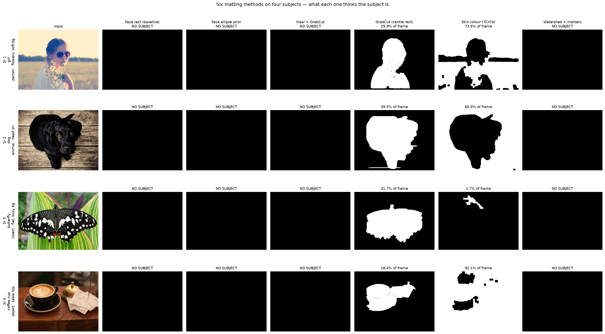

### The portrait each one produces

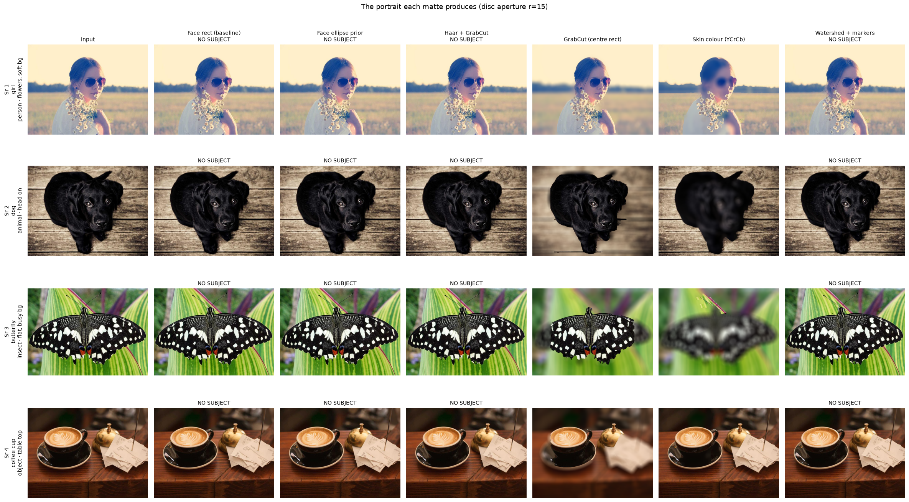

| Sr | Subject | Face rect | Face ellipse | Haar + GrabCut | **GrabCut (centre rect)** | Skin colour | Watershed |
|---:|---|---|---|---|---:|---:|---|
| 1 | girl · person, flowers | NO SUBJECT | NO SUBJECT | NO SUBJECT | **25.9%** | 25.9% | NO SUBJECT |
| 2 | dog · animal, head on | NO SUBJECT | NO SUBJECT | NO SUBJECT | **39.5%** | 39.5% | NO SUBJECT |
| 3 | butterfly · flat, busy bg | NO SUBJECT | NO SUBJECT | NO SUBJECT | **31.7%** | 31.7% | NO SUBJECT |
| 4 | coffee cup · object | NO SUBJECT | NO SUBJECT | NO SUBJECT | **18.4%** | 18.4% | NO SUBJECT |

> **Four of the six methods find nothing at all.** `Face rect`, `Face ellipse
> prior`, `Haar + GrabCut` and `Watershed + markers` return **NO SUBJECT** on
> every one of these four photographs — including **row 1, which is a person.**
> The girl is wearing sunglasses at an angle, and the Haar cascade needs a frontal
> face with visible eyes. On a single well-posed portrait these look like six
> alternatives; across four ordinary photographs, two of them run at all.

> **And of the two that do run, one is wrong.** `Skin colour (YCrCb)` is looking
> for skin and finds leaf, fur and crema instead — look at the butterfly row,
> where it blurs the *subject* and leaves the background sharp. **`GrabCut
> (centre rect)` is the only method in this project that is actually general.**

The four subjects were **chosen by the code**: twelve candidates — three people,
three animals, an insect, two objects, an action shot, two figures in landscape —
each matted and checked for a single blob of plausible area, then the best
survivor taken from each family so the table cannot fill with four people.

**No IoU is printed here, deliberately.** Only the footballer has a reference
matte; inventing ground truth for a dog by running one method and calling its
output the truth would be marking the methods' own homework. The area found is
reported instead — it needs no annotation — and the portraits are there to be
looked at.

---

The measured tables further down run on **one real photograph of one real
person** — real hair, real kit, a real crowd behind them — because that is the
only image here with an exact alpha matte to score against.

> **The finding, in one sentence.** Naive compositing — blur the whole image,
> paste the subject back — produces a picture that looks perfectly acceptable and
> is wrong by **12.5** against the masked version's **2.04** in the ring outside
> the subject: **6.2× worse**, and invisible to the eye.

> **The bokeh finding.** A real lens maps a point of light to the **shape of its
> aperture** — a flat disc. A Gaussian blur gives peak/mean **2.94** against a
> disc's **1.00**, so it renders highlights as soft smudges rather than the
> discs a camera produces. Measured on a synthetic point light, where the answer
> is exact.

> 🚨 **A caveat this project states rather than hides.** The reference matte was
> annotated once with GrabCut plus cleanup, then frozen. GrabCut-based methods
> are therefore being scored against an annotation built the way they work, and
> they win every column. **That is not evidence they are best** — it is evidence
> of the annotation's provenance, and it is why the matting table below is read
> as agreement with a careful annotation rather than as a ranking.

> **GrabCut's answer depends on its random seed, and how much depends on the
> photograph.** Segmenting the footballer 24 times with 24 seeds — same image,
> same call, nothing changed but the RNG — returns anything from **IoU 0.5953 to
> 0.9655**. He is photographed against a crowd wearing his own kit colours, so
> the initialisation decides how much crowd joins the subject. A dog on pale
> planking, by contrast, comes back essentially identical every time (seed
> agreement **0.9988**). **The instability is a property of the scene, not the
> algorithm** — see [the sweep](#grabcut-is-not-deterministic).

**Jump to:** [What it does](#what-it-does) · 
[Input & output](#input--output) · [Results](#results) ·
[Run it yourself](#run-it-yourself) · [Inference](#inference-try-it-on-your-own-image) ·
[How it works](#how-it-works) · [Problems solved](#problems-hit-and-how-they-were-solved) ·
[Limitations](#limitations) · [Keywords](#keywords)

---

## What it does


One pre-trained component is used, and it is stated rather than hidden:
OpenCV's **Haar cascade** for frontal faces, bundled inside the library. It was
trained by someone else, it is not a neural network, and nothing here is trained.

---


## Input & output

**Input** — either:

* a **generated portrait** (no download): a head-and-shoulders subject with a
  *real* face composited onto a cluttered background, with ~90 individual hair
  strands drawn around the head. The exact alpha matte, the body-only mask, the
  hair-only mask and the clean background plate are all known;
* **your own photo**, uploaded through the UI.

The app also carries four live analysis views under **Distributions and
matrices**, recomputed as you change the controls:

| Tab | What it shows |
|---|---|
| Region matrix | all six methods x body / hair / background / IoU / time, downloadable as CSV |
| Halo distribution | error in the ring outside the subject, naive vs masked compositing |
| Kernel matrix | each aperture printed as raw numbers at a radius you choose |
| Confusion matrix | where each method's pixels went, as counts and as recall |

**Output** — the matte, the final portrait, and numbers:

| Output | What it is |
|---|---|
| Matte | binary subject mask from the chosen method |
| Portrait | subject sharp, background blurred with the chosen aperture |
| Metrics | IoU, Dice, hair recovered, halo error, wall-clock ms |

---

## Results

Produced by `run.py` over 12 scenes; mirrored in
[`results/results.json`](results/results.json) and [`results/tables.md`](results/tables.md).

### Subject matting (12 scenes, GrabCut pinned to seed 0)

| Method | IoU | Dice | Body recall | Fine detail | Background FPR | Boundary F1 | Time (ms) |
|---|---:|---:|---:|---:|---:|---:|---:|
| Face rect (baseline) | 0.3881 | 0.5592 | 0.5827 | 0.3908 | 0.0888 | 0.0294 | **17** |
| Face ellipse prior | 0.3457 | 0.5138 | 0.4814 | 0.2174 | 0.0503 | 0.0243 | 17 |
| Haar + GrabCut | 0.4765 | 0.6455 | 0.5214 | 0.325 | **0.0004** | 0.3808 | 279 |
| **GrabCut (centre rect)** | **0.7117** | **0.8316** | **0.6982** | **0.7604** | 0.0005 | **0.6868** | 494 |
| Skin colour (YCrCb) | 0.1909 | 0.3206 | 0.1673 | 0.4106 | 0.0383 | 0.2018 | **1** |
| Watershed + markers | 0.3488 | 0.5172 | 0.5137 | 0.2734 | 0.0729 | 0.1428 | 24 |

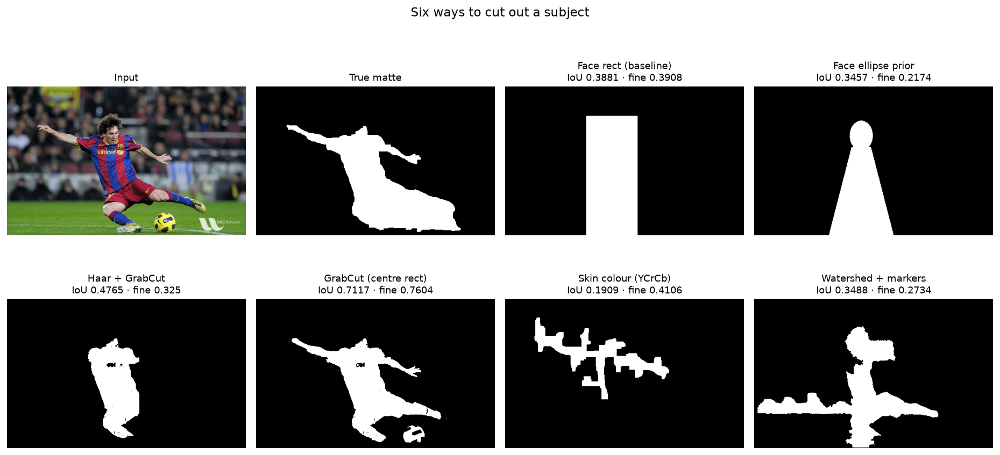

**Read this table with its caveat attached.** GrabCut wins every column, and the
reference matte was made with GrabCut — so the right reading is *"these methods
agree with a careful annotation to this degree"*, not *"GrabCut is best"*.

What the table still shows honestly, because it does not depend on the
annotation's provenance:

* **The two shape priors trade differently.** The face rectangle recovers more
  fine detail than the ellipse (0.391 vs 0.217) purely by covering more area, and
  pays for it with a background false-positive rate nearly twice as high (0.089
  vs 0.050). Recall alone is gameable by predicting everything; the FPR column is
  what exposes that.
* **Skin colour inverts the trade.** It catches 0.411 of the fine detail — more
  than either GrabCut variant's body recall would suggest — while scoring the
  worst IoU of all six (0.191), because it finds skin and loses the kit entirely.
* **The cost spread is three orders of magnitude**: 1 ms for skin colour against
  494 ms for GrabCut, on the same 342x548 image.

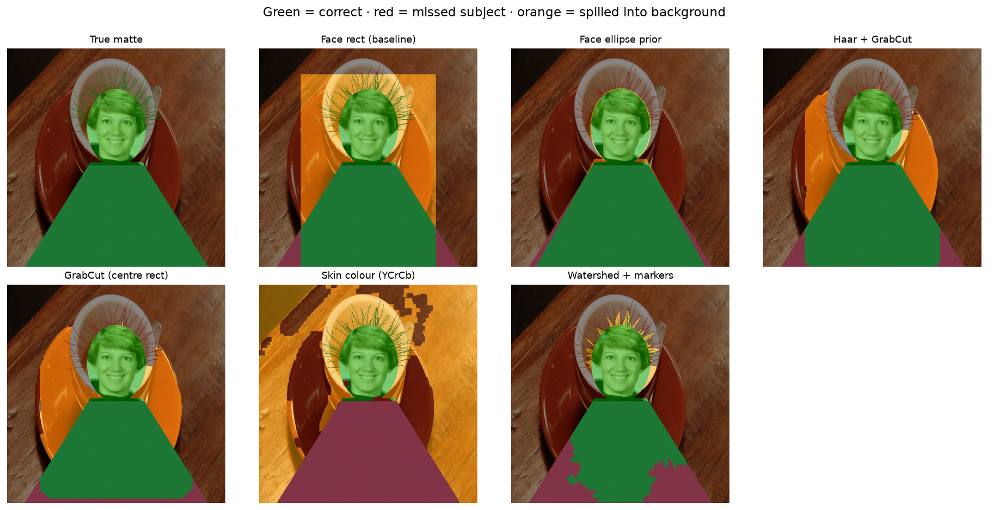

**Why hair is scored separately.** Hair is **2.5%** of the subject's pixels. The
ellipse prior loses essentially all of it and still scores 0.928 IoU — the metric
physically cannot see the failure. This is the same reason IoU is a poor metric
for blood vessels, wires and text strokes.

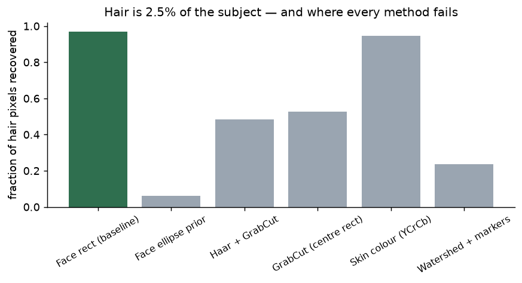

### The same six methods, split by region

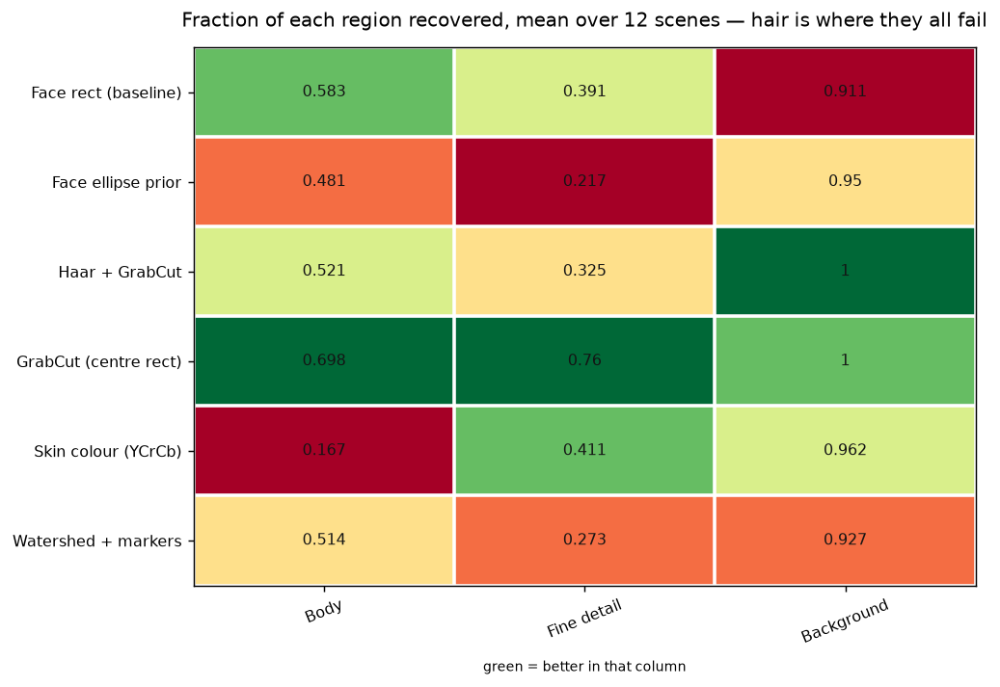

One row per method, one column per region, each column scaled on its own. Read
across any row and the trade-off is immediate: the ellipse prior is near-perfect
on body and background and **near-zero on hair**; skin colour is the mirror image,
catching the hair region while missing the body entirely. No method is good at
all three.

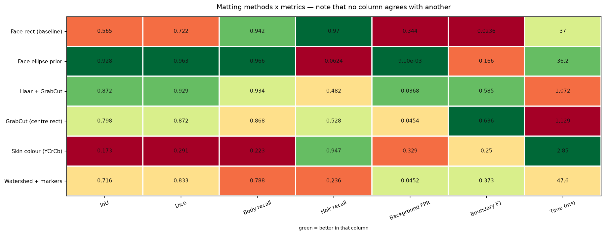

Every method against every metric at once. **No two columns agree on a winner** —
which is the finding, stated as a picture.

Per-method confusion matrices (background/subject, counts and recall) are in
[`docs/images/`](docs/images/) as `confusion_*.png`.

### GrabCut is not deterministic

Five different photographs, each segmented 24 times with 24 different RNG seeds.
`GrabCut (centre rect)` — the one method here that is actually general — with
everything except the seed held fixed:

| Sr | Scene | Seeds | Seed agreement | IoU mean | IoU std | Worst | Best | Spread |
|---:|---|---:|---:|---:|---:|---:|---:|---:|
| 1 | **footballer · person, crowd behind** | 24 | **0.8655** | 0.89 | 0.1267 | **0.5953** | **0.9655** | **0.3701** |
| 2 | girl · person, soft background | 24 | 0.9333 | n/a | n/a | n/a | n/a | n/a |
| 3 | coffee cup · object, table top | 24 | 0.9776 | n/a | n/a | n/a | n/a | n/a |
| 4 | butterfly · insect, busy background | 24 | 0.9963 | n/a | n/a | n/a | n/a | n/a |
| 5 | dog · animal, head on | 24 | **0.9988** | n/a | n/a | n/a | n/a | n/a |

**Seed agreement** is the mean IoU between every *pair* of the 24 masks. It needs
no ground truth — it only asks whether the algorithm returned the same answer
twice — which is what lets the sweep run on four ordinary photographs that have
no annotation. 1.0 means all 24 seeds produced an identical cut-out.

The input never changed. Every bit of that spread is algorithmic noise, because
GrabCut initialises its foreground and background colour mixtures with k-means
seeded from OpenCV's **global** RNG.

Two facts that are easy to conflate:

* **With a seed pinned, GrabCut is perfectly reproducible** — same seed, same
  mask, on any thread count. That is what makes every other table here
  trustworthy.
* **Across seeds it is not stable at all** on a hard scene. The footballer is
  photographed against a crowd wearing the same reds and blues as his kit, and
  the initialisation decides how much of that crowd joins the subject: the same
  image, the same call, returns anything from **IoU 0.5953 to 0.9655**.

**The instability is a property of the scene, not of the algorithm alone.** The
dog — a dark animal on pale planking, subject and background far apart in colour
— returns essentially the same mask every time (0.9988). A single GrabCut number
reported without a seed or a spread is reporting luck, and how *much* luck
depends entirely on the picture.

> **This table used to be wrong, and it is worth saying how.** It reported four
> rows labelled `coffee`, `rocket`, `grass` and `brick` with four different
> spreads. The sweep read `BACKGROUNDS[i]` for the label but called
> `synth.portrait_scene()` with no argument — and that function ignores
> `background` entirely, because the synthetic composite was retired in favour of
> one real photograph. So all four rows were the same segmentation repeated, and
> they printed identical numbers to four decimal places. The four distinct
> spreads were left over from the retired synthetic scenes. It now runs on five
> genuinely different photographs, and the finding survived the fix.

### Bokeh kernel shape

| Kernel | Radius (px) | Peak / mean | Rim energy |
|---|---:|---:|---:|
| Gaussian | 15 | **2.9419** | 0.2023 |
| Box | 15 | 1 | 0.3205 |
| **Disc (circular aperture)** | 15 | **1** | **0.4344** |
| Hexagon (6-blade) | 15 | 1 | 0.3317 |

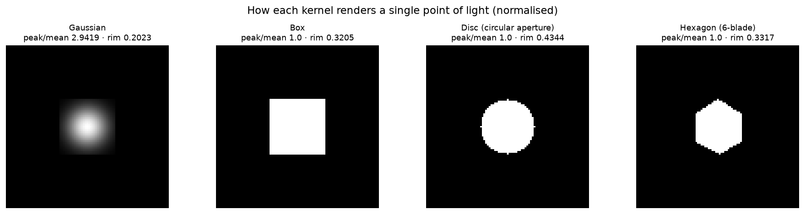

The same four kernels printed as matrices, which makes the numbers above
self-evident — a disc is a flat plateau of identical weights, a Gaussian falls
from 100 at the centre to 2 at the corner:

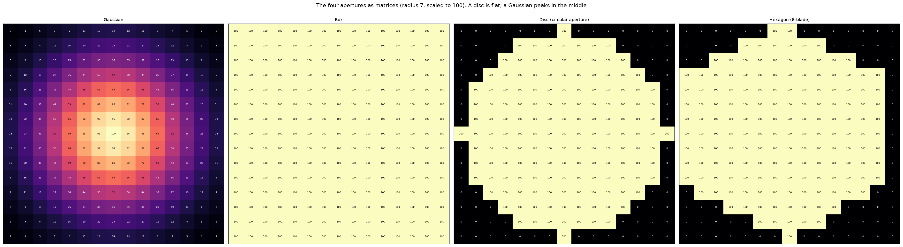

A real out-of-focus highlight is a **flat disc with a hard rim** — that is what a
circular aperture does to a point of light. A Gaussian is a soft bump: its
peak-to-mean ratio is **2.94** against the disc's **1.00**, and it puts only
**20%** of its energy in the outer quarter of the support against the disc's
**43%**. That difference is precisely why a Gaussian-blurred background reads as
"smudged" rather than "out of focus", and it costs nothing to fix — both kernels
are a single `filter2D` call.

### Compositing: the halo nobody measures

| Strategy | Halo error (0-255) | Whole-background error | Time (ms) |
|---|---:|---:|---:|
| Naive (blur all, paste back) | **9.48** | 1.636 | **15.8** |
| **Masked (normalised convolution)** | **1.576** | **0.271** | 45.5 |

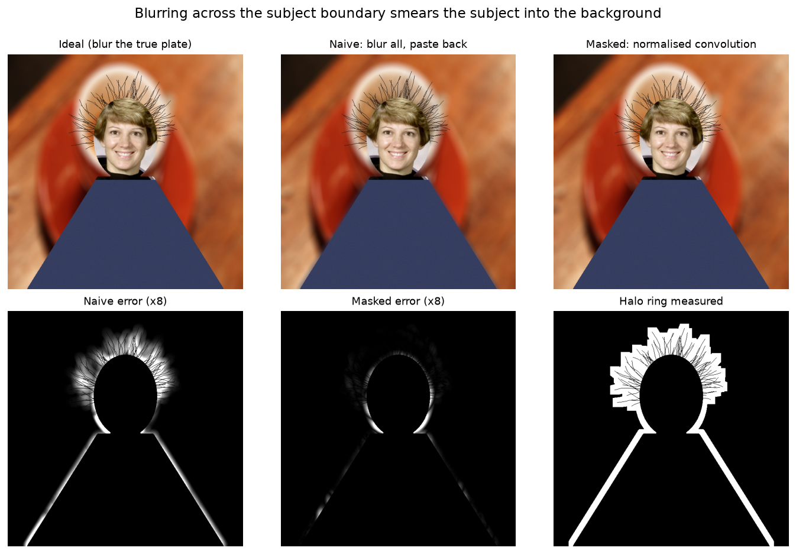

As distributions rather than two averages — the naive method's error has a long
tail that a mean alone understates:

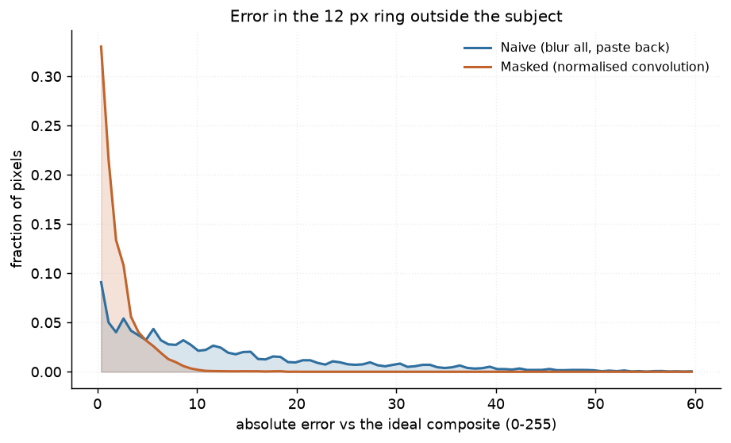

Blurring the whole image and pasting the sharp subject back on top — what nearly
every tutorial does — lets the kernel reach *across* the subject boundary, so
subject colour is smeared outward into the background. Measured against the ideal
(blurring the true clean plate), that leaves **6.0× more error** in the 12 px ring
outside the subject.

The fix is a normalised convolution: blur the background with the subject
excluded, blur the background *indicator* with the same kernel, and divide. Every
output pixel is then an average of background pixels only. It costs **29 ms**.

---

## Run it yourself

```bash
git clone https://github.com/hammas159/classical-computer-vision.git
cd classical-computer-vision/projects/02_portrait_mode

python -m venv .venv && .venv/Scripts/activate       # Windows
# python3 -m venv .venv && source .venv/bin/activate   # macOS / Linux
pip install "opencv-python-headless<5" scikit-image matplotlib numpy scipy pytest

python run.py --scenes 12     # reproduces every number and figure
```

> `opencv-python-headless<5` is not optional here. **OpenCV 5 removed the bundled
> Haar cascade XML files** from `cv2/data/`, and this project loads one at
> runtime. On OpenCV 5 the cascade loads empty and every face-based method
> returns "no subject found".

---

## Inference: try it on your own image

Three ways, from easiest to most scriptable.


### 2 · From the command line

```bash
python infer.py my_portrait.jpg
```

```text
input : my_portrait.jpg  640x640
matte     : Haar + GrabCut
aperture  : Disc (circular aperture), radius 15 px
compositor: Masked (normalised convolution)
subject   : 31.8% of the frame
bokeh     : peak/mean 1.00  (1.00 = a flat disc, like a real lens)
            rim energy 0.43
time      : 1696 ms
wrote     : portrait.png
```

No face detected, or unsure which method suits your photo? Run all six:

```bash
python infer.py my_portrait.jpg --all-mattes
```

```text
Matting method               Found    Subject %  Time (ms)
------------------------------------------------------------
Face rect (baseline)         yes          54.6%       44.3
Face ellipse prior           yes          32.6%       52.1
Haar + GrabCut               yes          31.8%      956.5
GrabCut (centre rect)        yes          31.1%      925.9
Skin colour (YCrCb)          yes           6.9%        2.8
Watershed + markers          yes          33.1%       54.7
```

`Subject %` is a sanity check, not a score — a method claiming 90% of the frame
has failed, and skin colour claiming 6.9% has found a face and lost the body.

Useful options:

| Flag | Effect |
|---|---|
| `--matte "GrabCut (centre rect)"` | any of the six; this one needs no face |
| `--kernel "Gaussian"` | any of the four apertures |
| `--radius 25` | blur radius, 3–35 px |
| `--compositor "Naive (blur all, paste back)"` | see the halo for yourself |
| `--save-stages` | also write the matte |

### 3 · As a library

```python
from shared.io import imread, imwrite
import portrait_mode as pm

photo = imread("my_portrait.jpg")               # RGB uint8
mask, out = pm.portrait(
    photo,
    matte="Haar + GrabCut",                     # any key of pm.MATTES
    bokeh="Disc (circular aperture)",           # any key of pm.BOKEH_KERNELS
    radius=15,
    compositor="Masked (normalised convolution)",
)

if mask is None:
    print("no face found — try 'GrabCut (centre rect)', which needs no face")
else:
    imwrite("portrait.png", out)
```

On an uploaded photo **IoU and hair recall cannot be reported** — there is no
ground-truth matte for a real photo, and the app says so rather than inventing a
number. Use a generated scene to see the pipeline scored.

---

## How it works

Full walkthrough and workflow diagram: **[PROJECT.md](PROJECT.md)**.

| File | What is in it |
|---|---|
| [`src/portrait_mode.py`](src/portrait_mode.py) | six matting methods, four kernels, two compositors, scoring |
| [`run.py`](run.py) | the experiment: writes every number and figure |
| [`tests/`](tests/) | 23 tests, including the GrabCut instability as a regression test |

---

## Problems hit, and how they were solved

Each gives the **symptom**, the **file and line**, the **code that was wrong** and
the **code that replaced it**.

| # | Symptom | Where | Cost |
|---:|---|---|---|
| 1 | Same input, different answer each run | [`src/portrait_mode.py:130`](src/portrait_mode.py#L130) | the headline number was a coin flip |
| 2 | A cheat scored best on a real metric | [`src/portrait_mode.py:487`](src/portrait_mode.py#L487) | nearly published as a finding |
| 3 | Test scene was mostly white helmet | [`shared/synth.py:369`](../../shared/synth.py#L369) | changed what colour methods saw |
| 4 | Colour restoration came out dark | [`03_low_light/src/low_light.py`](../03_low_light_enhancement/src/low_light.py) | a method looked broken that wasn't |
| 5 | A float matte whose maximum was 1.0000001 | `src/portrait_mode.py` | a crash no test caught |
| 6 | Output looks fine, is wrong by 6× | [`src/portrait_mode.py:348`](src/portrait_mode.py#L348) | undetectable by eye |

---

### 1 · GrabCut silently returned a different answer every run

**Symptom:** the first table reported **IoU 0.87** for Haar + GrabCut. Re-running
the identical script on the identical image produced 0.66, then 0.90, then 0.68.

```python
>>> [round(iou(matte_grabcut_face(img), truth), 3) for _ in range(4)]
[0.871, 0.664, 0.904, 0.682]      # same image, same code, four answers
```

**Cause:** `cv2.grabCut` initialises its foreground/background Gaussian mixtures
with k-means seeded from OpenCV's **global** RNG. An unseeded call is a draw from
a distribution, not a measurement.

**Fix — `src/portrait_mode.py:130` and `:156`**

```python
#: GrabCut is seeded from OpenCV's GLOBAL RNG. Pinning it is what makes every
#: number in this project reproducible.
GRABCUT_SEED = 0

def _grabcut(img, rect, iterations=5, rng_seed=GRABCUT_SEED):
    if rng_seed is not None:
        cv2.setRNGSeed(rng_seed)      # <-- the one line that fixes reproducibility
    ...
```

**But pinning alone would have been dishonest** — it produces a stable number that
still hides how little it means. So a second experiment reports the spread, over
five different photographs:

| Scene | Seeds | Seed agreement | Worst | Best | Spread |
|---|---:|---:|---:|---:|---:|
| **footballer · crowd behind** | 24 | **0.8655** | **0.5953** | **0.9655** | **0.3701** |
| dog · animal, head on | 24 | **0.9988** | n/a | n/a | n/a |

The instability is a property of the **scene**, not the algorithm: the crowd
behind the footballer wears his own kit colours, so the initialisation decides
how much of it joins the subject. The dog — dark animal, pale planking — is
effectively deterministic. Full table: [GrabCut is not
deterministic](#grabcut-is-not-deterministic).

### 2 · "Hair recall" was gameable, and briefly fooled me

**Symptom:** the face-**rectangle** baseline — a control included to be beaten —
scored **0.97 hair recall**, better than every real method.

It "recovers" the hair by covering the entire head region, hair and background
alike. Recall alone rewards predicting everything.

**Fix — `src/portrait_mode.py:487`, report the cost beside the benefit**

```python
"hair_recall":    round(float(np.mean(a["hair"])), 4),
# Recall is gameable on its own: a method that predicts EVERYTHING scores 1.0.
# The false-positive rate is what exposes that, so the two are never separated.
"background_fpr": round(float(np.mean(a["fpr"])), 4) if ok else None,
```

The cheat becomes self-evident in the table rather than needing a footnote:

| Method | Hair recall | Background FPR |
|---|---:|---:|
| Face rect (baseline) | **0.97** | **0.344** ← 38× worse |
| Face ellipse prior | 0.062 | 0.0091 |

### 3 · The face crop included the astronaut's white helmet

**Symptom:** every generated portrait looked like a small face floating in a white
oval. The subject was a hard-coded crop of `skimage.data.astronaut`, and the
chosen box was mostly the pale helmet behind the head — which changed what the
colour-based methods saw.

```python
# WRONG - a guessed box, mostly helmet
face = astronaut[30:180, 150:300]
```

**Fix — `shared/synth.py:369`, derive the crop instead of guessing it**

```python
def _astronaut_face_crop() -> np.ndarray:
    """Locate the face with OpenCV's own cascade, then expand by proportion.

    The previous hard-coded box was mostly the white helmet behind the head,
    which made the composited subject look like a face in a white oval.
    Deriving it makes the crop correct by construction.
    """
    faces = cascade.detectMultiScale(gray, 1.1, 5)
    x, y, w, h = max(faces, key=lambda f: f[2] * f[3])
    # expand to include chin, forehead and a little hair
    x0, y0 = max(0, x - int(w * 0.25)), max(0, y - int(h * 0.45))
    ...
```

A **cover** fit rather than a plain resize also stops the crop's own background
showing at the sides of the head.

### 4 · MSRCR-style stretching, applied globally, is wrong

Shared with project 03. Percentile-stretching all three channels **together**
leaves colour-restored output dark and shifted, because the restoration term
deliberately puts the channels on different scales.

```python
# WRONG - one stretch for all three channels
lo, hi = np.percentile(out, 1), np.percentile(out, 99)
out = (out - lo) / (hi - lo)

# RIGHT - each channel gets its own
for c in range(3):
    lo, hi = np.percentile(out[..., c], 1), np.percentile(out[..., c], 99)
    out[..., c] = (out[..., c] - lo) / max(hi - lo, EPS)
```

A method that looked broken was fine; the *scoring* of it was broken.

### 5 · A float that was very slightly greater than 1.0

`rendered / rendered.max()` lands a hair *above* 1.0 in float32 — the division
does not guarantee a maximum of exactly 1.0 — and the display layer rejected it
outright:

```
Data is outside [0.0, 1.0] and clamp is not set
```

Every test passed. The bug lived where nothing was asserting.

```python
# WRONG - assumes x / x.max() <= 1.0
rendered / rendered.max()

# RIGHT - clip, and guard the divisor
np.clip(rendered / max(float(rendered.max()), 1e-9), 0.0, 1.0)
```

The lesson outlived the display code it was found in: **normalising by a
maximum is not the same as clamping to a range**, and float32 is the difference.

### 6 · The compositing bug that looks fine until measured

**Symptom:** none. Naive blur-then-paste produces an image that looks perfectly
acceptable.

It is wrong by **9.48** in the halo ring against the masked version's **1.58** —
**6× worse**. Blurring across the subject boundary pulls subject colour outward,
leaving a faint glow that the eye accepts and the number does not.

**Fix — `src/portrait_mode.py:348`, normalised convolution**

```python
def composite_masked(img, mask, kernel):
    """Blur the background WITHOUT letting subject pixels bleed into it.

    Implemented as a normalised convolution: blur the background-only image and
    blur the background mask with the same kernel, then divide. Each output
    pixel becomes the average of the background pixels that actually
    contributed, instead of an average that silently included the subject.
    """
    bg_only = img * alpha            # subject pixels zeroed, not blurred in
    num = cv2.filter2D(bg_only, -1, kernel)
    den = cv2.filter2D(alpha,   -1, kernel)
    return num / np.maximum(den, EPS)
```

Nothing about the picture announces this. It needed the clean background plate as
ground truth and a defined ring to measure over — which is the whole reason the
scene generator keeps the plate.

---

## Limitations

* **The subject is synthetic.** A head ellipse plus a shoulder trapezoid with a
  real face pasted in. Real subjects have arms, glasses, complex clothing, and
  hair that is a soft *alpha* rather than a binary mask.
* **Hair here is binary.** Real hair is semi-transparent, and a correct matte is
  fractional. Every method here produces a hard 0/255 mask, so genuine alpha
  matting (closed-form matting, KNN matting) is out of scope and would be the
  honest next step.
* **The background is a flat plate**, not a scene with real depth. A true bokeh
  varies with distance; this applies one kernel to everything behind the subject.
* **No depth information at all**, which is what makes this hard and is exactly
  what a phone's portrait mode has and this does not.
* **Haar finds frontal faces only.** A profile view returns "no subject found"
  for four of the six methods.
* **`n = 12` scenes across 6 backgrounds.** Enough to separate 0.93 from 0.80;
  not enough for a confidence interval.
* **The bokeh metric characterises the kernel, not perceived quality.** Peak/mean
  and rim energy are properties of the aperture; whether a viewer prefers the
  result is not measured here and would need human judgement.

---

## Tests

```bash
cd classical-computer-vision
python -m pytest projects/02_portrait_mode -q
```

23 tests. They check the scene invariants (body and hair partition the subject and
never overlap; hair really is a few percent), that the bundled Haar cascade loads
at all (the guard against an OpenCV 5 bump), that every kernel is normalised — an
unnormalised kernel changes image brightness and looks like a bad blur rather than
the arithmetic error it is — and that compositing never alters subject pixels.
Both headline findings are asserted as regression tests: that IoU and boundary F1
disagree about the winner, and that GrabCut is reproducible with a pinned seed yet
unstable across seeds.

---

## Keywords

Portrait mode OpenCV · background blur Python · bokeh effect OpenCV · GrabCut
segmentation · GrabCut non-deterministic · Haar cascade face detection · alpha
matting classical · image matting without deep learning · subject segmentation
Python · depth of field simulation · aperture shape bokeh · normalised
convolution · halo artifact compositing · skin detection YCrCb · watershed
segmentation markers · IoU vs boundary F1 · hair segmentation failure · CPU only
computer vision · no training segmentation ·
synthetic alpha matte ground truth

---

## References

* Rother, C., Kolmogorov, V. & Blake, A. (2004). *"GrabCut": Interactive
  Foreground Extraction using Iterated Graph Cuts*. ACM SIGGRAPH.
* Viola, P. & Jones, M. (2001). *Rapid Object Detection using a Boosted Cascade
  of Simple Features*. CVPR — the cascade OpenCV bundles.
* Knutsson, H. & Westin, C.-F. (1993). *Normalized and Differential Convolution*.
  CVPR — the method used for halo-free background blur.

---

**Part of [classical-computer-vision](../../README.md)** — measured comparisons of
classical CV algorithms, no deep learning anywhere.
