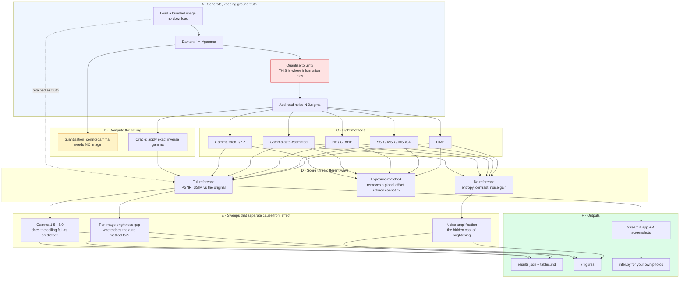

# Project 03 — Low-Light Enhancement: complete workflow

This document is the build record: what was decided, in what order, why, and what
each decision cost or bought. The [README](README.md) states the findings; this
states the process.

---

## 1 · The question, and why it is answerable

"Which low-light method is best" has no answer — it depends on the image, the
noise, and which metric you pick. So the question was narrowed until it became
falsifiable:

> **How much of the original is actually recoverable, and how close does each
> method get to that ceiling?**

That version is answerable because the degradation is **generated**. The original
is retained, so an oracle can apply the exact inverse, and the gap between any
method and that oracle is a real number rather than an opinion.

---

## 2 · The complete workflow



**The two highlighted boxes are the project.** Quantisation (red) is where the
information is destroyed, and the ceiling (amber) is computable from gamma alone
— before any image is loaded, before any method runs.

---

## 3 · Build order, and why that order

| Step | What | Why it had to come first |
|---:|---|---|
| 1 | `quantisation_ceiling()` | It needs no image. If the ceiling claim were wrong, nothing else would be worth building. |
| 2 | The oracle | Without it, "method X scored 19 dB" has no scale. 19 dB out of what? |
| 3 | The degradation + noise | Generated, so the original survives as truth. |
| 4 | The eight methods | Only now is there something to score them *against*. |
| 5 | Exposure matching | Added after Retinex scored 8 dB and the output plainly looked better than that. |
| 6 | The auto-gamma method | Added after noticing the fixed constant was the only member of its family. |
| 7 | Sweeps | Cause, not just effect. |
| 8 | UI, figures, docs | Last. They present results; they do not produce them. |

The ceiling came first deliberately. It is the one claim in the project that is
**arithmetic rather than measurement**, so it is the one that could be checked
before any of the expensive parts existed.

---

## 4 · Decisions, with the reasoning

### Why an oracle rather than "the best method"

A comparison of eight methods tells you which of the eight won. It cannot tell
you whether the winner was *good*. The oracle — handed the true gamma — converts
every score into a distance from what was actually achievable.

It also produced the headline: the oracle is **22.31 dB, not infinity**. Without
it, the natural reading of "best method scores 19.6 dB" is "there is 20 dB of
headroom left for a better algorithm". There is 2.7 dB.

### Why three kinds of metric

| Kind | Example | Needed because |
|---|---|---|
| Full reference | PSNR, SSIM | only possible because the degradation is generated |
| Exposure-matched | PSNR after brightness alignment | Retinex estimates reflectance, not exposure — raw PSNR scores it on the wrong quantity |
| No reference | entropy, contrast, noise | the only kind available on a real photo, and they **disagree** with the full-reference ones |

The disagreement is deliberate content, not an inconvenience. LIME has the
highest entropy (7.215) and a middling PSNR (14.8). If a reader takes only the
no-reference column, they reach a different conclusion — which is exactly the
trap project 26 is about.

### Why luminance-only processing

Equalising R, G and B independently shifts the colour balance and produces the
lurid output people associate with histogram equalisation. Every method here that
can work on luminance does, via YCrCb. That is the *fair* version of each method,
and fairness is what makes the comparison mean anything.

### Why noise amplification sits beside PSNR

Brightening is a multiplication. Multi-scale Retinex amplifies the noise
**8.45×**. A method that wins on brightness while amplifying noise eightfold has
not improved the photograph, and a table that omits that column would let it
appear to.

---

## 5 · The two findings, and how each was reached

### Finding 1 — the ceiling

Reached by asking a question with an arithmetic answer: how many of the 256 input
levels survive `round((v/255)^gamma * 255)`?

```python
v = np.arange(256, dtype=np.float64) / 255.0
darkened = np.round(np.power(v, gamma) * 255.0)
surviving = len(set(darkened.tolist()))     # 158 at gamma 3
```

Checked two ways: against a direct count (a test), and against the oracle's
measured PSNR falling monotonically as the level count falls. Both agree.

### Finding 2 — the average that states the opposite

This one was **not** planned. It appeared while fixing a different problem.

1. The fixed-gamma method was winning, which looked suspicious — 1/2.2 is a
   constant, and 2.2 is one of the sweep's own levels.
2. Verified it: at gamma 2.2 the fixed curve scores **exactly** what the oracle
   scores, because it *is* the oracle there.
3. Added an adaptive method so the family had a fair representative.
4. It lost. Averaged over six images it was 2.28 dB **worse**.
5. Broke the average apart per image — and found it winning on exactly the two
   images whose true brightness matched its assumption, by up to +5.46 dB, and
   losing by up to −7.70 dB elsewhere.

The mean of a bimodal distribution describes neither mode. Reporting only the
aggregate would have said "the adaptive method is worse", which is false in both
directions.

---

## 6 · What each stage costs

Measured on the reference machine, 6 images at gamma 3.0:

| Stage | Time |
|---|---:|
| Generate + darken + noise | ~15 ms per image |
| Fixed gamma | 11.5 ms |
| Auto gamma | 37.5 ms |
| Histogram equalisation | 0.69 ms |
| CLAHE | 0.89 ms |
| LIME | 20.8 ms |
| Single-scale Retinex | 110 ms |
| Multi-scale Retinex | 420 ms |
| MSRCR | 442 ms |
| **Full `run.py`** | **~2 min** |

The Retinex family is **40–60× slower** than the methods that beat it. That is
the whole argument for reporting a time column.

---

## 7 · Reproducing it

```bash
python run.py                  # regenerates every number and figure
pytest tests -v                # 45 tests
streamlit run ui/app.py        # the interactive app
python infer.py photo.jpg      # your own image
```

Every seed is pinned. `run.py` rewrites `results/results.json` and
`results/tables.md`, and the README's numbers are copied from those files rather
than typed.

---

## 8 · What would come next

* **Poisson noise.** Real low light is shot-noise dominated, and shot noise scales
  with signal — so the noise-amplification numbers would change shape, not just
  magnitude.
* **A learned exposure prior.** Out of scope for this repo, but the honest
  comparison point: the auto method fails because a single image cannot
  distinguish a dark scene from an under-exposed one. More data is precisely what
  would fix it.
* **Project 26** takes the metric disagreement seen here as its own subject.
* **Project 17** examines the CLAHE clip limit, which appears here only at its
  default.
