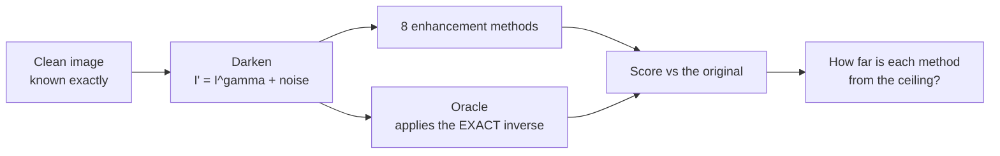
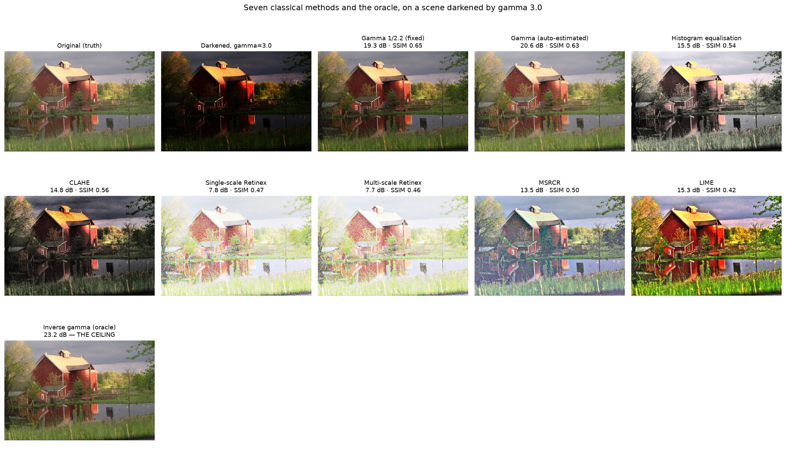
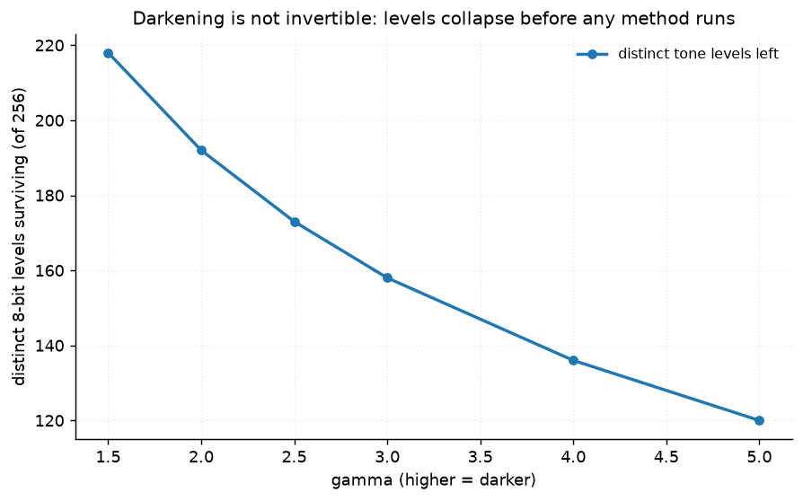
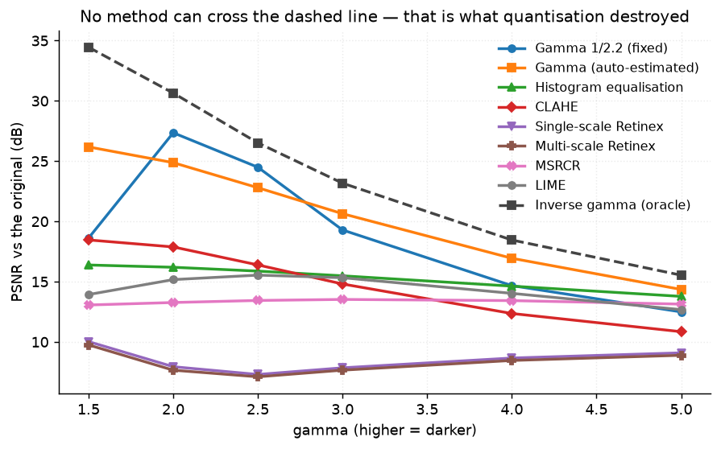
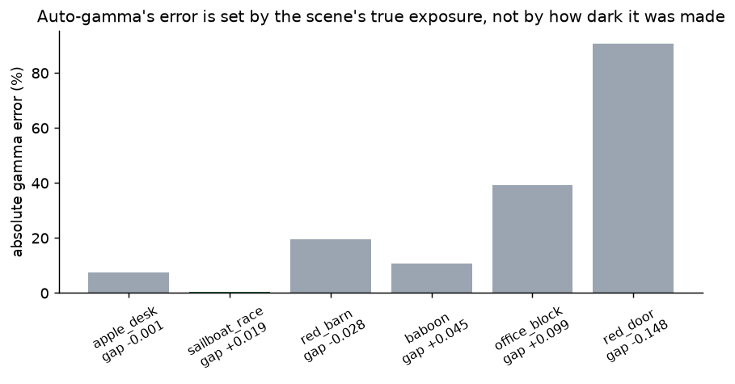
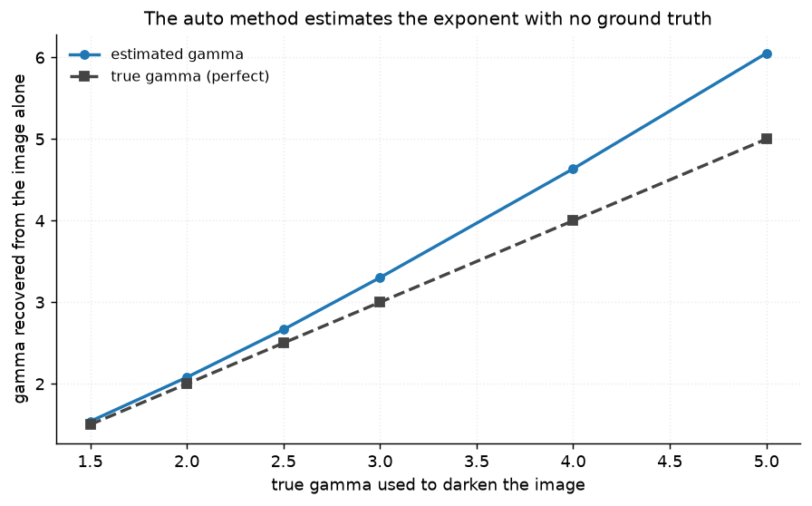
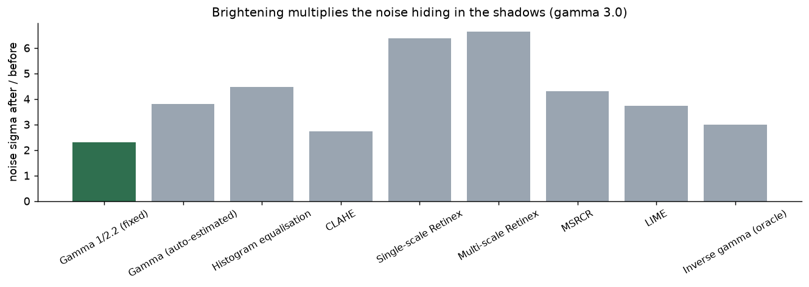
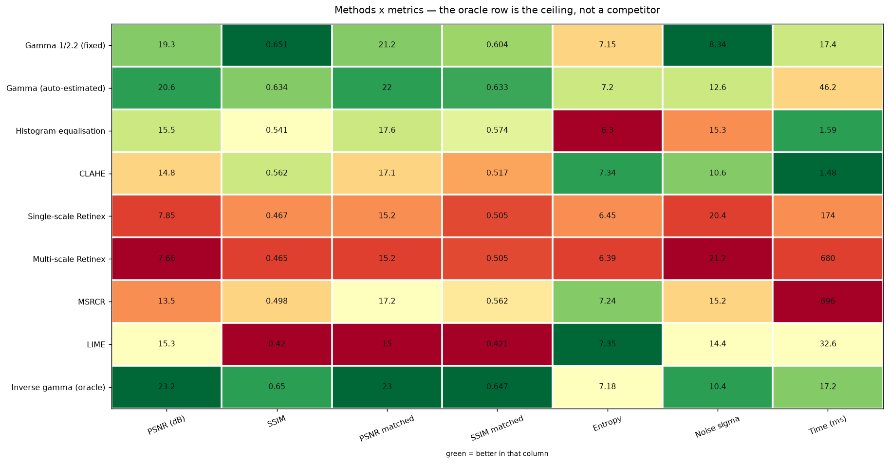
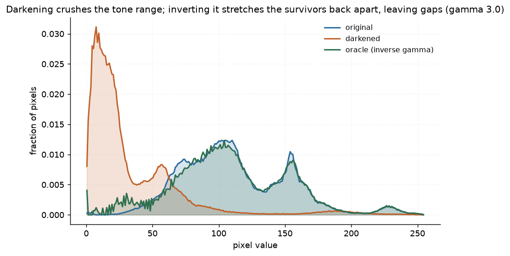
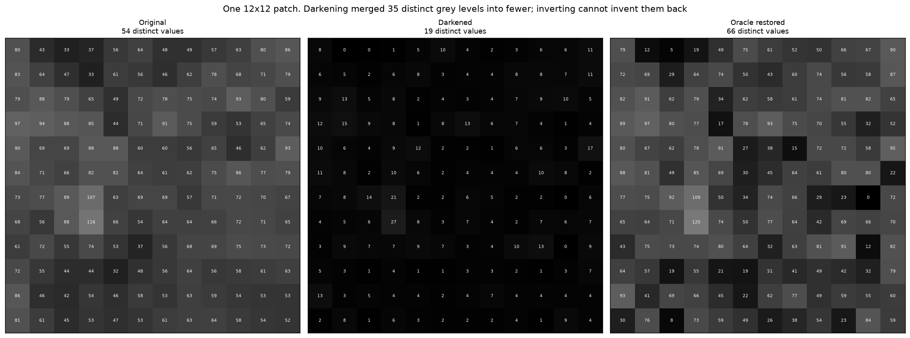

# 03 · Low-Light Enhancement — classical computer vision

[](https://www.python.org/)
[](https://opencv.org/)
[](#)
[](#tests)
[](#)

Eight classical methods brighten a dark photograph — gamma curves, histogram
equalisation, CLAHE, three flavours of Retinex, and LIME. **No neural network, no
training, no GPU, no dataset download.**

> **The finding, in one sentence.** The ceiling is **not** set by the algorithms.
> At gamma 3 only **158 of 256** tone levels survive the darkening, so even an
> oracle applying the *exact* inverse reaches **22.31 dB** and no method can do
> better — the information was destroyed before any of them ran.

> **The second finding, which a mean would have hidden.** An adaptive method that
> estimates its own correction beats a fixed constant by **+5.46 dB** where its
> assumption holds and loses by **−7.70 dB** where it does not. Averaged over six
> images it looks **2.28 dB worse** than the naive constant. The average states
> the opposite of what is happening.

**Jump to:** [What it does](#what-it-does) · 
[Input & output](#input--output) ·
[Results](#results) · [Run it](#run-it-yourself) · [Inference](#inference-try-it-on-your-own-image) ·
[How it works](#how-it-works) · [Problems solved](#problems-hit-and-how-they-were-solved) ·
[Limitations](#limitations) · [Keywords](#keywords)

---

## What it does



The degradation is **generated**, so the original is known exactly:

| Stage | What is known | Why it matters |
|---|---|---|
| Darkening | the exact gamma | the oracle can invert it perfectly |
| Quantisation | how many levels survive | the ceiling is computable **before** any image is processed |
| Noise | the exact sigma added | noise amplification is measurable, not guessed |
| Output | the true original | PSNR and SSIM are real, not proxies |

---


## Input & output

**Input** — either:

* a **bundled image darkened by a known gamma** (no download), with read noise
  added afterwards, exactly as a real sensor would;
* **your own dark photo**, uploaded through the UI or passed to `infer.py`.

**Output** — four images plus numbers:

| # | Output | What it is |
|---|---|---|
| 1 | Original | the ground truth (generated input only) |
| 2 | Darkened | what the method actually receives |
| 3 | Enhanced | the chosen method's output |
| 4 | Oracle | the exact inverse — the ceiling |

plus **PSNR**, **SSIM**, **gap to the oracle in dB**, **noise amplification**,
**entropy**, **RMS contrast** and **wall-clock ms**.

---

## Results

All numbers produced by `run.py` over 6 images and mirrored in
[`results/results.json`](results/results.json) and
[`results/tables.md`](results/tables.md). Nothing is hand-typed.

### Methods at gamma 3.0

| Method | PSNR (dB) | SSIM | PSNR matched | Entropy | Noise sigma | Time (ms) |
|---|---:|---:|---:|---:|---:|---:|
| **Gamma 1/2.2 (fixed)** | **19.609** | **0.5789** | **20.961** | 7.198 | **8.491** | 11.5 |
| Gamma (auto-estimated) | 17.327 | 0.533 | 19.701 | 7.361 | 15.563 | 37.5 |
| Histogram equalisation | 15.33 | 0.499 | 18.03 | 6.211 | 15.076 | **0.69** |
| CLAHE | 15.578 | 0.5101 | 17.276 | 7.099 | 8.939 | 0.89 |
| Single-scale Retinex | 7.967 | 0.4079 | 14.708 | 6.816 | 24.373 | 110.2 |
| Multi-scale Retinex | 7.713 | 0.4052 | 14.62 | 6.737 | **25.298** | 420.5 |
| MSRCR | 12.161 | 0.453 | 15.92 | 7.212 | 16.08 | 442.4 |
| LIME | 14.799 | 0.3953 | 14.302 | **7.215** | 13.228 | 20.8 |
| **Inverse gamma (oracle)** | **22.314** | 0.5731 | 22.245 | 7.263 | 11.353 | 10.7 |



### The ceiling is arithmetic, not an algorithm



Darkening maps the 256 input levels onto fewer outputs. The collapsed ones are
gone before any method sees the image:

| Gamma | Levels surviving | Oracle PSNR |
|---:|---:|---:|
| 1.5 | 218 | 33.54 |
| 2.0 | 192 | 29.36 |
| 2.5 | 173 | 25.48 |
| **3.0** | **158** | **22.31** |
| 4.0 | 136 | 17.98 |
| 5.0 | 120 | 15.31 |

This is computed with `quantisation_ceiling()`, which takes **no image** — only
gamma. It is a statement about 8-bit rounding, and it is why "AI can restore any
dark photo" is false in a specific, checkable way.



### The finding a mean destroys

The adaptive gamma method estimates its own exponent by assuming a well-exposed
photograph averages mid-grey. Per image, at gamma 3.0:

| Image | True mean | Gap from 0.45 | Fixed | Auto | Δ | Oracle |
|---|---:|---:|---:|---:|---:|---:|
| chelsea | 0.452 | **+0.002** | 18.87 | **24.33** | **+5.46** | 24.39 |
| astronaut | 0.449 | **−0.001** | 20.46 | **21.78** | **+1.32** | 21.23 |
| coffee | 0.387 | −0.063 | 20.00 | 17.49 | −2.52 | 20.76 |
| retina | 0.352 | −0.098 | 19.32 | 15.21 | −4.11 | 19.56 |
| immunohisto. | 0.629 | +0.179 | 20.54 | 14.48 | −6.06 | 28.44 |
| rocket | 0.256 | −0.194 | 18.46 | 10.77 | **−7.70** | 19.50 |

**Two things worth reading carefully.**

1. **On `chelsea` the adaptive method reaches 24.33 dB against an oracle's
   24.39** — it is 0.06 dB from a method that was *told* the answer, while having
   no access to it. That is what an assumption buys when it holds.
2. **It wins on exactly the two images whose true mean sits within 0.002 of the
   target.** Everywhere else it loses in proportion to the gap.



The relationship is monotonic with a **rank correlation of 0.89** between the
brightness gap and the estimation error:

| Image | Gap | Mean gamma error |
|---|---:|---:|
| astronaut | 0.001 | −6.4% |
| chelsea | 0.002 | +4.7% |
| coffee | 0.063 | +28.3% |
| retina | 0.098 | +55.4% |
| immunohistochemistry | 0.179 | −47.7% |
| rocket | 0.194 | **+169.5%** |

A dark scene at midnight and a well-lit scene that was under-exposed look
**identical** to this estimator, and nothing in a single image can separate them.
That is not a defect of the implementation — it is why cameras have an exposure
compensation dial.



### Retinex scores badly for a reason that is not Retinex's fault

Single-scale Retinex scores **7.97 dB** raw and **14.71 dB** after exposure
matching — a **6.74 dB** swing from changing nothing but the metric.

Retinex estimates **reflectance**, not exposure. Its output is the scene's colour
independent of the lighting, which is a different quantity from "the original
image". Scoring it with raw PSNR measures a global brightness offset, not
recovered detail. Both columns are reported for exactly this reason.

### Brightening multiplies the noise that was hiding in the shadows



| Method | Noise after | Amplification |
|---|---:|---:|
| **Gamma 1/2.2 (fixed)** | 8.491 | **2.72×** |
| CLAHE | 8.939 | 2.73× |
| LIME | 13.228 | 4.37× |
| Histogram equalisation | 15.076 | 5.16× |
| MSRCR | 16.08 | 5.26× |
| Single-scale Retinex | 24.373 | 8.14× |
| **Multi-scale Retinex** | **25.298** | **8.45×** |

Brightening is a multiplication, so it multiplies whatever noise was in the
shadows. A method that wins on brightness while tripling the noise has not
improved the picture — which is why this column sits beside PSNR rather than in a
footnote.







---

## Run it yourself

```bash
python run.py                      # full experiment, ~2 min
python run.py --gamma 4.5          # a different darkness
python run.py --images 3           # fewer images, faster
pytest tests -v                    # 45 tests
```

---

## Inference: try it on your own image


### 2 · From the command line

```bash
python infer.py my_dark_photo.jpg
```

```text
input   : my_dark_photo.jpg  1200x800
method  : Gamma (auto-estimated)
estimated gamma : 2.81   (the darkening this photo appears to have suffered)
brightness      : 0.174 -> 0.450
entropy         : 6.29 -> 7.36 bits
noise           : 3.41 -> 8.49 sigma  (2.49x amplification)
time            : 37.5 ms
wrote   : enhanced.png
```

Compare all eight:

```bash
python infer.py my_dark_photo.jpg --all-methods
```

| Flag | Effect |
|---|---|
| `--method CLAHE` | any of the eight |
| `--all-methods` | run every method and compare |
| `--out enhanced.png` | where to write |

### 3 · As a library

```python
from shared.io import imread, imwrite
import low_light as ll

dark = imread("my_dark_photo.jpg")             # RGB uint8
out = ll.enhance(dark, method="Gamma (auto-estimated)")
imwrite("enhanced.png", out)

# what did the method decide? not hidden:
print("estimated gamma:", 1.0 / ll.estimate_gamma(dark))
```

---

## How it works

### The degradation

```python
I_dark = ((I_clean / 255) ** gamma) * 255      # then quantise to uint8
I_dark = I_dark + N(0, sigma)                  # sensor read noise
```

Perfectly invertible in real arithmetic. **Not** invertible after the uint8
round-trip, which is the entire point.

### The eight methods

| Method | Model | Knob that matters |
|---|---|---|
| Gamma 1/2.2 (fixed) | a fixed power curve | none — that is its weakness |
| Gamma (auto-estimated) | power curve, exponent from the image | the assumed target brightness |
| Histogram equalisation | flatten the CDF | none |
| CLAHE | local equalisation | the clip limit |
| Single-scale Retinex | `log(I) − log(blur(I))` | sigma |
| Multi-scale Retinex | three sigmas combined | the sigma set |
| MSRCR | MSR + colour restoration | the restoration gain |
| LIME | estimate illumination, divide it out | the structure prior |

All operate on **luminance only** (YCrCb Y channel) where applicable. Equalising
R, G and B independently shifts the colour balance and produces the lurid output
people associate with HE; keeping chroma intact is the fair version.

---

## Problems hit, and how they were solved

Each gives the **symptom**, the **file and line**, the **code that was wrong** and
the **code that replaced it**.

| # | Symptom | Where | Cost |
|---:|---|---|---|
| 1 | MSRCR output sign-flipped in shadows | [`src/low_light.py:224`](src/low_light.py#L224) | method looked broken, wasn't |
| 2 | Retinex scored 8 dB, looked fine | [`src/low_light.py:330`](src/low_light.py#L330) | wrong metric, not wrong method |
| 3 | A magic constant was the only gamma | [`src/low_light.py:63`](src/low_light.py#L63) | measured luck, not the family |
| 4 | Exposure matching undershot by 0.025 | [`src/low_light.py:376`](src/low_light.py#L376) | same size as the differences compared |
| 5 | Auto-gamma 29× slower than the method it beats | [`src/low_light.py:104`](src/low_light.py#L104) | 324 ms → 37.5 ms |
| 6 | The speedup silently broke the estimate | [`src/low_light.py:118`](src/low_light.py#L118) | **−4.6 dB**, caught by verifying |

---

### 1 · MSRCR's colour restoration flipped the sign of every shadow pixel

**Symptom:** MSRCR output was dark, colour-shifted garbage. SSIM **0.13**.

The textbook form of the colour restoration term is:

```python
# WRONG - a log of a near-zero ratio
restoration = beta * (np.log(alpha * f) - np.log(f.sum(axis=2, keepdims=True)))
```

For a near-black pixel `f → 0`, so `log(alpha * f) → log(eps) = −13.8`, and
multiplied by `beta = 46` that is **−640**. Every shadow pixel came out
massively negative and the sign flipped.

**Fix — `src/low_light.py:224`**

```python
# RIGHT - a bounded form: log1p of a ratio that is already clipped to [0, 1]
total = f.sum(axis=2, keepdims=True) + EPS
ratio = np.clip(f / total, 0.0, 1.0)
restoration = beta * np.log1p(alpha * ratio)   # >= 0 everywhere, cannot explode
```

Guarded by a test that feeds it a pure-black image and asserts the restoration
term is non-negative and finite everywhere.

### 2 · Retinex looked broken, and the metric was at fault

**Symptom:** SSR scored **7.97 dB** — worse than several methods that plainly look
worse. The output was clearly recovering detail.

Retinex estimates **reflectance**, not exposure. Its output is correct up to a
global brightness scale, and PSNR punishes that scale heavily.

**Fix — `src/low_light.py:330`, report both, never just one**

```python
"psnr_db":          round(float(np.mean(a["psnr"])), 3),
# Retinex estimates reflectance, not exposure. Raw PSNR therefore scores it on
# a global brightness offset rather than on recovered detail. Both columns are
# reported so the reader can see which part of the score is the method and
# which part is the metric.
"psnr_matched_db":  round(float(np.mean(a["psnr_matched"])), 3),
```

**7.97 dB → 14.71 dB** from changing nothing but the comparison.

### 3 · A single magic constant was the only representative of its family

**Symptom:** `Gamma 1/2.2` won the comparison. But 1/2.2 is a *constant*, and it
is the **exact** inverse when the scene was darkened by 2.2 — which is one of the
sweep's own levels.

Verified directly: at gamma 2.2 with no noise, the fixed curve scores exactly
what the oracle scores, to two decimal places, **because it is the oracle there**.

```python
def test_fixed_gamma_equals_the_oracle_at_its_own_gamma():
    dark = synth.low_light(clean, gamma=2.2, noise_sigma=0.0, seed=0)
    assert psnr(ll.enhance_gamma(dark), clean) == pytest.approx(
        psnr(ll.enhance_oracle(dark, 2.2), clean), abs=0.01
    )
```

This is exactly the problem project 01 hit from the other direction, where a
magic number made a method look *worse* than it was.

**Fix — `src/low_light.py:63`, add a method that estimates instead of assuming**

```python
def enhance_gamma_auto(img, target_brightness=AUTO_TARGET_BRIGHTNESS):
    """Power-law curve whose exponent is ESTIMATED from the image.

    Needs no ground truth -- only the assumption that a well-exposed photograph
    averages near mid-grey, which is what every camera's auto-exposure assumes.
    """
    return to_uint8(np.power(to_float(img), estimate_exponent(img, target_brightness)))
```

That produced the project's second finding — the adaptive method is better *and*
worse than the constant, depending entirely on whether its assumption holds, and
the average of those two facts is a third number that describes neither.

### 4 · Exposure matching systematically undershot

**Symptom:** a test asserting that exposure matching equalises mean brightness
failed by **0.025** — the same order as the differences between the methods being
compared.

```python
# WRONG - scale by the ratio of means
return to_uint8(p * (target_mean / current_mean))
```

The result is **clipped** to [0, 1]. Scaling up saturates the highlights, which
pulls the mean back down, so the naive ratio always undershoots.

**Fix — `src/low_light.py:376`, solve for the scale that survives clipping**

```python
# bisect for the factor that hits the target AFTER clipping
lo, hi = 0.0, 32.0
for _ in range(40):
    mid = 0.5 * (lo + hi)
    if float(np.clip(p * mid, 0.0, 1.0).mean()) < target:
        lo = mid
    else:
        hi = mid
```

### 5 · The new method was 29× slower than the one it was meant to improve on

**Symptom:** `Gamma (auto-estimated)` took **324 ms** against the fixed curve's
**11 ms**. The bisection raised every one of 300,000 pixels to a power, 40 times.

**Fix — `src/low_light.py:104`** — the estimator only needs the image's *mean*
under a candidate exponent, and a mean is exactly what a subsample estimates well:

```python
#: Measured: 324 ms -> 37.5 ms, recovered exponent unchanged to 2 decimal places.
ESTIMATE_SAMPLE_PX = 20_000
```

A **deterministic stride**, not a random sample — the same image must always
produce the same estimate or nothing downstream is reproducible.

### 6 · The speedup silently broke the estimate, and only verifying caught it

**Symptom:** none. Tests passed. The code ran 17× faster.

The estimate had moved from **3.24 to 1.74** and PSNR had dropped **21.78 → 17.17**.

```python
# WRONG - flatten, then stride
f = to_float(img).ravel()
f = f[:: max(1, f.size // ESTIMATE_SAMPLE_PX)]
```

Flattening an `(H, W, 3)` image interleaves `R,G,B,R,G,B…`. **Any stride that is a
multiple of 3 samples a single colour channel** — so the estimator was computing
the mean of, effectively, the red channel alone.

**Fix — `src/low_light.py:118`, stride over pixels rather than over values**

```python
# Stride over PIXELS, not over raw values.
flat = f.reshape(-1, f.shape[-1]) if f.ndim == 3 else f.reshape(-1, 1)
if flat.shape[0] > ESTIMATE_SAMPLE_PX:
    flat = flat[:: max(1, flat.shape[0] // ESTIMATE_SAMPLE_PX)]
```

Verified against full-resolution estimates on all six images: **maximum
disagreement 0.02**, and PSNR restored to 21.774.

**This bug produced no error, no warning, and no failing test.** It was found only
by re-measuring the thing the optimisation was supposed to leave unchanged —
which is the habit, not the luck.

---

## Limitations

* **One degradation model.** Real low light is Poisson-dominated shot noise plus
  read noise plus a non-linear camera response, not a clean gamma. The findings
  about the *ceiling* generalise because they are about quantisation; the
  specific dB values do not.
* **Six images.** Enough to show that the auto-gamma error tracks the brightness
  gap, not enough to claim a precise coefficient.
* **The oracle needs the true gamma.** It is a ceiling, not a method. Nothing in
  the table can be deployed as "use the oracle".
* **PSNR and SSIM disagree** about several rows here. Project 26 takes that
  disagreement as its subject rather than a footnote.
* **LIME is a simplified implementation** — an illumination map from a max-RGB
  prior with a structure-aware smoothing, not the full weighted solver from the
  paper. It is labelled as such rather than presented as a faithful reproduction.

---

## Tests

```bash
pytest tests -v        # 45 tests
```

They cover the arithmetic that the findings rest on:

* the quantisation ceiling matches a direct count of surviving levels;
* the oracle cannot be beaten by any method that does not know gamma;
* the inverse is exact in float — proving the ceiling comes from the 8-bit
  round-trip, not from the model being wrong;
* no method returns NaN or a constant image on a black input;
* MSRCR's restoration term stays bounded on black pixels;
* the auto-gamma error's **rank correlation** with the brightness gap is > 0.85;
* the fixed curve **equals** the oracle at gamma 2.2.

---

## Keywords

low-light image enhancement · classical computer vision · Retinex · single-scale
Retinex · multi-scale Retinex · MSRCR · LIME · CLAHE · histogram equalisation ·
gamma correction · auto exposure · tone mapping · quantisation ceiling · PSNR ·
SSIM · noise amplification · image restoration without deep learning · OpenCV ·
scikit-image · Python · no GPU · reproducible image processing experiments
