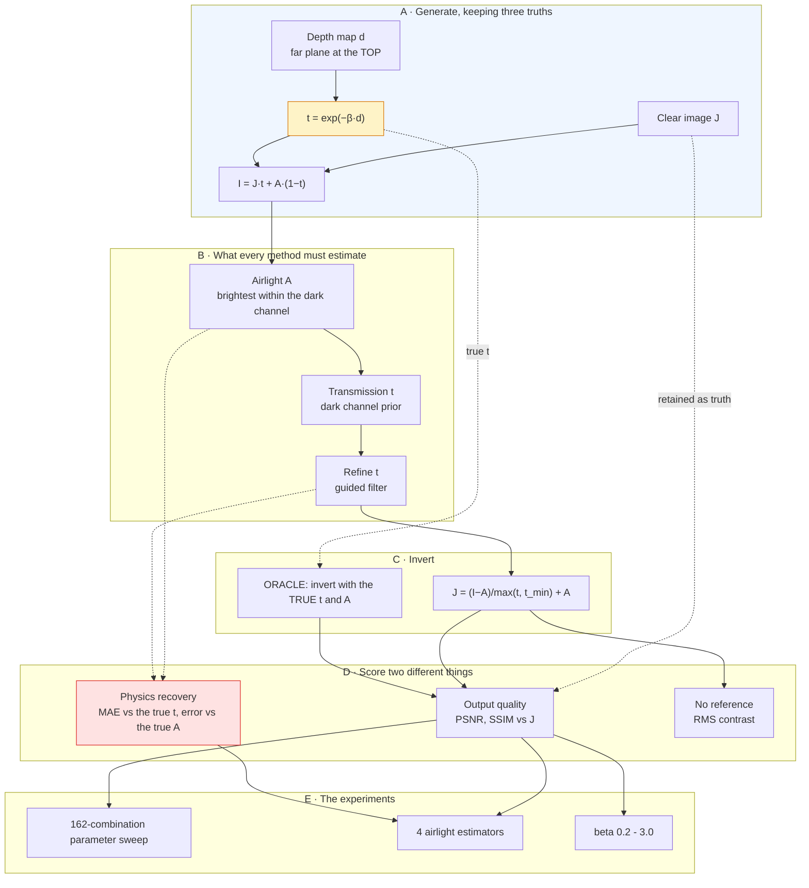

# Project 04 — Dehazing: complete workflow

The [README](README.md) states the findings. This states how they were reached,
in what order, and what each decision cost.

---

## 1 · Why this question, and not "which dehazing method is best"

Haze has something almost no other image degradation has: **a physical model with
every unknown written down.**

```
I(x) = J(x)·t(x) + A·(1 − t(x))          t(x) = exp(−β·d(x))
```

So the question can be sharper than "which output looks clearest":

> **Did the method recover the physics, or did it just add contrast?**

That is answerable because generating the haze retains `J`, `t` **and** `A`. Most
projects in this repo know the clean image; this one also knows the intermediate
quantity every method is trying to estimate.

---

## 2 · The complete workflow



**The two highlighted boxes are the project.** The transmission map (amber) is
the quantity being estimated, and scoring it directly (red) is what separates
"removed haze" from "added contrast".

---

## 3 · Build order

| Step | What | Why here |
|---:|---|---|
| 1 | The scattering model in the generator | Without exact `t`, the central question is unaskable. |
| 2 | The oracle | Converts "18.9 dB" into "31 dB below what was achievable". |
| 3 | DCP + guided refine | The real method. |
| 4 | **CLAHE as a control** | Added early, deliberately: something that *looks* like dehazing and models nothing. |
| 5 | Retinex | A model that provably cannot fit — multiplicative applied to additive. |
| 6 | Parameter sweep | The paper's constants were 0.86 dB worse on this data. |
| 7 | Airlight comparison | Added after noticing `A = 1.000`. Produced the project's finding. |
| 8 | UI, figures, docs | Last. |

---

## 4 · Decisions, with reasoning

### Why the far plane is at the top of the frame

`add_haze` puts the deepest haze at the **top**. That is how an outdoor scene
recedes: the horizon is distant and hazy, the ground at your feet is close and
clear. Getting it upside down puts the densest haze on the nearest object, which
no method can then explain — and every result would be a measurement of that bug.

### Why CLAHE is in the table

Because it wins a column. CLAHE reaches **0.207 RMS contrast**, higher than the
physical method's 0.186, while scoring **15.00 dB** against 22.49. If it were not
in the table, a reader could reasonably assume contrast tracks quality here. It
does not, and the only way to show that is to include something that games it.

### Why ω is 0.80 and not the paper's 0.95

Measured. 162 combinations over six images:

```
omega  patch  radius   eps    tmin    PSNR   SSIM
 0.95     15      40  1e-03   0.10   18.64  0.852   <- He et al.
 0.80      7      40  1e-02   0.05   19.50  0.872   <- measured best
```

Copying constants from a paper written for different images, at a different
resolution, is not reproduction — it is cargo-culting. The values are in the
source with the measurement that chose them.

**Then the benchmark images changed, which turned that sweep into a held-out
test.** Four constants fitted on four scikit-image samples is exactly the shape
of a result that disappears on new data. Re-measured on the six outdoor
photographs the project now uses:

```
omega  patch  radius   eps    tmin    PSNR   SSIM    tMAE
 0.95     15      40  1e-03   0.10   20.26  0.937  0.0722   <- He et al.
 0.80      7      40  1e-02   0.05   22.49  0.960  0.0638   <- these defaults
```

The margin **grew from +0.86 dB to +2.23 dB** on images the sweep never saw.

### Why the *worse* airlight estimator is the default

This was the hard call. Four estimators:

| | Airlight error | Transmission MAE | PSNR |
|---|---:|---:|---:|
| Brightest (default) | 0.0445 | 0.0638 | **22.489** |
| Median | **0.0340** | **0.0620** | 22.429 |
| 90th percentile | **0.0383** | **0.0626** | 22.424 |

The default is worse at estimating both intermediate quantities and better at
producing the image. The recovery `J = (I−A)/t + A` is over-estimating `A` and
over-estimating `t`; the errors partially cancel, and fixing one alone breaks the
cancellation.

**The size of this changed when the images did, and that is worth stating.** On
the original scikit-image scene set the gap was **1.00 dB**, largely carried by
one image whose airlight estimate saturated at A = 1.000 on a launch-pad
floodlight. On six ordinary outdoor photographs nothing saturates and the gap is
**0.06 dB** — a 94% shrink. What survived is the *direction*: all three
more-accurate estimators score lower, not one. A single-image finding would have
been indistinguishable from noise here; three independent estimators agreeing is
not.

The project optimises **output quality**, because that is what a dehazing method
is for — and the losing configuration stays in the table, because the comparison
*is* the result.

---

## 5 · What each stage costs

Six images at β = 1.4:

| Stage | Time |
|---|---:|
| CLAHE | 1.6 ms |
| Oracle inversion | 15.1 ms |
| Gamma control | 16.4 ms |
| Dark channel prior | 45.8 ms |
| DCP + guided refine | 59.0 ms |
| Multi-scale Retinex | **651 ms** |
| **Full `run.py`** | **~90 s** |

Retinex is **11× slower than the best method and 10.6 dB worse.** Reporting the
time column is what makes that visible.

---

## 6 · Reproducing it

```bash
python run.py                 # regenerates every number and figure
streamlit run ui/app.py       # the interactive app
python infer.py photo.jpg     # your own hazy image
```

`run.py` rewrites `results/results.json` and `results/tables.md`; the README's
numbers are copied from those files rather than typed.

---

## 7 · What would come next

* **A non-monotonic depth map.** A near object against a distant sky is the case
  where the dark channel prior's assumption is most likely to break.
* **Spatially varying airlight.** A single global `A` is wrong near the sun.
* **Project 26** takes the contrast-versus-PSNR disagreement seen here as its own
  subject — which metric is right, and how would you know.
* **The cancellation finding deserves its own study.** It appeared twice
  independently here (once with a quadtree airlight, once with a median one), and
  a proper treatment would map the error surface rather than sample four points
  on it.
