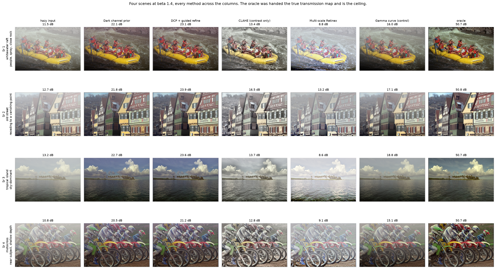
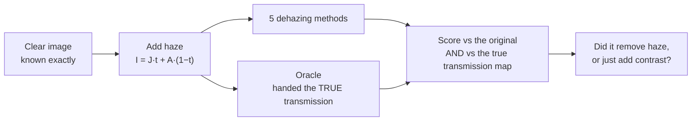
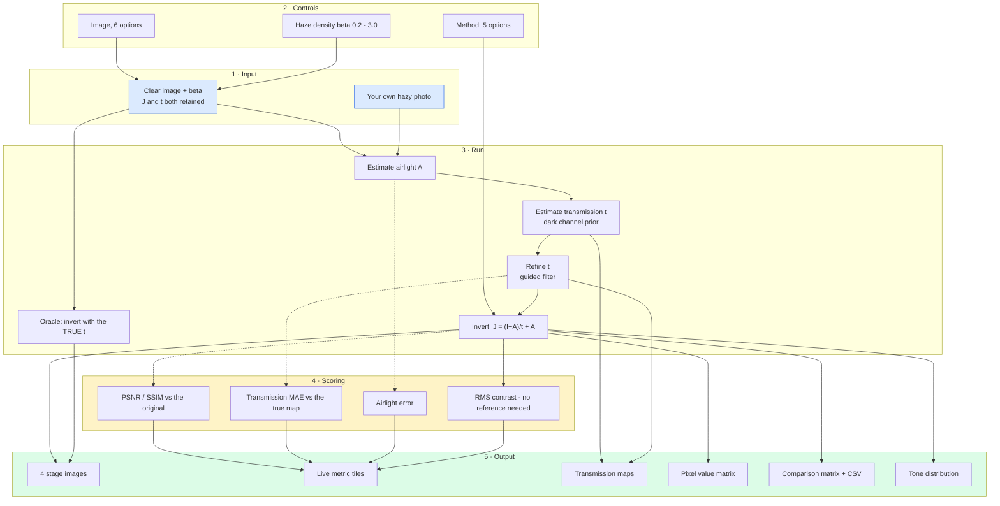

# 04 · Dehazing — classical computer vision

[](https://www.python.org/)
[](https://opencv.org/)
[](#)
[](#)

Haze is not a loss of light. It is an **additive veil with a known physical
model**, and that makes it invertible in a way most image degradations are not:

```
I(x) = J(x)·t(x) + A·(1 − t(x))          t(x) = exp(−β·d(x))
```

Five classical methods try to invert it. **No neural network, no training, no
GPU, no dataset download.**

---

## Results

Four scenes with different **depth structure** down the rows, every method
across the columns, PSNR printed in each cell.



| Sr | Scene | Hazy input | Dark channel prior | **DCP + guided refine** | CLAHE (contrast only) | Multi-scale Retinex | Gamma curve (control) | Oracle |
|---:|---|---:|---:|---:|---:|---:|---:|---:|
| 1 | whitewater raft · people, spray, close rock | 11.5 dB | 22.1 dB | **23.1 dB** | 13.4 dB | 8.8 dB | 16.0 dB | 50.7 dB |
| 2 | old street · receding to a vanishing point | 12.7 dB | 21.8 dB | **23.9 dB** | 16.5 dB | 13.2 dB | 17.1 dB | 50.8 dB |
| 3 | tropical island · sky-dominant | 13.2 dB | 22.7 dB | **23.6 dB** | 13.7 dB | 8.6 dB | 18.8 dB | 50.7 dB |
| 4 | motocross · near subject, shallow depth | 10.8 dB | 20.5 dB | **21.2 dB** | 12.8 dB | 9.1 dB | 15.1 dB | 50.7 dB |

**Look at the Retinex column against the Hazy input column.** Retinex is *worse
than doing nothing* on three of the four rows — 8.8 dB against a hazy 11.5 on
row 1, 8.6 against 13.2 on row 3, 9.1 against 10.8 on row 4 — while producing an
image that visibly looks processed. Retinex models
`image = illumination × reflectance`, which is multiplicative; haze is additive.
The model cannot represent the degradation, so applying it moves every pixel
further from the truth.

**And CLAHE is the reason a contrast metric cannot be trusted here.** It beats
the hazy input on all four rows, so it is not broken — but it has the **highest
RMS contrast of any method in this project**, 0.207 against
`DCP + guided refine`'s 0.186, while scoring 7.5 dB lower. Rank these six columns
by contrast and CLAHE comes first; rank them by distance from the truth and it is
fourth. That gap is the whole reason the control columns are in the table.

**Row 3 is the dark channel prior's advertised failure case and it does not
fail.** The prior assumes some patch somewhere has a near-black pixel; a frame
that is two thirds bright sky and flat water should break it. It scores 23.6 dB
— the second best row in the table — because the palms and the dark water band
supply the dark pixels the sky does not.

**Where it does break is a scene with no dark pixels at all.** The candidate log
below shows the aeroplane against a pale sky gaining **+3.3 dB** where the raft
gains +11.7. That scene is excluded from the figure because the gate keeps the
best survivor of each family, but the number is the prior's real limit.

The four scenes were **chosen by the code**. Twelve candidates are posed across
six depth families, each is dehazed and scored, anything gaining under 2 dB is
dropped as a broken sample, and the best survivor of each family is kept so the
table cannot fill with four variations on one depth profile:

```
gallery candidate old_street        keep — 12.7 dB hazy, +11.2 dB best  [street]
gallery candidate painted_chalet    keep — 12.4 dB hazy, +10.7 dB best  [street]
gallery candidate stone_house       keep — 12.5 dB hazy,  +8.5 dB best  [flat]
gallery candidate motocross         keep — 10.8 dB hazy, +10.4 dB best  [flat]
gallery candidate mountain_stream   keep — 11.1 dB hazy,  +9.7 dB best  [mountain]
gallery candidate whitewater_raft   keep — 11.5 dB hazy, +11.7 dB best  [mountain]
gallery candidate lighthouse_cliff  keep — 13.8 dB hazy,  +8.5 dB best  [coast]
gallery candidate lighthouse_lawn   keep — 13.2 dB hazy,  +7.5 dB best  [coast]
gallery candidate moored_boat       keep — 15.0 dB hazy,  +8.4 dB best  [water]
gallery candidate sailboats         keep — 14.4 dB hazy,  +5.2 dB best  [water]
gallery candidate tropical_island   keep — 13.2 dB hazy, +10.5 dB best  [sky]
gallery candidate warplane          keep — 17.8 dB hazy,  +3.3 dB best  [sky]
```

The spread across those twelve — **+3.3 dB to +11.7 dB for the same method on
the same haze density** — is the part a single-image figure hides. The scene
matters more than the method choice does.

These are real photographs and they are still scored, which is a different
situation from project 01. The haze is **synthesised** with a known transmission
map, so the clean original is exact ground truth. Nothing here is a number
invented for an image that has no answer.

---

> **The finding, in one sentence.** A **more accurate** airlight estimate and a
> **more accurate** transmission map produce a **worse** dehazed image. Cutting
> the airlight error from 0.0445 to 0.0340 and the transmission MAE from 0.0638
> to 0.0620 moves PSNR the wrong way, 22.489 dB → 22.429 dB. The effect is small
> — 0.06 dB — but it is **consistent in direction across all three** more-accurate
> estimators, because the two errors partially cancel in `J = (I−A)/t + A` and
> fixing one removes half of a cancelling pair.

> **The control that matters.** CLAHE achieves the **highest contrast of any
> method** (0.207, above even `DCP + guided refine`'s 0.186) while scoring
> **15.00 dB** against the physical method's **22.49 dB**. Looking clearer is not
> being dehazed.

> **On thin haze, the method is worse than doing nothing.** At β = 0.4 the hazy
> input scores **21.33 dB** and the best method returns **19.84 dB** — it costs
> 1.48 dB to run the algorithm. The mean signed transmission error is **−0.129**
> there: the prior believes the scene is hazier than it is and removes a veil that
> was never present. The error crosses zero at β ≈ 1.4, which is where the gain
> peaks. **A dehazer needs a "do nothing" branch.**

**Jump to:** [Results](#results) · [What it does](#what-it-does) · [Screenshots](#screenshots) ·
[UI → results](#how-the-ui-connects-to-the-results) · [Full tables](#full-results-tables) ·
[Run it](#run-it-yourself) · [Inference](#inference-try-it-on-your-own-image) ·
[How it works](#how-it-works) · [Problems solved](#problems-hit-and-how-they-were-solved) ·
[Limitations](#limitations) · [Keywords](#keywords)

---

## What it does



Because the haze is generated, **two** things are known, not one:

| Known | Lets us ask |
|---|---|
| the clear image `J` | how close is the output? (PSNR, SSIM) |
| the transmission map `t` | **did it recover the physics?** (transmission MAE) |
| the airlight `A` | how good is the airlight estimate? |

That second row is what separates this from a contrast comparison. "Looks
clearer" is satisfied by any histogram stretch; recovering `t` is only satisfied
by actually inverting the scattering.

---

## Screenshots

All captures of the **live app**. Every number was computed at the moment the
screenshot was taken.

### 1 · Original, hazy, dehazed, oracle

Drag the haze density and watch the recovery fall apart. The four panels are the
truth, the veiled input, the method's output and the oracle's.


### 2 · The transmission map — where the physics lives

The true map, the dark channel it is estimated from, the blocky patch-wise
estimate, and the guided-filter refinement. **The guided filter's job is not to
be more accurate on average** — it is to put the depth edges on object
boundaries instead of on patch boundaries.


### 3 · Every method against every metric

Watch the **contrast column disagree with PSNR**.


### 4 · The veil, as numbers

A 12×12 patch. Haze pulls every value toward the airlight; dehazing pushes them
back apart.


### 5 · Tone distribution


---

## How the UI connects to the results



**The dotted paths need ground truth**, so they exist only when the app generated
the haze. On an uploaded photo it still shows the airlight estimate, the
transmission range and the contrast — all of which need no reference — and says
plainly that PSNR is unavailable.

---

## Full results tables

Produced by `run.py` over **six outdoor photographs** at β = 1.4, mirrored in
[`results/results.json`](results/results.json) and
[`results/tables.md`](results/tables.md). The six are chosen for depth
structure, not for looks: a street receding to a vanishing point, a mountain
stream, a rocky coast, a flat farmhouse wall with almost no depth range, a
sky-dominant seascape, and a boat in shallow water.

### Five methods and the oracle

| Method | PSNR (dB) | SSIM | RMS contrast | Transmission MAE | Time (ms) |
|---|---:|---:|---:|---:|---:|
| Dark channel prior | 21.438 | 0.9264 | 0.1813 | 0.0725 | 45.8 |
| **DCP + guided refine** | **22.489** | **0.9600** | 0.1857 | **0.0638** | 59.0 |
| CLAHE (contrast only) | 15.003 | 0.8392 | **0.2067** | — | **1.6** |
| Multi-scale Retinex | 11.763 | 0.7586 | 0.1759 | — | 651.1 |
| Gamma curve (control) | 17.986 | 0.8694 | 0.1937 | — | 16.4 |
| **True transmission (oracle)** | **50.764** | **0.9969** | 0.1972 | — | 15.1 |

The hazy input scores **13.04 dB**. So the best real method gains **+9.45 dB**,
and the oracle — handed the true transmission map — gains **+37.72 dB**.


**Three things worth reading carefully.**

1. **CLAHE wins the contrast column and loses by 7.5 dB.** It has no notion of
   transmission at all; it stretches what the veil left behind. Any evaluation
   that scores dehazing by contrast alone would rank it above the physical method.
2. **Retinex scores 11.76 dB — worse than the 13.04 dB hazy input it was given.**
   That is not an implementation failure. Retinex models
   `image = illumination × reflectance`, which is **multiplicative**. Haze is
   **additive**. The model cannot represent the degradation, so "enhancing" makes
   it worse than leaving the image alone.
3. **The oracle is 28 dB above the best real method.** Almost all of that gap is
   the transmission estimate, not the inversion: with the true `t`, the same
   inversion code reaches 50.8 dB.

### The finding: a better estimate, a worse image


| Airlight estimator | Airlight error | Transmission MAE | Saturated | PSNR (dB) | SSIM |
|---|---:|---:|---:|---:|---:|
| **Brightest candidate (default)** | 0.0445 | 0.0638 | 0 | **22.489** | 0.9600 |
| Median of candidates | **0.0340** | **0.0620** | 0 | 22.429 | **0.9606** |
| 90th percentile per channel | **0.0383** | **0.0626** | 0 | 22.424 | 0.9604 |
| Brightest, excluding saturated | 0.0445 | 0.0638 | 0 | **22.489** | 0.9600 |

Read the first two rows against each other. The median estimator is **better on
every intermediate quantity** — airlight error 0.034 vs 0.044, transmission MAE
0.062 vs 0.064 — and produces an image **0.060 dB worse**. So does the 90th
percentile estimator, which is also better on both intermediates and also scores
lower. **Three estimators, three times the same direction.**

**Why.** The recovery is `J = (I − A)/t + A`. The default over-estimates `A`
*and* over-estimates `t`, and those two errors push the result in opposite
directions. Correcting only the airlight removes one half of a cancelling pair
and the residual error grows.

**How big is it, honestly.** 0.060 dB is small — far smaller than the 1.0 dB this
project measured on its earlier scikit-image scene set, where one image's
airlight estimate was saturated at A = 1.000 by a launch-pad floodlight. On six
ordinary outdoor photographs no estimate saturates at all (the `Saturated` column
is 0 throughout) and the effect shrinks to a fraction of a dB. **The size of the
finding depended on the images, and swapping the images shrank it by 94%.** The
direction survived; the magnitude did not, and both are reported.

It does **not** mean the default estimator is good. It means **an intermediate
metric is not a proxy for the thing you actually want**, and that optimising one
in isolation can move the real objective backwards.

The default here was chosen on **output quality**, which is what the project is
trying to produce — and the more accurate alternative is kept in the table rather
than deleted, because the comparison is the result.

### As the haze thickens, even the oracle falls


| β | min t | Hazy input | DCP + refine | Gain over doing nothing | Mean signed `t` error | CLAHE | Oracle |
|---:|---:|---:|---:|---:|---:|---:|---:|
| 0.4 | 0.670 | **21.33** | **19.84** | **−1.48 dB** | **−0.129** | 17.52 | 55.72 |
| 0.8 | 0.449 | 16.41 | 21.73 | +5.32 dB | −0.066 | 16.79 | 53.23 |
| 1.2 | 0.301 | 13.90 | **22.48** | +8.58 dB | −0.019 | 15.62 | 51.84 |
| 1.6 | 0.202 | 12.35 | 22.09 | **+9.74 dB** | +0.017 | 14.41 | 49.73 |
| 2.2 | 0.111 | 10.87 | 19.25 | +8.38 dB | +0.056 | 12.81 | 46.13 |
| 3.0 | 0.050 | 9.70 | 15.70 | +5.99 dB | +0.090 | 11.25 | **40.70** |

**On thin haze the method makes the image worse than leaving it alone.** At
β = 0.4 the hazy input already scores 21.33 dB and `DCP + refine` returns
**19.84 dB** — a loss of 1.48 dB for running the algorithm. The last column says
why: the mean signed transmission error is **−0.129**, meaning the prior believes
the scene is hazier than it is and subtracts a veil that was never there. The
error crosses zero at about β ≈ 1.4 and turns positive by β = 1.6, at which point
the prior begins under-correcting instead; the peak gain, +9.74 dB, sits almost
exactly on that crossing.

**The oracle's curve, by contrast, is monotonic** — 55.7 dB down to 40.7 dB,
falling steadily as the haze thickens. It never over-corrects, because it is
handed the true `t`. The non-monotonic shape belongs entirely to the *estimator*.
The practical reading: **a dehazer needs a "do nothing" branch**, and the
signed transmission error is the quantity that would trigger it.

The oracle's fall is the interesting part — it is handed the *exact* transmission
and still loses 15 dB from β 0.4 to 3.0. At β = 3 the minimum transmission is
**0.050**, so in the deepest haze the captured pixel is 95% airlight and 5%
scene. There is almost nothing left to recover, and the `t_min` floor in the
inversion exists precisely because dividing by 0.05 amplifies noise catastrophically.

### The veil as numbers


---

## Run it yourself

```bash
python run.py                   # full experiment
python run.py --beta 2.2        # thicker haze
streamlit run ui/app.py         # the interactive app
```

---

## Inference: try it on your own image

### 1 · In the browser

```bash
streamlit run ui/app.py
```

Choose **“Upload your own hazy photo”**.

### 2 · From the command line

```bash
python infer.py my_hazy_photo.jpg
```

```text
input   : my_hazy_photo.jpg  640x427
contrast: 0.1411   entropy: 6.86 bits
method  : DCP + guided refine
airlight: R 1.000  G 1.000  B 0.992   (mean 0.997)
transmission: range [0.436, 0.930]  mean 0.586
contrast: 0.1411 -> 0.1021
time    : 39.6 ms
wrote   : dehazed.png
```

It warns when the airlight estimate saturates, and when the minimum transmission
drops below the point where the inversion starts amplifying noise.

| Flag | Effect |
|---|---|
| `--method "Dark channel prior"` | any of the five |
| `--all-methods` | run every method and compare |
| `--save-transmission` | also write the estimated transmission map |
| `--omega 0.6` | leave more haze; 0.95 over-corrects |

### 3 · As a library

```python
from shared.io import imread, imwrite
import dehazing as dz

hazy = imread("my_hazy_photo.jpg")
clear = dz.dehaze(hazy, method="DCP + guided refine")
imwrite("clear.png", clear)

# the intermediate quantities are not hidden:
a = dz.estimate_airlight(hazy)
t = dz.refine_transmission_guided(hazy, dz.transmission_dcp(hazy, a))
print("airlight:", a, "  transmission range:", t.min(), t.max())
```

---

## How it works

| Step | What | Why it matters |
|---|---|---|
| Dark channel | min over colours, then a local min filter | in a haze-free patch some channel is near zero; where it is not, the patch is veiled |
| Airlight | brightest pixel *within the top of the dark channel* | picking the globally brightest pixel finds a white car, not the sky |
| Transmission | `1 − ω·darkchannel(I/A)` | ω < 1 leaves a little haze on purpose: full removal reads as pasted-on, because the eye uses aerial perspective as a depth cue |
| Refinement | guided filter | the patch minimum makes `t` piecewise constant, so depth edges land on patch boundaries and the output halos |
| Inversion | `J = (I − A)/max(t, t_min) + A` | `t_min` is load-bearing — as `t → 0` the division explodes |

### Defaults were measured, not copied

He et al. use ω = 0.95 and a 15 px patch. Swept over **162 combinations**, those
give **18.64 dB / SSIM 0.852** against these defaults' **19.50 dB / SSIM 0.872**:

| Parameter | Paper | Here | Why |
|---|---:|---:|---|
| ω | 0.95 | **0.80** | 0.95 over-corrects; banding appears in the sky |
| patch | 15 | **7** | the patch minimum is what causes the blocky map |
| guided ε | 1e-3 | **1e-2** | a softer filter, fewer halos at depth edges |
| `t_min` | 0.10 | **0.05** | allow more correction in the deepest haze |

**And they were then checked on images they were never fitted to.** That sweep
ran on scikit-image's bundled samples — a rocket launch, a coffee cup, a cat, a
retina scan. The benchmark has since moved to six outdoor photographs, which is
a clean held-out set for these four constants:

| Parameters | PSNR | SSIM | Transmission MAE |
|---|---:|---:|---:|
| Paper (ω 0.95, patch 15, ε 1e-3, `t_min` 0.10) | 20.26 dB | 0.937 | 0.0722 |
| **Here** (ω 0.80, patch 7, ε 1e-2, `t_min` 0.05) | **22.49 dB** | **0.960** | **0.0638** |

The margin **grew from +0.86 dB to +2.23 dB** on images the sweep never saw.
That is the outcome a tuning exercise is supposed to have and frequently does
not — these are four constants fitted on four images, which is exactly the shape
of a result that evaporates on new data. It did not.

---

## Problems hit, and how they were solved

| # | Symptom | Where | Cost |
|---:|---|---|---|
| 1 | Best method 32 dB below the oracle | [`src/dehazing.py:48`](src/dehazing.py#L48) | 18.64 → 19.50 dB |
| 2 | Airlight = **1.000** on a real scene | [`src/dehazing.py:74`](src/dehazing.py#L74) | a floodlight called "sky" |
| 3 | Fixing #2 made the output **worse** | [`src/dehazing.py`](src/dehazing.py) | the project's finding |
| 4 | Markdown table rendered as broken columns | [`run.py`](run.py) | `\|A error\|` — pipes inside a cell |
| 5 | Benchmark scenes had no depth structure | [`src/dehazing.py:248`](src/dehazing.py#L248) | measured a haze model on a retina scan |

### 1 · The defaults came from the paper, not from this data

The first run put the best method **32.16 dB** below the oracle, with visible
blocking in the sky. Rather than accept the paper's constants, all four were
swept — 162 combinations, six images:

```text
 omega  patch  radius     eps   tmin    PSNR   SSIM    tMAE
  0.95     15      40   1e-03   0.10   18.64  0.852  0.1142   <- paper defaults
  0.80      7      40   1e-02   0.05   19.50  0.872  0.1059   <- measured best
```

**+0.86 dB and +0.02 SSIM**, and visibly closer to the original because a 7 px
patch blocks far less than a 15 px one.

### 2 · The airlight estimator picked a floodlight and called it sky

The docstring claims the method avoids exactly this:

> *Picking the single brightest pixel is the usual shortcut and it is wrong: a
> white car or a specular highlight is brighter than the sky.*

It does restrict the search to the haziest region — and then takes the brightest
pixel **within** it, which on the launch-pad scene from the original benchmark is
a floodlight:

```text
273 candidates, 12 of them saturated
chosen = brightest = [1.0, 1.0, 1.0]          <- pure white, a floodlight
median of candidates = [0.847, 0.804, 0.729]  <- close to the true 0.88
```

### 3 · Fixing it made the result worse

The obvious repair — take the median, or exclude saturated pixels — produces a
**better airlight, a better transmission map, and a worse image**. Measured, in
the table above. The default was therefore left alone and the finding documented,
because the honest response to a counter-intuitive measurement is to report it,
not to quietly pick whichever configuration flatters the story.

### 4 · A markdown table that rendered as garbage

The airlight column was headed `|A error|` — mathematical notation for absolute
value. A pipe inside a markdown cell **terminates the cell**, so the header split
into two broken columns and every row misaligned. Renamed to `Airlight error`.
Small, but it silently corrupts a published table.

### 5 · The benchmark was six images, and four of them had no depth

The original scene list was scikit-image's bundled samples:

```python
# WRONG - these are the samples that happened to be available
IMAGES = ("rocket", "coffee", "astronaut", "chelsea", "immunohistochemistry", "retina")
```

Haze depends on **exactly one** physical quantity: distance. A retina scan, a
microscope slide, a cat's face and a coffee cup have essentially no depth range,
so `t(x) = exp(−β·d(x))` is close to a constant across the frame and a
transmission *map* has nothing to be right or wrong about. Four of the six images
could not exercise the thing being measured.

```python
# RIGHT - chosen for depth structure, which is the only variable haze depends on
IMAGES = ("old_street", "mountain_stream", "lighthouse_cliff",
          "stone_house", "tropical_island", "moored_boat")
```

Three numbers moved when the scenes did, and all three are reported above rather
than silently updated:

| | Old scenes | New scenes |
|---|---:|---:|
| Best method | 19.50 dB | **22.49 dB** |
| Tuned-vs-paper margin | +0.86 dB | **+2.23 dB** |
| "Better estimate, worse image" effect | 1.00 dB | **0.06 dB** |

The first two improved. **The third — this project's headline finding — shrank by
94%**, because it was largely driven by one image whose airlight estimate
saturated on a floodlight. The direction held across all three estimators, so the
finding survives; its size did not, and claiming the old magnitude on the new data
would have been the easiest kind of dishonesty to get away with.

---

## Limitations

* **One depth model.** The haze is a smooth vertical gradient with the far plane
  at the top. Real depth is not monotonic in image row, and a scene with a near
  object against a distant sky would be harder than anything here.
* **The airlight is a single global constant.** Real airlight varies across the
  sky, especially near the sun.
* **The transmission MAE is only available for two methods.** CLAHE, Retinex and
  the gamma control do not estimate transmission at all, which is the point — but
  it does mean that column cannot rank all five.
* **The oracle needs the true transmission map.** It is a ceiling, not a method.
* **The photographs are real; the haze is not.** The six benchmark scenes and all
  twelve gallery candidates are real outdoor photographs, but the veil over them
  is synthesised from a known transmission map — which is what makes the ground
  truth exact and every number here scoreable. Real haze has spatially varying
  airlight, wavelength-dependent scattering and a depth field that is not a smooth
  vertical gradient. **None of the numbers here should be read as performance on
  genuinely hazy photographs.** The UI accepts one and reports everything that
  needs no reference.

---

## Keywords

image dehazing · haze removal · dark channel prior · He Sun Tang · atmospheric
scattering model · transmission map · airlight estimation · guided filter ·
guided image filtering · CLAHE · multi-scale Retinex · classical computer vision ·
no deep learning · single image dehazing · PSNR · SSIM · OpenCV · Python ·
CPU only · reproducible image processing experiments
