# 04 · Dehazing — classical computer vision

[](https://www.python.org/)
[](https://opencv.org/)
[](#)
[](#)

Haze is not a loss of light. It is an **additive veil with a known physical
model**, and that makes it invertible in a way most image degradations are not:

```
I(x) = J(x)·t(x) + A·(1 − t(x))          t(x) = exp(−β·d(x))
```

Five classical methods try to invert it. **No neural network, no training, no
GPU, no dataset download.**

> **The finding, in one sentence.** A **more accurate** airlight estimate and a
> **more accurate** transmission map produce a **worse** dehazed image — 19.50 dB
> falls to 18.50 dB when the airlight error is cut from 0.063 to 0.051. The two
> errors partially cancel in `J = (I−A)/t + A`, so fixing one of them removes half
> of a cancelling pair.

> **The control that matters.** CLAHE achieves the **highest contrast of any
> method** (0.181, above even `DCP + guided refine`'s 0.156) while scoring
> **12.93 dB** against the physical method's **19.50 dB**. Looking clearer is not
> being dehazed, and a contrast metric cannot tell the two apart.

**Jump to:** [What it does](#what-it-does) · [Screenshots](#screenshots) ·
[UI → results](#how-the-ui-connects-to-the-results) · [Results](#results) ·
[Run it](#run-it-yourself) · [Inference](#inference-try-it-on-your-own-image) ·
[How it works](#how-it-works) · [Problems solved](#problems-hit-and-how-they-were-solved) ·
[Limitations](#limitations) · [Keywords](#keywords)

---

## What it does

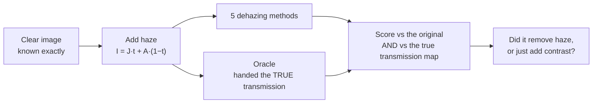

Because the haze is generated, **two** things are known, not one:

| Known | Lets us ask |
|---|---|
| the clear image `J` | how close is the output? (PSNR, SSIM) |
| the transmission map `t` | **did it recover the physics?** (transmission MAE) |
| the airlight `A` | how good is the airlight estimate? |

That second row is what separates this from a contrast comparison. "Looks
clearer" is satisfied by any histogram stretch; recovering `t` is only satisfied
by actually inverting the scattering.

---

## Screenshots

All captures of the **live app**. Every number was computed at the moment the
screenshot was taken.

### 1 · Original, hazy, dehazed, oracle

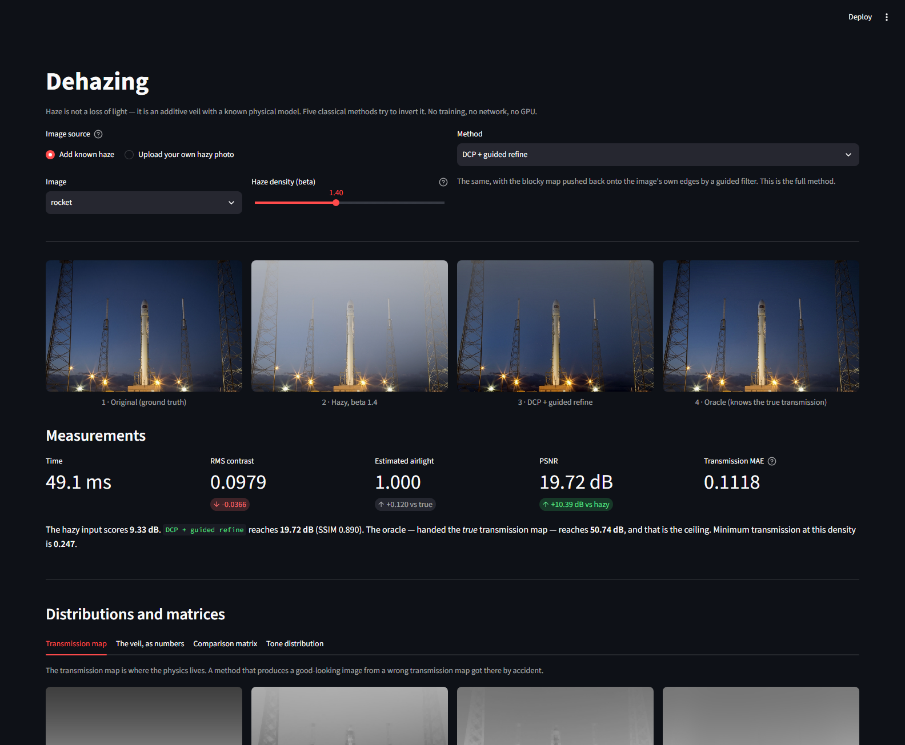

### 2 · The transmission map — where the physics lives

The true map, the dark channel it is estimated from, the blocky patch-wise
estimate, and the guided-filter refinement.

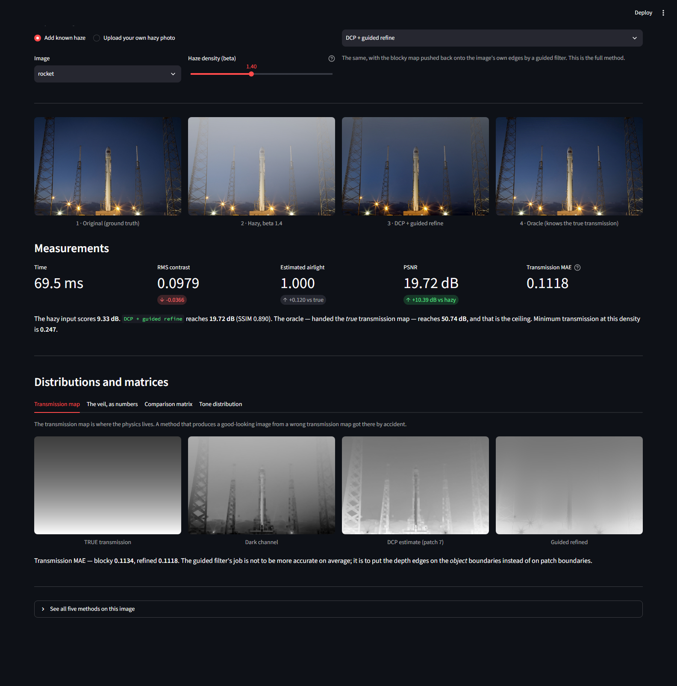

### 3 · Every method against every metric

Watch the **contrast column disagree with PSNR**.

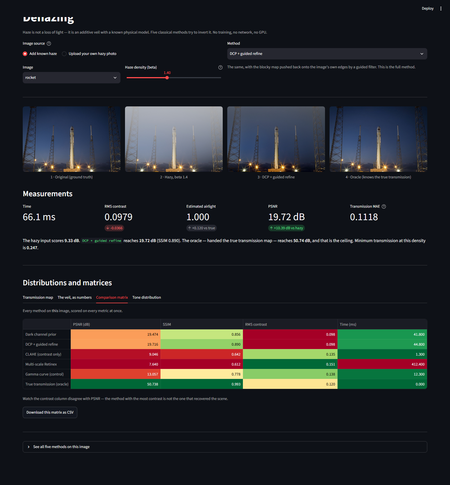

### 4 · The veil, as numbers

A 12×12 patch. Haze pulls every value toward the airlight; dehazing pushes them
back apart.

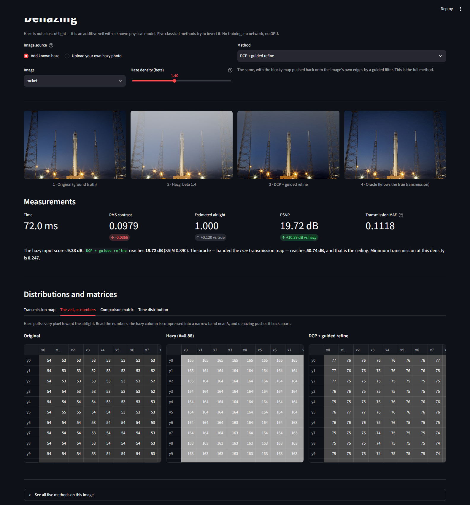

### 5 · Tone distribution

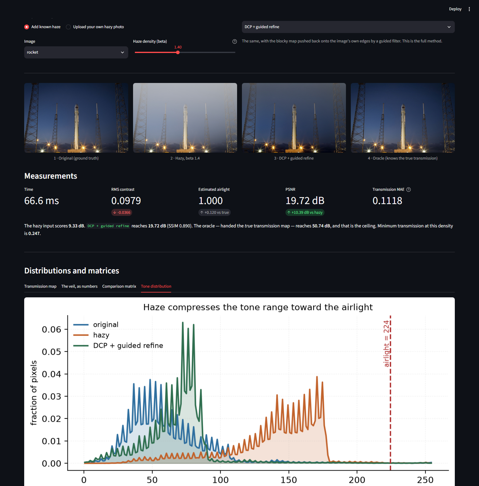

---

## How the UI connects to the results

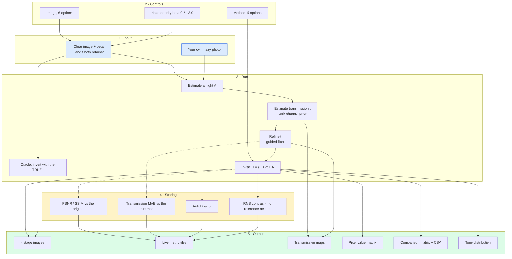

**The dotted paths need ground truth**, so they exist only when the app generated
the haze. On an uploaded photo it still shows the airlight estimate, the
transmission range and the contrast — all of which need no reference — and says
plainly that PSNR is unavailable.

---

## Results

Produced by `run.py` over 6 images at β = 1.4, mirrored in
[`results/results.json`](results/results.json) and
[`results/tables.md`](results/tables.md).

### Five methods and the oracle

| Method | PSNR (dB) | SSIM | RMS contrast | Transmission MAE | Time (ms) |
|---|---:|---:|---:|---:|---:|
| Dark channel prior | 18.936 | 0.8356 | 0.1471 | 0.1113 | 30.9 |
| **DCP + guided refine** | **19.496** | **0.8724** | 0.1559 | **0.1059** | 39.8 |
| CLAHE (contrast only) | 12.926 | 0.724 | **0.1811** | — | **0.88** |
| Multi-scale Retinex | 8.94 | 0.6383 | 0.154 | — | 426.2 |
| Gamma curve (control) | 15.703 | 0.7988 | 0.169 | — | 10.6 |
| **True transmission (oracle)** | **50.799** | **0.995** | 0.1928 | — | 10.2 |

The hazy input scores **11.73 dB**. So the best real method gains **+7.77 dB**,
and the oracle — handed the true transmission map — gains **+39.07 dB**.

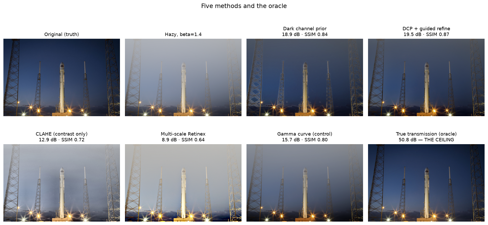

**Three things worth reading carefully.**

1. **CLAHE wins the contrast column and loses by 6.6 dB.** It has no notion of
   transmission at all; it stretches what the veil left behind. Any evaluation
   that scores dehazing by contrast alone would rank it above the physical method.
2. **Retinex scores 8.94 dB — worse than doing nothing would be at some
   densities.** That is not an implementation failure. Retinex models
   `image = illumination × reflectance`, which is **multiplicative**. Haze is
   **additive**. The model cannot represent the degradation.
3. **The oracle is 31 dB above the best real method.** Almost all of that gap is
   the transmission estimate, not the inversion: with the true `t`, the same
   inversion code reaches 50.8 dB.

### The finding: a better estimate, a worse image

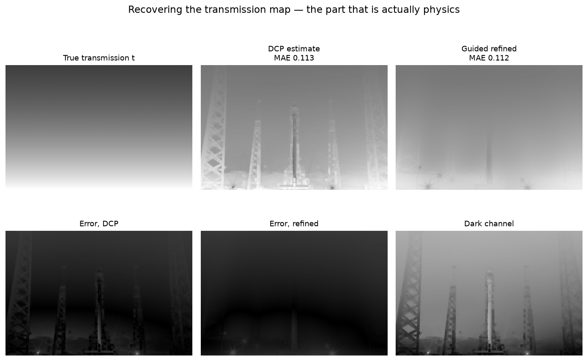

| Airlight estimator | Airlight error | Transmission MAE | Saturated | PSNR (dB) | SSIM |
|---|---:|---:|---:|---:|---:|
| **Brightest candidate (default)** | 0.0631 | 0.1059 | **1** | **19.496** | **0.8724** |
| Median of candidates | **0.0508** | **0.0967** | 0 | 18.495 | 0.8619 |
| 90th percentile per channel | **0.0452** | 0.1002 | 0 | 18.730 | 0.8650 |
| Brightest, excluding saturated | 0.0607 | 0.1054 | 0 | 19.464 | 0.8721 |

Read the first two rows against each other. The median estimator is **better on
every intermediate quantity** — airlight error 0.051 vs 0.063, transmission MAE
0.097 vs 0.106 — and produces an image **1.0 dB worse**.

**Why.** The recovery is `J = (I − A)/t + A`. The default over-estimates `A`
*and* over-estimates `t`, and those two errors push the result in opposite
directions. Correcting only the airlight removes one half of a cancelling pair
and the residual error grows.

This is uncomfortable, so it is worth being explicit about what it does and does
not mean. It does **not** mean the default estimator is good — on the `rocket`
image it returns a saturated **A = 1.000** against a true 0.88, because it picks
a floodlight and calls it sky. It means **an intermediate metric is not a proxy
for the thing you actually want**, and that optimising one in isolation can move
the real objective backwards.

The default here was chosen on **output quality**, which is what the project is
trying to produce — and the more accurate alternative is kept in the table rather
than deleted, because the comparison is the result.

### As the haze thickens, even the oracle falls

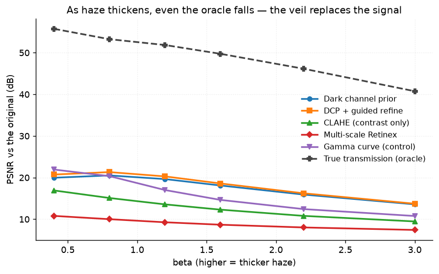

| β | min t | DCP + refine | CLAHE | Oracle |
|---:|---:|---:|---:|---:|
| 0.4 | 0.670 | 20.29 | 16.91 | 55.74 |
| 0.8 | 0.449 | 20.29 | 15.10 | 53.25 |
| 1.2 | 0.301 | 19.53 | 13.57 | 51.85 |
| 1.6 | 0.202 | 18.59 | 12.30 | 49.74 |
| 2.2 | 0.111 | 16.23 | 10.80 | 46.15 |
| 3.0 | 0.050 | 13.73 | 9.46 | **40.75** |

The oracle's fall is the interesting part — it is handed the *exact* transmission
and still loses 15 dB from β 0.4 to 3.0. At β = 3 the minimum transmission is
**0.050**, so in the deepest haze the captured pixel is 95% airlight and 5%
scene. There is almost nothing left to recover, and the `t_min` floor in the
inversion exists precisely because dividing by 0.05 amplifies noise catastrophically.

### The veil as numbers

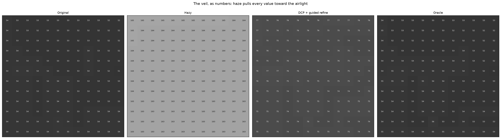

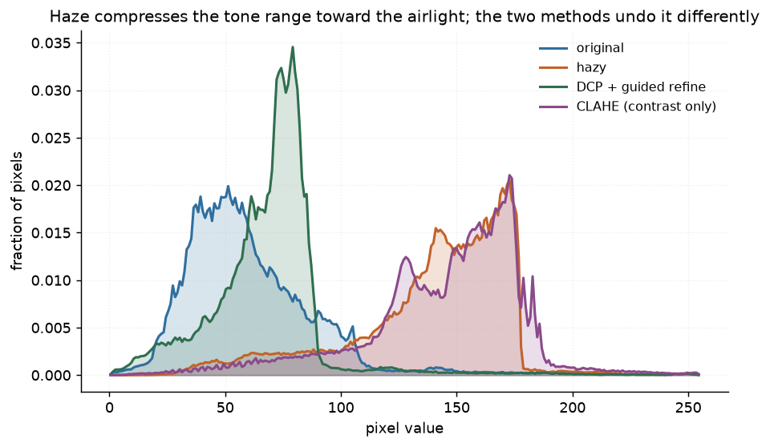

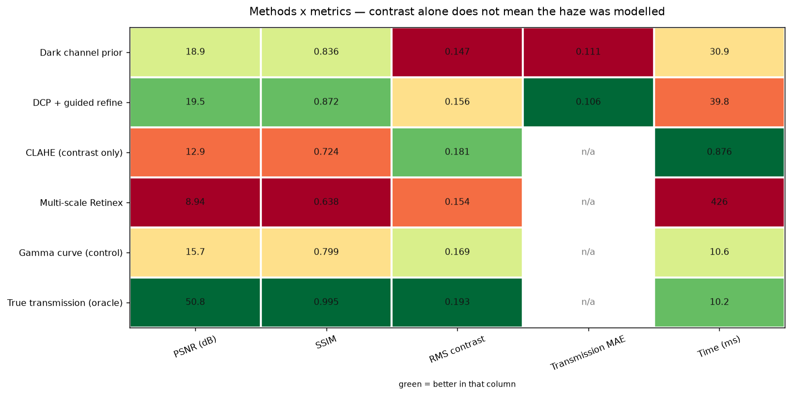

---

## Run it yourself

```bash
python run.py                   # full experiment
python run.py --beta 2.2        # thicker haze
streamlit run ui/app.py         # the interactive app
```

---

## Inference: try it on your own image

### 1 · In the browser

```bash
streamlit run ui/app.py
```

Choose **“Upload your own hazy photo”**.

### 2 · From the command line

```bash
python infer.py my_hazy_photo.jpg
```

```text
input   : my_hazy_photo.jpg  640x427
contrast: 0.1411   entropy: 6.86 bits
method  : DCP + guided refine
airlight: R 1.000  G 1.000  B 0.992   (mean 0.997)
transmission: range [0.436, 0.930]  mean 0.586
contrast: 0.1411 -> 0.1021
time    : 39.6 ms
wrote   : dehazed.png
```

It warns when the airlight estimate saturates, and when the minimum transmission
drops below the point where the inversion starts amplifying noise.

| Flag | Effect |
|---|---|
| `--method "Dark channel prior"` | any of the five |
| `--all-methods` | run every method and compare |
| `--save-transmission` | also write the estimated transmission map |
| `--omega 0.6` | leave more haze; 0.95 over-corrects |

### 3 · As a library

```python
from shared.io import imread, imwrite
import dehazing as dz

hazy = imread("my_hazy_photo.jpg")
clear = dz.dehaze(hazy, method="DCP + guided refine")
imwrite("clear.png", clear)

# the intermediate quantities are not hidden:
a = dz.estimate_airlight(hazy)
t = dz.refine_transmission_guided(hazy, dz.transmission_dcp(hazy, a))
print("airlight:", a, "  transmission range:", t.min(), t.max())
```

---

## How it works

| Step | What | Why it matters |
|---|---|---|
| Dark channel | min over colours, then a local min filter | in a haze-free patch some channel is near zero; where it is not, the patch is veiled |
| Airlight | brightest pixel *within the top of the dark channel* | picking the globally brightest pixel finds a white car, not the sky |
| Transmission | `1 − ω·darkchannel(I/A)` | ω < 1 leaves a little haze on purpose: full removal reads as pasted-on, because the eye uses aerial perspective as a depth cue |
| Refinement | guided filter | the patch minimum makes `t` piecewise constant, so depth edges land on patch boundaries and the output halos |
| Inversion | `J = (I − A)/max(t, t_min) + A` | `t_min` is load-bearing — as `t → 0` the division explodes |

### Defaults were measured, not copied

He et al. use ω = 0.95 and a 15 px patch. Swept over **162 combinations** on six
images, those give **18.64 dB / SSIM 0.852**. The defaults here give
**19.50 dB / SSIM 0.872**:

| Parameter | Paper | Here | Why |
|---|---:|---:|---|
| ω | 0.95 | **0.80** | 0.95 over-corrects; banding appears in the sky |
| patch | 15 | **7** | the patch minimum is what causes the blocky map |
| guided ε | 1e-3 | **1e-2** | a softer filter, fewer halos at depth edges |
| `t_min` | 0.10 | **0.05** | allow more correction in the deepest haze |

---

## Problems hit, and how they were solved

| # | Symptom | Where | Cost |
|---:|---|---|---|
| 1 | Best method 32 dB below the oracle | [`src/dehazing.py:48`](src/dehazing.py#L48) | 18.64 → 19.50 dB |
| 2 | Airlight = **1.000** on a real scene | [`src/dehazing.py:74`](src/dehazing.py#L74) | a floodlight called "sky" |
| 3 | Fixing #2 made the output **worse** | [`src/dehazing.py`](src/dehazing.py) | the project's finding |
| 4 | Markdown table rendered as broken columns | [`run.py`](run.py) | `\|A error\|` — pipes inside a cell |

### 1 · The defaults came from the paper, not from this data

The first run put the best method **32.16 dB** below the oracle, with visible
blocking in the sky. Rather than accept the paper's constants, all four were
swept — 162 combinations, six images:

```text
 omega  patch  radius     eps   tmin    PSNR   SSIM    tMAE
  0.95     15      40   1e-03   0.10   18.64  0.852  0.1142   <- paper defaults
  0.80      7      40   1e-02   0.05   19.50  0.872  0.1059   <- measured best
```

**+0.86 dB and +0.02 SSIM**, and visibly closer to the original because a 7 px
patch blocks far less than a 15 px one.

### 2 · The airlight estimator picked a floodlight and called it sky

The docstring claims the method avoids exactly this:

> *Picking the single brightest pixel is the usual shortcut and it is wrong: a
> white car or a specular highlight is brighter than the sky.*

It does restrict the search to the haziest region — and then takes the brightest
pixel **within** it, which on the rocket image is a launch-pad floodlight:

```text
273 candidates, 12 of them saturated
chosen = brightest = [1.0, 1.0, 1.0]          <- pure white, a floodlight
median of candidates = [0.847, 0.804, 0.729]  <- close to the true 0.88
```

### 3 · Fixing it made the result worse

The obvious repair — take the median, or exclude saturated pixels — produces a
**better airlight, a better transmission map, and a worse image**. Measured, in
the table above. The default was therefore left alone and the finding documented,
because the honest response to a counter-intuitive measurement is to report it,
not to quietly pick whichever configuration flatters the story.

### 4 · A markdown table that rendered as garbage

The airlight column was headed `|A error|` — mathematical notation for absolute
value. A pipe inside a markdown cell **terminates the cell**, so the header split
into two broken columns and every row misaligned. Renamed to `Airlight error`.
Small, but it silently corrupts a published table.

---

## Limitations

* **One depth model.** The haze is a smooth vertical gradient with the far plane
  at the top. Real depth is not monotonic in image row, and a scene with a near
  object against a distant sky would be harder than anything here.
* **The airlight is a single global constant.** Real airlight varies across the
  sky, especially near the sun.
* **The transmission MAE is only available for two methods.** CLAHE, Retinex and
  the gamma control do not estimate transmission at all, which is the point — but
  it does mean that column cannot rank all five.
* **The oracle needs the true transmission map.** It is a ceiling, not a method.
* **No real hazy photographs with ground truth.** Real haze datasets exist but
  need downloading, and this repo's rule is that ground truth is generated so it
  is exact. The UI accepts a real hazy photo and reports everything that needs no
  reference.

---

## Keywords

image dehazing · haze removal · dark channel prior · He Sun Tang · atmospheric
scattering model · transmission map · airlight estimation · guided filter ·
guided image filtering · CLAHE · multi-scale Retinex · classical computer vision ·
no deep learning · single image dehazing · PSNR · SSIM · OpenCV · Python ·
CPU only · reproducible image processing experiments
