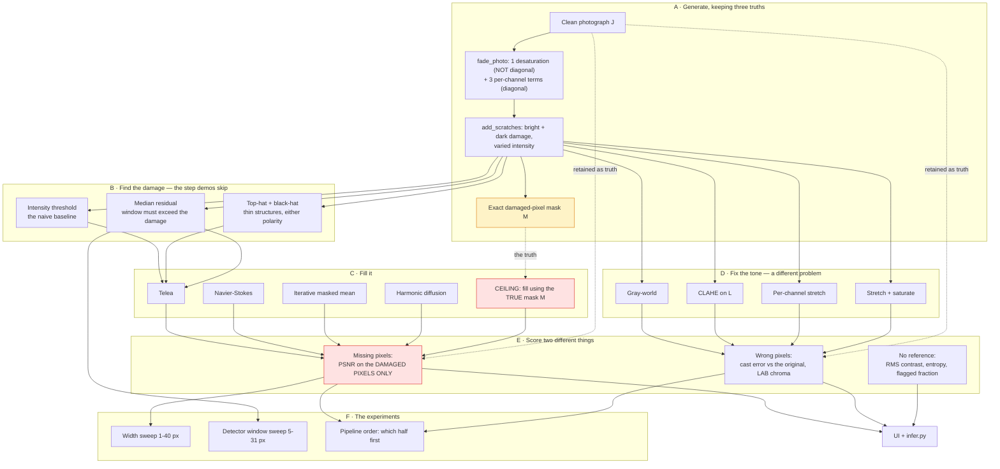

# Project 05 — Old photo restoration: complete workflow

The [README](README.md) states the findings. This states how they were reached,
in what order, and what each decision cost.

---

## 1 · Why this question, and not "which inpainting method is best"

"Which inpainting method is best" is answerable, and the answer is boring:
Navier-Stokes, by 0.3 dB, on this data, at this damage width. Four methods
spanning 1.1 dB is not a result worth a project.

The question underneath it is not boring:

> **Where do the decibels actually go?**

Three candidates, and the honest way to find out is to measure all three rather
than assume:

| Candidate | How to isolate it |
|---|---|
| the inpainting method | hand every method the **true** mask |
| knowing where the damage is | compare the true mask against a detected one |
| the damage being *thin* | sweep the width from 1 px to 40 px |

The answer turned out to be lopsided: 1.1 dB, 14.0 dB, and 20.2 dB respectively.
The thing every comparison ranks is the smallest of the three.

There is also a second project hiding inside the first. A surviving photograph is
not only scratched — it is faded — and no inpainting method touches that at all.
Treating "restoration" as one job would have let a method that solves half of it
look adequate.

---

## 2 · The complete workflow



**The two red boxes are the project.** Scoring on the damaged pixels only (E1) is
what stops the undamaged 93% of the photograph from drowning the signal, and the
ceiling (C5) is what converts "12.87 dB" into "14.0 dB below what was achievable
with a perfect mask".

---

## 3 · Build order

| Step | What | Why here |
|---:|---|---|
| 1 | `add_scratches` with an exact mask | Without it, "how much did detection cost?" is unaskable. |
| 2 | Telea and Navier-Stokes | The two real methods, to have something to beat. |
| 3 | `_damage_only` PSNR | **Before** any comparison. Whole-image PSNR would have made every method look equally fine, and I would have believed it. |
| 4 | Harmonic diffusion | A method that provably converges to something smooth — in to fail visibly at width. |
| 5 | Iterative masked mean | The "did you need any of this?" control. Took three attempts (see §5). |
| 6 | Width sweep | The experiment that separates the methods. |
| 7 | Detectors | Added once the method comparison came back flat. If the method barely matters, something else must. |
| 8 | **Regenerating the damage** | Added after the detectors ranked backwards. The generator was the bug. |
| 9 | Detector window sweep | Added after the good detector scored 0.022 IoU. |
| 10 | `fade_photo` + fade methods | The other half of "restored", added once it was clear no inpainting method touched it. |
| 11 | Pipeline order experiment | Cheap to add, 4.7 dB to report. |
| 12 | UI, figures, docs, `infer.py` | Last. |

Steps 8 and 9 are the honest part of this list. Both were added because a result
came back *wrong-looking*, and in both cases the instinct to write up the
surprising ordering as a finding would have published an artefact.

---

## 4 · Decisions, with reasoning

### Why PSNR is restricted to the damaged pixels

The damaged input scores **17.36 dB** whole-image and **6.03 dB** on the pixels
that actually changed. Doing nothing at all earns a whole-image number that looks
like a working method, because 93% of the photograph was never touched.

The consequence shows up in the results table: across four methods the
whole-image spread is 1.08 dB and the damage-only spread is 1.08 dB — *the same
number*, because a method that leaves undamaged pixels alone changes the same
total squared error in both sums. What differs is the **level**, and the level is
what tells you whether a method did anything.

(This identity is also how one of my tests failed; see README §7.)

### Why the damage is not one constant value

Because the first version was, and it broke the experiment. `damaged[mask] = 255`
made `pixel >= 250` a near-perfect mask oracle at 0.68 IoU, which beat the
shape-aware morphological detector and reversed the ranking. The detectors were
being scored on a property of the generator.

The fix — varied brightness per stroke, per-pixel jitter, and one stroke in five
*dark* — dropped the cheat to 0.14 IoU. Note what that cost: **every detector's
IoU fell.** The new numbers are worse and they are real, and the precision/recall
asymmetry only became visible once the easy signal was removed.

### Why the fade model separates a diagonal part from a non-diagonal one

This is the one piece of deliberate design rather than reaction. Real dye fading
does two distinguishable things: each dye layer fades at its own rate (a
per-channel gain — diagonal, invertible by a per-channel curve) and the colour
desaturates towards luminance (a mix across channels — not diagonal, not
invertible by any per-pixel curve).

Building both into the generator means the model makes a **prediction**: a
per-channel stretch must plateau below the original's chroma no matter how it is
tuned. It does — 23.0 against 26.2 — and that gap is exactly what the saturation
term is for. A generator that only did one or only did the other would have made
the fade half of this project a matter of taste.

The first version got this wrong in the destructive direction: a 55% blend toward
a grey re-tint discarded most of the chroma irreversibly, capping the input at
12.4 dB and making every method look equally hopeless.

### Why the saturation factor is 1.15

Measured: `26.214 / 23.025 = 1.139`. That is the ratio between the originals'
mean LAB chroma and the chroma left standing after the per-channel stretch, so it
is the factor that lands on the original rather than past it.

The first version was 1.45, chosen by looking at a picture, and it overshot to
32.5 — 24% more colourful than the photograph ever was. A saturation slider has
no natural stopping point unless you give it one, and "the number the original
had" is the only defensible one available.

### Why CLAHE is measured and then dropped

`Stretch + CLAHE` has the **lowest colour-cast error in the table** (5.88° against
the recommendation's 7.03°). It is also 1.4 dB worse on PSNR and 0.04 worse on
SSIM. That is a real trade, and it is not obviously the wrong side to take — so
the losing configuration stays in the results table rather than being deleted,
and the recommendation says what it costs.

CLAHE is a *local* method. Fading is a *global* transform. Applying local
contrast enhancement to a globally compressed tone range fixes the symptom in
each tile and introduces tile-scale structure the photograph never had, which is
what the SSIM column is registering.

### Why gray-world is in the table at all

Because it wins a column, and the column is a lie. It drives the no-reference
colour cast to **0.04°** — a perfect score by that measure — while landing
**14.28°** from the photograph's actual colour balance, worse than the faded
input's 7.72°.

The failure is not an implementation bug; gray-world is doing precisely what it
claims, which is to force the mean pixel to grey. It is the *assumption* that
fails: an astronaut in an orange flight suit against a blue flag does not average
to neutral, and nothing in a no-reference metric can notice.

If this row were not in the table, a reader could reasonably assume the
no-reference cast measure ranks methods. It does not, and the only way to show
that is to include something that games it.

### Why inpainting runs before fade correction

Measured: 20.82 dB one way, 16.16 dB the other. Correcting the fade first
stretches the tonal range — and stretches the scratches along with it, handing
the inpainter a *higher-contrast* damage to remove. 4.7 dB from ordering alone,
with no change to either method.

### Why the detected-mask result is reported at all

It would be easy to report only the true-mask numbers, which are 14 dB better and
look much more impressive. But a restoration pipeline you can actually run does
not come with a mask, and the entire finding of this project is that the gap
between those two situations dwarfs everything else in it.

---

## 5 · What each stage costs

Six images at 3 px damage:

| Stage | Time |
|---|---:|
| Intensity threshold (detect) | 1.8 ms |
| Top-hat + black-hat (detect) | 1.2 ms |
| Median residual (detect) | 6.2 ms |
| Telea | 14.7 ms |
| Navier-Stokes | 14.7 ms |
| CLAHE on L | 1.7 ms |
| Per-channel stretch | 10.0 ms |
| Stretch + saturate | 18.8 ms |
| Iterative masked mean | 79.8 ms |
| Harmonic diffusion | **392.7 ms** |
| **Full `run.py`** | **~3 min** |

Harmonic diffusion is **27× slower than Telea and 18.4 dB worse at 40 px**. Its
one virtue is that it is four lines of code and needs no library support, which
is worth exactly as much as the time column says it is.

The masked-mean baseline at 79.8 ms is 5× slower than Telea for 1.1 dB less —
but it is 20 lines with no dependency beyond a box filter, and at 40 px damage it
is the best method in the set. Pure-Python simplicity is not free, and this is
what it costs.

---

## 6 · Reproducing it

```bash
python run.py                  # regenerates every number and figure
python run.py --thickness 15   # the whole study at a different damage width
streamlit run ui/app.py        # the interactive app
python infer.py photo.jpg      # your own damaged scan
pytest ../..                   # 29 tests here, 193 across the repo
```

`run.py` rewrites `results/results.json` and `results/tables.md`; the README's
numbers are copied from those files rather than typed.

Nine of the 29 tests pin a *finding* rather than a number — the detection tax
exceeding the method spread, the best-IoU detector not being the best
restoration, gray-world's cast error exceeding the control's, the ordering
result. A refactor that quietly reverses one of the project's conclusions fails
the suite instead of silently rewriting the README.

---

## 7 · What would come next

* **Exemplar-based inpainting** (Criminisi et al.), which copies texture patches
  from elsewhere in the image rather than interpolating. It is the only thing in
  the classical toolbox that could improve on the 40 px column, and it would do
  so by raising *plausibility* rather than PSNR — which means measuring it
  properly needs project 26's machinery, not this one's.
* **A detector trained on the residual statistics rather than thresholded.**
  Every detector here is one threshold on one feature. Even a two-feature
  decision (residual magnitude × local structure tensor anisotropy) would likely
  close a chunk of the 14 dB, and the point of measuring the tax was to know that
  it is worth closing.
* **Soft masks.** Real scratch edges are partially transparent. A mask with
  values in [0, 1] and an alpha-composited fill is both more realistic and a
  harder scoring problem, since "damaged" stops being a yes/no.
* **Spatially varying fade.** Album prints fade unevenly — worse at the edges,
  worse where light reached. A single global stretch cannot follow that, and a
  local one is the CLAHE trap again unless the locality is estimated rather than
  tiled.
* **The precision/recall asymmetry deserves its own study.** It appeared here as
  a ranking inversion, but the underlying claim — that the cost of a false
  positive in a mask-then-fill pipeline is bounded by the local variance — is
  general, quantifiable, and would tell you exactly how far to bias a detector.
