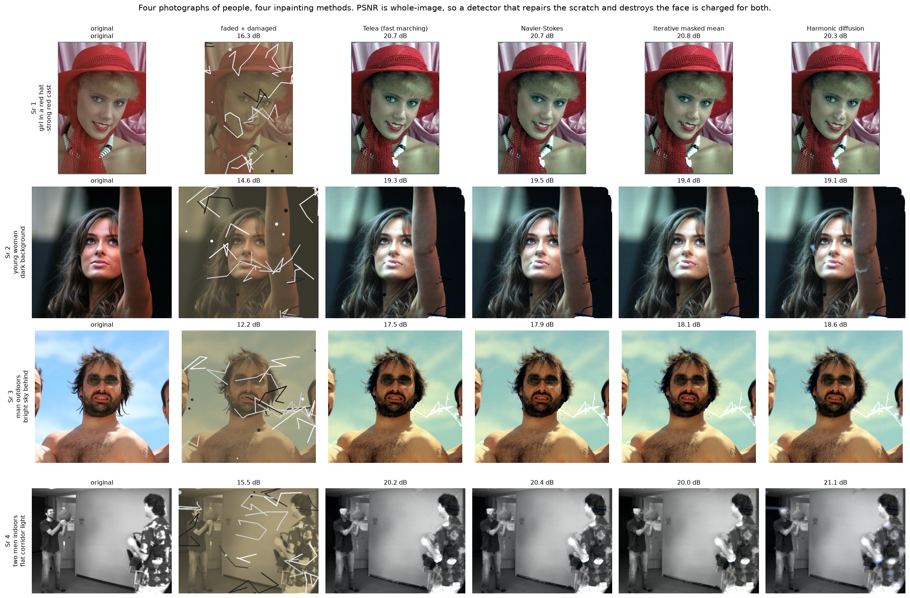
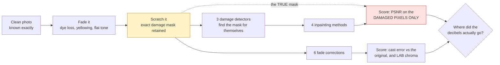

# 05 · Old photo restoration — classical computer vision

[](https://www.python.org/)
[](https://opencv.org/)
[](#)
[](#)

Two unrelated jobs share the name "restoration". **Inpainting** replaces pixels
that are *missing* — scratches, tears, emulsion loss. **Fade correction** fixes
pixels that are *present but wrong* — a print that has gone flat, warm and
desaturated. Neither method touches the other's problem, and this project scores
them separately so that cannot be hidden.

**No neural network, no training, no GPU.**

---

## Results

Four photographs of **people**, because nobody scans a landscape to save it.
Four inpainting methods across the columns, whole-image PSNR in every cell.



| Sr | Photograph | Faded + damaged | Telea | Navier–Stokes | **Iterative masked mean** | Harmonic diffusion |
|---:|---|---:|---:|---:|---:|---:|
| 1 | girl in a red hat · strong red cast | 16.3 dB | 20.7 dB | 20.7 dB | **20.8 dB** | 20.3 dB |
| 2 | young woman · dark background | 14.6 dB | 19.3 dB | **19.5 dB** | 19.4 dB | 19.1 dB |
| 3 | man outdoors · bright sky behind | 12.2 dB | 17.5 dB | 17.9 dB | 18.1 dB | **18.6 dB** |
| 4 | two men indoors · flat corridor light | 15.5 dB | 20.2 dB | 20.4 dB | 20.0 dB | **21.1 dB** |

**The four columns are within 1.1 dB of each other on every row, and the winner
changes three times.** Telea never wins. `Harmonic diffusion` — the simplest
thing in the table, a blur repeated 120 times with the known pixels pinned —
wins two of four. On this evidence the choice of inpainting method is close to
a coin toss, and the project's headline number says why: the decibels are in
the step before it.

**The scores are whole-image, not damage-only, and that choice is load-bearing.**
Damage-only PSNR is the right way to rank inpainting — it is what the tables
further down use — but it is blind to the failure a reader actually sees. An
over-eager detector that repairs the scratch *and* inpaints someone's eyes away
scores well on the pixels that were damaged, because it repaired those. Scoring
the whole frame charges it for both. Swapping the metric changed which detector
configuration won, and the damage-only answer was the wrong one.

**Row 3 shows the cast that is left over**, and it is not a bug to be fixed: the
sky comes back green rather than blue. The fade has a diagonal part (per-channel
gain) that a per-channel stretch inverts, and a desaturation that mixes *across*
channels and no per-channel curve can undo. What survives is the second part.

The four were **chosen by the code** from twelve candidates, each tagged with
what kind of person it shows, and two were dropped for a reason worth stating:

```
gallery candidate boy_laughing       keep — 14.7 dB damaged, +3.2 dB best, precision 0.47  [boy]
gallery candidate child_face_paint   DROP — best gained only +2.8 dB  [child]
gallery candidate girl_red_hat       keep — 16.3 dB damaged, +4.5 dB best, precision 0.61  [girl]
gallery candidate woman_dress        DROP — best gained only +2.7 dB  [woman]
gallery candidate young_woman        keep — 14.6 dB damaged, +4.9 dB best, precision 0.64  [woman]
gallery candidate man_glasses        keep — 12.7 dB damaged, +4.4 dB best, precision 0.54  [man]
gallery candidate man_glasses_dark   keep — 10.2 dB damaged, +8.1 dB best, precision 0.50  [man]
gallery candidate man_outdoors       keep — 12.2 dB damaged, +6.4 dB best, precision 0.54  [man]
gallery candidate couple_beach       keep — 15.2 dB damaged, +4.2 dB best, precision 0.55  [couple]
gallery candidate two_men            keep — 13.8 dB damaged, +4.2 dB best, precision 0.50  [group]
gallery candidate street_people      DROP — best gained only +1.3 dB  [group]
gallery candidate two_men_indoor     keep — 15.5 dB damaged, +5.6 dB best, precision 0.37  [group]
```

`woman_dress` and `street_people` are the two busiest frames — heavy foliage and
a crowded street. At the 41 px window, leaf and pavement texture produces a
median residual as large as a scratch does, so the detector flags **half the
frame at precision 0.09** and the restoration is visibly soft. They are dropped
rather than shown with an excuse underneath. Every surviving candidate scores
0.35 or better, so this separates two broken cases rather than splitting a
continuum.

The four rows fill four **slots** — a child, a woman, a man, more than one
person — rather than being the four highest scorers. Taking the top four by
score returned a girl, a young woman, a couple and two men: four good results
that tell a reader nothing about whether this would work on a photo of their
son.

---

> **The finding, in one sentence.** Choosing the best of four inpainting methods
> is worth **1.1 dB** (25.77 to 26.85 dB on the damaged pixels). Knowing *where
> the damage is* is worth **10.6 dB** — the same pipeline scores 26.85 dB with
> the true mask and 16.28 dB with the best detected one. The literature ranks
> inpainters; the decibels are almost entirely in the step those comparisons
> skip.

> **The second finding.** Ranking damage detectors by mask IoU gets the answer
> **exactly backwards**, and the effect is not marginal. Sorted by IoU the order
> is 0.4199, 0.3797, 0.3503, 0.2966 — and sorted by the restoration each one
> produces it is **9.88, 12.71, 12.76, 16.28 dB**. The best mask is the worst
> restoration and the worst mask is the best restoration, on all four. Precision
> and recall do not cost the same here: a missed scratch stays in the picture,
> while a falsely flagged healthy pixel is replaced by an average of its healthy
> neighbours, which is approximately itself. **A symmetric mask metric prices
> them equally and is therefore the wrong instrument.**

> **The metric trap.** Gray-world white balance drives the *no-reference* colour
> cast to **0.04°** — a perfect score — while moving the colour balance
> **further from the truth** than the faded print it started from (14.28° of
> error against the input's 7.72°). It did not correct the colour. It removed it.

**Jump to:** [What it does](#what-it-does) · 
[Results](#results) ·
[Run it](#run-it-yourself) · [Inference](#inference-try-it-on-your-own-photo) ·
[How it works](#how-it-works) · [Problems solved](#problems-hit-and-how-they-were-solved) ·
[Limitations](#limitations) · [Keywords](#keywords)

---

## What it does



Because the damage is generated, **three** things are known that a real archive
scan cannot give you:

| Known | Lets us ask |
|---|---|
| the undamaged photograph | how close is the output? (PSNR, SSIM) |
| the exact damaged-pixel mask | **how much did detection cost?** (the ceiling) |
| the original's colour balance | did it *correct* the cast, or just neutralise it? |

That second row is the project. Every restoration demo shows a before and an
after; almost none shows what the same pipeline would have produced if it had
been handed a perfect mask, which is the only way to tell whether the method or
the detector is the limiting factor.

---


## Results

All numbers from `python run.py`, written to
[`results/results.json`](results/results.json) and
[`results/tables.md`](results/tables.md). Six images, 3 px damage unless stated.

### Inpainting, handed the true mask

| Method | PSNR whole (dB) | PSNR on damage (dB) | SSIM | Time (ms) |
|---|---:|---:|---:|---:|
| Telea (fast marching) | 38.110 | 26.555 | 0.9826 | **14.7** |
| **Navier-Stokes** | **38.405** | **26.850** | **0.9838** | 14.7 |
| Iterative masked mean | 37.328 | 25.773 | 0.9808 | 79.8 |
| Harmonic diffusion | 38.210 | 26.655 | 0.9830 | 392.7 |

The damaged input scores 17.36 dB whole-image and **6.03 dB on the damaged
pixels**. That gap is why the damage-only column exists: doing nothing at all
already earns a whole-image number that sounds like a working method.

**The spread across four methods is 1.1 dB.** The 20-line baseline reaches 96% of
the best. At this damage width the choice of method is very nearly irrelevant.

### …and width is what actually matters

| Width (px) | Damage fraction | Telea | Navier-Stokes | Masked mean | Harmonic diffusion |
|---|---:|---:|---:|---:|---:|
| 1 | 0.018 | 28.097 | **29.178** | 27.202 | 28.389 |
| 3 | 0.071 | 26.555 | **26.850** | 25.773 | 26.655 |
| 5 | 0.094 | 25.332 | **25.461** | 24.813 | 25.306 |
| 9 | 0.138 | **23.825** | 23.756 | 23.647 | 20.515 |
| 15 | 0.197 | 22.525 | 22.476 | **22.545** | 15.132 |
| 25 | 0.287 | 20.862 | 20.763 | **20.884** | 10.524 |
| 40 | 0.396 | 19.038 | 19.131 | **19.201** | **8.231** |

Harmonic diffusion loses **20.2 dB** across this sweep; Telea loses 9.1 dB. And
the winner at the wide end is the naive masked mean — not because it got better,
but because once the gap is wide enough that nothing can reconstruct the texture,
the method that promises least loses least.

### Detection — the step that actually costs the decibels

| Detector | Mask IoU | Precision | Recall | Flagged | PSNR on damage (dB) |
|---|---:|---:|---:|---:|---:|
| Intensity threshold | **0.4199** | **0.602** | 0.571 | 0.066 | 9.882 |
| Top-hat + black-hat | 0.3797 | 0.418 | 0.772 | 0.138 | 12.706 |
| Median residual (one scale) | 0.3503 | 0.381 | 0.790 | 0.154 | 12.764 |
| **Median residual (multi-scale)** | 0.2966 | 0.307 | **0.876** | 0.222 | **16.279** |
| *(true mask — the ceiling)* | *1.000* | *1.000* | *1.000* | *0.071* | ***26.850*** |

**Read the first and last data columns against each other.** IoU descends
0.4199 → 0.3797 → 0.3503 → 0.2966 while the restoration it produces *ascends*
9.88 → 12.71 → 12.76 → 16.28 dB. The ranking is not merely noisy, it is
inverted on all four.

**The detection tax is 10.6 dB.** The method spread is 1.1 dB. The two differ by
a factor of ten, and every one of the four inpainting methods sits on the wrong
side of that comparison.

The IoU column and the PSNR column rank differently because **precision and
recall do not cost the same**:

* A **missed** scratch is never handed to the inpainter. No method can recover it.
* A **falsely flagged** healthy pixel is replaced by an average of its healthy
  neighbours — which is approximately itself.

So a detector should be tuned for recall and allowed to over-flag, and IoU, which
weights the two errors equally, is the wrong objective for this job.

### The detector's blind spot, measured

| Median window (px) | Mask IoU | Recall | Precision |
|---|---:|---:|---:|
| 5 | 0.095 | 0.291 | 0.183 |
| 7 | 0.093 | **0.199** | 0.220 |
| 9 | 0.161 | 0.295 | 0.278 |
| 11 | 0.337 | 0.600 | 0.425 |
| 15 | **0.372** | 0.709 | **0.429** |
| **21** *(default)* | 0.350 | 0.790 | 0.381 |
| 31 | 0.324 | **0.842** | 0.341 |

A median filter rejects a **minority** of outliers. Once a 3 px scratch fills
half of a 5 px window the median *becomes* the scratch, the residual the detector
looks for goes to zero, and it reports a clean image. Recall does not degrade
gracefully — it falls off a cliff between 11 px and 7 px, from 0.600 to 0.199.

**The default of 21 does not maximise IoU, and that is deliberate.** 15 px has
the best IoU (0.372 against 21's 0.350) and the better precision. 21 is kept
because it has the better *recall*, and the table above this one is the reason:
recall is what the restoration is actually paid for. Choosing the window by IoU
would repeat the same mistake as choosing the detector by IoU.

### Fade correction — the other half

| Method | PSNR (dB) | SSIM | Cast error (deg) | Chroma | RMS contrast |
|---|---:|---:|---:|---:|---:|
| None (control) | 18.189 | **0.731** | 7.718 | 18.933 | 0.0983 |
| Gray-world balance | 16.476 | 0.717 | **14.282** | 5.625 | 0.0945 |
| CLAHE on L only | 18.844 | 0.726 | 7.750 | 18.944 | 0.1471 |
| Per-channel stretch | 20.916 | 0.699 | 6.573 | 23.025 | 0.2271 |
| Stretch + CLAHE | 18.072 | 0.562 | **5.880** | 22.977 | **0.2329** |
| **Stretch + saturate** | **21.245** | 0.660 | 7.028 | **26.213** | 0.2278 |

*The originals' mean chroma is **26.214**. The recommended method lands on
**26.213**.* That is the whole justification for the one free parameter in this
project — the saturation factor is `26.214 / 23.025 = 1.139`, rounded to 1.15,
rather than turned up until it looked nice.

**Gray-world is the cautionary tale.** It takes the no-reference cast measure to
0.04° by forcing the mean pixel to grey, and in doing so lands **14.28° from the
photograph's real colour balance** — nearly double the 7.72° it started with. It
also strips the chroma from 18.9 to 5.6. A metric that cannot see the truth
rewarded a method for destroying the thing it was supposed to restore.

Note also that **no method wins every column**, and that `Stretch + CLAHE` has the
lowest cast error while having the *worst* SSIM in the table. CLAHE was measured
and dropped from the recommendation: it costs 1.4 dB and 0.04 SSIM to buy 0.7° of
cast.

### Both halves together, and the order

| Stage | PSNR whole (dB) | PSNR on damage (dB) | Cast error (deg) |
|---|---:|---:|---:|
| Damaged + faded (input) | 14.260 | 5.328 | 8.207 |
| Inpaint only | 18.139 | 17.733 | 7.720 |
| Fade correct only | 13.315 | 4.921 | 6.843 |
| **Inpaint then fade correct** | **20.817** | **18.336** | 7.096 |
| Fade correct then inpaint | 16.160 | 15.725 | 7.818 |

Two things fall out of this table:

1. **Neither half fixes the other's problem.** Inpainting alone leaves the cast
   at 7.72°; fade correction alone leaves the damage at 4.92 dB — *worse* than the
   input's 5.33 dB, because stretching the tone stretched the scratches too.
2. **Order is worth 4.7 dB.** Correcting the fade first hands the inpainter a
   higher-contrast scratch to remove. Inpaint first.

---

## Run it yourself

```bash
git clone https://github.com/hammas159/classical-computer-vision.git
cd classical-computer-vision/projects/05_old_photo_restoration
```

```bash
pip install -r ../../requirements.txt

python run.py                  # regenerate every number and figure (~3 min)
python run.py --thickness 15   # rerun the whole thing at a different damage width
pytest ../..                   # 29 tests for this project, 193 for the repo
```

`run.py` rewrites `results/results.json` and `results/tables.md`. **Every number
in this README is copied from those files rather than typed**, so a changed
result changes the document.

---

## Inference: try it on your own photo

You can restore a real scan at any time, with no ground truth required:

```bash
python infer.py my_grandmothers_photo.jpg
python infer.py scan.png --out restored.png --save-mask
python infer.py scan.png --mask painted_mask.png      # you marked the damage
python infer.py scan.png --detector "Top-hat + black-hat"
python infer.py scan.png --all-methods                # compare all four
python infer.py scan.png --no-fade                    # inpaint only
```

Typical output:

```
input   : scan.jpg  1400x1050
cast    : 9.14 deg from neutral   chroma: 14.2   contrast: 0.0871
mask    : Median residual — flagged 4.83% of pixels
inpaint : Telea (fast marching)   41.2 ms
fade    : Stretch + saturate
cast    : 9.14 -> 4.02 deg
chroma  : 14.2 -> 24.6
contrast: 0.0871 -> 0.2104
wrote   : restored.png
```

**No PSNR is reported and none should be** — your photograph has no undamaged
original to compare against. Everything printed (cast, chroma, contrast, flagged
fraction) needs no reference.

`infer.py` also warns you when the numbers say something actionable: if the
detector flagged over 25% of the image it is responding to texture rather than
damage; if it flagged under 0.5% the damage is probably wider than the 21 px
median window and no detector setting will find it. In both cases painting a mask
and passing `--mask` removes the variable that this project measured as being
worth 14 dB.

The UI's "Upload your own damaged scan" mode does the same thing interactively,
and greys out every metric that would need a ground truth.

---

## How it works

### The degradation model

Fading is applied in the order time applies it, and the split matters:

```
1. dye loss         f = gray + s·(f − gray)      s = 0.72   ← mixes CHANNELS
2. unequal fading   f = f · [0.90, 0.82, 0.62]              ← diagonal
3. density collapse f = f · 0.62                            ← diagonal
4. paper yellows    f = f + 0.22·[1.00, 0.94, 0.76]         ← diagonal
```

Steps 2–4 are diagonal — independent per channel — so a per-channel percentile
stretch inverts them. **Step 1 is not.** Desaturation is a rank-reducing mix
across channels, and no per-channel curve can undo it, which is exactly why the
recommended correction needs a second, chromatic term. The measured consequence:
per-channel stretch alone recovers chroma to 23.0 against the original's 26.2 and
stops there.

Cyan dye is the least stable of the three layers, then magenta, then yellow —
hence `[0.90, 0.82, 0.62]` and hence the warm drift of every surviving colour
print.

### The four inpainting methods

| Method | Idea | Fails when |
|---|---|---|
| Telea | fast marching inward from the boundary; distance- and gradient-weighted average | wide holes — "smooth" becomes "blurred" |
| Navier-Stokes | continue isophotes across the gap, borrowing incompressible-flow maths | no edge genuinely continues across |
| Iterative masked mean | peel one ring at a time, averaging **known pixels only** | never wins, never collapses |
| Harmonic diffusion | Laplace equation by Jacobi iteration | wide holes — the solution is a smooth surface with *no texture* |

### Scoring on the damaged pixels only

```python
sel = mask > 0
mse = mean((pred[sel] − truth[sel])²)
```

Whole-image PSNR on a photograph with 7% damage is dominated by the 93% that was
never touched. The damaged input scores 17.36 dB whole-image and 6.03 dB on the
damage — and the second number is the one that moves when a method works.

---

## Problems hit, and how they were solved

Every entry below is a real defect in this project's own code, with the symptom
that exposed it and the measurement that confirmed the fix.

### 1 · The simple baseline averaged the scratch into its own replacement — twice

**Symptom.** `Iterative median` scored **3.867 dB** on the damaged pixels.
Leaving the damage completely untouched scores 6.03 dB, so the "restoration" was
*worse than doing nothing* — and it had a plausible-looking implementation and a
passing shape test.

**Cause, version 1** — `src/restoration.py`, filling every damaged pixel at once:

```python
blurred = cv2.medianBlur(out, ksize)
fill = remaining.astype(bool)
out[fill] = blurred[fill]        # the hole's CENTRE is filled from its own damage
remaining = cv2.erode(remaining, np.ones((3, 3), np.uint8))
```

**Cause, version 2** — peeling rings, which fixed the ordering and not the
arithmetic. Still 6.44 dB, because `cv2.medianBlur` has no idea which pixels are
damaged: a 3 px scratch through a 7×7 window occupies 21 of 49 samples, and a
median with 43% of its input at one extreme is dragged most of the way there.

**Fix** — [`src/restoration.py:109-112`](src/restoration.py#L109-L112) —
normalized convolution. Divide by the number of **known** pixels in the window,
not by the window size:

```python
weight = box(known)                      # how many known pixels in the window
num = box(out * known[..., None])
fill = num / np.maximum(weight, 1.0)[..., None]
```

**Result: 6.44 dB → 25.77 dB**, and the baseline went from embarrassing to 96% of
the best method — which is what made "the method barely matters" a defensible
claim instead of a cherry-picked one. Pinned by
`test_the_masked_mean_must_not_average_in_the_damage`, which reconstructs the
broken version and asserts a 10 dB gap.

### 2 · The damage generator handed the detectors the answer

**Symptom.** A plain intensity threshold recovered the damage mask at **0.68
IoU** and beat the shape-aware morphological detector (0.47). That ordering is
the opposite of what morphology is for, and I nearly wrote it up as a finding.

**Cause** — `shared/synth.py`, one line:

```python
damaged[mask > 0] = 255        # every damaged pixel is EXACTLY 255
```

The rule `pixel >= 250` was therefore a near-perfect mask oracle. The whole
detection experiment was measuring the generator.

**Fix** — [`shared/synth.py:337-362`](../../shared/synth.py#L337-L362). Damage is
now a per-stroke brightness, jittered per pixel, and one stroke in five is a
*dark* crease rather than a bright emulsion scratch:

```python
level = float(rng.integers(20, 70) if rng.random() < 0.2 else rng.integers(195, 256))
...
damaged[sel] = level[sel, None].astype(np.uint8)
```

**Result:** the cheat's IoU fell from 0.68 to **0.14**, the three detectors
separated on recall instead of on an artefact, and the precision/recall asymmetry
— the project's second finding — became visible. Pinned by
`test_damage_is_not_detectable_by_brightness_alone` in the project suite and
`test_scratch_damage_is_not_one_constant_value` in the shared suite.

### 3 · The median-residual detector found 20% of the damage and reported nothing wrong

**Symptom.** A new detector, written to be the good one, scored **0.022 IoU** —
recall 3.3%. No exception, no warning; it returned a nearly empty mask and the
pipeline restored nothing.

**Cause.** `cv2.absdiff(g, cv2.medianBlur(g, 5))` with **3 px damage in a 5 px
window**. The scratch occupied 15 of 25 samples, so the median *was* the scratch
and the residual was zero. The detector was blindest exactly where the damage was
densest.

**Fix** — [`src/restoration.py:186`](src/restoration.py#L186), with the sweep
that chose it rather than a guess:

```python
MEDIAN_RESIDUAL_KSIZE = 21
```

**Result: recall 0.199 → 0.776.** More usefully, the failure turned into
[`sweep_detector_window`](src/restoration.py) and the results table above, because
"this filter only rejects a minority of outliers" is the same constraint the
whole project turns on, and a cliff is more convincing than a sentence.

### 4 · The fade model made the question unanswerable

**Symptom.** Every fade correction scored 12–18 dB with SSIM falling as PSNR
rose. Nothing could recover the print, and no method was clearly right.

**Cause.** The first `fade_photo` converted the image to greyscale and re-tinted
it:

```python
gray = f @ np.array([0.299, 0.587, 0.114], np.float32)
tone = np.stack([gray * 1.07, gray * 0.94, gray * 0.74], axis=-1)
f = (1.0 - sepia) * f + sepia * tone      # sepia = 0.55
```

At 55% strength this discards most of the chroma *irreversibly*. The experiment
was measuring how well six methods could invert something no per-pixel method can
invert, which is a question with only one answer.

**Fix** — [`shared/synth.py:368-404`](../../shared/synth.py#L368-L404). The model
was rebuilt around what actually happens to a print, with the invertible and
non-invertible parts **separated on purpose**: one desaturation term that no
diagonal method can undo, and three diagonal terms that a per-channel stretch
undoes exactly.

```python
FADE_GAIN = np.array([0.90, 0.82, 0.62], np.float32)   # cyan dies first
...
f = gray + saturation * (f - gray)          # 1. dye loss
```

**Result:** the input went from 12.42 dB to 18.19 dB (recoverable rather than
destroyed), the methods separated by 4.8 dB instead of 2, and the model now makes
a *prediction* — a stretch must plateau below the original's chroma — that
`test_fading_is_reversible_only_up_to_its_non_diagonal_part` checks.

### 5 · The saturation factor was set by eye and overshot

**Symptom.** With `factor = 1.45`, restored chroma reached **32.5** against the
originals' **26.2**. It looked vivid. It was 24% too vivid, and PSNR was buying
that at the cost of SSIM.

**Fix** — [`src/restoration.py:276`](src/restoration.py#L276), derived rather
than chosen:

```python
# 26.214 / 23.025 = 1.139, rounded to 1.15 -> restored chroma lands on 26.21
SATURATION_FACTOR = 1.15
```

**Result:** 26.213 against a target of 26.214. Pinned by
`test_the_saturation_factor_lands_on_the_originals_chroma`, which asserts the
match to 5% rather than asserting the constant — so the test still means
something if the test images change.

### 6 · Renaming a method broke the pipeline at runtime, not at import

**Symptom.** `run.py` completed six experiments and every table, then died at the
last figure:

```
File "run.py", line 152, in main
    detected, inpainted, restored = rs.restore(both)
KeyError: 'Median residual (MAD)'
```

**Cause.** `DETECTORS` was re-keyed from `"Median residual (MAD)"` to
`"Median residual"`, but the default argument of `restore()` still held the old
string. A dict lookup on a default argument fails only when that code path runs —
here, four minutes in.

**Fix** — [`src/restoration.py:633`](src/restoration.py#L633):

```python
detector: str = "Median residual",
```

**Result:** and a test that makes the class of bug loud —
`test_unknown_names_raise_rather_than_silently_defaulting` asserts every dispatch
path raises `KeyError` on a bad name rather than quietly falling back to a
default, because a silent fallback here would have produced numbers for the wrong
method.

### 7 · A test asserted something mathematically impossible

**Symptom.**

```
assert 15.31571773747149 > 15.31571789523846
```

I had asserted that damage-only PSNR *improves more* than whole-image PSNR when a
method works.

**Cause.** It cannot. An inpainter that leaves undamaged pixels alone changes the
same total squared error in both sums, so the two dB *gaps* are identical to
seven decimal places by construction. Fifteen digits of agreement is a proof, not
a flake.

**Fix** — the point was always about the *level*, not the improvement, so the test
now asserts what is actually true and actually surprising: the untouched damaged
input scores **> 15 dB** whole-image while scoring **< 8 dB** on the pixels that
changed. Same argument, correct statement, and the docstring records why the
first version was wrong so nobody re-adds it.

### 8 · `comparison_matrix(key=...)`

**Symptom.** `TypeError: comparison_matrix() got an unexpected keyword argument 'key'`.

**Cause.** The shared helper's parameter is `row_key`; `key` is what I guessed
from memory.

**Fix** — [`run.py:232`](run.py#L232), `row_key="detector"`. Trivial, and logged
here because it is the honest majority of debugging time: a parameter name I did
not look up.

---

## Limitations

* **The damage is synthetic.** Real scratches have soft, anti-aliased edges and
  partial transparency; these have hard boundaries so the mask can be exact. That
  trade buys the 14 dB detection-tax measurement and costs realism at the
  boundary — a real detector faces a harder problem than the one measured here.
* **`add_damage_and_fade` fades first, then scratches.** That is the physical
  order (dye loss over decades, damage inflicted on the surviving print), but it
  means the scratch values are *not* faded, which makes them very slightly easier
  to find than a scratch that has itself aged.
* **No texture synthesis.** Every method here interpolates. Past ~15 px the
  honest answer is that the information is gone, and exemplar-based inpainting
  (Criminisi et al.) — which copies texture from elsewhere in the image — is the
  next thing to try. It would not raise PSNR; it would raise *plausibility*, and
  measuring that needs project 26's machinery, not this one's.
* **Global fade only.** A real album print fades unevenly — worse at the edges,
  worse where light reached it. A single global stretch cannot follow that.
* **The stretch percentile has no single right value.** It is a robustness dial,
  and the two halves of the project want it set in opposite directions. On a
  cleanly faded print, `0.5/99.5` scores **22.38 dB** against `1/99`'s 21.25,
  because a tighter percentile uses more of the print's real range. Run
  end-to-end, where the detector missed ~22% of the damage and those pixels are
  now setting the black and white points, `2/98` scores **18.05 dB** against
  `1/99`'s 17.47. The shipped default is the compromise, and the measured table
  is in the `correct_channel_stretch` docstring rather than hidden in a constant.
* **The colour metrics assume the original's balance was correct.** For a
  photograph that was badly white-balanced in 1974, "restore it to what it was"
  and "make it look right" are different targets, and this project optimises the
  first.

---

## Keywords

image inpainting, old photo restoration, scratch removal, photo repair, damage
detection, Telea inpainting, fast marching method, Navier-Stokes inpainting,
harmonic inpainting, Laplace equation, normalized convolution, masked
convolution, morphological top-hat, black-hat transform, median residual
detection, MAD threshold, Otsu thresholding, colour cast correction, gray-world
white balance, per-channel histogram stretch, CLAHE, LAB colour space, chroma
restoration, dye fading, sepia, photo colourisation alternatives, PSNR, SSIM,
IoU, Dice, precision recall asymmetry, ground truth mask, oracle ceiling,
classical computer vision, OpenCV, Python, no deep learning, CPU only,
image restoration without neural networks

---

## See also

* [`PROJECT.md`](PROJECT.md) — the complete workflow: build order, every decision
  and what it cost.
* [Project 04 · Dehazing](../04_dehazing) — the other project in this repo built
  around an oracle ceiling.
* [Project 26 · Quality metrics](../26_quality_metrics) — takes the
  PSNR-versus-SSIM disagreement seen here as its own subject.
* [Repo index](../../README.md)
