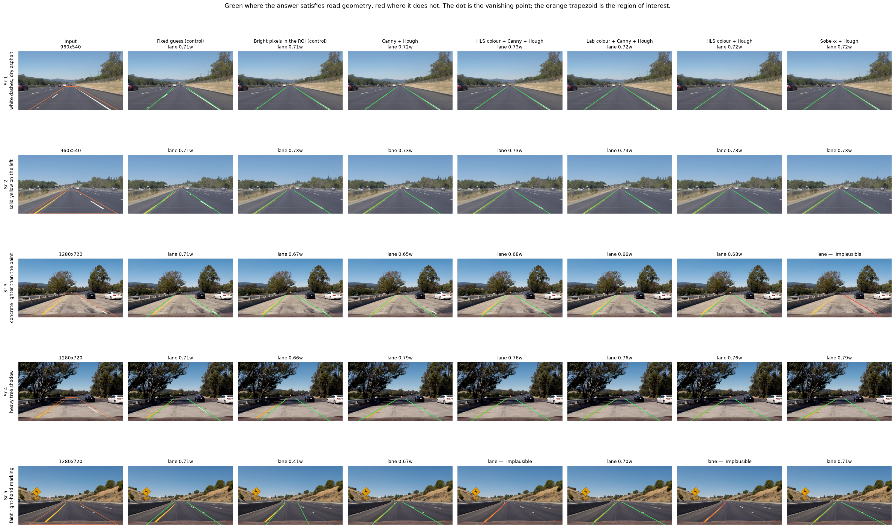
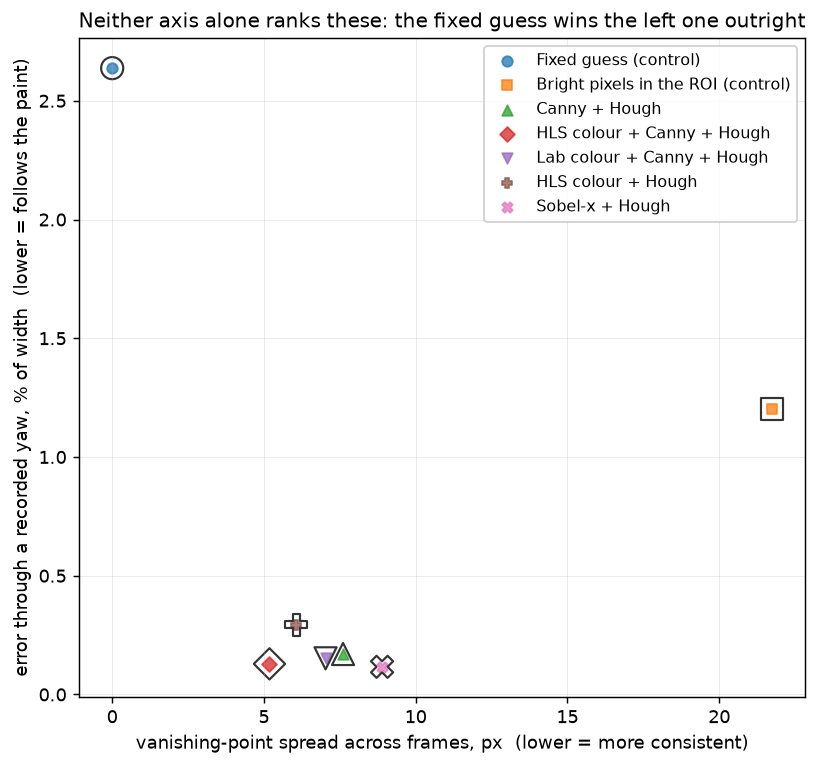
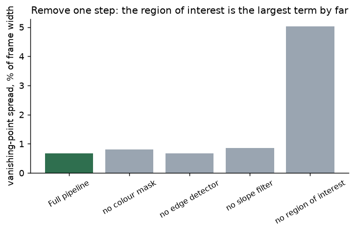
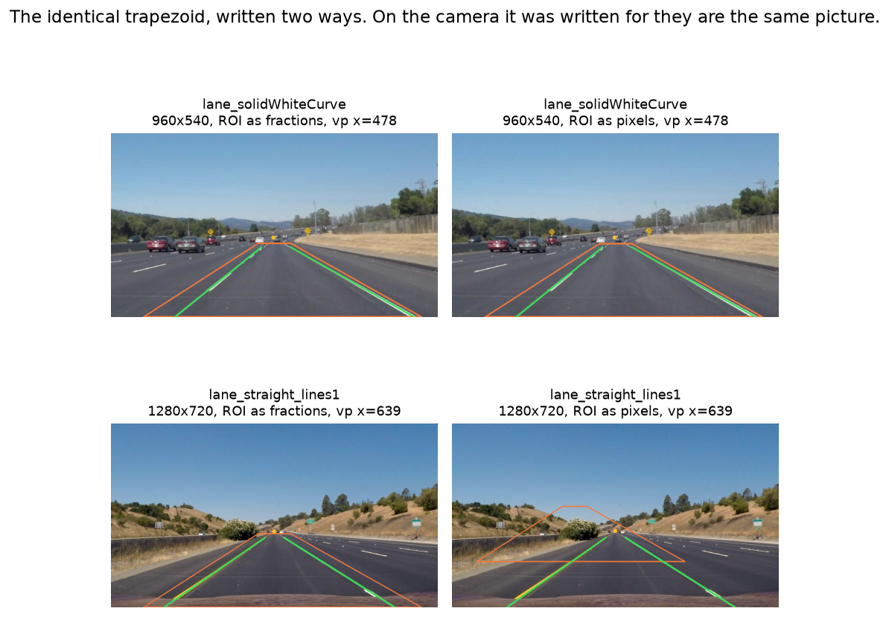
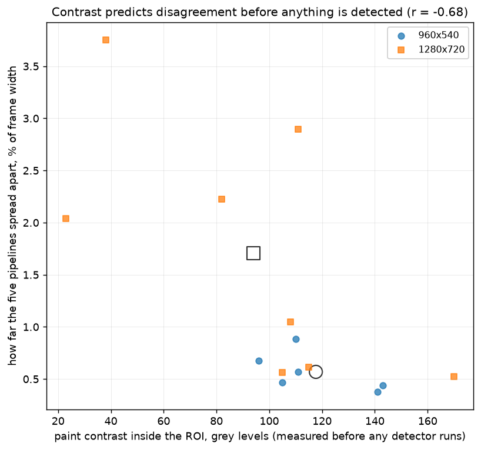

# 06 · Lane detection — classical computer vision

[](https://www.python.org/)
[](https://opencv.org/)
[](#)
[](#)

A forward-facing camera on a car. Find the two painted lines bounding the lane it
is in. The pipeline in every tutorial is the same four steps — mask by colour,
detect edges, crop to a region of interest, fit lines with a Hough transform —
and the only interesting question is which of the four is doing the work.

> **The region of interest is not preprocessing. It is the algorithm.** Delete
> the colour mask, the edge detector and the Hough transform, keep only the
> trapezoid, and fit a line to the brightest pixels in each half of it. On the
> six frames from one of the two cameras that control lands a **median 0.32%**
> of the frame width from the full five-step pipeline, **worst case 1.10%**. The
> trapezoid was drawn by a person who already knew where the lane was.

> **Removing the ROI costs 23× more than removing any other step.** Taking out
> the colour mask moves the vanishing point by 0.15% of the frame width; taking
> out the slope filter, the next largest, by 0.19%; taking out Canny by
> **0.02%**. Taking out the region of interest moves it by **4.37%**.

> **Half this set cannot tell a lane detector from a constant.** A fixed guess —
> the same two lines returned for every photograph, the image never read — lands
> within 1.5% of the full pipeline on **7 of the 14 frames**. On a straight dry
> road, "the average lane" is nearly the answer.

> **And the score that looks right ranks the constant first.** Vanishing-point
> consistency is the natural annotation-free measure, and the fixed guess scores
> a perfect **0.0 px** on it by returning the same answer every time.

**No neural network, no training, no GPU.**

---

## Results

Five photographs chosen to be five different problems, not five pictures of a
road. Green where the answer satisfies road geometry, red where it does not; the
dot is the vanishing point and the orange trapezoid is the region of interest.



| Sr | Photograph | Fixed guess | Bright pixels in ROI | Canny + Hough | HLS + Canny + Hough | Lab + Canny + Hough | HLS + Hough | Sobel-x + Hough |
|---:|---|:--:|:--:|:--:|:--:|:--:|:--:|:--:|
| 1 | white dashes, dry asphalt | 0.71w | 0.71w | 0.72w | 0.73w | 0.72w | 0.72w | 0.72w |
| 2 | solid yellow on the left | 0.71w | 0.73w | 0.73w | 0.73w | 0.74w | 0.73w | 0.73w |
| 3 | concrete lighter than the paint | 0.71w | 0.67w | 0.65w | 0.68w | 0.66w | 0.68w | ❌ |
| 4 | heavy tree shadow | 0.71w | 0.66w | 0.79w | 0.76w | 0.76w | 0.76w | 0.79w |
| 5 | faint right-hand marking | 0.71w | 0.41w | 0.67w | ❌ | 0.70w | ❌ | 0.71w |

*Lane width at the car, as a fraction of the frame width. ❌ is an answer the
geometry check rejects. Rows 1 and 2 are the problem: **seven methods, including
one that never looks at the image, agree to within 0.03w.** All the information
in this comparison is in rows 3–5.*

---

## Where the ground truth comes from

There is no annotation for these photographs and **none is invented**. Two
independent things stand in for one, and they disagree about who wins.

**1 — Geometry the methods are not told about.** A camera bolted to a car has a
vanishing point that is a property of the mounting, not of the frame: across
frames from one camera it cannot move. Neither can the lane's width at the car.
A method that locks onto a guard rail, a shadow edge or the concrete seam of a
bridge fails both, and it fails them without anyone drawing a line on a
photograph.

**2 — A transform that is recorded because it is applied here.** Warp the frame
by a known camera yaw, detect again, map the first answer forward through the
homography and compare. Zero error means the detector tracked the paint through
the warp. This is recorded-by-construction truth: the thing being estimated *is*
the thing that was applied.



| Detector | Plausible | VP spread (px) | Lane width spread | Yaw error (% width) | Gap to ROI control |
|---|:--:|---:|---:|---:|---:|
| **Fixed guess (control)** | 14/14 | **0.0** | **0.0000** | 2.637 | 3.51% |
| **Bright pixels in the ROI (control)** | 14/14 | 21.7 | 0.0554 | 1.203 | — |
| Canny + Hough | 14/14 | 7.6 | 0.0244 | 0.170 | 1.75% |
| HLS colour + Canny + Hough | 13/14 | 5.2 | 0.0152 | 0.129 | 0.72% |
| Lab colour + Canny + Hough | 14/14 | 7.0 | 0.0183 | 0.152 | 0.88% |
| HLS colour + Hough | 13/14 | 6.1 | 0.0151 | 0.294 | 0.46% |
| Sobel-x + Hough | 13/14 | 8.9 | 0.0170 | **0.116** | 0.54% |

**The two controls sit in opposite corners of that plot.** The fixed guess is
perfectly consistent and completely unresponsive: 0.0 px of vanishing-point
spread and the **worst** yaw error of the seven, because a constant cannot
follow a warp. The ROI control is the reverse — it responds, and it wanders four
times as far as any real pipeline.

So **consistency alone would publish the constant as the best lane detector in
this project**, and the recorded warp is the only thing that stops it. Neither
number is the result; the pair is.

---

## The region of interest is the algorithm

`Bright pixels in the ROI` runs **no colour test, no edge detector and no Hough
transform**. It takes the brightest 4% of pixels inside the trapezoid, splits
them down the middle of the frame, and fits a line to each half.

| Camera | Frames | Median gap to the full pipeline | Worst gap | Share of its pixels that are lane-coloured |
|---|:--:|---:|---:|---:|
| 960×540 | 6 | **0.32%** | 1.10% | 81% |
| 1280×720 | 8 | 4.71% | 21.36% | 66% |

On the first camera the four steps after the trapezoid buy **nothing
measurable** — a third of a percent of frame width, which is less than the line
thickness they are drawn with. On the second they buy a great deal.

The obvious explanation is that the control cannot tell paint from any other
bright thing in the trapezoid, and that is **partly** right and is reported as
partly right: across the fourteen frames, the share of the control's pixels that
the colour mask also fires on correlates with its gap to the pipeline at
**r = −0.54**. That accounts for some of the difference and not all of it.

*A hypothesis that did not survive: the 1280×720 frames show the car's own
bonnet in the bottom rows, brighter than the road, and excluding the bottom 6% of
the frame looked like the fix. It helped six frames and hurt six others and moved
the median by nothing. It is recorded here rather than deleted, because the next
reader will think of it too.*



| Variant | Plausible | VP spread (% width) | Lane width spread |
|---|:--:|---:|---:|
| Full pipeline | 13/14 | 0.66 | 0.019 |
| without the colour mask | 14/14 | 0.81 | 0.032 |
| **without the edge detector** | 13/14 | **0.68** | 0.019 |
| without the slope filter | 14/14 | 0.85 | **0.111** |
| **without the region of interest** | 12/14 | **5.03** | 0.059 |

**Canny is the step every tutorial spends the most words on, and removing it
changes the answer by 0.016% of the frame width** — a fifth of a pixel on a
1280-wide frame. Lane paint is a *region*, not an edge, and a Hough transform
votes on a filled stripe perfectly happily.

The slope filter is the one genuine surprise: dropping it barely touches the
vanishing point (0.66 → 0.85) and makes the lane width wander **5.7× further**
(0.019 → 0.111). Horizontal segments from the road's own cross-markings enter
the left and right fits symmetrically, so they cancel at the vanishing point and
do not cancel at the car. **The two scores are not measuring the same thing**,
and this is where that shows.

---

## The trapezoid written in pixels

Every tutorial writes the region of interest as a pixel literal:

```python
vertices = np.array([[(96, 540), (432, 324), (528, 324), (912, 540)]])
```

Which silently means *for this camera, at this resolution*. These fourteen
photographs come from two cameras.



| Camera | ROI covers (fractions) | ROI covers (pixels) | Plausible (fractions) | Plausible (pixels) | VP spread (fractions) | VP spread (pixels) |
|---|---:|---:|:--:|:--:|---:|---:|
| 960×540 | 19.2% | 19.0% | 6/6 | 6/6 | 1.4 px | 1.4 px |
| 1280×720 | 19.1% | **10.8%** | 7/8 | 6/8 | 9.0 px | **16.0 px** |

On the camera it was written for the two are the same picture, as they must be.
On the other one the same literal covers **10.8% of the frame instead of 19.1%**
— a trapezoid over the bottom-left quadrant — and the vanishing point wanders
**1.8× further**.

**The failure is silent.** The detector does not raise, does not return `None`,
and returns two lines on 6 of the 8 frames it is wrong on. Something that crashed
would be found in a day.

---

## What makes a frame hard



Difficulty is measured **from the image, before any detector runs**: the gap
between the 98th percentile and the median inside the trapezoid. It predicts how
far the five pipelines will spread apart at **r = −0.68**, and the share of the
trapezoid in shadow predicts it at **r = +0.61**.

| Photograph | Camera | Paint contrast | Shadow | Plausible | Spread between pipelines |
|---|---|---:|---:|:--:|---:|
| solidWhiteCurve | 960×540 | 141 | 0.0% | 5/5 | 0.38% |
| solidWhiteRight | 960×540 | 143 | 0.0% | 5/5 | 0.44% |
| solidYellowCurve | 960×540 | 96 | 0.0% | 5/5 | 0.68% |
| solidYellowCurve2 | 960×540 | 111 | 0.0% | 5/5 | 0.57% |
| solidYellowLeft | 960×540 | 105 | 0.0% | 5/5 | 0.47% |
| straight_lines1 | 1280×720 | 105 | 0.1% | 5/5 | 0.56% |
| straight_lines2 | 1280×720 | 170 | 0.1% | 5/5 | 0.53% |
| **test1** | 1280×720 | **38** | 9.0% | 4/5 | **3.75%** |
| **test2** | 1280×720 | 82 | 0.0% | **3/5** | 2.22% |
| test3 | 1280×720 | 115 | 0.9% | 5/5 | 0.62% |
| **test4** | 1280×720 | 111 | **13.8%** | 5/5 | 2.90% |
| **test5** | 1280×720 | **23** | **26.9%** | 5/5 | 2.04% |
| test6 | 1280×720 | 108 | 0.7% | 5/5 | 1.05% |
| whiteCarLaneSwitch | 960×540 | 110 | 0.0% | 5/5 | 0.88% |

`test2` is the frame worth staring at. Its right-hand marking is a faint dashed
line near the edge of a curving road, and the colour mask recovers **0.3% of the
right half of the trapezoid** against 4.5% on a clean frame — **fifteen times
less evidence**. Two
of the five pipelines return nothing on the right; three return a lane. They do
not fail gracefully, they fail *differently*, and at that much evidence which one
survives is close to arbitrary.

---

## Try it

```bash
python infer.py --image lane_solidWhiteRight     # everything agrees, including the constant
python infer.py --image lane_test2               # two of five return nothing
python infer.py --image lane_test5 --pixel-roi   # shadow, and the pixel ROI failure
python infer.py dashcam.jpg
```

Every run prints both controls alongside the five pipelines, and on an easy frame
it says so:

```
Lab colour + Canny + Hough lands 0.27% of the frame width from 'bright pixels in the trapezoid',
  which ran no colour test, no edge detector and no Hough transform. On this frame
  the four steps after the region of interest bought nothing measurable.
  And the fixed guess -- the same two lines for every frame -- is 0.69% away.
  On an easy frame this comparison has almost no information in it.
```

---

## Limitations

* **Fourteen photographs from two drives, not fourteen scenes.** Both cameras
  filmed sunlit Californian highway. There is no rain, no night, no snow, no
  worn paint, no roadworks and no city street here, and every number is an upper
  bound on a much easier problem than lane detection actually is.
* **No annotation exists**, so nothing here is an accuracy. Geometry says an
  answer is *not a lane*; it cannot say an answer is *the right lane*. A detector
  that confidently returned the lane to the left would pass every check in this
  project.
* **Only straight or gently curving roads.** Every method here fits a *straight*
  line, which is wrong on any real bend. A polynomial fit in a bird's-eye view is
  the standard next step and is not implemented.
* **Single frames, no tracking.** The vanishing-point check treats fourteen
  photographs as fourteen independent observations of two cameras. A real system
  filters across time, which would fix most of what is measured as spread here.
* **The yaw warp is small and synthetic** — a horizontal shear of the horizon.
  A real camera yaw also changes what is occluded and what is lit; this changes
  neither.
* **Every method shares one trapezoid, one slope band and one Hough threshold**,
  so the comparison is of models rather than of tuning. Tuning each separately
  would produce better numbers and a worse experiment.

---

## Tests

27 tests, run with `pytest projects/06_lane_detection/tests -q`. They pin the
result (consistency alone ranks the do-nothing control first; the recorded warp
ranks it last; the ROI control matches the pipeline on one camera and not the
other; removing the ROI is the largest ablation and removing Canny is almost the
smallest; the slope filter matters for lane width and not for the vanishing
point), the mechanism (contrast and shadow both predict disagreement), the
construction (the ROI constant is fractional and covers the same share of both
cameras; the pixel literal covers far less of the bigger frame and still returns
lines), and the geometry helpers — a vanishing point checked against arithmetic,
parallel lines returning `None`, and a zero yaw being the identity.

---

## Keywords

lane detection · lane finding · Hough transform · region of interest ·
vanishing point · colour thresholding · HLS · Lab · Canny edge detection ·
Sobel gradient · self-driving · ADAS · ablation study · control experiment ·
annotation-free evaluation · classical computer vision · no deep learning ·
OpenCV · Python · CPU only · reproducible image processing experiments

## References

* Aly, *Real time Detection of Lane Markers in Urban Streets*, IV 2008 — the
  colour-mask-plus-Hough family compared here, and the inverse-perspective step
  this project does not implement.
* Hillel, Lerner, Levi & Raz, *Recent progress in road and lane detection: a
  survey*, Machine Vision and Applications 2014 — on why these systems are
  evaluated so inconsistently.
* Duda & Hart, *Use of the Hough Transformation to Detect Lines and Curves in
  Pictures*, CACM 1972 — the line fit.
* Photographs come from the two Udacity self-driving car course repositories
  (`CarND-LaneLines-P1` and `CarND-Advanced-Lane-Lines`); provenance is recorded
  in `assets/real/README.md`.
