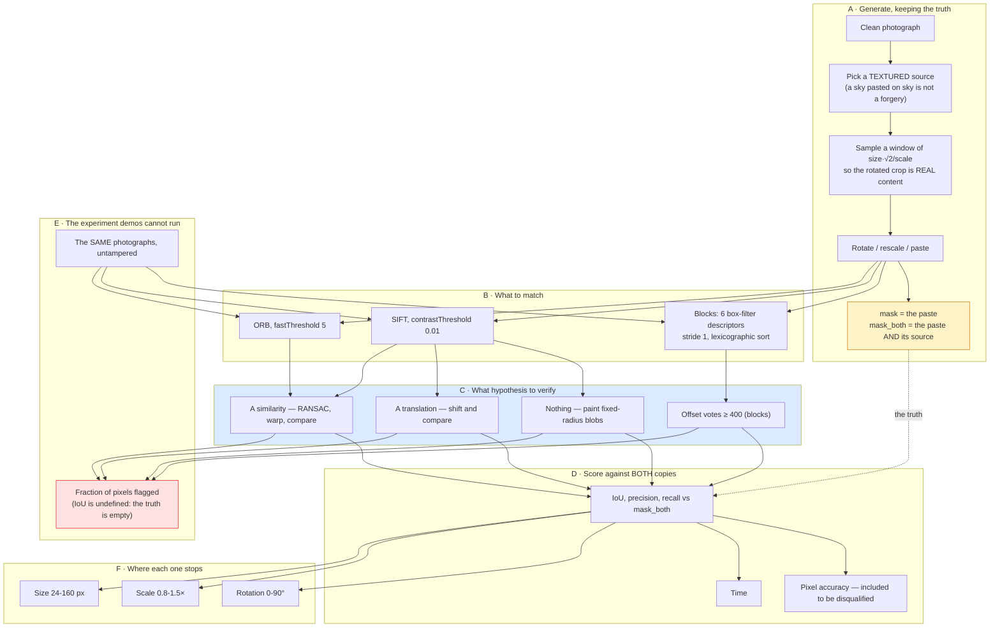

# Project 07 — Copy-move forgery detection: complete workflow

The [README](README.md) states the findings. This states how they were reached,
in what order, and what each decision cost.

---

## 1 · Why this question, and not "can it find the forgery"

"Can it find the forgery" is answerable by one picture, and every copy-move demo
answers it the same way: paste a square, run SIFT, draw circles, done. The
picture is always convincing, because the demo picks the case the method works
on.

Three questions underneath it are not:

> **How much does the answer depend on the copy being an exact, unrotated copy?**

Because that is the assumption every fast method quietly makes, and a forger
dragging a corner handle breaks it without meaning to.

> **Which of the two decisions in a detector actually matters?**

Every method here is *what to match* (blocks, SIFT, ORB) followed by *what
hypothesis to verify* (nothing, a shift, a similarity). Those are usually
described as one thing — "the SIFT method" — and they are not.

> **What does it accuse an innocent photograph of?**

The question a forensic tool lives or dies by, and the one a detection demo
structurally cannot ask, because a demo only ever runs on tampered images.

---

## 2 · The complete workflow



**The amber box and the red box are the project.** `mask_both` is what makes the
scores mean something; the false-alarm column is what makes the rankings mean
something.

---

## 3 · Build order

| Step | What | Why here |
|---:|---|---|
| 1 | `copy_move_forgery` with an exact mask | Nothing is measurable without it. |
| 2 | Block matching and SIFT self-matching | The two families, to have something to compare. |
| 3 | Score everything — and get 0.027 and 0.180 | On an **exact copy**. Both numbers are absurd, and that is where the project actually started. |
| 4 | **`mask_both`** | Diagnosing (3) showed predictions landing 39.1% on the paste and 39.2% on the source. Precision was capped at 0.5 by the truth mask, not by the methods. |
| 5 | Dense verification | Blobs approximate a region's shape with circles. Verification reads it off the image. |
| 6 | Fix the offset rounding, the SIFT threshold, the stride | Three separate bugs, each found by a number that was too low to be a result. |
| 7 | Similarity verification | Added once rotation was measured and translation-verification scored 0.061 at 15°. |
| 8 | Multi-hypothesis RANSAC | Added once `grass` returned a 0.01° fit on 818 texture matches. |
| 9 | **Regenerating the rotated paste** | Added once recall refused to pass 0.5 for methods whose matches were right. |
| 10 | **False alarms on untampered images** | Added last, and it changed the conclusion. |
| 11 | Sweeps, UI, docs, `infer.py` | — |

Steps 4, 6, 9 and 10 are the honest part of this list. Three of them were
triggered by a result that looked wrong, and the fourth by noticing that every
number in the project so far had been measured on a tampered image.

---

## 4 · Decisions, with reasoning

### Why the truth marks both copies

After the paste, the source and the destination are identical arrays. There is no
pixel-level property that distinguishes "the original" from "the copy" — they
have the same noise, the same sharpness, the same JPEG history, because they are
the same pixels. Deciding which half is the forgery requires information outside
the pixels: a shadow that falls the wrong way, a perspective that does not match,
an earlier print of the photograph.

Measured directly: a detector's prediction landed **39.1% on the paste and 39.2%
on the source**. Scoring against the paste alone therefore caps precision near
0.5 for a *perfect* detector, and the number reported would be a property of the
ambiguity rather than of the method.

So the scores here answer "did it find the duplicated pair", which is the
question these methods can answer, and the README says that is what they answer.

### Why `stride=1` is a correctness switch, not a speed dial

This is the decision I got wrong for longest, and it is the one most likely to be
gotten wrong again, because every instinct says a stride is a sampling density
you trade against runtime.

A block at `(x, y)` in the source has its twin at `(x + dx, y + dy)`. The paste
offset is arbitrary. If the stride does not divide *both* components, the two
blocks are sampled at different sub-stride phases and describe **different
pixels**. They are not approximately equal, and no tolerance recovers them. At
stride 8 the probability both components align is 1/64, and the method scored
0.068 on an exact copy.

The cost of stride 1 is 250k blocks instead of 4k, and it is affordable only
because all six descriptors are box filters and compute for every position at
once. Vectorising was not an optimisation; it was what made the correct stride
possible.

### Why SIFT's contrast threshold is lowered

SIFT's defaults are tuned for a different problem. Matching two photographs of a
building wants a few hundred *strong, repeatable* keypoints spread over the whole
frame. Copy-move wants as many keypoints as possible *inside one small region*,
because a 96×96 patch is 3.5% of the image and it needs enough of them to survive
a ratio test and reach a vote threshold.

At the default, the whole duplicated region produced **seven** keypoints and
three usable pairs — one below the four the verifier requires, so the detector
returned an empty mask and reported no forgery. A silent wrong answer, from a
correct implementation, because of a constant nobody thinks about.

### Why the translation-only verifier is kept in the table

Because it isolates a decision that is otherwise invisible. `SIFT + translation
verify` and `SIFT + similarity verify` run *the same detector*, produce *the same
keypoints* and *the same matches*. The only difference is what the verification
step assumes.

| | 0° | 90° |
|---|---:|---:|
| SIFT + translation verify | **0.7944** | 0.0000 |
| SIFT + similarity verify | 0.6767 | **0.4986** |

Assuming a pure shift is worth +0.12 IoU when the assumption holds and −0.50 when
it does not. If only the better row were shown, a reader would attribute both
numbers to SIFT, which is exactly backwards: SIFT was rotation invariant in both.

### Why the losing methods stay

`SIFT blobs (no verify)` never wins a column. It is the version this project
started with, and the gap between it and the verified row (0.444 vs 0.677 on the
same matches) is the largest single improvement made here. Deleting it would
delete the evidence for the design.

`Predict nothing` wins exactly one column — **91.8% pixel accuracy** — and that is
the only reason pixel accuracy is in the table at all. A metric that rewards
silence on a task where the positive class is 3% of pixels is not a metric, and
the cheapest way to show that is to let something silent win it.

### Why untampered images are scored, and why it changed the answer

Every other number in this project was measured on an image that *was* tampered
with. That measures how well a method finds a forgery, and says nothing about
whether it finds forgeries that are not there — which, for a tool whose output is
an accusation, is the more consequential error.

The result reframed the whole comparison:

| | survives rotation | flags a clean photo |
|---|---|---|
| Block matching | no, at all | never, on any image |
| SIFT + similarity | yes, to 90° | 6.3% mean, 34% worst |
| ORB + similarity | yes | 14.9% mean, 44.6% worst |
| SIFT blobs | yes | something on 6/6 |

There is no method here that is robust *and* quiet. The robustness is bought with
false accusations, and a table of IoU scores hides the purchase entirely.

### Why the recommendation is the brittle method

Given the above: **block matching as the default, with a rotation-robust method
as a second opinion whose output is a lead rather than a finding.** An accusation
that is wrong a third of the time is worse than no tool, because it launders a
guess into a result. A method that is silent on 2° of rotation is a known,
documentable gap — and a gap you can name is safer than a number you cannot
trust.

That is why `infer.py --all-methods` prints the clean-image baseline next to
every flagged percentage, and why an empty result prints the method's blind spots
instead of letting silence read as absence.

---

## 5 · What each stage costs

Six images, 96 px paste:

| Stage | Time |
|---|---:|
| Predict nothing (control) | 0.008 ms |
| SIFT blobs (no verify) | 33 ms |
| SIFT + translation verify | 40 ms |
| SIFT + similarity verify | 47 ms |
| ORB + similarity verify | 73 ms |
| Block matching (stride 1) | **199 ms** |
| **Full `run.py`** | **~6 min** |

Block matching is **4× slower than the best keypoint method** and, on the one
case it handles, 0.20 IoU better and free of false alarms. The verification step
costs 7 ms on top of the blobs and is worth 0.23 IoU — the best return of any
decision in the project.

The 199 ms is almost entirely the lexicographic sort of 250k six-dimensional
descriptors. Dropping to stride 2 would quarter it and, as §4 explains, break
the method.

---

## 6 · Reproducing it

```bash
python run.py                 # regenerates every number and figure
python run.py --size 48       # the whole study at a smaller forgery
streamlit run ui/app.py       # the interactive app
python infer.py suspect.jpg   # your own photo
pytest ../..                  # 26 tests here, 219 across the repo
```

`run.py` rewrites `results/results.json` and `results/tables.md`; the README's
numbers are copied from those files rather than typed.

Nine of the 26 tests pin a *finding* rather than a number — block matching
reaching 0.9 at stride 1 and falling below 0.5 at stride 8, the 2° cliff, the
verifier-hypothesis inversion at 90°, the false-alarm trade, the control's pixel
accuracy. A refactor that quietly reverses one of the project's conclusions fails
the suite instead of silently rewriting the README.

---

## 7 · What would come next

* **JPEG re-compression.** The single most important missing experiment. A real
  forged image is saved as JPEG, which quantises both copies and would force
  block matching's exact-match tolerance open — raising its false-alarm rate from
  the zero that currently justifies recommending it. The recommendation in §4 is
  conditional on an experiment that has not been run.
* **Normalised cross-correlation instead of absolute difference** in the dense
  verifier. Rotation forces interpolation, interpolation changes every pixel
  slightly, and an absolute-difference test has to be loosened to cope — which is
  why recall under rotation stops around 0.45. NCC is invariant to the local gain
  changes interpolation introduces.
* **Irregular, feathered pastes.** Supported by the generator, not yet measured.
  The mask stops being exact, so the scoring has to move to a soft IoU.
* **Multiple pastes per image.** The multi-hypothesis loop was written for this
  and is currently exercised only by texture false positives.
* **A real forged-image dataset** (CoMoFoD, CASIA). The false-alarm rates here
  are measured on six clean scikit-image samples; on a corpus full of foliage,
  brickwork and water they would be worse, and by how much is the number that
  decides whether any of this is usable.
