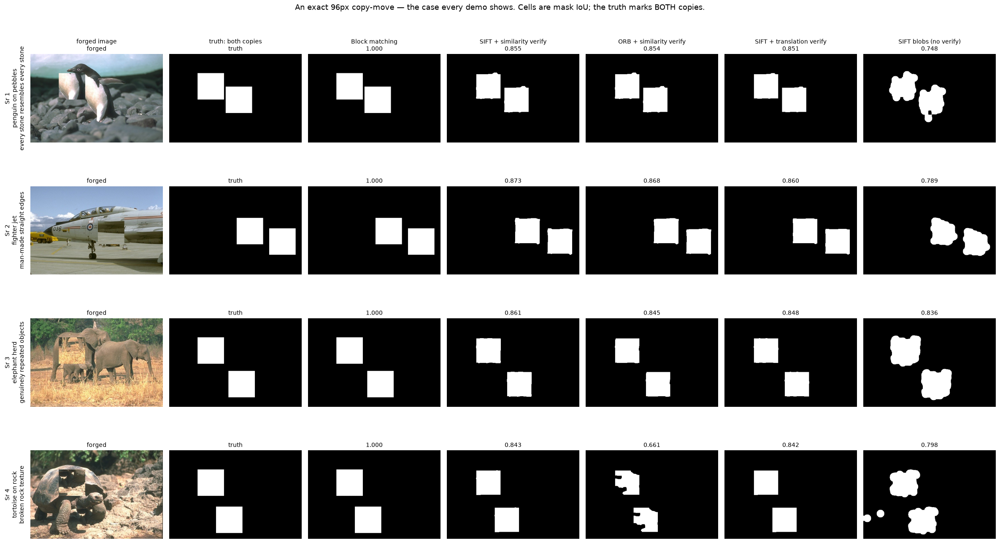
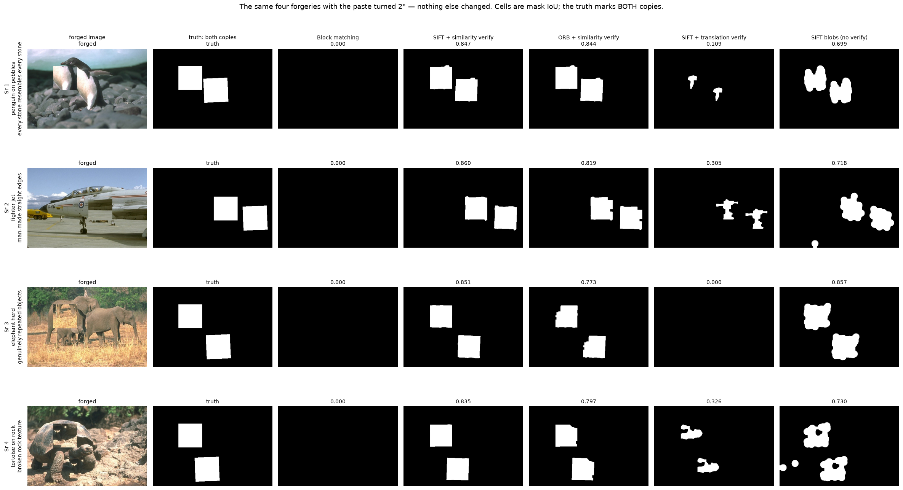
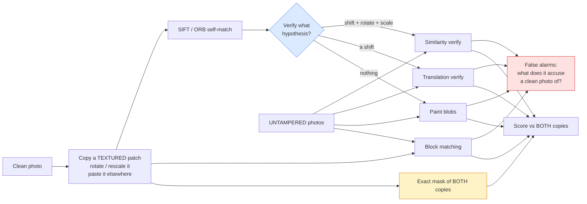

# 07 · Copy-move forgery detection — classical computer vision

[](https://www.python.org/)
[](https://opencv.org/)
[](#)
[](#)

A region of a photograph is copied and pasted elsewhere, to duplicate something
or to hide something. The pasted pixels came from **this image**, so they carry
the same sensor noise, the same illuminant and the same JPEG history as their new
neighbours. Every forensic signal that catches a splice from another photo is
silent here. The only evidence is the duplication itself.

**No neural network, no training, no GPU.**

---

## Results

The same four photographs, twice. Once with a 96 px region pasted in exactly,
and once with that paste turned by **two degrees** — nothing else changed. Five
detectors across the columns, mask IoU in every cell.

### An exact copy — the case every demo shows



| Sr | Scene | **Block matching** | SIFT + similarity | ORB + similarity | SIFT + translation | SIFT blobs (no verify) |
|---:|---|---:|---:|---:|---:|---:|
| 1 | penguin on pebbles · every stone resembles every stone | **1.000** | 0.855 | 0.854 | 0.851 | 0.748 |
| 2 | fighter jet · man-made straight edges | **1.000** | 0.873 | 0.868 | 0.860 | 0.789 |
| 3 | elephant herd · genuinely repeated objects | **1.000** | 0.861 | 0.845 | 0.848 | 0.836 |
| 4 | tortoise on rock · broken rock texture | **1.000** | 0.843 | 0.661 | 0.842 | 0.798 |

Block matching is perfect on all four. On this table it is obviously the method
to ship.

### The same four, paste turned 2°



| Sr | Scene | **Block matching** | **SIFT + similarity** | ORB + similarity | SIFT + translation | SIFT blobs (no verify) |
|---:|---|---:|---:|---:|---:|---:|
| 1 | penguin on pebbles | **0.000** | **0.847** | 0.844 | 0.109 | 0.699 |
| 2 | fighter jet | **0.000** | **0.860** | 0.819 | 0.305 | 0.718 |
| 3 | elephant herd | **0.000** | **0.851** | 0.773 | 0.000 | 0.857 |
| 4 | tortoise on rock | **0.000** | **0.835** | 0.797 | 0.326 | 0.730 |

**Block matching's column is empty. Not degraded — empty, on all four.** Two
degrees is less than anyone would rotate a region deliberately; it is the kind
of adjustment made by accident. `SIFT + similarity verify` loses 0.008, 0.013,
0.010 and 0.008 across the four rows: within noise.

**The two tables rank the five methods in opposite orders**, and nothing between
them changed except a two-degree rotation. A comparison run only on the first
table would ship the one method that cannot survive contact with a real forgery.

**Row 3 is the honest stress test.** The elephant herd already contains three
elephants — genuinely repeated objects that nobody pasted. A duplicate-region
detector that cannot tell a copied region from a second elephant would flag the
whole image. None of the five do, so the repetition they respond to is
pixel-exact provenance rather than visual similarity.

**Row 1 tests the opposite failure.** Every pebble on that beach resembles every
other pebble, which is the classic false-positive generator for block matching.
It scores 1.000 on the exact copy anyway.

The four were **chosen by the code** from twelve candidates tagged by what
surrounds the paste — low texture, self-similar, man-made, repeated objects,
natural texture, high contrast — with the best survivor of each family kept.
All twelve cleared the 0.50 IoU gate on the exact copy, which is itself worth
stating: on the easy case the scene barely matters.

```
gallery candidate bear_on_ice        keep — best IoU 0.995  [low texture]
gallery candidate penguin_pebbles    keep — best IoU 1.000  [self-similar]
gallery candidate coral_reef         keep — best IoU 1.000  [self-similar]
gallery candidate fighter_jet        keep — best IoU 1.000  [man-made]
gallery candidate family_by_van      keep — best IoU 1.000  [man-made]
gallery candidate elephant_herd      keep — best IoU 1.000  [repeated objects]
gallery candidate rhinos_grass       keep — best IoU 0.998  [repeated objects]
gallery candidate tortoise_rock      keep — best IoU 1.000  [natural texture]
gallery candidate deer_in_brush      keep — best IoU 0.998  [natural texture]
gallery candidate lioness_savanna    keep — best IoU 0.998  [natural texture]
gallery candidate tiger_rocks        keep — best IoU 1.000  [high contrast]
gallery candidate wolf_woods         keep — best IoU 1.000  [high contrast]
```

---

> **The finding, in one sentence.** The best method on an exact copy is the worst
> at every other setting. Block matching reaches **0.9925 mask IoU** on an
> unrotated paste — and **0.0000** at two degrees of rotation, and **0.0000** at
> 0.95× scale. It does not degrade; it stops.

> **The decision that matters is not the descriptor.** `SIFT + translation
> verify` and `SIFT + similarity verify` share every keypoint and every match.
> They differ only in what the verification step assumes — a shift, or a shift
> plus rotation plus scale. That single choice is worth **+0.12 IoU** on an exact
> copy and **−0.50 IoU** at 90°, in opposite directions.

> **What robustness costs.** The rotation-proof method flags **6.3% of an
> untampered photograph on average, and 34% of a repeating texture**. Block
> matching flags **nothing at all** on every clean image tested. For a forensic
> tool, that trade — and not the IoU table — is the decision.

> **The metric that lies.** Predicting "nothing was forged" scores **91.8% pixel
> accuracy** and 0.000 IoU. Any paper reporting accuracy on this task is
> reporting the size of the forgery.

**Jump to:** [What it does](#what-it-does) · 
[Results](#results) ·
[Run it](#run-it-yourself) · [Inference](#inference-check-your-own-photo) ·
[How it works](#how-it-works) · [Problems solved](#problems-hit-and-how-they-were-solved) ·
[Limitations](#limitations) · [Keywords](#keywords)

---

## What it does



Two design choices carry the whole project:

**The truth mask marks both copies (amber).** After the paste, the source and the
destination are *identical* — same content, same noise, same compression. Nothing
in the image says which one came first. A detector that finds a duplicated pair
has done its job; deciding which half is the forgery needs information the pixels
do not contain (lighting direction, perspective, a second photograph). Scoring
against the pasted region alone caps precision at about 0.5 for **every** method
and measures that ambiguity instead of the detector.

**Untampered images are scored too (red).** A detector that marks part of every
photograph you feed it is not a detector. On a clean image IoU, precision and
recall are all undefined — the truth is empty — so the only honest number is the
fraction of pixels flagged, and it should be zero. This is where the
rotation-robust methods stop looking free.

---


## Results

All numbers from `python run.py`, written to
[`results/results.json`](results/results.json) and
[`results/tables.md`](results/tables.md). Six images, 96 px paste unless stated.

### An exact copy — the case every demo shows

| Method | Mask IoU | Precision | Recall | Pixel accuracy | Time (ms) |
|---|---:|---:|---:|---:|---:|
| **Block matching** | **0.9925** | **0.9974** | **0.9951** | **0.9995** | 199 |
| SIFT + translation verify | 0.7944 | 0.9083 | 0.8675 | 0.9800 | 40 |
| SIFT + similarity verify | 0.6767 | 0.7531 | 0.8854 | 0.9232 | 47 |
| ORB + similarity verify | 0.5155 | 0.6305 | 0.8293 | 0.8257 | 73 |
| SIFT blobs (no verify) | 0.4441 | 0.6440 | 0.6648 | 0.9214 | 33 |
| Predict nothing (control) | 0.0000 | 0.0000 | 0.0000 | **0.9181** | 0.008 |

Read the last row first. **Returning an empty mask is 91.8% "accurate"**, because
the forgery covers a few percent of the pixels. Pixel accuracy is in this table
only so that it can be disqualified.

### …and then you rotate the copy

| Rotation | Block matching | SIFT + similarity | ORB + similarity | SIFT + translation | SIFT blobs |
|---:|---:|---:|---:|---:|---:|
| 0° | **0.9925** | 0.6767 | 0.5155 | 0.7944 | 0.4441 |
| 2° | **0.0000** | 0.6633 | 0.5162 | 0.2973 | 0.3857 |
| 5° | 0.0000 | 0.6477 | 0.4559 | 0.1315 | 0.3797 |
| 15° | 0.0000 | **0.5916** | 0.4062 | 0.1010 | 0.3318 |
| 30° | 0.0000 | **0.6023** | 0.4217 | 0.0246 | 0.3364 |
| 45° | 0.0000 | **0.5360** | 0.3917 | 0.0190 | 0.3527 |
| 90° | 0.0000 | **0.4986** | 0.4583 | 0.0000 | 0.4329 |

**Two degrees.** That is the entire operating range of the best method in the
table. Its descriptor is four quadrant means, which are not rotation invariant,
so the duplicated blocks stop describing the same numbers, no offset reaches its
vote threshold, and the mask comes back empty. There is no partial credit
because there is no partial match.

### …or rescale it

| Scale | Block matching | SIFT + similarity | ORB + similarity | SIFT + translation | SIFT blobs |
|---:|---:|---:|---:|---:|---:|
| 0.80 | 0.0000 | **0.6815** | 0.4582 | 0.0946 | 0.3847 |
| 0.90 | 0.0000 | **0.6902** | 0.4368 | 0.2187 | 0.3693 |
| 0.95 | 0.0000 | **0.6700** | 0.4632 | 0.3261 | 0.3747 |
| 1.00 | **0.9925** | 0.6767 | 0.5155 | 0.7944 | 0.4441 |
| 1.05 | 0.0000 | **0.5319** | 0.4162 | 0.3312 | 0.3549 |
| 1.20 | 0.0000 | **0.5184** | 0.3710 | 0.1828 | 0.3231 |
| 1.50 | 0.0000 | **0.2392** | 0.1467 | 0.0000 | 0.2150 |

A **5% resize** is enough. Anyone pasting in an image editor drags a corner
handle without thinking about it.

### Every method has a hard floor

| Size (px) | Area | Block matching | SIFT + similarity | ORB + similarity | SIFT + translation | SIFT blobs |
|---:|---:|---:|---:|---:|---:|---:|
| 24 | 0.2% | 0.0000 | 0.0000 | 0.0004 | 0.0000 | 0.0498 |
| 32 | 0.4% | 0.0000 | 0.0000 | 0.0003 | 0.0000 | 0.0266 |
| 48 | 0.9% | **0.9985** | 0.2904 | 0.0730 | 0.4333 | 0.2937 |
| 64 | 1.6% | **0.9909** | 0.3708 | 0.1758 | 0.5321 | 0.2751 |
| 96 | 3.5% | **0.9925** | 0.6767 | 0.5155 | 0.7944 | 0.4441 |
| 128 | 6.3% | **0.9943** | 0.7559 | 0.6194 | 0.8433 | 0.5111 |
| 160 | 9.8% | **0.9750** | 0.7697 | 0.7206 | 0.8541 | 0.5549 |

Neither floor is a tuning accident. Block matching needs 400 blocks sharing one
offset and a `s × s` paste contains only `(s − 16 + 1)²` of them — below `s = 35`
the region does not have enough blocks to reach the threshold. The dense verifier
discards connected components under 0.4% of the image, because a region that
small is indistinguishable from coincidental agreement. Both floors are visible
in the table as a step from 0.00 to 0.99 between 32 px and 48 px.

### FALSE ALARMS — on untampered photographs

| Method | Mean flagged | Worst image | Images accused |
|---|---:|---:|---:|
| **Block matching** | **0.000%** | **0.000%** | **0 / 6** |
| Predict nothing (control) | 0.000% | 0.000% | 0 / 6 |
| SIFT + translation verify | 0.817% | 4.90% | 1 / 6 |
| SIFT + similarity verify | 6.32% | 34.16% | 2 / 6 |
| SIFT blobs (no verify) | 6.57% | 26.36% | **6 / 6** |
| ORB + similarity verify | 14.95% | 44.63% | 3 / 6 |

Read this table **next to the rotation table**, because between them they
describe one trade and not two results:

* The method that never raises a false alarm is the method that fails at 2°.
* The method that survives any rotation accuses a third of a photograph of
  brickwork.

For a forensic tool the ordering is clear — an accusation that is wrong a third
of the time is worse than useless, so block matching is the right default and
its blind spot has to be covered by *also* running a rotation-robust method and
treating its output as a lead rather than a finding. That is what `infer.py
--all-methods` prints, and why it prints the clean-image baseline next to every
result.

---

## Run it yourself

```bash
git clone https://github.com/hammas159/classical-computer-vision.git
cd classical-computer-vision/projects/07_copy_move_forgery
```

```bash
pip install -r ../../requirements.txt

python run.py                 # regenerate every number and figure (~6 min)
python run.py --size 48       # rerun the whole study at a smaller forgery
pytest ../..                  # 26 tests for this project, 219 for the repo
```

`run.py` rewrites `results/results.json` and `results/tables.md`. **Every number
in this README is copied from those files rather than typed.**

---

## Inference: check your own photo

```bash
python infer.py suspect.jpg
python infer.py suspect.jpg --all-methods
python infer.py suspect.jpg --method "Block matching" --out flagged.png
python infer.py suspect.jpg --overlay matches.png      # draw the self-matches
```

Typical output:

```
input   : suspect.jpg  1200x800
matches : 412 SIFT self-matches, 168 consistent with one transform
transform: rotation +14.87 deg, scale 1.0021
method  : SIFT + similarity verify   61 ms
flagged : 7.41% of pixels
wrote   : flagged.png

verdict : 7.41% flagged, against a 6.3% mean on untampered images
          for this method. Suggestive, not conclusive. The number to look at
          is the inlier count above (168) and the fitted transform.
```

**This tool cannot tell you a photograph is genuine, and a flag is not proof.**
What it can give you is two things worth having:

* **The consensus.** 168 keypoint pairs agreeing on one transform of 14.87° is
  what a rotated copy-move looks like. Five pairs agreeing on 0.03° is what a
  flat sky looks like, and `infer.py` says so.
* **A baseline to read the number against.** Every verdict line quotes what that
  method flags on images *known to be clean*, because "7.4% of pixels were
  flagged" means nothing until you know the method flags 6.3% of an innocent
  photograph.

An empty result is explicitly **not** a clean bill of health: the verdict text
names the method's measured blind spots (2° of rotation, 0.95× scale, anything
under ~40×40 px) rather than letting silence read as absence.

---

## How it works

### Block matching

1. Describe every 16×16 block by six numbers: four quadrant means, the block
   mean, the block standard deviation.
2. Lexicographically sort the descriptors, so near-identical blocks become
   *adjacent*. This is the trick that makes the method linear instead of
   quadratic — duplicates are found in one pass over the sorted array rather than
   by comparing every pair.
3. For each adjacent pair within tolerance, record the displacement `(dx, dy)`.
4. Keep only displacements with **400+ votes**. Any smooth region produces
   thousands of similar blocks; a genuine copy-move produces many pairs that all
   share *one* vector.

All six descriptors are box filters, so they are computed for every pixel
position at once rather than in a Python loop — which is what makes step 1
affordable at stride 1, and stride 1 is not optional (see below).

### Keypoint matching

1. SIFT or ORB, with the detector threshold **lowered** (see below).
2. Match the descriptor set against **itself**, `k=3`. The nearest neighbour of
   a descriptor in its own set is always itself at distance zero, so the first
   match is discarded and Lowe's ratio test runs on the second and third.
3. Drop pairs closer than 30 px — those are one feature detected twice, not a
   copy.
4. **Verify.** RANSAC fits a partial affine (translation, rotation, uniform
   scale — four degrees of freedom, which is exactly what a paste is), the image
   is warped by it, and every pixel whose 9×9 neighbourhood still agrees after
   the warp is marked. Components under 0.4% of the image are noise; components
   over 30% are a flat sky agreeing with itself.
5. Repeat up to four times on the *remaining* pairs, because the largest
   consensus is not always the forgery.

Step 4 is the whole difference between a set of circles and a segmentation.

---

## Problems hit, and how they were solved

Every entry is a real defect in this project's own code, with the symptom that
exposed it and the measurement that confirmed the fix.

### 1 · Block matching scored 0.068 on an exact copy — because of `stride`

**Symptom.** The method that should be near-perfect on an unrotated paste scored
**0.068 IoU**, with recall 0.24. It ran without error and produced a plausible-
looking mask.

**Cause.** `stride=8`. A block at `(x, y)` in the source region has its duplicate
at `(x + dx, y + dy)`, and the paste offset is arbitrary — in the failing case
`(−117, −171)`. If the stride does not divide **both** components, the source
block and the destination block are sampled at different sub-stride phases and
describe *different pixels*. With stride 8 the chance both align is 1 in 64, and
the descriptors that should have been identical simply were not.

This is worth dwelling on: `stride` looks exactly like a speed/quality dial, and
it is not. It is a correctness switch.

**Fix** — [`src/forgery.py:112`](src/forgery.py#L112), plus vectorising the
descriptors so the switch is affordable. Every one of the six numbers is a box
filter, so all positions compute at once:

```python
stride: int = 1,
```

```python
mean_half = cv2.boxFilter(f, cv2.CV_32F, (half, half), **anchored)
```

**Result: 0.068 → 0.9925 IoU.** Pinned by `test_block_matching_needs_stride_one`,
which asserts stride 1 exceeds 0.9 and stride 8 falls below 0.5, so nobody
"optimises" it back.

### 2 · SIFT silently reported "no forgery" on a real forgery

**Symptom.** `detect_sift` returned an **empty mask** on a 96 px exact copy. No
exception. The image had 1076 keypoints and the duplicated region genuinely
contained matching descriptors at distance 0.0.

**Cause.** SIFT's default `contrastThreshold` of 0.04 is tuned for matching two
photographs, where a few hundred strong keypoints is plenty. Copy-move needs
keypoints *inside one 96×96 region*, and at the default the whole duplicated
patch yielded seven of them — only **three** survived the ratio test, one below
the four votes the verifier requires.

```
contrastThreshold   keypoints   in the patch   usable pairs
0.04 (default)           1272              7              3   <- silent failure
0.02                     1719             15              8
0.01                     2023             29             22   <- used here
0.005                    2273             40             25
```

**Fix** — [`src/forgery.py:310`](src/forgery.py#L310):

```python
SIFT_CONTRAST_THRESHOLD = 0.01
```

0.01 rather than 0.005 because the last step buys 3 pairs for 250 keypoints.
Pinned by `test_sift_needs_a_lowered_contrast_threshold`.

### 3 · The dense verifier tested an offset it had rounded first

**Symptom.** After adding dense verification — the step that should have been a
large win — SIFT scored **0.178 IoU**, barely above the 0.180 of the blob-painting
version it replaced. Feeding the verifier the *true* offset by hand gave 0.892
recall, so the verification arithmetic was correct.

**Cause.** Offsets were clustered into 6 px buckets for voting, and then the
**bucket centre** was the offset actually tested. A 3 px misalignment makes a
textured region disagree with itself, so the comparison failed on exactly the
pixels it was supposed to confirm.

**Fix** — [`src/forgery.py:267`](src/forgery.py#L267) — bucket to group, median
to test:

```python
dx, dy = int(np.median(arr[:, 0])), int(np.median(arr[:, 1]))
```

**Result: 0.178 → 0.548**, and with the keypoint density fixed as well, **0.806**.

### 4 · Verifying a translation cannot find a rotated copy

**Symptom.** With everything above fixed, SIFT scored 0.806 on an exact copy and
**0.061 at 15°** — while its own keypoint matches were still correct, and the
blob-painting version that ignored the offset entirely scored 0.325.

**Cause.** `verify_by_offset` tests one hypothesis: "this region was translated
by (dx, dy)". A rotated copy is not reachable by a translation, so shifting and
comparing finds nothing. The descriptors were rotation invariant the whole time;
the **hypothesis** was not.

**Fix** — [`src/forgery.py:369`](src/forgery.py#L369) — estimate the transform
instead of assuming it:

```python
matrix, inliers = cv2.estimateAffinePartial2D(
    src, dst, method=cv2.RANSAC, ransacReprojThreshold=ransac_thresh, maxIters=5000
)
```

**Result: 0.061 → 0.394 at 15°, 0.000 → 0.499 at 90°.** The translation-only
version was kept as its own row rather than deleted, because the two rows share
every keypoint and every match, so the difference between them isolates exactly
one decision. That comparison is now one of the project's three findings.

### 5 · RANSAC fitted the grass instead of the forgery

**Symptom.** After the fix above, `grass` and `brick` still detected nothing, and
`astronaut` detected nothing at 45° despite recovering the transform correctly.
Two different causes wearing one symptom:

```
astronaut  pairs=   7 inliers=   4 scale=1.003 angle=  45.20   <- correct, but rejected
grass      pairs= 818 inliers= 160 scale=1.000 angle=  -0.01   <- wrong, and accepted
```

* On `astronaut`, RANSAC found the right transform on 4 inliers — and
  `min_inliers=8` threw it away.
* On `grass`, 818 self-matches from the repeating texture **outvoted** the real
  paste, and RANSAC returned a 0.01° rotation: a perfectly good description of
  grass, and not the answer.

**Fix** — [`src/forgery.py:364`](src/forgery.py#L364) — fit, test, discard those
inliers, refit, up to four times; lower `min_inliers` to 4; and reject dense
regions that are implausibly large as well as implausibly small:

```python
for _ in range(attempts):
```

```python
if min_area <= area <= max_area:
```

**Result at 15°: 0.394 → 0.592. At 45°: 0.426 → 0.536.**

### 6 · One fifth of a rotated "forgery" was not a copy of anything

**Symptom.** Recall under rotation refused to pass about 0.5 for every method,
including ones whose matches were demonstrably right.

**Cause.** In the generator. Rotating a `size × size` patch **in place** leaves
the corners to `BORDER_REFLECT`, so roughly 20% of a 15° paste was invented pixels
that no detector could match to anything — while the truth mask still claimed
them. The sweep was measuring the generator.

**Fix** — [`shared/synth.py:348`](../../shared/synth.py#L348) — sample a source
window wide enough to crop a full patch out of after rotating, and mark the
source footprint as the **rotated** square it actually is:

```python
need = max(size, int(np.ceil(size * np.sqrt(2) / max(scale, 1e-3)))) + 2
```

```python
cv2.fillPoly(mask_both, [np.round(pts).astype(np.int32)], 255)
```

Marking an axis-aligned box instead would have scored a correct detector as
over-detecting by `1 − 2/π` of the box at 45°. Pinned by
`test_a_rotated_paste_is_filled_with_real_content_not_reflection`.

### 7 · The scale sweep crashed at 1.5×

**Symptom.**

```
ValueError: could not broadcast input array from shape (2,2,3) into shape (96,96,3)
```

**Cause.** The fix above computes the source window as `size × √2 / scale`. For
`scale = 1.5` that is 93 px — *smaller than the 96 px crop taken from it* — so
the crop indices went negative and produced a 2×2 array.

**Fix** — the same line, with a clamp: `max(size, ...)`. For `scale > 1` the
source region genuinely is smaller than the paste, but the warp buffer still has
to be big enough to crop from. Pinned by
`test_the_generator_survives_every_scale`, parametrised over 0.8, 1.0 and 1.5.

### 8 · My textured-source picker measured the wrong window

**Symptom.** Source patches were landing in low-texture areas despite the code
explicitly selecting high-variance ones.

**Cause.** `cv2.boxFilter` **centres** its window by default. I scored the window
*centred* on `(x, y)` and then cropped the patch *starting at* `(x, y)` — half a
patch away from the texture that had been measured.

**Fix** — [`shared/synth.py:327`](../../shared/synth.py#L327):

```python
mean = cv2.boxFilter(g, -1, (size, size), anchor=(0, 0), borderType=cv2.BORDER_ISOLATED)
```

The same anchoring mistake would have been silent in the block descriptors too,
which is why both call sites now pass `anchor` explicitly rather than relying on
a default that means "centre".

### 9 · A test asserted a finding on too little data

**Symptom.** `assert 0.861 > 0.8657` — a claim the README makes with a 0.12
margin failed by 0.005.

**Cause.** The test ran on a two-image subset for speed. The
translation-beats-similarity-at-0° effect is 0.12 IoU over six images and a coin
flip over two.

**Fix.** That one test now runs on the full image set, with the margin it
actually has. Cheap tests are good; a cheap test that reports a headline finding
as false is not.

---

## Limitations

* **Square, hard-edged pastes.** Real forgeries are irregular and feathered. The
  generator supports feathering (`feather=`) but the measurements here use hard
  edges so the mask is exact — which means a real detector faces a harder problem
  at the boundary than the one measured.
* **No post-processing of the forged image.** A real forged image is re-saved as
  JPEG, which quantises both copies and can break exact-match methods. Block
  matching's tolerance would have to be reopened for that, and its false-alarm
  rate would rise with it. That experiment belongs here and is not done.
* **Recall under rotation tops out around 0.45.** Interpolation makes the rotated
  copy differ from its source everywhere, so the dense agreement test has to be
  loosened, which costs precision. A correlation-based agreement test (normalised
  cross-correlation instead of absolute difference) is the obvious next step.
* **Six images.** These are the scikit-image samples, which are clean, sharp and
  well-exposed. The false-alarm rates in particular would look different on a
  set of real photographs full of foliage, fabric and water.
* **One forgery per image.** A real edit often duplicates several regions. The
  multi-hypothesis loop was written for that case but is only exercised by the
  texture false positives, not by a genuine second paste.

---

## Keywords

copy-move forgery detection, image forensics, tampering detection, image
manipulation detection, duplicated region detection, block matching,
lexicographic sorting, offset voting, SIFT, ORB, keypoint self-matching, Lowe's
ratio test, RANSAC, estimateAffinePartial2D, similarity transform, dense
verification, normalized convolution, connected components, mask IoU, Dice,
precision recall, false alarm rate, pixel accuracy fallacy, rotation invariance,
scale invariance, classical computer vision, OpenCV, Python, no deep learning,
CPU only, forgery detection without neural networks

---

## See also

* [`PROJECT.md`](PROJECT.md) — the complete workflow: build order, every decision
  and what it cost.
* [Project 25 · Matching and RANSAC](../25_matching_ransac) — the same
  descriptors and the same robust estimator, used for their intended purpose.
* [Project 19 · Keypoint detectors](../19_keypoint_detectors) — why SIFT's
  thresholds are set where they are, measured directly.
* [Repo index](../../README.md)
