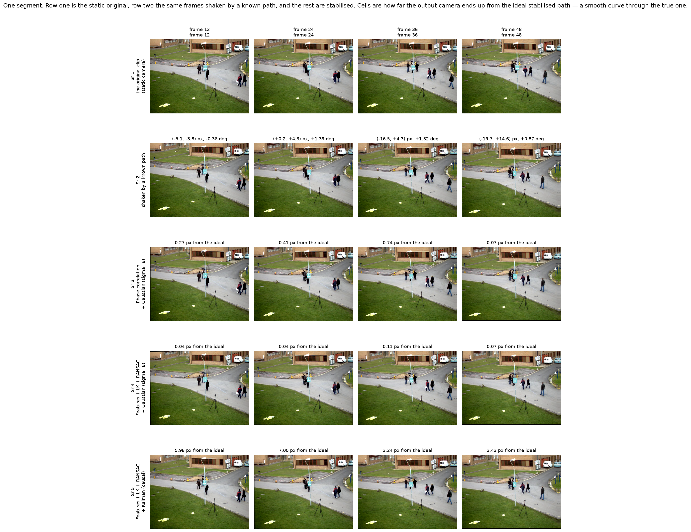
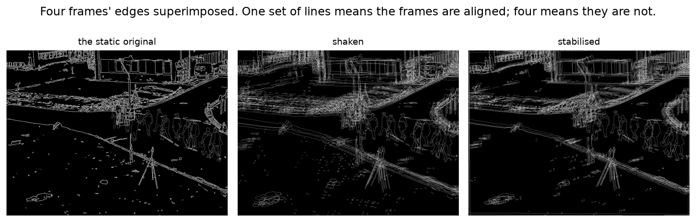
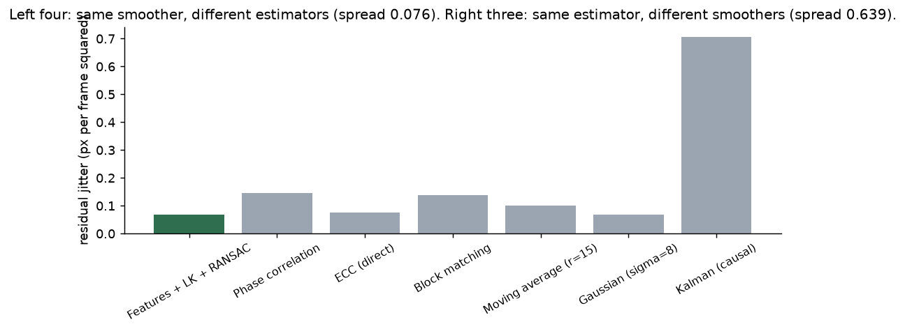
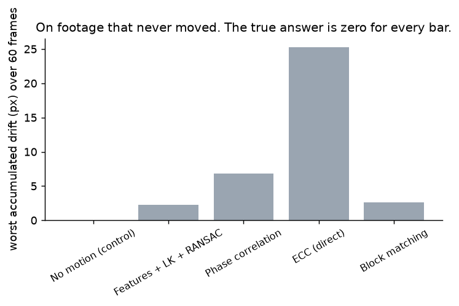
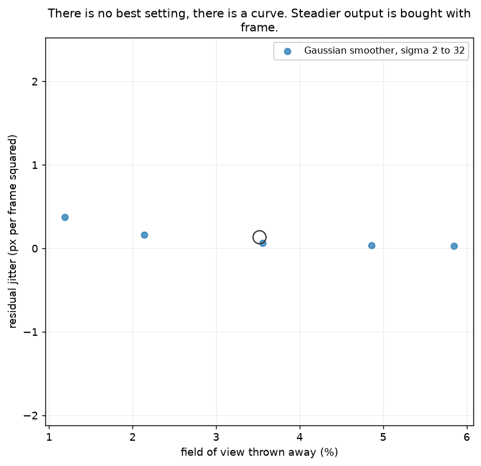
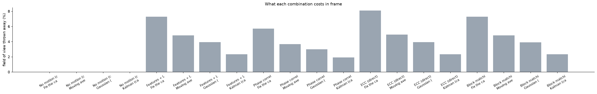
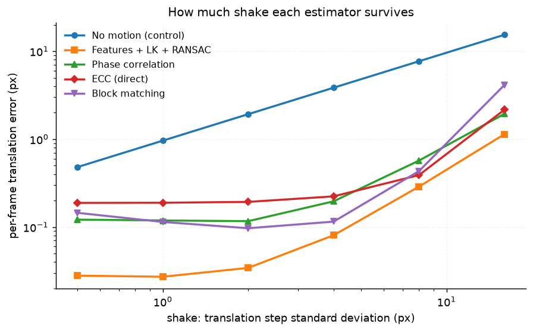
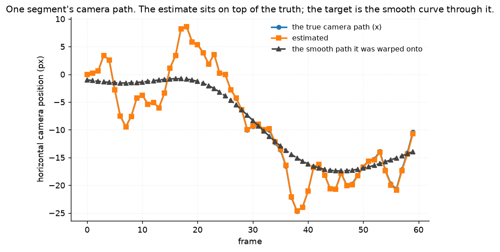

# 08 · Video stabilisation — classical computer vision

[](https://www.python.org/)
[](https://opencv.org/)
[](#)
[](#)

Estimate the shake, smooth the estimated path, warp each frame onto the smooth
one. Four estimators, three smoothers, two controls, and twelve segments of real
footage given a **known** camera path.

> **The estimator is not the bottleneck.** The best one recovers the camera path
> to **0.035 px per frame** — 62× finer than the shake it is removing. Swapping it
> for the worst estimator moves the residual jitter by **0.076**. Swapping the
> *smoother* instead moves it by **0.639**, **8.4× as much**. Almost every
> stabilisation write-up is about the first step and the second one decides the
> result.

> **The control nobody runs:** point a stabiliser at footage that never moved.
> The true motion is exactly zero, and these estimators invent **0.023 to 0.144 px
> per frame**. Because the path is an integral, ECC accumulates **25.3 px of
> drift** over sixty frames — a visible wander introduced into a tripod shot.

> **Nothing is called best without saying what it cost.** Widening the smoother
> from σ 2 to σ 32 makes the output **13× steadier** and throws away **5× more of
> the frame** (1.2% → 5.9%). There is no best setting; there is a curve.

**No neural network, no training, no GPU.**

---

## Results

One segment. Row 1 is the static original, row 2 the same frames shaken by a
known path, and the rest are stabilised. Cells are how far the output camera ends
up from the **ideal stabilised path** — a smooth curve through the true one.



| Sr | Frame | True offset (px) | Phase correlation + Gaussian | Features + LK + RANSAC + Gaussian | Features + LK + RANSAC + **Kalman** |
|---:|---:|---|---:|---:|---:|
| 1 | 12 | (−5.1, −3.8) | 0.27 | **0.04** | **5.98** |
| 2 | 24 | (+0.2, +4.3) | 0.41 | **0.04** | **7.00** |
| 3 | 36 | (−16.5, +4.3) | 0.74 | **0.11** | 3.24 |
| 4 | 48 | (−19.7, +14.6) | **0.07** | **0.07** | 3.43 |

*Distance from the ideal stabilised path, in pixels. The Kalman column is **50 to
170 times** further out than the Gaussian one **on identical motion estimates** —
that is lag, not error. An earlier version of this figure measured each pipeline
against its own target, which is the estimation error and is the same for both
smoothers; it printed two identical columns.*

A still cannot show that a video is shaky, so four frames' edges superimposed:
one set of lines means they are aligned, four means they are not.



| Estimator | Translation error (px/frame) | Rotation error (deg/frame) | ms per frame |
|---|---:|---:|---:|
| **No motion (control)** | **1.9856** | **0.1214** | 0.0 |
| **Features + LK + RANSAC** | **0.0353** | **0.0032** | 8.2 |
| Phase correlation | 0.1177 | **0.1214** | 8.4 |
| ECC (direct) | 0.1586 | 0.0130 | **49.1** |
| Block matching | 0.0924 | 0.0163 | **5.0** |

*The shake is 2.19 px and 0.12° per frame, so the do-nothing control's error is
simply the shake itself. **Phase correlation's rotation error is identical to the
control's to six decimal places** — it is translation-only by construction and
reports exactly zero rotation, which is a property rather than a failure, and a
test asserts the two numbers match.*

---

## The signature result: the smoother decides it



| Same smoother, different estimator | Residual jitter |
|---|---:|
| Features + LK + RANSAC | **0.0683** |
| ECC (direct) | 0.0744 |
| Block matching | 0.1370 |
| Phase correlation | 0.1446 |
| | **spread 0.076** |

| Same estimator, different smoother | Residual jitter |
|---|---:|
| Gaussian (σ = 8) | **0.0683** |
| Moving average (r = 15) | 0.1013 |
| **Kalman (causal)** | **0.7070** |
| | **spread 0.639** |

**8.4× more spread from the smoother than from the estimator**, on the same
segments with the same shake.

The Kalman filter is **10.4× worse than the Gaussian on identical motion
estimates**. It is not a worse filter — it is a *causal* one. It can only see the
path so far, so it lags behind it, and lag is exactly what a viewer perceives as
shake. The Gaussian and the moving average are offline: they can see the future
of the clip and centre their window on the frame being corrected.

That is the real trade in this step, and it is not about estimation accuracy at
all. A live stabiliser cannot use the future, which is why phone stabilisation
looks the way it does.

---

## The control nobody runs



The same estimators on the **unjittered** clip, where the true camera motion is
exactly zero:

| Estimator | Invented motion (px/frame) | Worst accumulated drift (px) |
|---|---:|---:|
| No motion (control) | **0.0000** | **0.000** |
| Features + LK + RANSAC | 0.0232 | 2.26 |
| Block matching | 0.0251 | 2.58 |
| Phase correlation | 0.0787 | 6.78 |
| **ECC (direct)** | **0.1440** | **25.29** |

Every number in the first column should be zero and none of them is. People walk
through the frame, the codec moves 8×8 blocks about between keyframes, and a
corner tracker has no way to know the camera did not move.

**The per-frame numbers look negligible and the accumulated ones do not**, because
a camera path is an integral: a small consistent bias never cancels. ECC's
0.144 px per frame becomes 25 px of wander over six seconds. Pointed at a tripod
shot, it would make it worse.

This is the case a synthetic benchmark cannot produce, and it is the reason this
project shakes *real static footage* rather than generating a scene: the
unjittered clip is a free zero-motion control with an exact answer.

---

## Stability is bought with field of view



| Gaussian σ | 2 | 4 | 8 | 16 | 32 |
|---|---:|---:|---:|---:|---:|
| Residual jitter | 0.3739 | 0.1650 | 0.0646 | 0.0332 | **0.0295** |
| Field of view lost | **1.2%** | 2.1% | 3.6% | 4.9% | 5.9% |

**13× steadier for 5× more crop.** A stabiliser can always look better by
targeting a stiller camera, and the bill arrives as frame. Quoting a stability
number without the crop is quoting half a result, which is why every table here
reports the pair.

The curve also has a knee: from σ 16 to σ 32 the jitter improves by 11% and the
crop grows by another 1% of frame. Past that point the smoother is mostly
throwing away picture.



---

## How much shake each estimator survives



| Translation step (px) | 0.5 | 1 | 2 | 4 | 8 | 16 |
|---|---:|---:|---:|---:|---:|---:|
| No motion (control) | 0.480 | 0.961 | 1.921 | 3.843 | 7.686 | 15.371 |
| **Features + LK + RANSAC** | **0.028** | **0.027** | **0.034** | **0.081** | **0.288** | **1.138** |
| Phase correlation | 0.121 | 0.119 | 0.117 | 0.196 | 0.570 | 1.937 |
| ECC (direct) | 0.188 | 0.189 | 0.193 | 0.223 | 0.390 | 2.158 |
| Block matching | 0.145 | 0.114 | 0.097 | 0.115 | 0.433 | **4.123** |

**Block matching is second best at 2 px and worst by far at 16.** Its search
window is ±24 px and its blocks are 48 px, so once the motion between frames
approaches the window the true match is outside it and the estimate collapses. It
is the only method here with a hard limit rather than a gradual degradation, and
a test pins the crossover.

The corner tracker degrades most gracefully because Lucas–Kanade runs on a
five-level pyramid: large motion at full resolution is small motion at 1/16.



---

## Where the ground truth came from

The clip is a **static-camera** recording of a plaza — real people, real lighting,
real compression artefacts. A **known** damped random walk in translation and
rotation is then applied to it.

So the truth is not estimated. It is the matrix that was used, and a test asserts
that `shaken_segment` contains no estimation at all.

**What is real and what is not:** every pixel of content is photographed, and the
camera path is synthetic. That is the right way round here, because the camera
path is precisely the thing being estimated — and it hands the project a
zero-motion control for free.

The first version of the shake used a 6 px step with weak damping and produced a
path wandering **277 px across a 768 px frame**. That is a pan, not a shake, and
it made the crop dominate every other number. The values now give a path with a
standard deviation of a few pixels.

---

## Two sign errors, caught by a round trip

The first version of this project scored **phase correlation worse than reporting
no motion at all** (13.0 px against 6.4), and every estimator's rotation error
worse than the control's. Both were sign errors, and neither was visible in the
aggregate — a wrong sign still produces plausible-looking numbers.

The test that found them warps one frame by a known pose and estimates it back:

```
(0, 0, 2.0)  Features + LK + RANSAC  ->  [-0.015 -0.018 -2.0 ]   # should be +2
(5.0, 0, 0)  Phase correlation       ->  [-5.     0.     0.  ]   # should be +5
```

* `getRotationMatrix2D` builds `[[cos, sin], [-sin, cos]]`, so `M[1,0]` is *minus*
  the sine and reading the angle as `arctan2(M[1,0], M[0,0])` returns its
  negative.
* `phaseCorrelate(a, b)` already returns the shift **of a towards b**, which is
  the motion from the previous frame to this one. Negating it — the obvious
  guess — inverted it.

Both are now regression tests, parameterised over four known poses.

---

## Try it

```bash
python infer.py                                  # one segment, default pipeline
python infer.py --estimator "Block matching" --smoother "Kalman (causal)"
python infer.py --shake 8                        # more shake than anything survives
python infer.py --no-shake                       # the zero-motion control, live
```

`--no-shake` is the one to run: it stabilises footage that never moved, and
prints how much motion the estimator invented and how far the path drifted.
Every run prints the residual jitter **and** the crop, because neither means much
alone.

---

## Limitations

* **The camera path is synthetic.** The content is real and the path is not, and
  a real handheld path has structure this random walk does not — a bias while
  walking, a jolt on a footstep, rolling-shutter skew that no affine can model.
* **The motion model is a similarity transform** (translation, rotation, uniform
  scale). Real handheld motion includes parallax, which no global 2-D warp can
  remove, and this clip's depth range makes that easy to miss.
* **Twelve segments of sixty frames** from one clip, one scene, one camera.
* **`jitter` is mean absolute acceleration of the path**, not a perceptual
  measure. It correctly ignores a smooth pan, which is the property that matters
  here, but it is not calibrated against anyone's eye.
* **The crop is computed from the warp corners**, so it is the crop needed to
  guarantee a full frame — not the crop a player would apply, which is usually
  fixed in advance and occasionally wrong.
* **Timings are single-threaded medians on one machine.** The 10× between ECC and
  the others is the useful part.
* **No rolling shutter, no lens distortion, no motion blur.** A real shaky video
  has all three, and motion blur in particular is not reversed by warping.

---

## Tests

21 tests, run with `pytest projects/08_video_stabilisation/tests -q`. They pin the
result (the smoother's spread exceeds the estimator's by more than 4×; the causal
smoother is the worst; a stabiliser invents motion on footage that never moved;
stability and crop move together monotonically), both sign errors as
parameterised round trips, the block matcher's search-window crossover, and the
setup — that the shake is a shake rather than a pan, that the truth contains no
estimation, that the original clip really is static, and that `jitter` ignores a
smooth pan.

They skip cleanly if `vtest.avi` is not cached.

---

## Keywords

video stabilisation · motion estimation · optical flow · Lucas-Kanade · phase
correlation · ECC alignment · block matching · camera path smoothing · Kalman
filter · Gaussian smoothing · cropping · residual jitter · rolling shutter ·
classical computer vision · no deep learning · OpenCV · Python · CPU only ·
reproducible image processing experiments

## References

* Matsushita, Ofek, Ge, Tang & Shum, *Full-Frame Video Stabilization with Motion
  Inpainting*, TPAMI 2006 — on the cropping trade this project measures.
* Grundmann, Kwatra & Essa, *Auto-Directed Video Stabilization with Robust L1
  Optimal Camera Paths*, CVPR 2011 — on the path model being the hard part, which
  is what the smoother comparison above finds.
* Evangelidis & Psarakis, *Parametric Image Alignment Using Enhanced Correlation
  Coefficient Maximization*, TPAMI 2008 — the ECC estimator.
* Bouguet, *Pyramidal Implementation of the Lucas Kanade Feature Tracker* — the
  pyramid that makes the corner tracker degrade gracefully.
* `vtest.avi` ships with OpenCV's sample data.
