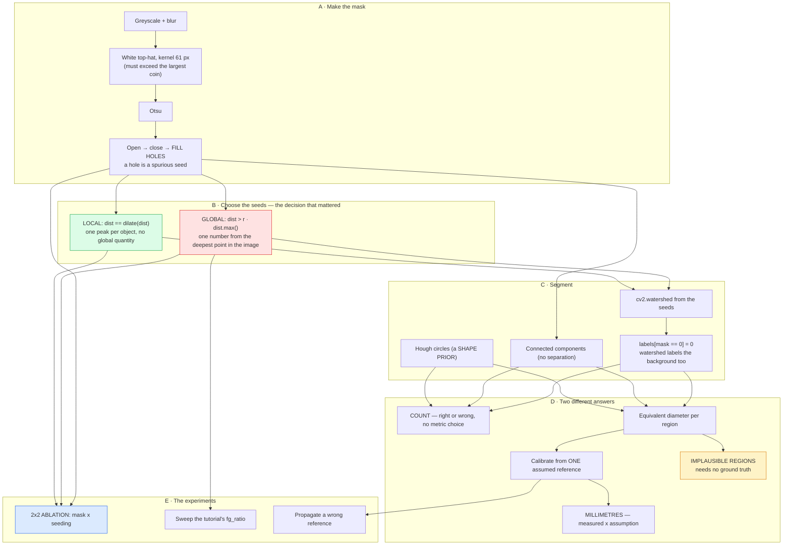

# Project 09 — Coin counting and measurement: complete workflow

The [README](README.md) states the findings. This states how they were reached,
in what order, and what each decision cost.

---

## 1 · Why this question, and not "can watershed count the coins"

"Can watershed count the coins" has been answered on this exact image in a
hundred tutorials, and the answer is always yes, because the tutorial is written
after the parameters have been tuned on it.

Two questions the tutorial cannot ask:

> **Is the count robust, or is it tuned?**

Every watershed demo has one seed threshold in it. Sweeping it — instead of
quoting the value that worked — shows whether the method found the coins or
whether the author found the number.

> **Having counted them, can you measure them?**

This is where the project becomes something other than a segmentation demo. A
count is a verdict; a measurement is a claim with a unit, and it depends on
things a count does not: the *shape* of each region, and one external assumption.
Both of those turn out to be where the errors are.

The third question appeared only after the first two were answered, and it is the
one the README leads with:

> **Which part of the pipeline was actually fragile?**

---

## 2 · The complete workflow



**The blue box is the project.** Everything else is a pipeline; the ablation is
what turned two bug fixes into a result.

---

## 3 · Build order

| Step | What | Why here |
|---:|---|---|
| 1 | Otsu + connected components | The baseline that *must* fail on touching objects, so the rest has something to beat. |
| 2 | Watershed, tutorial seeding | The standard answer. It returned **1 coin**, which is where the project actually started. |
| 3 | **Sweep the seed ratio** | Before debugging. Seven values, seven wrong answers — that ruled out "badly tuned" and pointed upstream. |
| 4 | Look at the mask | One component of 13,433 px. The background was in the foreground. |
| 5 | Top-hat illumination flattening | Fixed the mask, and *broke three coins* into fragments. |
| 6 | Bigger closing + hole filling | Fixed those, and hole filling turned out to matter for seeding too. |
| 7 | **Local-maxima seeding** | The real fix. 24/24. |
| 8 | `labels[mask == 0] = 0` | Found by reading the region areas, not by anything failing. |
| 9 | Fix `min_area` | The segmentation was already right; the filter was throwing two answers away. |
| 10 | **The 2×2 ablation** | Added *after* everything worked, to find out which of steps 5 and 7 had done the work. It turned out to be step 7 by a wide margin. |
| 11 | Calibration sensitivity | Cheap to add; makes the millimetre column honest. |
| 12 | `implausible` column | Added last, after noticing watershed's 5.75 mm "coin". |
| 13 | UI, figures, docs, `infer.py` | — |

Step 10 is the one worth calling out. Both fixes were in and the count was
correct; there was no reason to go back except to find out *which* fix mattered.
The answer — local-maxima seeding reaches 24/24 even on the unfixed mask, while
fixing the mask rescues the tutorial rule only to 23 — is the most useful thing in
the project, and it would not exist if I had stopped when the number was right.

---

## 4 · Decisions, with reasoning

### Why the seed rule is not a fraction of `dist.max()`

This is the whole project, so it is worth being precise about the failure mode.

The distance transform gives each foreground pixel its distance to the nearest
background pixel. At a coin's centre that value **is** the coin's radius. Seeding
means finding one point per coin, and there are two ways to do it:

* **Globally**: keep pixels above `r × max(dist)`. This compares every coin
  against the deepest point *anywhere in the image*.
* **Locally**: keep pixels that are the maximum of their own neighbourhood. This
  compares each coin against itself.

They agree when every object is about the same size and already separated — which
is the situation in the tutorial's illustration and almost never the situation in
a real image. They diverge the instant any blob is much larger than the others,
and a merged blob is exactly what a segmentation of *touching* objects is full
of.

Measured, on the same broken mask: **1 coin versus 24.**

The deeper point is that the global rule makes each coin's fate depend on a
property of the image rather than of the coin. That is a bad property for a
detector to have regardless of whether it happens to work on a given picture.

### Why both knobs are in pixels

`fg_ratio` is dimensionless, which sounds like an advantage and is not — it means
the quantity it scales (`dist.max()`) is whatever the image happens to contain.
`min_distance` and `min_radius_px` are both in pixels of coin radius, which is
something you can estimate by looking at the image and which does not change
because something else in the frame merged.

Honest caveat: `min_radius_px` has **no effect** on this image. Swept from 4 to
14 the count does not move, because the local maxima here are isolated points far
above any of those floors. It is in the signature because it is the right kind of
parameter, not because it earned its place by changing an answer.

### Why the mask is filled, not just closed

A closing rejoins fragments. Filling additionally removes *enclosed* holes, and
that matters for a reason specific to this pipeline: a hole inside a coin is a
patch of background, so the distance transform has a local maximum on either side
of it. With local-maxima seeding, that is two seeds in one coin.

So hole filling here is not tidying. It is a precondition of the seeding rule.

### Why `labels[mask == 0] = 0`

`cv2.watershed` partitions the **entire image**. Every pixel receives a label,
including the background basin, and the returned marker image contains nothing
that distinguishes "coin #7" from "the table". Without that line the background
is a 13,000 px object, and it is large enough to become the calibration reference
— which would silently rescale every measurement in the project.

Found by reading the area list, not by anything failing.

### Why `min_area` is derived rather than chosen

The previous value, 250, was picked because it was obviously smaller than a coin.
It was also larger than two of the 24 basins that correct seeding produces, so it
turned a perfect answer into 22/24 *after* the hard part was done.

The replacement is `π × MIN_COIN_RADIUS_PX²`. It is still a choice, but it is a
choice about the smallest object worth counting — a statement about the problem —
rather than a round number chosen to look harmless.

### Why counting and measuring get separate columns

They came apart on their own. Three methods count 24. Watershed's smallest region
is 136 px of a coin that is around 1500 px, implying a **5.75 mm** coin next to a
24.25 mm reference — physically impossible, and completely invisible in the count.

A watershed boundary is placed where the flood fronts meet. Nothing constrains it
to be the coin's edge, and when the distance ridge between two touching coins is
asymmetric it can sit well inside one of them. The count survives; the region
does not.

Hough avoids this by construction: it fits a circle, so it *cannot* return a
sliver. That is the same restriction that makes it useless on anything non-round.
The restriction and the robustness are the same fact, which is worth saying
plainly rather than presenting Hough as simply the best method.

### Why `implausible` is the column that survives having no ground truth

On a photograph the user supplies, there is no count to check against. But there
is still a check available: a region measuring under 45% of the reference is not
a small object, it is a broken region — and that needs no annotation at all.

It is the only quality signal in the project that transfers to an unlabelled
image, which is why it is in `infer.py` and in the UI rather than only in the
results table.

### Why the calibration sensitivity table exists

Because "17.49 mm" looks like a measurement and is a measurement multiplied by an
assumption. A 10% error in the reference produces exactly 10% error in every
diameter — one multiplication cannot attenuate anything — and the output remains
perfectly self-consistent while being uniformly wrong.

There is no way to detect this from inside the system. Saying so in a sentence is
weak; a table where the error column reproduces the input column exactly is not.

---

## 5 · What each stage costs

`skimage.data.coins`, 384 × 303:

| Stage | Time |
|---|---:|
| Otsu + components | 1.3 ms |
| Adaptive + components | 1.8 ms |
| Hough circles | 2.7 ms |
| Watershed (global seed) | 10.3 ms |
| **Watershed (local maxima)** | **10.8 ms** |
| **Full `run.py`** | **~30 s** |

Watershed is **4× slower than Hough and measures worse on this image**. Its
advantage is that it assumes nothing about shape, which costs nothing on a plate
of coins and is the entire point on anything else.

The local-maxima seeding adds **0.5 ms** over the global rule — a dilation and a
comparison — for the difference between 1 coin and 24. It is the cheapest fix in
this repo by a wide margin.

---

## 6 · Reproducing it

```bash
python run.py                 # regenerates every number and figure
streamlit run ui/app.py       # the interactive app
python infer.py my_coins.jpg  # your own photo
pytest ../..                  # 23 tests here, 242 across the repo
```

`run.py` rewrites `results/results.json` and `results/tables.md`; the README's
numbers are copied from those files rather than typed.

Seven of the 23 tests pin a *finding* rather than a number — the ablation's
lopsided result, the tutorial knob having no stable setting, the area floor not
discarding real regions, counting-without-measuring, the 1:1 calibration
propagation. A refactor that quietly reverses one of the project's conclusions
fails the suite instead of silently rewriting the README.

---

## 7 · What would come next

* **More than one image.** Every number here is from one plate. The ablation's
  conclusion should hold generally — it is an argument about what each rule
  compares against, not about this picture — but "should hold" is not a
  measurement, and a second image with different lighting would either support it
  or not.
* **Overlapping, not merely touching.** Coins that occlude each other have one
  distance-transform peak between them, and nothing here separates them. That is
  where a shape prior stops being a limitation and becomes the only option.
* **A real reference object.** Put a ruler or a coin of known denomination in the
  frame and the millimetre column stops being conditional. This is a
  photography change, not a code change, and it would do more for the accuracy of
  the output than any algorithm in the project.
* **Sub-pixel edges.** Equivalent diameter from a binary mask quantises to whole
  pixels; at 0.44 mm/px that is a 0.44 mm floor on any measurement. A sub-pixel
  edge fit (project 28's machinery) would lower it.
* **Scoring the regions, not just counting them.** There is no ground-truth mask
  here, only a ground-truth count, which is why `implausible` is a plausibility
  heuristic rather than an IoU. Hand-annotating 24 coins once would convert every
  "the region looks wrong" claim in this project into a number.
