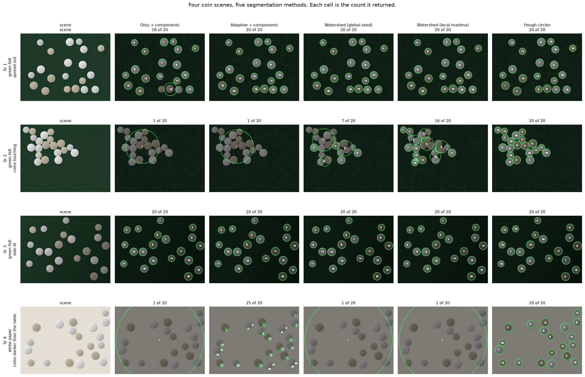
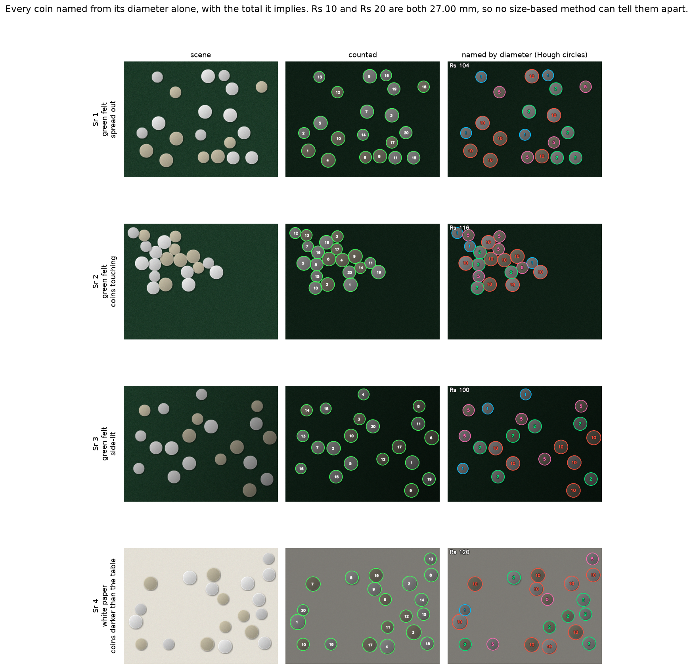
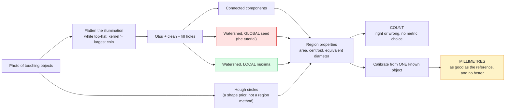

# 09 · Coin counting and measurement — classical computer vision

[](https://www.python.org/)
[](https://opencv.org/)
[](#)
[](#)

`skimage.data.coins` is the standard touching-objects image and counting it is
the standard watershed demo. The demo stops at "it found the coins". Two harder
questions follow: **how many does each method actually get right**, and **once
you have them, can you measure them in millimetres?**

Counting needs no metric choice — a count is right or wrong. Measuring needs one
known reference in the frame, and that is where the errors live.

**No neural network, no training, no GPU.**

---

## Results

### Counting — four conditions, five methods



| Sr | Scene | Otsu + components | Adaptive + components | Watershed (global seed) | Watershed (local maxima) | **Hough circles** |
|---:|---|---:|---:|---:|---:|---:|
| 1 | green felt · spread out | 18 of 20 | 20 of 20 | 20 of 20 | 20 of 20 | **20 of 20** |
| 2 | green felt · coins touching | **1 of 20** | **1 of 20** | 7 of 20 | 16 of 20 | **20 of 20** |
| 3 | green felt · side-lit | 20 of 20 | 20 of 20 | 20 of 20 | 20 of 20 | **20 of 20** |
| 4 | white paper · coins darker than the table | **1 of 20** | **25 of 20** | **1 of 20** | **1 of 20** | **20 of 20** |

**Row 1 is why a single-scene comparison is worthless here.** Spread the coins
out and four of five methods are perfect. Every conclusion below comes from the
rows where they are not.

**Row 2 is what watershed is for.** Touching coins are one connected component,
so both component methods collapse to **1 object**. No threshold fixes that.

**Row 4 inverts the polarity** — coins darker than the table — and it separates
the methods by *what they assume*. Three of them assume the coins are the bright
class and return 1. Adaptive thresholding returns **25 of 20**, over-counting by
fragmenting each coin. Hough circles is unaffected, because it never assumes a
polarity at all: it looks for round edges. **A shape prior survives a change
that destroys every intensity prior.**

### Naming them, which counting cannot do



| Calibration | Coins matched | Named right | Accuracy | True value | Read value | Value error |
|---|---:|---:|---:|---:|---:|---:|
| **Exact scale** (a ruler in the frame) | 236 | 148 | **62.7%** | ₹1789 | ₹1224 | **−31.6%** |
| Largest coin assumed 27 mm | 236 | 124 | 52.5% | ₹1789 | ₹1026 | −42.7% |

Even handed the *exact* millimetres-per-pixel, naming the coins is only 62.7%
right. The confusion matrix says why, and it is not the classifier's fault:

| True ↓ / read → | ₹1 | ₹2 | ₹5 | ₹10 | ₹20 |
|---|---:|---:|---:|---:|---:|
| **₹1** | 32 | 2 | 14 | 0 | 0 |
| **₹2** | 0 | 45 | 0 | 3 | 0 |
| **₹5** | 6 | 5 | 36 | 0 | 0 |
| **₹10** | 0 | 10 | 0 | 35 | 0 |
| **₹20** | 0 | 6 | 0 | **42** | **0** |

> **₹10 and ₹20 are both 27.00 mm.** Every ₹20 coin in the set — 42 of them — is
> read as a ₹10, and **not one is ever read correctly**. That is not a failure of
> the code. In the hand the two are told apart by the ₹20's twelve-sided edge,
> which a photograph of a flat disc does not record. **A diameter cannot separate
> them, and no amount of better measurement will.** It costs ₹420 of the ₹565
> shortfall on its own.

> **₹1 and ₹5 are 1.07 mm apart** — about 2.5 px at this framing. 20 of the
> remaining 40 errors are that pair, in both directions. This one *is* a
> measurement problem, and it would shrink with a closer camera.

So the honest answer to "how much money is on the table" is: the count is
reliable, the total is not. **Reporting a value without reporting which pairs
are indistinguishable would be the dishonest version of this project.**

### How the scenes were chosen

Twelve generated scenes across four *conditions* — spread, touching, side-lit,
light surface — with the best of each condition kept. Families are the condition
rather than the tablecloth, because four backgrounds are four variations of one
problem while these are four different problems.

```
scene candidate green felt · spread out                  keep — counts [18, 20, 20, 20, 20] of 20  [spread]
scene candidate slate · spread out                       keep — counts [19, 19, 20, 20, 20] of 20  [spread]
scene candidate navy cloth · spread out                  keep — counts [18, 20, 20, 20, 20] of 20  [spread]
scene candidate wood table · spread out                  keep — counts [18, 18, 20, 20, 20] of 20  [spread]
scene candidate green felt · coins touching              keep — counts [1, 1, 7, 16, 20] of 20  [touching]
scene candidate slate · coins touching                   keep — counts [1, 2, 1, 10, 20] of 20  [touching]
scene candidate wood table · coins touching              keep — counts [1, 8, 13, 19, 20] of 20  [touching]
scene candidate denim · coins touching                   keep — counts [1, 3, 1, 15, 20] of 20  [touching]
scene candidate green felt · side-lit                    keep — counts [20, 20, 20, 20, 20] of 20  [side-lit]
scene candidate wood table · side-lit, touching          keep — counts [1, 9, 7, 16, 20] of 20  [side-lit]
scene candidate white paper · coins darker than the table keep — counts [1, 25, 1, 1, 20] of 20  [light surface]
scene candidate marble · light surface, touching         keep — counts [2, 16, 2, 7, 16] of 20  [light surface]
```

**The gate asks whether a scene is solvable, not whether it is easy** — some
method has to be able to count it. An earlier version gated on the *median*
method and dropped every touching scene, leaving four rows of well-separated
coins and no result at all. A scene only one method can read is the opposite of
a broken sample; it is the entire finding.

> **Why these scenes are generated and `skimage.data.coins` is not enough.**
> That image is a scan of old Greek coins whose denominations nobody recorded,
> so a value reported against it could never be shown to be wrong. The mint
> publishes the diameter of every circulating Indian coin, so a generated scene
> knows the count, the millimetres **and** the denomination by construction. The
> real image is still used for everything that does not need a denomination.

---

> **The finding, in one sentence.** The watershed seeding rule in the OpenCV
> tutorial — threshold the distance transform at a fraction of its **global**
> maximum — counts **1 coin out of 24** when a lighting artefact merges part of
> the mask. Seeding from **local** maxima counts **24 out of 24** on the same
> broken mask. Repair the mask and *both* reach 24, which is the sharper
> statement: the tutorial's rule is not inaccurate, it is **entirely dependent
> on a clean mask**, and that dependency is invisible until the mask is not
> clean. The demo everyone copies uses the fragile one.

> **The finding that counting cannot reach.** Naming each coin from its
> diameter is **62.7%** right even when handed the exact scale — and **every one
> of the 42 twenty-rupee coins is misread**, because ₹10 and ₹20 are both
> 27.00 mm. A diameter cannot separate them at any resolution.

> **The second finding.** Three methods count exactly 24. Only **one** of them
> measures all 24 plausibly. Watershed's boundary can squeeze a basin to 136 px
> of a ~1500 px coin without changing the count — implying a **5.75 mm** coin
> next to a 24.25 mm reference. *Counting correctly is not evidence of
> segmenting correctly*, and the two need separate columns.

> **What the millimetres rest on.** Every measurement is one assumed reference
> diameter divided by one measured pixel width. A **10% error in the reference
> produces exactly 10% error in every diameter** — and the output stays perfectly
> self-consistent while being uniformly wrong, so nothing downstream can detect
> it.

**Jump to:** [What it does](#what-it-does) · 
[Results](#results) ·
[Run it](#run-it-yourself) · [Inference](#inference-count-your-own-photo) ·
[How it works](#how-it-works) · [Problems solved](#problems-hit-and-how-they-were-solved) ·
[Limitations](#limitations) · [Keywords](#keywords)

---

## What it does



Three things this separates that a segmentation demo runs together:

| Separated | Because |
|---|---|
| the **mask** from the **seeding** | They fail independently, and crossing them shows one seeding rule survives a broken mask and the other does not. |
| the **count** from the **measurement** | Several methods count 24; fewer produce 24 regions that could be coins. |
| the **pixels** from the **millimetres** | The pixel answer is measured. The millimetre answer is measured *times an assumption*. |

---


## Results

All numbers from `python run.py`, written to
[`results/results.json`](results/results.json) and
[`results/tables.md`](results/tables.md). Ground truth: **24 coins**, counted by
hand — the dataset ships no annotation, and this is the one hand-made number in
the project.

### Counting *and* measuring

| Method | Count | Error | Smallest (mm) | Largest (mm) | Diameter CV | Implausible | Time (ms) |
|---|---:|---:|---:|---:|---:|---:|---:|
| Otsu + components | 18 | **−6** | 6.76 | 24.25 | 0.4305 | 13 | **1.3** |
| Adaptive + components | **24** | **0** | 4.77 | 24.25 | 0.2501 | 2 | 1.8 |
| Watershed (global seed) | 23 | −1 | 7.74 | 24.25 | 0.1991 | 1 | 10.3 |
| Watershed (local maxima) | **24** | **0** | 5.75 | 24.25 | 0.2425 | 2 | 10.8 |
| **Hough circles** | **24** | **0** | **14.06** | 24.25 | **0.1758** | **0** | 2.7 |

**Three methods count exactly right. One measures.** Watershed and Hough both
return 24 objects; watershed's smallest region implies a 5.75 mm coin and
Hough's implies 14.06 mm. On a plate whose largest coin is 24.25 mm, one of those
is a coin and the other is a watershed boundary that squeezed a basin.

The shape prior is what does it. Hough fits *circles*, which makes it useless on
anything that is not round — and here that restriction is precisely why it cannot
produce a sliver. A region method has no such constraint and no such protection.

The naive baseline behaves exactly as predicted: `Otsu + components` counts 18,
because two touching coins are one connected component. No threshold fixes that,
which is the entire reason watershed exists.

### THE ABLATION — mask × seeding

| Seeding rule | Plain Otsu mask | Top-hat then Otsu |
|---|---:|---:|
| Global fraction of `dist.max()` (the tutorial) | **1** | 23 |
| Local maxima of the distance transform | **24** | **24** |

Read the left column. With the same broken mask, one rule counts 1 and the other
counts all 24.

The reason is in what each rule compares against. `cv2.threshold(dist, 0.55 *
dist.max(), ...)` measures every pixel against **one number taken from the single
deepest point in the whole image**. That is a sensible seed rule only if every
object is about the same size *and* already separated. Merge part of the mask —
which an uneven background is enough to do — and the merged blob's deep interior
sets a threshold that erases every other coin's local peak.

Local-maxima seeding has no global quantity in it at all. A coin's seed depends
on that coin's neighbourhood, so nothing happening elsewhere in the image can
suppress it.

Fix the mask and the tutorial rule reaches **24 of 24** as well. That is the
sharper version of the finding, not a weaker one: the two rules are equally
*accurate* and not remotely equally *robust*. One needs a clean mask and the
other does not, and nothing in a demo that only ever runs on a clean mask will
ever show you the difference.

> This number was **23** until the top-hat kernel was sized from the image
> instead of hard-coded at 61 px. The old 23 was an artefact of a starved
> kernel eating part of a coin, not a property of the seeding rule. It is
> corrected here rather than left standing because it was the more flattering
> number.

### The tutorial's knob, swept

| `fg_ratio` | Global seed count | Error | Local maxima count |
|---:|---:|---:|---:|
| 0.30 | 25 | +1 | **24** |
| 0.40 | **24** | **0** | **24** |
| 0.50 | 23 | −1 | **24** |
| 0.55 | 23 | −1 | **24** |
| 0.60 | 22 | −2 | **24** |
| 0.70 | 16 | −8 | **24** |
| 0.80 | 7 | −17 | **24** |

There *is* a value that works — 0.40, on this image, with this mask. That is what
makes the knob dangerous rather than merely imperfect: it can be tuned to look
correct, and the tuning does not transfer, because the quantity being thresholded
depends on the largest blob in whatever image you hand it next.

The local-maxima column is flat because there is no such knob to set. That
flatness *is* the result.

### Calibration: what a wrong reference costs

| Reference error | Assumed reference (mm) | Mean measured (mm) | Measured error |
|---:|---:|---:|---:|
| **−10%** | 21.82 | 15.742 | **−10.000%** |
| −5% | 23.04 | 16.617 | −5.000% |
| −2% | 23.77 | 17.142 | −2.000% |
| 0% | 24.25 | 17.492 | 0.000% |
| +2% | 24.73 | 17.841 | +2.000% |
| +5% | 25.46 | 18.366 | +5.000% |
| **+10%** | 26.68 | 19.241 | **+10.000%** |

Exactly 1:1, which is not surprising — it is one multiplication — but the
consequence is worth stating plainly: **nothing in the output can reveal a
calibration error.** Every coin stays in correct proportion to every other coin.
The table is internally consistent, plausible, and uniformly wrong.

The uncertainty on every millimetre this project prints is the uncertainty on the
reference, and that number is an *assumption*, not a measurement.

---

## Run it yourself

```bash
git clone https://github.com/hammas159/classical-computer-vision.git
cd classical-computer-vision/projects/09_coin_counting
```

```bash
pip install -r ../../requirements.txt

python run.py                 # regenerate every number and figure (~30 s)
pytest ../..                  # 23 tests for this project, 242 for the repo
```

`run.py` rewrites `results/results.json` and `results/tables.md`. **Every number
in this README is copied from those files rather than typed.**

---

## Inference: count your own photo

```bash
python infer.py my_coins.jpg
python infer.py my_coins.jpg --reference-mm 24.25 --csv coins.csv
python infer.py my_coins.jpg --method "Hough circles" --out labelled.png
python infer.py my_coins.jpg --all-methods
python infer.py my_coins.jpg --no-flatten        # skip the illumination top-hat
```

Typical output:

```
input     : my_coins.jpg  1400x1050
reference : largest object assumed to be 24.25 mm
method    : Hough circles   4.1 ms
found     : 11 objects
scale     : 0.09014 mm/px
diameters : 16.12 - 24.25 mm, mean 20.44, CV 0.142
wrote     : labelled.png
wrote     : coins.csv

note  : every region is a plausible size, so the segmentation and the count
        agree with each other. That is necessary, not sufficient -- it does
        not check that the count is right, only that nothing is a fragment.

note  : every millimetre above is 24.25 mm divided by 269.0 px.
        Calibration error propagates 1:1 -- a 5% mistake in --reference-mm is a
        5% mistake in all of them, and nothing in the output can reveal it,
        because the numbers stay perfectly consistent with each other.
```

Two things it deliberately does **not** claim:

* **No count error.** Your photo has no ground truth. The count is reported, not
  scored.
* **No confidence on the millimetres.** They are reported with the arithmetic
  that produced them (`24.25 mm ÷ 269.0 px`) so the assumption is visible in the
  output rather than buried in a flag.

What it *does* give you without any annotation is the **implausible-region
count** — regions measuring under 45% of the reference, which cannot be objects
and are therefore broken segmentations. `--all-methods` prints it for every
method, and a method with the same count as the others but a non-zero figure
there segmented worse, not differently.

---

## How it works

### 1 · Flatten the illumination

The plate is lit unevenly. A white top-hat is `image − opening(image)`; opening
with a structuring element **larger than any coin** erases the coins and leaves
the illumination, so subtracting it leaves the coins on a flat background.

The kernel size is the one thing that matters here — below the largest coin, the
opening keeps the coin and the top-hat subtracts it away, leaving only its rim.
Measured: foreground area drops from 32% of the frame to 21% as the kernel falls
from 61 px to 15 px.

### 2 · Threshold, clean, fill

Otsu, then open (speckle), close (rejoin fragments), then fill every enclosed
hole by redrawing the outer contours solid. The fill is not cosmetic: a hole
inside a coin puts a spurious local maximum in the distance transform, which
becomes a spurious seed, which becomes a spurious coin.

### 3 · Seed from local maxima

```python
dilated = cv2.dilate(dist, np.ones((k, k), np.float32))
peaks = (dist >= dilated - 1e-6) & (dist >= min_radius_px)
```

A pixel is a seed if dilating its neighbourhood does not raise it — i.e. it is
the maximum of its own disc. `min_radius_px` is a floor in the same units as the
answer, because the distance transform's value at a coin's centre **is** that
coin's radius.

### 4 · Flood, then measure

`cv2.watershed` floods from the seeds. Equivalent diameter — the diameter of a
circle with the same area — is used rather than a bounding box, because it is far
more stable for a roughly round object. One known reference sets `mm/px`, and
every other object is scaled by it.

---

## Problems hit, and how they were solved

Every entry is a real defect in this project's own code, with the symptom that
exposed it and the measurement that confirmed the fix.

### 1 · Watershed counted 1 coin, at every setting

**Symptom.** The method that exists to separate touching objects returned **1**
object, and swept across seven values of its seed ratio it returned 1, 1, 1, 1, 1
— with 13 and 4 at the two lowest. No error, no warning.

**Cause.** Two independent bugs compounding, which is why it took a 2×2 ablation
to separate them.

*First*, the mask. `skimage.data.coins` is lit unevenly, and the background at
the top of the frame is **brighter than Otsu's global threshold**. A band of
empty table was classified as foreground and merged with the entire top row:
**one component of 13,433 px** where there should have been six coins.

*Second*, the seed rule — the one from the OpenCV tutorial:

```python
_, sure_fg = cv2.threshold(dist, fg_ratio * dist.max(), 255, 0)
```

`dist.max()` is the single deepest point in the whole image. With a 13,433 px
blob in the picture, `0.55 × dist.max()` is deeper than any real coin's centre,
so every other coin's local peak was erased and one seed survived.

**Fix** — [`src/coins.py:93`](src/coins.py#L93) for the mask and
[`src/coins.py:176`](src/coins.py#L176) for the seeds:

```python
return cv2.morphologyEx(gray, cv2.MORPH_TOPHAT, se)   # flatten the illumination
```

```python
peaks = ((dist >= dilated - 1e-6) & (dist >= min_radius_px)).astype(np.uint8) * 255
```

**Result: 1 → 24 of 24.** And the ablation showed the two fixes are *not*
interchangeable — local-maxima seeding reaches 24 even on the unfixed mask,
while the tutorial rule needs the mask repaired first. That comparison became
the project's headline, and it only exists because the two fixes were tested
separately instead of together.

### 2 · A round-number area filter threw away two correct answers

**Symptom.** With the seeding fixed, watershed produced **exactly 24 labels** —
one per coin, verified by eye — and `count_coins` reported **22**.

**Cause.** `region_properties(labels, min_area=250)`. Two of the 24 basins were
136 px and 247 px, both under a cutoff that had been chosen to be "obviously
small". The segmentation had already got the answer right and the filter threw it
away.

**Fix** — [`src/coins.py:248`](src/coins.py#L248) — derive the floor from a
quantity that means something:

```python
MIN_COIN_RADIUS_PX = 6.0
MIN_COIN_AREA_PX = int(np.pi * MIN_COIN_RADIUS_PX**2)  # 113
```

**Result: 22 → 24.** Pinned by `test_the_area_floor_must_not_discard_real_regions`,
which asserts that the label image contains exactly 24 regions *and* that a
`min_area` of 250 loses some of them — so the bug cannot come back as a
"cleanup".

### 3 · The top-hat fixed the background and broke the coins

**Symptom.** After flattening the illumination, the count went from 25 to **21**.
The mask images showed the background band gone — and several coins now broken
into two or three pieces.

**Cause.** Flattening costs contrast *inside* the darker coins, so their
thresholded masks came back fragmented. Each fragment is a region, each region is
either a coin or discarded, and either way the count is wrong.

**Fix** — [`src/coins.py:45`](src/coins.py#L45) and
[`src/coins.py:59`](src/coins.py#L59) — a larger elliptical closing to rejoin the
pieces, then fill every enclosed hole by redrawing the outer contours solid:

```python
contours, _ = cv2.findContours(mask, cv2.RETR_EXTERNAL, cv2.CHAIN_APPROX_SIMPLE)
```

**Result: 21 → 24.** The hole filling matters for a second reason — a hole inside
a coin is a spurious local maximum in the distance transform, and with
local-maxima seeding that is a spurious coin.

### 4 · Watershed flooded the background and labelled it

**Symptom.** Region areas included a 13,000 px "object" that was clearly the
table.

**Cause.** `cv2.watershed` partitions the *entire image*. Every pixel gets a
label, including the background basin, and nothing in the returned marker image
distinguishes "coin #7" from "the table".

**Fix** — [`src/coins.py:194`](src/coins.py#L194), one line:

```python
labels[mask == 0] = 0
```

Obvious in hindsight, and the kind of thing that produces a plausible-looking
count for a long time before anyone checks the areas.

### 5 · Two tests asserted arithmetic I had not done

**Symptom.**

```
assert np.uint64(896835) > (3.0 * np.uint64(336600))
assert (29 - 1) > (2 * (21 - 1))
```

**Cause.** In the first, I asserted a filled disc would be more than 3× its own
6 px rim. A radius-30 circle has area 2827 px and a 6 px rim has ~1131 px, so the
true ratio is 2.5. In the second I asserted a too-small top-hat kernel would more
than double the component count; it goes from 20 to 28, because the closing
partially repairs the rings.

**Fix.** The first now asserts the ratio the geometry actually gives *and* that
the filled area matches `π r²`. The second asserts the thing that is genuinely
broken — **foreground area falls from 32% to 21%**, because the kernel is
subtracting the coins' own interiors — rather than a proxy I had guessed at.

Both are the same mistake: asserting a number I expected instead of one I had
measured. It is cheap to catch here and expensive to catch in a README.

---

## Limitations

* **One image, and a hand-counted truth.** 24 is counted by eye from the plate.
  Every count error in this project is measured against a number no dataset
  supplied, and it is flagged as such in the source rather than presented as an
  annotation.
* **The reference diameter is an assumption.** 24.25 mm for the largest coin is a
  plausible value for a Roman denarius, not a measurement of *this* coin. Every
  millimetre inherits it; see the calibration table for exactly how much.
* **Hough wins by knowing the answer.** It is told the objects are circles, and
  they are. On bolts, leaves, cells or grains it would find nothing, and the
  region methods — which look worse here — would be the only option. The
  comparison is honest about the score and should not be read as a general
  recommendation.
* **`min_radius_px` has no effect on this image.** Swept from 4 to 14 the count
  does not move, because the local maxima are isolated points well above any of
  those floors. It is in the signature because it is the right *kind* of
  parameter, not because it was tuned.
* **No overlapping objects.** Coins that *occlude* each other, rather than merely
  touching, have no distance-transform peak each, and nothing here would separate
  them.

---

## Keywords

coin counting, object counting, touching objects, watershed segmentation,
distance transform, local maxima seeding, marker-controlled watershed, connected
components, Otsu thresholding, adaptive thresholding, morphological top-hat,
illumination correction, background flattening, hole filling, Hough circle
transform, shape prior, equivalent diameter, region properties, pixel to
millimetre calibration, reference object, measurement error propagation,
scikit-image coins, classical computer vision, OpenCV, Python, no deep learning,
CPU only, counting without neural networks

---

## See also

* [`PROJECT.md`](PROJECT.md) — the complete workflow: build order, every decision
  and what it cost.
* [Project 05 · Old photo restoration](../05_old_photo_restoration) — uses the
  same top-hat operator to find scratches, for the same reason: it selects by
  size.
* [Project 32 · Hough transforms](../32_hough_transforms) — the shape prior used
  on its own terms.
* [Project 24 · Region segmentation](../24_region_segmentation) — watershed
  against the region-growing alternatives.
* [Repo index](../../README.md)
