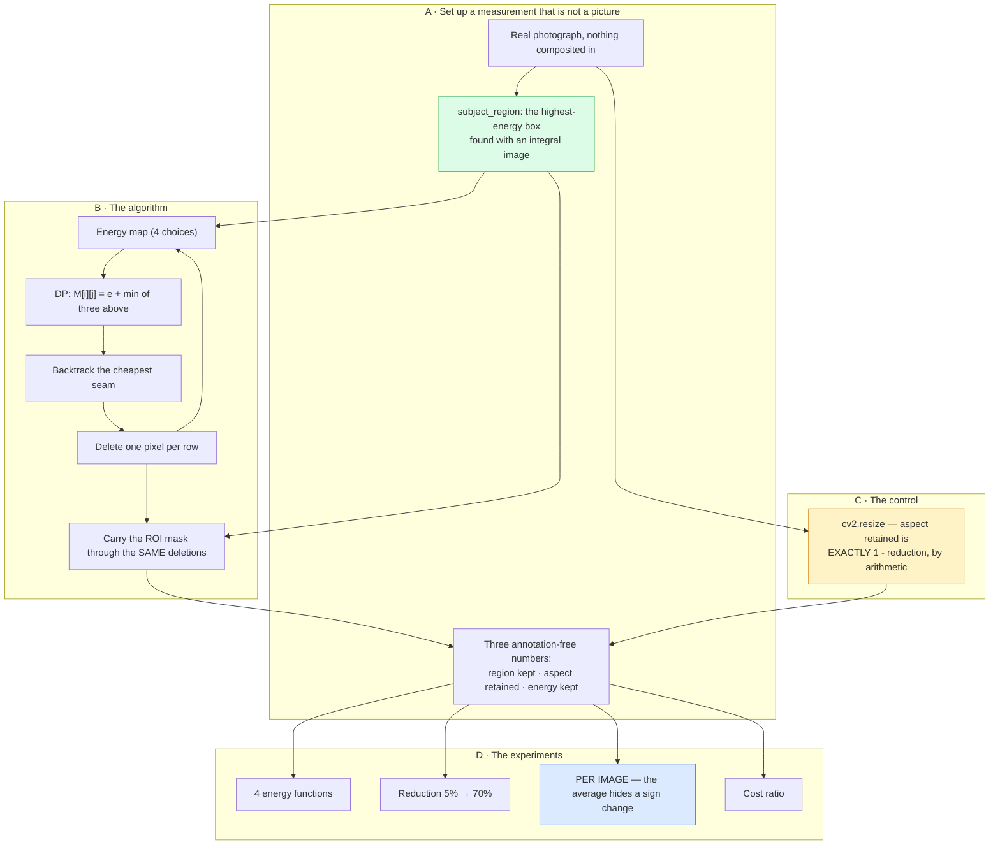

# Project 10 — Seam carving: complete workflow

The [README](README.md) states the findings. This states how they were reached,
in what order, and what each decision cost.

---

## 1 · Why this question, and not "implement seam carving"

Seam carving is a lovely algorithm and implementing it is a solved exercise. The
demo that follows is always the same: a picture of a beach, a picture of the same
beach narrower, and the observation that the people did not get squashed. It is
convincing and it establishes nothing, because the comparison it invites — against
a squashed version — is one seam carving cannot lose.

Three questions the demo does not answer:

> **How much better than `cv2.resize` is it, and what does that cost?**

A ratio, not a picture. This turns out to be **11.6 points for 2,844×**, which is
a sentence a reader can act on.

> **Does the energy function matter?**

Every extension paper proposes a new one. Measured, the four here span 0.5 points
while the gap to not carving at all is 11.6 — so the axis the literature works on
is 23× smaller than the axis it does not.

> **Does it win what it optimises, or what you want?**

These are different, and the difference is the most interesting thing in the
project. Seam carving optimises *retained gradient energy*. What you want is the
picture to look right. It wins the first on 4 images of 4 and the second on 3.

---

## 2 · The complete workflow



**The green box and the amber box are what make the numbers mean anything**, and
the blue box is what stops them being reported dishonestly.

---

## 3 · Build order

| Step | What | Why here |
|---:|---|---|
| 1 | The DP, backtracking, seam removal | The algorithm. Straightforward. |
| 2 | Four energy functions | The axis the literature works on. |
| 3 | A synthetic scene to score against | A pasted square to preserve, a pasted line to bend. |
| 4 | **Score it — and get a negative result** | Carving *lost* to a plain rescale, 68% against 75.8%. |
| 5 | Diagnose | The square was uniform, so a gradient energy could not see it. The line was the highest-energy thing in frame, so seams avoided it perfectly (0.22 px of bend). The scene tested nothing. |
| 6 | **Replace the scene with a real region** | Highest-energy box, found from the image, nothing pasted. |
| 7 | Profile | 3.7 s per carve. DP 17.9 ms of the 24 ms per seam. |
| 8 | Optimise the DP | Preallocate, `np.minimum(out=)`, comparisons instead of argmin. 3.5×. |
| 9 | **Benchmark the "obvious" `remove_seam` rewrite — and reject it** | `take_along_axis` is 60% *slower* than boolean masking. |
| 10 | Fix the energy column | Every method had been scored on its own objective. |
| 11 | Reduction sweep | Where it degrades. |
| 12 | **Per-image breakdown** | Added after the aggregate looked too clean. It contains a sign change. |
| 13 | Cost ratio table | The number the project is for. |
| 14 | UI, figures, docs, `infer.py` | — |

Steps 4–6 and step 12 are the honest part. The first negative result was a
property of my scene, not of the algorithm — and the temptation to report "seam
carving is worse than resizing" as a finding was real, because a surprising
result feels like a good one. Step 12 went the other way: the aggregate said
carving wins cleanly, and breaking it down found an image where it does not.

---

## 4 · Decisions, with reasoning

### Why nothing is pasted into the photograph

Because the first version was, and both pasted things measured the wrong thing in
opposite directions.

A **solid red square** has zero gradient inside it. A gradient energy is
structurally blind to it, so seams ran through the middle and the "object
preservation" metric recorded that seam carving does not protect regions it
cannot see. True, and nothing to do with resizing.

A **bright green line** was the single highest-energy feature in every frame.
Seams avoided it completely: 0.22 px of measured bend, against 0.0 for a plain
rescale. A metric where the interesting method scores 0.22 and the trivial one
scores 0.00 is not measuring bend, it is measuring nothing.

The replacement — the highest-energy box of a fixed area, located exactly with an
integral image — is the subject *in the sense the algorithm itself means*. That
makes the test fair to seam carving rather than rigged against it, and it is the
only definition available that needs no human annotation.

It is also a stated limitation: on a photograph with a smooth subject against a
textured background, this metric would track the background. The metric and the
algorithm share an assumption, and where that assumption is wrong they are wrong
together.

### Why the control is `cv2.resize` and why that matters

A control is worth more when you cannot argue with it. A plain rescale keeps
every region pixel in proportion and squashes the aspect ratio by exactly
`1 − reduction` — 0.8002 at 20%, 0.5493 at 45%, 0.2996 at 70%. Those are not
measurements, they are arithmetic, and every one of them appears in the results
table where it can be checked by hand.

Comparing against a second sophisticated method would have produced a more
interesting-looking table and a less trustworthy one.

### Why retained energy is measured with one fixed energy function

Because measuring it with each method's own function made the Laplacian row read
0.9785 against everyone else's 0.939 — which says only that Laplacian energy
survives Laplacian-guided carving. A method marking its own homework, and the one
number in the table that could not be compared across rows.

With a single fixed reference the four rows land within 0.008 of each other,
which is consistent with every other column and makes "the energy function barely
matters" a supported claim instead of one contradicted by its own table.

### Why the per-image breakdown exists

The aggregate is +11.6 points, cleanly in carving's favour. The four images
individually are **−1.0, +12.4, +14.9, +20.0**.

A single averaged row would have reported a clean win and concealed that there is
a regime — subject fills the frame, no low-energy paths to route around — where
the method is worse than doing nothing clever, at a thousand times the cost.
Knowing that regime exists is more actionable than knowing the average.

### Why the rejected optimisation is written down

`remove_seam`'s per-row Python loop is the obvious thing to vectorise, and
`np.take_along_axis` with an index array is the obvious way. It is **60%
slower** than a boolean mask (5.9 ms vs 3.7 ms), because the index array is four
bytes per kept pixel against the mask's one.

That is a more useful thing to record than a successful optimisation, because the
next person to look at this function will have the same idea. The benchmark is in
the docstring so they do not have to re-run it.

### Why the UI downscales, and says so

Carving is one sequential dynamic programme per removed column, and the row loop
cannot be vectorised. At full resolution a slider move costs seconds. The app
works at 420 px and prints a caption saying so — because that constraint *is* the
project's main practical finding, and hiding it in a silent resize would be
hiding the result.

### Why the verdict text refuses to accept a good energy score

`infer.py` reports retained gradient energy, which is the only reference-free
quality number available for an image the user supplied. It would be easy to let
a high number read as success.

Measured, that number is positive on 4 images of 4 while the metric you actually
care about is positive on 3. So the tool says explicitly that a good score there
is *necessary and not sufficient*, and tells the reader to look at the picture. A
tool that overstates its own confidence is worse than one that is slow.

---

## 5 · What each stage costs

Per removed seam, on a 400 × 600 image, before and after the optimisation pass:

| Stage | Before | After |
|---|---:|---:|
| Energy map | 1.6 ms | 1.6 ms |
| **Cumulative energy (DP)** | **17.9 ms** | **5.1 ms** |
| Seam removal | 4.3 ms | 3.7 ms |
| **One carve (25%, 150 seams)** | **3.7 s** | **2.0 s** |

And the comparison the project is about, at 20% reduction over four images:

| Method | Time |
|---|---:|
| Plain rescale | **0.42 ms** |
| Seam carving | **1194 ms** |
| **Ratio** | **2,844×** |
| **Full `run.py`** | **~4 min** |

The DP is still three-quarters of the remaining cost and cannot be reduced
further without changing the algorithm — the row loop is a genuine sequential
dependency, and that is a property of the method, not of this implementation.

---

## 6 · Reproducing it

```bash
python run.py                     # regenerates every number and figure
python run.py --reduction 0.45    # the whole study at a harder reduction
streamlit run ui/app.py           # the interactive app
python infer.py photo.jpg         # your own image
pytest ../..                      # 19 tests here, 262 across the repo
```

`run.py` rewrites `results/results.json` and `results/tables.md`; the README's
numbers are copied from those files rather than typed.

Six of the 19 tests pin a *finding* rather than a number — the 23× ratio between
the two decisions, carving winning its own objective more reliably than the
perceptual one, the per-image sign change, the cost ratio, the control being
exactly `1 − reduction`. A refactor that quietly reverses one of the project's
conclusions fails the suite instead of silently rewriting the README.

---

## 7 · What would come next

* **Forward energy** (Rubinstein, Shamir & Avidan 2008). Choose seams by the
  energy their *removal introduces* rather than the energy they contain. It fixes
  most of the bent-edge artefacts in the extreme-reduction gallery and is the
  single most worthwhile thing missing here — and it would let the reduction
  sweep ask a sharper question, because the current one degrades for a reason the
  method has a known answer to.
* **Horizontal seams and the optimal order.** Reducing both dimensions optimally
  is a second dynamic programme over the *sequence* of removals. The greedy
  alternate-axes version is much easier and measurably worse, which would make a
  clean comparison.
* **Seam insertion.** The other half of the paper. The naive version duplicates
  the same cheap seam repeatedly and produces a stretched band — a failure with a
  nice visual and a known fix (insert the *k* cheapest seams from one pass).
* **A subject definition that is not the energy.** Every number here uses the
  algorithm's own notion of "interesting". Scoring against a saliency model, or a
  hand-drawn box, would test whether the method protects what a *person* cares
  about — which is the claim the paper's figures actually make.
* **Why 5% of images lose.** One of four here. Characterising that regime
  — probably some ratio of subject area to frame area — would turn "sometimes it
  is worse" into a rule for when to bother.
