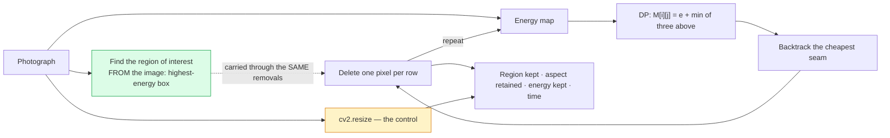

# 10 · Seam carving — classical computer vision

[](https://www.python.org/)
[](https://opencv.org/)
[](#)
[](#)

Seam carving (Avidan & Shamir, 2007) resizes an image by repeatedly deleting the
lowest-energy connected path of pixels, so a narrower image loses *boring* pixels
instead of squashing everything equally. It is a genuinely elegant dynamic
programme.

The question this project asks is the one the elegance tends to postpone: **how
much better than `cv2.resize` is it, and what does that cost?**

**No neural network, no training, no GPU, no dataset download.**

> **The finding, in one sentence.** Seam carving retains **11.6 percentage points**
> more of an image's high-energy region than a plain rescale, for **2,844× the
> compute**. Whether that trade is worth taking is a real question, and the
> literature mostly shows the pictures rather than the ratio.

> **The choice that is argued about is not the choice that matters.** Four energy
> functions — the paper's `|dx|+|dy|`, true Sobel magnitude, Laplacian, local
> standard deviation — span **0.5 points** of region retention. The gap between
> carving and not carving is **11.6**. The one-line decision write-ups agonise
> over is **23× smaller** than the one they do not discuss.

> **It wins its own objective more reliably than yours.** Retained gradient
> energy is what seam carving optimises; region retention is what you want. Over
> four photographs it wins the energy column **4/4** and the region column
> **3/4** — on `coffee` it retains **79.0%** against a plain rescale's **80.0%**.
> The subject fills the frame, so there is nowhere to route around.

**Jump to:** [What it does](#what-it-does) · 
[Results](#results) ·
[Run it](#run-it-yourself) · [Inference](#inference-resize-your-own-image) ·
[How it works](#how-it-works) · [Problems solved](#problems-hit-and-how-they-were-solved) ·
[Limitations](#limitations) · [Keywords](#keywords)

---

## What it does



Two design choices carry the measurement:

**Nothing is pasted into the photograph (green).** The region being tracked is
found *from* the image — the box of a fixed area holding the most energy, located
exactly with an integral image. That is "the subject" in precisely the sense the
algorithm means, which makes it the fair thing to ask seam carving to protect.
See [Problems hit](#problems-hit-and-how-they-were-solved) for what the synthetic
scene this replaced was actually measuring.

**The control is arithmetic, not a measurement (amber).** A plain rescale keeps
every region pixel in proportion and squashes the aspect ratio by exactly
`1 − reduction`. At 20% it lands on 0.8002 — you can check it by hand. A control
you cannot argue with is worth more than a second sophisticated method.

---


## Results

All numbers from `python run.py`, written to
[`results/results.json`](results/results.json) and
[`results/tables.md`](results/tables.md). Four images, 20% width reduction unless
stated.

### The energy function barely matters

| Energy | Region kept | Aspect retained | Energy kept | Time (ms) |
|---|---:|---:|---:|---:|
| Gradient `\|dx\|+\|dy\|` (the paper) | 0.9158 | 0.9344 | 0.9488 | 1364 |
| Sobel magnitude | 0.9148 | 0.9341 | 0.9490 | 1308 |
| **Laplacian** | **0.9199** | **0.9375** | **0.9567** | **1160** |
| Local std (entropy-like) | 0.9187 | 0.9328 | 0.9503 | 1314 |
| **Plain rescale (control)** | **0.8002** | **0.8002** | **0.7938** | **0.4** |

Spread across four energies: **0.0051** (0.5 points).
Gap to the control: **0.1197** (12.0 points).
**Ratio: 23×.**

The energy function is the part of seam carving that gets discussed — it is where
every extension paper goes. Measured here it is the smallest decision in the
pipeline. The largest is whether to do this at all.

### Per image — and the average hides a sign change

| Image | Carved: region kept | Rescale: region kept | Advantage | Carved: energy | Rescale: energy |
|---|---:|---:|---:|---:|---:|
| **coffee** | 0.7896 | 0.8000 | **−0.0104** | 0.9342 | 0.7795 |
| rocket | 0.9245 | 0.8008 | +0.1237 | 0.9740 | 0.7469 |
| chelsea | **1.0000** | 0.8000 | **+0.2000** | 0.9315 | 0.8086 |
| astronaut | 0.9492 | 0.8000 | +0.1492 | 0.9554 | 0.8401 |

The advantage ranges from **−1.0 to +20.0 points**. The average, +11.6, describes
none of the four.

On `coffee` the high-energy region spans most of the frame, so there are no
low-energy paths to route around it and every seam crosses something — seam
carving is worse than doing nothing clever, at a thousand times the cost.

**And yet the energy column is positive on all four.** That is the honest summary
of the method: it reliably achieves what it optimises and unreliably achieves
what you wanted.

### How far it holds up

| Reduction | Carved: region | Rescale: region | Carved: aspect | Rescale: aspect | Carved: energy | Rescale: energy |
|---:|---:|---:|---:|---:|---:|---:|
| 5% | 0.9854 | 0.9499 | 0.9917 | 0.9499 | 0.9897 | 0.9115 |
| 10% | 0.9660 | 0.9000 | 0.9760 | 0.9000 | 0.9778 | 0.8724 |
| 20% | 0.9158 | 0.8002 | 0.9344 | 0.8002 | 0.9488 | 0.7938 |
| 30% | 0.8640 | 0.6988 | 0.8891 | 0.6988 | 0.9078 | 0.7113 |
| 45% | 0.7444 | 0.5493 | 0.7916 | 0.5493 | 0.8279 | 0.5859 |
| 60% | 0.5995 | 0.4006 | 0.6600 | 0.4006 | 0.7165 | 0.4579 |
| 70% | 0.4831 | 0.2996 | 0.5509 | 0.2996 | 0.6170 | 0.3715 |

Carving stays ahead the whole way — it never crosses below the rescale on
average. But look at the *shape* of the two advantages at 70%:

* Retained **energy**: 61.7% vs 37.1% — a **1.66×** advantage.
* Retained **region**: 48.3% vs 30.0% — a **1.61×** advantage.

…and at 20% they were 1.20× and 1.14×. The advantage that grows fastest is the
one on the algorithm's own objective. It is increasingly good at keeping gradient
energy, and that increasingly stops meaning the picture is intact — the
[extreme-reduction gallery](#past-the-point-where-it-works) is what 70% actually
looks like.

The **rescale aspect column is exactly `1 − reduction`** at every row, which is
what makes it a control you cannot argue with.

### What the advantage costs

| Method | Region kept | Aspect retained | Energy kept | Time (ms) |
|---|---:|---:|---:|---:|
| Seam carving | 0.9158 | 0.9344 | 0.9488 | **1194.39** |
| Plain rescale | 0.8002 | 0.8002 | 0.7938 | **0.42** |
| **Difference** | **+0.1156** | **+0.1342** | **+0.1550** | **2,844×** |

Seam carving is `n` sequential dynamic programmes for `n` removed columns, and
each walks the image row by row — the row loop **cannot** be vectorised, because
row `i` needs row `i−1`. A plain rescale is one interpolation pass.

That is why content-aware resizing is a feature you invoke rather than a default,
and the ratio is the number that decides it.

---

## Run it yourself

```bash
git clone https://github.com/hammas159/classical-computer-vision.git
cd classical-computer-vision/projects/10_seam_carving
```

```bash
pip install -r ../../requirements.txt

python run.py                     # regenerate every number and figure (~4 min)
python run.py --reduction 0.45    # rerun the whole study harder
pytest ../..                      # 19 tests for this project, 262 for the repo
```

`run.py` rewrites `results/results.json` and `results/tables.md`. **Every number
in this README is copied from those files rather than typed.**

---

## Inference: resize your own image

```bash
python infer.py photo.jpg --width 800
python infer.py photo.jpg --reduction 0.25 --compare      # also write the rescale
python infer.py photo.jpg --seams seams.png               # draw what will be removed
python infer.py photo.jpg --energy "Laplacian"
```

Typical output:

```
input   : photo.jpg  1600x1067  (working at 900x600)
target  : 720px  (20.0% narrower)
energy  : Gradient |dx|+|dy|

carved  : 2841 ms   energy kept 94.9%
rescale : 0.83 ms   energy kept 79.1%
cost    : 3411x a plain resize
wrote   : carved.png

verdict : carving retained +15.8 points more of the image's gradient energy.
          Note this is seam carving's OWN objective, not a perceptual score --
          measured on the sample set it wins this column on 4 images out of 4 and
          the region-retention column on only 3, so a good number here is
          necessary and not sufficient. Look at the picture.
```

Three things it deliberately does:

* **Prints the cost ratio every time.** Not as a footnote — it is the number that
  decides whether you should have run it.
* **Refuses to let a good energy number stand as a verdict.** The tool wins its
  own objective on every image tested and the useful one on three of four, so it
  says explicitly that a good score there is necessary and not sufficient.
* **Warns past 45% reduction**, where the method's advantage stops being about
  *avoiding* distortion and starts being about *concentrating* it into bent
  edges.

`--reduction` above 0.45 prints that warning; `--seams` writes the overlay so you
can see where the algorithm intends to cut before committing to it.

---

## How it works

### The dynamic programme

```
M[i][j] = e[i][j] + min( M[i-1][j-1], M[i-1][j], M[i-1][j+1] )
```

Fill `M` top to bottom, take the cheapest entry in the last row, and backtrack.
The seam is *connected* — adjacent rows differ by at most one column — which is
what stops it from being a per-row minimum and what makes the result look like a
path rather than a shred.

### The region of interest

```python
integral = cv2.integral(e.astype(np.float64))
sums = integral[bh:, bw:] - integral[:-bh, bw:] - integral[bh:, :-bw] + integral[:-bh, :-bw]
```

Every candidate box of a fixed size, scored in one shot with an integral image,
and the best one taken. No sliding window loop, no approximation, no annotation —
and nothing composited into the photograph.

### Tracking

The mask goes through the **identical** seam removals as the image, so what
survives in it is exactly the part of the region the resize kept. That is what
makes "how much of the subject survived" a measurement rather than an impression.

---

## Problems hit, and how they were solved

Every entry is a real defect in this project's own code, with the symptom that
exposed it and the measurement that confirmed the fix.

### 1 · The test scene measured something seam carving is structurally blind to

**Symptom.** Seam carving preserved **68%** of the tracked object while a plain
rescale preserved **75.8%**. Carving was *losing* to a resize on the metric the
project existed to measure, and it was losing everywhere.

**Cause.** The scene was synthetic: a solid red square and a bright green line
composited into each photograph. Both were the wrong test, for opposite reasons.

* The square was **uniform**. A gradient energy is zero inside a flat region, so
  the algorithm could not see the object at all and seams ran straight through
  the middle of it. The experiment was asking whether seam carving protects a
  region it is structurally blind to.
* The line was the **highest-energy thing in the frame**, so seams avoided it
  perfectly. Measured bend: 0.22 px against 0.0 for a plain rescale. Neither
  number distinguishes anything.

**Fix** — [`src/seam_carving.py:223`](src/seam_carving.py#L223). Nothing is
pasted in. The region of interest is found *from* the real photograph — the
fixed-size box holding the most energy, located exactly with an integral image:

```python
def subject_region(img, energy_fn=energy_gradient, frac: float = 0.16):
```

**Result:** carving 91.6% against a rescale's 80.0% — a measurement of the method
rather than of the scene. Pinned by
`test_a_uniform_region_would_be_invisible_to_a_gradient_energy`, which asserts a
flat patch has zero gradient in its interior, so nobody re-adds one.

### 2 · A single carve took 3.7 seconds

**Symptom.** Unusable in a UI, and the full experiment set took minutes.

**Cause.** Profiled per seam: energy 1.6 ms, **DP 17.9 ms**, remove 4.3 ms. At
150 removed columns that is 3.6 s, and the DP was three-quarters of it. The row
loop is inherently sequential — row `i` needs row `i−1` — so the only thing that
can be optimised is the per-row constant, and it was allocating four temporaries
per row (`np.roll` twice, `np.stack`, then an `argmin` plus a fancy index).

**Fix** — [`src/seam_carving.py:126`](src/seam_carving.py#L126). Allocate every
buffer once, outside the loop, and replace stack+argmin+fancy-index with a chain
of `np.minimum(..., out=)` plus comparisons:

```python
left = np.empty(w, np.float32)
```

**Result: DP 17.9 ms → 5.1 ms**, a 3.5× speed-up on the dominant cost, and a
carve from 3.7 s to 2.0 s.

### 3 · The "obviously faster" seam removal was slower

**Symptom.** Having fixed the DP, I rewrote `remove_seam`'s per-row Python loop
as `np.take_along_axis` with an index array — the version that looks like the
right answer. It came out **slower**: 5.9 ms against the boolean mask's 3.7 ms.

**Cause.** The index array is `h × (w−1)` int32 — four bytes per kept pixel —
against a one-byte-per-pixel boolean mask. It is more memory traffic, not less,
and building it either by broadcast-and-copy or by arithmetic made no difference
(5.94 ms and 5.86 ms).

**Fix** — [`src/seam_carving.py:170`](src/seam_carving.py#L170) — keep the
boolean mask:

```python
keep = np.ones((h, w), bool)
```

Kept in the write-up because it is the more useful kind of result: the
optimisation that *looks* obviously right, benchmarked, and rejected. The
measurement is in the docstring so the next person does not repeat it.

### 4 · Every method was scored on its own objective

**Symptom.** The Laplacian row's `energy_kept` read **0.9785** against the
others' 0.939 — a suspiciously large gap in a table where every other column
agreed to three decimal places.

**Cause.** `_score_one` measured retained energy with the *same* energy function
the image had been carved by. The Laplacian row was therefore reporting "how much
Laplacian energy survives Laplacian-guided carving" — a method marking its own
homework, and the one number in the table that was not comparable across rows.

**Fix** — [`src/seam_carving.py:309`](src/seam_carving.py#L309) — one fixed
energy for every row:

```python
e_kept = float(energy_gradient(out).sum()) / max(float(energy_gradient(img).sum()), EPS)
```

**Result:** the gap collapsed to 0.9488 / 0.9490 / 0.9567 / 0.9503, consistent
with the rest of the table — and the finding "the energy function barely matters"
became defensible instead of contradicted by its own third column.

### 5 · Raw pipes in a cell broke a markdown table — for the third time

**Symptom.**

```
| Gradient |dx|+|dy| | 0.9158 | 0.9344 | ...
```

An energy function named `Gradient |dx|+|dy|` renders as five columns in a
five-column table, with every later cell shifted left. Invisible in the source.

**Cause.** `markdown_table` did not escape pipes. This is the **third** table in
this repo it has broken — a `|A error|` header in project 04, a
`median |t| = 18.8` value in the machine-learning repo, and now an energy name.

**Fix** — [`shared/report.py:54`](../../shared/report.py#L54) — escape at the
source rather than renaming the energy:

```python
def cell(text: str) -> str:
    return text.replace("|", r"\|")
```

Fixing the *class* rather than the instance, with
`test_markdown_table_escapes_pipes_in_cells_and_headers` asserting that every
rendered row splits into the right number of columns on unescaped pipes.

### 6 · A test asserted a finding on too little data — again

**Symptom.** `assert 0.1172 > (5.0 * 0.0258)` — the 23× ratio the README leads
with, failing at 4.5×.

**Cause.** The test ran on a two-image subset for speed. The spread between
energy functions is 0.5 points over four images and **2.6 over two**, so a subset
understates the ratio fivefold.

**Fix.** That test now runs on the full image set, with the margin it actually
has. Second time this exact mistake has appeared in this repo (project 07 has the
other), which is why it is written down both times.

---

## Limitations

* **Vertical seams only.** Height reduction needs the transpose, and doing both
  optimally is a second dynamic programme over the *order* of the removals
  (Avidan & Shamir cover it). Not implemented.
* **No seam insertion.** Enlarging by duplicating seams is the other half of the
  paper and is a different problem — the naive version duplicates the same seam
  repeatedly and produces a visible stretched band.
* **Four images.** Enough to show that the per-image variance exists and swamps
  the difference between energy functions; not enough to characterise *when*
  carving loses beyond the obvious "when the subject fills the frame".
* **The region of interest is defined by the energy.** It is the highest-energy
  box, which is what the algorithm means by "interesting" — that makes the test
  fair to the method, and it is not a human saliency judgement. On a photo where
  the subject is smooth and the background is textured, this metric would score
  the background.
* **No forward energy.** The 2008 follow-up chooses seams by the energy their
  *removal introduces* rather than the energy they contain, and it fixes most of
  the bent-edge artefacts visible in the extreme-reduction gallery. It is the
  single most worthwhile thing missing here.

---

## Keywords

seam carving, content-aware image resizing, content-aware scaling, retargeting,
Avidan Shamir, dynamic programming, cumulative energy, minimum energy seam,
backtracking, gradient energy, Sobel, Laplacian, local standard deviation, image
energy function, integral image, aspect ratio preservation, image resizing
comparison, cv2.resize, INTER_AREA, numpy vectorisation, take_along_axis,
boolean masking, benchmark, classical computer vision, OpenCV, Python, no deep
learning, CPU only, image resizing without neural networks

---

## See also

* [`PROJECT.md`](PROJECT.md) — the complete workflow: build order, every decision
  and what it cost.
* [Project 09 · Coin counting](../09_coin_counting) — another project where the
  textbook version of an algorithm fails for a reason the textbook does not
  mention.
* [Project 26 · Quality metrics](../26_quality_metrics) — takes
  "it optimised its own objective and that stopped meaning what you wanted" as
  its subject.
* [Repo index](../../README.md)
