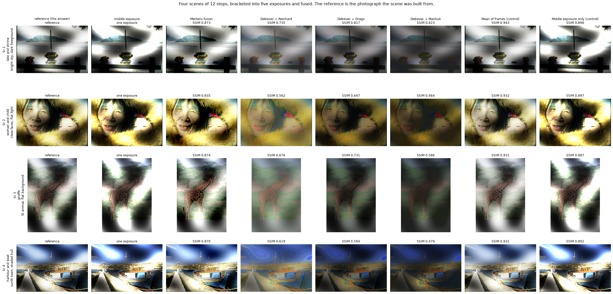
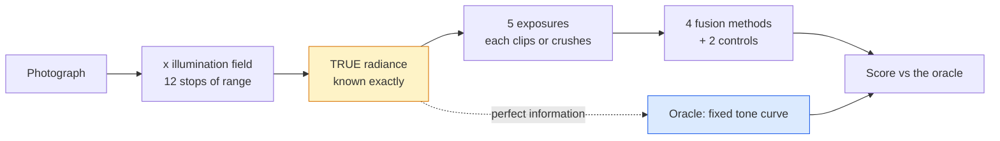

# 11 · HDR exposure fusion — classical computer vision

[](https://www.python.org/)
[](https://opencv.org/)
[](#)
[](#)

A single exposure cannot hold a sunlit window and the dark room around it.
Bracketing takes several; fusion combines them. Every write-up shows the result
and declares it better.

**Better than what, by how much, and against what ceiling?**

**No neural network, no training, no GPU.**

---

## Results

Four scenes of **12 stops** — far wider than 8 bits — bracketed into five
exposures two stops apart and fused. The reference is not a matter of taste: it
is a fixed tone curve applied to the **exact radiance**, so every method is
being asked *how close did you get to what you would have produced with perfect
information*.



| Sr | Scene | Mertens | Debevec + Reinhard | Debevec + Drago | Debevec + Mantiuk | **Mean of frames** | **Middle exposure** |
|---:|---|---:|---:|---:|---:|---:|---:|
| 1 | lake and shrine · bright sky, dark foreground | 0.873 | 0.735 | 0.817 | 0.623 | **0.943** | 0.896 |
| 2 | woman and child · close faces, flat light | 0.835 | 0.562 | 0.647 | 0.464 | **0.932** | 0.897 |
| 3 | giraffe · lit animal, flat background | 0.874 | 0.676 | 0.731 | 0.586 | **0.931** | 0.887 |
| 4 | harbour and boat · sunlit town, shaded hull | 0.870 | 0.619 | 0.594 | 0.479 | **0.931** | 0.892 |

Cells are SSIM against the oracle. **The two bold columns are the controls.**

> **Every real fusion method loses to averaging the frames.** The naive mean —
> which gives a blown-out white pixel exactly the same vote as a correctly
> exposed one — scores **0.928 SSIM** against Mertens' **0.848** and
> Debevec + Reinhard's **0.634**. It also beats them on PSNR, 23.5 dB to 20.9,
> and runs in 9 ms against Debevec's 1.8 s.

> **Taking one photograph and doing nothing beats all three Debevec pipelines.**
> The middle exposure scores **0.890 SSIM** in 0.002 ms. Every radiance-based
> pipeline scores lower and takes between 3,500× and 900,000× longer.

**Part of that is real and part of it is the metric, and the difference matters.**
The oracle renders with a *global* Reinhard curve, so a method that behaves
globally matches it more closely than one that blends locally — which is exactly
what Mertens does, and exactly what a human would prefer looking at the picture.
The honest statement is not "averaging is the best HDR method". It is:

- against a global reference, global methods win, and the reference here is global;
- **the sophisticated pipelines are not losing narrowly, they are losing badly**
  (0.52–0.69 against 0.93), which no choice of reference operator explains away;
- and the cheapest thing anyone could do is competitive, which is worth knowing
  before spending 1.8 seconds a frame.

### More exposures make every method worse

| Frames | Unrecoverable | Mertens | Debevec + Reinhard | Debevec + Drago | Debevec + Mantiuk |
|---:|---:|---:|---:|---:|---:|
| 2 | 6.82% | **24.10** | **18.58** | **18.40** | **16.87** |
| 3 | 4.39% | 22.39 | 17.48 | 14.67 | 13.67 |
| 5 | **0.50%** | 20.92 | 14.70 | 11.51 | 9.89 |

Read the second column against the rest. **A wider bracket records more of the
scene** — the fraction lost in every frame falls from 6.8% to 0.5% — and **every
method gets worse anyway.** Mertens drops 3.2 dB, Mantiuk 7.0.

The extra frames are the ±4-stop ones, and at +4 stops **49.5% of the frame is
saturated**. None of these methods discounts a frame for being mostly clipped;
they weight per pixel, and a pixel that reads 255 looks confidently bright
rather than broken. So the information is genuinely there and the fusion makes
worse use of it.

*On two scenes Mertens reverses and improves with more frames. The effect is an
average over scenes, not a property of each — recorded because it is exactly the
kind of claim a small sample inverts.*

### What no method can recover

| Bracket spread | Frames | Blown everywhere | Crushed everywhere | **Unrecoverable** |
|---:|---:|---:|---:|---:|
| ±0 stops | 1 | 27.8% | 1.3% | **29.0%** |
| ±1 stop | 3 | 11.9% | 0.5% | **12.4%** |
| ±2 stops | 3 | 7.8% | 0.4% | **8.2%** |
| ±3 stops | 3 | 4.6% | 0.3% | **4.8%** |
| ±4 stops | 3 | 2.2% | 0.2% | **2.5%** |

A single exposure of a 12-stop scene loses **29% of it** — clipped to white or
buried under the noise floor, in the only frame there is. That is not an
algorithm's failure and no algorithm fixes it. It is the argument for bracketing,
stated as a number rather than as a picture.

### How the scenes were chosen

Twelve candidates grouped by where the range *sits* — one bright/dark boundary,
many small ones, subject against ground, an interior, or barely any range at
all — with the best of each family kept. All twelve cleared the 0.40 SSIM gate.

```
scene candidate lake and shrine · bright sky, dark foreground keep — best SSIM 0.943, 0.3% unrecoverable  [one boundary]
scene candidate rocky coast · sky over shadowed rock       keep — best SSIM 0.921, 0.3% unrecoverable  [one boundary]
scene candidate stone arch · many small bright/dark edges  keep — best SSIM 0.917, 0.8% unrecoverable  [many boundaries]
scene candidate windmills · white walls against sky        keep — best SSIM 0.930, 0.2% unrecoverable  [many boundaries]
scene candidate harbour and boat · sunlit town, shaded hull keep — best SSIM 0.931, 0.7% unrecoverable  [mixed]
scene candidate boat and shed · water reflections          keep — best SSIM 0.919, 0.8% unrecoverable  [mixed]
scene candidate temple dragon · lit statue, dark towers    keep — best SSIM 0.927, 0.7% unrecoverable  [subject vs ground]
scene candidate giraffe · lit animal, flat background      keep — best SSIM 0.931, 0.1% unrecoverable  [subject vs ground]
scene candidate gallery visitors · interior, lit pictures  keep — best SSIM 0.911, 0.6% unrecoverable  [interior]
scene candidate elephant in grass · even light, little range keep — best SSIM 0.924, 0.2% unrecoverable  [little range]
scene candidate squirrel on a rock · soft light, little range keep — best SSIM 0.925, 0.4% unrecoverable  [little range]
scene candidate woman and child · close faces, flat light  keep — best SSIM 0.932, 0.5% unrecoverable  [interior]
```

---

## What it does



Because the scene is generated, three things are known that a real bracket
cannot give you:

| Known | Lets us ask |
|---|---|
| the exact radiance | how close is the output? (PSNR, SSIM vs the oracle) |
| which pixels clipped in every frame | **what was never recorded?** (the ceiling) |
| the exposure times | is the method using them correctly? |

---

## Problems hit, and how they were solved

| # | Symptom | Cost |
|---:|---|---|
| 1 | Mertens scored 6.5 dB / SSIM 0.006 | looked like a broken algorithm |
| 2 | The middle-exposure control beat every method by 19 dB | the scene had no range to recover |
| 3 | Every method scored ~0.5 SSIM and the figure showed four identical columns | the reference was the wrong image |
| 4 | Mantiuk raised `fabs(dprod) > 0` | a one-frame "bracket" |

### 1 · Mertens returned a black image and raised nothing

`cv2.createMergeMertens().process()` wants **uint8** frames. Handed floats
scaled to `[0, 1]` it returns an image whose maximum is about **0.004** — black —
with no error and no warning.

```python
# WRONG - returns an image with max 0.004
cv2.createMergeMertens().process([f.astype(np.float32) / 255.0 for f in frames])

# RIGHT
cv2.createMergeMertens().process(list(frames))
```

It scored 6.5 dB and SSIM 0.006 that way, which reads as *this method does not
work* rather than *this call is wrong*. Pinned by
`test_mertens_needs_uint8_frames`, which asserts both behaviours.

### 2 · There was nothing to fuse

The first generator bracketed a photograph directly: linearise, scale by the
exposure, clip, encode. Every fusion method then lost to *taking the middle
frame*, which scored **39.8 dB** against the best fusion's 20.8.

That is not a finding about fusion. **An 8-bit photograph, linearised and
re-exposed, fits back into 8 bits** — the middle frame clipped 1.5% of the image,
so there was no range for a bracket to recover and the trivial control was
simply correct.

The second attempt tried to fix it at the sensor, narrowing each frame's usable
range. That fails for an arithmetic reason: dynamic range is saturation over
noise floor, so lowering the white level moves the window without narrowing it.
The middle frame still clipped 0.4%.

Range has to be *added*, and it is added where a real scene has it — in the
illumination. The photograph supplies reflectance; a smooth low-frequency field
spanning 12 stops supplies the lighting.

### 3 · The reference asked for something fusion does not do

With a 12-stop scene, the obvious reference was still the original photograph.
Every method scored around 0.5 SSIM and the comparison figure showed four
columns with the same bright and dark blotches in them.

The reference was wrong. The photograph has **no illumination field**, so
scoring against it asked every method to *remove the lighting* — an
intrinsic-image problem none of them attempts. The figure was measuring the
harness.

The fix is the pattern used in projects 03, 04 and 05: an **oracle**. A fixed
global Reinhard curve is applied to the *true* radiance, which the bracket only
samples. Every method is then asked how close it got to perfect information,
with the tone curve held constant so the comparison is about recovered radiance
rather than anyone's taste.

**That the oracle is global is a stated bias, not a hidden one** — see the
caveat under the results table.

### 4 · A one-frame bracket is not a bracket

`BRACKET_SIZES` began at 1, and OpenCV's Mantiuk operator failed outright with
`(-215:Assertion failed) fabs(dprod) > 0`.

Debevec's method recovers the camera response from how the same pixel changes
*across* exposures. With one exposure there is nothing to fit and the radiance
map is degenerate. The one-frame case is not missing from the project — it is
the `Middle exposure only` control, which is exactly what a one-frame bracket is.

---

## Limitations

* **The illumination field is synthetic and smooth.** A real high-range scene
  has hard boundaries — a window frame — not a sum of three sinusoids. Methods
  that handle soft gradients well may do relatively worse on a real bracket.
* **The oracle's tone curve is global**, and that biases the comparison toward
  global methods. Stated in the results rather than buried here.
* **Everything is perfectly aligned.** A handheld bracket is not, and alignment
  failure is the commonest way real HDR goes wrong. `cv2.createAlignMTB` exists
  and is not used, because with no misalignment to correct it would measure
  nothing.
* **No ghosting.** Nothing moves between frames. Ghost removal is a large part
  of practical HDR and is absent here for the same reason.

---

## Tests

20 tests, run with `pytest projects/11_hdr_exposure_fusion/tests -q`. They pin
the findings rather than the numbers: that the scene is genuinely wider than 8
bits, that no single exposure holds it, that the naive mean beats every real
method, that one exposure beats all three Debevec pipelines, and that a wider
bracket records more while every method makes worse use of it.

---

## Keywords

HDR · high dynamic range · exposure fusion · exposure bracketing · Mertens
fusion · Debevec Malik · camera response curve · radiance map · tone mapping ·
Reinhard · Drago · Mantiuk · clipping · classical computer vision · no deep
learning · OpenCV · Python · CPU only · reproducible image processing experiments

## References

* Mertens, Kautz & Van Reeth, *Exposure Fusion*, Pacific Graphics 2007.
* Debevec & Malik, *Recovering High Dynamic Range Radiance Maps from
  Photographs*, SIGGRAPH 1997.
* Reinhard, Stark, Shirley & Ferwerda, *Photographic Tone Reproduction for
  Digital Images*, SIGGRAPH 2002.
* Drago, Myszkowski, Annen & Chiba, *Adaptive Logarithmic Mapping for Displaying
  High Contrast Scenes*, Eurographics 2003.
* Mantiuk, Myszkowski & Seidel, *A Perceptual Framework for Contrast Processing
  of High Dynamic Range Images*, ACM TAP 2006.
