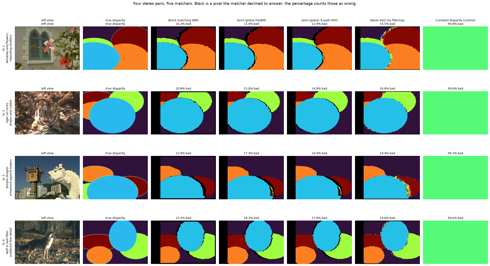
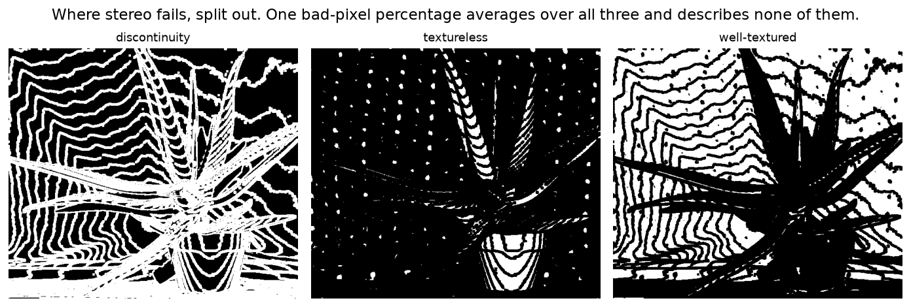
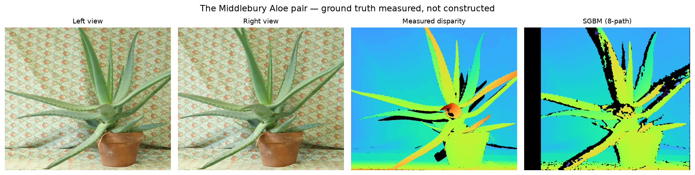
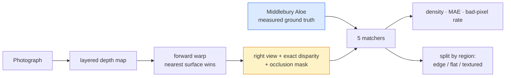

# 12 · Stereo to depth — classical computer vision

[](https://www.python.org/)
[](https://opencv.org/)
[](#)
[](#)

Two rectified views differ by a horizontal shift per pixel — the disparity —
which is inversely proportional to depth. Finding it is the oldest problem in
the field, and `cv2.StereoBM` is four lines.

**What does a disparity map get wrong, where, and what does filling the gaps
cost?**

**No neural network, no training, no GPU.**

---

## Results

Four stereo pairs, five matchers. Black is a pixel the matcher **declined to
answer**; the percentage counts those as wrong.



| Sr | Scene | Block matching | Semi-global (SGBM) | **Semi-global, 8-path** | Naive SAD | Constant (control) |
|---:|---|---:|---:|---:|---:|---:|
| 1 | windows and flowers · repeating shutters | 16.2% | 13.4% | **12.9%** | 14.5% | 99.8% |
| 2 | tiger on rocks · stripes and rubble | 20.8% | 15.0% | **14.8%** | 16.8% | 99.6% |
| 3 | temple dragon · ornament against towers | 22.9% | 17.3% | **16.9%** | 19.4% | 99.7% |
| 4 | wolf in leaf litter · scattered fine detail | 23.2% | 18.3% | **17.8%** | 19.8% | 99.6% |

### The ranking inverts depending on how you count a refusal

| Method | Density | MAE (px) | **Bad 2px, answered** | **Bad 2px, all** | Time (ms) |
|---|---:|---:|---:|---:|---:|
| Block matching (BM) | 77.4% | 0.354 | **1.32%** | **23.6%** | 4.9 |
| Semi-global (SGBM) | 82.8% | 0.492 | 2.04% | 18.9% | 35.6 |
| Semi-global, 8-path (HH) | 82.7% | 0.368 | **1.32%** | **18.4%** | 52.7 |
| Naive SAD (no filtering) | 83.9% | 1.028 | 4.96% | 20.2% | 74.1 |
| Constant disparity (control) | 100% | 11.29 | 99.7% | 99.7% | 0.04 |

> **Block matching is simultaneously the most accurate method here and the
> worst.** Of the pixels it answers, **1.3% are wrong** — as good as anything
> else in the table. Count its refusals as misses and it is last at **23.6%**.
> Nothing about the method changed between those two sentences; only the
> convention for scoring a blank did.
>
> A matcher can decline to answer where the cost has no clear minimum. Scoring
> only what it answered **rewards silence**; scoring everything **punishes
> honesty**. Neither column is the number, which is why both are here.

> **The naive SAD search shows how little of the quality is the matching cost.**
> The same sum-of-absolute-differences that `StereoBM` uses, without the
> uniqueness test, the left-right check, the speckle filter or sub-pixel
> interpolation, has **3.8× the error rate** among answered pixels (4.96% against
> 1.32%) and **2.9× the mean error** (1.03 px against 0.354). Almost all of
> `StereoBM`'s quality is the machinery around the cost, not the cost.

### Where the errors actually are

Split on the real Aloe pair, whose ground truth is *measured*:

| Method | At a depth edge | Textureless | Well-textured |
|---|---:|---:|---:|
| Block matching (BM) | **41.9%** | 16.1% | 23.8% |
| Semi-global (SGBM) | **30.3%** | 14.0% | 20.0% |
| Semi-global, 8-path (HH) | **30.0%** | 14.1% | 20.3% |
| Naive SAD | **33.0%** | 19.1% | 20.6% |

*Coverage: 49.5% of the frame is within 5 px of a depth edge, 7.2% is
textureless, 43.3% is well-textured.*



**Every matcher is worst at a depth discontinuity**, by 10–18 points over
well-textured regions. That is where a block spans two depths at once and no
single disparity explains it.

**Textureless regions are the *easiest*, which is not what the textbooks
suggest.** 14–19% against 20–24% in well-textured areas. The reason is visible
in the middle panel above: in these scenes the low-texture regions are large
flat surfaces at nearly constant depth, so SGBM's smoothness penalty — which
assumes neighbours share a disparity — is exactly right there. **The classic
"textureless is hard" result is about getting a *unique match*, and these
methods are not being scored on unique matches; they are being scored on the
final disparity, which smoothing supplies for free when the surface really is
flat.** On a textureless surface that is *not* flat, this would reverse.

### Generated pairs, and a real one

| | Density | MAE (px) | Bad 2px (all) |
|---|---:|---:|---:|
| 12 generated pairs (best method) | 82.7% | 0.368 | **18.4%** |
| Middlebury *Aloe* (best method) | 80.7% | 1.509 | **24.7%** |

The real pair is **6.3 points harder** and has **4× the mean error**. That gap
is the reason it is here: generated ground truth is exact and variable, and it
is also quietly easier than a photograph of a real plant. Reporting only the
generated numbers would overstate every method by about a quarter.



### How the scenes were chosen

Twelve pairs grouped by what makes *matching* hard — how much texture there is,
how repetitive it is, how many depth discontinuities — rather than by subject.
All twelve cleared the 35%-bad gate:

```
scene candidate windmills · white walls, little texture      keep — best bad-2px 0.205  [low texture]
scene candidate rocky coast · large flat sky                 keep — best bad-2px 0.255  [low texture]
scene candidate stone arch · stonework, heavy texture        keep — best bad-2px 0.169  [high texture]
scene candidate tiger on rocks · stripes and rubble          keep — best bad-2px 0.148  [high texture]
scene candidate harbour and boat · rigging, thin structures  keep — best bad-2px 0.178  [thin structure]
scene candidate temple dragon · ornament against towers      keep — best bad-2px 0.169  [thin structure]
scene candidate gallery visitors · people at several depths  keep — best bad-2px 0.211  [many depths]
scene candidate elephant herd · animals at several depths    keep — best bad-2px 0.184  [many depths]
scene candidate penguin on pebbles · repeating stones        keep — best bad-2px 0.180  [repetitive]
scene candidate windows and flowers · repeating shutters     keep — best bad-2px 0.129  [repetitive]
scene candidate coral reef · dense fine detail               keep — best bad-2px 0.194  [fine detail]
scene candidate wolf in leaf litter · scattered fine detail  keep — best bad-2px 0.178  [fine detail]
```

The spread is narrow — 12.9% to 25.5% — which is itself worth noting. **Scene
content moves the error rate by about 2×; the choice of matcher moves it by
about 1.3×.** As in several other projects here, the input matters more than the
algorithm.

---

## What it does



Two kinds of ground truth, deliberately:

| Source | Truth | Why both |
|---|---|---|
| generated pairs | exact by construction | can be *varied* — texture, repetition, depth layers |
| Middlebury Aloe | measured with structured light | the check that generated pairs are not quietly easier |

---

## Limitations

* **The generated depth maps are ellipses.** They give real discontinuities and
  real occlusions, which is what they are for, but they are not the shape of a
  real scene. The Aloe pair is here because of that.
* **Everything is perfectly rectified.** Real stereo needs calibration first,
  and rectification error is a large part of why real systems underperform.
  That is project 35's question, not this one's.
* **Only the left-to-right direction is matched.** A left-right consistency
  check would catch more occlusions; OpenCV's `disp12MaxDiff` does some of this
  and is left at its default rather than tuned.
* **No sub-pixel refinement beyond what OpenCV does**, which is why the MAE
  floor is around 0.35 px rather than lower.

---

## Tests

17 tests, run with `pytest projects/12_stereo_depth/tests -q`. They pin the
generator's contract (the right view really is the left view shifted by the
disparity), that the scene contains occlusions, and the findings: that density
and accuracy pick different winners, that every matcher is worse at a depth
edge, that SGBM's smoothness buys density and costs precision, and that the real
pair is harder than the generated ones.

---

## Keywords

stereo matching · stereo vision · disparity map · depth from stereo · block
matching · StereoBM · semi-global matching · SGBM · Hirschmüller · Middlebury ·
bad pixel rate · occlusion · disparity discontinuity · classical computer vision
· no deep learning · OpenCV · Python · CPU only · reproducible image processing
experiments

## References

* Hirschmüller, *Stereo Processing by Semiglobal Matching and Mutual
  Information*, IEEE TPAMI 2008.
* Scharstein & Szeliski, *A Taxonomy and Evaluation of Dense Two-Frame Stereo
  Correspondence Algorithms*, IJCV 2002.
* Scharstein & Pal, *Learning Conditional Random Fields for Stereo*, CVPR 2007 —
  the Aloe pair.
