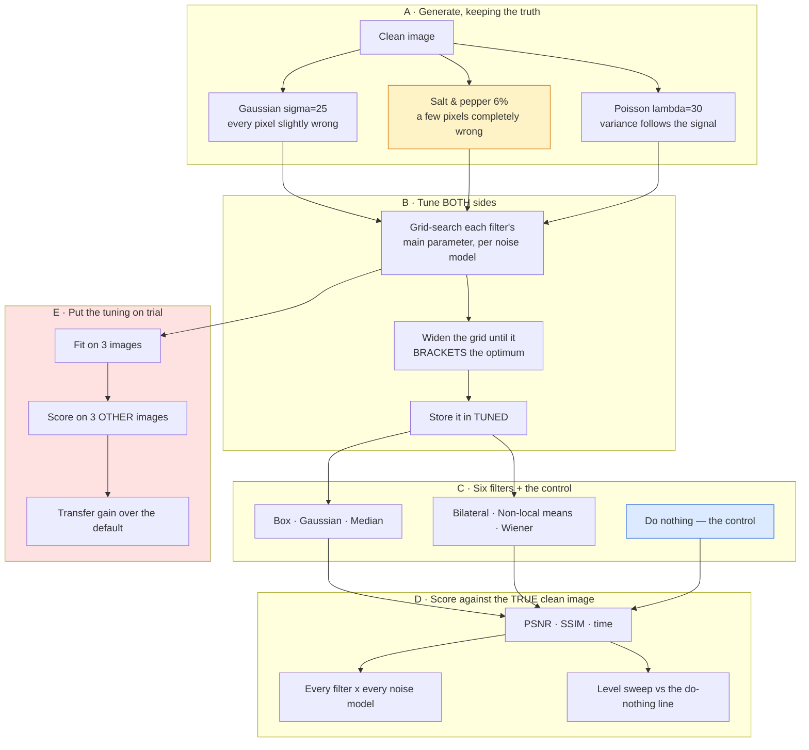

# Project 13 — Denoising shootout: complete workflow

The [README](README.md) states the findings. This states how they were reached,
in what order, and what each decision cost.

---

## 1 · Why this question, and not "which denoiser is best"

"Which denoiser is best" has an answer only if you leave out the noise model, and
leaving it out is what makes most denoising comparisons disagree with each other.

Three questions that do have answers:

> **Does the winner change with the noise *model*, or only with the level?**

If it changes with the model, "best denoiser" is not a well-formed question and
every table that reports one is reporting its own choice of test noise.

> **How much of any published comparison is tuning?**

Every filter here has one parameter that matters. Comparing at defaults ranks the
defaults; comparing at tuned values ranks the tuning. Doing both, and then
checking the tuning on held-out images, separates the three.

> **When is the right answer not to denoise?**

The control nobody includes. A filter that helps at σ=25 can hurt at σ=5, and
that crossover is the practically useful number.

---

## 2 · The complete workflow



**Box E is the part that is usually missing**, and it is the reason the tuned
numbers in box D can be trusted — or, for five filters of six, cannot.

---

## 3 · Build order

| Step | What | Why here |
|---:|---|---|
| 1 | Six filters, three noise models | The grid. |
| 2 | Score at defaults | And get a wrong answer: non-local means below a box blur. |
| 3 | Diagnose | OpenCV's `h=10` is set for less noise than σ=25. The table was ranking defaults. |
| 4 | Grid-search per noise model | Tuned against tuned. |
| 5 | **Notice three optima at grid edges** | An optimum at the end of the list is a truncated sweep, not a result. |
| 6 | Widen the grids | Two of the three moved. The two that stayed are understood. |
| 7 | **A negative cost-of-default** | Two filters' "best" parameter scored worse than the default. |
| 8 | Diagnose | `TUNED` had been fitted on 3 images and evaluated on 6. Overfitting. |
| 9 | Re-tune on all six **and** build `transfer_check` | The bug became a headline. |
| 10 | Level sweep with the control | Where denoising starts, and stops, being worth doing. |
| 11 | `infer.py` noise detector | Needed for a recommendation without a ground truth. |
| 12 | **A test caught the detector** | Poisson pins 1.7% of pixels; the raw-extreme threshold was 0.5%. |
| 13 | UI, figures, docs | — |

Steps 7–9 are the useful part of this list. The bug — tuning on a subset and
reporting on the whole — is the single most common way a comparison talks itself
into a result, and it happened here on a six-image search over one parameter.
Turning it into a permanent experiment was worth more than fixing it quietly.

---

## 4 · Decisions, with reasoning

### Why every filter is tuned, and tuned *per noise model*

A filter with an unlucky default looks weak for a reason that has nothing to do
with the noise. Measured: non-local means at OpenCV's common `h=10` scores
**24.48 dB** on σ=25 noise, below a box blur's 25.43. At `h=18` it scores 26.60.
The filter did not change.

Tuning per *model* rather than once globally matters for the same reason the
project exists — bilateral's best `sigma_color` is 120 on Gaussian noise and 255
on salt-and-pepper, and 255 is the filter asking to stop being bilateral.

### Why a grid-edge optimum is a warning, not a result

Three of the first six best values were at the end of their list. That does not
mean the parameter should be extreme; it means the sweep stopped before the
function did, and the reported "best" is an artefact of where I stopped typing.

After widening, two stayed at an edge and both are now explained rather than
ignored: box wants the smallest kernel on Gaussian and Poisson noise (do as
little as possible), and bilateral wants `sigma_color=255` on salt-and-pepper
(flatten the range weight completely, i.e. become a Gaussian blur). A parameter
that runs to the end of its range is a filter telling you it is the wrong tool.

### Why the tuning is checked on held-out images

Because grid-searching six images and reporting the best number is exactly how a
comparison produces a result it cannot defend, and I had just done it by accident
— `TUNED` was fitted on three images and evaluated on six, and two filters came
back with a *negative* cost-of-default.

The deliberate version: fit on three, score on three others.

| Filter | Transfer gain |
|---|---:|
| Bilateral | **+4.13 dB** |
| Non-local means | +0.20 dB |
| Median, Wiener | 0.00 dB |
| Gaussian | −0.02 dB |
| Box | **−0.81 dB** |

**One filter of six.** Everything else's "tuned" number is the default with extra
steps, and the box filter's is worse than the default on images it was not fitted
to. That is the size of the effect on a six-image search over one free parameter,
which is about as small as overfitting gets.

The consequence for reading the main table: the bilateral row's win is real and
transfers; the differences of a few tenths of a dB between the others are inside
the tuning noise.

### Why "do nothing" is a row in every table

Because at σ=5 it is the *second best method in the table*, beating five of the
six filters. Denoising a nearly-clean image costs more in blur than it recovers
in noise, and no comparison that omits the control can tell you that.

It also makes the level sweep interpretable: the crossing point of each filter
with the control is the answer to "should I run this", which is a more useful
output than a ranking.

### Why the noise detector counts *isolated* extremes

The obvious detector for impulse noise is "how many pixels are at 0 or 255". It
does not work, and a test caught it:

* Poisson noise at λ=30 clips **1.73%** of pixels to the extremes, above the 0.5%
  threshold I had set.
* Worse, `astronaut` has **11.2%** of its pixels at 0 or 255 *with no noise at
  all*, from the large black regions. The statistic is dominated by image content.

Requiring the extreme pixel to also disagree with its own 5×5 median separates
isolated speckle from solid dark regions, and the separation is not marginal:
≤0.014% for everything that is not impulse noise, 4.28–5.98% for what is. A 300×
margin is what a detection threshold should look like.

Note where the bug was found. The test asserts the project's *premise* — that the
three noise models differ in kind — and in doing so it caught a defect in a
different file that no test of that file would have looked for.

### Why `infer.py` reports "changed" rather than a quality score

Your photograph has no clean original, so there is no quality number to report.
What the tool prints is PSNR against the *noisy input*, which measures how
aggressive the filter was being and is neither good nor bad on its own — "do
nothing" scores infinity.

The useful output is the recommendation: detect the noise model, name the filter
that won at that model on the benchmark, and say by how much. When you override
it with a worse choice, the tool says so and explains the mechanism.

---

## 5 · What each stage costs

Six images, Gaussian σ=25:

| Filter | Time |
|---|---:|
| Do nothing (control) | 0.04 ms |
| Gaussian | **0.32 ms** |
| Box | 1.25 ms |
| Median | 1.97 ms |
| Bilateral | 5.81 ms |
| Wiener (adaptive) | 21.47 ms |
| **Non-local means** | **578.31 ms** |
| **Full `run.py`** | **~3 min** |
| **`run.py --retune`** | **~8 min** |

Non-local means is **1,830× a Gaussian blur** and wins outright on exactly one of
the three noise models, by 0.31 dB. The bilateral filter — 100× cheaper — wins
Gaussian noise by 1.17 dB.

The cheapest filter in the table is not the worst one, either: at σ=35 and above
the plain Gaussian blur is the *best* of the six, because it is the only one that
does not try to decide which neighbours to trust.

---

## 6 · Reproducing it

```bash
python run.py                 # regenerates every number and figure
python run.py --retune        # re-runs the grid search and prints a TUNED table
streamlit run ui/app.py       # the interactive app
python infer.py noisy.jpg     # your own photo
pytest ../..                  # 31 tests here, 293 across the repo
```

`run.py` rewrites `results/results.json` and `results/tables.md`; the README's
numbers are copied from those files rather than typed.

Eight of the 31 tests pin a *finding* rather than a number — three distinct
winners, the median role reversal in both directions, the transfer result, the
cost ratio, denoising being worse than nothing at low noise, and the premise that
the three noise models differ in kind. A refactor that quietly reverses one of
the project's conclusions fails the suite instead of silently rewriting the
README.

---

## 7 · What would come next

* **BM3D.** The classical state of the art, and the reason this project does not
  claim to find the best classical denoiser. It is not in OpenCV's main build,
  so adding it means a dependency the repo does not otherwise need — a decision
  worth making deliberately rather than by omission.
* **Retune at every noise level, not just σ=25.** The level sweep currently uses
  defaults, which is why the bilateral and non-local means lines collapse at
  σ≥35. Some of that is real (they cannot tell edges from noise when the noise is
  the size of the edges) and some is mismatched parameters, and the split is not
  measured.
* **A noise level estimator good enough to close the loop.** `infer.py` estimates
  σ and recommends a filter, but does not use the estimate to *set* the filter's
  parameter. Bilateral's `sigma_color` is the one parameter where that would be
  worth 4 dB.
* **Mixed noise.** Real sensor output is Poisson-Gaussian, not either one. The
  winner on a mixture is not obviously either of the two winners, and it is the
  case that actually occurs.
* **Perceptual scoring.** PSNR and SSIM already disagree here — the bilateral
  filter's default row beats the box filter on neither. Project 26's machinery
  would say which ranking to believe.
