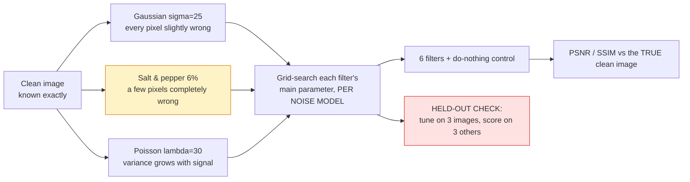

# 13 · Denoising shootout — classical computer vision

[](https://www.python.org/)
[](https://opencv.org/)
[](#)
[](#)

Six filters, three noise models, and one claim under test: **there is no best
denoiser.** The noise is generated, so sigma and density are exact and PSNR is
measured against the true clean image rather than against another algorithm's
output.

**No neural network, no training, no GPU, no dataset download.**

> **The finding, in one sentence.** Three noise models, **three different
> winners** — bilateral on Gaussian, median on salt-and-pepper, non-local means
> on Poisson — and the *worst* filter rotates too. Median is the best filter on
> impulse noise by **6.80 dB** and the worst on Gaussian. A filter is not good or
> bad; it is matched or mismatched.

> **Tuning transfers for one filter of six.** Every comparison here tunes each
> filter by grid search, and then checks whether the tuning means anything:
> fitted on three images, scored on three held-out ones, **bilateral gains
> 4.13 dB** and everything else gains ≤ 0.20 — while the box filter's fitted
> parameter *loses* **0.81 dB**. That is overfitting on a six-image search over
> one free parameter, which is about as small as overfitting gets.

> **Sometimes the right answer is not to denoise.** Below about **sigma 10**
> every filter here scores *worse* than leaving the image alone: their blurring
> costs more than the noise does. The do-nothing control is in the table to make
> that visible.

> **And the best quality costs 1,830×.** Non-local means runs at 578 ms against a
> Gaussian blur's 0.32 ms — and wins outright on exactly one of the three noise
> models, by 0.31 dB.

**Jump to:** [What it does](#what-it-does) · 
[Results](#results) ·
[Run it](#run-it-yourself) · [Inference](#inference-denoise-your-own-photo) ·
[How it works](#how-it-works) · [Problems solved](#problems-hit-and-how-they-were-solved) ·
[Limitations](#limitations) · [Keywords](#keywords)

---

## What it does



Two things separate this from a filter gallery:

**Every filter is compared at its own best setting (per noise model).** Denoising
comparisons disagree with each other mostly because of tuning — a filter with an
unlucky default looks weak for a reason that has nothing to do with the noise.
Tuning both sides means a loss is the method losing.

**And then the tuning is itself put on trial (red).** Grid-searching six images
and reporting the best number is exactly how a comparison talks itself into a
result. Fitting on half the images and scoring on the other half says which of
those tuned numbers were real.

---


## Results

All numbers from `python run.py`, written to
[`results/results.json`](results/results.json) and
[`results/tables.md`](results/tables.md). Six images.

### Every filter × every noise, each at its own tuned parameter (PSNR dB)

| Noise | Box | Gaussian | Median | Bilateral | Non-local means | Wiener | Do nothing |
|---|---:|---:|---:|---:|---:|---:|---:|
| Gaussian σ=25 | 27.604 | 27.736 | *27.685* | **29.792** | 28.618 | 28.559 | 20.476 |
| Salt & pepper 6% | 26.565 | 26.835 | **33.688** | 24.981 | *24.810* | 25.118 | 17.421 |
| Poisson λ=30 | 27.197 | 27.674 | *26.504* | 28.553 | **28.860** | 27.221 | 18.626 |

**Bold = best, italic = worst (excluding the control).**

Three noise models, **three different winners**. And the loser rotates as well:
median is worst on two of the three and best on the other by a margin nothing
else in this project comes close to.

| Noise | Winner | Margin over the runner-up |
|---|---|---:|
| Gaussian σ=25 | Bilateral | +1.17 dB |
| **Salt & pepper 6%** | **Median** | **+6.80 dB** |
| Poisson λ=30 | Non-local means | +0.31 dB |

The 6.80 dB is the interesting one. Half of it is folklore everybody repeats
("median kills salt and pepper"); the other half — *and median is the worst
filter on Gaussian noise* — is the same size of effect and nobody says it.

The mechanism is not mysterious: a mean is dragged by an outlier and a median is
not. Salt-and-pepper noise is **a few pixels completely wrong**, which is exactly
what an order statistic rejects. Gaussian noise is **every pixel slightly wrong**,
which has no outliers to reject, so the median throws away its only advantage and
keeps its cost.

### Does the tuning mean anything?

Fitted on three images, scored on three **held-out** ones:

| Filter | Fitted on 3 | Train (dB) | Held-out (dB) | Held-out at default | Transfer gain |
|---|---|---:|---:|---:|---:|
| Box | ksize=3 | 26.995 | 28.214 | 29.022 | **−0.808** |
| Gaussian | sigma=1.2 | 27.415 | 29.545 | 29.562 | −0.017 |
| Median | ksize=5 | 26.712 | 28.658 | 28.658 | 0.000 |
| **Bilateral** | sigma_color=120 | 28.753 | 30.832 | 26.699 | **+4.133** |
| Non-local means | h=18 | 27.070 | 30.166 | 29.965 | +0.201 |
| Wiener (adaptive) | ksize=5 | 27.993 | 29.124 | 29.124 | 0.000 |

**One filter of six.** The bilateral filter's `sigma_color` has to be set
relative to the noise level and OpenCV's usual default is wrong for σ=25, so
tuning it is worth 4 dB on images it was never fitted to. For everything else the
"tuned" number is the default with extra steps — and for the box filter the
fitted parameter actively *loses* on held-out images.

A six-image grid search over one free parameter is about as small as overfitting
gets. It still happened, which is worth knowing before reading any denoising
comparison that reports a tuned number without saying what it was tuned on.

### Default parameters, and what they cost

| Filter | PSNR (dB) | SSIM | Time (ms) | Tuned (dB) | Gain from tuning |
|---|---:|---:|---:|---:|---:|
| Box | 27.733 | 0.7077 | 1.25 | 27.733 | 0.000 |
| Gaussian | 28.270 | 0.7386 | **0.32** | 28.480 | +0.210 |
| Median | 27.685 | 0.6778 | 1.97 | 27.685 | 0.000 |
| Bilateral | 26.604 | 0.5479 | 5.81 | **29.792** | **+3.189** |
| Non-local means | 27.517 | 0.7034 | **578.31** | 28.618 | +1.101 |
| Wiener (adaptive) | **28.559** | 0.7149 | 21.47 | 28.559 | 0.000 |
| Do nothing (control) | 20.476 | 0.2959 | 0.04 | — | — |

At default parameters the **bilateral filter is the worst of the six**. Tuned, it
is the best. Same filter, same images, 3.19 dB apart — which is larger than the
gap between first and fourth place in either column.

### When not to bother

| σ | Noisy input | Box | Gaussian | Median | Bilateral | NLM | Wiener |
|---:|---:|---:|---:|---:|---:|---:|---:|
| **5** | **34.236** | 29.560 | 30.156 | 30.778 | **36.030** | 32.767 | 34.197 |
| 10 | 28.272 | 29.234 | 29.821 | 30.083 | **34.851** | 32.405 | 32.603 |
| 20 | 22.356 | 28.278 | 28.834 | 28.462 | 29.674 | **29.848** | 29.742 |
| 35 | 17.687 | 26.603 | **27.097** | 26.246 | 21.567 | 20.965 | 26.514 |
| 50 | 14.852 | 24.938 | **25.369** | 24.355 | 16.817 | 15.464 | 24.123 |

Two things in this table, both at the extremes.

**At σ=5, five of the six filters make the image worse.** The input scores 34.24
dB and only the bilateral filter beats it. Denoising a nearly-clean image costs
more in blur than it recovers in noise, and knowing where that line sits is the
practically useful half of any denoising comparison.

**At σ=35 and above, the edge-preserving filters collapse.** Bilateral drops to
21.57 and non-local means to 20.97, *below the plain box blur's 26.60*. Both work
by deciding which neighbouring pixels are "similar enough" to average — and when
the noise is as large as the edges, that decision is made on noise. (This table
uses **default** parameters; a per-level retune would recover some of it, which
is exactly the point of the transfer table above.)

---

## Run it yourself

```bash
git clone https://github.com/hammas159/classical-computer-vision.git
cd classical-computer-vision/projects/13_denoising_shootout
```

```bash
pip install -r ../../requirements.txt

python run.py                 # regenerate every number and figure (~3 min)
python run.py --retune        # re-run the grid search too (slow)
pytest ../..                  # 31 tests for this project, 293 for the repo
```

`run.py` rewrites `results/results.json` and `results/tables.md`. **Every number
in this README is copied from those files rather than typed.**

---

## Inference: denoise your own photo

```bash
python infer.py noisy.jpg                    # detects the noise model and picks the winner
python infer.py noisy.jpg --estimate         # just measure the noise, then stop
python infer.py noisy.jpg --all-methods
python infer.py noisy.jpg --method Median --noise gaussian
```

Typical output:

```
input    : noisy.jpg  512x512
noise    : estimated sigma 23.80   isolated extreme pixels: 4.594%
model    : salt_pepper  (detected from the impulse fraction)

filter   : Median  (ksize=3)   0.3 ms
changed  : 16.69 dB against the input
wrote    : denoised.png

verdict  : Median is the measured winner on salt_pepper noise (33.69 dB,
           6.80 dB clear of the runner-up on the six-image benchmark).
```

**No PSNR is reported and none should be** — your photograph has no clean
original. The `changed` column is PSNR against the *noisy input*, which measures
how aggressive the filter was being and is neither good nor bad on its own.

What the tool does give you without a ground truth is **a recommendation from
data**: it detects the noise model from the fraction of *isolated* extreme
pixels, then names the filter that won at that model on the measured benchmark
and by how much. Pick a different one and it says so:

```
note     : Median is the WORST of the six filters on Gaussian noise
           (27.69 dB against Bilateral's 29.79). Its advantage is rejecting
           outliers, and Gaussian noise has none -- every pixel is slightly
           wrong rather than a few being completely wrong.
```

It also warns when the estimated sigma is below 10, where the benchmark says
every filter here scores worse than leaving the image alone.

---

## How it works

### The six filters, and what each one assumes

| Filter | Assumes | Fails when |
|---|---|---|
| Box | neighbours are similar | there is an edge |
| Gaussian | the signal is locally constant | it is not — which is why it blurs |
| Median | corruption is a *minority* of the window | more than half the window is wrong |
| Bilateral | similar intensity ⇒ same object | the noise is as large as the edges |
| Non-local means | the image repeats itself | it does not, or you are in a hurry |
| Wiener | local variance ≈ signal + noise | the noise is not stationary |

### Why the noise models are not interchangeable

* **Gaussian** adds `N(0, σ)` to every pixel. Every pixel is slightly wrong.
* **Salt and pepper** sets a fraction of pixels to exactly 0 or 255. A few pixels
  are *completely* wrong and the rest are untouched.
* **Poisson** replaces each pixel by a draw whose variance equals its mean, so
  bright regions are noisier than dark ones — the only one of the three where the
  noise depends on the signal.

A median rejects a minority of outliers and has no opinion about small errors. An
average has no defence against outliers and is optimal against small independent
ones. The winners in the table above follow directly.

---

## Problems hit, and how they were solved

Every entry is a real defect in this project's own code, with the symptom that
exposed it and the measurement that confirmed the fix.

### 1 · The comparison was default-against-default, which measures the defaults

**Symptom.** Non-local means — the most sophisticated filter in the set — scored
**24.48 dB** on Gaussian σ=25, *below a box blur's 25.43*. A result that would
have been worth writing up, and was wrong.

**Cause.** The main table ran every filter at its library default. OpenCV's usual
`h=10` is set for a lower noise level than σ=25; at `h=18` the same filter scores
26.60. The table was ranking defaults, not methods.

**Fix** — [`src/denoising.py:297`](src/denoising.py#L297) — grid-search each
filter's main parameter **per noise model** and store the result, so the central
comparison is tuned-against-tuned:

```python
TUNED: dict[str, dict[str, tuple[str, float]]] = {
```

**Result:** the bilateral filter went from worst (26.60) to best (29.79) on
Gaussian noise, and the comparison started being about the filters.

### 2 · The grid was truncated, so "best" meant "the end of the list"

**Symptom.** Three of the six best values came back at the *edge* of their grid —
box `ksize=3` (the smallest offered), Gaussian `sigma=0.8` (the smallest),
bilateral `sigma_color=120` (the largest).

**Cause.** An optimum at a grid edge is not a result, it is a warning that the
sweep stopped before the optimum did.

**Fix** — [`src/denoising.py:240`](src/denoising.py#L240) — widen every grid until
it brackets its optimum:

```python
"Bilateral": ("sigma_color", (15.0, 35.0, 55.0, 80.0, 120.0, 180.0, 255.0)),
```

**Result:** the bilateral optimum moved to 180 on Poisson and 255 on
salt-and-pepper. The two that stayed at an edge — box wanting the smallest
kernel, bilateral wanting `sigma_color=255` — are now understood rather than
unnoticed: both are the filter asking to be switched off. `sigma_color=255`
flattens the range weight completely and turns a bilateral filter into a plain
Gaussian blur.

### 3 · The tuned parameters were fitted on 3 images and scored on 6

**Symptom.** Two filters came back with a **negative** cost-of-default: their
"best" parameter scored *worse* than the library default. Box −0.13 dB,
Gaussian −0.53 dB.

**Cause.** `TUNED` had been filled in from a three-image run while
`default_vs_tuned` evaluated on all six. Textbook overfitting, on a six-image
grid search over one free parameter — which is about as small as overfitting
gets, and it still happened.

**Fix.** Two things, and the second is the more useful one. `TUNED` was
regenerated on all six images. And the failure became a deliberate experiment —
[`src/denoising.py:403`](src/denoising.py#L403):

```python
def transfer_check(kind: str = "gaussian", level: float = 25.0):
```

**Result:** the finding that tuning transfers for **one filter of six**, which is
now one of the project's headlines. The bug was more informative than the fix.

### 4 · The noise-model detector was fooled by the photograph

**Symptom.** A test asserted that only salt-and-pepper pins pixels to 0 or 255,
and failed: Poisson noise pinned **1.73%**.

**Cause.** Two problems in one. Poisson noise clips at the top of the range in
bright regions, so it *does* produce extremes. Worse, the raw fraction is
dominated by image content — `astronaut` has **11.2%** of its pixels at 0 or 255
with no noise at all, from the large black regions. `infer.py`'s detector
thresholded at 0.5% of extreme pixels, so it would have called both a
salt-and-pepper image.

**Fix** — [`infer.py:50`](infer.py#L50) — require the extreme pixel to also
disagree with its own 5×5 median, which separates isolated speckle from solid
dark regions:

```python
return float((extreme & (cv2.absdiff(g, cv2.medianBlur(g, 5)) > 60)).mean())
```

Measured over six images:

| noise | isolated extremes |
|---|---:|
| none | ≤ 0.004% |
| Gaussian σ=25 | ≤ 0.005% |
| Poisson λ=30 | ≤ 0.014% |
| **Salt & pepper 6%** | **4.28% – 5.98%** |

**Result:** a 300× margin instead of an overlap. The test that caught it is
`test_only_impulse_noise_produces_ISOLATED_extreme_pixels`, and it was written to
assert the premise of the whole project — that the three noise models differ in
*kind* — which is why it caught a bug in a different file.

---

## Limitations

* **Six images, all well-exposed and sharp.** The crossover points in particular
  (where denoising stops being worth it) would move on noisier or softer source
  material.
* **The level sweep uses default parameters.** Retuning at every noise level
  would recover some of the bilateral/NLM collapse at σ≥35, and the size of that
  recovery is not measured here. The transfer table says the recovery would be
  real for bilateral and near-zero for four of the others.
* **No BM3D.** It is the classical state of the art and it is not in OpenCV's
  main build, so including it would have meant a dependency this repo does not
  otherwise need. Its absence means "best classical denoiser" is not a claim this
  project makes.
* **PSNR and SSIM disagree, and neither is perceptual.** The bilateral filter's
  default row scores 26.60 dB with SSIM 0.5479 — worse on SSIM than the box
  filter's 0.7077 despite being a more sophisticated method. Project 26 takes
  that disagreement as its subject.
* **One noise level per model in the main table.** The winner at σ=25 is not
  guaranteed to be the winner at σ=50 — indeed the sweep shows it is not.

---

## Keywords

image denoising, denoising comparison, box filter, Gaussian blur, median filter,
bilateral filter, non-local means, NLM, adaptive Wiener filter, salt and pepper
noise, impulse noise, Gaussian noise, Poisson noise, shot noise, PSNR, SSIM,
noise estimation, sigma estimation, parameter tuning, grid search, overfitting,
held-out validation, transfer, edge-preserving smoothing, order statistics,
OpenCV fastNlMeansDenoising, classical computer vision, Python, no deep learning,
CPU only, denoising without neural networks

---

## See also

* [`PROJECT.md`](PROJECT.md) — the complete workflow: build order, every decision
  and what it cost.
* [Project 26 · Quality metrics](../26_quality_metrics) — takes the PSNR-versus-SSIM
  disagreement seen here as its own subject.
* [Project 45 · Wavelet denoising](../45_wavelet_denoising) — the transform-domain
  family this comparison leaves out.
* [Project 20 · Deblurring](../20_deblurring) — the other half of restoration,
  where the degradation is a convolution rather than an addition.
* [Repo index](../../README.md)
