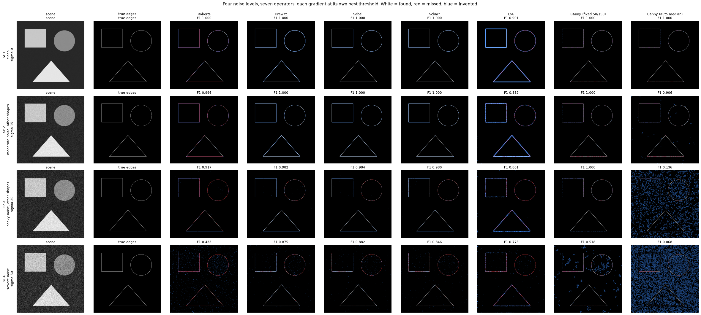
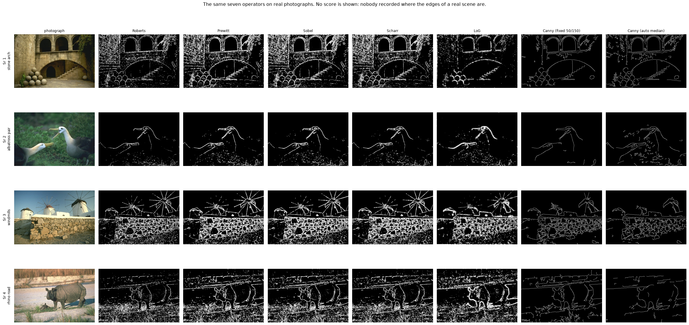
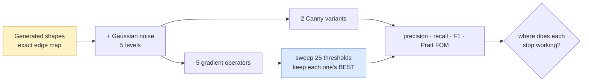

# 14 · Edge detectors — classical computer vision

[](https://www.python.org/)
[](https://opencv.org/)
[](#)
[](#)

Roberts, Prewitt, Sobel, Scharr, Laplacian-of-Gaussian and Canny, each at **its
own best threshold** — because a fixed threshold across operators whose
magnitudes normalise differently is a comparison of normalisation.

The shapes are generated, so the true edge map is exact and precision and recall
are real numbers rather than judgements.

**No neural network, no training, no GPU.**

---

## Results

Four noise levels, seven operators. **White = found, red = missed, blue =
invented** — because a missing edge and an invented one look identical in a
binary map and are not the same mistake.



| Sr | Scene | Roberts | Prewitt | **Sobel** | Scharr | LoG | **Canny (fixed)** | **Canny (auto)** |
|---:|---|---:|---:|---:|---:|---:|---:|---:|
| 1 | clean · sigma 0 | 1.000 | 1.000 | 1.000 | 1.000 | 0.901 | 1.000 | 1.000 |
| 2 | moderate · sigma 15 | 0.996 | 1.000 | 1.000 | 1.000 | 0.882 | 1.000 | **0.906** |
| 3 | heavy · sigma 30 | 0.917 | 0.982 | 0.984 | 0.980 | 0.861 | 1.000 | **0.136** |
| 4 | severe · sigma 50 | **0.433** | 0.875 | **0.882** | 0.846 | 0.775 | **0.518** | **0.068** |

> **Row 1 is why this comparison is run under noise at all.** On a clean scene
> five of the seven score **1.000**. A study that compared edge detectors on
> noise-free synthetic shapes would conclude they are interchangeable — the
> wrong conclusion, reached honestly.

> **The "automatic Canny" recipe collapses: 1.000 → 0.136.** Setting the
> hysteresis thresholds to 0.66 and 1.33 times the image *median* is a widely
> copied snippet. The median of a noisy image is not a statistic about its
> edges, so as noise rises the thresholds fall toward it and the detector
> accepts everything. The blue in that column is invented edges — you can watch
> the failure happen across the rows. **Fixed thresholds hold at 1.000 through
> the same noise.**

> **And then the ranking inverts.** At sigma 50 the fixed Canny that was perfect
> at sigma 30 drops to **0.518**, while plain Sobel — beaten at every lower
> level — finishes best at **0.882**. Canny's non-maximum suppression thins
> edges to one pixel, which is what makes it precise and what makes it brittle:
> once noise moves the maximum, the whole thin edge moves with it.

> **Roberts has no smoothing in it.** A 2×2 kernel cannot average, so noise goes
> straight through: competitive to sigma 15, **0.433** by sigma 50. That is the
> entire reason 3×3 operators exist, as a number.

### The same operators on real photographs



**No score is shown here, deliberately.** Nobody recorded where the edges of a
real scene are, so any precision or recall against these would be invented. They
are here to show the operators working on images nobody constructed for them.

### An F1 without a tolerance is not a number

The *same* detections, scored five ways — the only thing that changes is how far
a detected pixel may sit from the true edge and still count:

| Tolerance | Roberts | Prewitt | Sobel | Scharr | **LoG** | Canny |
|---:|---:|---:|---:|---:|---:|---:|
| **0 px** | 0.346 | 0.765 | 0.778 | 0.778 | **0.246** | **0.801** |
| 1 px | 0.999 | 0.999 | 0.999 | 0.999 | 0.621 | 1.000 |
| **2 px** *(used here)* | 1.000 | 1.000 | 1.000 | 1.000 | 0.901 | 1.000 |
| 3 px | 1.000 | 1.000 | 1.000 | 1.000 | **1.000** | 1.000 |
| 5 px | 1.000 | 1.000 | 1.000 | 1.000 | 1.000 | 1.000 |

**LoG scores 0.246 or 1.000 depending only on the tolerance.** At 0 px it looks
like the worst operator here by a factor of three; at 3 px it is tied first.
Nothing about its detections changed. A second-derivative operator places its
zero crossing a pixel or so off the true step, and whether that counts is a
convention — which most papers reporting an F1 do not state.

This project uses **2 px** and says so in every table.

### How the scenes were chosen

Twelve scenes across four noise bands. The one kept from each band is the one
where the operators **disagree most**, since a scene they all agree on carries
no information:

```
scene candidate clean · sigma 0                        keep — best F1 1.000, worst 0.901  [clean]
scene candidate light noise · sigma 5                  keep — best F1 1.000, worst 0.897  [light]
scene candidate moderate noise · sigma 15              keep — best F1 1.000, worst 0.885  [moderate]
scene candidate heavy noise · sigma 30                 keep — best F1 1.000, worst 0.136  [heavy]
scene candidate severe noise · sigma 50                keep — best F1 0.882, worst 0.068  [severe]
```

---

## What it does



Each gradient operator gets its **own** threshold sweep. Handing them all the
same number would compare how each normalises its magnitude, not how well each
finds an edge.

---

## Problems hit, and how they were solved

### A flat image with an edge at every pixel

`_magnitude` normalised by `max(m.max(), EPS)` — the usual defensive idiom for
avoiding a divide by zero. On an image with **no edges** it does the opposite of
what it looks like.

The convolution of a uniform region is not exactly zero in float32; it is a few
times `1e-8` of rounding. That is smaller than `EPS = 1e-6`, so the guard
divides by `EPS` and scales pure rounding up by two orders of magnitude.

```python
# WRONG - on a blank image, returns a constant 0.119 everywhere
return m / max(float(m.max()), EPS)

# RIGHT - no gradient means no edges
peak = float(m.max())
if peak <= EPS:
    return np.zeros_like(m)
return m / peak
```

Measured: a uniform mid-grey image came back with a **constant magnitude of
0.119 at every pixel** — a detector confidently reporting an edge across a blank
frame, with no error and no warning. It was found by
`test_a_flat_image_has_no_edges`, which exists because "does nothing on nothing"
is the cheapest property to check and the easiest to get wrong.

---

## Limitations

* **The scene is synthetic shapes.** Exact ground truth is the point, and the
  price is that real edges — texture boundaries, soft shadows, occlusions — are
  absent. The real-photograph figure is shown and never scored for exactly that
  reason.
* **Only Gaussian noise.** Impulse noise would rank these differently again;
  that comparison is project 13's.
* **Each operator gets its best threshold, which no deployed system has.** These
  numbers are ceilings. `Canny (auto median)` is the only entry that has to
  choose its own thresholds, which is part of why it does so badly — and also
  the honest way round, since it is the only one claiming to.

---

## Tests

14 tests, run with `pytest projects/14_edge_detectors/tests -q`. They pin the
operators' contracts (a flat image has no edges, a step edge is found), the
harness (every operator gets its own best threshold), and the findings: that a
clean scene cannot separate the operators, that the auto-Canny recipe collapses
under noise, that the matching tolerance changes the ranking, and that Roberts
degrades worst because it has no smoothing.

---

## Keywords

edge detection · Sobel · Prewitt · Roberts cross · Scharr · Laplacian of
Gaussian · Canny · hysteresis thresholding · non-maximum suppression · Pratt
figure of merit · precision recall F1 · edge matching tolerance · classical
computer vision · no deep learning · OpenCV · Python · CPU only · reproducible
image processing experiments

## References

* Canny, *A Computational Approach to Edge Detection*, IEEE TPAMI 1986.
* Marr & Hildreth, *Theory of Edge Detection*, Proc. R. Soc. B 1980.
* Pratt, *Digital Image Processing*, the figure of merit.
* Scharr, *Optimal Operators in Digital Image Processing*, 2000.
