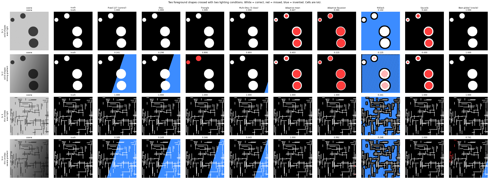
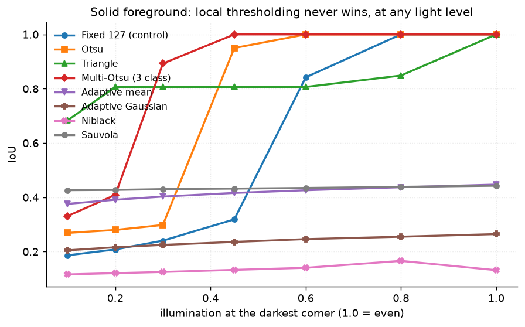
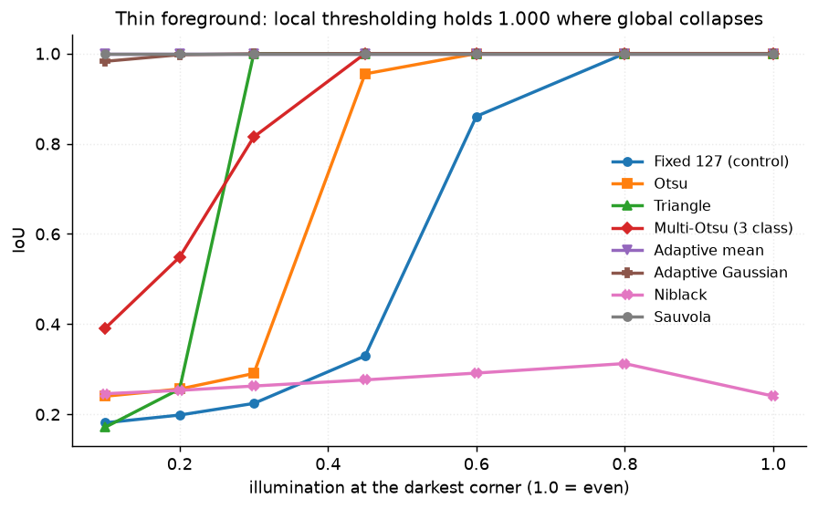

# 15 · Thresholding family — classical computer vision

[](https://www.python.org/)
[](https://opencv.org/)
[](#)
[](#)

Eight ways to split an image into two classes — fixed, Otsu, triangle,
multi-Otsu, two adaptive variants, Niblack and Sauvola — plus an **oracle** that
finds the best global cut by exhaustive search using the ground truth.

The received wisdom is "use adaptive thresholding when the lighting is uneven."
That turns out to be half a sentence.

**No neural network, no training, no GPU.**

---

## Results

Two foreground **shapes** crossed with two **lighting** conditions. White =
correct, red = missed, blue = invented. Cells are IoU.



| Sr | Scene | Fixed | **Otsu** | Triangle | Multi-Otsu | **Adaptive mean** | Adapt. Gauss | Niblack | **Sauvola** | **Oracle** |
|---:|---|---:|---:|---:|---:|---:|---:|---:|---:|---:|
| 1 | solid shapes · even light | 1.000 | **1.000** | 1.000 | 1.000 | 0.447 | 0.265 | 0.132 | 0.443 | 1.000 |
| 2 | solid shapes · strong gradient | 0.241 | **0.298** | 0.806 | 0.893 | 0.403 | 0.225 | 0.125 | 0.430 | **1.000** |
| 3 | thin strokes · even light | 1.000 | **1.000** | 1.000 | 1.000 | 1.000 | 1.000 | 0.241 | 1.000 | 1.000 |
| 4 | thin strokes · severe gradient | 0.189 | **0.249** | 0.346 | 0.443 | **1.000** | 0.992 | 0.248 | **1.000** | **0.741** |

> **Whether local thresholding wins depends on the *shape* of the foreground,
> not on the lighting.** Rows 2 and 4 have the **same** illumination problem.
> On thin strokes Sauvola scores **1.000** against Otsu's 0.249 — it wins by
> 0.75. On solid shapes it scores **0.430** against Otsu's 0.298 — barely
> better, and still bad.
>
> The reason is geometric and has nothing to do with light. A local method
> compares a pixel to a 31 px window. A 3 px stroke always has background in
> that window; **the interior of a filled circle never does**, so there is
> nothing to compare against and the shape is hollowed out to a ring. Row 1
> shows it costing 0.55 IoU under perfectly even light, where illumination
> cannot be the explanation.

> **Row 2 and row 4 fail for opposite reasons, and the oracle is what tells them
> apart.** In row 2 the oracle reaches **1.000** — a single global cut separates
> the two populations perfectly — and Otsu finds 0.298. *The threshold was
> there; Otsu's criterion picked the wrong one.* In row 4 the oracle only
> reaches **0.741**, so no global threshold can do better, and Sauvola gets
> 1.000 by not being global.
>
> Without the oracle both rows read as "Otsu failed under bad lighting", and
> only one of them is that.

### The crossover, swept




Same seven methods, same seven light levels, two foreground shapes. On solid
shapes the local family is a flat line near 0.4 that never crosses anything. On
thin strokes it is a flat line at **1.000** that everything else falls beneath.

### How the scenes were chosen

Twelve scenes, crossing shape × lighting, plus noise and class-imbalance
variants. Kept per family: the scene where the methods **disagree most**, since
one they all agree on carries no information.

```
scene candidate solid shapes · even light            keep — best IoU 1.000, worst 0.132, oracle 1.000  [solid, even]
scene candidate solid shapes · slight gradient       keep — best IoU 1.000, worst 0.166, oracle 1.000  [solid, even]
scene candidate solid shapes · strong gradient       keep — best IoU 0.893, worst 0.125, oracle 1.000  [solid, uneven]
scene candidate solid shapes · severe gradient       keep — best IoU 0.775, worst 0.118, oracle 0.788  [solid, uneven]
scene candidate thin strokes · even light            keep — best IoU 1.000, worst 0.241, oracle 1.000  [thin, even]
scene candidate thin strokes · slight gradient       keep — best IoU 1.000, worst 0.313, oracle 1.000  [thin, even]
scene candidate thin strokes · strong gradient       keep — best IoU 1.000, worst 0.224, oracle 1.000  [thin, uneven]
scene candidate thin strokes · severe gradient       keep — best IoU 1.000, worst 0.189, oracle 0.741  [thin, uneven]
scene candidate solid shapes · even light, noisy     keep — best IoU 0.986, worst 0.141, oracle 0.986  [noisy]
scene candidate thin strokes · even light, noisy     keep — best IoU 0.987, worst 0.247, oracle 0.987  [noisy]
scene candidate solid shapes · few and small         keep — best IoU 1.000, worst 0.052, oracle 1.000  [imbalanced]
scene candidate thin strokes · sparse                keep — best IoU 1.000, worst 0.039, oracle 1.000  [imbalanced]
```

---

## Problems hit, and how they were solved

### 1 · The scene could not show what adaptive thresholding is for

The project began with one scene kind: filled circles. Swept across every
illumination level, the adaptive family scored **0.2 – 0.45 and never won**, and
the obvious conclusion was that local thresholding simply loses.

That conclusion was about geometry, not lighting. A 31 px window inside a filled
circle sees no background, so the local threshold lands on the foreground's own
noise. **The experiment could not demonstrate the thing the methods exist for**,
and a sweep over the wrong axis looked like a result.

Adding a `kind="thin"` scene — 3 px strokes, narrower than the window — produced
the crossover in one run. The finding is better for it: not *adaptive wins under
bad light*, but *adaptive wins when the foreground is thinner than the window*,
which is a statement you can check before choosing a method.

### 2 · The oracle was a floor instead of a ceiling

`thresh_best_global` searched every cut from 1 to 254 — in one direction:

```python
# WRONG - this scene is dark-on-light, so no value of t expresses the answer
score = iou((gray > t).astype(np.uint8) * 255, truth)
```

"Foreground is above the cut" is a convention, not a property:
`cv2.THRESH_BINARY` and `THRESH_BINARY_INV` are the same operation. Searching
one polarity, the oracle settled on a degenerate threshold scoring **0.122 IoU**
— *below every method it exists to bound*.

A ceiling that sits under the thing it bounds is worse than no ceiling. It made
every row read "no global threshold was available", which is the opposite of
what row 2 actually shows. Pinned by
`test_the_oracle_is_a_ceiling_over_every_global_method`.

---

## Limitations

* **The local methods use one window size (31 px) and one `k`.** That window is
  the thing being compared against the stroke width, so the result is really
  about the *ratio* of the two. A 9 px window would move the crossover, not
  remove it.
* **Niblack is at its textbook `k = -0.2`** and speckles badly on flat
  background — 0.13 IoU. Sauvola's dynamic-range term is the documented fix and
  scores 0.44 on the same scene. Both are reported rather than tuning Niblack
  until the comparison disappears.
* **The scene is synthetic.** Exact ground truth is the point; real document
  images have show-through, JPEG ringing and non-uniform ink, none of which are
  here. Project 01 runs the same binarisers on real photographed pages.

---

## Tests

12 tests, run with `pytest projects/15_thresholding_family/tests -q`. They pin
the scene's contract (thin strokes really are narrower than the window, solid
shapes really are wider), that the oracle bounds every global method, and the
findings: that local thresholding wins on strokes and loses on solids under
identical light, that it hollows solid shapes out, that Otsu can fail where a
perfect cut exists, and that sometimes no global cut exists at all.

---

## Keywords

image thresholding · binarisation · Otsu · triangle threshold · multi-Otsu ·
adaptive threshold · Niblack · Sauvola · local thresholding · document
binarisation · uneven illumination · class imbalance · IoU · classical computer
vision · no deep learning · OpenCV · Python · CPU only · reproducible image
processing experiments

## References

* Otsu, *A Threshold Selection Method from Gray-Level Histograms*, IEEE SMC 1979.
* Niblack, *An Introduction to Digital Image Processing*, 1986.
* Sauvola & Pietikäinen, *Adaptive Document Image Binarization*, Pattern
  Recognition 2000.
* Zack, Rogers & Latt, *Automatic Measurement of Sister Chromatid Exchange
  Frequency*, J. Histochem. Cytochem. 1977 — the triangle method.
