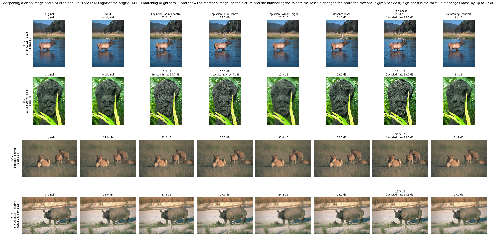
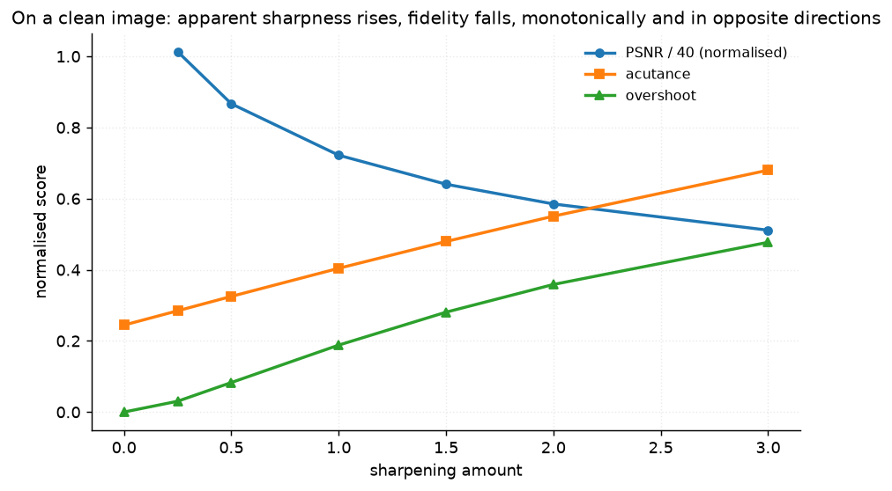
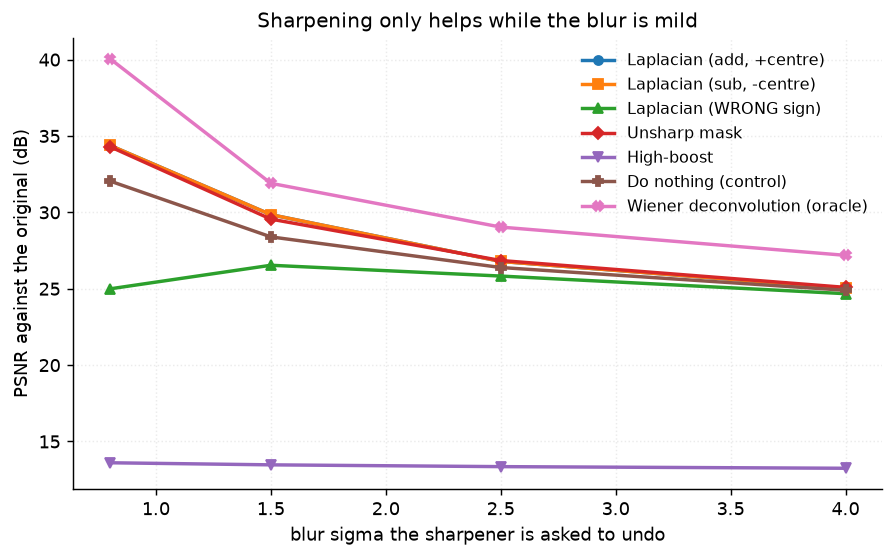
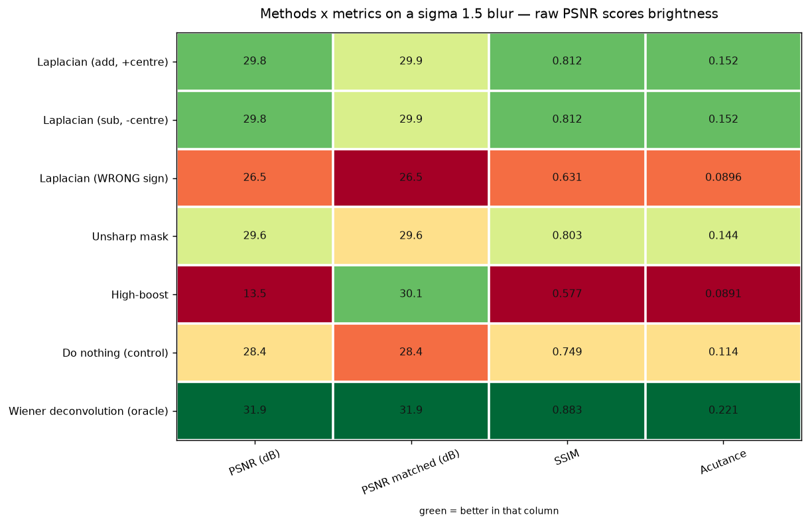

# 16 · Sharpening — classical computer vision

[](https://www.python.org/)
[](https://opencv.org/)
[](#)
[](#)

Five sharpening operators — the Laplacian in both sign conventions, a
deliberately wrong-signed third, unsharp mask and high-boost — plus a **Wiener
deconvolution oracle** handed the true blur kernel *and* the clean image, so the
table has a real ceiling as well as a floor. Getting that ceiling to actually be
one took two fixes, both below.

> **The claim under test:** sharpening adds *contrast*, not *information*.

**No neural network, no training, no GPU.**

---

## Results

Four different subjects. Rows 1–2 are **clean** photographs, where there is
nothing to restore; rows 3–4 are the **same operators on a blurred** image,
where there is. Cells are PSNR against the original **after matching
brightness**, and show the matched image, so the picture and the number agree —
the raw score is given wherever the rescale changed it.



| Sr | Scene | Laplacian (add) | Laplacian (sub) | Laplacian (WRONG sign) | Unsharp mask | High-boost | Do nothing |
|---:|---|---:|---:|---:|---:|---:|---:|
| 1 | elk in water · clean, detail 11 | 22.5 dB | 22.5 dB | 21.7 dB | **31.1 dB** | 25.3 dB <br>*(raw 13.6)* | **∞** |
| 2 | carved stone · clean, detail 45 | 15.2 dB <br>*(raw 14.7)* | 15.2 dB <br>*(raw 14.7)* | 12.3 dB | **23.0 dB** | 18.2 dB <br>*(raw 13.7)* | **∞** |
| 3 | lionesses · blurred, sigma 1.5 | 33.2 dB | 33.2 dB | 30.0 dB | 33.0 dB | **33.5 dB** <br>*(raw 13.8)* | 31.9 dB |
| 4 | rhino on gravel · blurred, detail 23, sigma 1.5 | 27.3 dB | 27.3 dB | 24.2 dB | 26.9 dB | **27.5 dB** <br>*(raw 10.5)* | 25.9 dB |

> **On a clean image every sharpener loses to doing nothing, and the loss grows
> with detail.** Rows 1 and 2 have an infinite control, because the control *is*
> the original. The best real method reaches 31.1 dB on the smooth elk and 23.0
> dB on the carved stone — **8 dB worse on the more detailed picture**, which is
> the one that looks like it needs sharpening most. There is no information to
> restore in either, so every operator can only move away from the truth.
>
> Rows 3 and 4 are the same operators with something genuinely to recover, and
> there they beat the control by 1.6 dB. **Identical code, opposite verdicts.**

### Apparent sharpness rises while fidelity falls

Averaged over all six photographs, sharpening a clean image:

| Method | PSNR (dB) | SSIM | **Acutance** | Overshoot | RMS contrast | Time (ms) |
|---|---:|---:|---:|---:|---:|---:|
| Laplacian (add, +centre) | 20.19 | 0.6437 | **0.58564** | 0.4582 | 0.1994 | 3.7 |
| Laplacian (sub, -centre) | 20.19 | 0.6437 | **0.58564** | 0.4582 | 0.1994 | 3.5 |
| Laplacian (WRONG sign) | 18.90 | **0.1494** | 0.30204 | 0.2230 | 0.1628 | 3.7 |
| Unsharp mask | **28.88** | **0.9056** | 0.40415 | 0.1882 | 0.1651 | 4.5 |
| High-boost | 13.69 | 0.7662 | 0.28677 | **0.8972** | 0.0965 | 4.1 |
| Do nothing (control) | **∞** | 1.0000 | 0.24452 | 0.0000 | 0.1465 | 0.016 |

The best sharpener reaches **2.40× the control's acutance** — and pays 20.2 dB
for it against a control that cannot be beaten. Swept across strength, the two
quantities move in opposite directions **monotonically**, which is the claim
stated as a picture:



| Amount | 0.0 | 0.25 | 0.5 | 1.0 | 1.5 | 2.0 | 3.0 |
|---|---:|---:|---:|---:|---:|---:|---:|
| PSNR (dB) | ∞ | 40.5 | 34.7 | 28.9 | 25.6 | 23.4 | **20.5** |
| Acutance | 0.245 | 0.285 | 0.325 | 0.404 | 0.480 | 0.551 | **0.680** |
| Overshoot | 0.000 | 0.030 | 0.083 | 0.188 | 0.281 | 0.359 | **0.477** |

---

## Three findings the tables were changed to expose

### 1 · Raw PSNR scored a brightness decision, not a sharpening one

High-boost is `A*I - blur(I)`. In a flat region `blur(I) == I`, so the output is
`(A-1)*I` — at the textbook `A = 1.5`, **every flat area comes back at half
brightness**. Pinned by `test_high_boost_halves_a_flat_region`.

Scored raw on a sigma 1.5 blur it came **last**, at 13.47 dB. Rescale its mean
back to the input's — changing no structure at all — and it comes **first**:

| Method | PSNR raw (dB) | **PSNR matched (dB)** | SSIM | Acutance |
|---|---:|---:|---:|---:|
| Laplacian (add, +centre) | 29.85 | 29.85 | 0.8122 | 0.15231 |
| Laplacian (sub, -centre) | 29.85 | 29.85 | 0.8122 | 0.15231 |
| Laplacian (WRONG sign) | 26.54 | 26.53 | 0.6311 | 0.08965 |
| Unsharp mask | 29.56 | 29.55 | 0.8031 | 0.14392 |
| High-boost | **13.47** | **30.08** | 0.5773 | 0.08906 |
| Do nothing (control) | 28.40 | 28.39 | 0.7493 | 0.11378 |
| **Wiener deconvolution (oracle)** | **31.90** | **31.90** | **0.8833** | **0.22081** |

**+16.61 dB from brightness alone**, last place to first, with not one pixel of
its output changed. Every other row moves by less than 0.01 dB between the two
columns, which is what makes the comparison fair rather than merely charitable.

The formula is left exactly as the textbooks write it. The *scoring* is what
changed.

### 2 · Acutance cannot tell a sharpener from a sign error

`Laplacian (WRONG sign)` adds a `-4`-centre kernel, which is the classic way to
get this wrong. The expectation going in — written in this file's own docstring
— was that it **blurs**. On a sharp photograph it does not:

* **acutance 0.302** against the original's 0.245 — it goes *up*;
* **SSIM 0.149** against the correct pairing's 0.644 — it is visibly damage.

It leaves an inverted rim either side of every contour, and a gradient-magnitude
metric counts that rim as sharpness. So the no-reference number everyone reaches
for to confirm "this looks sharper" **reports success on a bug**. Only a
comparison against the truth catches it.

On an already-*blurred* input it does soften further (acutance 0.090 against the
blurred input's 0.114), which is where the folklore comes from. Both directions
are in the tables above; neither is visible without a reference. Pinned by
`test_acutance_cannot_tell_a_sharpener_from_its_sign_error`.

### 3 · Sharpening's gain collapses with the blur — the information does not



| Blur sigma | Blurred input | Best sharpener | Its gain | **Oracle** | **Oracle's gain** |
|---|---:|---:|---:|---:|---:|
| 0.8 | 32.05 dB | 34.38 dB | **+2.33** | 40.06 dB | **+8.01** |
| 1.5 | 28.40 dB | 29.85 dB | +1.45 | 31.90 dB | +3.51 |
| 2.5 | 26.39 dB | 26.85 dB | +0.46 | 29.04 dB | +2.65 |
| 4.0 | 24.90 dB | 25.09 dB | **+0.19** | 27.19 dB | **+2.29** |

**What a sharpener recovers collapses 12×** between sigma 0.8 and sigma 4.0 —
from +2.33 dB to +0.19 dB, which is nothing. Pinned by
`test_sharpening_only_helps_while_the_blur_is_mild`.

**What was recoverable falls only 3.5×**, and never below +2.29 dB. At sigma 4.0
the oracle is still **2.10 dB above the best sharpener**, on an image every
sharpening filter has effectively given up on.

That gap is the project's answer. A sharpener amplifies whatever survived the
blur; it has no idea what the blur *was*, so it cannot invert it. The
deconvolution does, and the detail it pulls back at sigma 4.0 is detail that was
in the image the whole time — the filters simply had no way to reach it.

**Sharpening adds contrast, not information.** The oracle is what makes that
sentence measurable rather than rhetorical: without a ceiling, the shrinking
gains above read as "the detail is gone", and at sigma 4.0 most of it is not.

---

## How the scenes were chosen

Twelve candidates: six photographs spanning a **25× range of detail density**
(albatross pair, detail 7 → carved stone, detail 45), each in clean and blurred
form. Every candidate is scored, and the four rows are then assigned one per
`{smooth, detailed} × {clean, blurred}` family **under a subject-uniqueness
constraint**.

```
scene candidate albatross pair · clean · smooth, detail 7      keep — acutance 0.138 -> 0.302, best matched PSNR inf dB  [smooth, clean]
scene candidate lionesses · clean · detail 9                   keep — acutance 0.143 -> 0.365, best matched PSNR inf dB  [smooth, clean]
scene candidate deer in scrub · clean · detail 17              keep — acutance 0.239 -> 0.596, best matched PSNR inf dB  [detailed, clean]
scene candidate carved stone · clean · detail 45               keep — acutance 0.462 -> 1.047, best matched PSNR inf dB  [detailed, clean]
scene candidate albatross pair · blurred · smooth, sigma 1.5   keep — acutance 0.084 -> 0.106, best matched PSNR 34.7 dB  [smooth, blurred]
scene candidate lionesses · blurred · sigma 1.5                keep — acutance 0.071 -> 0.094, best matched PSNR 33.5 dB  [smooth, blurred]
scene candidate deer in scrub · blurred · detail 17, sigma 1.5 keep — acutance 0.109 -> 0.150, best matched PSNR 29.1 dB  [detailed, blurred]
scene candidate carved stone · blurred · detail 45, sigma 1.5  keep — acutance 0.192 -> 0.260, best matched PSNR 23.2 dB  [detailed, blurred]
scene candidate rhino on gravel · clean · detail 23            keep — acutance 0.310 -> 0.760, best matched PSNR inf dB  [detailed, clean]
scene candidate rhino on gravel · blurred · detail 23, sigma 1.5 keep — acutance 0.143 -> 0.192, best matched PSNR 27.5 dB  [detailed, blurred]
scene candidate elk in water · clean · detail 11               keep — acutance 0.173 -> 0.443, best matched PSNR inf dB  [smooth, clean]
scene candidate elk in water · blurred · detail 11, sigma 1.5  keep — acutance 0.084 -> 0.111, best matched PSNR 32.6 dB  [smooth, blurred]
```

The uniqueness constraint was added because scoring each family independently
picked **the elk for both smooth rows and the carved stone for both detailed
rows** — four rows showing two subjects, which is a comparison of *conditions*
dressed up as a comparison of pictures.



---

## Problems hit, and how they were solved

### 1 · The oracle was beaten by a 3×3 kernel — twice, for two different reasons

**First**, `deconvolve_oracle` ran at a fixed `nsr = 0.01`. At that setting the
Wiener result scored **32.86 dB** while a plain Laplacian reached **33.28** — a
"ceiling" under the thing it bounds, which is worse than no ceiling. An oracle
is allowed to use the ground truth; that is what makes it an oracle.
`deconvolve_oracle_best` now sweeps `nsr` over six decades. Fixed-nsr Wiener is
a *method*, not a ceiling.

**Second**, and less visibly: the FFT treats an image as periodic, so the last
row was deconvolved as though the first row were its neighbour. On `elk_water` —
bright sky at the top, dark water at the bottom — that seam is a step edge the
height of the frame, and its ringing spread across the picture. The oracle
scored **30.68 dB against the 30.84 dB blurred image it had been handed**, below
its own floor, while a 3×3 Laplacian reached 32.33.

Averaged over six photographs this appeared as the oracle trailing the Laplacian
by **0.04 dB** — indistinguishable from rounding, and it sat in the results table
unnoticed. Checking each image *separately* is what exposed it. Reflect-padding
before the transform fixes it (34.41 dB on that image), and the oracle went from
29.81 dB to **31.90 dB** overall — it had been understating the ceiling on all
six. Pinned by `test_the_oracle_is_a_ceiling_over_every_method`, which now
asserts per image rather than on the mean.

### 2 · The oracle was scored on a third as much

It deconvolved in **grayscale** and was scored against a grayscale reference. A
grayscale reconstruction has one third as much to get wrong, so its PSNR was not
comparable with any other row in the table — it was flattering itself by a
margin nobody had measured. It now runs per channel. Pinned by
`test_the_oracle_is_scored_on_the_same_thing_as_the_methods`.

### 3 · `--amount` was silently driving high-boost off a cliff

In `infer.py`, `--amount` was passed positionally to every method. High-boost's
second parameter is `boost`, a *different quantity* — `A = 1.0` is a pure
high-pass, i.e. a nearly black image. The default `--amount 1.0` therefore
turned that row into noise (4.65 dB, SSIM 0.005) and it read as a property of
high-boost. Methods are now matched by parameter *name*.

### 4 · A claim in the docstring that the measurements contradicted

`sharpen_laplacian_wrong_sign` was documented as "This *blurs*". It does not, on
a sharp image — see finding 2. The docstring was written from the textbook, the
number came from the code, and the code was right. Corrected rather than left
standing.

---

## Try it on your own image

```bash
python infer.py photo.jpg                # acutance + overshoot, no invented PSNR
python infer.py photo.jpg --simulate     # blur by a known kernel, score everything
python infer.py photo.jpg --method "Unsharp mask" --amount 2.0 --out sharp.png
```

With a real photograph there is no un-blurred original, so **no PSNR is
printed** — any fidelity number there would be invented. What is printed instead
is acutance (which every sharpener raises, including the buggy one) and
overshoot (how much of that gain was paid for in haloing). `--simulate` blurs by
a known kernel so the methods and the oracle can be scored properly.

---

## Limitations

* **The blur is a known, isotropic Gaussian.** Real blur is motion, defocus or
  atmospheric, often spatially varying. The oracle's advantage here is a *lower*
  bound on how much a real blind deconvolution would struggle.
* **Acutance is a whole-image mean.** It cannot distinguish a genuinely sharper
  edge from a halo beside one — which is finding 2, stated as a limitation.
  `overshoot` is reported beside it for exactly that reason.
* **One sigma (1.5) for both unsharp mask and high-boost.** The radius chooses
  *which* frequencies are amplified, so a different sigma moves the numbers. It
  does not move the direction of any curve here.
* **Six photographs.** Enough to span the detail axis that changes the answer;
  not enough to claim a population mean.

---

## Tests

12 tests, run with `pytest projects/16_sharpening/tests -q`. They pin that the
two Laplacian sign conventions are literally the same operator, that high-boost
halves a flat region (and that matching the mean recovers more than 10 dB of
it), that the oracle is scored per channel and is a genuine ceiling **on every
image individually**, and the findings: that sharpening a clean image always loses, that fidelity and apparent
sharpness move in opposite directions monotonically, that raw and matched PSNR
disagree about the winner, and that acutance cannot detect a sign error.

---

## Keywords

image sharpening · unsharp mask · high-boost filter · Laplacian sharpening ·
acutance · overshoot · halo artefacts · Wiener deconvolution · deblurring ·
oracle ceiling · PSNR · SSIM · no-reference quality metrics · classical computer
vision · no deep learning · OpenCV · Python · CPU only · reproducible image
processing experiments

## References

* Gonzalez & Woods, *Digital Image Processing*, ch. 3 — the Laplacian sign
  conventions and the high-boost formulation used verbatim here.
* Wiener, *Extrapolation, Interpolation, and Smoothing of Stationary Time
  Series*, 1949.
* Wang, Bovik, Sheikh & Simoncelli, *Image Quality Assessment: From Error
  Visibility to Structural Similarity*, IEEE TIP 2004.
