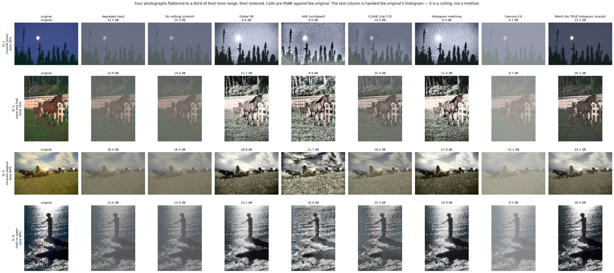
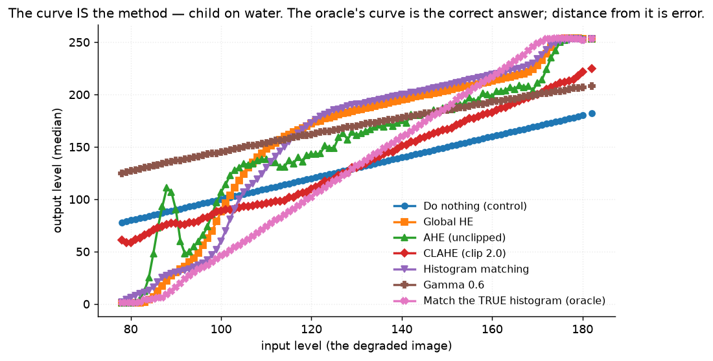
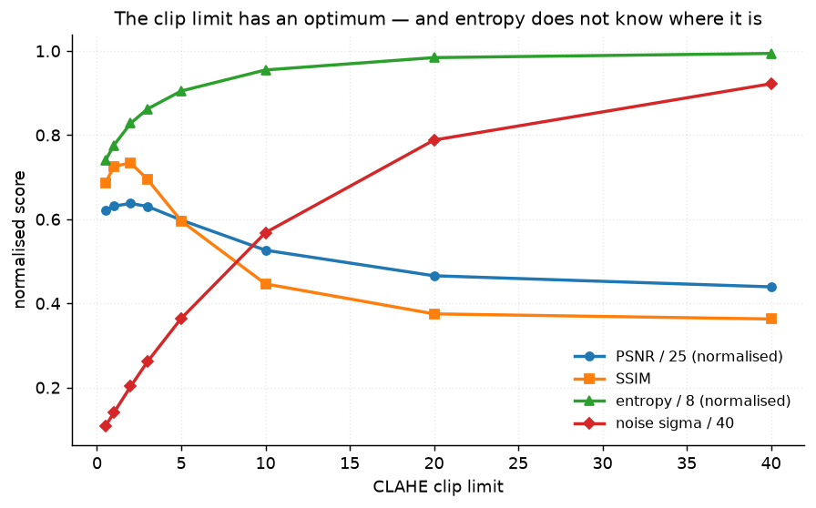
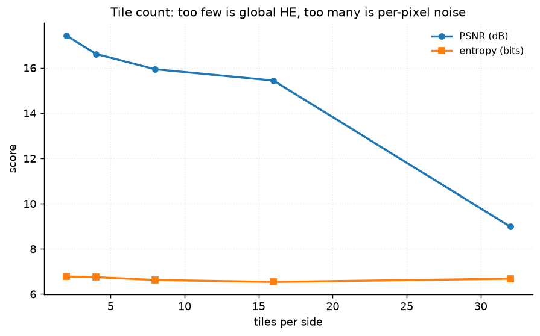
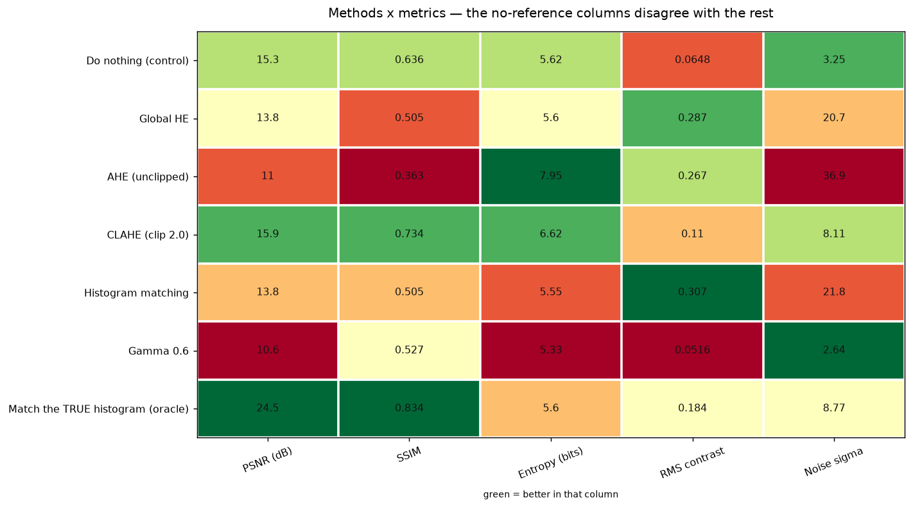

# 17 · Histogram equalisation — classical computer vision

[](https://www.python.org/)
[](https://opencv.org/)
[](#)
[](#)

Five ways to redistribute tone — global HE, unclipped AHE, CLAHE, histogram
matching and a plain gamma curve — plus an **oracle** handed the original's own
histogram, which is the best any tone curve can possibly do.

Equalisation flattens the intensity histogram. That is a *statistical* goal, not
a perceptual one, and the gap between them is the project.

**No neural network, no training, no GPU.**

---

## Results

Four photographs flattened to a third of their tone range, then restored. Cells
are PSNR against the original; the last column is the oracle, which is a ceiling
rather than a competitor.



| Sr | Scene | Degraded | Do nothing | Global HE | AHE (unclipped) | CLAHE (clip 2) | Hist. matching | Gamma 0.6 | **Oracle** |
|---:|---|---:|---:|---:|---:|---:|---:|---:|---:|
| 1 | moonlit pines · tone 25% | 15.3 dB | **15.3** | 9.4 | 8.6 | 14.3 | 9.3 | 9.7 | **22.2** |
| 2 | mare and foal · tone 76% | 14.9 dB | 14.9 | 11.1 | 9.9 | **15.4** | 11.4 | 9.7 | **26.2** |
| 3 | covered wagons · tone 84% | 16.4 dB | 16.4 | **18.8** | 11.7 | 16.5 | 17.9 | 12.2 | **23.1** |
| 4 | child on water · tone 98% | 13.0 dB | 13.0 | 15.1 | 10.9 | 15.3 | **16.9** | 9.5 | **30.4** |

> **On row 1 the best thing any method could do was nothing at all.** Every
> equaliser scores below the untouched image, and the winner changes with every
> row: doing nothing, then CLAHE, then global HE, then histogram matching. There
> is no "use adaptive when the light is bad" rule visible here.
>
> **And the oracle is 5.5–17.4 dB above all of them.** It is the *same family* —
> one monotonic map from input grey to output grey — handed the right target
> instead of guessing one. So the methods are not limited by what a tone curve
> can do. They are choosing the wrong curve.

Averaged over all eleven photographs:

| Method | PSNR (dB) | SSIM | Entropy (bits) | RMS contrast | Noise sigma | Time (ms) |
|---|---:|---:|---:|---:|---:|---:|
| Do nothing (control) | 15.35 | 0.6356 | 5.615 | 0.0648 | **3.25** | 0.03 |
| Global HE | 13.83 | 0.5049 | 5.598 | 0.2871 | 20.66 | 0.45 |
| AHE (unclipped) | **10.98** | **0.3629** | **7.953** | 0.2671 | **36.88** | 0.65 |
| CLAHE (clip 2.0) | **15.94** | **0.7340** | 6.625 | 0.1095 | 8.11 | 0.65 |
| Histogram matching | 13.77 | 0.5054 | 5.551 | **0.3075** | 21.80 | 4.00 |
| Gamma 0.6 | 10.58 | 0.5266 | 5.325 | 0.0516 | 2.64 | 8.81 |
| **Match the TRUE histogram (oracle)** | **24.53** | **0.8335** | 5.596 | 0.1836 | 8.77 | 2.29 |

**Only CLAHE beats doing nothing, and only by 0.59 dB.** The oracle beats it by
**8.59 dB**.

---

## The curve *is* the method

Every row above is one monotonic map from input level to output level. Drawing
that map says more than any metric, because the oracle's curve is the correct
answer and distance from it is the error:



* **Global HE and histogram matching** lift the shadows roughly 50 levels too
  far between inputs 100 and 140, then run out of range and clip.
* **Gamma** barely has a shape — it lifts everything and is nearly flat against
  the oracle's slope, which is why it scores worst of all.
* **AHE** is visibly *non-monotonic*. Its map depends on where the pixel is, so
  the median curve zig-zags; two pixels of the same input brightness come out at
  different levels depending on their neighbours. That is the noise
  amplification, drawn.
* **CLAHE** tracks the oracle closest in the shadows and gives up at the top.

---

## Three findings

### 1 · Entropy is blind to a 9 dB improvement

Entropy is what global HE provably maximises, and it is the metric reached for
when there is no ground truth. Across the eleven photographs the oracle moves
the image **+9.18 dB** closer to the truth. Entropy registers **−0.019 bits** —
and never more than 0.13 bits on any single image, as often down as up.

The ranking is worse than uninformative:

| Ranked by | 1st | 2nd | 3rd | 4th | 5th | 6th | 7th |
|---|---|---|---|---|---|---|---|
| **PSNR** | **Oracle** | CLAHE | Do nothing | Global HE | Hist. match | AHE | Gamma |
| **Entropy** | **AHE** | CLAHE | Do nothing | Global HE | **Oracle** | Hist. match | Gamma |
| **RMS contrast** | Hist. match | Global HE | AHE | Oracle | CLAHE | Do nothing | Gamma |

Entropy's winner is `AHE (unclipped)` — **the worst method in the table**, at
10.98 dB and SSIM 0.363. It puts the oracle, which is correct by construction,
**fifth of seven, below doing nothing**. Three metrics, three different winners,
none of them the same. Pinned by
`test_entropy_is_blind_to_a_nine_decibel_improvement` and
`test_entropy_ranks_the_methods_almost_backwards`.

### 2 · On 5 of 11 photographs, nothing beats doing nothing



| Image | mean luma | Best method's gain over doing nothing |
|---|---:|---:|
| moonlit pines | 66.5 | **−1.01 dB** |
| penguin, dark shore | 69.0 | −0.30 dB |
| ostrich head | 81.3 | −0.24 dB |
| desert arch | 85.4 | −0.17 dB |
| two horses, field | 99.4 | −0.43 dB |
| mare and foal | 84.1 | +0.43 dB |
| beached dinghy | 116.9 | +1.45 dB |
| skiers in woods | 116.4 | +2.36 dB |
| covered wagons | 129.1 | +2.40 dB |
| horse under blossom | 145.6 | +2.69 dB |
| child on water | 97.0 | **+3.89 dB** |

The gain correlates with the original's mean brightness at **+0.73** and with
how much of the tone range it used at **+0.70**. The darker half is where every
method loses — and it is also the half that most looks like it needs equalising.

The oracle gains between **+2.96 and +17.78 dB** on those same images, so the
information was there in every case. Pinned by
`test_on_most_images_nothing_beats_doing_nothing`.

### 3 · Neither of CLAHE's two parameters can be tuned without ground truth

| Clip limit | 0.5 | 1.0 | **2.0** | 3.0 | 5.0 | 10 | 20 | 40 |
|---|---:|---:|---:|---:|---:|---:|---:|---:|
| PSNR (dB) | 15.53 | 15.78 | **15.94** | 15.76 | 14.95 | 13.16 | 11.64 | **10.98** |
| Entropy (bits) | 5.92 | 6.21 | 6.63 | 6.90 | 7.24 | 7.64 | 7.87 | **7.95** |
| Noise sigma | 4.31 | 5.60 | 8.11 | 10.47 | 14.57 | 22.73 | 31.53 | **36.88** |

PSNR has a genuine interior optimum at **clip 2.0**. Entropy rises
**monotonically** to the far end — so tuning on entropy selects clip 40, which
is the **worst setting in the sweep** and is just unclipped AHE. Pinned by
`test_the_clip_limit_has_an_optimum_that_entropy_points_away_from`.



The tile count is worse, because **OpenCV's default is not the best value**:

| Tiles per side | **2** | 4 | **8 (default)** | 16 | 32 |
|---|---:|---:|---:|---:|---:|
| PSNR (dB) | **17.44** | 16.62 | **15.94** | 15.44 | 8.98 |
| Entropy (bits) | 6.78 | 6.75 | 6.63 | 6.54 | 6.68 |

A 2×2 grid beats the 8×8 default by **1.50 dB** on this degradation — and 2×2 is
very nearly global HE, i.e. the least adaptive setting available. Entropy is
flat across the whole useful range (6.54–6.78) and then goes back *up* at 32,
where PSNR has collapsed to 8.98 dB, so it cannot pick this parameter either.

---

## How the images were chosen

Twelve photographs selected by `tools/select_images.py --axis tone`, which
measures the percentage of the 0–255 range the image occupies between its 1st
and 99th percentiles. That is the quantity equalisation acts on, so a pool that
did not vary along it would be the same experiment twelve times. The selection
spreads candidates evenly across the range rather than taking the extremes,
because both the case the method is for and the case it is not for are needed.

```
moonlit_pines       tone 25.5%   desert_arch        tone 59.6%
two_horses_field    tone 66.7%   ostrich_head       tone 71.0%
mare_and_foal       tone 76.1%   horse_blossom      tone 78.4%
covered_wagons      tone 83.5%   skiers_woods       tone 85.5%
penguin_dark_shore  tone 87.8%   beached_dinghy     tone 90.6%
alpine_chalet_snow  tone 93.7%   child_on_water     tone 98.0%
```

**Eleven are scored, not twelve.** `alpine_chalet_snow` is the reference the
`Histogram matching` row matches *to*, so scoring it would hand that method its
own answer on one row. It is excluded rather than left in with a footnote —
pinned by `test_histogram_matching_is_never_handed_its_own_target`.

None of these twelve appears in any other project; `tools/check_image_reuse.py`
enforces that by perceptual hash, not by filename.



---

## Problems hit, and how they were solved

### 1 · The project had no ceiling, so "everything loses" had no explanation

Without the oracle the table says every method scores near or below the
untouched image, and there are two completely different reasons that could be
true: the methods are bad, or the degradation destroyed the information. Those
call for opposite conclusions and the numbers alone cannot separate them.

`eq_match_oracle` matches the histogram of the **clean original**, which is the
same operation as the `Histogram matching` row with the guesswork removed. At
24.53 dB against the best method's 15.94 it settles the question: the
information survived, and the family can reach it. The methods are picking the
wrong curve.

### 2 · A test asserted a finding that held on 5 of 11 images

The first version of `test_flattening_the_histogram_is_not_the_goal` asserted
that the oracle's output has **lower** entropy than global HE's — tidy, and true
on the image it was written against. Across all eleven it holds on **5**.

It was replaced with the claim that survives every image: the oracle gains 9 dB
while entropy moves by hundredths of a bit. That is a weaker-sounding statement
and a much stronger result, because it says entropy is not merely mis-ranking
things, it is not measuring them at all.

### 3 · The images were the four scikit-image samples again

`IMAGES` was `("moon", "coffee", "chelsea", "astronaut", "camera", "retina")` —
the same pictures as several other projects, chosen for nothing in particular.
Two of the six are grayscale, which makes the colour-cast question unaskable,
and none of them was picked for tone distribution, which is the only axis this
project acts on.

---

## Try it on your own image

```bash
python infer.py photo.jpg                 # every method, no invented PSNR
python infer.py photo.jpg --simulate      # flatten it first, then score properly
python infer.py photo.jpg --method "CLAHE (clip 2.0)" --out fixed.png
```

With a real photograph there is no un-degraded original, so **no PSNR is
printed**. What is printed instead is the measurement that predicts whether
equalisation will help at all: how much of the tone range the image already
uses. `--simulate` compresses the range by a known amount so the methods and the
oracle can be scored against a truth.

---

## Limitations

* **The oracle only fixes luminance.** Every method here works on the Y channel
  of YCrCb, which is the fair version — equalising R, G and B independently is
  what produces the lurid output people associate with HE, and is pinned as a
  bug by `test_every_method_leaves_colour_balance_alone`. The consequence is
  that the degradation's chroma compression is *not* undone by any row,
  including the oracle, so all of them are scored against a colour they cannot
  reach. This costs every row roughly equally and is why even 30.4 dB still
  looks slightly washed.
* **One degradation shape.** `low_contrast` compresses linearly toward mid-grey.
  A real flat photograph is usually flat for optical reasons (haze, flare) that
  are not linear — project 04 handles that case with a physical model.
* **CLAHE is reported at its defaults** (clip 2.0, 8×8) in the main table even
  though the sweep shows 2×2 is 1.50 dB better. The defaults are what people
  actually run, and the sweep is directly beneath.
* **Eleven photographs.** Enough to span the tone axis and to show the
  correlation; not enough to quote it to two decimal places.

---

## Tests

15 tests, run with `pytest projects/17_histogram_equalization/tests -q`. They
pin the colour-safety property of every method, the degradation's contract, that
the oracle beats every method **on every image individually**, that the matching
reference is never scored, and the findings: that entropy ranks the methods
almost backwards, that it cannot see a 9 dB improvement, that the clip limit has
an optimum entropy points away from, and that on most of these photographs
nothing beats doing nothing.

---

## Keywords

histogram equalisation · CLAHE · adaptive histogram equalisation · histogram
matching · histogram specification · gamma correction · tone curve · transfer
function · image entropy · no-reference quality metrics · contrast enhancement ·
clip limit · classical computer vision · no deep learning · OpenCV · Python ·
CPU only · reproducible image processing experiments

## References

* Pizer et al., *Adaptive Histogram Equalization and Its Variations*, CVGIP 1987.
* Zuiderveld, *Contrast Limited Adaptive Histogram Equalization*, Graphics Gems
  IV, 1994.
* Gonzalez & Woods, *Digital Image Processing*, ch. 3 — equalisation and
  specification as presented here.
* Martin, Fowlkes, Tal & Malik, *A Database of Human Segmented Natural Images*,
  ICCV 2001 — the BSDS500 photographs this project's pool is drawn from.
