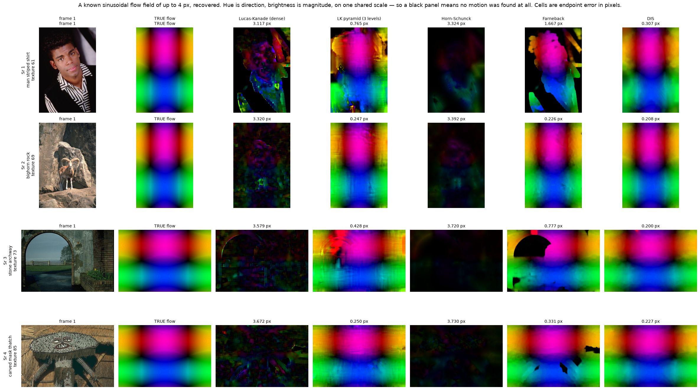
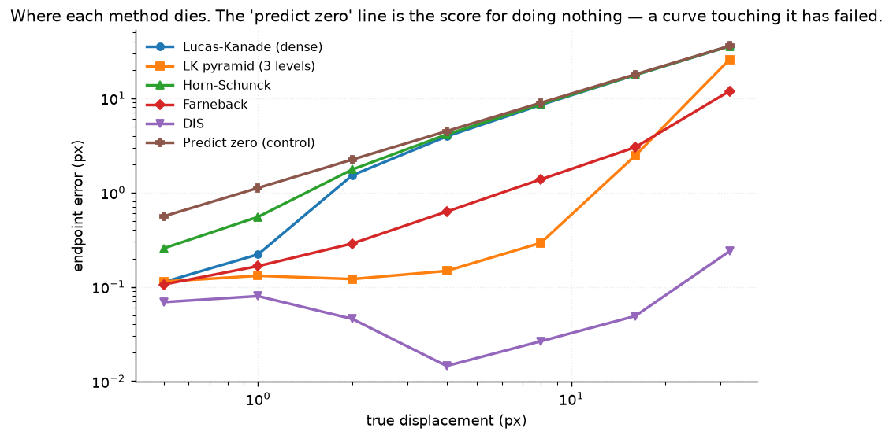
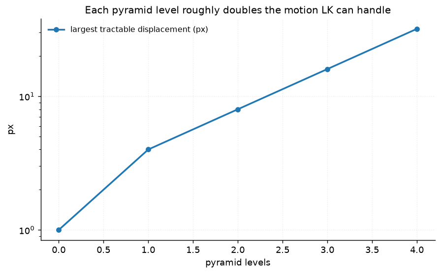
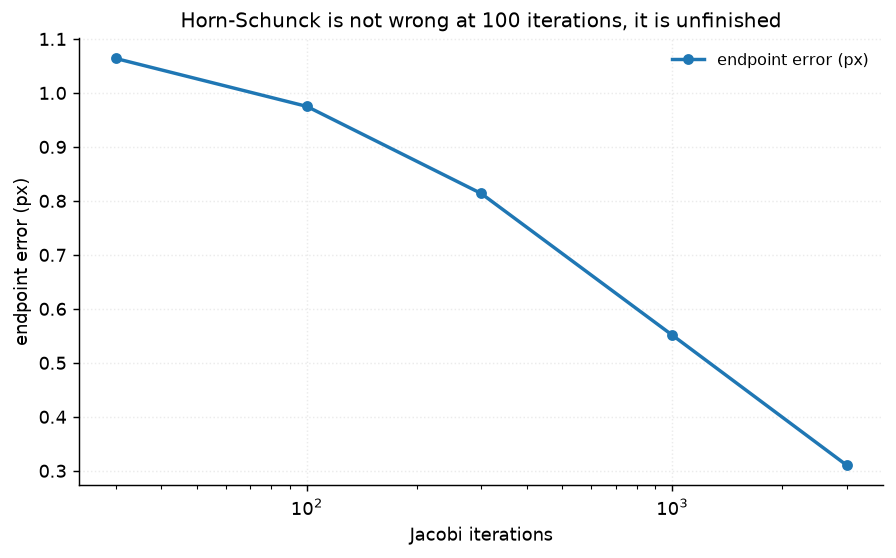
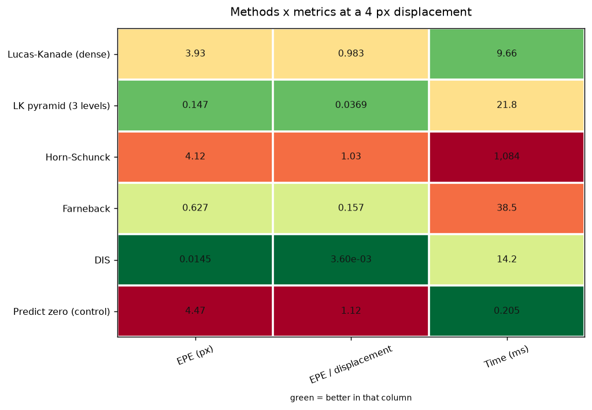

# 18 · Optical flow — classical computer vision

[](https://www.python.org/)
[](https://opencv.org/)
[](#)
[](#)

Five dense flow methods — Lucas–Kanade, pyramidal LK, Horn–Schunck, Farnebäck
and DIS — against a **generated** flow field, so endpoint error is measured
against the exact truth rather than against another algorithm's guess.

> "Lucas–Kanade fails for large motion" is in every textbook. None of them say
> *how* large. **This one does: 1 pixel.**

**No neural network, no training, no GPU.**

---

## Results

A known sinusoidal flow field of up to 4 px, recovered. Hue is direction,
brightness is magnitude, on one shared scale — **a black panel means no motion
was found at all**. Cells are endpoint error in pixels.



| Sr | Scene | Lucas–Kanade | LK pyramid (3) | Horn–Schunck | Farnebäck | **DIS** |
|---:|---|---:|---:|---:|---:|---:|
| 1 | man in striped shirt · texture 61 | 3.117 px | 0.765 px | 3.324 px | 1.667 px | **0.307 px** |
| 2 | bighorn on rock · texture 69 | 3.320 px | 0.247 px | 3.392 px | 0.226 px | **0.208 px** |
| 3 | stone archway · texture 73 | 3.579 px | 0.428 px | 3.720 px | 0.777 px | **0.200 px** |
| 4 | carved mask on thatch · texture 85 | 3.672 px | 0.250 px | 3.730 px | 0.331 px | **0.227 px** |

> **Row 1 is the aperture problem, photographed.** The striped shirt has strong
> structure in exactly one direction, and it is the row where every method does
> worst — LK pyramid triples its error (0.247 → 0.765) and DIS is 50% worse than
> on any other row. One-dimensional structure cannot determine two-dimensional
> motion, and no amount of algorithm fixes that.
>
> **Plain LK and Horn–Schunck are black panels.** At 4 px they have found
> essentially nothing: 3.30 and 3.52 px against a control that scores 3.87 just
> by predicting zero.

Averaged over all twelve photographs, on a pure 4 px translation:

| Method | EPE (px) | EPE / displacement | Time (ms) |
|---|---:|---:|---:|
| Lucas–Kanade (dense) | 3.9321 | 0.983 | 9.7 |
| **LK pyramid (3 levels)** | **0.1474** | **0.037** | 21.8 |
| Horn–Schunck (1000 iters) | 4.1233 | **1.031** | 1084.4 |
| Farnebäck | 0.6266 | 0.157 | 38.5 |
| **DIS** | **0.0145** | **0.0036** | 14.2 |
| Predict zero (control) | 4.4721 | 1.118 | 0.2 |

**DIS is 308× more accurate than the control and costs 14 ms.** Horn–Schunck
scores *above* 1.0 relative — worse than predicting no motion at all — while
costing 76× as much as DIS. Both of those deserve an explanation, and they get
different ones below.

---

## Where each method dies



| Displacement | 0.5 px | 1 px | 2 px | 4 px | 8 px | 16 px | 32 px |
|---|---:|---:|---:|---:|---:|---:|---:|
| Lucas–Kanade | 0.112 | 0.221 | **1.524** | 3.932 | 8.496 | 17.618 | 35.580 |
| LK pyramid (3) | 0.114 | 0.131 | 0.121 | 0.147 | 0.293 | **2.462** | 25.685 |
| Horn–Schunck | 0.256 | 0.551 | 1.756 | 4.123 | 8.659 | 17.665 | 35.618 |
| Farnebäck | 0.106 | 0.166 | 0.288 | 0.627 | 1.381 | 3.018 | 11.911 |
| **DIS** | 0.069 | 0.080 | 0.046 | **0.015** | 0.027 | 0.049 | **0.238** |
| *Predict zero (control)* | *0.559* | *1.118* | *2.236* | *4.472* | *8.944* | *17.889* | *35.777* |

**Plain LK's answer is 1 pixel.** At 1 px it scores 0.221 against a control of
1.118 — it is working. At 2 px it scores 1.524 against 2.236, which is two
thirds of the way to having found nothing, and by 4 px it is indistinguishable
from the control. The textbook's "one to two pixels" is right, and the useful
half of the range is the first one.

**DIS does not break anywhere in this sweep.** Its error at 32 px (0.238) is
lower than plain LK's at 1 px. It is also faster than Farnebäck.

### Each pyramid level roughly doubles the tractable motion



The largest displacement still handled with an EPE below half the displacement:

| Pyramid levels | 0 | 1 | 2 | 3 | 4 |
|---|---:|---:|---:|---:|---:|
| Largest tractable displacement | **1 px** | 4 px | 8 px | 16 px | **32 px** |

The 2^L story holds from level 1 onward. The first level buys a factor of
**4**, not 2 — the coarse level halves the displacement *and* blurs away the
fine structure the linearisation was tripping over, so it gets paid twice.
A 4-level pyramid takes a method that dies at 1 px and carries it to 32.

---

## Two bugs that looked exactly like results

Both of these produced a full table of plausible numbers. Neither raised an
error. They are the reason this project has a `Predict zero (control)` row.

### 1 · The truth was the negation of the truth

`synth.warp_by_flow` is a **backward** warp: it builds the output by sampling
the input at `(x + dx, y + dy)`, which is what `cv2.remap` wants. So warping by
`f` moves image content by `−f`. `make_pair` passed the field straight through
and reported it as the truth.

Every method was therefore scored against the exact opposite of the motion, and
**every one of them scored worse than predicting zero**:

| Method | EPE against the wrong sign | EPE against the truth |
|---|---:|---:|
| DIS | 8.93 px | **0.013 px** |

A 700× error, and the table it produced read as "these methods are all bad" —
a conclusion about optical flow drawn from a sign in the test harness. What
caught it was the control row: a method scoring worse than doing nothing is not
a weak method, it is a broken measurement. Pinned by
`test_the_truth_is_the_forward_flow`.

### 2 · The gradient was 8× too large

`cv2.Sobel(..., ksize=3)` applies an **unnormalised** kernel — the separable
pair multiplies out to a factor of 8. LK and Horn–Schunck both divide a temporal
difference by a spatial one, so an 8× gradient gives flow **8× too small**:

| True displacement | 0.25 px | 0.5 px | 1.0 px | 2.0 px |
|---|---:|---:|---:|---:|
| LK recovered (before) | 0.035 | 0.067 | 0.123 | 0.036 |
| LK recovered (after) | **0.280** | **0.538** | **0.985** | 0.288 |

The recovered flow pointed the *right way* the whole time, just short — which
reads as a method that half-works rather than as a scale error. It also made the
project's central question unanswerable: with LK recovering 12% of the motion at
every displacement, there was no threshold to find. Pinned by
`test_the_gradient_is_scaled_to_a_real_derivative`.

---

## Horn–Schunck is not failing, it is unfinished



| Jacobi iterations | 30 | 100 *(textbook)* | 300 | 1000 *(used here)* | 3000 |
|---|---:|---:|---:|---:|---:|
| EPE on a 1 px displacement | 1.064 | **0.975** | 0.814 | 0.551 | **0.311** |
| Time (ms) | 29.7 | 83.3 | 238.4 | 782.1 | **2382.3** |

At the textbook 100 iterations it scores 0.975 px on a 1 px displacement —
against a control of 1.118, which is close enough to nothing that it would have
gone into the table as *"Horn–Schunck does not work"*.

It does work. Jacobi iteration propagates information **one pixel per sweep**,
so a global smoothness term on a 481 px frame needs hundreds of sweeps before it
has reached the middle. The error is still falling at 3000 iterations, by which
point it costs **29× the textbook run** and 170× what DIS costs to beat it by a
factor of 20.

The table above reports it at 1000 — converged enough to be a fair
representation, and honest about the price. Pinned by
`test_horn_schunck_is_unfinished_at_the_textbook_iteration_count`.

---

## How the images were chosen

Twelve photographs selected by `tools/select_images.py --axis texture`, which
measures the fraction of spectral energy above a quarter Nyquist. Every method
here recovers displacement from local image structure, and where there is none
the 2×2 system is singular — so a pool of uniformly textured images would hide
the failure the aperture problem predicts.

```
eagle_in_flight     texture 45.8   man_striped_shirt   texture 60.5
angelfish_reef      texture 63.8   iceberg_watcher     texture 66.2
woman_by_tree       texture 67.7   bighorn_rock        texture 68.8
polar_bears_snow    texture 70.2   firefighters_map    texture 71.5
stone_archway       texture 72.6   mare_foal_meadow    texture 74.4
elephant_waterhole  texture 77.1   carved_mask_thatch  texture 84.7
```

None of these twelve appears in any other project; `tools/check_image_reuse.py`
enforces that by perceptual hash, not by filename.



---

## Try it on your own footage

```bash
python infer.py frame1.jpg frame2.jpg           # every method, no invented EPE
python infer.py photo.jpg --simulate --px 4     # warp it by a known field and score
python infer.py a.jpg b.jpg --method DIS --out flow.png
```

Two real frames have no ground-truth flow, so **no EPE is printed**. What is
printed instead is each method's median displacement and how far the methods
*disagree with each other* — which is the only signal available without a truth,
and is reported as such. `--simulate` warps one image by a known field so the
methods can be scored properly.

---

## Limitations

* **The flow is generated, and generated flow is kind.** Both fields here are
  smooth and the warp is a clean resample: no occlusion, no motion blur, no
  brightness change, no independently moving objects. Real footage has all four,
  and every method degrades on them. The exact-truth scoring is what buys the
  quantitative answer, and this is what it costs.
* **`Predict zero` scores 1.118× the displacement, not 1.0.** The field is
  `(m, m/2)`, whose magnitude is `m·√1.25`. The control's relative score is
  therefore constant at 1.118 and that is the line to compare against, not 1.0.
* **DIS and Farnebäck are OpenCV's implementations; LK and Horn–Schunck are
  written out here.** That is deliberate — the two written out are the two whose
  internals the project is about — but it means the comparison is not purely one
  of algorithms. A hand-written DIS would be slower.
* **Horn–Schunck uses Jacobi iteration.** Multigrid or SOR would converge in a
  fraction of the sweeps. The slow version is the one in the original paper and
  the one the convergence figure is about.

---

## Tests

10 tests, run with `pytest projects/18_optical_flow/tests -q`. Two of them pin
the harness bugs above so they cannot come back silently. The rest pin that no
method invents motion between identical frames, that plain LK dies between 1 and
2 px, that each pyramid level at least doubles the tractable displacement, that
DIS is the only method surviving 32 px, that Horn–Schunck is unconverged at 100
iterations, and that every method beats the do-nothing control at 1 px.

---

## Keywords

optical flow · Lucas-Kanade · pyramidal Lucas-Kanade · Horn-Schunck · Farneback ·
DIS optical flow · dense inverse search · endpoint error · aperture problem ·
coarse-to-fine · brightness constancy · motion estimation · classical computer
vision · no deep learning · OpenCV · Python · CPU only · reproducible image
processing experiments

## References

* Lucas & Kanade, *An Iterative Image Registration Technique*, IJCAI 1981.
* Horn & Schunck, *Determining Optical Flow*, Artificial Intelligence 1981.
* Bouguet, *Pyramidal Implementation of the Lucas Kanade Feature Tracker*, 2001.
* Farnebäck, *Two-Frame Motion Estimation Based on Polynomial Expansion*, SCIA 2003.
* Kroeger et al., *Fast Optical Flow using Dense Inverse Search*, ECCV 2016.
* Baker et al., *A Database and Evaluation Methodology for Optical Flow*, IJCV 2011
  — the source of endpoint error as the standard metric.
