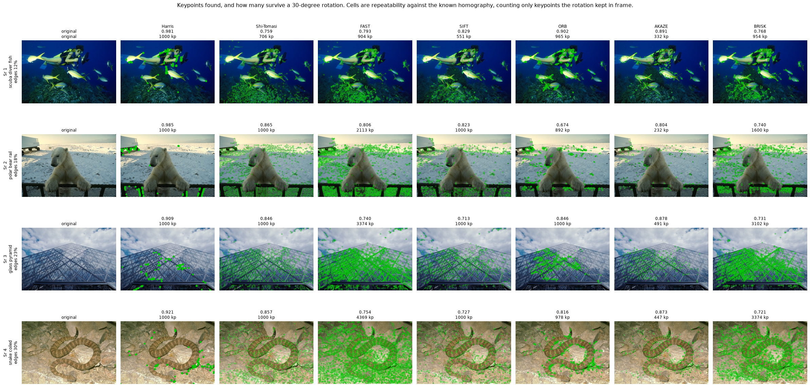
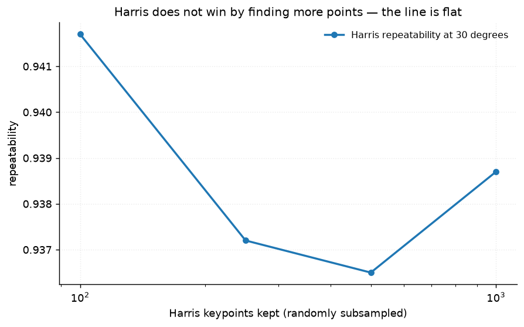
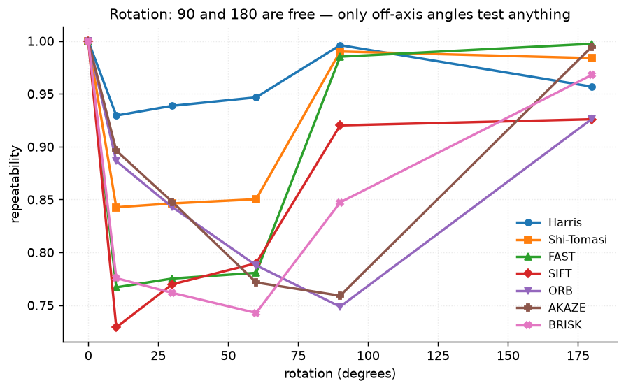
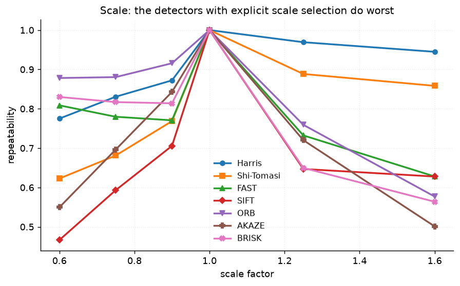
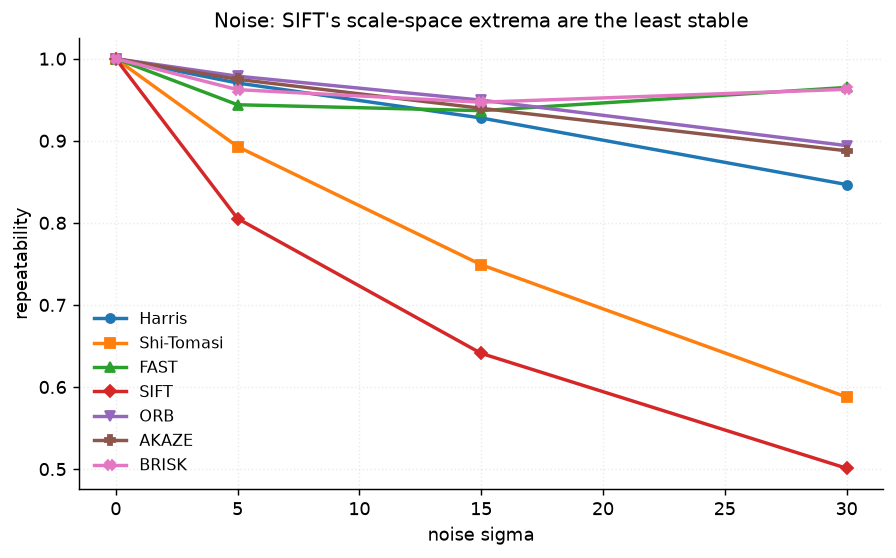
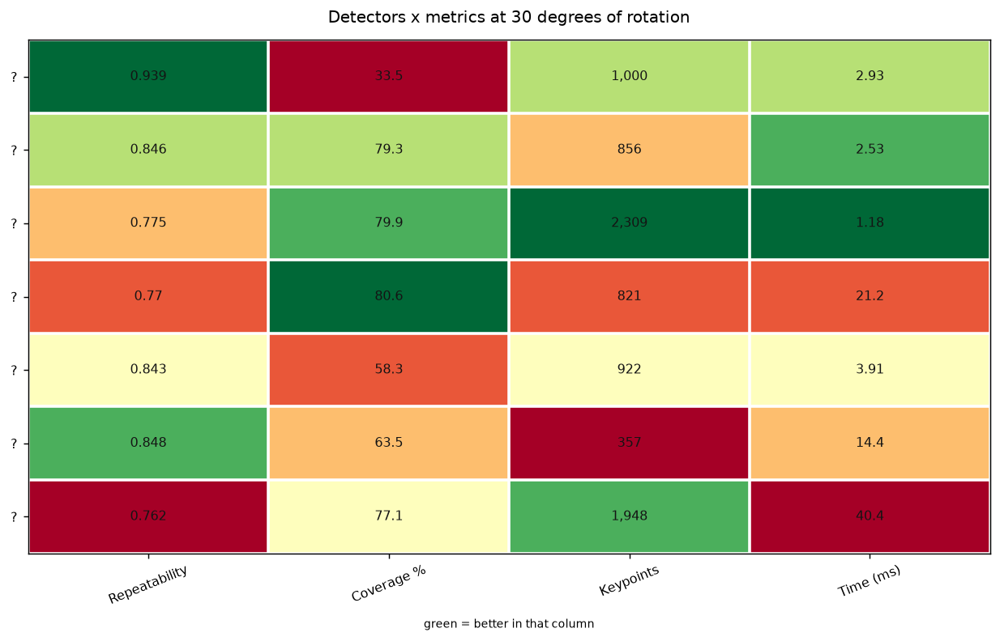

# 19 · Keypoint detectors — classical computer vision

[](https://www.python.org/)
[](https://opencv.org/)
[](#)
[](#)

Seven detectors — Harris, Shi-Tomasi, FAST, SIFT, ORB, AKAZE and BRISK —
measured for **repeatability under a known homography**, separately for
rotation, scale and noise.

> "ORB is faster than SIFT but less accurate." The speed ratio gets quoted. The
> accuracy cost almost never does. **Measured here, half of that sentence is
> wrong.**

**No neural network, no training, no GPU.**

---

## Results

Keypoints found, and how many survive a 30° rotation. Cells are repeatability
against the known homography — counting only keypoints the rotation kept in
frame.



| Sr | Scene | **Harris** | Shi-Tomasi | FAST | SIFT | ORB | AKAZE | BRISK |
|---:|---|---:|---:|---:|---:|---:|---:|---:|
| 1 | scuba diver and fish · edges 12% | **0.981** | 0.759 | 0.793 | 0.829 | 0.902 | 0.891 | 0.768 |
| 2 | polar bear on a rail · edges 18% | **0.985** | 0.865 | 0.806 | 0.823 | 0.674 | 0.804 | 0.740 |
| 3 | glass pyramid · edges 23% | **0.909** | 0.846 | 0.740 | 0.713 | 0.846 | 0.878 | 0.731 |
| 4 | coiled snake · edges 30% | **0.921** | 0.857 | 0.754 | 0.727 | 0.816 | 0.873 | 0.721 |

Averaged over all twelve photographs, at 30°:

| Detector | Repeatability | **Coverage** | Keypoints | Time (ms) | Slowdown |
|---|---:|---:|---:|---:|---:|
| **Harris** (1988) | **0.9387** | **33.5%** | 1000 | 2.9 | 2.5× |
| Shi-Tomasi | 0.8463 | 79.3% | 856 | 2.5 | 2.2× |
| FAST | 0.7752 | 79.9% | 2309 | **1.2** | **1×** |
| SIFT | **0.7698** | **80.6%** | 821 | 21.2 | 18× |
| ORB | 0.8429 | 58.3% | 922 | 3.9 | 3.3× |
| AKAZE | 0.8478 | 63.5% | 357 | 14.4 | 12.2× |
| BRISK | 0.7617 | 77.1% | 1948 | **40.4** | **34.3×** |

*Coverage is the percentage of an 8×8 grid over the frame holding at least one
keypoint.*

> **Harris wins on repeatability — and it is the only column it wins.** A 1988
> corner detector with no scale selection, no orientation and no descriptor is
> the most repeatable detector here, ahead of SIFT by 0.169.
>
> **It also covers a third of the frame.** 33.5%, against 58–81% for every other
> detector. Part of *why* it is so repeatable is that it concentrates its
> thousand keypoints on the few strongest corners, and the strongest corners are
> the most stable ones. For estimating a homography that is close to the
> opposite of what you want: a thousand keypoints inside one patch of gravel
> constrain a global transform no better than a handful spanning the picture.
>
> A repeatability table on its own would have reported that concentration as a
> virtue. It is in the results because the two columns disagree.
>
> **ORB is 6.0× faster than SIFT *and* +0.073 more repeatable.** The folklore
> says you trade accuracy for speed. On this measurement you trade nothing.
>
> **BRISK is dominated.** 35× slower than FAST and *below* it on repeatability.
> A comparison that only ever finds trade-offs is not being honest; sometimes an
> option is simply worse on every axis.

**What this measures, and what it does not.** Repeatability asks: *does the
detector put a keypoint in the same physical place after the image changes?* It
says nothing about whether the **descriptor** at that keypoint can be matched.
SIFT's reputation rests almost entirely on the second question, and this project
does not ask it — project 25 does. Read the table as a ranking of *detectors*,
which is what it is, and not as a claim that SIFT is a poor choice.

---

## Harris does not win by finding more points — but it does concentrate them



Harris returns ~1000 keypoints and AKAZE ~357. More keypoints means more chances
for one to land inside the 3 px match radius, so the natural objection is that
Harris wins on density. Randomly discarding its keypoints answers it:

| Harris keypoints kept | 100 | 250 | 500 | 1000 |
|---|---:|---:|---:|---:|
| Repeatability at 30° | 0.942 | 0.937 | 0.936 | 0.939 |

**Flat.** A tenth of the keypoints scores the same as all of them. Randomly
subsampled, so the survivors are not quietly reselected for quality. Pinned by
`test_harris_does_not_win_by_finding_more_keypoints`.

So density is not the explanation — but **placement** partly is. Harris's 33.5%
coverage against SIFT's 80.6% says the two are not solving the same problem:
Harris is answering "where are the most reliable corners", and a homography
needs "where are reliable corners *spread across the frame*". Pinned by
`test_harris_trades_frame_coverage_for_repeatability`.

---

## Three degradations, three different rankings

### Rotation — and why 90° tells you nothing



| Rotation | 0° | 10° | 30° | 60° | **90°** | **180°** |
|---|---:|---:|---:|---:|---:|---:|
| Harris | 1.000 | 0.930 | 0.939 | 0.947 | **0.996** | 0.957 |
| Shi-Tomasi | 1.000 | 0.843 | 0.846 | 0.850 | **0.990** | **0.984** |
| FAST | 1.000 | 0.767 | 0.775 | 0.781 | **0.985** | **0.997** |
| SIFT | 1.000 | 0.729 | 0.770 | 0.790 | 0.920 | 0.926 |
| ORB | 1.000 | 0.886 | 0.843 | 0.788 | 0.749 | 0.926 |
| AKAZE | 1.000 | 0.896 | 0.848 | 0.772 | 0.759 | **0.995** |
| BRISK | 1.000 | 0.776 | 0.762 | 0.743 | 0.847 | 0.968 |

A 90° or 180° rotation is a transpose and a flip of the pixel grid — **exact,
with no resampling at all**. FAST, which has no rotation invariance of any kind,
jumps from 0.775 at 30° to **0.997 at 180°**; Shi-Tomasi goes 0.846 → 0.984.
Benchmarks quoting right-angle rotations are measuring arithmetic, not
invariance, and the headline runs at 30° for that reason. Pinned by
`test_right_angle_rotations_test_nothing`.

The rotation-invariant detectors show the opposite pattern: **ORB scores 0.749
at 90°, its worst result of the sweep**, and AKAZE 0.759. Their orientation
assignment is estimated from image content and has to be re-estimated in the
rotated frame, so it contributes error exactly where the grid-aligned detectors
are getting a free pass. Between 10° and 60° — the range where rotation
invariance is actually being asked for — ORB and AKAZE are ahead of FAST and
SIFT by 0.05 to 0.12, which is the comparison worth reading.

### Scale — and the ranking flips depending on which way



| Scale | 0.6 (shrink) | 0.75 | 0.9 | 1.0 | 1.25 | 1.6 (enlarge) |
|---|---:|---:|---:|---:|---:|---:|
| Harris | 0.775 | 0.831 | 0.872 | 1.000 | 0.969 | **0.945** |
| SIFT | **0.467** | 0.593 | 0.706 | 1.000 | 0.647 | 0.628 |
| ORB | **0.878** | 0.881 | 0.916 | 1.000 | 0.759 | **0.577** |
| AKAZE | 0.550 | 0.696 | 0.843 | 1.000 | 0.720 | 0.501 |

**Shrinking and enlarging are different problems and the ranking reverses.**
ORB is the best detector at 0.6× (0.878) and nearly the worst at 1.6× (0.577).
Harris is the reverse: 0.775 shrinking, 0.945 enlarging. Enlarging interpolates
detail and corners stay corners; shrinking destroys the detail outright.

A single "scale invariance" score would average these two opposite behaviours
into a number describing neither. Pinned by
`test_scale_invariance_is_asymmetric`.

**The two detectors with explicit scale selection do worst of all.** SIFT
reaches 0.467 at 0.6× and AKAZE 0.550, against ORB's 0.878. Scale-space
detectors find the same feature at a *different octave* after resampling, and
its sub-pixel location moves by more than the 3 px match radius allows. That is
a limitation of this measurement as much as of the detectors — see Limitations.

### Noise



| Noise sigma | 0 | 5 | 15 | 30 |
|---|---:|---:|---:|---:|
| FAST | 1.000 | 0.944 | 0.937 | **0.965** |
| BRISK | 1.000 | 0.962 | 0.947 | **0.963** |
| Harris | 1.000 | 0.970 | 0.928 | 0.847 |
| Shi-Tomasi | 1.000 | 0.893 | 0.749 | 0.588 |
| SIFT | 1.000 | 0.805 | 0.641 | **0.501** |

**SIFT is the least stable detector under noise, by a wide margin.** At sigma 30
it keeps half its keypoints where FAST keeps 96.5%.

The mechanism is visible in the definitions. SIFT locates keypoints as *extrema*
of a difference-of-Gaussian scale space — an extremum is a comparison between
neighbouring samples, and noise moves it. FAST's segment test is a **vote** over
16 pixels on a ring, and a vote needs many pixels to change before its outcome
does. Pinned by `test_sift_is_the_least_stable_detector_under_noise`.

---

## The measurement was wrong first, and wrong flatteringly

`apply_homography` keeps the canvas size, so rotating a rectangle carries its
corners out of view — at 45° roughly **a third of the image is gone**. The first
version of `repeatability` scored every one of those vanished keypoints as a
miss.

A keypoint that is no longer in the picture cannot be redetected by any
detector, so this measured the crop and reported it as a property of the method.
Every detector's rotation curve sagged in the middle and recovered at 180°,
which reads as a real and rather interesting result about invariance. It was the
shape of a rotating rectangle.

`shared.metrics.repeatability` now takes the second image's `shape` and excludes
keypoints whose projection lands outside it, which is the definition Schmid et
al. use. Pinned by
`test_repeatability_ignores_keypoints_the_rotation_pushed_out_of_frame`.

---

## How the images were chosen

Twelve photographs selected by `tools/select_images.py --axis edges`, which
measures the percentage of pixels Canny calls an edge at its own Otsu-derived
thresholds. Every detector here needs distinctive local structure, so the pool
has to include images that have almost none.

```
eagle_flat_sky        edges  0.9%    regatta_spinnakers    edges  8.4%
scuba_diver_fish      edges 11.3%    portrait_yellow       edges 13.1%
blue_footed_boobies   edges 15.0%    polar_bear_rail       edges 17.1%
geologist_rocks       edges 18.6%    man_fur_hat           edges 20.2%
glass_pyramid         edges 22.7%    bobcat_rock           edges 25.2%
snake_coiled          edges 29.5%    monitor_lizard_grass  edges 37.2%
```

None of these twelve appears in any other project; `tools/check_image_reuse.py`
enforces that by perceptual hash, not by filename.



---

## Try it on your own image

```bash
python infer.py photo.jpg                       # every detector, counts and timings
python infer.py photo.jpg --rotate 30           # score repeatability against a known warp
python infer.py photo.jpg --detector Harris --out corners.png
```

On a single image there is no second view and therefore no repeatability to
report, so **none is printed** — only how many keypoints each detector found,
how long it took, and how evenly the keypoints are spread. `--rotate`,
`--scale` and `--noise` apply a known transform so repeatability can be measured
properly.

---

## Limitations

* **This measures detectors, not descriptors.** Repeatability asks whether a
  keypoint lands in the same place, not whether it can be *matched*. SIFT's
  value is in its descriptor, and this project never builds one. Reading the
  table as "SIFT is bad" would be the wrong conclusion from the right number —
  project 25 measures the matching side.
* **A fixed 3 px match radius penalises scale-space detectors.** When the image
  is resampled, SIFT and AKAZE legitimately redetect a feature at a different
  octave, where its sub-pixel position can move more than 3 px. A radius that
  scaled with the transform would treat them more kindly. The fixed radius is
  reported rather than tuned, because tuning it per detector is how a benchmark
  produces the ranking its author expected.
* **The transform is synthetic.** A homography applied to one photograph has no
  parallax, no occlusion, no lighting change and no sensor noise beyond what is
  added deliberately. Real two-view repeatability is lower for all seven.
* **Detector parameters are at their OpenCV defaults**, except the 1000-keypoint
  caps. Harris's threshold and FAST's `threshold=25` both move their counts
  substantially, and the density control above shows the count is not what
  drives the score.

---

## Tests

12 tests, run with `pytest projects/19_keypoint_detectors/tests -q`. One pins
the frame-crop bug in the measurement so it cannot come back silently. The rest
pin that identity is perfectly repeatable, that no detector invents keypoints in
a flat image, and the findings: that Harris is the most repeatable, that it is
not winning on density, that ORB beats SIFT on both speed and repeatability,
that right-angle rotations test nothing, that scale invariance is asymmetric,
that SIFT is least stable under noise, and that BRISK is dominated.

---

## Keywords

keypoint detection · corner detection · Harris corners · Shi-Tomasi · good
features to track · FAST · SIFT · ORB · AKAZE · BRISK · repeatability ·
scale invariance · rotation invariance · feature detectors · homography ·
classical computer vision · no deep learning · OpenCV · Python · CPU only ·
reproducible image processing experiments

## References

* Harris & Stephens, *A Combined Corner and Edge Detector*, Alvey 1988.
* Shi & Tomasi, *Good Features to Track*, CVPR 1994.
* Rosten & Drummond, *Machine Learning for High-Speed Corner Detection*, ECCV 2006.
* Lowe, *Distinctive Image Features from Scale-Invariant Keypoints*, IJCV 2004.
* Rublee et al., *ORB: An Efficient Alternative to SIFT or SURF*, ICCV 2011.
* Alcantarilla et al., *Fast Explicit Diffusion for Accelerated Features in
  Nonlinear Scale Spaces*, BMVC 2013 — AKAZE.
* Leutenegger et al., *BRISK: Binary Robust Invariant Scalable Keypoints*, ICCV 2011.
* Schmid, Mohr & Bauckhage, *Evaluation of Interest Point Detectors*, IJCV 2000 —
  the repeatability definition used here, including the common-region rule.
