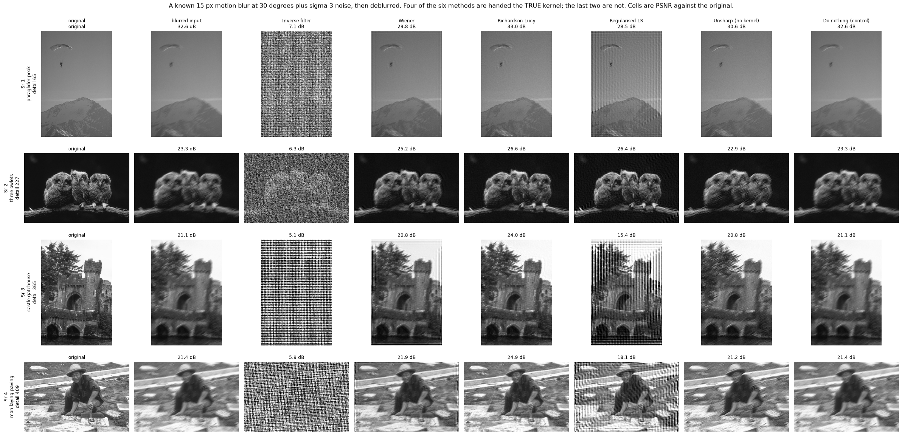
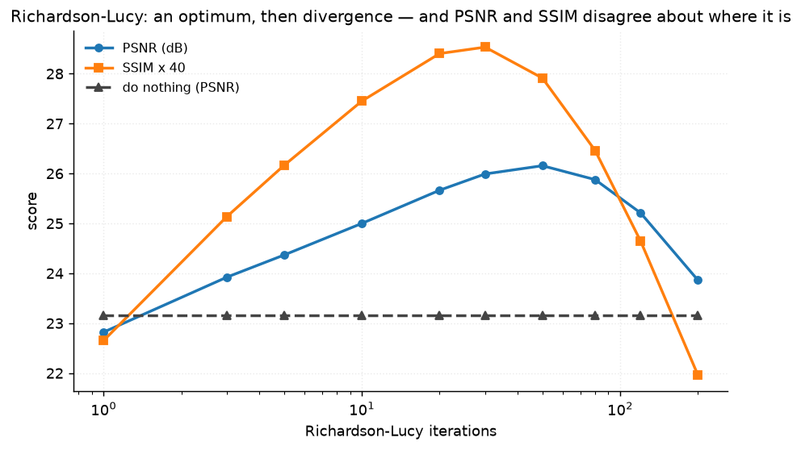
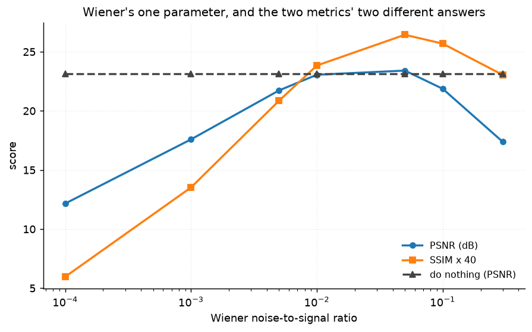
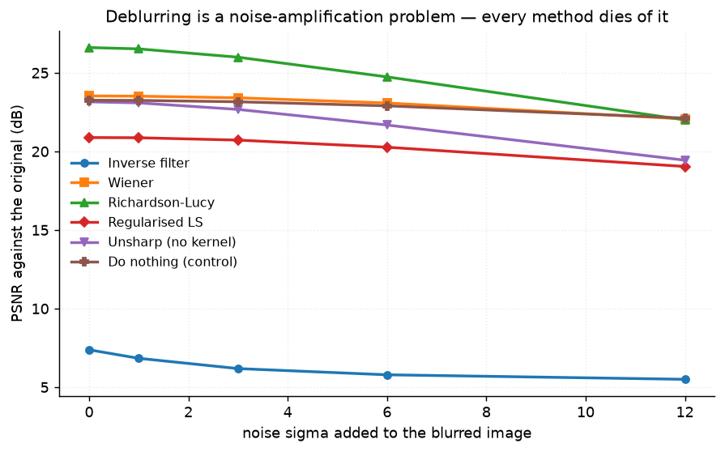
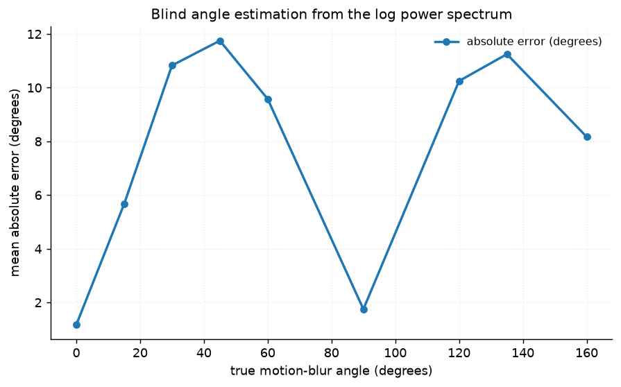
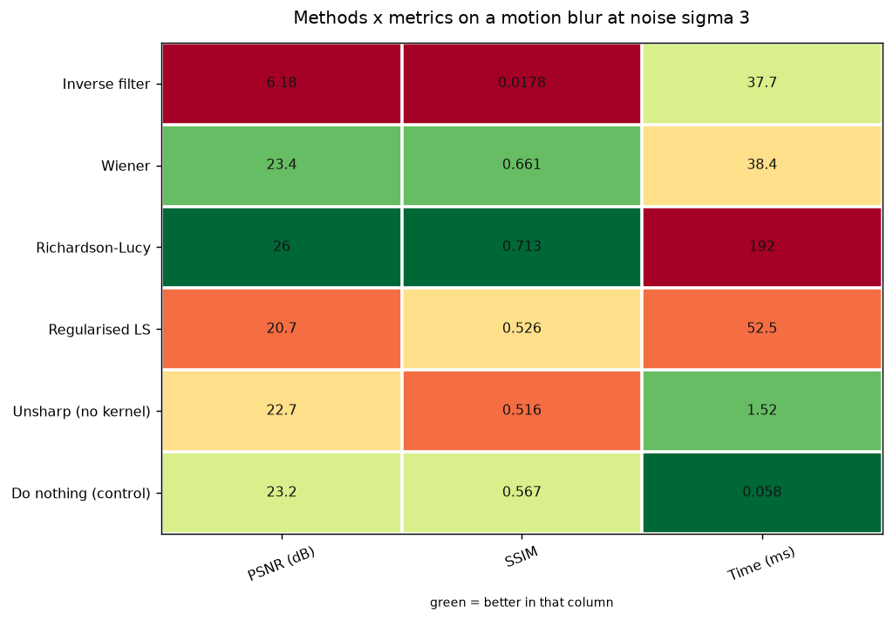

# 20 · Deblurring — classical computer vision

[](https://www.python.org/)
[](https://opencv.org/)
[](#)
[](#)

Five deconvolution methods — inverse filter, Wiener, Richardson–Lucy,
regularised least squares and an unsharp mask that is never told the kernel —
against a **known** point-spread function, plus a blind estimator that has to
work the blur direction out from the image alone.

> **The claim under test:** deblurring is not an inversion problem, it is a
> noise-amplification problem. If that is right, the method that inverts most
> exactly should do worst.

**No neural network, no training, no GPU.**

---

## Results

A known 15 px motion blur at 30° plus sigma 3 noise, then deblurred. **Four of
the six methods are handed the true kernel; the last two are not.** Cells are
PSNR against the original.



| Sr | Scene | Blurred | Inverse | Wiener | **Rich.–Lucy** | Reg. LS | Unsharp | Do nothing |
|---:|---|---:|---:|---:|---:|---:|---:|---:|
| 1 | paraglider over a peak · detail 65 | 32.6 dB | 7.1 | 29.8 | **33.0** | 28.5 | 30.6 | 32.6 |
| 2 | three owlets · detail 227 | 23.3 dB | 6.3 | 25.2 | **26.6** | 26.4 | 22.9 | 23.3 |
| 3 | castle gatehouse · detail 365 | 21.1 dB | 5.1 | 20.8 | **24.0** | 15.4 | 20.8 | 21.1 |
| 4 | man laying paving · detail 409 | 21.4 dB | 5.9 | 21.9 | **24.9** | 18.1 | 21.2 | 21.4 |

Averaged over all twelve photographs:

| Method | Knows the kernel | PSNR (dB) | SSIM | Time (ms) |
|---|---|---:|---:|---:|
| Inverse filter | yes | **6.18** | **0.0178** | 37.7 |
| Wiener (nsr 0.05) | yes | 23.41 | 0.6609 | 38.4 |
| **Richardson–Lucy** (30 iters) | yes | **25.99** | **0.7133** | 191.7 |
| Regularised LS | yes | 20.72 | 0.5257 | 52.5 |
| Unsharp (no kernel) | **no** | 22.67 | 0.5164 | **1.5** |
| Do nothing (control) | **no** | 23.16 | 0.5665 | 0.06 |

> **The exact inverse is the worst method in the table by 17 dB.** Handed the
> true kernel, division by the transfer function scores **6.18 dB** against a
> control that scores 23.16 just by leaving the image alone. Row 1 of the figure
> shows what that looks like: a mountain replaced by static.
>
> The blur attenuated the high frequencies. The noise did not. Dividing by the
> transfer function amplifies both, and at the frequencies where the blur
> attenuated most, the amplification is largest and there is nothing there but
> noise.
>
> **Only Richardson–Lucy clearly beats doing nothing.** Wiener edges it by 0.25
> dB, and the regularised least-squares solution is 2.4 dB *behind* — all three
> knowing the exact kernel. Deblurring a noisy image is hard even when the
> hardest part is given to you for free.

---

## Richardson–Lucy: an optimum, then divergence



| Iterations | 1 | 5 | 10 | 30 | **50** | 80 | 120 | **200** |
|---|---:|---:|---:|---:|---:|---:|---:|---:|
| PSNR (dB) | 22.82 | 24.37 | 25.00 | 25.99 | **26.16** | 25.88 | 25.21 | **23.86** |
| SSIM | 0.566 | 0.654 | 0.686 | **0.713** | 0.698 | 0.662 | 0.616 | **0.549** |

**More iterations is not more deblurring.** RL is a maximum-likelihood iteration
with no regulariser, so it keeps going until it has explained the *noise* as
well as the signal. PSNR climbs to 26.16 dB at 50 iterations and then falls; by
200 it is at 23.86 — **2.29 dB below its own peak** and barely above the
do-nothing control.

**And the two metrics disagree about where to stop.** PSNR peaks at 50
iterations, SSIM at 30 — a factor of nearly 2. SSIM starts falling while PSNR is
still improving, because the extra iterations are sharpening at the cost of
structure.

At run time you have neither number, because both need the clean image, which is
the thing being reconstructed. Pinned by
`test_richardson_lucy_diverges_past_its_optimum` and
`test_psnr_and_ssim_disagree_about_when_to_stop`.

### Wiener has the same problem in one parameter



| NSR | 0.0001 | 0.001 | 0.005 | 0.01 *(textbook)* | **0.05** | 0.1 | 0.3 |
|---|---:|---:|---:|---:|---:|---:|---:|
| PSNR (dB) | **12.16** | 17.59 | 21.73 | 23.06 | **23.41** | 21.87 | 17.38 |
| SSIM | 0.149 | 0.338 | 0.521 | 0.596 | **0.661** | 0.642 | 0.576 |

At nsr → 0 Wiener *is* the inverse filter, and it scores like it: 12.16 dB. At
the other end it is a blur. The optimum is interior, at **0.05**, and the
textbook 0.01 costs 0.35 dB. The tables above report Wiener at its own best
setting, because the finding — that it barely beats doing nothing — is only
worth stating about a fairly tuned Wiener.

---

## It is a noise problem, and the noise decides everything



| Noise sigma | 0 | 1 | 3 | 6 | **12** |
|---|---:|---:|---:|---:|---:|
| Blurred input (= control) | 23.25 | 23.24 | 23.16 | 22.90 | 22.12 |
| Richardson–Lucy | **26.61** | 26.52 | 25.99 | 24.74 | **22.00** |
| Wiener | 23.53 | 23.51 | 23.41 | 23.08 | 22.06 |
| Inverse filter | 7.38 | 6.84 | 6.18 | 5.79 | 5.50 |
| **RL's gain over doing nothing** | **+3.35** | +3.28 | +2.83 | +1.84 | **−0.11** |

**At sigma 12 the best method in the project has gone negative** — 0.11 dB worse
than leaving the image alone. The advantage erodes monotonically and then
crosses over. Every one of these methods amplifies whatever occupies the
frequencies the blur suppressed; the cleaner the capture, the more of that is
signal rather than noise.

Note the inverse filter is already destroyed at **sigma 0** — 7.38 dB with no
noise added at all, against a 23.25 dB control. Nothing is left to blame but
JPEG quantisation and floating-point residue, amplified by division at the
frequencies where the transfer function is near zero. That is the clearest
statement available that its problem is amplification itself rather than any
particular noise level. Pinned by
`test_deblurring_stops_helping_once_the_noise_is_large`.

---

## Estimating the blur direction blind

A real pipeline is not handed the PSF. Linear motion blur multiplies the
spectrum by a sinc whose zero-crossings form parallel stripes **perpendicular**
to the motion, so the direction can be read off the log power spectrum.



| True angle | 0° | 15° | 30° | 45° | 60° | 90° | 120° | 135° | 160° |
|---|---:|---:|---:|---:|---:|---:|---:|---:|---:|
| Mean abs error | **1.2°** | 5.7° | 10.8° | 11.8° | 9.6° | **1.8°** | 10.3° | 11.3° | 8.2° |

**Mean error 7.8°, worst 11.8°**, against the 45° a uniform guess would average.
The error is systematically larger away from the axes, which is the radial
sampling of a rectangular spectrum showing through; it is reported rather than
corrected.

### This estimator was wrong twice over, and the two errors cancelled

The first version scored **3.25° at 90° and 50–80° everywhere else**. One good
number among five bad ones reads as a method that works and an experiment that
is noisy. It was neither.

**It used `cv2.HoughLines` on a thresholded spectrum.** Hough found the FFT's own
axis-aligned and diagonal structure rather than the sinc stripes, so the answer
snapped to multiples of 45° — exact at 0, 45, 90 and 135, and 20°+ out between:

| True angle | 0° | 30° | 45° | 60° | 90° | 120° | 135° |
|---|---:|---:|---:|---:|---:|---:|---:|
| Raw estimate | 89° | 142° | 135° | 135° | 83° | 45° | 45° |

**And the perpendicular was never taken**, so the number reported was the stripe
orientation, not the blur direction — a systematic 90° offset.

At a true angle of 90° the missing offset and the Hough snapping cancel exactly,
and the estimator posts 3.25°. Every other angle carries both errors. The fix is
a radial average of the log spectrum with no preferred direction, plus the
perpendicular. Pinned by
`test_the_blind_angle_estimator_works_at_angles_that_are_not_multiples_of_45`,
which deliberately tests 15°, 30°, 120° and 160° — all off the 45° grid.

---

## Defocus behaves the same way

| Method | PSNR (dB) | SSIM |
|---|---:|---:|
| Inverse filter | 5.79 | 0.012 |
| Wiener | 22.49 | 0.555 |
| **Richardson–Lucy** | **24.37** | **0.616** |
| Regularised LS | 19.40 | 0.433 |
| Unsharp (no kernel) | 22.16 | 0.413 |
| Do nothing (control) | 22.46 | 0.483 |

Same ranking, smaller margins. A disc PSF has zeros in its transfer function
where a line PSF has them too, so the inversion is ill-posed for the same
reason.

---

## How the images were chosen

Twelve photographs selected by `tools/select_images.py --axis detail`, which
measures mean gradient magnitude. Deblurring is judged on how much fine
structure it puts back, so the pool has to span images with almost none and
images made of nothing else — a factor of 13 here.

```
paraglider_peak    detail  57    ox_in_pasture      detail 154
surfer_barrel      detail 193    three_owlets       detail 222
geisha_costume     detail 249    child_fur_hood     detail 278
tiger_wading       detail 299    woman_white_fence  detail 322
castle_gatehouse   detail 361    man_laying_paving  detail 406
marmot_boulder     detail 454    owl_in_grass       detail 732
```

Row 1 of the results figure is the low-detail end and it shows why the axis
matters: on the paraglider, doing nothing scores 32.6 dB and the best method
manages 33.0. There was almost nothing to restore.

None of these twelve appears in any other project; `tools/check_image_reuse.py`
enforces that by perceptual hash, not by filename.



---

## Try it on your own image

```bash
python infer.py photo.jpg                        # estimate the blur, then undo it
python infer.py photo.jpg --angle 30 --length 15 # if you know the kernel, say so
python infer.py sharp.jpg --simulate             # blur it yourself and score properly
```

On a real blurred photograph there is no sharp original, so **no PSNR is
printed**. What is printed is the estimated motion direction, and each method's
acutance — with the warning that acutance rises for the inverse filter too,
which produces static. `--simulate` applies a known kernel so everything can be
scored against a truth.

---

## Limitations

* **Everything here is grayscale.** `make_blurred` converts to luminance, so the
  comparison is internally consistent but the numbers are not comparable with
  the colour projects: a grayscale reconstruction has a third as much to get
  wrong. Project 16 hit exactly this and fixed it the other way.
* **The PSF is exact, spatially uniform, and known.** Real camera shake is a
  curve, not a line; real defocus varies with depth across the frame. The four
  kernel-aware methods are being given more than any real pipeline has, and
  three of them still barely beat doing nothing.
* **The blind estimator recovers the angle only.** Blur *length* is the other
  half of the PSF and is not estimated here — `infer.py` takes it as an
  argument. Cepstral length estimation is the standard next step.
* **Richardson–Lucy assumes Poisson noise**; the noise added here is Gaussian.
  That mismatch is realistic for a well-lit photograph and is part of why it
  diverges rather than converging to the truth.
* **Twelve photographs and one blur length.** Enough to span the detail axis and
  show the noise threshold; not enough to quote an optimum iteration count as a
  general number.

---

## Tests

14 tests, run with `pytest projects/20_deblurring/tests -q`. Two pin the blind
estimator's twin bugs — the 45° snapping and the missing perpendicular — at
angles chosen to be off the 45° grid. The rest pin that the blur really damages
the image, that the results say which methods were handed the kernel, and the
findings: that the exact inverse is catastrophically worst, that Richardson–Lucy
diverges past an interior optimum, that PSNR and SSIM disagree about where that
optimum is, that only the iterative method clearly beats doing nothing, and that
the advantage disappears entirely once the noise is large.

---

## Keywords

deblurring · deconvolution · inverse filter · Wiener filter · Richardson-Lucy ·
regularised least squares · point spread function · PSF estimation · motion
blur · defocus blur · blind deconvolution · noise amplification · ill-posed
inverse problem · classical computer vision · no deep learning · OpenCV ·
Python · CPU only · reproducible image processing experiments

## References

* Richardson, *Bayesian-Based Iterative Method of Image Restoration*, JOSA 1972.
* Lucy, *An Iterative Technique for the Rectification of Observed Distributions*,
  Astronomical Journal 1974.
* Wiener, *Extrapolation, Interpolation, and Smoothing of Stationary Time
  Series*, 1949.
* Gonzalez & Woods, *Digital Image Processing*, ch. 5 — image restoration, and
  the inverse-filter failure reproduced here.
* Cannon, *Blind Deconvolution of Spatially Invariant Image Blurs with Phase*,
  IEEE ASSP 1976 — spectral estimation of motion-blur parameters.
