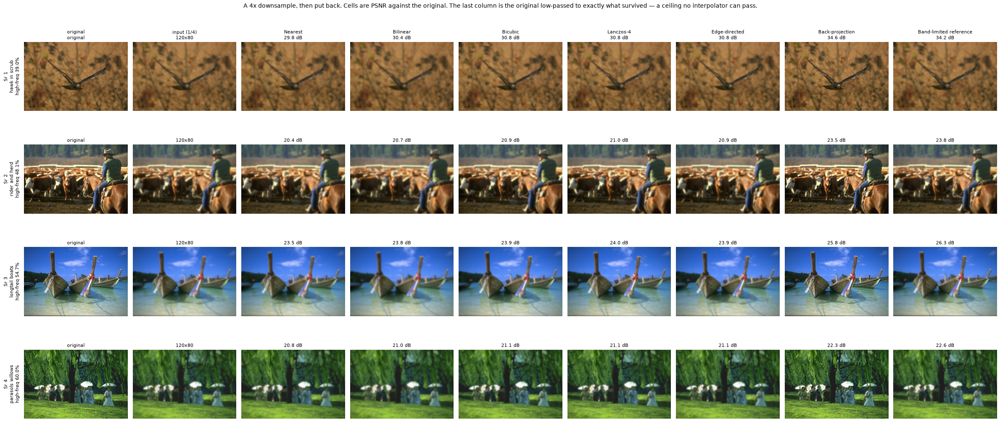
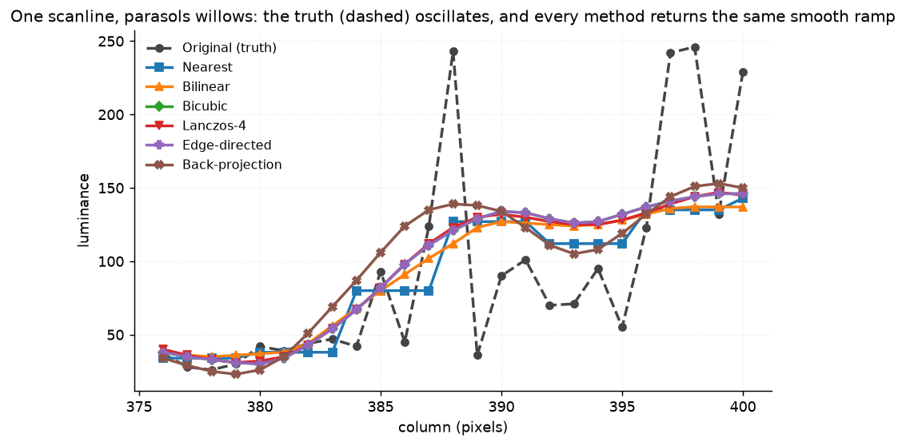
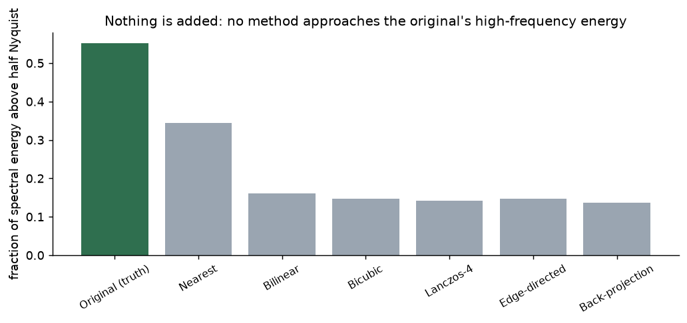
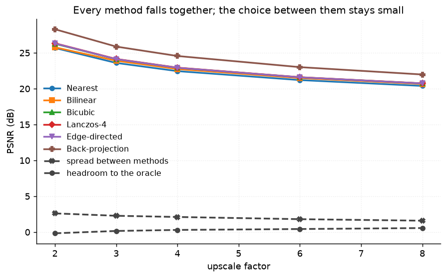
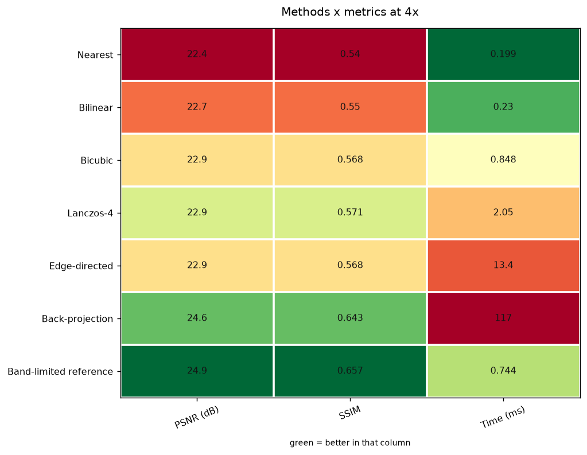

# 21 · Super-resolution — classical computer vision

[](https://www.python.org/)
[](https://opencv.org/)
[](#)
[](#)

Six upscalers — nearest, bilinear, bicubic, Lanczos-4, an edge-directed variant
and iterative back-projection — plus a **band-limited reference** that shows how
much of each picture was still present in the low-resolution file at all.

> **The claim under test:** the choice of interpolator barely matters. What
> matters is whether the method knows how the image was made small.

**No neural network, no training, no GPU.**

---

## Results

A 4× downsample, then put back. Cells are PSNR against the original. The last
column is the original low-passed by the same blur the downsample applied —
what a perfect reconstruction is aiming at.



| Sr | Scene | Nearest | Bilinear | Bicubic | Lanczos-4 | Edge-dir. | **Back-proj.** | Reference |
|---:|---|---:|---:|---:|---:|---:|---:|---:|
| 1 | hawk in scrub · high-freq 39.0% | 29.8 | 30.4 | 30.8 | 30.8 | 30.8 | **34.6** | 34.2 |
| 2 | rider and herd · high-freq 48.1% | 20.4 | 20.7 | 20.9 | 21.0 | 20.9 | **23.5** | 23.8 |
| 3 | longtail boats · high-freq 54.7% | 23.5 | 23.8 | 23.9 | 24.0 | 23.9 | **25.8** | 26.3 |
| 4 | parasols and willows · high-freq 60.0% | 20.8 | 21.0 | 21.1 | 21.1 | 21.1 | **22.3** | 22.6 |

Averaged over all twelve photographs, at 4×:

| Method | PSNR (dB) | SSIM | Time (ms) |
|---|---:|---:|---:|
| Nearest | **22.450** | 0.6069 | **0.1** |
| Bilinear | 22.738 | 0.6238 | 0.1 |
| Bicubic | 22.913 | 0.6387 | 0.6 |
| Lanczos-4 | **22.937** | 0.6420 | 1.3 |
| Edge-directed | 22.913 | 0.6388 | 8.4 |
| **Back-projection** | **24.560** | **0.7053** | 86.0 |
| *Band-limited reference* | *24.863* | *0.6568* | *0.8* |

> **The entire nearest-to-Lanczos argument is worth 0.49 dB.** Five methods,
> four decades of textbook debate, and 0.5 dB between the worst and the best.
> Row 4 of the figure shows them agreeing to within 0.3 dB.
>
> **Back-projection is +1.62 dB on its own** — more than three times the whole
> classic spread — and it lands within 0.30 dB of the band-limited reference. It
> is not a better interpolator. It is the only method here that knows how the
> low-resolution image was made, and inverts that.

---

## One scanline says it better than the table



The truth (dashed) swings between 36 and 243 across four pixels. Every method
draws a smooth line through the middle of it. Nearest visibly steps and the rest
ramp — that difference is the 0.49 dB — but next to the original they are the
same curve.

---

## Nothing is added, and the metric that says otherwise is measuring blocks



Fraction of spectral energy above half Nyquist, at 4×:

| | Original | **Nearest** | Bilinear | Bicubic | Lanczos-4 | Edge-dir. | Back-proj. |
|---|---:|---:|---:|---:|---:|---:|---:|
| High-freq energy | **0.551** | **0.344** | 0.161 | 0.147 | 0.142 | 0.147 | 0.137 |

No method reaches the original's 0.551, which is interpolation's central
limitation stated as a measurement.

**But nearest-neighbour scores the highest of any method — and it is the worst
method in the project.** 0.344 against bicubic's 0.147, while scoring 0.46 dB
*lower* on PSNR. That energy is real and it is entirely the blocky staircase:
aliasing, not recovered detail.

A no-reference "sharpness" number cannot tell those two apart, and here it
ranks the methods almost exactly backwards. Pinned by
`test_high_frequency_energy_rewards_the_worst_method`.

---

## The downsampler matters more than the method

| | PSNR of bicubic 4× |
|---|---:|
| Low-res built by **blur then decimate** (correct) | **22.91 dB** |
| Low-res built by **`cv2.resize(INTER_AREA)`** | **25.03 dB** |
| **Difference** | **2.12 dB** |

The two low-resolution images are only 27.9 dB from each other — visibly
different pictures.

**2.12 dB is larger than the entire spread between all six methods** (2.11 dB).
A super-resolution comparison that built its inputs with `cv2.resize` was
measuring how well each method inverts `INTER_AREA` — a different operator, and
not the question anyone meant to ask. It also flatters every method by about two
decibels, which is why the mistake survives.

`shared.synth.downsample_for_sr` blurs and then decimates. Pinned by
`test_the_choice_of_downsampler_matters_more_than_the_choice_of_method`.

---

## Across scale factors



| Scale | Nearest | Bicubic | Lanczos-4 | **Back-proj.** | Spread | Headroom to reference |
|---|---:|---:|---:|---:|---:|---:|
| 2× | 25.68 | 26.26 | 26.34 | **28.29** | 2.61 | **−0.17** |
| 3× | 23.59 | 24.11 | 24.15 | 25.87 | 2.28 | +0.16 |
| 4× | 22.45 | 22.91 | 22.94 | 24.56 | 2.11 | +0.30 |
| 6× | 21.20 | 21.59 | 21.60 | 23.01 | 1.80 | +0.43 |
| 8× | 20.39 | 20.73 | 20.75 | 21.98 | 1.59 | **+0.56** |

Everything falls together, and **the spread narrows as the task gets harder** —
from 2.61 dB at 2× to 1.59 dB at 8×. The more information the downsample
destroyed, the less the choice of method can matter.

At **2× the headroom is negative**: back-projection scores *above* the
band-limited reference. That is not an error, and it is why that row is called a
reference rather than an oracle.

### Why it is a reference and not a ceiling

The reference is the original blurred by the same anti-alias filter the
downsample used, without the decimation — the image a perfect reconstruction
returns. It looks like a hard ceiling and it is not one.

**A Gaussian is not a brick wall.** It *attenuates* the frequencies above the
new Nyquist rather than removing them, so the decimated samples still carry a
folded, weakened copy of them. A method that models the degradation can partly
invert that attenuation and score above the reference. Back-projection does
exactly that: it passes the reference on **1 of the 12 photographs** (by 0.35 dB
on the hawk) and sits 0.2–0.5 dB below on the other eleven.

Calling it an oracle would have been the tidier story and the false one. What it
actually marks is the line past which an upscaler has to start modelling the
degradation instead of just resampling — which is precisely the line
back-projection crosses and the other five do not. Pinned by
`test_the_band_limited_row_is_a_reference_and_not_a_ceiling`, which fails if the
reference is *never* passed as well as if it is passed routinely.

---

## How the images were chosen

Twelve photographs selected by `tools/select_images.py --axis texture`, which
measures the fraction of spectral energy above a quarter Nyquist. That is
precisely the content downsampling destroys and upsampling has to invent.

```
hawk_in_scrub      texture 53.5    helicopter_dusk      texture 60.4
rider_and_herd     texture 63.8    indian_corn          texture 66.3
man_green_parka    texture 67.6    longtail_boats       texture 68.9
moated_chateau     texture 70.2    woman_wading         texture 71.5
parasols_willows   texture 72.7    steam_train_viaduct  texture 74.4
shark_shallows     texture 77.0    raked_zen_garden     texture 84.3
```

None of these twelve appears in any other project; `tools/check_image_reuse.py`
enforces that by perceptual hash, not by filename.



---

## Try it on your own image

```bash
python infer.py photo.jpg --scale 4              # upscale with every method
python infer.py photo.jpg --simulate --scale 4   # shrink it first, then score properly
python infer.py photo.jpg --method Back-projection --out big.png
```

Upscaling a photograph you already have gives no ground truth, so **no PSNR is
printed**. `--simulate` downsamples it correctly first — blur then decimate, not
`cv2.resize` — so the methods and the band-limited reference can be scored
against a real original.

---

## Limitations

* **The degradation is known and clean.** Blur, decimate, no noise, no JPEG, no
  sensor. Back-projection's advantage comes entirely from knowing that model; on
  a real low-resolution file where the model is wrong, it has much less to
  offer, and can ring.
* **`Edge-directed` is a stand-in, not NEDI.** It is bicubic plus an edge-aware
  sharpen. It scores identically to bicubic to three decimal places, which is
  itself the useful result — the visible sharpening buys exactly nothing on
  fidelity.
* **Back-projection is 86 ms against bicubic's 0.6 ms**, a 140× cost for 1.6 dB.
  Whether that trade is worth taking is not a question this table answers.
* **PSNR and SSIM disagree about the reference row.** It has the best PSNR and
  only the third-best SSIM (0.657 against back-projection's 0.705), because a
  uniform blur is structurally duller than a slightly over-sharpened
  reconstruction. Both numbers are reported rather than the flattering one.
* **Twelve photographs, one downsampling kernel** (Gaussian, sigma 0.5 × scale).
  A box or a Lanczos anti-alias filter would move the reference and narrow or
  widen back-projection's margin.

---

## Tests

11 tests, run with `pytest projects/21_super_resolution/tests -q`. They pin that
every method returns the requested size, that a scale of 1 is the identity, that
the band-limited row is a reference and not a ceiling (failing if it is never
passed *or* passed routinely), and the findings: that the classic interpolator
spread is under 1 dB, that their ranking never changes across scale, that the
downsampler choice outweighs the method choice, that no method recovers the
original's high-frequency energy, that the high-frequency metric rewards the
worst method, and that the spread narrows as the scale factor grows.

---

## Keywords

super-resolution · image upscaling · interpolation · nearest neighbour ·
bilinear · bicubic · Lanczos · edge-directed interpolation · iterative back
projection · anti-aliasing · Nyquist · degradation model · PSNR · SSIM ·
classical computer vision · no deep learning · OpenCV · Python · CPU only ·
reproducible image processing experiments

## References

* Irani & Peleg, *Improving Resolution by Image Registration*, CVGIP 1991 —
  iterative back-projection.
* Keys, *Cubic Convolution Interpolation for Digital Image Processing*, IEEE
  ASSP 1981.
* Duchon, *Lanczos Filtering in One and Two Dimensions*, J. Applied Meteorology
  1979.
* Li & Orchard, *New Edge-Directed Interpolation*, IEEE TIP 2001.
* Yang, Ma & Yang, *Single-Image Super-Resolution: A Benchmark*, ECCV 2014 — on
  how much the assumed degradation changes published numbers.
