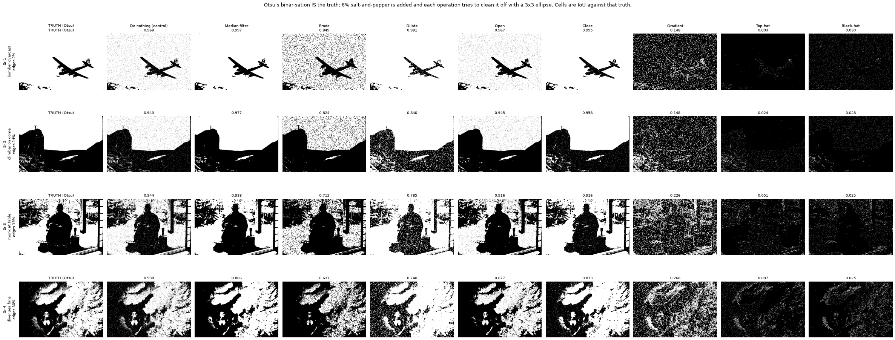
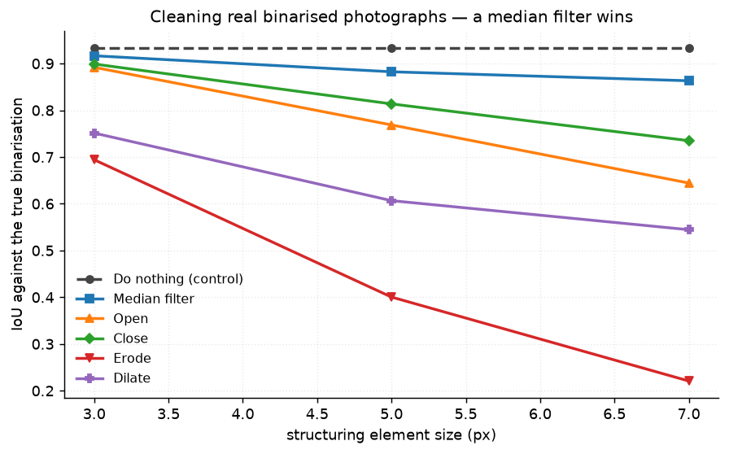
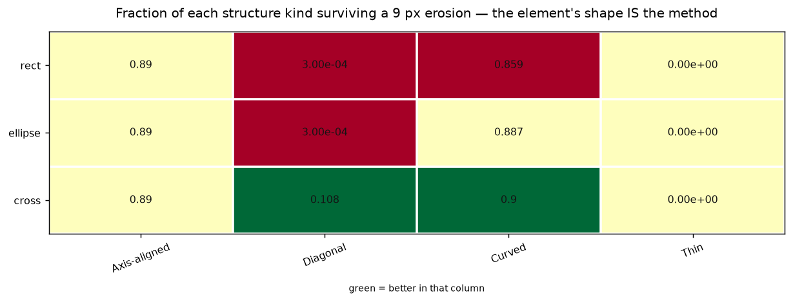
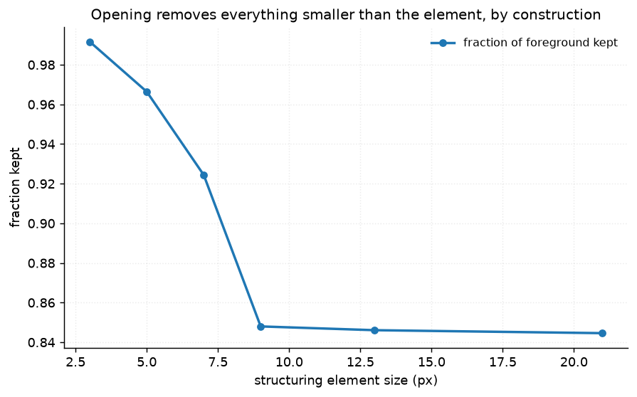
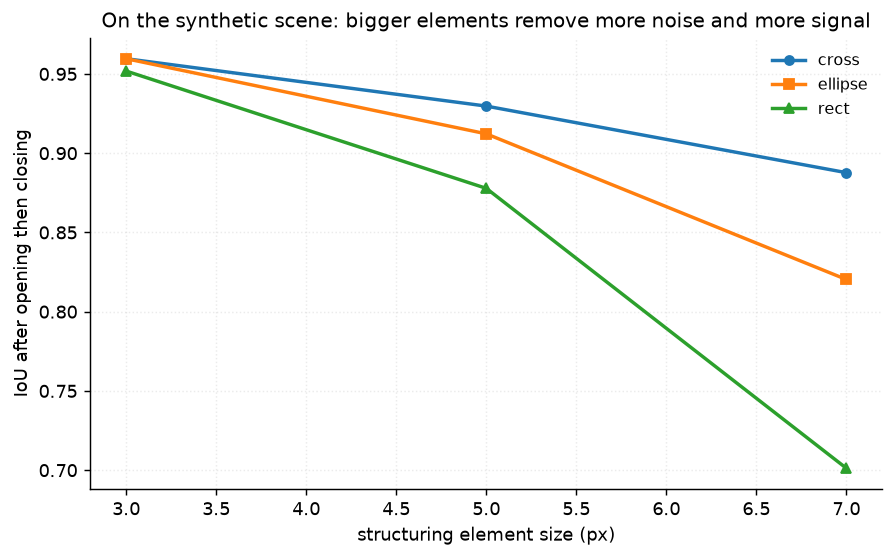

# 22 · Morphology — classical computer vision

[](https://www.python.org/)
[](https://opencv.org/)
[](#)
[](#)

Seven morphological operations — erosion through black-hat — plus
skeletonisation and hit-or-miss, measured on a generated scene with exact
geometry **and** on real photographs where the binarisation itself is the ground
truth.

> **The claim under test:** morphological opening removes noise. Run on a scene
> of rectangles it plainly does. Run on a binarised photograph it does not, and
> the difference is the project.

**No neural network, no training, no GPU.**

---

## Results

Otsu's binarisation of each photograph **is** the truth — not because it is the
correct segmentation of the scene, but because it is a real binary image whose
every pixel is known. 6% salt-and-pepper is added, and each operation tries to
clean it off with a 3×3 ellipse. Cells are IoU against that truth.



| Sr | Scene | **Do nothing** | Median | Erode | Dilate | Open | Close | Gradient | Top-hat | Black-hat |
|---:|---|---:|---:|---:|---:|---:|---:|---:|---:|---:|
| 1 | bomber on overcast · edges 2% | 0.968 | **0.997** | 0.849 | 0.981 | 0.967 | 0.995 | 0.148 | 0.003 | 0.030 |
| 2 | climber on a dome · edges 14% | 0.943 | **0.977** | 0.824 | 0.840 | 0.945 | 0.958 | 0.148 | 0.024 | 0.028 |
| 3 | monk at a table · edges 19% | **0.944** | 0.938 | 0.712 | 0.785 | 0.916 | 0.916 | 0.226 | 0.051 | 0.025 |
| 4 | diver among sea fans · edges 30% | **0.938** | 0.886 | 0.637 | 0.740 | 0.877 | 0.873 | 0.268 | 0.087 | 0.025 |

> **The winner flips with edge density.** On the bomber — one clean silhouette
> against overcast — the median filter reaches 0.997 and closing 0.995, both far
> above the 0.968 noisy input. On the sea fans, **doing nothing wins**: 0.938,
> against the median's 0.886 and closing's 0.873.
>
> The reason is not about noise. A binarised photograph of thin branching
> structure contains genuine single-pixel detail, and every operation that
> removes an isolated noise pixel removes those too. By row 4 the removal costs
> more than the noise did.

Averaged over all twelve photographs, **no structuring element size beats doing
nothing at all**:

| Element size | Do nothing | Median | Best morphological op |
|---|---:|---:|---:|
| 3 | **0.9338** | 0.9167 | Close 0.8990 |
| 5 | **0.9338** | 0.8957 | Close 0.8558 |
| 7 | **0.9338** | 0.8706 | Close 0.8195 |



---

## The synthetic scene says the opposite, and that is the point

| Element | size 3 | size 5 | size 7 |
|---|---:|---:|---:|
| rect | **0.952** | 0.878 | 0.701 |
| ellipse | **0.952** | 0.893 | 0.756 |
| cross | **0.951** | 0.899 | 0.792 |

On a generated scene of rectangles, 5 px lines and circles, an open-then-close
reaches **0.952 IoU** and opening plainly works. That scene has no structure
small enough to lose — the smallest thing in it is a 1 px line and everything
else is tens of pixels across.

A project that ran only the synthetic experiment would have concluded that
morphological denoising works, and published a number that is true about
rectangles and false about photographs. Both are in the results for that reason.
Pinned by `test_nothing_beats_doing_nothing_on_a_binarised_photograph` and
`test_the_synthetic_scene_says_the_opposite`.

---

## The element's shape *is* the method



Fraction of each structure kind surviving a 9 px erosion:

| Element | Axis-aligned | **Diagonal** | Curved | **Thin** |
|---|---:|---:|---:|---:|
| rect | 0.8897 | **0.0003** | 0.8592 | **0.0** |
| ellipse | 0.8897 | **0.0003** | 0.8867 | **0.0** |
| cross | 0.8897 | **0.1084** | 0.8996 | **0.0** |

**All three elements do the same thing to an axis-aligned block** — 0.8897 to
four decimal places. The difference between them is entirely about orientation:
a cross keeps **360× more** diagonal structure than a rectangle or an ellipse.

**And nothing survives that is thinner than the element.** 0.0 for all three,
exactly as the definition requires: opening cannot keep a structure the element
does not fit inside. That is not a failure mode, it is the operation, and it is
why the element size is the only parameter that matters. Pinned by
`test_no_element_preserves_structures_thinner_than_itself`.



---

## Skeletons: connected or fast, not both

| Method | Components | Thinness | Time (ms) |
|---|---:|---:|---:|
| Morphological (open-subtract) | **61** | 0.0429 | **15** |
| Zhang-Suen thinning | **9** | 0.0332 | **6986** |

The morphological skeleton — repeatedly open and subtract — is **not guaranteed
to be connected, and it is not**: it fragments this shape into 61 disconnected
pieces. Zhang-Suen thinning leaves 9, which is close to the number of distinct
structures actually in the scene.

It pays **477×** for that. The thinning implementation here is a pure-Python
iteration over pixel neighbourhoods; a compiled one would close most of the gap,
so read the ratio as a statement about this implementation and the components
column as a statement about the algorithms. Pinned by
`test_the_morphological_skeleton_fragments_the_shape`.

## Hit-or-miss finds every corner exactly

**4 of 4**, with no threshold and no tolerance. Hit-or-miss is a template match
in the morphological algebra: the pattern is either present at a pixel or it is
not. Worth including precisely because nothing else in this repository is exact
in that way — every other method here has a parameter that trades one error
against another, and this one has an answer.

---

## The laws hold

| Element | Opening idempotent | Opening anti-extensive | Closing extensive | Erode/dilate dual |
|---|---|---|---|---|
| rect | ✅ | ✅ | ✅ | ✅ |
| ellipse | ✅ | ✅ | ✅ | ✅ |
| cross | ✅ | ✅ | ✅ | ✅ |

These are theorems, not results: opening twice equals opening once, opening only
removes, closing only adds, and eroding the foreground is dilating the
background. A failure here would be a bug in the implementation rather than a
finding about morphology, which is exactly why they are checked first.

---

## How the images were chosen

Twelve photographs selected by `tools/select_images.py --axis edges`, which
measures the percentage of pixels Canny calls an edge. Morphology acts on the
*size* of structures, so the pool has to contain silhouettes with almost no
internal edge and frames that are nothing but twigs — and the results table
shows those two ends giving opposite answers.

```
bomber_overcast       edges  1.5%    lone_palm_beach       edges  8.6%
hilltop_ruin          edges 11.3%    climber_on_dome       edges 13.1%
carved_figurine       edges 15.2%    elder_headscarf       edges 17.2%
monk_at_table         edges 18.8%    parthenon_columns     edges 20.2%
woman_bundling_straw  edges 22.7%    two_rhinos_scrub      edges 25.2%
diver_sea_fans        edges 29.2%    bench_bare_hedge      edges 37.1%
```

None of these twelve appears in any other project; `tools/check_image_reuse.py`
enforces that by perceptual hash, not by filename.



---

## Try it on your own image

```bash
python infer.py photo.jpg                        # every operation, 3x3 ellipse
python infer.py photo.jpg --size 7 --shape cross
python infer.py photo.jpg --simulate             # add known noise, then score
```

On your own image the binarisation is shown but **no IoU is printed** unless
`--simulate` is given, because without the added noise there is nothing to score
against. `--simulate` binarises, treats that as the truth, adds salt-and-pepper
and scores every operation — the same experiment as the table above.

---

## Limitations

* **"Ground truth" here means self-consistent, not correct.** Otsu's
  binarisation of a photograph is not the right segmentation of the scene; it is
  a real binary image whose pixels are known. That is enough to score a
  *denoiser* exactly, and not enough to say anything about segmentation quality.
  Project 24 handles the segmentation question.
* **One noise model.** Salt-and-pepper is what opening and closing are
  classically prescribed for. Gaussian noise on a grayscale image before
  binarisation would produce boundary jitter instead, which morphology handles
  rather better.
* **Zhang-Suen is pure Python.** The 477× is real as measured and is mostly the
  language. The component counts are the part of that table to rely on.
* **The synthetic scene has four structure kinds** — axis-aligned, diagonal,
  curved, thin. Enough to show that the element's orientation matters; not a
  survey of shapes.

---

## Tests

14 tests, run with `pytest projects/22_morphology/tests -q`. Three check the
algebraic laws, where a failure would be a bug rather than a finding. The rest
pin that hit-or-miss is exact, that the element's shape decides what survives a
diagonal, that nothing thinner than the element survives at all, that no
morphological operation beats doing nothing on a binarised photograph at any
kernel size, that the synthetic scene says the opposite, and that the
morphological skeleton fragments where thinning does not.

---

## Keywords

mathematical morphology · erosion · dilation · opening · closing ·
morphological gradient · top-hat · black-hat · structuring element ·
skeletonisation · Zhang-Suen thinning · hit-or-miss transform · binary image
processing · salt-and-pepper noise · classical computer vision · no deep
learning · OpenCV · Python · CPU only · reproducible image processing experiments

## References

* Serra, *Image Analysis and Mathematical Morphology*, 1982.
* Soille, *Morphological Image Analysis: Principles and Applications*, 2003.
* Zhang & Suen, *A Fast Parallel Algorithm for Thinning Digital Patterns*,
  Communications of the ACM 1984.
* Gonzalez & Woods, *Digital Image Processing*, ch. 9 — the identities checked
  here and the open-subtract skeleton.
