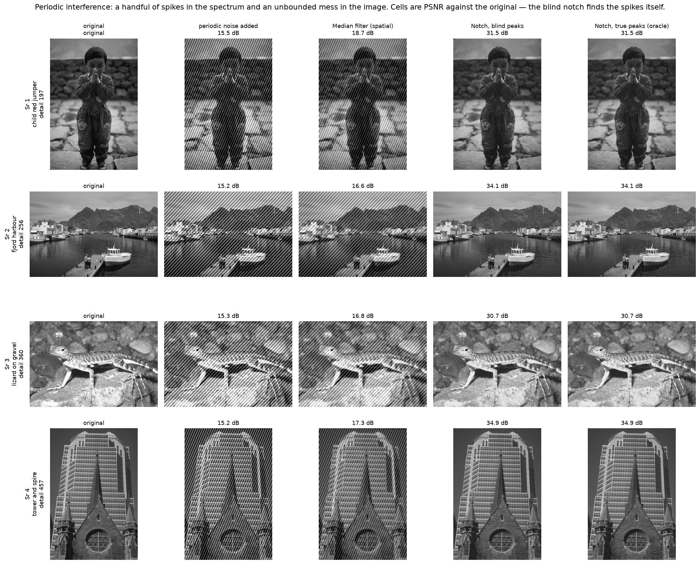
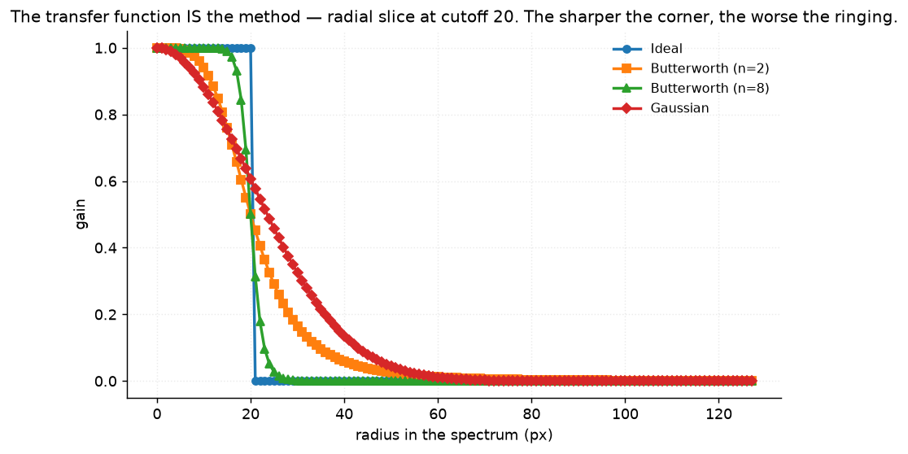
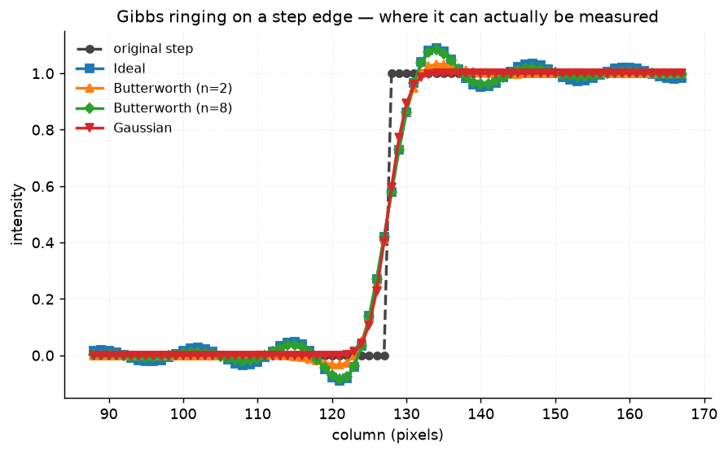
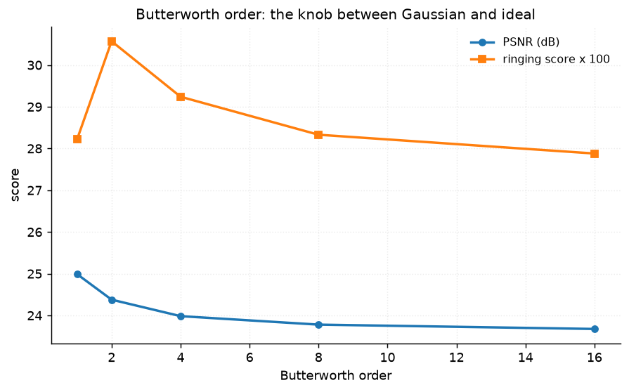
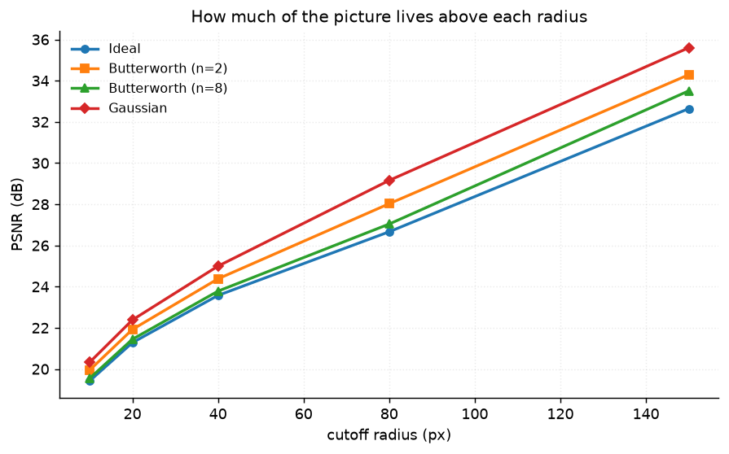

# 23 · FFT filtering — classical computer vision

[](https://www.python.org/)
[](https://opencv.org/)
[](#)
[](#)

Filtering in the frequency domain — ideal, Butterworth and Gaussian low-pass,
notch rejection of periodic interference, and homomorphic illumination
correction — each measured against the spatial method you would otherwise reach
for.

> **The claim under test:** most frequency-domain filtering is a slower way to
> do something the spatial domain does perfectly well. **Except for one thing**,
> and this project is about finding it.

**No neural network, no training, no GPU.**

---

## Results

Periodic interference is a handful of isolated spikes in the spectrum and a
spatially unbounded mess in the image. Cells are PSNR against the original —
and the **blind** notch finds those spikes itself.



| Sr | Scene | Noise added | Median 5×5 (spatial) | **Notch (blind)** | Notch (true peaks) |
|---:|---|---:|---:|---:|---:|
| 1 | child in a red jumper · detail 197 | 15.5 dB | 18.7 dB | **31.5 dB** | 31.5 dB |
| 2 | fjord harbour · detail 256 | 15.2 dB | 16.6 dB | **34.1 dB** | 34.1 dB |
| 3 | lizard on gravel · detail 360 | 15.3 dB | 16.8 dB | **30.7 dB** | 30.7 dB |
| 4 | tower and spire · detail 457 | 15.2 dB | 17.3 dB | **34.9 dB** | 34.9 dB |

Averaged over all twelve photographs:

| Method | PSNR (dB) |
|---|---:|
| Noisy input | 15.52 |
| Median filter, 5×5 (spatial) | **17.25** |
| **Notch, blind peaks** | **30.14** |
| Notch, true peaks (oracle) | 30.14 |

> **+14.62 dB, and the spatial median recovers 1.73 of it.** This is the thing
> the frequency domain does that the spatial domain cannot. The interference is
> two sinusoids: two bright points in the spectrum, and every pixel in the
> image. A 5×5 median sees a local neighbourhood and the noise is not local.
>
> **The blind notch scores identically to the oracle** — 0.000 dB apart, with
> **0.0 px** peak-localisation error. It is handed nothing and finds exactly the
> frequencies the noise was added at. Almost nothing else in this repository
> matches its own ceiling.
>
> **The median's gain shrinks as the picture gets busier and the notch's does
> not.** Across all twelve photographs the median recovers between **−0.25 and
> +3.25 dB** and correlates with detail at **−0.48**; the notch recovers between
> **+10.36 and +19.74 dB** at **−0.11**. The median is trading the image's own
> detail against the noise, so a detailed image has more to lose. The notch
> removes two frequencies and leaves everything else alone, so it barely cares
> what the picture is of.

---

## The transfer function *is* the method



A radial slice through each mask says everything the filter will do, including
whether it will ring. The sharper the corner, the worse the ringing — and that
is not a metaphor, it is the Fourier transform of the corner.



Measured on a step edge at cutoff 20:

| Filter | Oscillations | **Overshoot** |
|---|---:|---:|
| **Ideal** | 4 | **0.0908** |
| Butterworth (n=8) | 4 | 0.0841 |
| Butterworth (n=2) | 0 | 0.0336 |
| **Gaussian** | **0** | **0.0000** |

Exactly the textbook ordering. Butterworth is the knob between the two
extremes: its ringing grows monotonically with order and approaches the ideal
filter's as n → ∞. Pinned by `test_ringing_rises_with_how_sharp_the_cutoff_is`.



### Ringing had to be measured somewhere it could be measured

The obvious approach — count sign changes of the error in a band beside the
edges of a photograph — **ranks the filters backwards**:

| Filter at cutoff 40 | Ideal | Butterworth (n=2) | Butterworth (n=8) | Gaussian |
|---|---:|---:|---:|---:|
| Photograph "ringing score" | **0.233** | 0.273 | 0.240 | **0.302** |

Gaussian is scored as the *worst* ringer and it does not ring at all. A natural
image has edges everywhere, so the band beside one edge is full of other edges
and the score measures ordinary blur error. Three alternatives were tried —
error amplitude near edges minus far from edges, sign changes weighted by local
error, peak excursion in the band — and none separated the filters by more than
the variation between images.

So ringing is measured on a synthetic step, where a hard spectral truncation
produces the classic Gibbs oscillation and a smooth one does not. The failed
metric is kept in the code and pinned by
`test_the_photograph_ringing_score_does_not_separate_the_filters`, so that
nobody quotes it.

**And the oscillation count needed a second fix.** Counting every turn in the
step profile gave Gaussian **147** oscillations against the ideal filter's 42 —
backwards again, because a Gaussian-filtered step is almost perfectly flat away
from the edge and its floating-point wiggle counts as a turn. `RINGING_FLOOR`
is one uint8 level; below that it could not be seen in the image anyway.

---

## Low-pass filtering: the spatial domain wins on everything except ringing

| Filter | PSNR (dB) | SSIM | Time (ms) |
|---|---:|---:|---:|
| Ideal | 23.94 | 0.6540 | 23.1 |
| Butterworth (n=2) | 24.38 | 0.6826 | 23.2 |
| Butterworth (n=8) | 23.78 | 0.6343 | 23.1 |
| **Gaussian** | **25.00** | **0.7229** | 23.4 |

Gaussian wins, and a Gaussian low-pass is exactly what `cv2.GaussianBlur` does
in the spatial domain in a fraction of a millisecond. The 23 ms here is the
price of two transforms to reach the same answer.



The frequency domain earns its keep when the *filter* is easier to describe
there than here — a notch at two isolated frequencies, or a band-reject — not
when it is a blur.

---

## Homomorphic filtering, and a brightness trap seen before

| Method | PSNR raw (dB) | **PSNR matched (dB)** |
|---|---:|---:|
| Uneven input | 14.61 | 14.61 |
| CLAHE (spatial) | **17.71** | 17.71 |
| Homomorphic | **9.46** | **15.84** |

Scored raw, homomorphic filtering lands **5.15 dB below the uneven input it was
supposed to fix** — which reads as a method that does not work.

It works. `gamma_low = 0.5` multiplies the low-frequency band of the **log**
image by a half, and the DC term lives in that band, so the whole picture comes
back at about a third of its brightness. Matched, it reaches 15.84 dB and is
clearly ahead of its input — **+6.38 dB of the raw score was brightness alone**.

The formula is left exactly as Gonzalez & Woods write it; the scoring is what
changed. Project 16's high-boost row is the same trap, found independently.

**CLAHE still wins**, at 17.71 dB and in the spatial domain. Homomorphic
filtering's advantage is conceptual — it separates illumination from reflectance
in a way a local contrast operator does not model at all — and on this
degradation that advantage does not show up in the number.

---

## How the images were chosen

Twelve photographs selected by `tools/select_images.py --axis detail`, which
measures mean gradient magnitude — a direct proxy for how much of the picture
lives in the high frequencies a low-pass throws away.

```
hazy_ridges         detail  59    whitewashed_chapel  detail 158
child_red_jumper    detail 193    geese_and_goslings  detail 223
fjord_harbour       detail 250    woman_hanbok        detail 277
graffiti_wall       detail 300    stone_wellhead      detail 321
lizard_on_gravel    detail 358    hawk_and_chick      detail 406
tower_and_spire     detail 453    couple_autumn_bank  detail 688
```

The axis is what makes the median's collapse visible in the results table: it
loses 3.5 dB between the smoothest and the busiest scene, and the notch loses
3.8 dB while staying 12 dB ahead.

None of these twelve appears in any other project; `tools/check_image_reuse.py`
enforces that by perceptual hash, not by filename.

---

## Try it on your own image

```bash
python infer.py photo.jpg                     # spectrum, detected peaks, low-pass
python infer.py photo.jpg --simulate          # add known interference, then score
python infer.py photo.jpg --notch --out clean.png
```

On a real photograph there is no clean original, so **no PSNR is printed**. What
*is* printed is the spectrum's strongest off-DC peaks and how far above the
local background they stand — the measurement that says whether your image has
periodic interference worth notching at all. `--simulate` adds interference at
known frequencies so everything can be scored.

---

## Limitations

* **Everything is grayscale.** The transforms run on luminance. A colour notch
  would need the same mask applied per channel, which is straightforward and
  not what this project is about.
* **The periodic noise is two pure sinusoids.** Real interference — scanner
  banding, mains hum, halftone screens — is a comb of harmonics, and a notch has
  to remove each one. The blind detector here finds the two strongest peaks; a
  real one would need to find a series.
* **The notch is the best case for the frequency domain, deliberately.** Chosen
  because it is the clearest example of a filter that is trivial to describe in
  frequency and impossible in space. The low-pass table is the honest other half.
* **One illumination model** for the homomorphic experiment — a smooth radial
  falloff. Real uneven lighting has shadows with edges, which violates the
  "illumination is low frequency" assumption the method rests on.
* **Twelve photographs.** Enough to show the median's collapse with detail and
  the notch's stability; not enough to quote either slope.

---

## Tests

15 tests, run with `pytest projects/23_fft_filtering/tests -q`. They pin that
the transform round-trips, that every mask is bounded and passes DC, that
ringing rises with the sharpness of the cutoff on a step edge, that the
oscillation count needs its amplitude floor, and the findings: that the notch
beats the spatial median by more than 10 dB, that the blind peak finder matches
its own oracle exactly, that homomorphic filtering is scored on brightness
unless matched, and that the photograph ringing score is still backwards — kept
so nobody quotes it.

---

## Keywords

frequency domain filtering · Fourier transform · FFT · low-pass filter ·
Butterworth filter · Gaussian filter · ideal filter · Gibbs ringing · notch
filter · periodic noise removal · homomorphic filtering · illumination
correction · power spectrum · classical computer vision · no deep learning ·
OpenCV · Python · CPU only · reproducible image processing experiments

## References

* Gonzalez & Woods, *Digital Image Processing*, ch. 4 — the filter families,
  the notch construction and the homomorphic formulation used verbatim here.
* Cooley & Tukey, *An Algorithm for the Machine Calculation of Complex Fourier
  Series*, Mathematics of Computation 1965.
* Oppenheim, Schafer & Stockham, *Nonlinear Filtering of Multiplied and
  Convolved Signals*, Proceedings of the IEEE 1968 — homomorphic filtering.
* Gibbs, *Fourier's Series*, Nature 1898 — the overshoot measured on the step.
