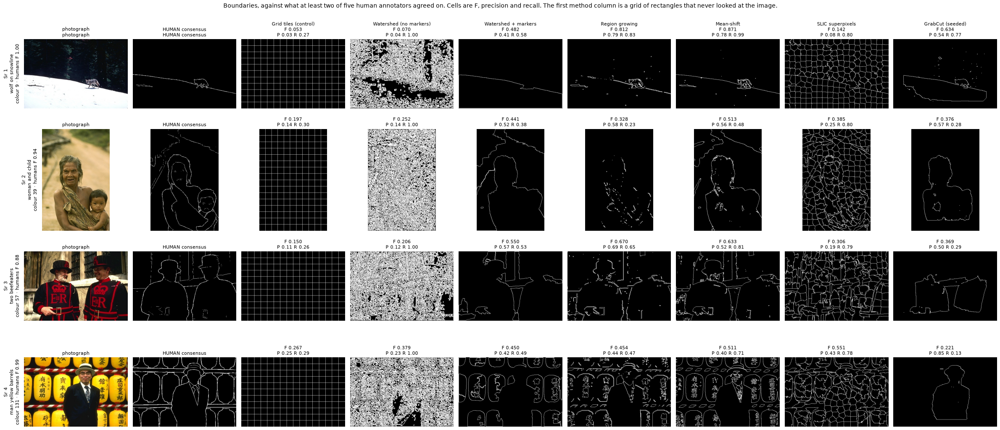
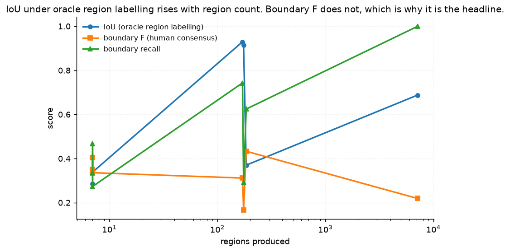
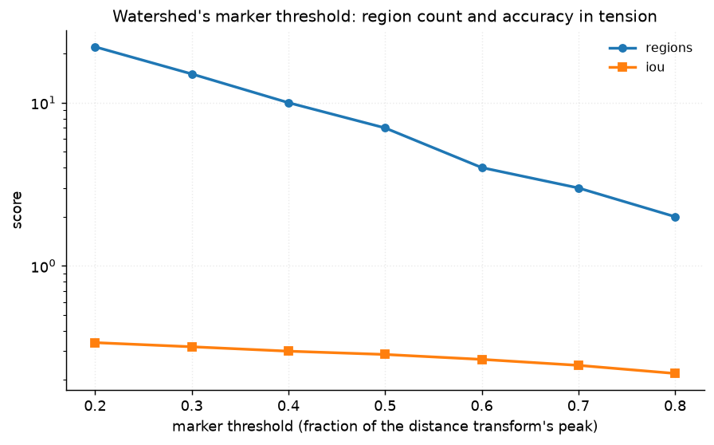
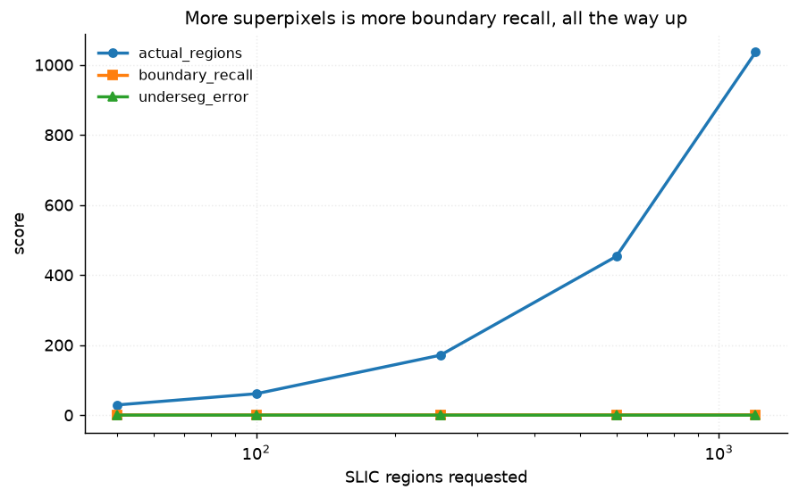
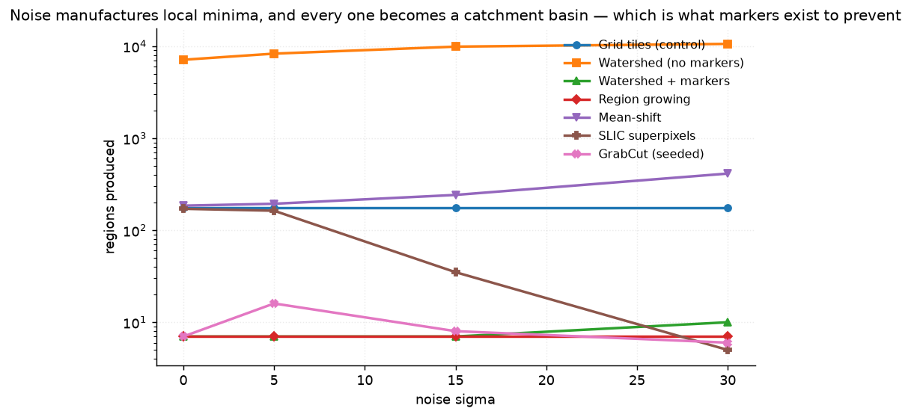
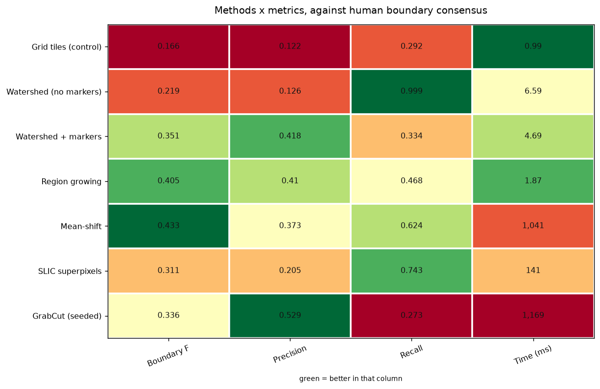

# 24 · Region segmentation — classical computer vision

[](https://www.python.org/)
[](https://opencv.org/)
[](#)
[](#)

Six segmentation methods — watershed with and without markers, region growing,
mean-shift, SLIC superpixels and seeded GrabCut — scored against **human
annotations**, plus a seventh row that is a grid of rectangles and is in the
table on purpose.

> **The claim under test:** segmentation quality is hard to measure, and the
> obvious metric is worse than useless. This project has two ceilings — what
> people achieve, and what a grid achieves — and the methods sit between them.

**No neural network, no training, no GPU.**

---

## Results

Boundaries, against what at least **two of five human annotators** agreed on.
Cells are F-measure at a 2 px matching tolerance. The first method column is a
grid of rectangles that never looked at the image.



Averaged over all twelve photographs:

| Method | **Boundary F** | Precision | Recall | Regions | Time (ms) |
|---|---:|---:|---:|---:|---:|
| *Another human (ceiling)* | ***0.904*** | — | — | — | — |
| **Mean-shift** | **0.4331** | 0.373 | 0.624 | 185 | 1096 |
| Region growing | 0.4051 | 0.410 | 0.468 | 7 | **1.9** |
| Watershed + markers | 0.3512 | 0.418 | 0.334 | 7 | 5.3 |
| GrabCut (seeded) | 0.3358 | **0.529** | 0.273 | 7 | 1248 |
| SLIC superpixels | 0.3115 | 0.205 | **0.743** | 171 | 147 |
| Watershed (no markers) | 0.2190 | 0.126 | **0.999** | **7126** | 7.1 |
| **Grid tiles (control)** | **0.1663** | 0.122 | 0.292 | 175 | 1.1 |

> **The best method reaches less than half the human ceiling.** Mean-shift
> scores F 0.433 where the best annotator scores 0.904 against the consensus of
> the others. This is not a close-run thing.
>
> **The grid is last, which is where a grid belongs.** That sentence is the
> point of this project, because on the obvious metric it is not last at all.
>
> **Read precision and recall together or not at all.** Watershed without
> markers has **0.999 recall** — it draws 7126 regions, so its boundaries
> include essentially every true boundary by accident — and 0.126 precision.
> SLIC is the same trade in miniature: 0.743 recall, 0.205 precision. GrabCut is
> the opposite: the highest precision in the table, 0.529, from seven regions it
> is confident about.

---

## The obvious metric ranks a grid of rectangles second

The natural thing to measure is IoU against a foreground mask. Doing that gives
this table:

| Method | IoU (oracle region labelling) | Regions |
|---|---:|---:|
| SLIC superpixels | **0.9295** | 171 |
| **Grid tiles (control)** | **0.9140** | 175 |
| Watershed (no markers) | 0.6876 | 7126 |
| Region growing | 0.4081 | 7 |
| Mean-shift | 0.3699 | 185 |
| GrabCut (seeded) | 0.3384 | 7 |
| Watershed + markers | 0.2860 | 7 |

**A grid of rectangles that has never looked at the image scores 0.914 and beats
five of the six real methods.** It beats mean-shift, the best method by boundary
F, by 0.54.

Two things conspire to produce that.

**The region-to-foreground conversion uses the truth.** `labels_to_foreground`
assigns each region to foreground or background by which it overlaps more. That
is deliberately generous — so a low score cannot be blamed on the conversion —
and the consequence is that **the more regions a method returns, the more the
oracle assignment can do for it**. At one region per pixel the score is 1.0 for
any method whatsoever.

**And the binary target was wrong in the first place.** A human segmentation is
a *labelling*, not a figure/ground split. `dominant_foreground` takes the largest
annotated region to be the background and inverts it, which fails whenever that
is not true: on `memorial_arch` the largest region covers 24.5% of the frame, so
the "foreground" is 75.5% of the picture and corresponds to nothing anyone drew.
Methods returning sensible regions score **0.000** against it.



Boundary F is the metric BSDS was built for and the one every published number
on it uses. It does not reward region count, and under it the grid sits last.
Pinned by `test_a_grid_of_rectangles_beats_most_real_methods_on_iou` and
`test_boundary_recall_separates_what_iou_cannot`.

---

## The ceiling is people, and people disagree

This is the only project in the repository whose ground truth was made by
humans. Everywhere else the truth is generated (a flow field, a blur kernel) or
defined by construction (Otsu's binarisation declared to be the target). Both
are exact, and both answer a question nobody asked.

BSDS500 ships five to seven annotators per image. Scoring one against the
consensus of the others gives a ceiling that is measured rather than assumed:

| | Boundary F |
|---|---:|
| Best annotator vs consensus | **0.904** |
| Mean annotator vs consensus | 0.841 |

Published human agreement on BSDS is about 0.79 F, so these numbers are in the
right place — which is the check that the measurement is right rather than
merely favourable.

**And the disagreement is not uniform.** Under the figure/ground reading, two
annotators agree at 0.996 IoU on the wolf against a snowline — an unambiguous
figure — and at **0.184** on a train crossing a viaduct, where they do not agree
about what the background even is. An algorithm scoring 0.5 on that image is not
failing; the question is.

---

## Watershed's marker threshold, and SLIC's region count




Both parameters do the same thing: trade region count against how much of the
picture each region is allowed to contain. SLIC's boundary recall rises
monotonically with the number of superpixels requested, all the way up — which
is the same ungameable-metric problem seen from the other side. Recall alone
would say "ask for more superpixels" without limit.



---

## How the images were chosen

Twelve photographs selected by `tools/select_images.py --axis colour`, which
measures Hasler–Süsstrunk colourfulness. Every method here groups pixels by
appearance, so how far appearance and object agree is what the score is really
about — and the pool has to contain both a caterpillar that shares its stem's
hue and a man in front of bright yellow barrels.

```
wolf_on_snowline     colour   9.3    tiger_in_shade      colour  21.7
train_on_viaduct     colour  26.1    caterpillar_on_stem colour  29.7
gunner_reenactor     colour  32.7    morel_mushrooms     colour  36.2
woman_and_child      colour  38.9    fox_cubs            colour  43.0
memorial_arch        colour  47.2    florence_duomo      colour  54.1
two_beefeaters       colour  63.1    man_yellow_barrels  colour 124.3
```

All twelve come from BSDS500 and so carry human annotations. None appears in any
other project; `tools/check_image_reuse.py` enforces that by perceptual hash.



---

## Try it on your own image

```bash
python infer.py photo.jpg                          # region counts, no invented score
python infer.py --annotated tiger_in_shade         # score against human boundaries
python infer.py photo.jpg --method "SLIC superpixels" --out regions.png
```

On your own photograph **no score is printed** — there is no annotation, and on
the images that do have one, two people only agree at F 0.90. What is printed is
the region count and the largest region's share of the frame, which together say
whether a method has over- or under-segmented. `--annotated` scores every method
against the human consensus on one of the twelve.

---

## Limitations

* **Twelve images is not a BSDS benchmark.** The published protocol uses all 200
  test images and sweeps a threshold per method to find its best operating
  point. These numbers are internally consistent and are not comparable with
  published BSDS figures.
* **The methods are unthresholded.** Every published boundary-detection number
  on BSDS comes from a soft boundary map swept across thresholds; these methods
  emit hard region labellings, so each gets a single operating point rather than
  a curve. That is a real disadvantage for the ones producing many regions.
* **A 2 px matching tolerance** is the usual choice and it matters: at 0 px every
  method scores near zero, since a correct boundary drawn one pixel over counts
  as two errors.
* **Consensus is set at two annotators.** At one the target is the union of every
  stray mark; at five it is nearly empty. Two is stated rather than tuned.
* **`labels_to_foreground` and `dominant_foreground` are kept although both are
  flawed**, because the flaws are the finding. Neither is used for the headline.

---

## Tests

11 tests, run with `pytest projects/24_region_segmentation/tests -q`. They pin
that every image has several human annotations, that the human ceiling is
measured and is not 1.0, that consensus needs more than one vote, and the
findings: that a grid of rectangles beats most real methods on IoU, that
boundary F separates what IoU cannot, that more superpixels is always a higher
IoU, that the most over-segmented method has near-perfect boundary recall, and
that the grid control genuinely looks at nothing.

---

## Keywords

image segmentation · region growing · watershed · marker-controlled watershed ·
mean shift · SLIC superpixels · GrabCut · BSDS500 · boundary F-measure ·
inter-annotator agreement · undersegmentation error · evaluation metrics ·
classical computer vision · no deep learning · OpenCV · Python · CPU only ·
reproducible image processing experiments

## References

* Martin, Fowlkes, Tal & Malik, *A Database of Human Segmented Natural Images*,
  ICCV 2001 — the annotations and the boundary F-measure protocol.
* Arbeláez, Maire, Fowlkes & Malik, *Contour Detection and Hierarchical Image
  Segmentation*, IEEE TPAMI 2011 — BSDS500 and the human-agreement figure.
* Achanta et al., *SLIC Superpixels Compared to State-of-the-art Superpixel
  Methods*, IEEE TPAMI 2012.
* Comaniciu & Meer, *Mean Shift: A Robust Approach Toward Feature Space
  Analysis*, IEEE TPAMI 2002.
* Rother, Kolmogorov & Blake, *GrabCut: Interactive Foreground Extraction using
  Iterated Graph Cuts*, SIGGRAPH 2004.
* Beucher & Meyer, *The Morphological Approach to Segmentation: The Watershed
  Transformation*, 1993.
