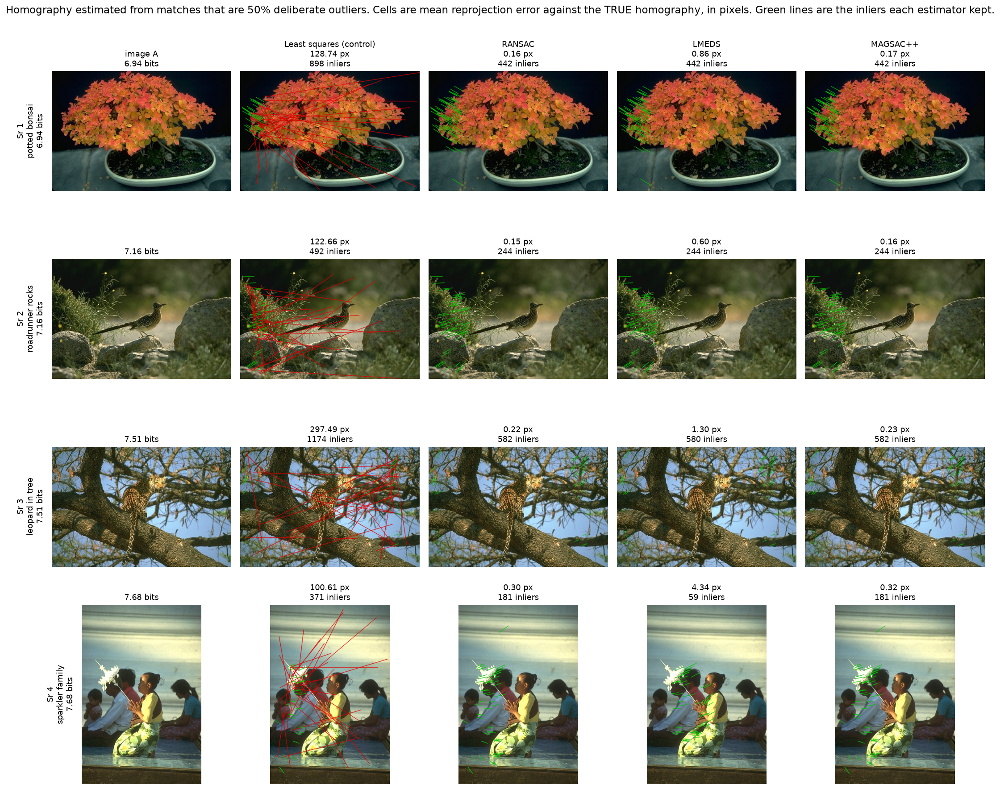
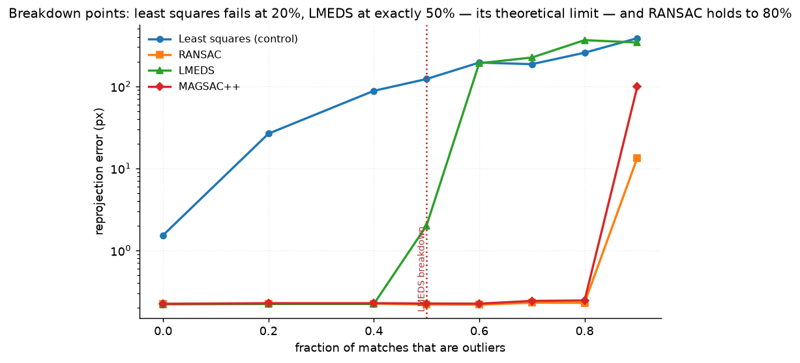
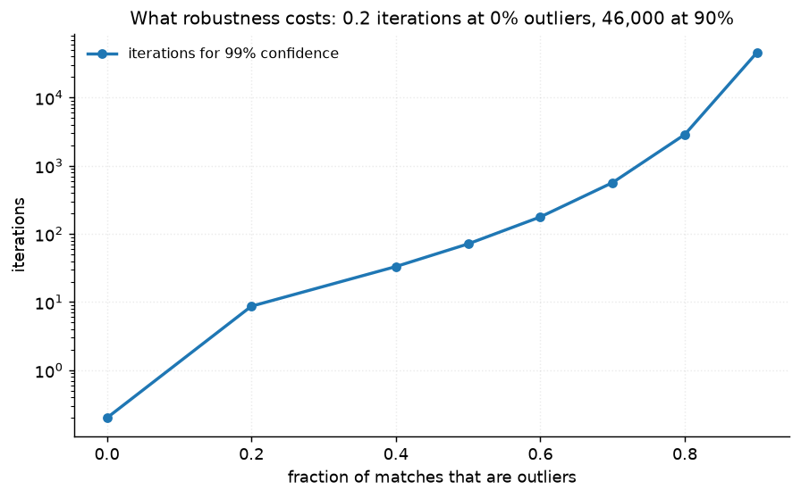
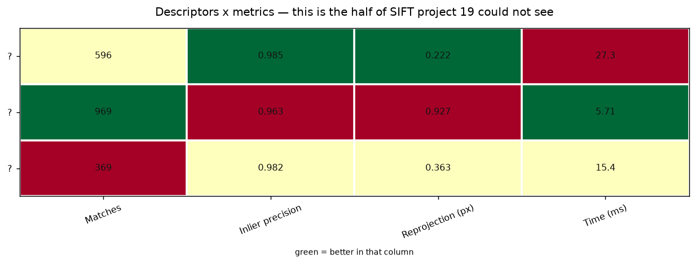
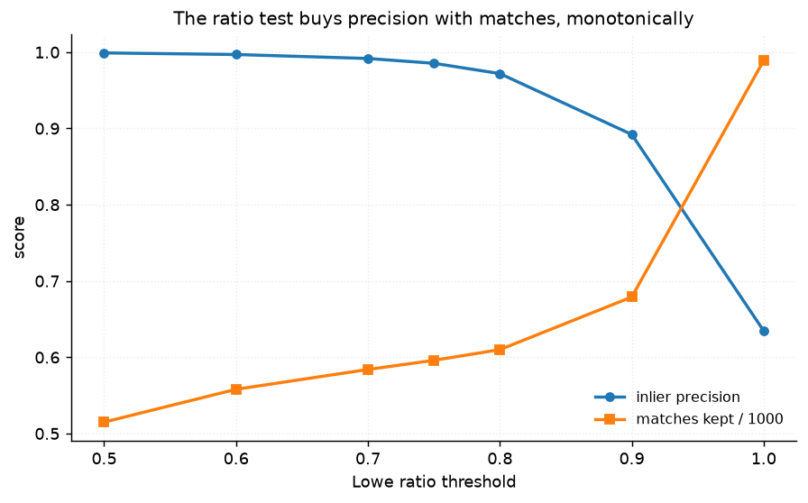

# 25 · Matching + RANSAC — classical computer vision

[](https://www.python.org/)
[](https://opencv.org/)
[](#)
[](#)

Three descriptors, three match filters and four homography estimators, against
a **known** homography — so every match can be labelled a true inlier or a true
outlier before any estimator runs.

> **The claim under test:** every robust estimator has a breakdown point, and
> LMEDS's is a theorem. It cannot survive more than half the data being wrong.
> This project checks that number rather than quoting it.

**No neural network, no training, no GPU.**

---

## Results

A homography estimated from matches that are **50% deliberate outliers** — the
exact fraction at which LMEDS is supposed to fail. Cells are mean reprojection
error against the true homography, measured on the **true** correspondences, not
on whatever each estimator decided to keep.



Averaged over all twelve photographs, swept across the outlier fraction:

| Outliers | RANSAC iterations needed | Least squares | **RANSAC** | **LMEDS** | MAGSAC++ |
|---|---:|---:|---:|---:|---:|
| 0% | 0.2 | 1.53 | **0.222** | **0.220** | 0.223 |
| 20% | 8.7 | **26.47** | 0.224 | 0.222 | 0.227 |
| 40% | 33.2 | 88.01 | 0.224 | **0.222** | 0.227 |
| **50%** | 71.4 | 122.58 | 0.219 | **2.004** | 0.225 |
| **60%** | 177.6 | 194.47 | 0.218 | **190.86** | 0.224 |
| 70% | 566.2 | 186.00 | 0.230 | 224.15 | 0.242 |
| 80% | 2,876 | 256.45 | **0.229** | 365.15 | 0.245 |
| 90% | **46,049** | 385.64 | **13.36** | 341.58 | 98.46 |

> **LMEDS breaks at exactly 50%, and the table catches it mid-fall.** 0.222 px
> at 40%, **2.004 px at 50%**, 190.9 px at 60%. Least Median of Squares
> minimises a median, so once more than half the data is wrong the median *is* an
> outlier and the fit follows it. That is a theorem about the estimator, not a
> property of this data, and the measurement lands on it.
>
> **Least squares is destroyed by a fifth of the data** — 1.53 px clean, 26.47 px
> at 20% outliers, a factor of 17. This is the control that explains why the
> other three exist.
>
> **RANSAC holds to 80%** at 0.229 px and breaks at 90%. MAGSAC++ tracks it
> almost exactly and then degrades more gracefully at the far end.



---

## What robustness costs



The closed form for the number of random samples needed to see one all-inlier
set with 99% confidence, at four points per sample:

| Outliers | 0% | 20% | 40% | 60% | 70% | 80% | **90%** |
|---|---:|---:|---:|---:|---:|---:|---:|
| Iterations | 0.2 | 8.7 | 33 | 178 | 566 | 2,876 | **46,049** |

RANSAC's robustness is not free and the price is not linear — it is exponential
in the sample size. A homography needs four points, so at 90% outliers the
chance of drawing four good ones is 0.1⁴ = one in ten thousand. **That is why
90% is where RANSAC breaks here**: not because the algorithm changes, but
because the iteration budget runs out. Pinned by
`test_the_iteration_count_matches_the_closed_form`.

---

## SIFT wins here, and lost in project 19

| Descriptor | Matches | Inlier precision | **Reprojection (px)** | Time (ms) |
|---|---:|---:|---:|---:|
| **SIFT** | 596 | **0.9854** | **0.222** | 27.3 |
| ORB | **969** | 0.9633 | 0.927 | **5.7** |
| AKAZE | 369 | 0.9823 | 0.363 | 15.4 |

**SIFT's matches reproject four times more accurately than ORB's** — 0.222 px
against 0.927 — at 4.8× the cost.

[Project 19](../19_keypoint_detectors/) measured *detector* repeatability and
found the opposite: ORB was both faster **and** more repeatable than SIFT, which
made the usual "ORB trades accuracy for speed" look simply wrong.

Both results are correct and they are about different things. SIFT's value is
not in where it puts keypoints; it is in the 128-dimensional description of what
is around them. Project 19 could not see that, because a repeatability score
never opens the descriptor. Neither project alone supports "SIFT is better" or
"ORB is better"; together they support **"they are better at different
things"**, which is the only statement worth carrying away. Pinned by
`test_sift_wins_on_descriptor_accuracy_where_orb_won_on_detection`.



---

## The ratio test is a dial, not a setting



| Ratio | 0.5 | 0.6 | 0.7 | **0.75** | 0.8 | 0.9 | 1.0 |
|---|---:|---:|---:|---:|---:|---:|---:|
| Inlier precision | **0.999** | 0.996 | 0.990 | 0.985 | 0.975 | 0.904 | **0.635** |
| Matches kept | 515 | 560 | 585 | 596 | 610 | 672 | **989** |

Monotone in both directions, which is what makes it usable. At 1.0 the test is
off and a third of the matches are wrong; at 0.5 essentially none are, and half
the matches are gone. Lowe's 0.75 sits where the precision curve has flattened
but the match count has not yet collapsed.

| Filter | Matches kept | Inlier precision | Inlier recall |
|---|---:|---:|---:|
| All nearest neighbours | **989** | 0.635 | **1.000** |
| Cross-check | 664 | 0.911 | 0.977 |
| **Ratio test 0.75** | 596 | **0.985** | 0.949 |

Cross-check sits exactly between them on every column — more precise than no
filter, less precise than the ratio test, and it keeps more matches than either
of those positions would suggest. Pinned by
`test_cross_check_sits_between_no_filter_and_the_ratio_test`.

---

## Measuring the estimators honestly

Reprojection error is computed against the **true** homography, using the
**true** inlier correspondences — not the ones the estimator chose.

That distinction is the difference between an experiment and a self-report. An
estimator that keeps four points and fits them perfectly has zero error on its
own inlier set and an arbitrarily bad homography. Because `make_pair` generates
H, every correspondence can be labelled before any estimator runs, and the score
is then about the transform rather than about the estimator's confidence in
itself. Pinned by
`test_the_drawing_helper_reports_error_against_the_truth_not_its_own_inliers`.

In the figure, **green lines are inliers the estimator kept and red lines are
outliers it kept** — so a row shows the mistake, not only the score.

---

## How the images were chosen

Twelve photographs selected by `tools/select_images.py --axis entropy`, which
measures bits per pixel in the luminance histogram — a direct measure of how
much there is in the frame for a descriptor to describe.

```
archer_dancer        4.34 bits    sea_shell_coral      6.53 bits
potted_bonsai        6.91 bits    porcupine_on_branch  7.02 bits
roadrunner_rocks     7.15 bits    gilded_stupa         7.24 bits
headland_lighthouse  7.32 bits    station_platform     7.41 bits
leopard_in_tree      7.49 bits    snowboarder_pines    7.59 bits
sparkler_family      7.68 bits    man_drying_fish      7.91 bits
```

The low end matters: a dancer on a black stage gives a descriptor almost nothing
to work with over most of the frame, and `gilded_stupa` adds the opposite
problem — repeated architecture, where a descriptor finds many equally good
matches and the ratio test is the only thing standing between that and nonsense.

None of these twelve appears in any other project; `tools/check_image_reuse.py`
enforces that by perceptual hash, not by filename.

---

## Try it on your own images

```bash
python infer.py a.jpg b.jpg                      # match and estimate, no invented error
python infer.py photo.jpg --simulate             # warp it by a known H, then score
python infer.py a.jpg b.jpg --descriptor ORB --estimator LMEDS --out matches.png
```

With two real photographs the true homography is unknown, so **no reprojection
error is printed**. What is printed is the inlier count and the *ratio* of
inliers each estimator kept — which is the only signal available without a
truth, and which is exactly the self-report this project warns about. `--simulate`
applies a known homography so the numbers mean something.

---

## Limitations

* **The two views are one photograph and a homography.** No parallax, no
  occlusion, no lighting change, no genuinely new content. That is what makes
  the truth exact, and it is the reason these inlier precisions are far above
  what two real photographs of a scene produce.
* **Outliers are injected uniformly at random.** Real mismatches are structured —
  repeated windows, foliage, brickwork — and cluster in a way that can fool
  RANSAC into a consistent wrong answer. Uniform outliers are the easy case, and
  even they cost 46,000 iterations at 90%.
* **One geometric model.** A homography needs four points; a fundamental matrix
  needs seven or eight, which makes the same outlier fraction far more expensive.
  The breakdown points move with the sample size.
* **MAGSAC++ is OpenCV's implementation** and the others are thin wrappers over
  `cv2.findHomography`. The comparison is of estimator families, not of
  implementations.

---

## Tests

10 tests, run with `pytest projects/25_matching_ransac/tests -q`. They pin that
the known homography really does let every match be labelled, that injecting
outliers injects them, and the findings: that LMEDS breaks at its theoretical
50%, that RANSAC survives to 80% and not to 90%, that least squares is destroyed
by a fifth of the data, that the iteration count matches the closed form, that
SIFT wins on descriptor accuracy where ORB won on detection, and that the ratio
test trades precision against matches monotonically.

---

## Keywords

feature matching · descriptor matching · SIFT · ORB · AKAZE · Lowe ratio test ·
cross-check · RANSAC · LMEDS · MAGSAC · robust estimation · breakdown point ·
homography estimation · reprojection error · outlier rejection · classical
computer vision · no deep learning · OpenCV · Python · CPU only · reproducible
image processing experiments

## References

* Fischler & Bolles, *Random Sample Consensus*, Communications of the ACM 1981.
* Rousseeuw, *Least Median of Squares Regression*, JASA 1984 — the 50% breakdown
  point measured here.
* Lowe, *Distinctive Image Features from Scale-Invariant Keypoints*, IJCV 2004 —
  the ratio test and its 0.75 default.
* Barath et al., *MAGSAC++, a Fast, Reliable and Accurate Robust Estimator*,
  CVPR 2020.
* Hartley & Zisserman, *Multiple View Geometry in Computer Vision*, 2nd ed. —
  the iteration-count formula.
