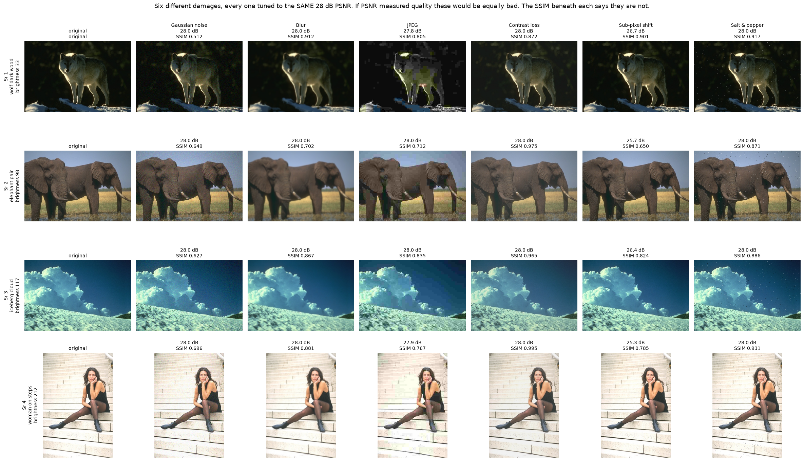
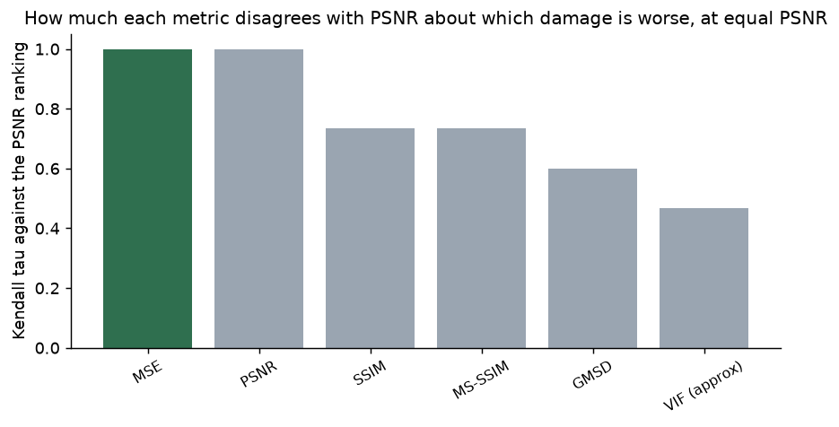
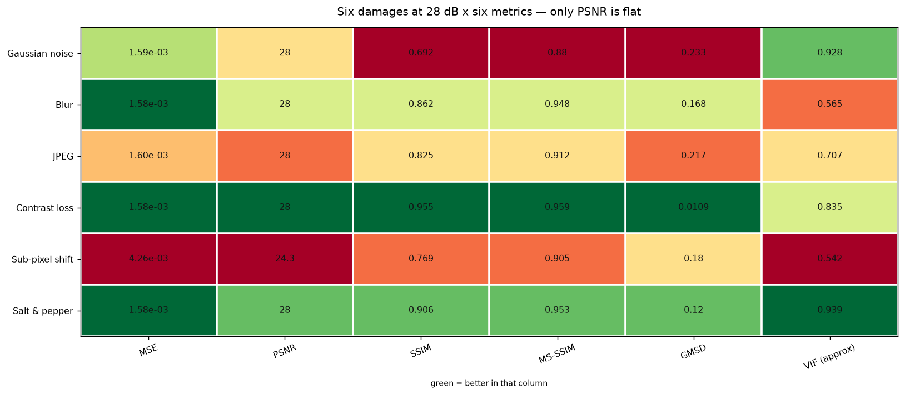
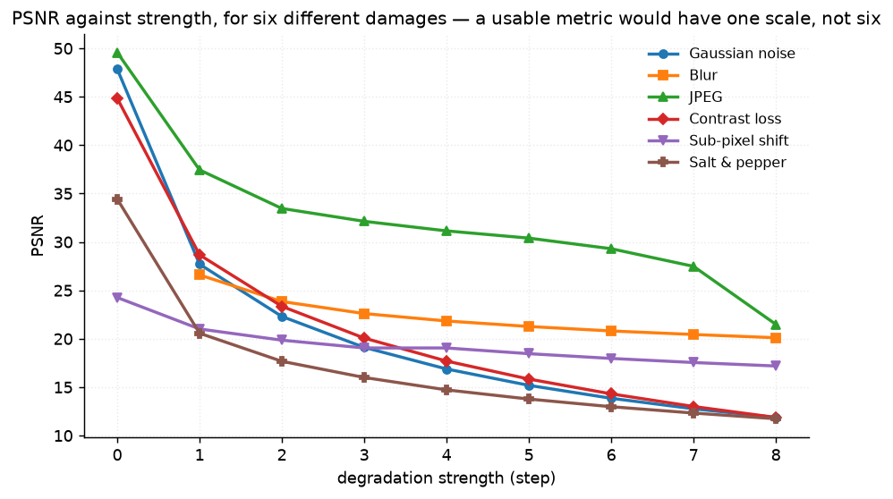
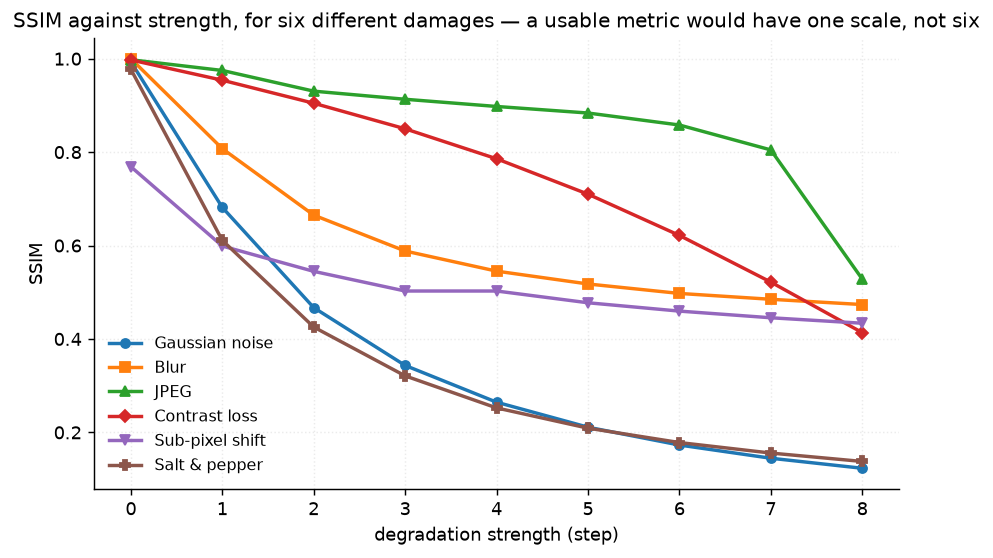

# 26 · Quality metrics — classical computer vision

[](https://www.python.org/)
[](https://opencv.org/)
[](#)
[](#)

Six full-reference metrics — MSE, PSNR, SSIM, MS-SSIM, GMSD and a VIF
approximation — measured against six different damages, **every one tuned by
bisection to exactly the same PSNR**.

> **The claim under test:** if PSNR measured what people mean by image quality,
> six images at 28 dB would be equally bad. The experiment is to build them and
> look.

**No neural network, no training, no GPU.**

---

## Results

Six different damages, all at **28 dB PSNR**. Cells are SSIM.



Averaged over all twelve photographs:

| Damage | Strength | PSNR | **SSIM** | MS-SSIM | GMSD | VIF |
|---|---:|---:|---:|---:|---:|---:|
| **Gaussian noise** | σ 10.5 | 28.00 | **0.6923** | 0.8801 | 0.2329 | 0.788 |
| Sub-pixel shift | 1.0 px | **24.26** | 0.7688 | 0.9046 | 0.1797 | **0.542** |
| JPEG | Q 78 | 27.96 | 0.8251 | 0.9117 | 0.2172 | 0.757 |
| Blur | σ 1.05 | 28.01 | 0.8623 | 0.9476 | 0.1681 | 1.074 |
| Salt & pepper | 0.47% | 28.01 | 0.9061 | 0.9531 | 0.1203 | 0.939 |
| **Contrast loss** | 14% | 28.02 | **0.9547** | 0.9588 | **0.0110** | 1.200 |

> **At an identical 28 dB, SSIM spans 0.692 to 0.955** — a 0.26 spread. Gaussian
> noise and contrast loss are the same distance from the original by PSNR and
> nothing like the same damage by any other measure. GMSD puts them a factor of
> **21 apart** (0.233 against 0.011).
>
> **A one-pixel shift cannot be made mild enough to reach 28 dB.** It tops out
> at **24.26 dB** — worse than every other damage at its harshest setting here —
> while being very nearly invisible. Nothing in the picture is lost; it is in a
> slightly different place, and PSNR compares pixels by position.
>
> **PSNR's worst damage is the sub-pixel shift. SSIM's is Gaussian noise.** They
> do not agree at 24, 28 or 32 dB.

---

## How far the metrics disagree



Kendall tau between each metric's ranking of the six damages and PSNR's, at
28 dB:

| Metric | MSE | SSIM | MS-SSIM | GMSD | VIF |
|---|---:|---:|---:|---:|---:|
| Tau vs PSNR | **1.000** | 0.733 | 0.733 | 0.600 | **0.467** |

**MSE is exactly 1.000**, as it must be — PSNR is a monotone function of MSE, so
the two are the same metric in different units. That row is the control: it is
the value a metric gets for carrying no additional information, and every other
row is below it.



### The rounding was hiding the disagreement

The first version of this ranked on values rounded to five decimals. At equal
PSNR the MSE column differs in the **eighth** decimal, so it was full of ties,
and MSE came out at tau 0.733 — apparently disagreeing with PSNR, which is
impossible.

Ranking on full precision fixed MSE to 1.000 and also revealed that the
perceptual metrics disagree **more** than the rounded numbers suggested: GMSD
moved from 0.600 to 0.200 on the six-image subset. The artefact was
systematically flattering the agreement.

### Averaging PSNR across a set can reorder it

PSNR and MSE agree perfectly *per image*. Across a **set** of images they need
not, and at a 24 dB target they do not: mean PSNR says JPEG is the milder damage
(24.0021 dB against contrast loss's 23.9948) and mean MSE says contrast loss is
(0.0039860 against 0.0039912). Both are computed correctly from the same twelve
images.

PSNR is a logarithm, and the mean of logarithms is not the logarithm of the
mean. This is the reason "average PSNR over a dataset" is a quantity to be
suspicious of, and it is reported rather than smoothed over. Pinned by
`test_averaging_can_reorder_mse_and_psnr_across_a_set`.

---

## Two metrics that misbehave, and one that was broken




**GMSD saturates and then reverses.** Under increasing Gaussian noise it runs
0.315, 0.3168, 0.3168, 0.3158, **0.3142** — it peaks and comes back down. GMSD is
the *standard deviation* of a gradient-similarity map, so once the noise is
strong enough that every pixel is equally dissimilar, that deviation falls. A
higher GMSD does not always mean worse.

**VIF rises slightly on the mildest JPEG**, 0.999 to 1.024, because quantisation
removes a little of the image's own noise along with the detail. Small, real,
and left in.

**And VIF was simply wrong.** Its denominator is the information in the
*reference*, and the arguments were the other way round — so the distorted image
was being treated as the reference. On contrast loss, which shrinks the
distorted variance without bound, the score ran away:

| Contrast reduced by | 0% | 10% | 20% | 30% | 40% | 50% | 60% | 70% | **80%** |
|---|---:|---:|---:|---:|---:|---:|---:|---:|---:|
| VIF **before** the fix | 1.02 | 1.18 | 1.40 | 1.72 | 2.23 | 3.14 | 5.03 | 10.42 | **40.66** |
| VIF **after** | 0.98 | 0.85 | 0.71 | 0.58 | 0.45 | 0.32 | 0.20 | 0.10 | **0.03** |

A fidelity metric rising monotonically to 40 as the image is destroyed. It did
not look obviously wrong because **VIF above 1 is meaningful** — it means the
distorted image carries more information than the reference, which enhancement
genuinely can do — so the absurd value read as a plausible one until it was
swept. Pinned by `test_vif_is_bounded_and_does_not_reward_the_damage`.

---

## How the images were chosen

Twelve photographs selected by `tools/select_images.py --axis brightness`,
spanning mean luminance 33 to 212. PSNR is a function of squared error and is
blind to *where* in the tone range that error sits — the same absolute error is
far more visible in a dark image than a bright one — so the pool has to span
brightness for that to be visible at all.

```
wolf_dark_wood       33    gulls_on_ledge      71
conical_hat_worker   83    egrets_in_thicket   91
elephant_pair        98    man_yellow_turban  105
flag_and_parade     111    iceberg_cloud      117
statues_stairwell   124    stone_bridge_river 132
sampan_still_water  145    woman_on_steps     212
```

None of these twelve appears in any other project; `tools/check_image_reuse.py`
enforces that by perceptual hash, not by filename.

---

## Try it on your own images

```bash
python infer.py original.jpg damaged.jpg      # every metric on your own pair
python infer.py photo.jpg --equal-psnr 28     # build the six equal-PSNR damages
python infer.py original.jpg damaged.jpg --verbose
```

With a real pair every metric is computable, because a full-reference metric
only needs the two images — this is one of the few projects here where nothing
has to be withheld. What `infer.py` adds is the **disagreement**: it reports
where the metrics rank your damage differently, which is the signal that the one
number you were about to quote is not enough.

---

## Limitations

* **No human ratings.** The honest way to test a quality metric is against
  subjective scores (LIVE, TID2013, KADID). Without them this project can show
  that the metrics *disagree* and cannot say which is right. Every claim here is
  of that form.
* **VIF is an approximation and is labelled one.** It keeps the core idea — the
  ratio of information surviving — with local variances at four scales, and does
  not model the human visual system as the published VIF does.
* **Six damages is not a distortion suite.** TID2013 has 24. The six here are
  chosen to be mechanistically different from one another, not to be
  representative.
* **The bisection targets PSNR**, so PSNR is the axis everything is held
  constant along. Holding SSIM constant instead would produce a different and
  equally valid table, with PSNR doing the spreading.

---

## Tests

12 tests, run with `pytest projects/26_quality_metrics/tests -q`. They pin that
every metric is perfect on an identical image, that each is monotone in the
damage **except** for two documented and bounded exceptions, that VIF is bounded
and does not reward the damage, that the bisection really hits its PSNR target,
and the findings: that equal-PSNR images are not equally damaged, that PSNR and
SSIM disagree about the worst damage at every target, that MSE and PSNR rank
identically per image but can reorder across a set, and that a one-pixel shift
cannot be made mild enough to reach 28 dB.

---

## Keywords

image quality assessment · full-reference metrics · PSNR · MSE · SSIM · MS-SSIM ·
GMSD · VIF · visual information fidelity · perceptual metrics · Kendall tau ·
metric disagreement · equal-PSNR comparison · classical computer vision · no
deep learning · OpenCV · Python · CPU only · reproducible image processing
experiments

## References

* Wang, Bovik, Sheikh & Simoncelli, *Image Quality Assessment: From Error
  Visibility to Structural Similarity*, IEEE TIP 2004 — SSIM.
* Wang, Simoncelli & Bovik, *Multiscale Structural Similarity for Image Quality
  Assessment*, Asilomar 2003.
* Xue et al., *Gradient Magnitude Similarity Deviation*, IEEE TIP 2014 — GMSD,
  and the standard-deviation definition that makes it non-monotone here.
* Sheikh & Bovik, *Image Information and Visual Quality*, IEEE TIP 2006 — VIF.
* Wang & Bovik, *Mean Squared Error: Love It or Leave It?*, IEEE Signal
  Processing Magazine 2009 — the equal-MSE argument this project reproduces.
