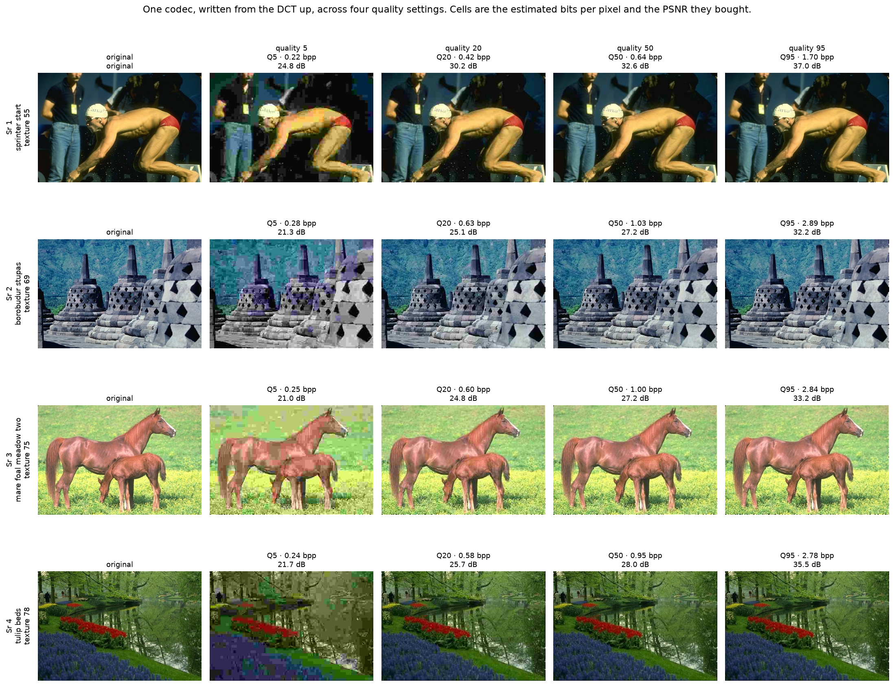
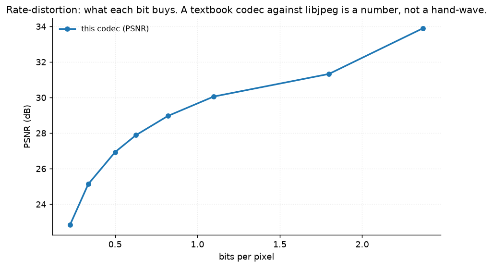
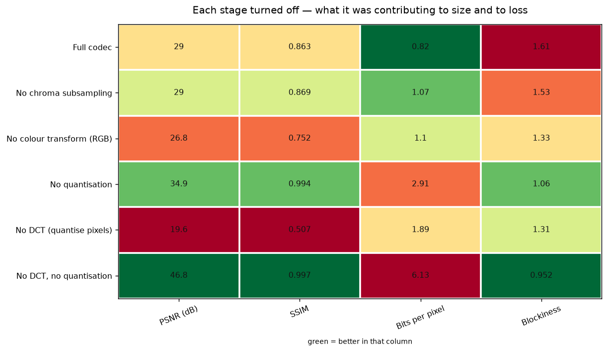
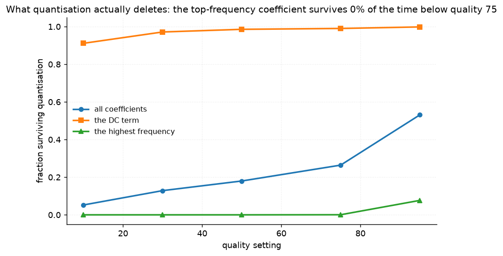

# 27 · JPEG from scratch — classical computer vision

[](https://www.python.org/)
[](https://opencv.org/)
[](#)
[](#)

JPEG implemented from the DCT up — colour transform, 4:2:0 subsampling, the
standard quantisation tables, zig-zag ordering, run-length and an entropy
estimate — with **every stage independently switchable**, so each one's
contribution to both size and loss is a measured number.

> **The claim under test:** all of JPEG's loss comes from quantisation, and the
> DCT is lossless. Both halves turn out to be true, and the second half is more
> interesting than it sounds.

**No neural network, no training, no GPU.**

---

## Results

One codec, four quality settings. Cells are PSNR against the original; the
bits-per-pixel each one cost is beneath.



| Sr | Scene | Q5 | Q20 | Q50 | Q95 |
|---:|---|---:|---:|---:|---:|
| 1 | sprinter off the blocks · texture 55 | 24.8 dB | 30.2 dB | 32.6 dB | **37.0 dB** |
| 2 | Borobudur stupas · texture 69 | **21.3 dB** | 25.1 dB | 27.2 dB | 32.2 dB |
| 3 | mare and foal in a meadow · texture 75 | **21.0 dB** | 24.8 dB | 27.2 dB | 33.2 dB |
| 4 | tulip beds · texture 78 | 21.7 dB | 25.7 dB | 28.0 dB | 35.5 dB |

Averaged over all twelve photographs:

| Quality | bpp (ours) | PSNR (ours) | SSIM (ours) | Blockiness | bpp (libjpeg) | PSNR (libjpeg) |
|---|---:|---:|---:|---:|---:|---:|
| 5 | **0.23** | 22.84 | 0.568 | **4.94** | 0.26 | 23.19 |
| 10 | 0.34 | 25.13 | 0.685 | 3.01 | 0.39 | 25.67 |
| 20 | 0.50 | 26.93 | 0.782 | 2.13 | 0.61 | 27.83 |
| 30 | 0.63 | 27.88 | 0.824 | 1.84 | 0.80 | 29.01 |
| 50 | 0.82 | 28.96 | 0.863 | 1.61 | 1.10 | 30.46 |
| 70 | 1.10 | 30.06 | 0.899 | 1.30 | 1.56 | 32.08 |
| 85 | 1.80 | 31.33 | 0.947 | 0.93 | 2.77 | 34.31 |
| 95 | **2.37** | 33.90 | **0.988** | 1.03 | **4.14** | **43.54** |



> **The rate-distortion curve is the result.** "Quality 50" is not a quality, it
> is a point on a curve, and comparing two codecs at one setting compares
> nothing: at Q95 this codec spends 2.37 bpp and libjpeg spends 4.14 for the same
> nominal number.
>
> **Blockiness rises 4.8× between Q95 and Q5.** Nothing in the codec creates it
> but the 8×8 grid — each block is quantised independently, so neighbours land
> on different reconstruction levels and the seam becomes visible.

---

## Each stage, turned off

| Configuration | PSNR (dB) | SSIM | bpp | Blockiness |
|---|---:|---:|---:|---:|
| Full codec | 28.96 | 0.863 | **0.82** | 1.61 |
| No chroma subsampling | 28.99 | 0.869 | 1.07 | 1.53 |
| No colour transform (RGB) | **26.82** | 0.752 | 1.10 | 1.33 |
| No quantisation | 34.94 | 0.994 | 2.91 | 1.06 |
| **No DCT (quantise pixels)** | **19.63** | **0.507** | 1.89 | 1.31 |
| No DCT, no quantisation | **46.79** | 0.997 | 6.13 | 0.95 |



**The transform is lossless.** With the DCT and quantisation both off, the round
trip returns 46.79 dB — nothing left but uint8 rounding. Every decibel JPEG
loses belongs to quantisation.

**The DCT earns its place twice over.** Quantising *pixels* instead of DCT
coefficients — same tables, same everything else — scores **9.33 dB worse at
2.3× the bitrate**. The transform is not a tidy way to organise the data; it is
what makes the quantisation affordable, by concentrating the energy into a few
coefficients worth keeping and many that round to zero.

**Chroma subsampling is nearly free.** Throwing away three quarters of the
chroma samples costs **0.03 dB** and saves **24% of the bits**. That single line
is the most favourable trade in the whole codec and the reason JPEG works at all.

**The colour transform saves bits and quality at once.** Compressing R, G and B
directly costs 2.14 dB *and* 25% more bits. RGB channels are highly correlated,
so the same information is being coded three times.

---

## What quantisation actually deletes



| Quality | Non-zero coefficients | DC survives | **Top frequency survives** |
|---|---:|---:|---:|
| 10 | 5.2% | 91.1% | **0.00%** |
| 30 | 12.9% | 97.2% | **0.00%** |
| 50 | 18.0% | 98.6% | **0.00%** |
| 75 | 26.4% | 99.0% | 0.05% |
| 95 | 53.1% | 99.8% | 7.67% |

**Below quality 75 the highest-frequency coefficient is zero in every block of
every image.** Not "usually" — the luma table quantises that position by 99, and
after scaling nothing in these twelve photographs ever survives it.

At quality 50 the codec keeps **18% of the coefficients** and reaches 28.96 dB.
The DC term — the block's average brightness — survives 98.6% of the time. That
is the whole perceptual model: keep the averages, keep a little of the low
frequencies, delete the rest.

---

## How the images were chosen

Twelve photographs selected by `tools/select_images.py --axis texture`, which
measures the fraction of spectral energy above a quarter Nyquist. JPEG quantises
a frequency decomposition, so how much of the picture lives in the high bands is
precisely what decides its compressibility — and the results table shows it:
the sprinter at texture 55 reaches 37.0 dB at Q95 where the stupas at texture 69
manage 32.2.

```
sprinter_start      54.0    girl_with_basin       60.7
model_gloves        64.1    worker_with_pails     66.7
polo_riders         67.9    borobudur_stupas      69.2
coyotes_in_haze     70.3    crocodile_bank        71.7
bay_with_boats      73.1    mare_foal_meadow_two  74.7
tulip_beds          77.4    snake_on_sand         83.0
```

None of these twelve appears in any other project; `tools/check_image_reuse.py`
enforces that by perceptual hash, not by filename.

---

## The bug in the ablation

The row labelled **"No colour transform (RGB)"** was measuring something else
entirely. Its branch called `to_gray`, so it was not compressing R, G and B — it
was **discarding the colour**, then scoring a grayscale reconstruction against a
colour original.

That made the colour transform look like a cost rather than a saving, and the
number it produced was plausible enough to publish. It only surfaced when the
image pool became colour-only and the comparison raised a shape error instead of
a wrong answer.

There was a second half to it: the reconstruction path ran the inverse YCrCb
transform over whatever three channels came out, so with the transform off it
was converting RGB as though it were YCrCb. Both are fixed and pinned by
`test_turning_off_the_colour_transform_keeps_the_colour`, which checks that the
output is still in colour rather than three copies of a grey channel.

---

## Try it on your own image

```bash
python infer.py photo.jpg                     # sweep the quality, report the curve
python infer.py photo.jpg --quality 30 --out small.png
python infer.py photo.jpg --ablate            # turn each stage off on your image
```

Every number here is real — a codec's loss is measured against the original,
which you have by definition. What `infer.py` adds is the **rate-distortion
curve for your specific image**, because compressibility is a property of the
picture and not of the quality setting: the twelve photographs here differ by
5 dB at the same Q95.

---

## Limitations

* **The entropy coder is an estimate, not Huffman.** Bits per pixel come from
  the entropy of the run-length symbols, which is a lower bound on what a real
  Huffman or arithmetic coder achieves. The bitrates are internally consistent
  and are **not** directly comparable with libjpeg's file sizes — which is why
  the libjpeg column is reported beside them rather than subtracted from them.
* **No progressive mode, no restart markers, no JFIF container.** This encodes
  and decodes in memory; it does not produce a file another decoder could read.
* **The 8×8 block size is fixed**, as in the standard. Modern codecs use
  variable block sizes and that is most of what they gain.
* **Twelve photographs and one quantisation table pair.** Enough to show the
  texture axis moving the curve; not enough to tune a table.

---

## Tests

12 tests, run with `pytest projects/27_jpeg_from_scratch/tests -q`. They pin that
the DCT is its own inverse, that the zig-zag visits every coefficient once, that
the quality scale follows the standard, that turning off the colour transform
keeps the colour, and the findings: that every stage off is near-lossless, that
quantisation is where all the loss lives, that the DCT is worth 9 dB *and* half
the bits, that chroma subsampling is nearly free, and that the top-frequency
coefficient never survives below quality 75.

---

## Keywords

JPEG · discrete cosine transform · DCT · quantisation · quantisation tables ·
chroma subsampling · YCbCr · zig-zag ordering · run-length encoding · entropy
coding · rate-distortion · blocking artefacts · image compression · classical
computer vision · no deep learning · OpenCV · Python · CPU only · reproducible
image processing experiments

## References

* Wallace, *The JPEG Still Picture Compression Standard*, Communications of the
  ACM 1991.
* ITU-T T.81 / ISO-IEC 10918-1, Annex K — the quantisation tables used verbatim.
* Ahmed, Natarajan & Rao, *Discrete Cosine Transform*, IEEE Transactions on
  Computers 1974.
* Shannon, *A Mathematical Theory of Communication*, 1948 — the entropy bound
  the bitrate estimate is built on.
