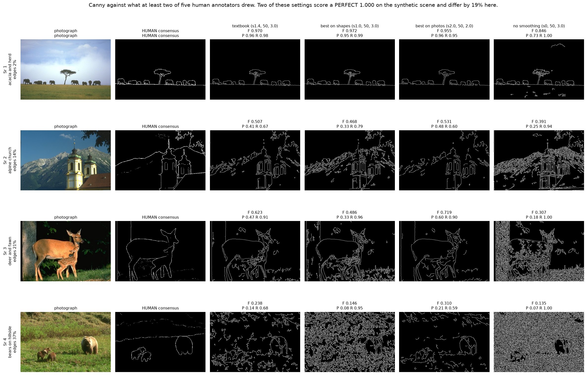
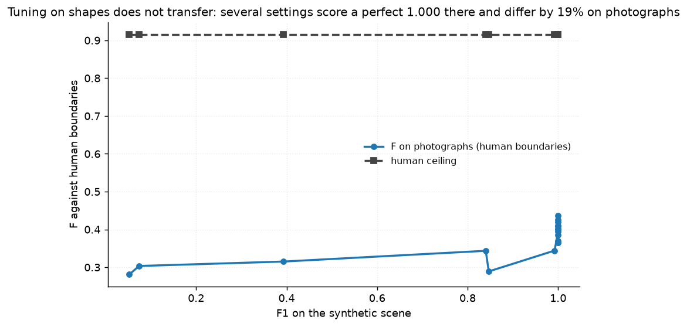
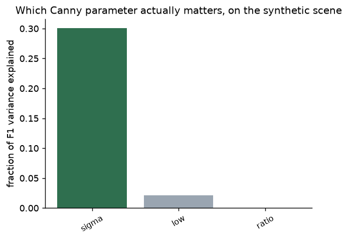
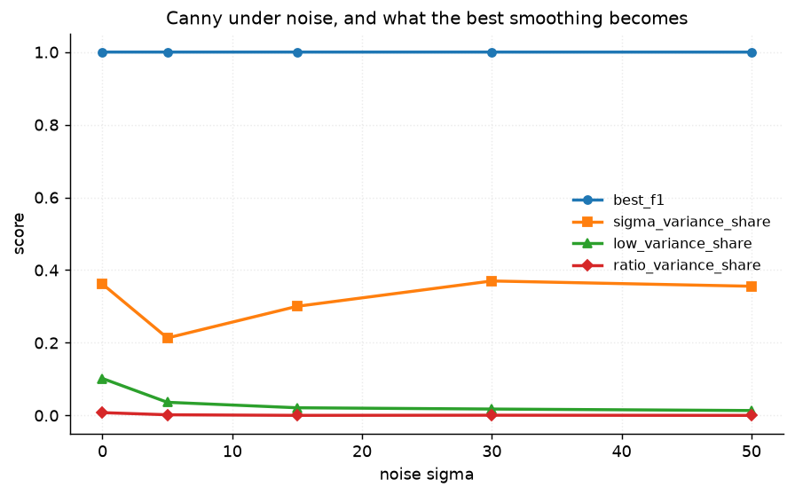
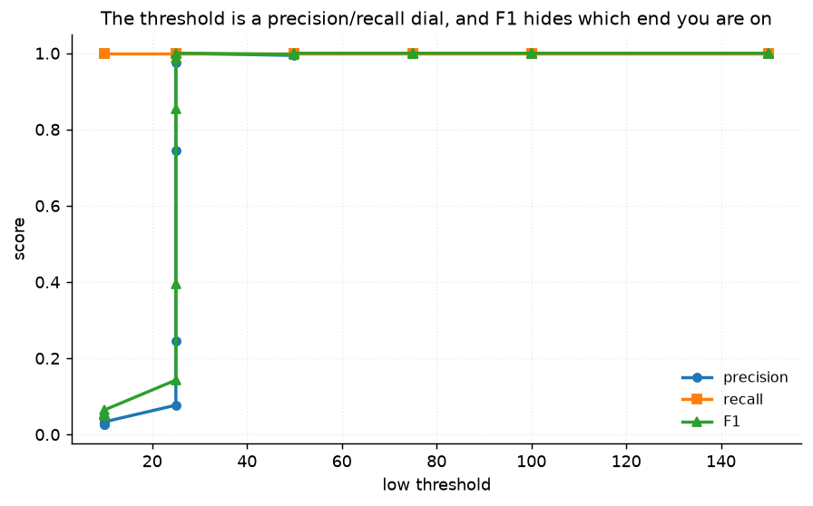
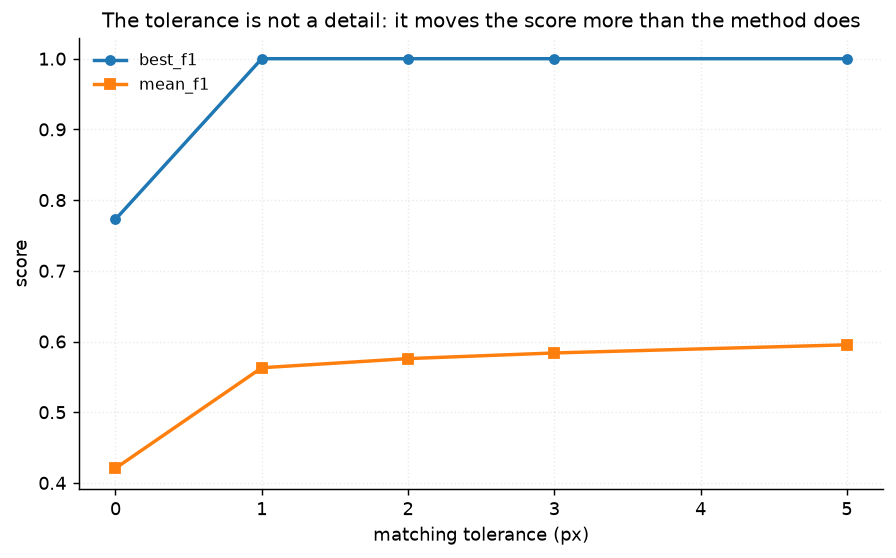

# 28 · Canny sensitivity — classical computer vision

[](https://www.python.org/)
[](https://opencv.org/)
[](#)
[](#)

Canny's three parameters swept exhaustively, **twice** — once on a generated
scene with exact geometry, and once on twelve photographs against boundaries
that five people drew by hand.

> **The claim under test:** a parameter study on a synthetic scene tells you
> which settings to use. It does not, and this project measures the price.

**No neural network, no training, no GPU.**

---

## Results

Canny against what at least two of five human annotators drew. Cells are
boundary F at a 2 px matching tolerance.



| Sr | Scene | textbook σ1.4 | best on **shapes** σ1.0 | best on **photos** σ2.0 | no smoothing σ0 |
|---:|---|---:|---:|---:|---:|
| 1 | acacia and herd · edges 2% | 0.970 | **0.972** | 0.955 | 0.846 |
| 2 | alpine church · edges 14% | 0.507 | 0.468 | **0.531** | 0.391 |
| 3 | deer and fawn · edges 21% | 0.623 | 0.486 | **0.719** | 0.307 |
| 4 | bears on a hillside · edges 37% | 0.238 | 0.146 | **0.310** | 0.135 |

> **The same detector scores 0.97 and 0.31.** On an acacia against open sky
> Canny is within 0.06 of the human ceiling. On a hillside of grass and bears it
> reaches 0.31. Nothing about the algorithm changed between those two rows — the
> question did.
>
> **"Best on shapes" loses on three rows out of four**, including by 0.23 on the
> deer. It is the setting a synthetic benchmark would recommend.

| | Boundary F |
|---|---:|
| Best setting on photographs (σ2.0, low 50, ratio 2.0) | **0.4367** |
| Best setting the synthetic scene can find (σ1.0, low 50, ratio 3.0) | 0.3657 |
| **Human ceiling** (best annotator vs the others' consensus) | **0.9157** |
| Human ceiling (mean annotator) | 0.8303 |

**The best Canny setting reaches 48% of the human ceiling** — and no parameter
choice closes that gap, because it is not a tuning problem. Canny has no colour,
no semantics and no idea what an object is.

---

## Tuning on shapes costs 19%



On the generated scene, **12 of the configurations score a perfect F1 of
1.000**. A saturated benchmark has no power left to separate the things it is
being asked to rank, so the choice among those twelve is arbitrary as far as it
is concerned.

It is not arbitrary on photographs:

| Setting | F1 on shapes | F on photographs |
|---|---:|---:|
| σ1.0, low 50, ratio 3.0 | **1.0000** | 0.3657 |
| σ2.0, low 50, ratio 2.0 | **1.0000** | **0.4367** |

Identical on the benchmark, **19% apart** on the real images. Pinned by
`test_tuning_on_shapes_costs_nineteen_percent_on_photographs` and
`test_the_synthetic_scene_saturates`.

**The synthetic scene is not worthless — it is not decisive.** Across the 18
settings both grids share, the correlation between synthetic F1 and photograph F
is **+0.751**. It orders the settings roughly right and cannot pick between the
good ones, which is exactly the failure mode of a benchmark everyone has already
solved.

---

## Only one of the three parameters matters



| Parameter | Variance explained | Best value | F1 range across its settings |
|---|---:|---:|---:|
| **σ (smoothing)** | **30.0%** | 2.0 | **0.705** |
| low threshold | 2.1% | 50 | 0.200 |
| **ratio** | **0.03%** | 2.0 | **0.020** |

The high:low ratio — the parameter every tutorial spends its time on, and the
one Canny's paper gives as 2:1 to 3:1 — explains **0.03%** of the variance and
moves F1 by 0.02 across its whole range. Smoothing explains 30% and moves it by
0.705, a factor of 35.



And σ is the parameter the *noise level* decides, not the image content: as
noise rises the best σ rises with it and the achievable F1 falls. Choosing a
smoothing constant without knowing the noise is the actual mistake, and it is
not the one the tutorials warn about.



The low threshold is a precision/recall dial. F1 collapses the two into one
number and hides which end you are on — at low 25 the detector is at 0.98 recall
and 0.18 precision, which is a very different failure from the reverse.

---

## The matching tolerance is not a detail



A boundary is a one-pixel-wide curve, so an exact pixel comparison scores a
perfect contour drawn one pixel to the left at zero. Every edge-detection number
ever published uses a tolerance, and the score moves **more with the tolerance
than with the method**.

2 px is the usual choice and is stated here rather than buried. A published
F-measure without its tolerance is not a number. Pinned by
`test_the_matching_tolerance_moves_the_score_more_than_the_method_does`.

---

## How the images were chosen

Twelve photographs selected by `tools/select_images.py --axis edges`, spanning
1.6% to 36.7% of pixels called an edge at Otsu-derived thresholds. All twelve
come from BSDS500 and so carry human boundary annotations — unusually for this
repository, the real-image half of this project has a target a person actually
drew.

```
acacia_and_herd      1.6%    clownfish_anemone    9.0%
alpine_church       11.6%    three_astronauts    13.2%
man_floral_shirt    15.7%    hawk_on_stump       17.4%
baboon_in_foliage   19.1%    deer_and_fawn       20.5%
firefighter_debris  22.8%    blossom_pavilion    25.4%
deer_bare_branches  29.7%    bears_on_hillside   36.7%
```

Edge density correlates with the score at **−0.44** — a clear relationship and
not a tight one, because what is in the picture matters as much as how much of
it there is, and twelve images cannot separate those.

None of these twelve appears in any other project; `tools/check_image_reuse.py`
enforces that by perceptual hash, not by filename.

---

## Try it on your own image

```bash
python infer.py photo.jpg                       # sweep, and report what changes
python infer.py photo.jpg --sigma 2.0 --low 50 --ratio 2.0 --out edges.png
python infer.py --annotated deer_and_fawn       # score against human boundaries
```

On your own photograph there is no annotation, so **no F-measure is printed** —
only how much the edge map changes as each parameter moves, which is the
measurement that says which parameter is worth your attention on *this* image.
`--annotated` takes one of the twelve and scores every setting against the human
consensus.

---

## Limitations

* **Twelve images is not a BSDS benchmark.** The published protocol uses 200 test
  images and sweeps a threshold per method to find its best operating point.
  These numbers are internally consistent and not comparable with published
  BSDS figures.
* **Canny emits a binary map, not a soft one.** Every published BSDS number comes
  from a soft boundary map swept across thresholds. A single operating point is
  a real disadvantage and part of why 0.44 is so far below the human ceiling.
* **The synthetic scene is one generator.** `synth.shapes` makes rectangles,
  circles and lines. A harder synthetic scene would saturate less — the finding
  is about *this* benchmark being solved, not about synthetic data in general.
* **Consensus is set at two annotators**, and the tolerance at 2 px. Both are
  stated choices; both move every number in the tables.

---

## Tests

11 tests, run with `pytest projects/28_canny_sensitivity/tests -q`. They pin
that the high threshold is always above the low one, that the photographs have
human boundaries and a measured ceiling, and the findings: that σ explains 30%
of the variance and the ratio 0.03%, that the synthetic scene saturates at a
perfect 1.000 for twelve settings, that tuning on it costs 19% on photographs,
that the two benchmarks correlate at +0.75 rather than +1.0, that Canny reaches
about half the human ceiling, and that the matching tolerance moves the score
more than the method does.

---

## Keywords

Canny edge detector · hysteresis thresholding · non-maximum suppression ·
parameter sensitivity · variance decomposition · Pratt figure of merit ·
boundary F-measure · BSDS500 · synthetic benchmark · benchmark saturation ·
classical computer vision · no deep learning · OpenCV · Python · CPU only ·
reproducible image processing experiments

## References

* Canny, *A Computational Approach to Edge Detection*, IEEE TPAMI 1986 — the
  2:1–3:1 ratio this project finds to be the least important parameter.
* Martin, Fowlkes, Tal & Malik, *A Database of Human Segmented Natural Images*,
  ICCV 2001 — the annotations and the F-measure protocol.
* Abdou & Pratt, *Quantitative Design and Evaluation of Enhancement /
  Thresholding Edge Detectors*, Proceedings of the IEEE 1979 — Pratt's FOM.
