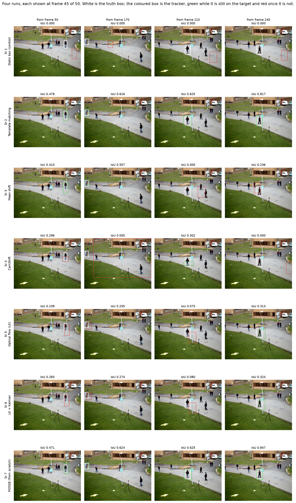
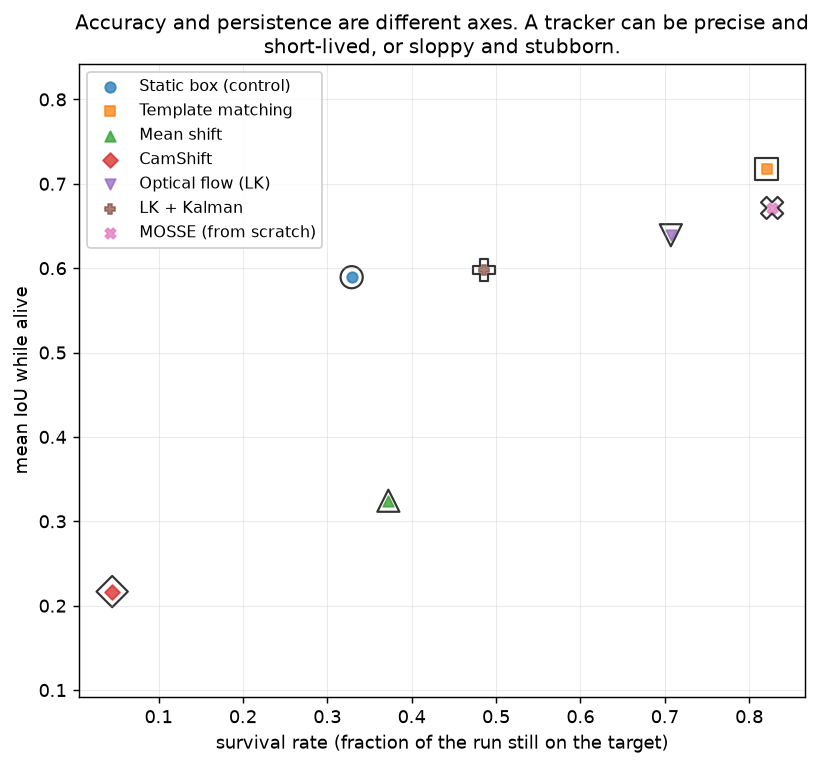
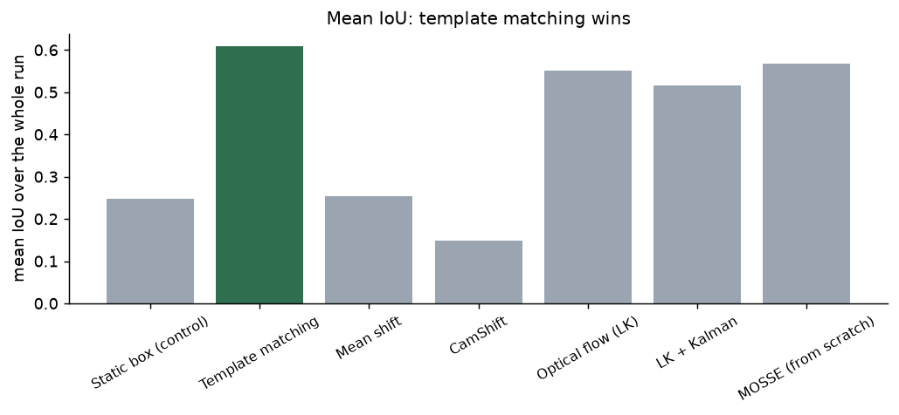
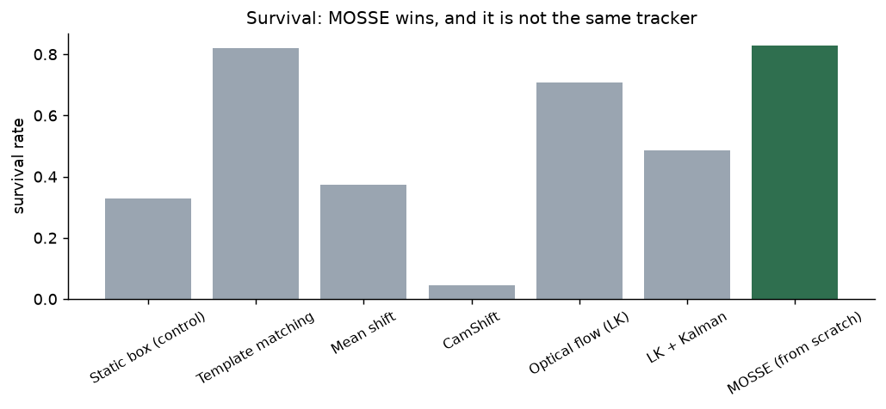
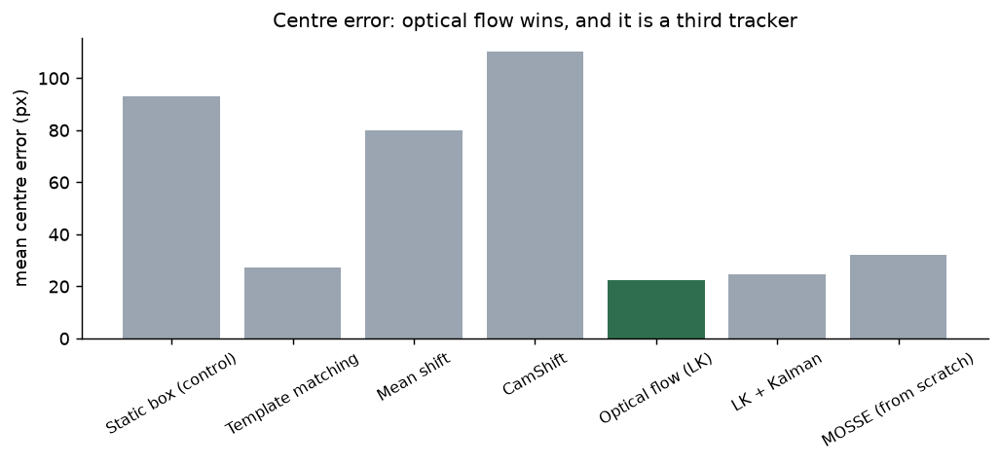
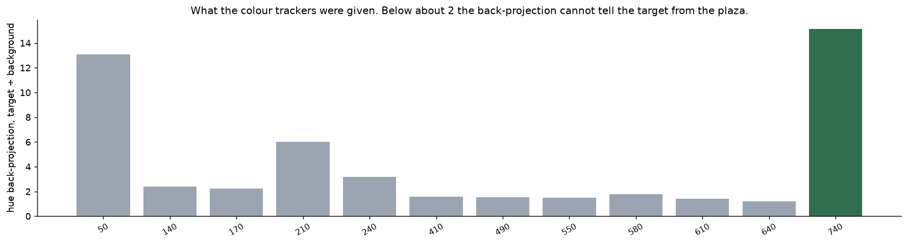
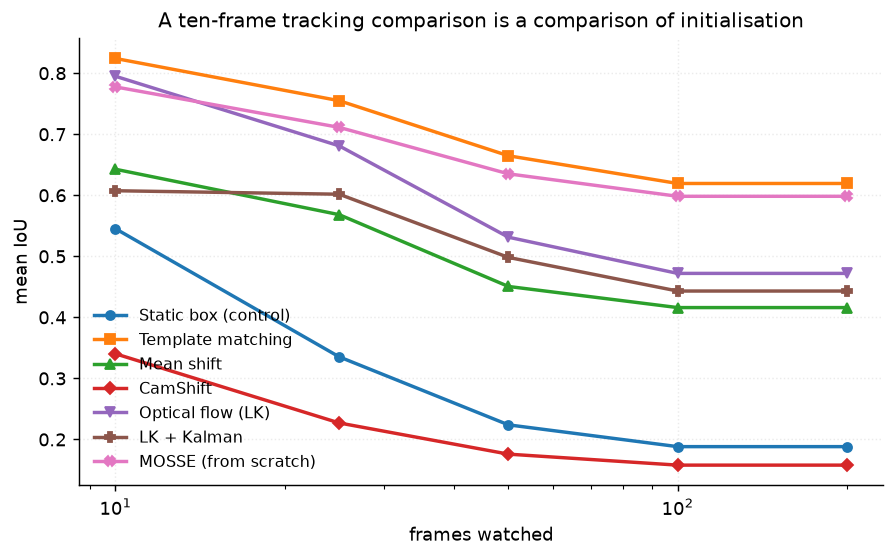
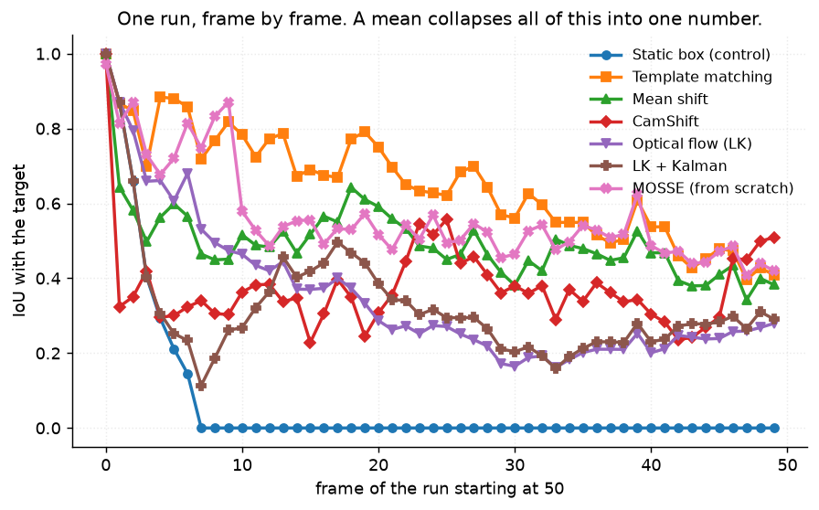

# 29 · Object tracking — classical computer vision

[](https://www.python.org/)
[](https://opencv.org/)
[](#)
[](#)

Given a box around a person in one frame, keep the box on that person. Six
classical trackers — one of them written from scratch — a do-nothing control, and
twelve five-second runs with a truth chain built from the clip itself.

> **Three metrics, three different winners.** Template matching has the best mean
> IoU (**0.608**), MOSSE stays on the target longest (**0.827** survival), and
> optical flow has the smallest centre error (**22.5 px**). Same twelve runs,
> same boxes, three reasonable ways to score them, three answers.

> **A do-nothing control beats a real tracker.** A box nailed to the first frame
> scores 0.248 mean IoU and survives 16.4 frames of 50; CamShift scores 0.148 and
> survives 2.2. The control is also more accurate *while it lasts* (0.589) than
> either colour tracker (0.324 and 0.217).

**No neural network, no training, no GPU.**

---

## Results

Four runs, each shown at frame 45 of 50. White is the truth box; the coloured box
is the tracker — green while it is still on the target, red once it is not.



| Sr | Run | Truth frames | Static box (control) | Template matching | Mean shift | CamShift | Optical flow (LK) | LK + Kalman | MOSSE (from scratch) |
|---:|---|---:|---:|---:|---:|---:|---:|---:|---:|
| 1 | frames 50–100 | 50 | 0.072 | **0.648** | 0.496 | 0.376 | 0.353 | 0.326 | 0.566 |
| 2 | frames 170–220 | 50 | 0.065 | 0.683 | 0.580 | 0.105 | 0.538 | 0.464 | **0.725** |
| 3 | frames 210–260 | 50 | 0.124 | **0.747** | 0.313 | 0.245 | 0.504 | 0.488 | 0.724 |
| 4 | frames 240–290 | 50 | 0.070 | 0.789 | 0.564 | 0.098 | 0.668 | 0.601 | **0.765** |

*Mean IoU over the whole run. The four runs shown are the ones with a full
50-frame truth chain; the table below is over all twelve.*

| Tracker | Mean IoU | Centre error (px) | Survival rate | Frames survived |
|---|---:|---:|---:|---:|
| **Static box (control)** | 0.248 | 92.9 | 0.329 | 16.4 |
| **Template matching** | **0.608** | 27.2 | 0.821 | 41.0 |
| Mean shift | 0.254 | 79.9 | 0.372 | 18.6 |
| CamShift | **0.148** | 110.1 | **0.045** | **2.2** |
| Optical flow (LK) | 0.552 | **22.5** | 0.707 | 35.3 |
| LK + Kalman | 0.516 | 24.6 | 0.486 | 24.2 |
| **MOSSE (from scratch)** | 0.567 | 32.1 | **0.827** | **41.3** |

---

## The signature result: three metrics, three winners



| Tracker | IoU **while alive** | Survival rate |
|---|---:|---:|
| Template matching | **0.717** | 0.821 |
| MOSSE (from scratch) | 0.671 | **0.827** |
| Optical flow (LK) | 0.639 | 0.707 |
| LK + Kalman | 0.598 | 0.486 |
| **Static box (control)** | **0.589** | 0.329 |
| Mean shift | 0.324 | 0.372 |
| CamShift | **0.217** | **0.045** |

*IoU while alive is measured from **frame 1**. Frame 0 is handed to every
tracker, so including it scores 1.0 by construction — and an earlier version of
this table did include it, which put CamShift top at 0.807 on the strength of the
one frame it was given. That is the kind of number that reads as a finding and is
an artefact.*

Corrected, the two axes mostly agree, and the interesting disagreements are
narrow and specific: **MOSSE survives longest while template matching is more
accurate while alive**, and **a box that never moves is more accurate, while it
lasts, than either colour tracker.**

The disagreement that does survive is between the three *metrics*:





Three bar charts of the same twelve runs, three different tallest bars — which
is the result. There is no single number here that orders these trackers, and
which one you quote decides which tracker you would ship.

---

## One wrong line put a good tracker below the control

`opencv-python-headless` does not ship KCF, CSRT or MOSSE — those live in
`opencv-contrib` — and the trackers that *are* in core besides MIL (GOTURN,
DaSiamRPN, Nano, Vit) are neural networks with downloaded weights. So the
correlation filter here is **written from scratch**: MOSSE is about forty lines of
FFT (Bolme et al., CVPR 2010), and having it is better than having a call into a
binary.

The first version scored **0.047 mean IoU with a 261-pixel centre error** — far
below the do-nothing control — which is not what MOSSE does.

```python
response = np.real(np.fft.ifft2(H * F))
dy, dx = np.unravel_index(np.argmax(response), response.shape)
dy -= bh // 2          # wrong
dx -= bw // 2
```

The target Gaussian is built with `ifftshift`, so **zero displacement is index
(0, 0)** and the response wraps around. Subtracting half the box is what a
*centred* target would need. Every step came out half a box off.

```python
dy = dy - bh if dy > bh // 2 else dy
dx = dx - bw if dx > bw // 2 else dx
```

**0.047 → 0.567 mean IoU, and the best survival rate in the project.** A test now
asserts that correlating the first patch with its own filter gives zero shift,
which is the invariant the bug broke.

Two other things in this implementation are load-bearing rather than cosmetic and
are commented as such: the **cosine window** (the FFT treats the patch as
periodic, so without the taper the wrap-around edge is a strong artificial
gradient and the filter locks onto it) and the **eight small random rotations**
used to initialise the filter (without them it is a single correlation and drifts
on the second frame).

---

## Why the colour trackers fail, measured rather than asserted



Mean shift and CamShift both track a **hue** histogram, and hue is meaningless
where saturation is low. This is an overcast plaza.

| Run start | 50 | 140 | 170 | 210 | 240 | 410 | 490 | 550 | 580 | 610 | 640 | 740 |
|---|---:|---:|---:|---:|---:|---:|---:|---:|---:|---:|---:|---:|
| Target mean saturation (of 255) | 40 | 71 | 41 | 30 | **25** | 38 | 52 | 161 | 171 | 139 | 122 | **26** |
| Back-projection, target ÷ plaza | 13.1 | 2.4 | 2.2 | 6.0 | 3.2 | 1.6 | 1.5 | **1.5** | 1.8 | **1.4** | **1.2** | 15.1 |

The trap is in the last four colourful targets. A person in a **bright red coat**
has plenty of hue — and so does the brick building behind them, so the
back-projection is only **1.2 to 1.8×** brighter on the target than on the plaza.
Mean shift is then climbing a nearly flat surface. The two targets with a high
ratio (13.1 and 15.1) get it by having almost no hue at all: the masked histogram
is nearly empty, so nothing responds anywhere, including the target.

**CamShift additionally resizes its window from that back-projection**, which is
the entire difference between the two methods — so it collapses or explodes,
while mean shift merely wanders. That is why it survives 2.2 frames and mean
shift survives 18.6.

This is a property of the scene as much as of the methods, and saying so is the
difference between "CamShift is bad" and "CamShift was given nothing to work
with".

---

## Adding a Kalman filter made it worse

| | Optical flow (LK) | LK + Kalman |
|---|---:|---:|
| Mean IoU | **0.552** | 0.516 |
| Survival rate | **0.707** | 0.486 |
| Centre error (px) | 22.5 | 24.6 |

A constant-velocity Kalman filter over the tracked centre **cost 0.22 of survival
rate**. The filter smooths the measurement, which helps when the measurement is
noisy — and a flow tracker that has latched onto the background behind a thin
limb is not noisy. It is confidently wrong, and smoothing a confident error
carries it further and slows the recovery.

A Kalman filter is for the frames where the tracker says *nothing*. It is not a
fix for the frames where the tracker says something false, and this is what that
distinction costs.

---

## How long you watch decides the ranking



| Frames watched | 10 | 25 | 50 | 100 |
|---|---:|---:|---:|---:|
| **Static box (control)** | **0.545** | 0.335 | 0.224 | 0.188 |
| Template matching | **0.824** | 0.755 | 0.665 | 0.619 |
| Mean shift | 0.643 | 0.568 | 0.451 | 0.416 |
| CamShift | 0.340 | 0.227 | 0.176 | 0.158 |
| Optical flow (LK) | 0.795 | 0.681 | 0.531 | 0.472 |
| MOSSE (from scratch) | 0.778 | 0.711 | 0.635 | 0.598 |

**At ten frames the do-nothing control scores 0.545 and beats CamShift.** The
spread between the real trackers is 0.48 at ten frames and 0.65 at fifty, and the
control is only 0.28 behind the best. A ten-frame tracking comparison is largely
a comparison of how well each tracker was initialised.



---

## Where the ground truth came from

The clip has no annotation. What it has is that **the per-pixel median of all 795
frames is the empty plaza**, so the difference between a frame and that median is
where things are. A target is then followed frame to frame by **nearest-centroid
chaining** on those masks — motion continuity, nothing about appearance, and so
not circular with any appearance-based tracker.

Two decisions had to be made rather than defaulted, both because the first
version produced chains one and two frames long:

* **The jump limit scales with the box.** A person at the top of the frame is 50 px
  tall and crosses three pixels a frame; one at the bottom is 200 px tall and
  crosses twelve. A single pixel threshold either cuts the near chains or lets
  the far ones jump to a neighbour.
* **A gap of up to three frames is survivable.** Background subtraction loses a
  person who pauses or passes a similarly coloured wall. Ending the chain there
  would be calling a gap in the *evidence* a gap in the *person*.

**The twelve runs were chosen by measurement, not by eye.** `find_good_starts`
scans the clip every ten frames and keeps the starts where a target survives at
least 40 of the 50 frames. The first version of this project used twelve evenly
spaced starts and seven of them had chains shorter than ten frames — which would
have made this a benchmark of initialisation.

| Start | 50 | 140 | 170 | 210 | 240 | 410 | 490 | 550 | 580 | 610 | 640 | 740 |
|---|---:|---:|---:|---:|---:|---:|---:|---:|---:|---:|---:|---:|
| Truth frames of 50 | 50 | 44 | 50 | 50 | 50 | 50 | 50 | 50 | 50 | 50 | 50 | 50 |
| Max area jump | 1.4 | **2.2** | 1.3 | 1.3 | 1.3 | 1.3 | 1.4 | **2.9** | **2.9** | 1.3 | 1.4 | **3.1** |
| Merge events | 0 | 2 | 0 | 0 | 0 | 0 | 0 | 1 | 1 | 0 | 0 | 2 |

**The chain still breaks when two people merge into one blob**, and those events
are counted rather than hidden: six of them across four runs, each visible as the
truth box's area jumping by more than 1.8×.

---

## Try it on the clip

```bash
python infer.py --start 210                 # all seven trackers on one run
python infer.py --start 550 --length 100
python infer.py --start 210 --tracker "MOSSE (from scratch)"
```

It prints each tracker's mean IoU, centre error **and** survival rate side by
side, plus the control, so the disagreement between the three is visible on
whatever run you pick.

---

## Limitations

* **The truth chain is not an annotation.** It is background subtraction plus
  motion continuity, given the whole clip. It merges people who walk together
  (six events over twelve runs, reported above) and it includes shadows, so the
  truth boxes are systematically a little taller than the person.
* **One clip, one scene, one weather, one camera.** Every conclusion about the
  colour trackers in particular is a conclusion about an overcast plaza.
* **Fifty frames is five seconds.** Long enough for every tracker here to fail
  once; not long enough to say anything about drift over minutes.
* **`SURVIVAL_IOU = 0.3` is a threshold choice**, and "tracking failed" is
  therefore a definition rather than an observation. The ordering by survival is
  not sensitive to it at 0.2 or 0.4; the absolute frame counts are.
* **No re-detection and no occlusion handling.** Once a tracker is lost it stays
  lost, which is what makes survival a meaningful number here and would not be
  in a system with a detector attached.
* **MOSSE's learning rate, sigma and regularisation are Bolme's published
  values**, not tuned on this clip. Tuning them here would be fitting the tracker
  to the test.

---

## Tests

18 tests, run with `pytest projects/29_object_tracking/tests -q`. They pin the
result (three metrics give three winners; accuracy and persistence order the
trackers differently; the do-nothing control beats CamShift), the MOSSE bug
(self-correlation must give zero shift, and the tracker must beat the control),
why the colour trackers fail (measured back-projection contrast, not an
assertion), that the Kalman filter made things worse, that a ten-frame comparison
compresses the spread, and the truth chain's own properties — including that the
empty-scene median contains no people at all.

They skip cleanly if `vtest.avi` is not cached.

---

## Keywords

object tracking · MOSSE · correlation filter · mean shift · CamShift · template
matching · Lucas-Kanade · optical flow · Kalman filter · back-projection ·
hue histogram · survival rate · centre error · IoU · tracking benchmark ·
classical computer vision · no deep learning · OpenCV · Python · CPU only ·
reproducible image processing experiments

## References

* Bolme, Beveridge, Draper & Lui, *Visual Object Tracking using Adaptive
  Correlation Filters*, CVPR 2010 — MOSSE, implemented here from the paper.
* Comaniciu, Ramesh & Meer, *Kernel-Based Object Tracking*, TPAMI 2003 — mean
  shift tracking.
* Bradski, *Computer Vision Face Tracking for Use in a Perceptual User
  Interface*, Intel Technology Journal 1998 — CamShift.
* Lucas & Kanade, *An Iterative Image Registration Technique*, IJCAI 1981, and
  Bouguet's pyramidal implementation — the flow tracker.
* Wu, Lim & Yang, *Online Object Tracking: A Benchmark*, CVPR 2013 — on why
  precision and success are reported separately.
* `vtest.avi` ships with OpenCV's sample data.
