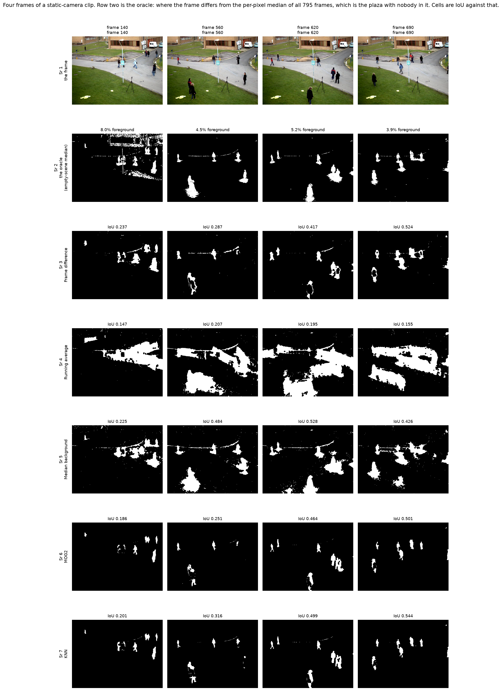
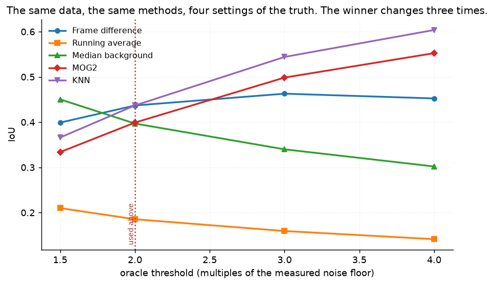
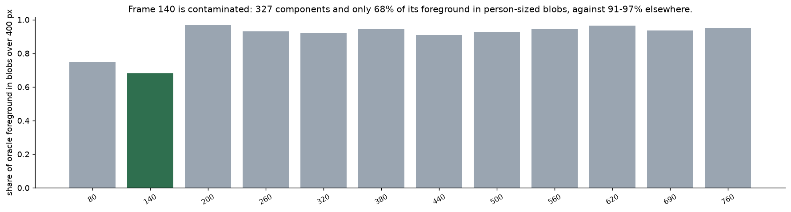
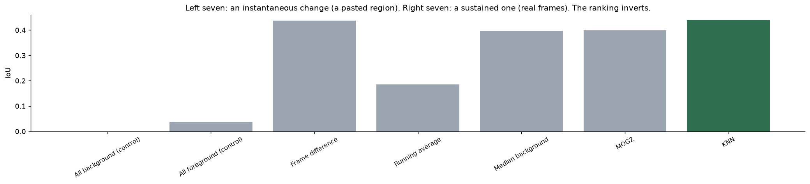
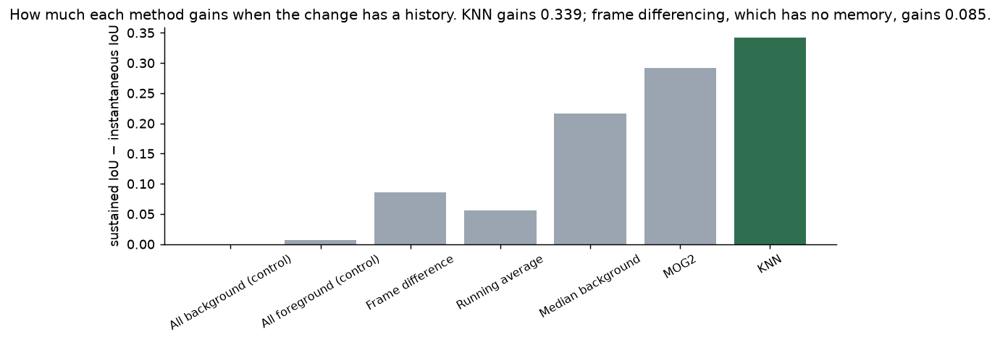
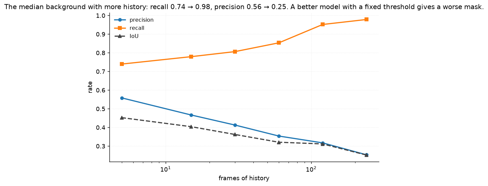
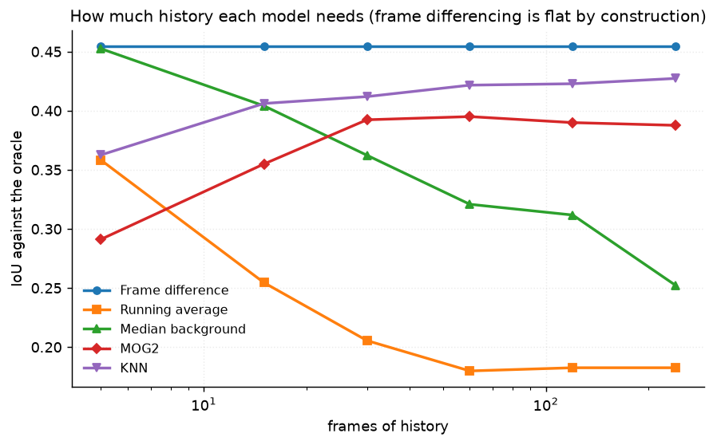
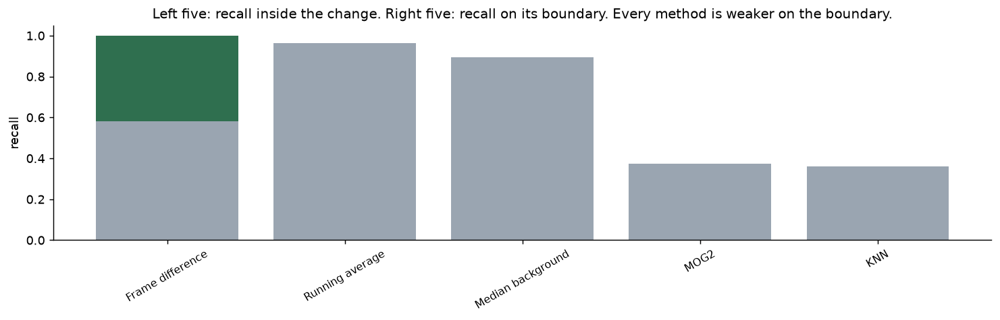
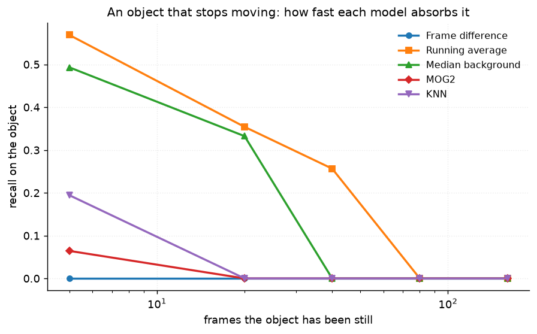
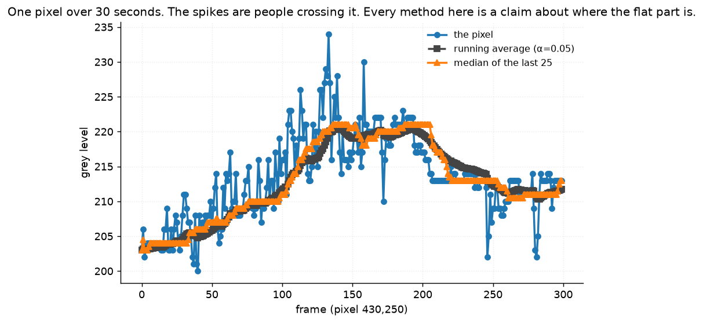

# 30 · Background subtraction — classical computer vision

[](https://www.python.org/)
[](https://opencv.org/)
[](#)
[](#)

A static camera sees a scene that mostly does not change. Subtract the part that
does not change and what is left is the part that does. Five models, two
controls, and a ground truth that had to be earned rather than assumed.

> **The ranking does not survive the truth threshold.** Four settings of the
> oracle, each one stop from the last, on the same twelve frames with the same
> five methods — and the winner changes. At 1.5× the measured noise floor the
> median background wins (0.450); at 4× it is last (0.302) and KNN wins (0.604).
> **The data did not decide which background subtractor is best. Where the
> threshold on *truth* went decided it.**

> **And the ranking does not survive the kind of change, either.** On an
> instantaneous change, frame differencing beats KNN **3.6×**. On a sustained
> one they tie. KNN gains **+0.342 IoU** from the change having a history;
> memoryless differencing gains **+0.085**.

> **Pixel accuracy is beaten by doing nothing.** Foreground is 3.8% of the
> frame, so calling every pixel background scores **0.962** — better than two of
> the five real methods. Its IoU is 0.000, which is the number that notices.

**No neural network, no training, no GPU.**

---

## Results

Four frames of a static-camera clip. Row 2 is the oracle: where the frame differs
from the per-pixel median of **all 795 frames**, which is the plaza with nobody in
it. Cells are IoU against that.



| Sr | Frame | Foreground % | Frame difference | Running average | Median background | MOG2 | KNN |
|---:|---:|---:|---:|---:|---:|---:|---:|
| 1 | 140 | 8.0 | 0.237 | 0.147 | 0.225 | 0.186 | 0.201 |
| 2 | 560 | 4.5 | 0.287 | 0.207 | **0.484** | 0.251 | 0.316 |
| 3 | 620 | 5.2 | 0.417 | 0.195 | **0.528** | 0.464 | 0.499 |
| 4 | 690 | 3.9 | 0.524 | 0.155 | 0.426 | 0.501 | **0.544** |

| Method | IoU | Precision | Recall | F1 | Pixel accuracy | ms |
|---|---:|---:|---:|---:|---:|---:|
| **All background (control)** | 0.000 | 0.000 | 0.000 | 0.000 | **0.9618** | 0.02 |
| **All foreground (control)** | 0.038 | 0.038 | 1.000 | 0.073 | 0.0382 | 0.02 |
| Frame difference | **0.437** | 0.647 | 0.586 | 0.599 | 0.9702 | **4.0** |
| Running average | 0.185 | 0.192 | 0.891 | 0.312 | 0.8571 | 51.7 |
| Median background | 0.397 | 0.418 | **0.909** | 0.559 | 0.9434 | 193.5 |
| MOG2 | 0.399 | 0.929 | 0.412 | 0.560 | 0.9753 | 215.9 |
| KNN | **0.436** | **0.936** | 0.449 | 0.599 | **0.9768** | 261.5 |

*Frame differencing and KNN are 0.001 apart — a tie, and which comes first moves
between runs. They get there completely differently: precision 0.647/recall 0.586
against precision 0.936/recall 0.449.*

---

## The signature result: the truth threshold picks the winner



| Oracle threshold | Foreground % | Frame difference | Running average | Median background | MOG2 | KNN |
|---|---:|---:|---:|---:|---:|---:|
| **1.5×** the noise floor | 5.2 | 0.399 | 0.210 | **0.450** | 0.334 | 0.366 |
| **2.0×** (used above) | 3.8 | **0.437** | 0.185 | 0.397 | 0.399 | **0.437** |
| **3.0×** | 2.8 | 0.463 | 0.159 | 0.340 | 0.499 | **0.544** |
| **4.0×** | 2.4 | 0.452 | 0.141 | **0.302** | 0.553 | **0.604** |

The median background goes from **first to last** and KNN from fourth to first,
across a range of the truth threshold that no paper would bother to report.

The mechanism is not mysterious, which is what makes it worth stating. A **loose**
oracle keeps only strong change — solid person-shaped bodies — and that is what
the mixture models find: KNN's precision is 0.936. A **tight** oracle also keeps
faint change — a shadow edge, the fluttering barrier tape, an arm against a
similar background — and that is what the high-recall methods find: the median
background's recall is 0.909.

Neither threshold is wrong. There is no setting of it that is *the* answer, and
that is the result.

---

## Where the ground truth came from

This clip has no annotation and none was invented.

**A pedestrian covers any given pixel for a few seconds out of eighty, so the
per-pixel median of the whole clip is the empty plaza** — and visibly is. There is
not one person in it.

The oracle sees all 795 frames including the future; every method sees 60 past
frames. That asymmetry is what makes it truth rather than a seventh competitor.

**It is checked rather than trusted.** OpenCV's HOG pedestrian detector works from
gradient orientations in a single frame and knows nothing about time; the oracle
works from time and knows nothing about what a person looks like. They share no
information.

| Frame | 80 | 140 | 200 | 260 | 320 | 380 | 440 | 500 | 560 | 620 | 690 | 760 |
|---|---:|---:|---:|---:|---:|---:|---:|---:|---:|---:|---:|---:|
| Oracle blobs | 4 | 17 | 6 | 7 | 4 | 5 | 3 | 4 | 5 | 6 | 5 | 6 |
| HOG detections | 2 | 2 | 2 | 3 | 3 | 2 | 3 | 3 | 3 | 3 | 3 | 4 |
| HOG found by oracle | 2 | 2 | 2 | 3 | 3 | 2 | 3 | **1** | 3 | 3 | 3 | 4 |

**31 of HOG's 33 detections sit on an oracle blob.** A test also asserts HOG finds
*zero* people in the median image — if anyone had survived it, the oracle would be
scoring them as background.

### One frame is contaminated, and it stays in



**Frame 140's oracle mask is a field of 8×8 blocks over the flat tarmac.** The clip
is lossily compressed and the oracle's threshold is in grey levels, so a frame
where the codec spent fewer bits on a flat region reads as foreground.

| | frame 140 | the other eleven |
|---|---:|---:|
| Foreground share | **8.0%** | 1.6 – 5.2% |
| Connected components | **327** | 38 – 149 |
| Share in blobs over 400 px | **0.680** | 0.749 – 0.968 |

It is the frame every method scores worst on, and not because the scene is hard.
It is kept, reported, and pinned by a test — dropping it would improve every
number in this README by making the benchmark easier.

---

## Sustained change against instantaneous change



The second arm is a **region-swap composite**: a rectangle of frame *B* pasted into
frame *A*. Both halves are photographed. The change exists in exactly one frame.

| Method | Sustained IoU | Instantaneous IoU | Difference |
|---|---:|---:|---:|
| Frame difference | 0.437 | **0.351** | +0.085 |
| Running average | 0.185 | 0.130 | +0.055 |
| Median background | 0.397 | 0.180 | +0.217 |
| MOG2 | 0.399 | 0.107 | +0.292 |
| **KNN** | **0.439** | 0.097 | **+0.342** |



Frame differencing is the **best** method on the composites and ties for best on
real frames. It has no memory, so a one-frame anomaly is the only thing it is
ideally suited to — and a project that had built only the composite arm would
have concluded that the simplest method wins, which is an artefact of how the
test was built rather than a fact about background subtraction.

**Truth on the composites is not the rectangle.** An unchanged patch of grass
inside the pasted box is not an observable change, and marking it foreground
would score every method on its ability to detect nothing. The rectangles turn
out to be only **25.3% to 57.5% real change**, averaging 39.8%.

---

## A better background model is not a better mask



| Median background, history | 5 | 15 | 30 | 60 | 120 | 240 |
|---|---:|---:|---:|---:|---:|---:|
| Precision | **0.558** | 0.467 | 0.413 | 0.354 | 0.317 | **0.253** |
| Recall | 0.740 | 0.779 | 0.807 | 0.854 | 0.952 | **0.979** |
| IoU | **0.453** | 0.404 | 0.362 | 0.321 | 0.312 | **0.252** |

With 240 frames the median background recovers **0.979 of the real foreground** —
close to the oracle itself — and its IoU is the second-worst in the project. The
model got better; the threshold is a fixed number of grey levels and did not move
with it, so every slow illumination drift and compression artefact now clears it.

A single IoU cannot say *"the model improved and the threshold did not"*.



| Frames of history | 5 | 15 | 30 | 60 | 120 | 240 |
|---|---:|---:|---:|---:|---:|---:|
| Frame difference | 0.454 | 0.454 | 0.454 | 0.454 | 0.454 | 0.454 |
| Running average | 0.358 | 0.255 | 0.206 | 0.180 | 0.183 | 0.183 |
| Median background | 0.453 | 0.404 | 0.362 | 0.321 | 0.312 | 0.252 |
| MOG2 | 0.291 | 0.355 | 0.392 | **0.395** | 0.390 | 0.388 |
| KNN | 0.363 | 0.406 | 0.412 | 0.422 | 0.423 | **0.427** |

Frame differencing's line is flat to four decimal places, because it never looks
past the previous frame. That is a built-in check that the sweep is wired
correctly, and a test asserts it.

---

## Two more things the masks do and the numbers hide



| Method | Interior recall | Edge recall | Difference |
|---|---:|---:|---:|
| Frame difference | 0.999 | 0.582 | −0.417 |
| Running average | 0.963 | 0.621 | −0.343 |
| Median background | 0.893 | 0.427 | **−0.466** |
| MOG2 | 0.374 | 0.071 | −0.303 |
| KNN | 0.359 | 0.062 | −0.297 |

Every method is weaker on a boundary than in an interior, and the gap is larger
than the gap between most pairs of methods.



| Frames the object has been still | 5 | 20 | 40 | 80 | 160 |
|---|---:|---:|---:|---:|---:|
| Running average | **0.569** | 0.354 | **0.257** | 0.000 | 0.000 |
| Median background | 0.493 | 0.332 | 0.000 | 0.000 | 0.000 |
| MOG2 | 0.064 | 0.000 | 0.000 | 0.000 | 0.000 |
| KNN | 0.194 | 0.000 | 0.000 | 0.000 | 0.000 |
| Frame difference | 0.000 | 0.000 | 0.000 | 0.000 | 0.000 |

**Every model forgets a stopped object, and they do it at very different rates.**
MOG2 absorbs it within 20 frames; the running average holds it for 40. Frame
differencing never sees it at all, because a stationary object does not differ
from the previous frame — it has no opinion about "stopped", which is the same
property that made it win the composite arm.

Whether a parked car is foreground is not a question these models answer. It is
a question you answer for them, by choosing one.

---

## One pixel, thirty seconds



Every method here is a claim about where the flat part of that curve is. The
spikes are people crossing the pixel. The running average is dragged toward every
spike and takes tens of frames to come back — which is the entire content of its
0.192 precision.

---

## About the twelve frames

They are **not twelve distinct images** in the sense the rest of this repository
means it, and pretending otherwise would be dishonest: they share a background,
and a perceptual hash puts them 2 to 6 bits apart. That is what a static-camera
surveillance clip *is*, and a static camera is the premise — background
subtraction has nothing to subtract without one.

The variety in this project comes from twelve different frames with twelve
different oracle masks, twelve composites with twelve different truth masks, and
four settings of the oracle over all of them. The clip is shared with projects 29,
55 and 57, which use different frame ranges and measure different things; the
frames used here appear in none of them.

Every threshold any method needs is the **same measured number**: the 99th
percentile of the inter-frame difference over a patch of grass nobody walks
through, **4.0 grey levels**. Every method gets the same morphological cleanup.
Any of them would look better with post-processing tuned to it, which is exactly
why none of them got any.

---

## Try it on the clip

```bash
python infer.py --frame 620                      # all five methods on one frame
python infer.py --frame 620 --oracle-multiple 4  # and with a looser truth
python infer.py --frame 200 --history 240
python infer.py --composite 3                    # a region-swap composite instead
```

It prints each method's IoU, precision and recall against the oracle **and** the
two controls, so the pixel-accuracy trap is visible on whatever frame you pick.
`--oracle-multiple` is the knob that changes the winner.

---

## Limitations

* **The oracle is not an annotation.** It is a per-pixel median given information
  no method gets. It calls the fluttering barrier tape foreground — correctly,
  the tape really moves — and it calls compression blocks foreground on frame
  140, which is wrong and is reported.
* **The oracle is the same family of estimator as one of the methods.** The
  median background is the method this truth flatters most, which is why
  `oracle_versus_hog` checks it against a detector that shares no information
  with it. It is still a real objection and the sensitivity table is the honest
  answer to it.
* **One clip, one scene, one weather.** Nothing here transfers to a moving
  camera, a night scene, headlights, rain or a crowd.
* **`detectShadows` is on for MOG2 and KNN and shadows are treated as
  background.** Turning it off raises MOG2's IoU from 0.075 to 0.108 on the
  composites; the choice is stated and measured rather than defaulted.
* **The stopped-object test holds a *pasted* region still**, which is not the
  same as a person standing still — the pasted region has a hard edge the model
  can latch onto. The rates are comparable between methods, not absolute.
* **Timings are single-threaded medians on one machine.** The 50× between frame
  differencing and KNN is the useful part; both are real-time at this resolution.

---

## Tests

19 tests, run with `pytest projects/30_background_subtraction/tests -q`. They pin
the result (two different methods win at four settings of the oracle, and the
ranking also flips between sustained and instantaneous change), the oracle itself
(HOG finds zero people in the median image, 31 of its 33 detections sit on an
oracle blob, frame 140 is contaminated and stays in), the two controls, that
truth on a composite is not the pasted rectangle, that frame differencing's
history line is flat by construction, and that every method gets the same
threshold and the same morphology.

They skip cleanly if `vtest.avi` is not cached.

---

## Keywords

background subtraction · foreground segmentation · frame differencing · running
average · median background · MOG2 · KNN · Gaussian mixture model · shadow
detection · static camera · surveillance · ground truth · oracle · threshold
sensitivity · pixel accuracy · class imbalance ·
classical computer vision · no deep learning · OpenCV · Python · CPU only ·
reproducible image processing experiments

## References

* Stauffer & Grimson, *Adaptive Background Mixture Models for Real-Time
  Tracking*, CVPR 1999 — the mixture model MOG2 descends from.
* Zivkovic, *Improved Adaptive Gaussian Mixture Model for Background
  Subtraction*, ICPR 2004, and Zivkovic & van der Heijden, *Efficient Adaptive
  Density Estimation per Image Pixel*, PRL 2006 — MOG2 and KNN as OpenCV ships
  them.
* Brutzer, Höferlin & Heidemann, *Evaluation of Background Subtraction Techniques
  for Video Surveillance*, CVPR 2011 — on how much the evaluation protocol
  decides the ranking.
* `vtest.avi` ships with OpenCV's sample data.
