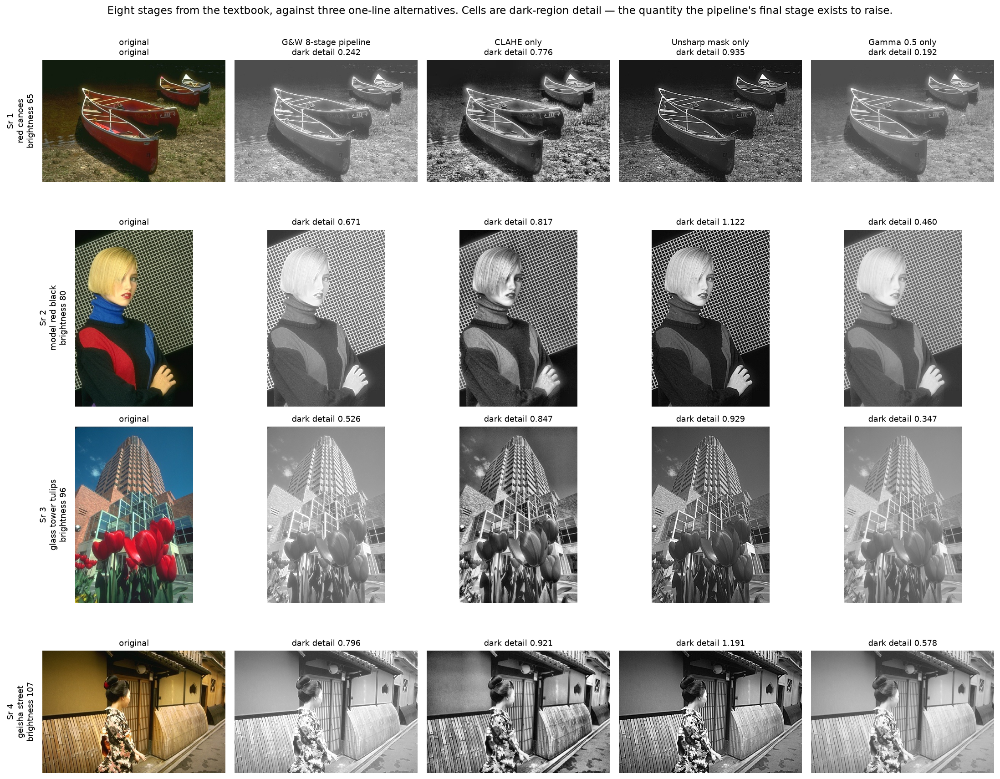
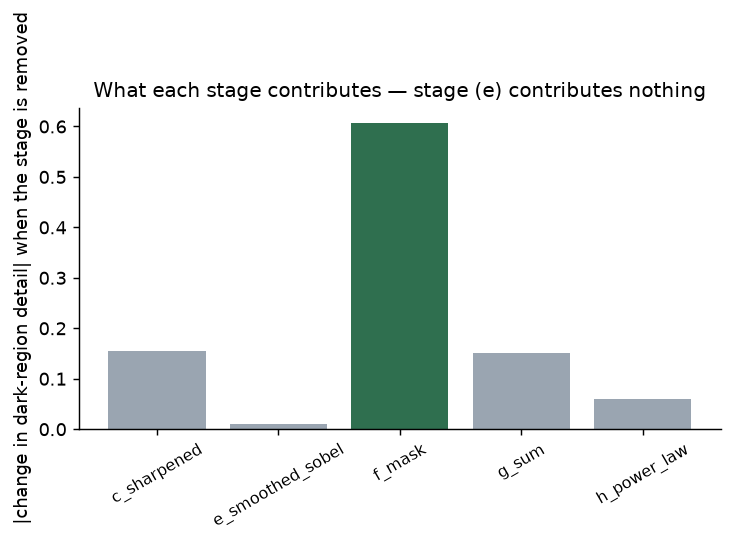
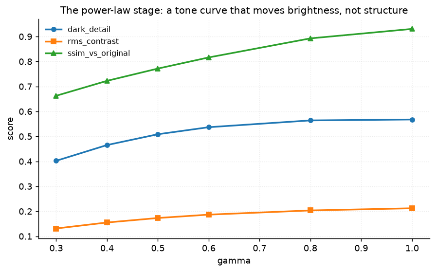
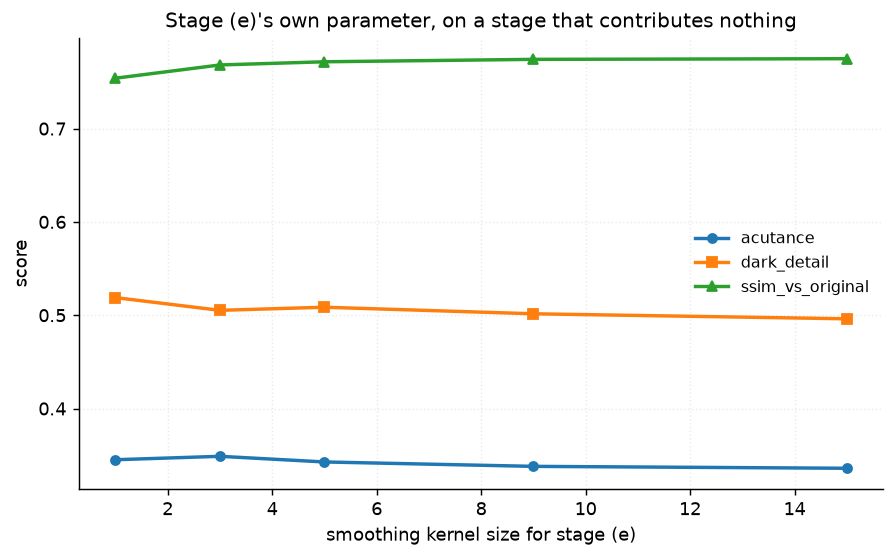
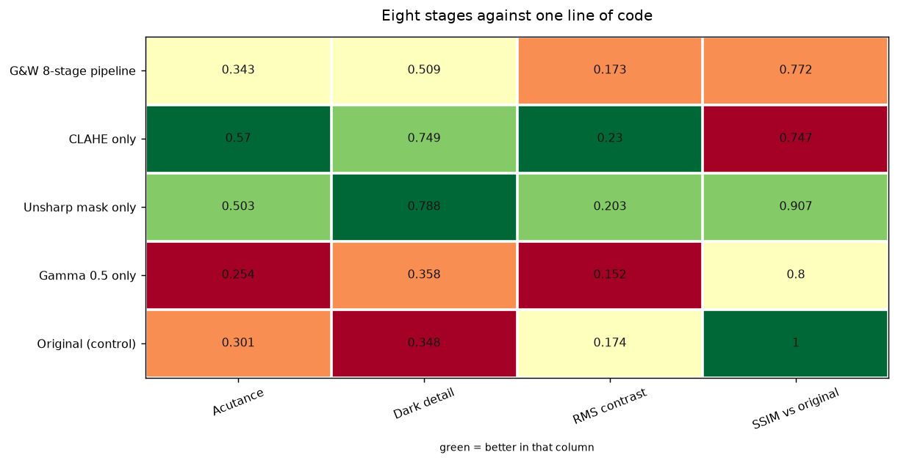

# 31 · The Gonzalez & Woods pipeline — classical computer vision

[](https://www.python.org/)
[](https://opencv.org/)
[](#)
[](#)

The famous eight-stage enhancement chain from *Digital Image Processing* —
Laplacian, sharpen, Sobel, smooth, mask, sum, power-law — **ablated one stage at
a time**, and measured against the one-line alternatives nobody compares it to.

> **The claim under test:** not every stage earns its place. It is presented as a
> recipe; this is the experiment the recipe never gets.

**No neural network, no training, no GPU.**

---

## Results

Eight stages against three one-line alternatives. Cells are dark-region detail —
the quantity the pipeline's final stage exists to raise.



Averaged over all twelve photographs:

| Method | Acutance | **Dark detail** | RMS contrast | SSIM vs original |
|---|---:|---:|---:|---:|
| G&W 8-stage pipeline | 0.3427 | 0.5086 | 0.1731 | 0.7716 |
| CLAHE only | **0.5698** | 0.7489 | **0.2303** | 0.7471 |
| **Unsharp mask only** | 0.5028 | **0.7876** | 0.2030 | **0.9068** |
| Gamma 0.5 only | 0.2542 | 0.3575 | 0.1522 | 0.8005 |
| Original (control) | 0.3006 | 0.3480 | 0.1741 | 1.0000 |

> **One line of code beats eight stages on every column.** An unsharp mask
> reaches 0.788 dark detail against the pipeline's 0.509 — 55% more — with
> higher acutance *and* an SSIM of 0.907 against 0.772, so it is closer to the
> original as well as more enhanced. CLAHE alone also beats it on both
> enhancement metrics.
>
> **The pipeline does beat doing nothing** (0.509 against 0.348), which is worth
> establishing before concluding anything. It works. It is just not worth eight
> stages.

---

## What each stage actually contributes



| Configuration | Acutance | Dark detail | SSIM | Δ dark detail |
|---|---:|---:|---:|---:|
| Full pipeline | 0.3427 | 0.5086 | 0.7716 | — |
| Without **(c) sharpened** | 0.2779 | 0.3536 | 0.7800 | **−0.155** |
| Without **(e) smoothed Sobel** | 0.3451 | 0.5189 | 0.7540 | **+0.010** |
| Without **(f) mask** | 0.6194 | 1.1152 | **0.4382** | **+0.607** |
| Without **(g) sum** | 0.2542 | 0.3575 | 0.8005 | −0.151 |
| Without **(h) power law** | 0.4425 | 0.5676 | 0.9304 | +0.059 |

**Stage (e) contributes nothing.** Removing the Sobel smoothing moves dark
detail by **+0.010** and acutance by **+0.002** — and both changes are
*improvements*. It is in the book, it has its own parameter, and on these twelve
photographs it is doing no work at all.

**Stage (f) restrains rather than adds.** Removing the mask *raises* acutance by
0.28 and dark detail by 0.61, while SSIM collapses from 0.772 to **0.438**. The
mask is not contributing enhancement — it is stopping the sharpening from
running away. That is a completely different job from the one its position in
the chain suggests, and it is invisible unless each stage is removed separately.

**Stages (c) and (g) are the pipeline.** Between them they account for all of the
enhancement: without either, dark detail falls to 0.354 — essentially the
original's 0.348.

---

## The Laplacian sign trap, measured

| Configuration | Acutance | SSIM vs original |
|---|---:|---:|
| Original (no sharpening) | 0.3006 | 1.0000 |
| Correct sign (add +8 centre) | **1.0666** | 0.4568 |
| Wrong sign (add −8 centre) | **0.9156** | **−0.0548** |

**Both signs raise acutance far above the original** — 1.067 and 0.916 against
0.301 — so the no-reference sharpness measure reports success on the bug.

SSIM says 0.457 against **−0.055**. A *negative* SSIM means the wrong-signed
result is anti-correlated with the original: where the image was light it is
dark. Yet it is 3× sharper than the input by the measure people reach for.

[Project 16](../16_sharpening/) found the same thing on a different operator and
a different image pool, independently. Pinned by
`test_acutance_cannot_tell_the_laplacian_sign_but_ssim_can`.

---

## The book's gamma is close, and is not the best



| Gamma | 0.3 | 0.4 | 0.5 *(the book's)* | **0.6** | 0.8 | 1.0 |
|---|---:|---:|---:|---:|---:|---:|
| Dark detail | 0.319 | 0.355 | 0.374 | **0.380** | 0.375 | 0.358 |
| SSIM | 0.547 | 0.614 | 0.677 | 0.742 | 0.869 | 0.936 |

Dark-region detail has an **interior optimum at 0.6**, not at the prescribed
0.5. Too aggressive a curve crushes the highlights it has just lifted the
shadows into.

The margin is small — 0.006 — and the finding is not "the book is wrong" but
that the value was never presented as the result of a sweep, and a sweep puts it
next to rather than on the optimum. Pinned by
`test_the_books_gamma_is_not_the_best_gamma`.



Stage (e)'s own kernel size moves dark detail by less than 0.25 across its whole
range, which is what a parameter belonging to a stage that does nothing should
look like.

---

## A typo used to look like a finding

`run_pipeline(skip=...)` ignored an unrecognised stage name and ran the full
pipeline instead. An ablation table built with a misspelled stage would show six
identical rows — which reads as *"no stage contributes anything"*, a conclusion
rather than a bug report.

It now raises. Pinned by `test_skipping_an_unknown_stage_is_refused`.

---

## How the images were chosen

Twelve photographs selected by `tools/select_images.py --axis brightness --max
110`, spanning mean luminance 36 to 110 and **capped low on purpose**. The
book's worked example is a bone scan: low contrast, with the detail buried in
the dark regions, which is exactly what the final power-law stage exists to
lift. A pool of well-exposed photographs would give it nothing to do.

```
diver_dark_reef      36    red_canoes           65
parasol_boat         73    model_red_black      80
sphinx_and_pyramid   85    elder_in_shawl       89
whitewashed_harbour  92    glass_tower_tulips   96
waterfall_cliff     101    cougar_and_kitten   104
geisha_street       107    collared_lizard     110
```

None of these twelve appears in any other project; `tools/check_image_reuse.py`
enforces that by perceptual hash, not by filename.



---

## Try it on your own image

```bash
python infer.py photo.jpg                  # the pipeline against the one-liners
python infer.py photo.jpg --stages         # every intermediate stage, side by side
python infer.py photo.jpg --ablate         # each stage removed, on your image
```

Enhancement has no ground truth — there is no "correctly enhanced" version of
your photograph — so **no fidelity score is reported as a quality judgement**.
What is printed is dark-region detail and acutance, which say what changed, and
SSIM against the original, which says how far it moved. All three are needed:
the Laplacian sign test above is exactly the case where the first two are
satisfied by a broken result.

---

## Limitations

* **There is no correct answer to compare against.** Every number here is a
  no-reference measure of change plus an SSIM saying how far from the input the
  result sits. That is enough to compare methods against each other and not
  enough to say any of them is right.
* **`dark_detail` is this project's own measure** — gradient energy in the
  darkest quartile of the original. It is defined in `measure()` and is the
  quantity the pipeline's final stage targets; it is not a standard metric.
* **Twelve photographs, none of them a bone scan.** The book's example is a
  nuclear-medicine image with a specific noise and contrast character. These are
  ordinary dark photographs, and the conclusion "one line does better" is about
  them.
* **The alternatives are not tuned.** CLAHE at clip 3.0, unsharp at sigma 1.5,
  amount 1.0. Tuning them would widen the gap, not close it.

---

## Tests

11 tests, run with `pytest projects/31_gw_pipeline/tests -q`. They pin that the
pipeline runs and returns every stage, that an unknown stage name is refused,
and the findings: that stage (e) contributes essentially nothing, that the mask
restrains rather than adds, that a single unsharp mask beats the whole pipeline,
that the pipeline still beats doing nothing, that acutance cannot tell the
Laplacian sign but SSIM can, and that the book's gamma is next to rather than on
the optimum.

---

## Keywords

image enhancement · Gonzalez and Woods · Laplacian sharpening · Sobel gradient ·
unsharp masking · power-law transform · gamma correction · ablation study ·
pipeline ablation · CLAHE · acutance · classical computer vision · no deep
learning · OpenCV · Python · CPU only · reproducible image processing experiments

## References

* Gonzalez & Woods, *Digital Image Processing*, ch. 3 — the eight-stage worked
  example this project ablates, and the gamma 0.5 it prescribes.
* Wang, Bovik, Sheikh & Simoncelli, *Image Quality Assessment: From Error
  Visibility to Structural Similarity*, IEEE TIP 2004 — the SSIM that catches
  the sign error acutance misses.
* Zuiderveld, *Contrast Limited Adaptive Histogram Equalization*, Graphics Gems
  IV, 1994.
