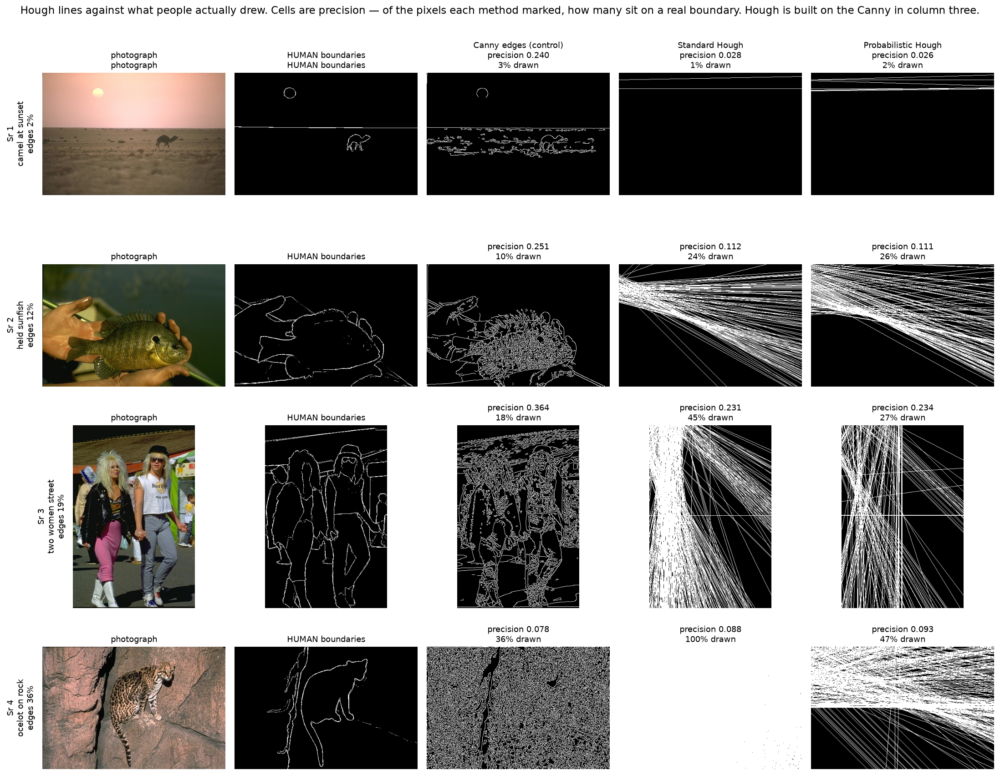
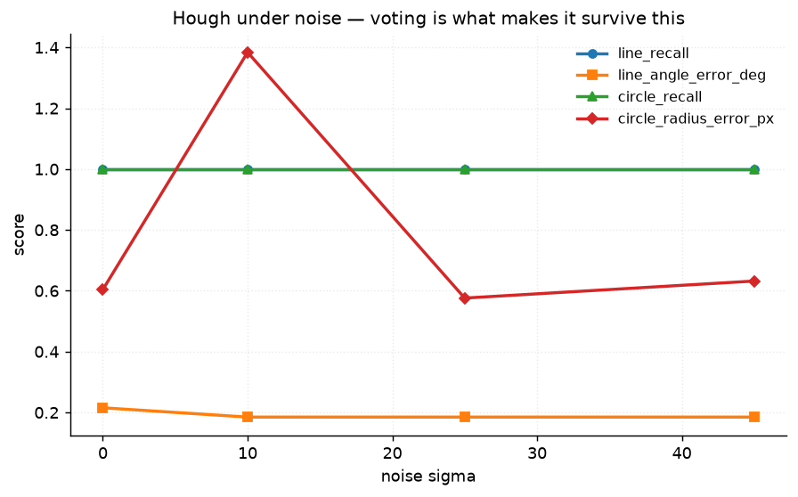
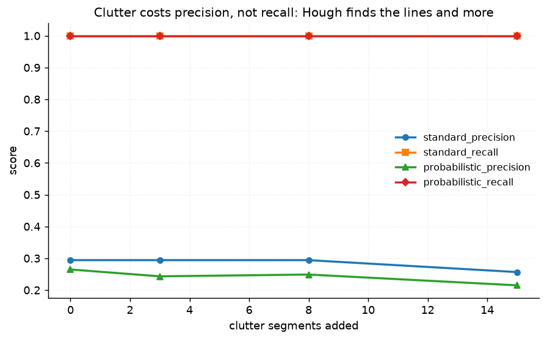
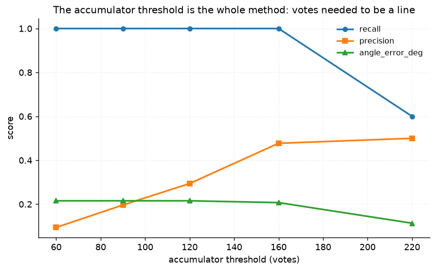
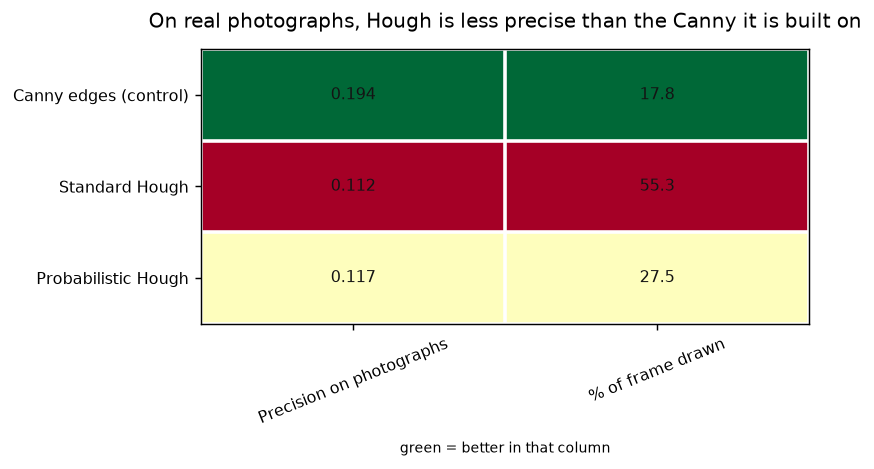

# 32 · Hough transforms — classical computer vision

[](https://www.python.org/)
[](https://opencv.org/)
[](#)
[](#)

Standard and probabilistic Hough for lines, plus Hough circles — measured on a
generated scene with exact geometry **and** on twelve photographs against
boundaries five people drew.

> **The claim under test:** voting makes Hough robust. It does, spectacularly,
> on the scene it is usually demonstrated on. On photographs it makes the edge
> map worse than the Canny it is built from.

**No neural network, no training, no GPU.**

---

## Results

Hough lines against what people actually drew. Cells are **precision** — of the
pixels each method marked, how many sit on a real boundary. Hough votes on the
Canny in column three, so its lines are a subset of Canny's findings.



| Sr | Scene | **Canny (control)** | Standard Hough | Probabilistic Hough |
|---:|---|---:|---:|---:|
| 1 | camel at sunset · edges 2% | **0.240** | 0.028 | 0.026 |
| 2 | held sunfish · edges 12% | **0.251** | 0.112 | 0.111 |
| 3 | two women on a street · edges 19% | **0.364** | 0.231 | 0.234 |
| 4 | ocelot on rock · edges 36% | 0.078 | 0.088 | **0.093** |

Averaged over all twelve photographs:

| Method | Precision | **% of the frame drawn** |
|---|---:|---:|
| **Canny edges (control)** | **0.1937** | 17.8% |
| Standard Hough | 0.1120 | **55.3%** |
| Probabilistic Hough | 0.1167 | 27.5% |

> **Hough is less precise than the Canny it is built on.** It votes on Canny's
> edge map, so every line it returns is supported by pixels Canny already found
> — and the result is *worse*: 0.117 against 0.194.
>
> **Standard Hough marks 55% of the frame as line.** It returns infinite
> (ρ, θ) lines, and an infinite line crosses the whole picture including the
> nine tenths of it where nothing voted. That is not a bug; it is what the
> representation means, and it is why the probabilistic variant — which returns
> finite segments — draws half as much.
>
> **Row 4 is the exception and it is the right one.** On the ocelot, where the
> rock face has long straight fissures, both Hough variants beat Canny. Straight
> structure is what the transform is for, and most of a photograph has none.

---

## On the scene it is usually demonstrated on, it is superb

| Method | Recall | Precision | Angle error | ρ error | Time (ms) |
|---|---:|---:|---:|---:|---:|
| Standard Hough | **1.000** | 0.335 | 0.225° | 0.753 px | **1.76** |
| Probabilistic Hough | **1.000** | 0.214 | **0.123°** | 0.667 px | 4.03 |

*(with five clutter segments added)*

**Both find every line, to a quarter of a degree.** That is the result the
transform is famous for and it is entirely real.

**Standard Hough is 2.3× faster here** and more precise — the opposite of the
usual claim. The caveat matters: the two are not at the same operating point
(standard needs 120 votes, probabilistic 60), so this compares the defaults
people actually use rather than the algorithms at matched sensitivity. What the
probabilistic variant does buy is a **tighter angle** — 0.123° against 0.225° —
because it fits segment endpoints rather than reading an accumulator bin.

### Voting is what makes it survive noise



| Noise sigma | 0 | 10 | 25 | **45** |
|---|---:|---:|---:|---:|
| Line recall | 1.000 | 1.000 | 1.000 | **1.000** |
| Angle error | 0.215° | 0.185° | 0.185° | **0.185°** |
| Circle recall | 1.000 | 1.000 | 1.000 | **1.000** |

**Recall does not move at all**, out to a noise sigma of 45. An accumulator peak
needs hundreds of pixels to agree on the same (ρ, θ); scattered noise never
builds one. This is the strongest robustness result anywhere in this repository,
and it is the entire argument for the transform.

### Clutter costs precision, never recall



| Clutter segments | 0 | 3 | 8 | 15 |
|---|---:|---:|---:|---:|
| Standard recall | **1.000** | **1.000** | **1.000** | **1.000** |
| Standard precision | 0.294 | 0.294 | 0.294 | 0.257 |

Hough finds the lines **and more**. The same property that ignores scattered
noise builds a genuine peak for a few collinear clutter pixels, and the extra
lines are real accumulator maxima rather than errors. Nothing downstream can
tell them apart from the wanted ones.



| Votes required | 60 | 90 | 120 | 160 | **220** |
|---|---:|---:|---:|---:|---:|
| Recall | 1.000 | 1.000 | 1.000 | 1.000 | **0.600** |
| Precision | 0.094 | 0.196 | 0.294 | 0.477 | **0.500** |

The accumulator threshold is the whole method: how many pixels must agree before
it is a line. Recall is flat at 1.000 across four of the five settings and then
falls off a cliff; precision climbs the whole way. There is no setting here that
is good at both.

---

## How the images were chosen

Twelve photographs selected by `tools/select_images.py --axis edges`, spanning
1.9% to 36.3%, and drawn from BSDS500 so they carry human boundary annotations.
The pool deliberately mixes glazed roofs and window grids — which have the
straight structure Hough exists for — with cheetahs and rock faces, which do
not.

```
camel_at_sunset      1.9%    woman_black_beret    9.2%
held_sunfish        11.6%    clouded_leopard     13.1%
palms_at_dusk       15.3%    cheetah_walking     17.5%
two_women_street    19.1%    rocky_cove          20.5%
glass_roof_trees    23.0%    barges_and_blocks   25.4%
hotel_rossiya       29.9%    ocelot_on_rock      36.3%
```

None of these twelve appears in any other project; `tools/check_image_reuse.py`
enforces that by perceptual hash, not by filename.



---

## Why precision and not recall on the photographs

A human boundary map contains **every contour a person traced**, most of which
are not straight. Asking a line detector to recall them would be asking it to be
a different algorithm, and the number would say nothing.

Precision is exactly the right question: of the pixels Hough drew, how many sit
on something real. And because Hough's input *is* Canny's output, the Canny row
is the control that makes the answer interpretable — a Hough precision below it
means the voting stage added error rather than removing it.

---

## Try it on your own image

```bash
python infer.py photo.jpg                       # lines and circles, drawn
python infer.py photo.jpg --threshold 160 --out lines.png
python infer.py --annotated hotel_rossiya       # score against human boundaries
```

On your own photograph there is no annotation, so **no precision is printed** —
only how many lines each method found, how much of the frame they cover, and how
much of Canny's edge map they account for. That last number is the useful one:
Hough drawing far more than Canny found means it is extrapolating, which is what
the infinite-line representation does by construction.

---

## Limitations

* **The two line methods are not at matched sensitivity.** Standard at 120
  votes, probabilistic at 60 — OpenCV's usual defaults. The timing and precision
  comparison is of the defaults, not of the algorithms.
* **Precision on photographs is a hard measure for any edge method.** Canny's own
  0.194 is not a good score either; human boundary maps are sparse and a
  detector marking 18% of the frame cannot be precise against them. The
  comparison between rows is what carries meaning, not the absolute values.
* **Circles are only measured on the generated scene**, because a photograph has
  no annotated circles and a Hough circle cannot be scored against a boundary
  map the way a line can.
* **`rasterise_lines` draws at one-pixel width** with no anti-aliasing, so the
  drawn-pixel percentages are a function of that choice as well as of the
  method. They are comparable with each other and not with anything else.

---

## Tests

10 tests, run with `pytest projects/32_hough_transforms/tests -q`. They pin that
both methods find every line on a clean scene, that circles are located to a few
pixels, that clutter costs precision and never recall, that standard Hough is
faster here *with its caveat stated*, and the findings: that Hough is less
precise than the Canny it is built on, that the man-made scenes are where it
does best relative to Canny, that the accumulator threshold trades recall
against precision, and that voting is what makes it survive noise.

---

## Keywords

Hough transform · probabilistic Hough · HoughLinesP · Hough circles ·
accumulator · voting · line detection · circle detection · rho theta
parameterisation · edge detection · BSDS500 · classical computer vision · no
deep learning · OpenCV · Python · CPU only · reproducible image processing
experiments

## References

* Hough, *Method and Means for Recognizing Complex Patterns*, US Patent
  3,069,654, 1962.
* Duda & Hart, *Use of the Hough Transformation to Detect Lines and Curves in
  Pictures*, Communications of the ACM 1972 — the (ρ, θ) parameterisation.
* Matas, Galambos & Kittler, *Robust Detection of Lines Using the Progressive
  Probabilistic Hough Transform*, CVIU 2000.
* Yuen et al., *Comparative Study of Hough Transform Methods for Circle
  Finding*, Image and Vision Computing 1990.
