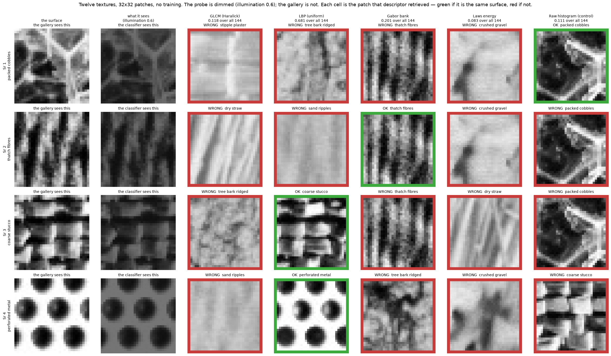
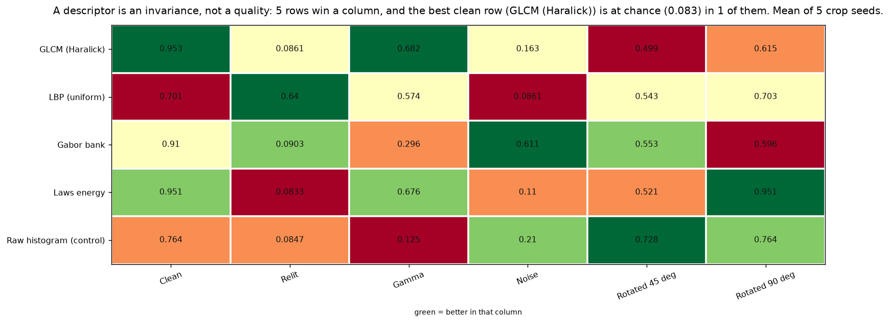
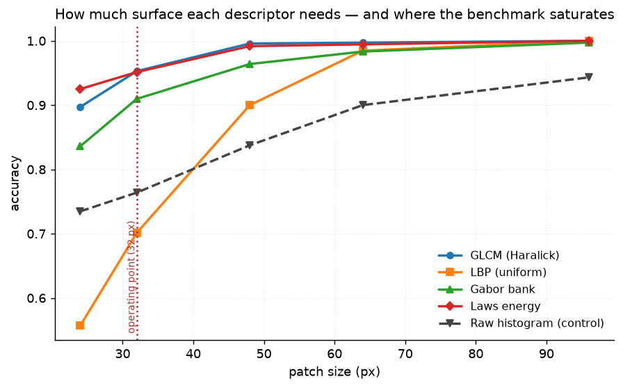
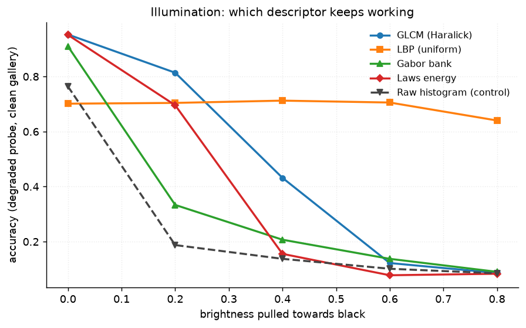
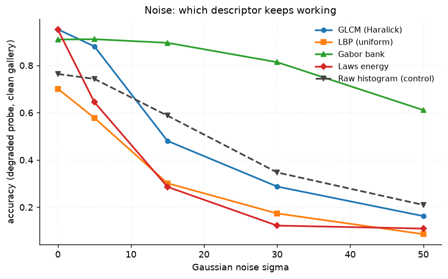
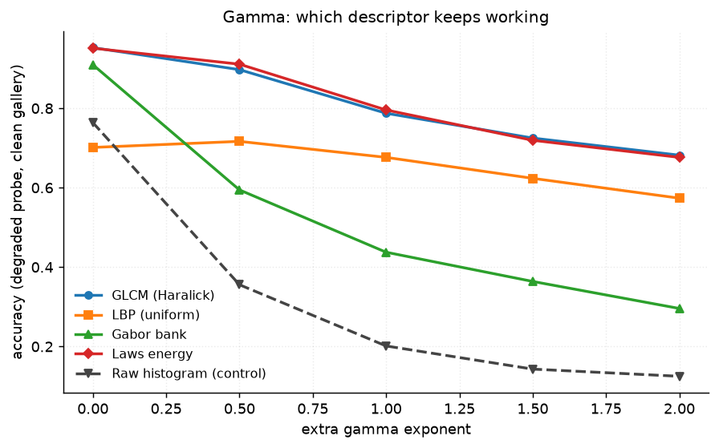
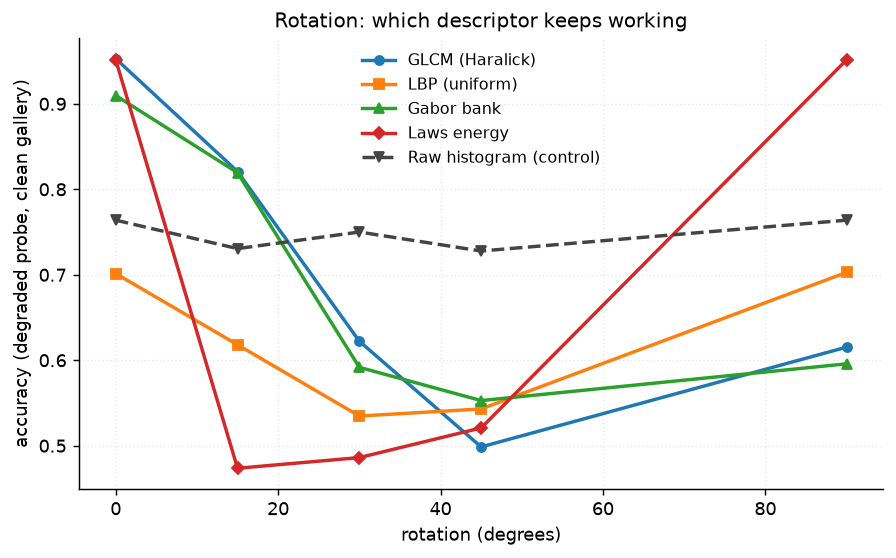
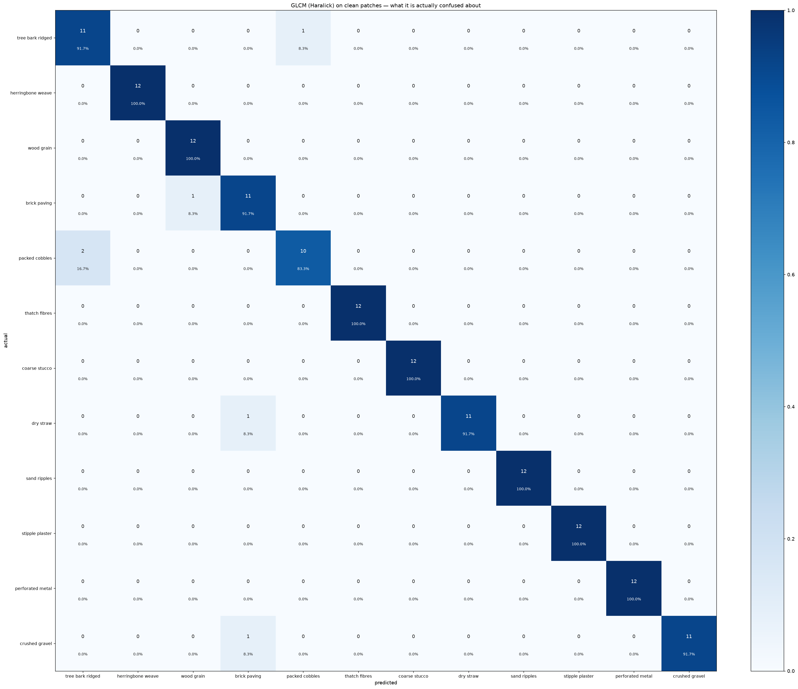
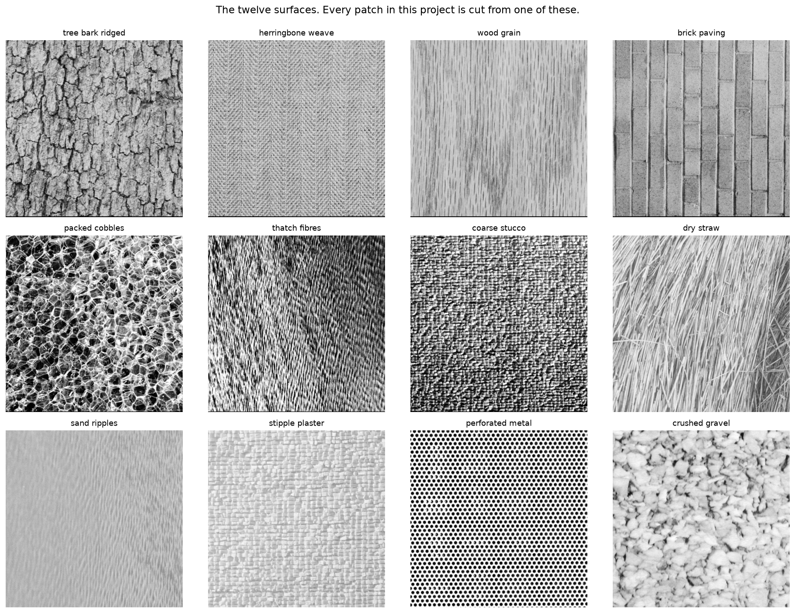

# 33 · Texture descriptors — classical computer vision

[](https://www.python.org/)
[](https://opencv.org/)
[](#)
[](#)

GLCM, LBP, Gabor and Laws turned into a twelve-way classification problem with
no training — and then taken apart by relighting, gamma, noise and rotation to
find out what each one is actually invariant to.

> **The claim under test:** these are four texture descriptors and one of them
> is best. They are not comparable that way. A descriptor is an **invariance**,
> and the one that wins on clean patches is at chance the moment the light
> changes.

**No neural network, no training, no GPU.** Classification is nearest-neighbour
in feature space — a distance computation, not a model.

---

## Results

Four surfaces, one row each. Column two is what the classifier is handed; every
cell after it is the gallery patch that descriptor **retrieved** — green if it
is the same surface, red if not. Patches are 32×32, shown at 6×.



| Sr | Texture | GLCM | LBP | Gabor | Laws | Raw histogram (control) |
|---:|---|---|---|---|---|---|
| 1 | packed cobbles | stipple plaster | tree bark | thatch fibres | crushed gravel | **correct** |
| 2 | thatch fibres | dry straw | sand ripples | **correct** | crushed gravel | packed cobbles |
| 3 | coarse stucco | tree bark | **correct** | thatch fibres | dry straw | packed cobbles |
| 4 | perforated metal | sand ripples | **correct** | tree bark | crushed gravel | coarse stucco |

Those four rows are the probes the descriptors **disagree** about most — chosen
that way on purpose, because an agreed-on probe shows five identical columns and
proves nothing. Over all 144 probes at this condition the column scores are
printed in the figure's own headers.

---

## The signature result: nobody wins twice



| Descriptor | Clean | Relit | Gamma | Noise | Rotated 45° | Rotated 90° |
|---|---:|---:|---:|---:|---:|---:|
| GLCM (Haralick) | **0.953** ± 0.025 | 0.086 | **0.682** | 0.163 | 0.499 | 0.615 |
| LBP (uniform) | 0.701 ± 0.034 | **0.640** | 0.574 | 0.086 | 0.543 | 0.703 |
| Gabor bank | 0.910 ± 0.021 | 0.090 | 0.296 | **0.611** | 0.553 | 0.596 |
| Laws energy | 0.951 ± 0.025 | 0.083 | 0.676 | 0.110 | 0.521 | **0.951** |
| *Raw histogram (control)* | *0.764 ± 0.040* | *0.085* | *0.125* | *0.210* | ***0.728*** | *0.764* |

*Chance is 0.083. Every cell is the mean of 5 crop seeds — 720 classifications.*

> **The best clean descriptor is at chance after a relight.** GLCM scores 0.953
> on clean patches and **0.086** when the light is pulled down, which is 1/12.
> Laws scores 0.083 — *exactly* chance, on every one of the five seeds.
>
> **The worst real descriptor is the only survivor.** LBP is last of the four on
> clean patches (0.701, below a plain intensity histogram) and the only thing in
> the table still standing under a relight. It encodes the **sign** of local
> differences and nothing else, so a monotonic change to the light cannot move
> it. That is not tuning; it is what the operator is.
>
> **Gabor owns the noise column, and its runner-up is the control.** 0.611
> against 0.210, with GLCM at 0.163 and Laws at 0.110. A Gabor filter is a
> sinusoid under a 21×21 Gaussian envelope — it averages over hundreds of pixels
> and rejects everything outside its passband. Laws uses 5×5 high-pass masks,
> which is exactly where broadband noise lives.
>
> **Laws loses nothing at all to a right angle** — 0.951 clean, 0.951 rotated.
> `feat_laws` averages each mask with its transpose (L5E5 with E5L5), and a 90°
> rotation is precisely what swaps them. Meanwhile **GLCM computes four angles
> and is still not rotation invariant** (0.953 → 0.615), because it keeps the
> four values in a fixed order instead of canonicalising them. Four angles are
> not the same thing as rotation invariance.
>
> **At 45° the do-nothing control beats all four real descriptors.** 0.728
> against a best real score of 0.553. An intensity histogram throws away every
> spatial relationship, which makes it weak on clean patches and exactly
> rotation-invariant. At the worst angle for a square-sampled operator, that
> trade pays.

---

## Two ways this experiment was wrong before it was right

Both produced tables that looked completely reasonable.

### Degrading both sides of the comparison measures nothing

The first version degraded every patch and ran leave-one-out. Nearest-neighbour
matching is invariant to anything that moves every sample the same way, so a
global brightness change cost **nothing at all** — not even to the raw intensity
histogram, which has no such invariance:

| Protocol | Raw histogram under a 0.6 relight |
|---|---:|
| Degrade everything, leave-one-out | **0.785** — "invariant" |
| Degrade the probes only, clean gallery | **0.111** |

The first number is real. The experiment is empty. Pinned by
`test_degrading_both_sides_of_the_comparison_measures_nothing`.

### A rotation that was really a relocation

The second version rotated the plate and cut the probe at the same *coordinates*
— which is a different piece of surface. A 90° rotation appeared to **raise**
LBP's accuracy from 0.674 to 0.847. Cutting the same region un-rotated scored
0.889, so the gain was the crop, not the angle.

The crop centre is now carried through the same matrix that warps the plate, so
a rotated probe is the same surface turned. Writing the test for that found a
third bug: the warp rotated about `w/2` while an exact flip is about `(w−1)/2`,
putting every rotated patch one pixel out.

---

## Choosing the operating point instead of assuming one



| Patch | GLCM | LBP | Gabor | Laws | Control |
|---:|---:|---:|---:|---:|---:|
| 24 px | 0.897 | **0.557** | 0.836 | 0.925 | 0.735 |
| **32 px** | 0.953 | 0.701 | 0.910 | 0.951 | 0.764 |
| 48 px | 0.996 | 0.900 | 0.964 | 0.992 | 0.838 |
| 64 px | 0.997 | 0.985 | 0.983 | 0.995 | 0.900 |
| 96 px | **1.000** | **1.000** | 0.997 | **1.000** | 0.943 |

**At 96 px the whole spread between the four real descriptors is 0.003** — an
eighth of the seed-to-seed noise. The benchmark is saturated and cannot rank
anything, which is the trap project 28 fell into with its synthetic scene. 32 px
leaves them spread over 0.25, so that is where everything else here is measured.

**LBP's real weakness is sample size, not light.** It is a 26-bin histogram, and
a 24×24 patch gives it a few hundred codes to fill those bins with: 0.557 where
Laws is at 0.925. The gap closes completely by 64 px. The descriptor famous for
illumination invariance is the one that needs four times the area.

---

## The degradations, level by level




The illumination plot is the clearest thing in this project: one flat line and
four cliffs. LBP crosses above everything else between 0.2 and 0.4 and stays
there.




**Gamma is where LBP's invariance is only half true.** In theory LBP survives any
monotonic intensity map, and gamma is monotonic — but it drops to 0.574, behind
GLCM's 0.682. An exponent of 3 crushes the dark end into a handful of levels, and
once neighbouring pixels quantise to the same value the *sign* of their
difference is no longer defined. The invariance is to monotonic maps that
preserve ordering in 8 bits, which a strong gamma does not.

---

## Which textures get confused with which



The matrix is for the best clean descriptor, and its errors are not scattered:
the only mutual confusion is **packed cobbles ↔ ridged bark**, two coarse,
irregular, unoriented surfaces whose statistics genuinely are alike. A
descriptor that is wrong about a pair a person would also hesitate over is
behaving differently from one that is merely noisy, and only the matrix
distinguishes the two.

LBP's errors are a different shape. Its worst pair is **stippled plaster →
crushed gravel** — the deliberately confusable pair in the set, both blobby,
isotropic and high-contrast — together with **herringbone → ridged bark**, which
is not a resemblance so much as a 26-bin histogram running out of samples.

---

## How the images were chosen

Twelve plates from the USC-SIPI Brodatz-style texture volumes, selected with
`tools/select_images.py --axis texture` and then pruned by hand so that no two
are the same *kind* of surface — three strongly oriented, two exactly periodic,
the lowest- and highest-contrast plates in the pool, and one deliberately
confusable pair.



A thirteenth candidate (SIPI 1.2.04, a coarse linen weave) was **rejected by
`tools/check_image_reuse.py`**: its perceptual hash is within 5 bits of the
herringbone plate already chosen. Two Brodatz textures with different catalogue
numbers can be near-duplicates, which is worth knowing before using them as
separate classes. None of these twelve appears in any other project, enforced by
perceptual hash rather than by filename.

---

## Try it on your own image

```bash
python infer.py my_surface.jpg                  # which of the twelve is it nearest?
python infer.py my_surface.jpg --relight 0.6    # then run it again and compare
python infer.py --plate brick_paving            # held-out crops of a known plate
```

**Read the margin, not the label.** With twelve classes something always wins,
and a photograph of a surface that is not in the set will still be assigned one
of the twelve. The margin is the ratio between the nearest wrong-class distance
and the nearest right-class one; below about 1.05 the answer is a coin toss with
extra steps, and `infer.py` says so rather than printing a confident class name.

---

## Limitations

* **Twelve classes, 144 patches.** A 0.02 difference in accuracy is one patch,
  and the seed-to-seed spread is around 0.03. Every headline here is a gap of
  0.1 or more; the smaller ones in the table are reported with their standard
  deviation and should be read as ties. GLCM's 0.953 and Laws' 0.951 are one
  number.
* **All twelve plates are photographs of flat surfaces under even studio light.**
  The relighting, gamma and noise in this project are *applied*, not
  photographed. A real change of illuminant also moves shadows and specularities,
  which a global multiply does not, so LBP's advantage here is an upper bound on
  what it would buy in the field.
* **The plates were re-encoded as JPEG at quality 92** by the import tool, which
  imposes an 8×8 DCT quantisation on textures whose whole content is
  high-frequency. Every class gets the same treatment so the comparison is fair,
  but the absolute accuracies are for slightly-compressed textures.
* **Scale is not in the invariance table.** The three 1024 px plates were resized
  to 640 and the rest were not, so each class already has its own characteristic
  scale; a scale sweep on top of that would be measuring two things at once.
  `build_split` supports `degradation="scale"` for anyone who wants it.
* **Separability is reported but not used for any claim.** It is there because
  accuracy saturates and stops discriminating — at 96 px every real descriptor is
  at 1.000 while the scatter ratio still separates them threefold.

---

## Tests

17 tests, run with `pytest projects/33_texture/tests -q`. They pin the sampler
(disjoint gallery and probes, a rotated probe showing the same surface region,
crop centres a rotation cannot push out of frame), the two protocol errors that
produced plausible wrong tables, and every finding: that LBP is last clean and
first relit, that no descriptor is best everywhere, that Gabor owns noise while
Laws collapses, that Laws is exactly 90°-invariant while GLCM's four angles are
not, that the do-nothing control wins at 45°, and that LBP needs four times the
patch area.

---

## Keywords

texture descriptors · GLCM · Haralick features · grey-level co-occurrence matrix
· local binary patterns · LBP · uniform LBP · Gabor filter bank · Laws texture
energy · texture classification · nearest neighbour · illumination invariance ·
rotation invariance · Brodatz · USC-SIPI · classical computer vision · no deep
learning · OpenCV · scikit-image · Python · CPU only · reproducible image
processing experiments

## References

* Haralick, Shanmugam & Dinstein, *Textural Features for Image Classification*,
  IEEE SMC 1973 — the co-occurrence matrix and its statistics.
* Ojala, Pietikäinen & Mäenpää, *Multiresolution Gray-Scale and Rotation
  Invariant Texture Classification with Local Binary Patterns*, TPAMI 2002 — the
  uniform variant used here.
* Laws, *Textured Image Segmentation*, USC Image Processing Institute, 1980.
* Jain & Farrokhnia, *Unsupervised Texture Segmentation Using Gabor Filters*,
  Pattern Recognition 1991.
* Brodatz, *Textures: A Photographic Album for Artists and Designers*, 1966 —
  the source of the USC-SIPI plates.
