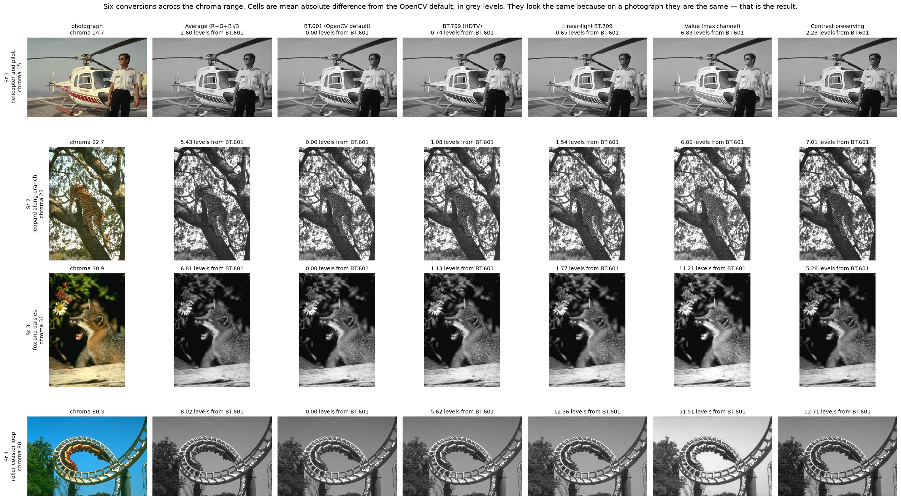
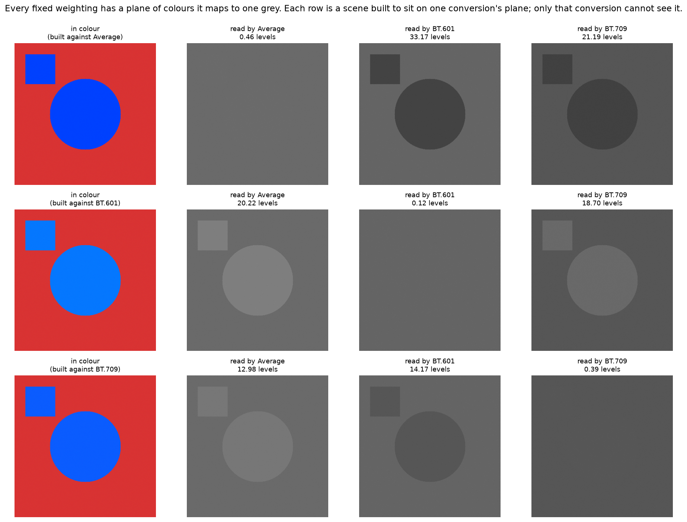
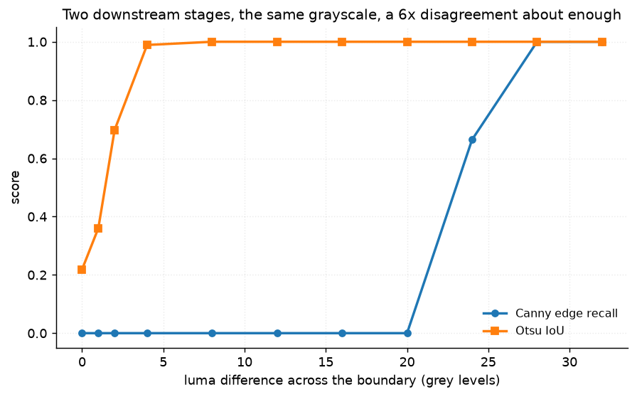
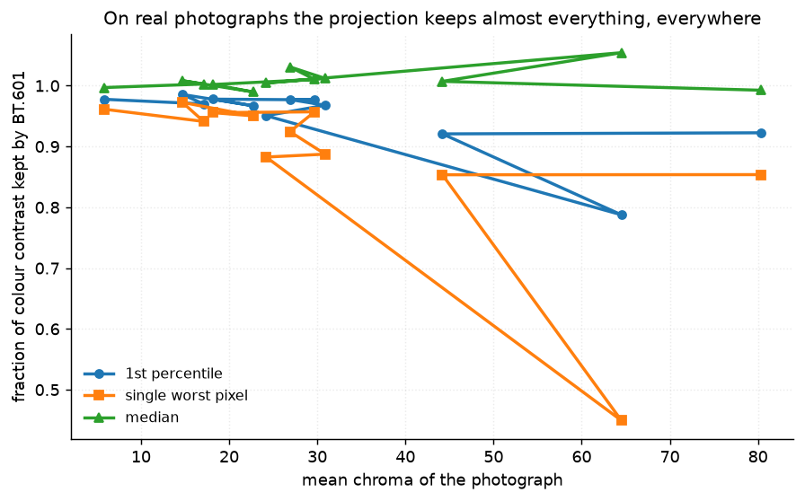
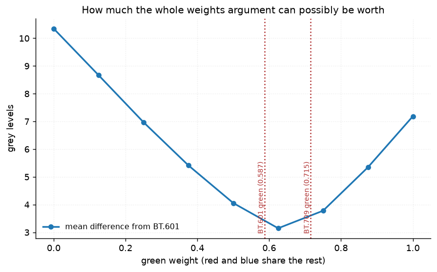

# 34 · RGB → grayscale — classical computer vision

[](https://www.python.org/)
[](https://opencv.org/)
[](#)
[](#)

Six ways to collapse three channels into one, measured on twelve photographs and
on colours built specifically to break them.

> **The claim under test:** BT.601 is the wrong standard and BT.709 is the right
> one. Both halves are beside the point. Any fixed weighting is a projection onto
> a line, so **every** one of them has a whole plane of colours it maps to a
> single grey — and on real photographs the difference between them is two grey
> levels.

**No neural network, no training, no GPU.**

---

## Results

Four photographs across the chroma range, six conversions each. Cells are mean
absolute difference from the OpenCV default, in grey levels.



| Sr | Photograph | Average | **BT.601** | BT.709 | Linear-light | Value | Contrast-preserving |
|---:|---|---:|---:|---:|---:|---:|---:|
| 1 | helicopter and pilot · chroma 15 | 2.60 | — | **0.74** | 0.65 | 6.89 | 2.23 |
| 2 | leopard along branch · chroma 23 | 5.43 | — | **1.08** | 1.54 | 6.86 | 7.01 |
| 3 | fox and daisies · chroma 31 | 6.81 | — | **1.13** | 1.77 | 11.21 | 5.28 |
| 4 | roller coaster loop · chroma 80 | 8.02 | — | **5.62** | 12.36 | 51.51 | 12.71 |

**The columns look the same because on a photograph they are the same.** That is
the result, not a failure of the figure. Only row 4 — a yellow coaster against a
deep blue sky, the most saturated picture in the pool — separates by eye, and
there it is `Value` that stands out, not the weighting argument.

| Conversion | Levels from BT.601 | Contrast retained | Worst colour-edge recall | Time (ms) |
|---|---:|---:|---:|---:|
| Average (R+G+B)/3 | 5.95 | 0.9982 | 0.9996 | 4.40 |
| **BT.601 (OpenCV default)** | — | 0.9972 | 0.9994 | **1.81** |
| BT.709 (HDTV) | **2.18** | 0.9966 | 0.9991 | 1.68 |
| Linear-light BT.709 | 3.09 | 0.9963 | 0.9989 | 12.45 |
| Value (max channel) | 15.86 | 0.9875 | 0.9978 | 6.06 |
| Contrast-preserving | 5.53 | 0.9983 | **0.9998** | 196.65 |

> **The entire BT.601-versus-BT.709 argument is worth 2.18 grey levels** — under
> 1% of the range, on twelve photographs spanning 5.8 to 80.3 mean chroma.
>
> **The contrast-preserving method costs 109×** the time (196.6 ms against 1.8)
> and buys 0.0011 of colour-edge recall. It is the only method here that can
> survive the adversarial case below, and on photographs that capability is
> worth nothing measurable.
>
> **`Value` is seven times further from BT.601 than BT.709 is.** It is not a
> luminance at all — `max(R, G, B)` throws away two channels per pixel — and it
> is the one choice in this table that visibly changes a photograph.

---

## The signature result: everyone is blind somewhere

A set of weights is a projection onto a line, so the colours it cannot
distinguish form a **plane**. Choosing better weights moves that plane. It does
not remove it.



Each row is a scene built to sit exactly on one conversion's blind plane. The
diagonal is blank.

| Scene built against | Average | BT.601 | BT.709 | Linear-light | Value | Contrast-preserving |
|---|---:|---:|---:|---:|---:|---:|
| **Average (R+G+B)/3** | **0.46** | 33.18 | 21.20 | 22.35 | 37.86 | 193.21 |
| **BT.601 (OpenCV default)** | 20.21 | **0.12** | 18.70 | 9.49 | 37.86 | 158.58 |
| **BT.709 (HDTV)** | 12.98 | 14.17 | **0.39** | 7.68 | 37.86 | 205.90 |

*Grey levels separating a shape a person sees instantly.*

> **BT.709 is exactly as blind as BT.601**, just about different colours — 0.39
> grey levels against a shape built for it. "Use the modern standard" is not an
> answer to this problem; there is no set of three numbers that is.
>
> **Only the per-image method escapes every row** (158–206 levels), because it
> is the only one allowed to look at the picture before choosing its weights.
> That is what the 109× buys, and it buys it precisely where photographs are not.

---

## Recovering a boundary is not the same as the next stage finding it

On the scene BT.601 is blind to, four of the six conversions recover the
boundary. Then it goes to a downstream stage:

| Conversion | Levels recovered | Canny finds it | Otsu finds it |
|---|---:|---:|---:|
| Average (R+G+B)/3 | 20.21 | 0.000 | 1.000 |
| BT.601 (OpenCV default) | 0.12 | 0.000 | 0.219 |
| BT.709 (HDTV) | 18.70 | 0.000 | 1.000 |
| Linear-light BT.709 | 9.49 | 0.000 | 1.000 |
| Value (max channel) | 37.86 | **1.000** | 1.000 |
| Contrast-preserving | 158.58 | **1.000** | 1.000 |

**Otsu finds every recovery; Canny finds two of four.** BT.709 brings back 18.7
grey levels of a boundary that BT.601 destroyed, and Canny's hysteresis throws
the recovery away.



| Luma difference | 0 | 2 | **4** | 8 | 16 | 24 | **28** |
|---|---:|---:|---:|---:|---:|---:|---:|
| Otsu IoU | 0.219 | 0.697 | **0.989** | 1.000 | 1.000 | 1.000 | 1.000 |
| Canny recall | 0.000 | 0.000 | 0.000 | 0.000 | 0.000 | 0.664 | **1.000** |

**Otsu needs 4 grey levels of separation; Canny needs 28 — a 7× disagreement
between two stages reading the same grayscale.** Otsu compares two populations
of pixels and a 4-level gap between them is plenty; Canny thresholds a
*gradient* against a fixed hysteresis pair. "Is this conversion good enough" has
no answer until you say what runs next.

---

## And on real photographs, none of it happens



For every pixel in the top 3% of colour gradient, how much of that contrast
survives into BT.601:

| Photograph | Chroma | 1st pct kept | Single worst pixel |
|---|---:|---:|---:|
| penguin on pebbles | 5.8 | 0.978 | 0.961 |
| helicopter and pilot | 14.7 | 0.986 | 0.973 |
| teotihuacan pyramids | 17.1 | 0.970 | 0.941 |
| milking the cow | 18.2 | 0.978 | 0.956 |
| leopard along branch | 22.7 | 0.967 | 0.950 |
| beached boats | 24.2 | 0.951 | 0.883 |
| ducks in reeds | 26.9 | 0.977 | 0.924 |
| black bear wading | 29.7 | 0.977 | 0.957 |
| fox and daisies | 30.9 | 0.968 | 0.887 |
| runners on track | 44.2 | 0.921 | 0.854 |
| **damselfly on leaf** | 64.5 | **0.788** | **0.450** |
| roller coaster loop | 80.3 | 0.923 | 0.854 |

**Across 55,596 strong colour edges the lowest 1st-percentile retention is
0.788.** The isoluminant catastrophe is real, constructible to order, and
essentially absent from natural images — the single worst pixel anywhere in
twelve photographs still keeps 45% of its contrast.

The one image that comes closest is the damselfly: an iridescent blue-green
insect on a green leaf, which is as near as a photograph in this pool gets to
the constructed case. It is the only row below 0.9, and it is still nowhere near
the 0.00 of the synthetic scene.



Sweeping the green weight from 0 to 1 puts a hard bound on the argument.
Discarding green *entirely* — the most extreme reweighting there is — costs 10.3
grey levels against BT.601. The BT.601-to-BT.709 move costs 2.18, a fifth of
that.

The curve holds red and blue equal and varies only green, so it does not pass
through either standard; the marked green weights say where each standard sits
on that one axis, not what it scores. What the curve bounds is the size of the
whole argument: no reweighting of a photograph, however extreme, moves it more
than about 10 grey levels.

---

## The bug that made the experiment wrong

The first version solved for one channel algebraically: fix green and blue, then
`r = (target_luma − wg·g − wb·b) / wr`. For BT.709 that red comes out
**negative**, `np.clip` pulls it to zero, and clipping a colour changes its luma
— so the pair was no longer isoluminant at all. BT.709 scored 29.7 grey levels
against a scene built to be invisible to it, which read as "BT.709 is better"
and was actually "the scene was broken".

`matched_luma_colour` searches the RGB cube instead, so every candidate is in
gamut by construction, and picks the one furthest from the background.
`test_the_isoluminant_colour_stays_in_gamut` keeps it that way.

---

## How the images were chosen

Twelve photographs selected by `tools/select_images.py --axis colour`, which
measures mean distance from the grey axis. Colour is the axis this project is
about: a conversion can only discard colour where there is some to discard.

```
penguin_on_pebbles     5.8    beached_boats        24.2
helicopter_and_pilot  14.7    ducks_in_reeds       26.9
teotihuacan_pyramids  17.1    black_bear_wading    29.7
milking_the_cow       18.2    fox_and_daisies      30.9
leopard_along_branch  22.7    runners_on_track     44.2
damselfly_on_leaf     64.5    roller_coaster_loop  80.3
```

The penguin is the control: at chroma 5.8 there is almost nothing to throw away,
and every method must agree on it. If one did not, the difference would not be
about colour. None of these twelve appears in any other project;
`tools/check_image_reuse.py` enforces that by perceptual hash, not by filename.

---

## Try it on your own image

```bash
python infer.py photo.jpg                     # all six conversions, side by side
python infer.py photo.jpg --blind-spot        # the colours YOUR image would lose
python infer.py photo.jpg --out gray.png --method "BT.709 (HDTV)"
```

`--blind-spot` is the one worth running. It finds the pixels in your photograph
whose colour contrast a fixed weighting discards most, and reports how much is
left — the per-image version of the table above.

---

## Limitations

* **The adversarial scene is constructed, and at offset 0 its result is true by
  construction.** A conversion built on weights `w` must return a flat image for
  colours chosen to have equal `w`-luma; that is arithmetic, not a finding. What
  is a finding is the off-diagonal (nobody else is blind there), the sweep (how
  close to isoluminant it has to be), and the photographs (how rarely it
  happens).
* **Twelve photographs is not a survey of natural image statistics.** They are a
  spread across one axis, chosen to include the most saturated and the most
  neutral in a 500-image pool. The claim "this essentially never happens" is
  supported for this pool and is an invitation to run `--blind-spot` on your own,
  not a proof about photography in general.
* **`Contrast-preserving` here is a coarse grid search over the weight simplex**,
  not the published Gooch/Lu decolorisation. It shares the property that matters
  — weights chosen per image — and its 196 ms is the cost of a 66-point search,
  not of the state of the art.
* **`region_separation` is a difference of means.** On the synthetic scene the
  regions are flat, so it is exactly the boundary contrast; on a photograph it
  would not be, which is why photographs are measured with gradient retention
  instead.
* **Everything here is 8-bit sRGB.** The linear-light conversion decodes and
  re-encodes through that 8-bit pipeline, so some of its 3.09-level difference
  from BT.601 is quantisation rather than colour science.

---

## Tests

14 tests, run with `pytest projects/34_rgb_to_grayscale/tests -q`. They pin the
scene construction (in gamut, genuinely isoluminant, the offset doing what it
says), the clipping bug that made an earlier version wrong, and every finding:
that each fixed weighting is blind somewhere including the correct one, that
only the per-image method escapes, that the choice is irrelevant on photographs,
that the per-image method costs two orders of magnitude for nothing there, that
Canny and Otsu disagree 7× about how much separation is enough, and that
recovering a boundary is not the same as the next stage finding it.

---

## Keywords

RGB to grayscale · luma · BT.601 · BT.709 · Rec. 709 · luminance · isoluminant ·
equiluminant · decolorisation · contrast-preserving grayscale · colour to gray ·
linear light · sRGB gamma · HSV value · colour projection · classical computer
vision · no deep learning · OpenCV · Python · CPU only · reproducible image
processing experiments

## References

* ITU-R BT.601-7, *Studio encoding parameters of digital television*, 2011.
* ITU-R BT.709-6, *Parameter values for the HDTV standards*, 2015.
* Gooch, Olsen, Tumblin & Gooch, *Color2Gray: Salience-Preserving Color
  Removal*, SIGGRAPH 2005.
* Lu, Xu & Jia, *Contrast Preserving Decolorization*, ICCP 2012.
* Čadík, *Perceptual Evaluation of Color-to-Grayscale Image Conversions*,
  Computer Graphics Forum 2008.
