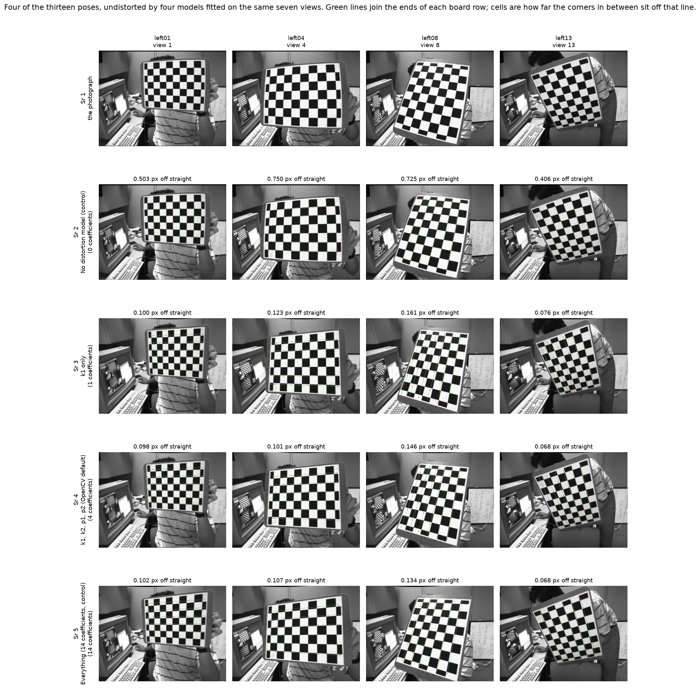
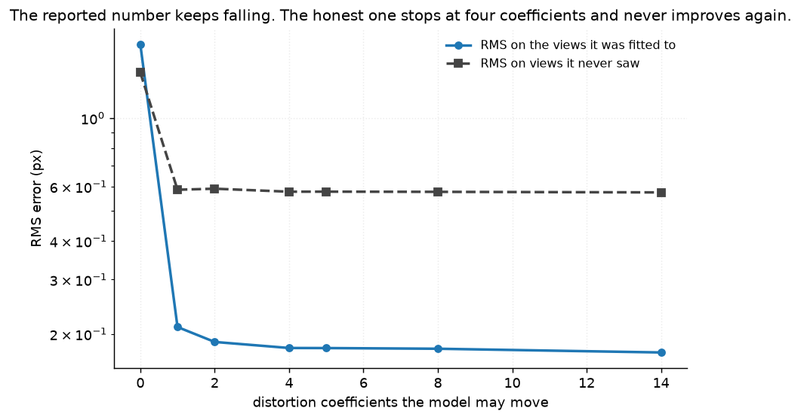
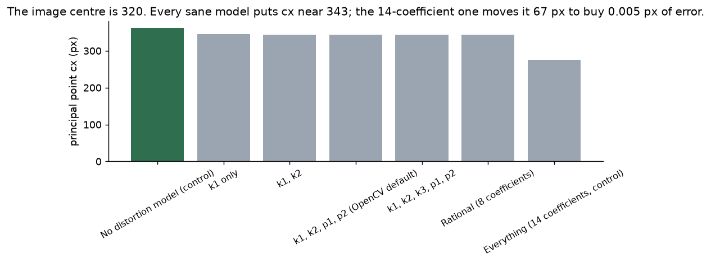
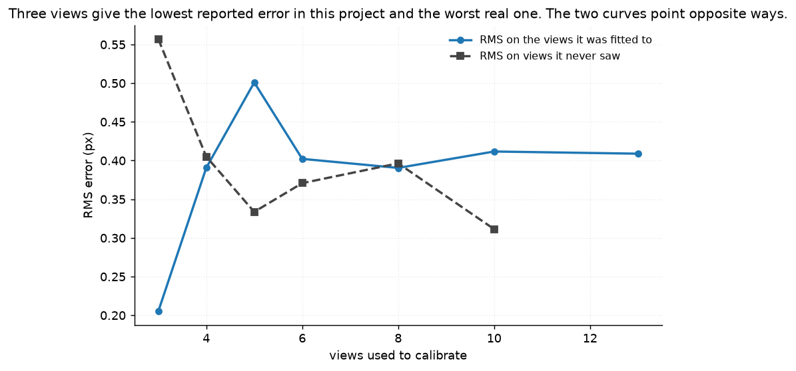
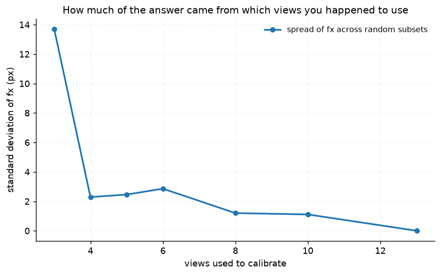
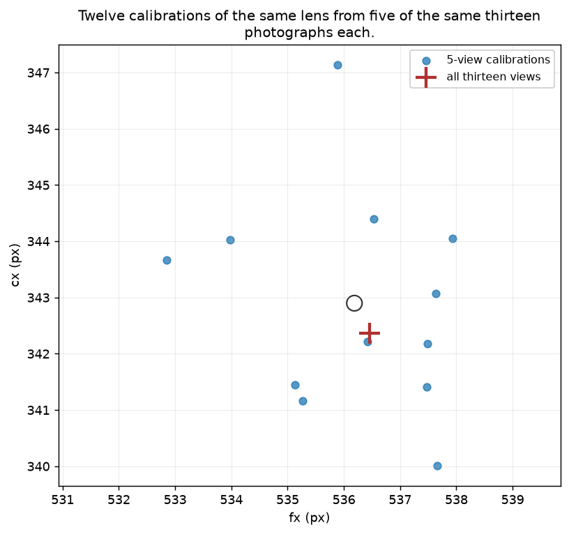
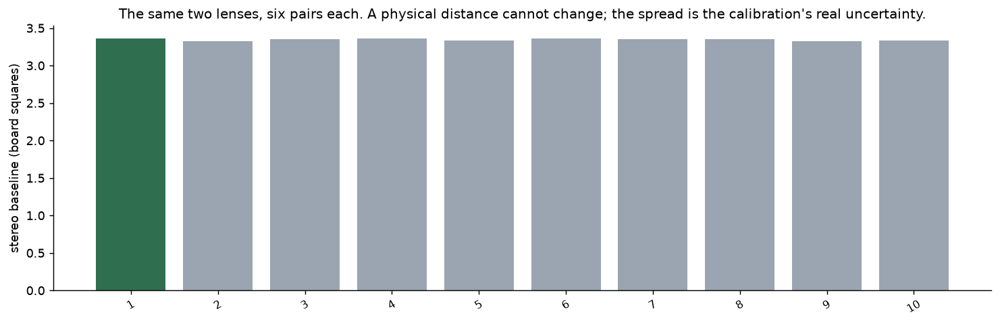

# 35 · Camera calibration & distortion — classical computer vision

[](https://www.python.org/)
[](https://opencv.org/)
[](#)
[](#)

Thirteen photographs of a 9×6 chessboard, two cameras, and the one number every
calibration write-up quotes.

> **That number gets better as the calibration gets worse, in two independent
> ways.** Calibrating on **three** views reports an RMS of **0.205 px** — the
> lowest in this project — and scores **0.557 px** on views it never saw.
> Calibrating on **ten** reports **0.412 px**, twice as bad, and scores
> **0.311 px**. The quoted number and the real one point in opposite directions.

> **And the model with the lowest reported error puts the principal point 67
> pixels out.** The 14-coefficient model reports **0.174 px** against the
> default's 0.180 — and moves **cx from 343 to 276** in a 640-pixel-wide image
> whose centre is 320. Ten extra parameters bought **0.003 px** on held-out
> views.

> **The part that does work is worth saying too.** The stereo baseline, measured
> ten times from different pairs of the same photographs, agrees to **0.38%**.

**No neural network, no training, no GPU.**

---

## Results

Four of the thirteen poses, undistorted by four models fitted on the **same seven
views**. Green lines join the ends of each board row; the cells are how far the
corners in between sit off that line.



| Sr | View | No distortion (control) | k1 only | k1, k2, p1, p2 (default) | Everything (14 coef, control) |
|---:|---|---:|---:|---:|---:|
| 1 | left01 | 0.503 | 0.100 | **0.098** | 0.102 |
| 2 | left04 | 0.750 | 0.123 | **0.101** | 0.107 |
| 3 | left08 | 0.725 | 0.161 | 0.146 | **0.134** |
| 4 | left13 | 0.406 | 0.076 | **0.068** | **0.068** |

*Pixels off straight, per view. **One coefficient does 85% of the work**; the
other thirteen argue over the last 0.03 px.*

| Model | Coefficients | RMS **fitted** | RMS **held out** | Straightness (px) | fx | cx |
|---|---:|---:|---:|---:|---:|---:|
| No distortion model (control) | 0 | 1.7342 | 1.4033 | 0.6860 | 578.57 | 361.40 |
| k1 only | 1 | 0.2107 | 0.5861 | 0.0975 | 530.94 | 344.59 |
| k1, k2 | 2 | 0.1885 | 0.5907 | 0.0848 | 532.46 | 343.13 |
| **k1, k2, p1, p2 (OpenCV default)** | 4 | 0.1802 | 0.5776 | **0.0816** | 534.39 | 343.21 |
| k1, k2, k3, p1, p2 | 5 | 0.1801 | 0.5778 | 0.0815 | 534.51 | 343.21 |
| Rational (8 coefficients) | 8 | 0.1792 | 0.5770 | 0.0815 | 534.16 | 343.22 |
| **Everything (14 coef, control)** | 14 | **0.1743** | 0.5746 | 0.0818 | 530.29 | **276.00** |

*Fitted on views 1, 3, 5, 6, 8, 12, 14; held out 2, 4, 7, 9, 11, 13.*

---

## The signature result: the number that always improves



**The fitted RMS falls monotonically with every coefficient added** — 1.734, 0.211,
0.189, 0.180, 0.180, 0.179, 0.174 — which is exactly what makes it useless for
deciding how many coefficients to use. It is the training error, and a test
asserts it is monotone so that this cannot be mistaken for noise.

**The held-out RMS stops at four coefficients and never improves again**: 0.5776,
0.5778, 0.5770, 0.5746. The last ten parameters move it by 0.003 px.



And that 0.003 px is paid for with a principal point that is not where the lens
is. Every model with four or fewer distortion coefficients puts **cx within 1.5 px
of 343**. The 14-coefficient model puts it at **276** — 67 px away, and 44 px on
the other side of the image centre. The thin-prism and tilted-sensor terms can
imitate a shifted centre, so the optimiser used them to shave the fit.

**Nothing in the reported number says this happened.** It went down.

---

## Three views report the best error and give the worst calibration



| Views used | 3 | 4 | 5 | 6 | 8 | 10 | 13 |
|---|---:|---:|---:|---:|---:|---:|---:|
| **RMS reported** | **0.2051** | 0.3907 | 0.5010 | 0.4022 | 0.3905 | 0.4117 | 0.4089 |
| **RMS on unseen views** | **0.5571** | 0.4051 | 0.3337 | 0.3708 | 0.3964 | **0.3114** | n/a |
| Straightness (px) | 0.0933 | 0.0994 | 0.1056 | 0.0974 | 0.0924 | 0.0932 | **0.0911** |
| fx | 540.5 | 536.7 | 538.3 | 536.0 | 536.4 | 536.7 | **536.5** |
| **spread of fx** | **± 13.71** | ± 2.29 | ± 2.46 | ± 2.86 | ± 1.20 | ± 1.11 | ± 0.00 |

Averaged over five random draws at each count, so this is not one unlucky triple.

With three views there are barely more constraints than parameters, so the model
fits those three boards almost exactly — and is 79% worse on the tenth board than
a ten-view calibration is. **The reported error halves while the real error nearly
doubles.**



The focal length from three views comes out **540.5 ± 13.7 px**. From ten,
**536.7 ± 1.1**. The ± is not measurement noise — it is how much of the answer
came from which views you happened to point the board in.

---

## The check that lives outside the objective

`cv2.calibrateCamera` minimises reprojection error and nothing else. So
reprojection error cannot also be a fair test of the result, and the held-out
version only removes one of the two problems.

**A straight line in the world must be straight in the image once the lens model
is removed.** A row of nine chessboard corners is such a line, and the fit never
looks at it.

| | Before undistortion | After (default model) |
|---|---:|---:|
| Mean deviation of a board row from a straight line | **0.6860 px** | **0.0911 px** |

**7.5× better, on a quantity nothing in the fit was aiming at.** That is what
says the calibration is real rather than merely self-consistent — and it is also
what says the 14-coefficient model gained nothing: its straightness is 0.0818
against the default's 0.0816, very slightly *worse*.

---

## The same lens, twelve answers



Twelve calibrations, each from five of the same thirteen photographs of the same
physical camera:

| | range | spread |
|---|---|---|
| fx | 532.85 – 537.93 px | 5.1 px |
| cx | 340.0 – 347.1 px | 7.1 px |
| **k1** | **−0.2888 – −0.2480** | **15% of its own value** |

The thirteen-view calibration reports `k1 = −0.278647` to six decimal places. The second
decimal is the last one that means anything.

---

## The part that works



| Stereo, all 13 pairs | |
|---|---|
| RMS | 0.4477 px |
| Baseline | **3.3447 board squares** |
| Rotation between the cameras | **0.312°** |
| Translation | (−3.3441, 0.0416, 0.0487) |

Ten stereo calibrations from six pairs each give a baseline of **3.3464 ± 0.0128
squares — 0.38%**. A physical distance between two lenses, recovered
independently ten times, agreeing to four parts in a thousand.

The translation is **80× longer along x than along y or z**, and the rotation is a
third of a degree, which is what a stereo rig physically is. Neither of those was
put in by hand: both fall out of the same optimisation that produced the
questionable principal point above. **The extrinsics are well constrained here and
the high-order distortion terms are not**, and the single RMS number cannot tell
you which of the two you are looking at.

---

## About the images

Thirteen poses, not fourteen: `left10`/`right10` return 404 from the upstream host
and were never cached. That is stated here and in `VIEW_IDS` rather than being
quietly skipped, because "13 views" and "14 views, one failed to detect" are
different facts about a calibration.

**Lengths are in board squares.** The square size is not published with these
images, so every distance here is in squares rather than in invented millimetres.
Focal length in pixels is unaffected by the choice; the baseline is a real,
checkable ratio either way.

Corners are refined to sub-pixel with `cornerSubPix` and **cached**, so a
difference between two rows of any table here is never a difference in what was
detected.

---

## Try it

```bash
python infer.py                              # calibrate on all thirteen, undistort one
python infer.py --views 3                    # the overfitting case, live
python infer.py --model "Everything (14 coefficients, control)"
python infer.py --image my_chessboard.jpg    # your own 9x6 board photo
```

It prints the fitted RMS, the held-out RMS and the straightness side by side, so
the gap between the number you would quote and the number that matters is visible
on whatever subset you choose.

---

## Limitations

* **One camera pair, one board, one room.** Thirteen poses of a board held by hand
  in front of a monitor. Nothing here says how a wide-angle lens, a machine-vision
  sensor or a board at longer range would behave.
* **The board's square size is unknown**, so no absolute length is reported.
* **Held-out RMS is still reprojection error** — the same objective on unseen
  data. It answers overfitting but not model mis-specification, which is why the
  straightness check exists.
* **`cornerSubPix` with an 11×11 window** is a choice; a different window moves
  every number in the fourth decimal.
* **The straightness metric uses only board rows, not columns.** Rows span nine
  corners and columns six, so rows are the more sensitive line; using both would
  dilute it.
* **"Held out" here means held-out poses of the same board in the same room.** A
  genuinely independent test would be a different scene entirely.

---

## Tests

19 tests, run with `pytest projects/35_camera_calibration/tests -q`. They pin the
result (the reported and real errors move in opposite directions; the fitted RMS
is monotone in the coefficient count; the lowest reported error comes with a
67-pixel principal-point error that buys 0.003 px), the out-of-objective check
(that `calibrate` contains no straightness term, and that undistortion improves
straightness 7.5× anyway), the instability of a five-view calibration, and the
things that are solid — a stable baseline, near-parallel cameras, square pixels,
a barrel-distorted lens, and thirteen views rather than fourteen.

They skip cleanly if the calibration images are not cached.

---

## Keywords

camera calibration · lens distortion · radial distortion · tangential distortion ·
chessboard · reprojection error · overfitting · held-out validation ·
principal point · focal length · intrinsic matrix · stereo calibration ·
baseline · rectification · classical computer vision · no deep learning ·
OpenCV · Python · CPU only · reproducible image processing experiments

## References

* Zhang, *A Flexible New Technique for Camera Calibration*, TPAMI 2000 — the
  planar-target method `calibrateCamera` implements.
* Brown, *Close-Range Camera Calibration*, Photogrammetric Engineering 1971 — the
  radial and tangential distortion model.
* Devernay & Faugeras, *Straight Lines Have to Be Straight*, MVA 2001 — the
  out-of-objective check this project borrows.
* Strobl & Hirzinger, *More Accurate Pinhole Camera Calibration with Imperfect
  Planar Target*, ICCV Workshops 2011 — on what a low reprojection error does and
  does not tell you.
* The chessboard images ship with OpenCV's sample data.
