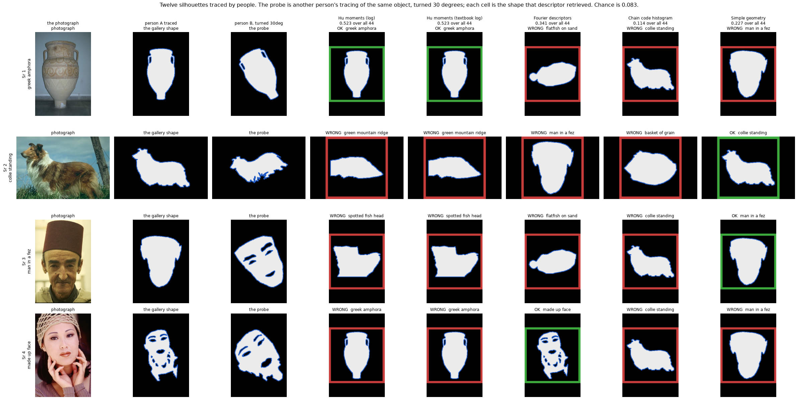
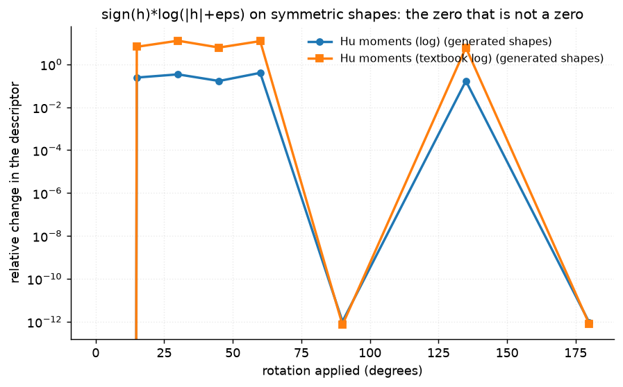
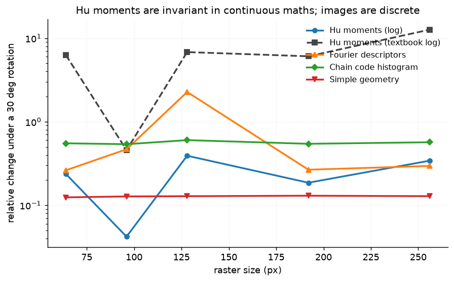
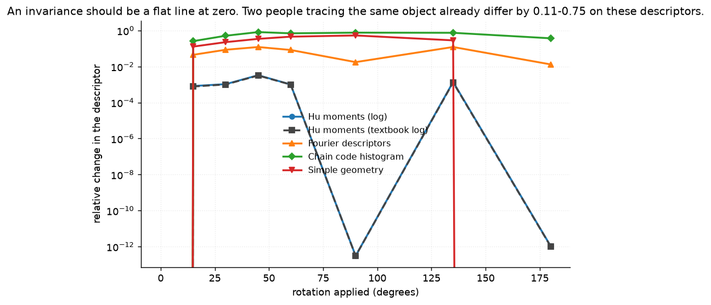
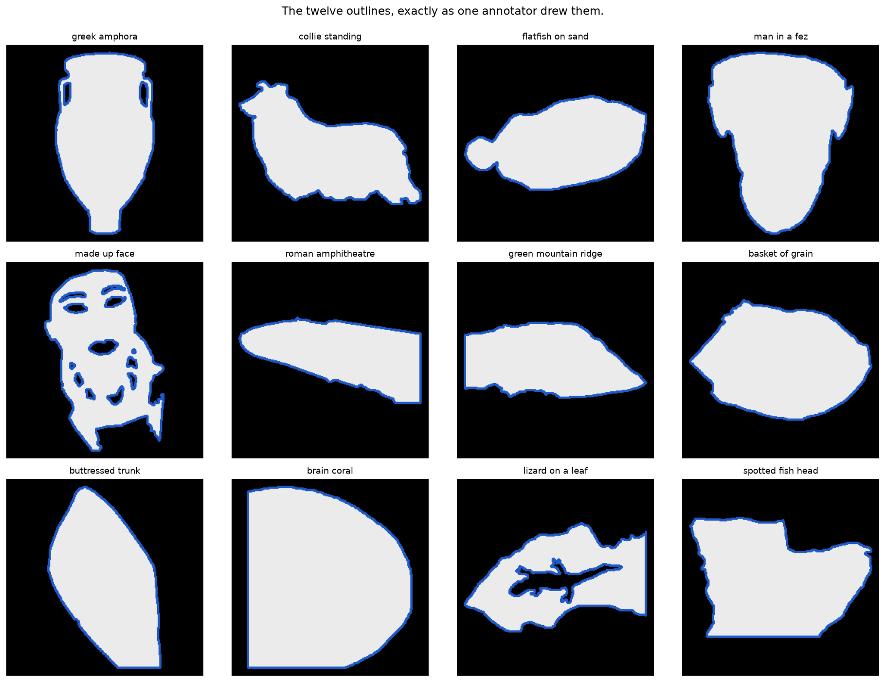

# 36 · Shape descriptors — classical computer vision

[](https://www.python.org/)
[](https://opencv.org/)
[](#)
[](#)

Hu moments, Fourier descriptors, chain codes and four plain ratios — every
claimed invariance checked directly, on drawn shapes where the transform is
exact and on twelve silhouettes that people traced.

> **The claim under test:** "invariant to translation, rotation and scale". Two
> of those three survive. The third depends on a line of code that appears in
> every tutorial and is wrong — and even where the invariance is real, it is a
> thousand times tighter than the shape itself is defined.

**No neural network, no training, no GPU.** Classification is nearest-neighbour
in descriptor space.

---

## Results

Four objects, one row each. Column two is one person's tracing (the gallery),
column three is **another person's** tracing of the same object turned 30°, and
every cell after that is the silhouette that descriptor retrieved — green if it
is the same object, red if not.



| Sr | Object | Hu (fixed) | Hu (textbook) | Fourier | Chain code | Simple geometry |
|---:|---|---|---|---|---|---|
| 1 | greek amphora | **correct** | **correct** | flatfish | collie | man in a fez |
| 2 | collie standing | mountain ridge | mountain ridge | man in a fez | basket of grain | **correct** |
| 3 | man in a fez | fish head | fish head | flatfish | collie | **correct** |
| 4 | made up face | greek amphora | greek amphora | **correct** | collie | man in a fez |

Those four are the probes the descriptors disagree about most. Over all 44
cross-annotator probes, with chance at 0.083:

| Descriptor | Upright | Turned 30° |
|---|---:|---:|
| Hu moments (log) | 0.545 | **0.523** |
| Hu moments (textbook log) | 0.545 | 0.523 |
| Fourier descriptors | 0.386 | 0.341 |
| **Chain code histogram** | **0.750** | **0.114** |
| Simple geometry | 0.500 | 0.227 |

> **The descriptor that wins upright is the one with no rotation invariance, and
> it is the one that collapses when the shape is turned.** The chain code
> histogram records the *directions* of the boundary steps — a strong signature
> of a particular outline, and destroyed by rotating it. Best at 0.750, and at
> 0.114 it is barely above chance.
>
> **Hu moments lose almost nothing to the turn** (0.545 → 0.523), and win the
> rotated column having lost the upright one. An invariance is a trade.
>
> **Every descriptor here is far above chance and none reaches 0.8.** Recognising
> an object from *another person's* tracing is a genuinely hard task, which is
> why it is the one reported. Classify each silhouette against rotated copies of
> **itself** and every descriptor scores 0.97 or better — a rotated copy of a
> silhouette is still that silhouette, and the number means nothing.

---

## The line of code that makes Hu moments look broken

The log transform is always written the same way:

```python
hu = cv2.HuMoments(cv2.moments(binary)).ravel()
return np.sign(hu) * np.log10(np.abs(hu) + eps)      # every tutorial
```

A drawn circle's 5th, 6th and 7th Hu moments are **exactly `0.0`**. `np.sign(0)`
is `0`, so those components come out as **0** instead of at the floor
`log10(eps) = -12`. Rotate the circle by any angle at all and they become
`4.7e-62` — still numerically zero — but now `sign` is `1` and the component
drops to `-12`.

**The descriptor moves 12 units because a quantity went from zero to 1e-62.**

For a five-pointed star it is worse: h5 and h7 sit at `1e-16`, and rotation
flips their *sign*. The component swings from `-12` to `+12` and the descriptor
moves 24.



| Transform (drawn shapes) | Textbook recipe | Magnitude floored |
|---|---:|---:|
| Rotation | 5.059 | **0.150** |
| Scale | 3.327 | **0.237** |

**34× on rotation, 14× on scale, and none of it was Hu's fault.** `desc_hu`
floors the magnitude and gives everything below the epsilon one stable value:

```python
magnitude = np.log10(np.maximum(np.abs(hu), EPS))
sign = np.where(np.abs(hu) < EPS, 1.0, np.sign(hu))
return sign * magnitude
```

A Hu moment of `1e-62` computed from a binary raster is not a small number, it is
zero with rounding on it, and giving it a sign invents a distinction the image
cannot support.

**And it is a trade, not a free fix.** Flooring the magnitude also floors the
*sign*, and the sign of h7 is the only reflection detector in this project. The
basket of grain — the most nearly mirror-symmetric silhouette in the pool — has
`h7 = +3.7e-13` upright and exactly `−3.7e-13` mirrored. That is structured, not
noise: it negates to four significant figures. But it is below the `1e-12` floor,
so the floored variant reports **no** change under reflection where the textbook
one reports 1.151.

For a nearly mirror-symmetric shape, rotation stability and reflection
sensitivity pull against each other and no single epsilon resolves both. That is
why both variants are reported rather than one being declared correct. It is
also the one case in this project that `infer.py` found and the batch tests did
not.

### "It is only discretisation, use a bigger image" is false



| Raster | 64 px | 96 px | 128 px | 192 px | 256 px |
|---|---:|---:|---:|---:|---:|
| Hu (floored) | 0.236 | **0.042** | 0.391 | 0.186 | 0.341 |
| Hu (textbook) | 6.261 | 0.457 | 6.813 | 6.068 | **12.643** |

The curve does not converge — it bounces — and a drawn **ellipse gets seventeen
times worse** going from 64 px to 256. A finer raster computes a symmetric
shape's near-zero moments *more* accurately, which pushes them closer to the
floor where the log is least stable. Resolution does not rescue a descriptor
whose instability lives at zero. Fixing the floor does: the textbook variant is
worse at every single raster size.

---

## An invariance is only meaningful against how well the shape is defined

This is what the human tracings are for. BSDS500 ships five to seven independent
segmentations per image, so the same object exists several times over, drawn by
different people.



| Descriptor | Rotation (traced) | Scale (traced) | **Two people differ by** | Ratio |
|---|---:|---:|---:|---:|
| Hu moments (log) | 0.0010 | 0.0049 | **0.753** | 0.001× |
| Fourier descriptors | 0.0565 | 0.0279 | **0.578** | 0.098× |
| Chain code histogram | 0.545 | 0.0745 | **0.173** | **3.15×** |
| Simple geometry | 0.246 | 0.0103 | **0.108** | **2.28×** |

> **Hu moments are invariant to a 180° rotation a thousand times more tightly
> than two people agree on where the object's edge is.** That invariance is real
> arithmetic and, for anything downstream of a human-drawn or
> algorithmically-segmented mask, of no practical consequence whatsoever.
>
> **The chain code histogram and the four plain ratios are the opposite.** Their
> rotation error is two to three times the human spread, which makes it a real
> failure rather than a rounding argument. `Simple geometry` moving 0.246 under
> rotation is surprising for four ratios that look rotation-free — but perimeter
> is not, because a rotated raster re-samples the boundary and circularity
> depends on perimeter squared.

---

## Translation is the one claim that is exactly true

| Descriptor | Translation, drawn | Translation, traced |
|---|---:|---:|
| all four | **0.00000** | **0.00000** |

Every descriptor here is built on a contour or on central moments, both of which
subtract the centroid before doing anything else. The invariance is not
approximate; it is `0.0` to every digit, on both generated and traced shapes.

---

## Reflection: only the 7th Hu moment notices

| Object | Mirror symmetry | h7 flips | Fourier change | Geometry change |
|---|---:|---:|---:|---:|
| greek amphora | 0.963 | **yes** | 0.0000 | 0.0000 |
| collie standing | 0.547 | **yes** | 0.0021 | 0.0000 |
| man in a fez | 0.896 | **yes** | 0.0074 | 0.0000 |
| basket of grain | 0.893 | no* | 0.0026 | 0.0000 |
| *(eight more)* | | **yes** | ≤0.0097 | 0.0000 |

**The 7th Hu moment flips sign on 11 of 12 traced silhouettes, and every other
descriptor here is exactly blind to a mirror** — the four geometric ratios change
by `0.0000` on all twelve. A shape and its reflection are different objects, and
h7 is the only thing in this table that can say so.

\* The basket of grain is the exception, and it is the one the floor costs. Its
h7 does negate under reflection, but at `3.7e-13` — below the epsilon, so the
floored `desc_hu` cannot see it. The textbook variant can. This is the trade
described above, and it is the only image of the twelve where the two Hu rows
disagree.

On generated shapes the same test looks like a failure — h7 flips for the
triangle and for none of the other five. It is not: a circle, a square, a cross,
an ellipse and a five-pointed star all *have* a mirror axis, so their reflection
is the same shape and h7 is right not to move. The test only means anything on
shapes without that symmetry, which is most things a person traces.

---

## How the silhouettes were chosen

Not by one of `tools/select_images.py`'s axes — none of them measures whether a
picture contains *a shape*. Instead, every cached BSDS human segmentation was
scored for a single connected region covering 8–55% of the frame and not glued to
the border, and the top of that list was inspected by eye.



```
greek_amphora        collie_standing      flatfish_on_sand
man_in_a_fez         made_up_face         roman_amphitheatre
green_mountain_ridge basket_of_grain      buttressed_trunk
brain_coral          lizard_on_a_leaf     spotted_fish_head
```

Each is recorded as `(annotator, region label)` — which person's segmentation and
which region of it — because "the biggest region" of a photograph is usually the
sky. Two are kept precisely because they break the usual assumptions:
**`made_up_face` fragments into fifteen contours**, and **`lizard_on_a_leaf` is a
leaf with a lizard-shaped hole in it**. A descriptor built on `largest_contour`
silently ignores both facts.

None of these twelve appears in any other project;
`tools/check_image_reuse.py` enforces that by perceptual hash. Two further
candidates were rejected by it during selection — one was already in the repo
under a different name, and one had the *background* as its traced region rather
than the subject.

---

## Try it on your own shape

```bash
python infer.py mask.png                     # all five descriptors, all invariances
python infer.py mask.png --rotate 45         # how far each one actually moves
python infer.py --object collie_standing     # one of the project's silhouettes
```

It prints, for your shape, how much each descriptor moves under rotation, scale
and reflection — and compares that against the 0.11–0.75 spread between two
people tracing the same object, which is the number that says whether an
invariance is worth anything for your use.

---

## Limitations

* **Twelve objects and 44 cross-annotator pairs.** The recognition accuracies
  have a resolution of about 0.02 and the differences reported (0.75 vs 0.11)
  are far larger than that, but a 0.05 gap in this table is not a ranking.
* **The human spread is measured between BSDS annotators, not against truth.**
  There is no correct silhouette for a collie; the disagreement between people is
  the best available statement of how well the shape is defined, and it is a
  property of the annotation task as much as of the object.
* **Matching a region across annotators is done by maximum IoU with a 0.5
  floor.** On most images this is unambiguous, but where one person traced a
  whole face and another traced it without the eyes and mouth, both pass. That
  disagreement is real and is part of what the human spread measures — but it is
  a larger difference than "where exactly is the edge".
* **`largest_contour` is what three of the five descriptors see.** For
  `made_up_face` that discards fourteen of fifteen contours and for
  `lizard_on_a_leaf` it discards the hole. The masks are reported as they are
  rather than cleaned up, because a descriptor that cannot represent a hole
  should show that.
* **The generated shapes are the only place the transforms are exact.** A traced
  silhouette rotated 30° is resampled onto a new pixel grid, so a small part of
  every "traced" number is rasterisation rather than descriptor behaviour. The
  comparison against the human spread is what makes that tolerable: rasterisation
  noise is orders of magnitude below it.

---

## Tests

14 tests, run with `pytest projects/36_shape_descriptors/tests -q`. They pin the
log-Hu defect from three directions (the exact zero, the sign flip below the
epsilon, and the fact that a bigger raster does not fix it), the silhouette
loader, and every finding: that translation invariance is exactly true, that only
h7 sees a reflection, that the descriptor winning upright is the one that cannot
survive a turn, that recognising another person's tracing is hard where
recognising a rotated copy of the same mask is not, and that an invariance
tighter than the human spread is arithmetic rather than a capability.

---

## Keywords

shape descriptors · Hu moments · invariant moments · image moments · Fourier
descriptors · elliptic Fourier · chain code · Freeman chain code · circularity ·
solidity · convexity · shape matching · rotation invariance · scale invariance ·
reflection · BSDS500 · human annotation · classical computer vision · no deep
learning · OpenCV · Python · CPU only · reproducible image processing experiments

## References

* Hu, *Visual Pattern Recognition by Moment Invariants*, IRE Transactions on
  Information Theory, 1962.
* Freeman, *On the Encoding of Arbitrary Geometric Configurations*, IRE
  Transactions on Electronic Computers, 1961.
* Zhang & Lu, *Review of shape representation and description techniques*,
  Pattern Recognition 2004.
* Martin, Fowlkes, Tal & Malik, *A Database of Human Segmented Natural Images*,
  ICCV 2001 — the silhouettes used here.
* Flusser & Suk, *Pattern recognition by affine moment invariants*, Pattern
  Recognition 1993.
