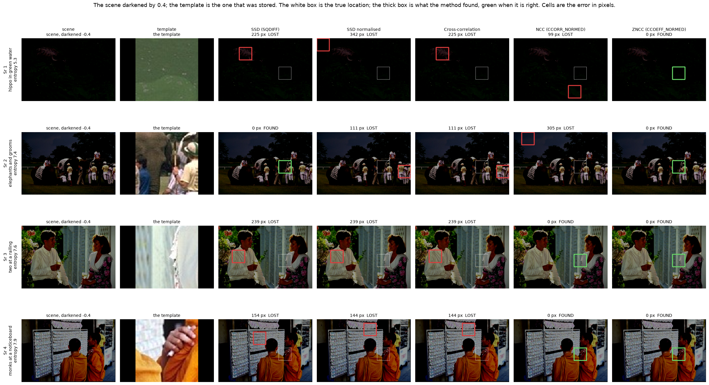
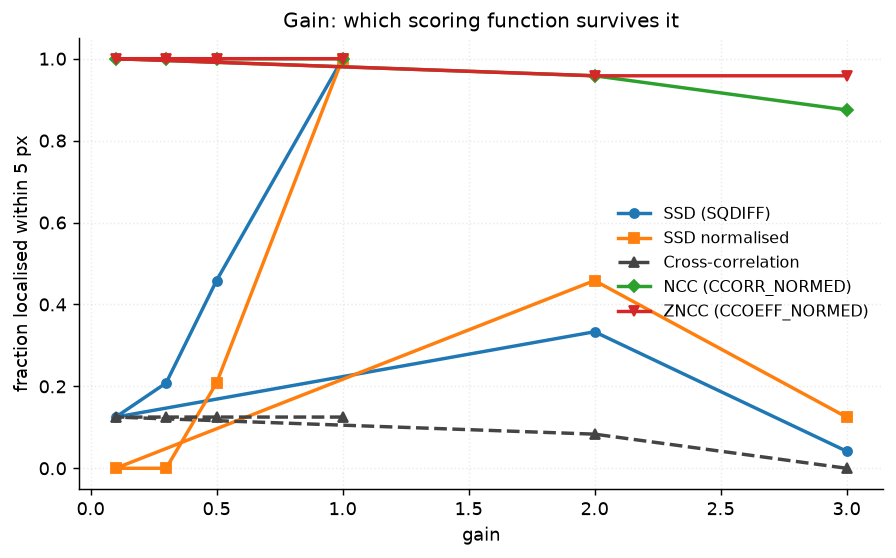
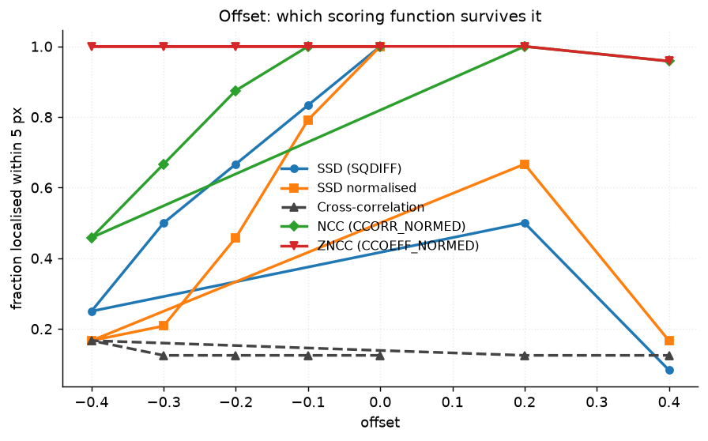
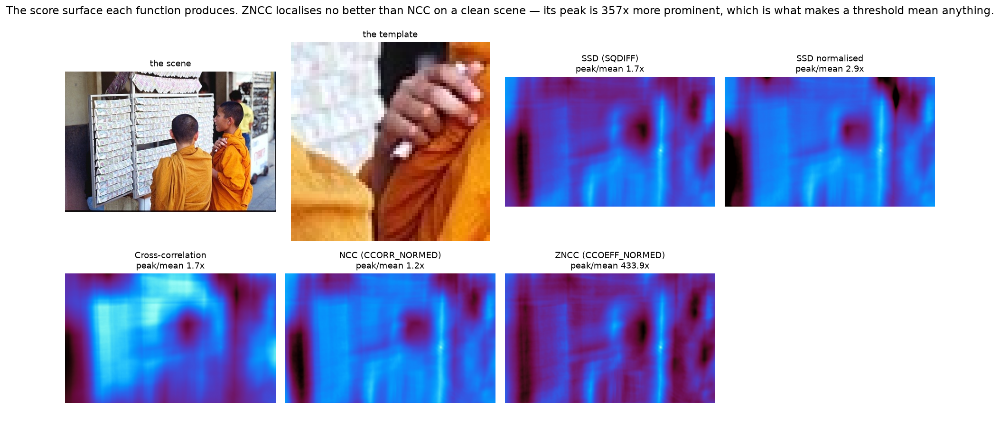
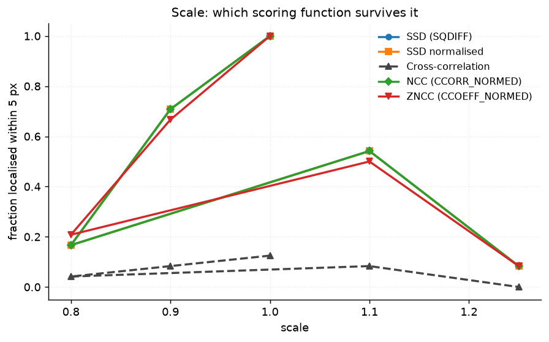
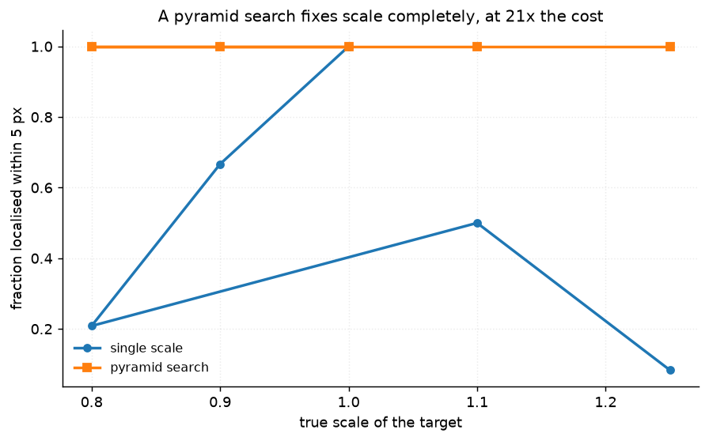

# 37 · Template matching — classical computer vision

[](https://www.python.org/)
[](https://opencv.org/)
[](#)
[](#)

Five scoring functions, twelve photographs, and the exact brightness change each
one survives. The template is cropped from the image itself, so the true location
is known to the pixel and the error is reported in pixels rather than as a
detection rate.

> **The claim under test:** SSD fails the moment brightness changes, NCC survives
> a brightness *scale* but not an *offset*, and ZNCC survives both. All three
> halves are true — but it takes a **negative** offset to show the middle one,
> and on a clean scene NCC and ZNCC are indistinguishable by error and differ by
> **357×** in something the error never reports.

**No neural network, no training, no GPU.**

---

## Results

Four scenes darkened by 0.4, one row each. The white box is the true location;
the thick box is what the method found, green when it is within 5 px.



| Sr | Scene | SSD | SSD normalised | Cross-correlation | NCC | **ZNCC** |
|---:|---|---:|---:|---:|---:|---:|
| 1 | hippo in green water · entropy 5.3 | 225 | 342 | 225 | 99 | **0** |
| 2 | elephants and grooms · entropy 7.4 | **0** | 111 | 111 | 305 | **0** |
| 3 | two at a railing · entropy 7.6 | 239 | 239 | 239 | **0** | **0** |
| 4 | monks at a noticeboard · entropy 7.9 | 154 | 144 | 144 | **0** | **0** |

*Localisation error in pixels.* Row 1 is the extreme case: subtracting 0.4
crushes that scene to a **mean brightness of 1.0 out of 255**, and ZNCC still
puts the box exactly on the target.

And with nothing wrong with the scene at all:

| Method | Success rate | Mean error (px) | Time (ms) |
|---|---:|---:|---:|
| SSD (SQDIFF) | **1.000** | 0.00 | 5.46 |
| SSD normalised | **1.000** | 0.00 | 5.93 |
| **Cross-correlation** | **0.111** | **160.01** | 2.01 |
| NCC (CCORR_NORMED) | **1.000** | 0.00 | 2.64 |
| ZNCC (CCOEFF_NORMED) | **1.000** | 0.00 | 3.87 |

> **Raw cross-correlation localises one template in nine on undegraded
> photographs.** Unnormalised correlation is maximised by whatever region has the
> largest magnitude, so it finds the brightest patch rather than the matching
> one — 160 px out on average with nothing degraded. Normalising is not a
> refinement of the method; it *is* the method.

---

## The invariances, and the sign that reveals them



| Gain | 1.0 | 0.5 | 0.3 | **0.1** | 2.0 | 3.0 |
|---|---:|---:|---:|---:|---:|---:|
| SSD (SQDIFF) | 1.000 | 0.458 | 0.208 | 0.125 | 0.333 | 0.042 |
| SSD normalised | 1.000 | 0.208 | 0.000 | **0.000** | 0.458 | 0.125 |
| NCC | 1.000 | 1.000 | 1.000 | **1.000** | 0.958 | 0.875 |
| ZNCC | 1.000 | 1.000 | 1.000 | **1.000** | 0.958 | 0.958 |

**At a tenth of the brightness NCC still localises every template and SSD
normalised localises none.** Dividing by the standard deviation is exactly a
scale invariance, and the sweep has to reach 10× before the claim is visible at
all — at the usual gentle 0.9 every method still works.



| Offset | 0.0 | −0.1 | −0.2 | −0.3 | **−0.4** | +0.2 | +0.4 |
|---|---:|---:|---:|---:|---:|---:|---:|
| SSD (SQDIFF) | 1.000 | 0.833 | 0.667 | 0.500 | 0.250 | 0.500 | 0.083 |
| SSD normalised | 1.000 | 0.792 | 0.458 | 0.208 | 0.167 | 0.667 | 0.167 |
| NCC | 1.000 | 1.000 | 0.875 | 0.667 | **0.458** | 1.000 | 0.958 |
| **ZNCC** | 1.000 | 1.000 | 1.000 | 1.000 | **1.000** | 1.000 | 0.958 |

> **ZNCC holds 1.000 at every negative offset; NCC falls to 0.458.** Subtracting
> the mean is exactly an offset invariance, and NCC does not subtract the mean.
>
> **It takes a negative offset to show it.** Brightening clips at white and
> destroys the structure for everyone — at +0.4 NCC and ZNCC both sit at 0.958
> and the difference between them is invisible. Darkening clips only in the
> shadows, which leaves enough for a mean-subtracting method and not enough for
> anything else. A sweep over positive offsets alone would have reported that
> NCC and ZNCC are equivalent.

The algebra says the same thing with no image search involved. ZNCC of a patch
against `a·patch + b` is 1.0 for any positive `a` and any `b`:

| gain, offset | NCC | ZNCC |
|---|---:|---:|
| 0.6, 0.0 | 0.99999 | 0.99998 |
| 1.0, +0.2 | **0.98705** | 0.98972 |
| 0.6, +0.2 | **0.98352** | **0.99998** |

---

## What the error column cannot tell you



On a clean scene NCC and ZNCC both localise every template perfectly. They are
not equivalent:

| Method | Peak / surrounding mean |
|---|---:|
| SSD (SQDIFF) | 1.68 |
| SSD normalised | 2.85 |
| Cross-correlation | 1.70 |
| NCC (CCORR_NORMED) | **1.22** |
| **ZNCC (CCOEFF_NORMED)** | **433.94** |

**ZNCC's peak stands 357× further above its surroundings than NCC's.** Both are
right; only one of them is confidently right. NCC's response surface is nearly
flat — its correct answer is one noisy pixel away from being a different answer,
and a threshold on its score cannot distinguish "found it" from "found nothing".

This is why the surface is reported and not only the error. A method that is
accurate and unconfident fails silently the first time the target is absent.

---

## Scale is the failure no scoring function fixes



| True scale | 1.0 | 0.9 | 0.8 | 1.1 | 1.25 |
|---|---:|---:|---:|---:|---:|
| best of the five | 1.000 | 0.708 | 0.208 | 0.542 | **0.083** |

Every method collapses together, which is what says the problem is not the
scoring. A 64×64 template matched against a target 25% larger has no correct
answer to find.



| True scale | Single scale | **Pyramid** | Scale recovered to | Single (ms) | Pyramid (ms) |
|---|---:|---:|---:|---:|---:|
| 1.00 | 1.000 | **1.000** | 0.0000 | 3.9 | 81.2 |
| 0.90 | 0.667 | **1.000** | 0.0021 | 3.8 | 79.6 |
| 0.80 | 0.208 | **1.000** | 0.0000 | 3.8 | 78.9 |
| 1.10 | 0.500 | **1.000** | 0.0000 | 3.7 | 78.8 |
| 1.25 | 0.083 | **1.000** | 0.0000 | 3.8 | 81.3 |

**A 21-step pyramid search returns 1.000 at every scale and recovers the scale
itself to four decimal places, for 21× the time.** That is an unusually clean
trade: the cost is exactly the number of scales tried, and the benefit is total.

---

## Noise is the degradation it barely notices

| σ | 0 | 5 | 15 | 30 | 50 |
|---|---:|---:|---:|---:|---:|
| SSD | 1.000 | 1.000 | 1.000 | 1.000 | 0.958 |
| ZNCC | 1.000 | 1.000 | 1.000 | 0.958 | 0.875 |

A 64×64 template is a 4,096-pixel average, and averaging is what removes
zero-mean noise. Rotation is the middle case: everything survives 5°, and at 20°
the best method is at 0.083 — the same floor as raw cross-correlation.

---

## How the images were chosen

Twelve photographs selected by `tools/select_images.py --axis entropy`, spanning
5.3 to 7.9 bits. Entropy is the axis that decides whether template matching has a
chance at all: a template cut from a flat region is ambiguous no matter which
function scores it, so a pool at one end of this axis would be measuring the
pictures rather than the methods.

```
hippo_in_green_water   5.3    elephants_and_grooms   7.4
porcupine_on_a_branch  6.7    boy_in_a_wide_hat      7.5
leopard_in_bare_tree   7.0    boy_with_a_fish_trap   7.5
cricket_on_the_green   7.1    two_at_a_railing       7.6
weaver_at_her_loom     7.2    street_piper           7.7
bugling_elk            7.3    monks_at_a_noticeboard 7.9
```

Two are in the pool for a reason other than their entropy.
**`cricket_on_the_green`** has eleven near-identical white figures on a plain
field and **`boy_with_a_fish_trap`** is most of a frame of woven lattice — both
create genuine repeated structure, which is the failure a single best-peak search
cannot report. None of the twelve appears in any other project;
`tools/check_image_reuse.py` enforces that by perceptual hash.

---

## Try it on your own image

```bash
python infer.py scene.jpg template.png            # all five, side by side
python infer.py scene.jpg template.png --multiscale
python infer.py --photo two_at_a_railing --offset -0.4
```

It prints each method's best location, its score, and the **peak-to-mean ratio**
of its response surface — which is the number that says whether to believe the
answer. It also reports the runner-up peak, because a second peak nearly as tall
as the first means the scene contains something else that looks like your
template, and no single-answer matcher will tell you that.

---

## Limitations

* **The template is cropped from the same photograph it is searched in.** That
  makes the ground truth exact, and it makes every result an upper bound: a real
  template comes from a different camera, exposure and moment, and none of the
  invariances measured here covers that.
* **Success rates move in steps of 1/24** (twelve photographs × two seeds), so
  0.042 is the resolution. The differences reported — 1.000 against 0.458 — are
  far larger, but two rows four steps apart are not a ranking.
* **The degradations are applied to the whole scene uniformly.** Real brightness
  change is rarely uniform, and a gradient across the frame is a harder problem
  than either a gain or an offset. `sweep_brightness_*` could be extended to it;
  it is not, and the numbers here should be read as the easy case.
* **Peak-to-mean is computed over the whole response surface**, including the
  region near the peak itself. It is comparable between methods on the same scene
  and is not an absolute confidence.
* **Rotation and scale are applied about the image centre**, so a template near a
  corner moves further than one near the middle. The true location is tracked
  through the same matrix, so the ground truth is right, but the difficulty
  varies with where the crop landed.

---

## Tests

13 tests, run with `pytest projects/37_template_matching/tests -q`. Two check the
algebra directly with no image search involved, because an invariance that is
arithmetic should hold to five decimals or the implementation is wrong. The rest
pin the harness (the true location exact, the template never degraded) and every
finding: that raw correlation fails on clean photographs, that NCC is exactly
scale-invariant where SSD is not, that only ZNCC survives an offset and only a
negative one reveals it, that ZNCC and NCC localise identically and differ 357×
in confidence, that scale defeats every scoring function, and that a pyramid
search fixes it completely for 20× the cost.

---

## Keywords

template matching · matchTemplate · SSD · sum of squared differences ·
normalised cross-correlation · NCC · ZNCC · zero-mean normalised
cross-correlation · TM_CCOEFF_NORMED · TM_SQDIFF · response surface · peak to
sidelobe ratio · multi-scale matching · image pyramid · illumination invariance ·
classical computer vision · no deep learning · OpenCV · Python · CPU only ·
reproducible image processing experiments

## References

* Lewis, *Fast Normalized Cross-Correlation*, Vision Interface 1995.
* Brunelli, *Template Matching Techniques in Computer Vision*, Wiley 2009.
* Szeliski, *Computer Vision: Algorithms and Applications*, §8.1 — the
  brightness-change models these scoring functions correspond to.
* OpenCV documentation, `cv::matchTemplate` — the six formulae implemented.
