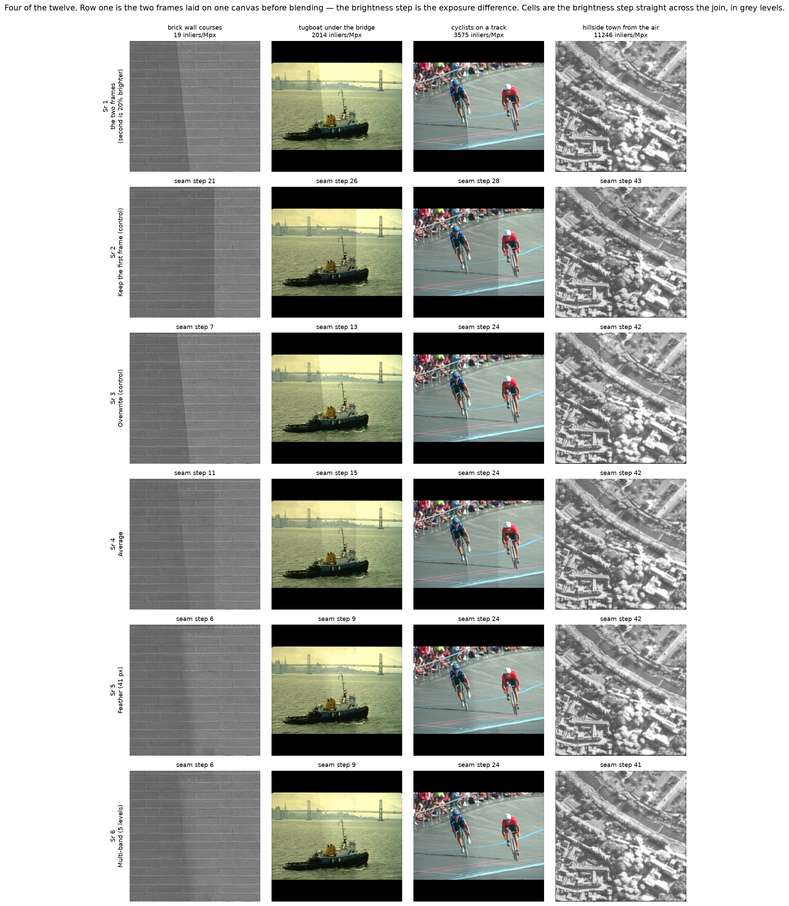
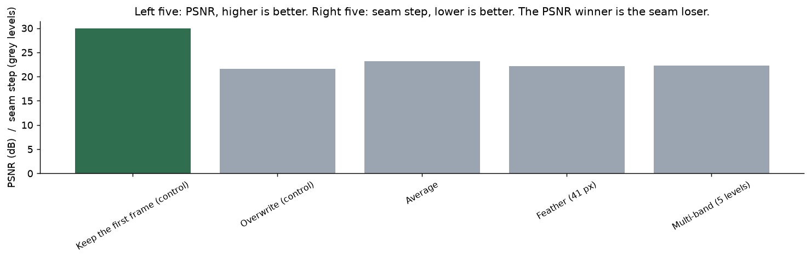
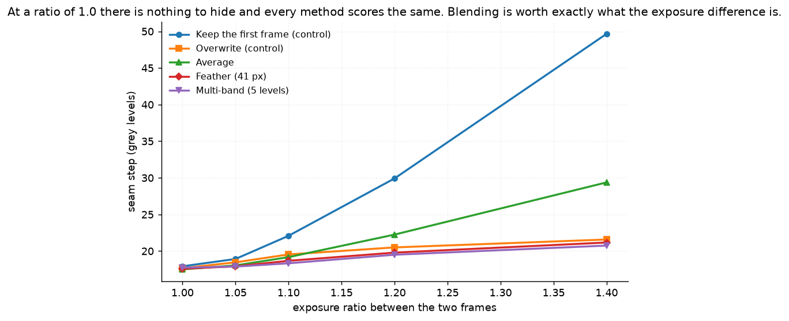
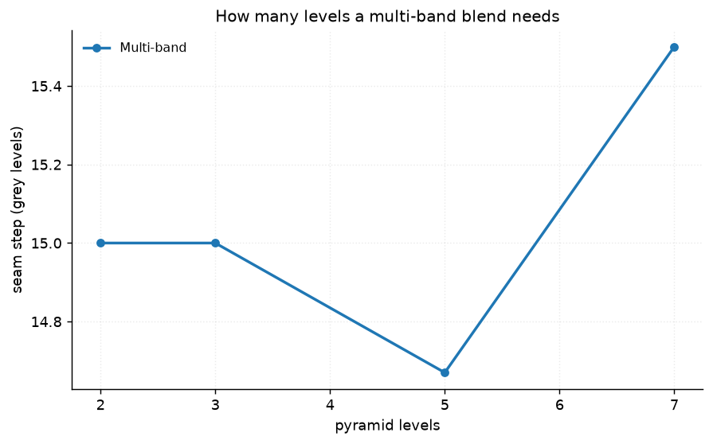
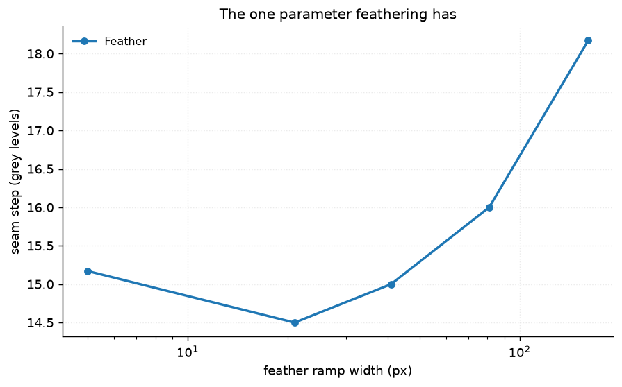
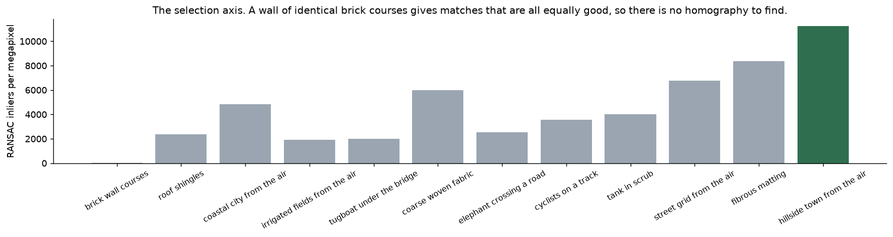
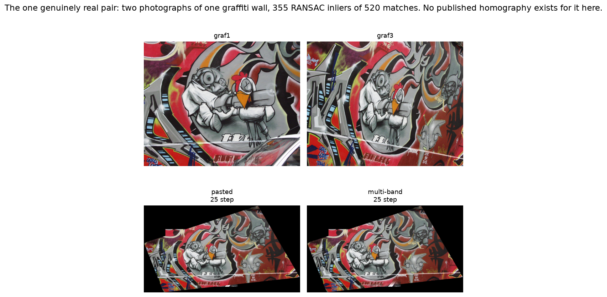

# 38 · Panorama stitching — classical computer vision

[](https://www.python.org/)
[](https://opencv.org/)
[](#)
[](#)

Warp one photograph onto another and join them. [Project 25](../25_matching_ransac/)
and [project 46](../46_epipolar_geometry/) already measured the *estimating*, so
this one is about what happens afterwards — the compositing, where a panorama
visibly succeeds or fails and which almost no write-up measures.

> **The obvious metric is a trap.** Scored by PSNR against the original
> photograph, the winner is the control that **does not stitch at all** — and it
> ranks **last of five** on the seam. The first frame *is* the original in its own
> region, so any blending that mixes the second frame in can only move away from
> it. **A panorama cannot be scored by fidelity to one of its own inputs.**

> **Measured at the seam, blending does its job.** With a 20% exposure difference
> — what auto-exposure does between two shots seconds apart — not stitching
> leaves a **29.9 grey-level** step across the join and a multi-band blend leaves **19.5**.

> **And with the exposures matched, blending is worth nothing.** Every method
> lands within **0.42 grey levels** of every other. At a 1.4× ratio the spread is
> **28.9**. A blender comparison run on matched exposures measures nothing at all.

**No neural network, no training, no GPU.**

---

## Results

Four of the twelve. Row 1 is the two frames laid on one canvas before blending —
the visible brightness step is the exposure difference. Cells are the brightness
step straight across the join, in grey levels; lower is better.



| Sr | Photograph | Inliers/Mpx | Keep the first frame (control) | Overwrite (control) | Average | Feather (41 px) | Multi-band (5) |
|---:|---|---:|---:|---:|---:|---:|---:|
| 1 | brick wall courses | **19** | 21 | 7 | 11 | **6** | **6** |
| 2 | tugboat under the bridge | 2,014 | 26 | 13 | 15 | **9** | **9** |
| 3 | cyclists on a track | 3,575 | 28 | 24 | 24 | 24 | 24 |
| 4 | hillside town from the air | 11,246 | 43 | 42 | 42 | 42 | **41** |

*Rows 3 and 4 are the honest bound on this result: **where the scene's own
gradients are large, no blender changes the number.** Blending is worth a lot on
a smooth scene and nothing on a busy one, and a mean over both understates the
first and overstates the second. A test pins that the spread is larger on the
smooth scene than on the busy one.*

| Blender | PSNR (dB) | Seam step | Seam visibility | |
|---|---:|---:|---:|---|
| **Keep the first frame (control)** | **23.853** | 29.9 | 1.257 | control |
| **Overwrite (control)** | 21.608 | 20.5 | 1.477 | control |
| Average | 23.194 | 22.2 | 1.289 |  |
| Feather (41 px) | 22.198 | 19.8 | 1.125 |  |
| Multi-band (5 levels) | 22.259 | **19.5** | 1.132 |  |

---

## The signature result: the two metrics are opposed



| Ranked by PSNR | Ranked by seam step |
|---|---|
| 1. **Keep the first frame (control)** | 1. Multi-band (5 levels) |
| 2. Average | 2. Feather (41 px) |
| 3. Multi-band (5 levels) | 3. Overwrite (control) |
| 4. Feather (41 px) | 4. Average |
| 5. **Overwrite (control)** | 5. **Keep the first frame (control)** |

**First on one list, last on the other.** This is not a close call or a tie — the
two orderings disagree at both ends.

The reason is structural rather than incidental. In this construction the truth
is the photograph the two frames were cut from, and the first frame reproduces it
*exactly* in its own region. So PSNR is maximised by using the first frame
wherever it exists and the second only where it must — which is precisely the
policy of **not blending**. Every real blender is penalised for doing its job.

That is not an artefact of a synthetic setup: it is true of any panorama metric
built on fidelity to a reference frame, and it is why the stitching literature
scores seams and not PSNR. The trap is easy to fall into because PSNR is the
default, it produces a clean-looking table, and nothing about the number says it
is answering a different question.

---

## Exposure is the whole story



| Exposure ratio | 1.00 | 1.05 | 1.10 | 1.20 | 1.40 |
|---|---:|---:|---:|---:|---:|
| Keep the first frame (control) | 17.9 | 18.9 | 22.1 | 29.9 | 49.7 |
| Overwrite (control) | 17.7 | 18.5 | 19.5 | 20.5 | 21.6 |
| Average | **17.5** | 18.0 | 19.2 | 22.2 | 29.4 |
| Feather (41 px) | 17.6 | 17.9 | 18.7 | 19.8 | 21.2 |
| **Multi-band (5 levels)** | 17.8 | **17.9** | **18.3** | **19.5** | **20.8** |
| **spread** | **0.42** | 1.04 | 3.75 | 10.42 | **28.92** |

**At a ratio of 1.00 the spread across all five methods is 0.42 grey levels.**
Every one of them, including the two controls, leaves a step of about 18 — which
is simply the scene's own texture, not a seam.

So the entire value of blending, on this data, is proportional to the exposure
difference it has to hide. A comparison of blenders on frames of matched exposure
is not a weak experiment; it is an experiment with no signal in it at all.

Real panoramas always have this difference, because auto-exposure runs between
the shots. That is what the blender is for.




Multi-band and feathering end up within 0.3 grey levels of each other here.
Multi-band's advantage — blending each spatial frequency over a distance
proportional to its wavelength — matters most when a *wide* low-frequency
difference has to be hidden without smearing fine detail, and a uniform exposure
multiplier is the easiest possible version of that.

---

## Registrability: the axis the twelve were chosen on



The selection axis is the project's own response: **RANSAC inliers per megapixel**
between the photograph and a known warp of itself.

| Photograph | Matches | Inliers | Inlier rate | Per Mpx |
|---|---:|---:|---:|---:|
| **brick wall courses** | **6** | **5** | 0.833 | **19** |
| roof shingles | 1,040 | 972 | 0.935 | 2,373 |
| coastal city from the air | 1,977 | 1,973 | 0.998 | 4,817 |
| irrigated fields from the air | 806 | 789 | 0.979 | 1,926 |
| tugboat under the bridge | 318 | 311 | 0.978 | 2,014 |
| coarse woven fabric | 2,460 | 2,457 | 0.999 | 5,998 |
| elephant crossing a road | 397 | 392 | 0.987 | 2,539 |
| cyclists on a track | 560 | 552 | 0.986 | 3,575 |
| tank in scrub | 1,057 | 1,050 | 0.993 | 4,005 |
| street grid from the air | 1,778 | 1,776 | 0.999 | 6,775 |
| fibrous matting | 2,199 | 2,197 | 0.999 | 8,381 |
| **hillside town from the air** | **743** | **737** | 0.992 | **11,246** |

**A factor of 589 between the ends**, and the floor is the interesting one: a wall
of identical brick courses produces **6 matches** that survive the ratio test at
all. Every course looks like every other, so Lowe's ratio — which rejects a match
whose second-best rival is nearly as good — rejects almost everything.

This is the single most common way a real stitch fails, and it is a property of
the *scene*, not of the algorithm. No blender can rescue a panorama that was never
registered.

It is also worth saying what the axis is **not**: the stock `texture` statistic
does not predict it. The brick wall scores 88.5 on texture — near the top of the
whole cache — and 19 on registrability.

---

## The one genuinely real pair



`graf1` and `graf3` from the Oxford graffiti set: two photographs of one wall from
two viewpoints.

| | |
|---|---|
| Matches surviving the ratio test | **520** |
| RANSAC inliers | **355** (68.3%) |
| Cycle error (warp there and back) | **3.13 px** |

**There is no external truth for this pair and none is claimed.** The Oxford set
publishes a homography for each pair, and those files 404 from the only reachable
host — 2 of the set's 11 files exist here. So what is reported is the match count,
the inlier rate, and cycle consistency.

Cycle error is a sanity check, not an accuracy: **H composed with its own inverse
is the identity whatever H is**, so a consistently wrong homography would pass it.
A test asserts that the docstring says so, which is what stops the number being
quietly upgraded later.

---

## Where the ground truth came from

Two sources, deliberately different.

**Synthetic homographies on real photographs.** A photograph is cut into two
overlapping frames by a **known** homography, so the truth is the matrix that was
used and the answer is the original image. The content is real; the viewpoint
change is constructed — which is the right way round, because the viewpoint change
is exactly what is being estimated. Project 08 uses the same arrangement for a
camera path.

**Each frame covers only 65% of the canvas**, leaving a 26% overlap strip.
An earlier version made the first frame the *whole* photograph, which made the
truth and the first frame identical: the do-nothing control scored an **infinite**
PSNR and the comparison measured nothing. A test now asserts neither frame alone
covers the canvas.

---

## Try it

```bash
python infer.py --image tugboat_under_the_bridge
python infer.py --image tugboat_under_the_bridge --exposure 1.0
python infer.py --image brick_wall_courses
python infer.py --real
```

Every run prints PSNR **and** the seam step side by side, so the disagreement is
visible on whatever photograph you pick. `--exposure 1.0` is the control that
shows blending being worth nothing, and `--real` stitches the graffiti pair.

---

## Limitations

* **The viewpoint change is synthetic** on eleven of the twelve. A real panorama
  pair also has parallax — objects at different depths move by different amounts,
  which no single homography can model — and this construction has none.
* **The exposure difference is a uniform multiplier.** A real one is a change of
  exposure time or aperture, which interacts with the tone curve and vignetting,
  and is not uniform across the frame.
* **No vignetting, no lens distortion, no moving objects.** Ghosting from a person
  who walked between the two shots is the other thing blenders are judged on, and
  it is not tested here.
* **The seam step is measured on vertical joins only**, because the frames are cut
  vertically. A real panorama seam is a curve chosen by a seam finder, which this
  project does not implement — every blender here uses the same geometric
  boundary.
* **Twelve photographs**, several of which are texture plates rather than scenes.
  They were chosen to span registrability, which they do across a factor of 589;
  they are not a sample of what people photograph.
* **PSNR is reported throughout even though the project's finding is that it is
  the wrong metric.** That is deliberate: removing it would hide the result.

---

## Tests

16 tests, run with `pytest projects/38_panorama_stitching/tests -q`. They pin the
result (the PSNR winner is the non-stitching control and ranks last on the seam;
blending beats pasting at the seam; the spread collapses at matched exposure and
grows with the exposure ratio), the bound on it (a busy scene hides its own seam,
so the spread is smaller there than on a smooth one), the construction (neither
frame alone covers the canvas, the overlap is a realistic fraction, the second
frame really is brighter, and every blender leaves the uncovered region alone),
and the real pair — including that no external truth exists for it.

The real-pair tests skip cleanly if `graf1`/`graf3` are not cached.

---

## Keywords

panorama stitching · image mosaicing · homography · RANSAC · feature matching ·
multi-band blending · Laplacian pyramid · feathering · exposure compensation ·
seam · alpha blending · registration · classical computer vision ·
no deep learning · OpenCV · Python · CPU only ·
reproducible image processing experiments

## References

* Burt & Adelson, *A Multiresolution Spline With Application to Image Mosaics*,
  ACM TOG 1983 — the multi-band blend implemented here.
* Brown & Lowe, *Automatic Panoramic Image Stitching using Invariant Features*,
  IJCV 2007 — the pipeline this project takes the second half of, and the source
  of the gain-compensation step whose absence the exposure sweep measures.
* Szeliski, *Image Alignment and Stitching: A Tutorial*, FnT CGV 2006 — on why
  panoramas are scored at the seam.
* Mikolajczyk et al., *A Comparison of Affine Region Detectors*, IJCV 2005 — the
  Oxford graffiti set, whose published homographies are unavailable here.
* Photographs come from BSDS500 and the USC-SIPI image database; provenance for
  each is recorded in `assets/real/README.md`.
